# baduk-AgenticWorkflow

**KataGo AI 대국 + 실시간 정책망 분석 데스크톱 바둑 앱** — 18개 AI 에이전트가 25-step 워크플로우로 자동 설계·구현한 플랫폼.

> 이 프로젝트는 "만능줄기세포" [AgenticWorkflow](https://github.com/idoforgod/AgenticWorkflow)로부터 태어난 **자식 시스템**입니다.
> 부모 프레임워크의 전체 게놈(헌법·구조·검증·안전·기억·비판·투명)을 내장합니다.

---

## 주요 기능

| 기능 | 설명 |
|------|------|
| **KataGo AI 대국** | 프로 9단 이상 수준 (g170-b20c256x2, 200 visits, Metal GPU 가속) |
| **실시간 정책망 분석** | 매 수마다 상위 5개 후보 수 + 승률 + 점수 리드 SVG 오버레이 |
| **SVG 바둑판** | 9×9, 13×13, 19×19 지원. Tap-Preview-Confirm 인터랙션 |
| **Tromp-Taylor 규칙 엔진** | 130+ 테스트 검증된 순수 TypeScript 구현 |
| **자동 KataGo 업데이트** | `/play` 명령으로 최신 릴리스 자동 확인 + 다운로드 + 빌드 |
| **다국어 지원** | 한국어, 영어, 일본어 (i18next) |

## 기술 스택

```
Frontend:  React 19 + TypeScript (strict) + Tailwind CSS 4 + Zustand + shadcn/ui
Backend:   Tauri 2.0 (Rust) + SQLite WAL + 29개 Tauri 커맨드
AI Engine: KataGo v1.16.4 Analysis Engine (JSON-line IPC, std::process)
Build:     Vite 7 + Biome v2.3 + Vitest
CI/CD:     GitHub Actions (macOS / Windows / Linux)
```

## 빠른 시작

### 사전 요구사항

- **Node.js** 18+ / **Rust** stable / **Tauri 2 CLI**: `cargo install tauri-cli`

### 한 줄 설치 + 실행

```bash
git clone https://github.com/idoforgod/baduk-AgenticWorkflow.git
cd baduk-AgenticWorkflow/app
bash scripts/auto-update-katago.sh
```

자동 수행: GitHub 최신 KataGo 확인 → 모델 다운로드 (87MB) → Tauri 빌드 → 앱 실행

### 개발 모드

```bash
cd app && npm install && npx tauri dev
```

## 프로젝트 구조

```
baduk-AgenticWorkflow/
│
├── 🎮 app/                          ← Tauri 2.0 데스크톱 앱
│   ├── src/                          React + TypeScript 프론트엔드
│   │   ├── rules-engine/             Tromp-Taylor 규칙 (130+ 테스트)
│   │   ├── katago-bridge/            KataGo IPC + GPU 감지 + 난이도
│   │   ├── explanation-engine/       "왜?" 3-tier 설명 템플릿
│   │   ├── game-engine/              Zustand 게임 상태 관리
│   │   ├── components/board/         SVG 바둑판 + PolicyOverlay
│   │   ├── hooks/                    useAiOpponent, useKataGoAnalysis
│   │   ├── screens/                  6개 화면 (Home, QuickGo, Game...)
│   │   └── features/                 Quick Go, 게이미피케이션, 온보딩
│   ├── src-tauri/                    Rust 백엔드 (29개 커맨드)
│   │   ├── src/commands/katago.rs    KataGo 프로세스 관리
│   │   ├── binaries/                 KataGo 사이드카 바이너리
│   │   └── resources/                설정 + 모델 (gitignored)
│   └── scripts/auto-update-katago.sh 자동 업데이트 스크립트
│
├── 📋 prompt/workflow.md             ← 25-step 메인 워크플로우 정의
├── 📊 outputs/                       ← 워크플로우 산출물 (연구·설계·구현)
├── 🤖 .claude/agents/                ← 18개 전문 에이전트 정의
├── 📚 docs/                          ← 20개 도메인 연구 + 5개 프로토콜
│
├── BADUK-ARCHITECTURE-AND-PHILOSOPHY.md   자식 시스템 아키텍처
├── BADUK-USER-MANUAL.md                   자식 시스템 사용자 매뉴얼
│
└── 🧬 부모 DNA (상속)
    ├── CLAUDE.md / AGENTS.md / soul.md
    └── AGENTICWORKFLOW-*.md               부모 프레임워크 문서
```

## 워크플로우 파이프라인 (25 Steps)

```mermaid
graph LR
    subgraph "Phase 1: Research (5 steps)"
        S1["1. Tech Validation"] --> S2["2. KataGo IPC Spec"]
        S2 --> S3["3. Domain Knowledge"]
        S3 --> S4["4. Template Design"]
        S4 --> S5{"5. Human Review"}
    end

    subgraph "Phase 2: Planning (4 steps)"
        S5 --> S6["6. Architecture"]
        S6 --> S7["7. Data Model"]
        S7 --> S8["8. Test Strategy"]
        S8 --> S9{"9. Human Review"}
    end

    subgraph "Phase 3: M1 Core (6 steps)"
        S9 --> S10["10. Scaffold"]
        S10 --> S11["11. Rules + DB"]
        S11 --> S12["12. KataGo Bridge"]
        S12 --> S13["13. Explanation Engine"]
        S13 --> S14["14. Integration"]
        S14 --> S15{"15. M1 Go/No-Go"}
    end

    subgraph "Phase 3: M2 UI (5 steps)"
        S15 --> S17["17. Board UI + i18n"]
        S17 --> S18["18. Quick Go"]
        S18 --> S19["19. CI/CD"]
        S19 --> S21["21. QA"]
        S21 --> S22{"22. M2 Go/No-Go"}
    end

    subgraph "Phase 3: M3 Release (3 steps)"
        S22 --> S23["23. Features"]
        S23 --> S24["24. Release"]
        S24 --> S25{"25. Final Approval"}
    end
```



## 에이전트 생태계 (18개)

| 에이전트 | 역할 | Step |
|---------|------|------|
| `@tech-validator` | Tauri + React + KataGo 호환성 검증 | 1 |
| `@katago-researcher` | KataGo Analysis Engine 프로토콜 연구 | 2 |
| `@domain-expert` | 바둑 도메인 지식 체계 구축 | 3 |
| `@template-designer` | "왜?" 설명 템플릿 3-tier 설계 | 4 |
| `@architect` | 모듈러 모놀리스 아키텍처 설계 | 6 |
| `@schema-designer` | SQLite 스키마 + TypeScript 인터페이스 | 7 |
| `@strategy-planner` | 테스트 전략 + 병렬 실행 계획 | 8 |
| `@katago-integrator` | KataGo 사이드카 IPC 구현 | 12 |
| `@template-engineer` | 설명 엔진 V1 구현 | 13 |
| `@game-developer` | Quick Go 게임 플로우 구현 | 18 |
| `@devops-engineer` | GitHub Actions CI/CD | 19 |
| `@qa-engineer` | 50+ 테스트 케이스 E2E 검증 | 21 |
| `@release-engineer` | 릴리스 패키징 + 마케팅 콘텐츠 | 24 |
| `@reviewer` | 적대적 코드/산출물 리뷰 | 전 단계 |
| `@translator` | 영→한 glossary 기반 번역 | 전 단계 |
| `@fact-checker` | 외부 소스 사실 검증 | 연구 단계 |

## 부모-자식 문서 분리

이 프로젝트는 **만능줄기세포**(AgenticWorkflow)와 **자식 시스템**(baduk-AgenticWorkflow)을 구분합니다.

| 접두사 | 범위 | 설명 |
|--------|------|------|
| `AGENTICWORKFLOW-*.md` | 부모 | 방법론, 프레임워크, DNA 유전 정의 |
| `BADUK-*.md` | 자식 | 바둑 도메인 고유 아키텍처, 사용법 |
| `CLAUDE.md`, `AGENTS.md`, `soul.md` | 공유 | 부모로부터 상속, 자식이 활용 |

자식 시스템은 부모 프레임워크 문서 없이도 **독립적으로 이해·운영** 가능합니다.

## 문서 읽기 순서

| 독자 유형 | 순서 |
|----------|------|
| **앱 사용자** | README → [`BADUK-USER-MANUAL.md`](BADUK-USER-MANUAL.md) |
| **개발자** | README → [`BADUK-ARCHITECTURE-AND-PHILOSOPHY.md`](BADUK-ARCHITECTURE-AND-PHILOSOPHY.md) → [`BADUK-USER-MANUAL.md`](BADUK-USER-MANUAL.md) |
| **워크플로우 학습자** | README → [`prompt/workflow.md`](prompt/workflow.md) → [`AGENTICWORKFLOW-ARCHITECTURE-AND-PHILOSOPHY.md`](AGENTICWORKFLOW-ARCHITECTURE-AND-PHILOSOPHY.md) |
| **프레임워크 학습자** | [`AGENTICWORKFLOW-ARCHITECTURE-AND-PHILOSOPHY.md`](AGENTICWORKFLOW-ARCHITECTURE-AND-PHILOSOPHY.md) → [`AGENTICWORKFLOW-USER-MANUAL.md`](AGENTICWORKFLOW-USER-MANUAL.md) → `soul.md` |

## KataGo 업데이트

```bash
# Claude Code에서:
/play

# 또는 터미널에서:
cd app && bash scripts/auto-update-katago.sh
```

## 라이선스

이 프로젝트의 소스 코드는 자유롭게 사용할 수 있습니다.
KataGo는 [MIT License](https://github.com/lightvector/KataGo/blob/master/LICENSE)로 배포됩니다.

---

**Built with [AgenticWorkflow](https://github.com/idoforgod/AgenticWorkflow)** — AI 에이전트 워크플로우 자동화 프레임워크
