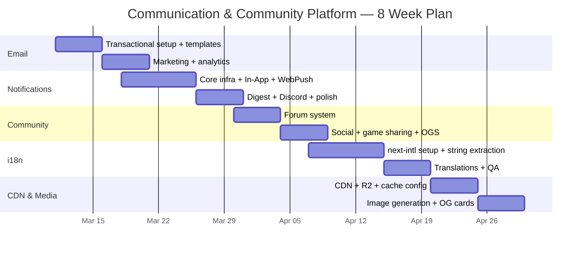

# Baduk Communication & Community Platform PRD — Comprehensive Integration Research

**Version**: 1.0
**Date**: 2026-03-10
**Scope**: Email, Notifications, Community, i18n, Content Delivery & Media
**Pre-conditions**: MAU 8K, Tech Stack v1.0 (Node.js 22 LTS, Next.js 15, PG 16, Redis 7.2, Drizzle, Biome, Coolify+Hetzner)
**Builder**: AI Agents (Claude Code) — no human developers
**Retention Target**: 20%+ 1-year retention (vs OGS benchmark 5%)

---

## Executive Summary

This document specifies five interconnected systems that transform the baduk app from a game-playing tool into a **living community platform**. The retention gap between OGS (5%) and our target (20%) will be bridged primarily by communication cadence (email + notifications keeping users engaged) and community gravity (social features + content sharing creating switching costs).

**Total monthly cost at MAU 8K**: ~$25-45/mo (all systems combined)
**Implementation timeline**: 8 weeks (parallel AI agent execution)
**Build vs Buy ratio**: 70% build / 30% integrate (external services)

| System | Primary Service | Monthly Cost | Build Time |
|--------|----------------|-------------|------------|
| Email | Resend | $0 (free tier) | 2 weeks |
| Notifications | Self-built + web-push | $0 | 2.5 weeks |
| Community | Self-built (PG) | $0 | 2 weeks |
| i18n | next-intl | $0 | 1.5 weeks |
| CDN & Media | Cloudflare (free) + R2 | ~$1-3/mo | 1.5 weeks |

---

## Table of Contents

1. [Complete Email System](#1-complete-email-system)
2. [Notification System Architecture](#2-notification-system-architecture)
3. [Community Features Integration](#3-community-features-integration)
4. [Internationalization (i18n)](#4-internationalization-i18n)
5. [Content Delivery & Media](#5-content-delivery--media)
6. [Cross-System Database Schema](#6-cross-system-database-schema)
7. [Implementation Timeline](#7-implementation-timeline)
8. [Cost Summary](#8-cost-summary)

---

## 1. Complete Email System

### 1.1 Service Selection: Resend

**Decision: Resend** — over Amazon SES, SendGrid, and Postmark.

| Criteria | Resend | Amazon SES | SendGrid | Postmark |
|----------|--------|-----------|----------|----------|
| Free tier | 3,000/mo (100/day) | 0 (no free) | 100/day | 100/mo |
| Paid (50K emails) | $20/mo | ~$5/mo | $19.95/mo | $15/mo + overage |
| React Email native | Yes (built by same team) | No | No | No |
| DX quality | Excellent | Poor (raw infra) | Good | Good |
| Marketing emails | Yes (free: 1K contacts) | DIY | Yes | No (transactional only) |
| Next.js integration | First-class | Manual | SDK | SDK |
| Webhook events | Yes | Yes (SNS) | Yes | Yes |

**Why Resend wins for this project:**
1. **Free tier covers MAU 8K easily.** At 8K MAU, estimated monthly emails: ~2,000 transactional + ~500 marketing = 2,500. Free tier (3,000/mo) provides headroom.
2. **React Email integration is native.** Resend was built by the same team that created React Email. Templates render as React components with TypeScript support and hot-reload preview.
3. **AI agents can implement it fastest.** Single npm package (`resend`), one API route, React components for templates. No infrastructure configuration (unlike SES which requires domain verification, bounce handling, SNS topics, etc.).
4. **Marketing emails included.** Free tier allows unlimited sends to up to 1,000 contacts/month — sufficient for early retention campaigns.

**When to migrate:** At MAU 50K+ (~15,000 emails/month), evaluate Amazon SES ($0.10/1K) for cost savings. The abstraction layer below makes migration a config change.

### 1.2 Email Template System: React Email

**Decision: React Email** — over MJML.

| Criteria | React Email | MJML |
|----------|-------------|------|
| Language | JSX/TSX (React) | Custom markup (MJML) |
| Learning curve for React team | None | New DSL to learn |
| TypeScript support | Native | Via mjml-react wrapper |
| Preview server | Built-in (hot reload) | Requires separate setup |
| Cross-client compatibility | Good (improving) | Excellent (mature) |
| Ecosystem | Growing | Mature |
| Fits Next.js stack | Perfect | Requires compilation step |

**Rationale:** The entire app is React/Next.js. React Email means templates are just React components — same patterns, same tooling, same TypeScript. MJML would introduce a separate compilation pipeline and a domain-specific language that AI agents must context-switch into. The cross-client compatibility gap is narrowing and is acceptable for our use case (no complex marketing layouts needed).

### 1.3 Architecture

```
┌─────────────────────────────────────────────────────────┐
│                    Email Service Layer                   │
│                                                         │
│  ┌─────────────┐    ┌──────────────┐    ┌────────────┐ │
│  │ EmailRouter  │───▶│ TemplateEngine│───▶│  Resend    │ │
│  │ (queue-based)│    │ (React Email) │    │  API       │ │
│  └──────┬──────┘    └──────────────┘    └─────┬──────┘ │
│         │                                      │        │
│  ┌──────▼──────┐                        ┌─────▼──────┐ │
│  │ BullMQ      │                        │ Webhook    │ │
│  │ email queue  │                        │ Handler    │ │
│  └─────────────┘                        └────────────┘ │
└─────────────────────────────────────────────────────────┘
         │                                      │
         ▼                                      ▼
┌─────────────────┐                  ┌─────────────────┐
│  PostgreSQL     │                  │  email_events   │
│  email_log      │                  │  (opens, clicks)│
└─────────────────┘                  └─────────────────┘
```

### 1.4 Email Categories & Templates

#### Transactional Emails (triggered by user action)

| Template | Trigger | Priority | i18n |
|----------|---------|----------|------|
| `welcome` | User registration | High | Yes |
| `email-verification` | Email change/signup | High | Yes |
| `password-reset` | Password reset request | High | Yes |
| `game-invitation` | Opponent sends challenge | Medium | Yes |
| `game-ended` | Game concludes | Medium | Yes |
| `analysis-ready` | AI analysis completed | Medium | Yes |
| `payment-receipt` | Subscription payment | High | Yes |
| `subscription-expiring` | 7 days before expiry | High | Yes |
| `subscription-expired` | Subscription lapsed | High | Yes |
| `rank-changed` | User rank changes | Low | Yes |

#### Marketing Emails (lifecycle campaigns)

| Campaign | Target Segment | Timing | Goal |
|----------|---------------|--------|------|
| `onboarding-series` | New users (0-7 days) | Day 1, 3, 7 | First game completion |
| `win-streak` | Users with 3+ wins | After 3rd win | Reinforce engagement |
| `come-back` | Inactive 7 days | Day 7, 14, 30 | Reactivation |
| `rank-milestone` | Users near rank-up | When within 1 game | Motivate completion |
| `weekly-digest` | Active users (opt-in) | Every Monday | Habit formation |
| `new-feature` | All users | On release | Feature adoption |
| `puzzle-of-week` | All users (opt-in) | Every Friday | Weekly touchpoint |

#### Template Component Structure

```
emails/
├── components/
│   ├── Layout.tsx            ← Shared layout (logo, footer, unsubscribe)
│   ├── Button.tsx            ← CTA button (cross-client safe)
│   ├── GoBoard.tsx           ← Mini board position preview (static image)
│   ├── RankBadge.tsx         ← Rank display with icon
│   └── Footer.tsx            ← Unsubscribe link + legal text
├── transactional/
│   ├── Welcome.tsx
│   ├── EmailVerification.tsx
│   ├── PasswordReset.tsx
│   ├── GameInvitation.tsx
│   ├── GameEnded.tsx
│   ├── AnalysisReady.tsx
│   ├── PaymentReceipt.tsx
│   └── SubscriptionExpiring.tsx
├── marketing/
│   ├── OnboardingSeries.tsx   ← 3 variants (day 1/3/7)
│   ├── WeeklyDigest.tsx
│   ├── ComeBack.tsx
│   ├── RankMilestone.tsx
│   └── PuzzleOfWeek.tsx
└── preview/                   ← Dev-only preview data
    └── fixtures.ts
```

#### Example Template (Welcome Email)

```tsx
// emails/transactional/Welcome.tsx
import {
  Body, Container, Head, Heading, Html, Img,
  Link, Preview, Section, Text,
} from "@react-email/components";

interface WelcomeEmailProps {
  username: string;
  locale: "en" | "ko" | "ja" | "zh-CN" | "zh-TW";
}

const i18n = {
  en: {
    preview: "Welcome to Baduk AI — your journey begins",
    heading: "Welcome, {{username}}!",
    body: "You've joined a global community of Go players...",
    cta: "Play Your First Game",
  },
  ko: {
    preview: "바둑 AI에 오신 것을 환영합니다",
    heading: "환영합니다, {{username}}님!",
    body: "전 세계 바둑 기사들의 커뮤니티에 합류하셨습니다...",
    cta: "첫 대국 시작하기",
  },
  ja: {
    preview: "Baduk AIへようこそ",
    heading: "ようこそ、{{username}}さん！",
    body: "世界中の囲碁プレイヤーのコミュニティに参加しました...",
    cta: "最初の対局を始める",
  },
  // zh-CN, zh-TW...
};

export default function WelcomeEmail({ username, locale = "en" }: WelcomeEmailProps) {
  const t = i18n[locale];
  return (
    <Html lang={locale}>
      <Head />
      <Preview>{t.preview}</Preview>
      <Body style={main}>
        <Container style={container}>
          
          <Heading style={heading}>
            {t.heading.replace("{{username}}", username)}
          </Heading>
          <Text style={text}>{t.body}</Text>
          <Section style={ctaSection}>
            <Link href="https://baduk.ai/play" style={button}>
              {t.cta}
            </Link>
          </Section>
          <Footer locale={locale} />
        </Container>
      </Body>
    </Html>
  );
}
```

### 1.5 Unsubscribe Handling (CAN-SPAM + GDPR + RFC 8058)

**Three-layer unsubscribe compliance:**

#### Layer 1: One-Click List-Unsubscribe Header (RFC 8058)

Required by Gmail and Yahoo since June 2024 for bulk senders. Even at low volume, implementing it from day one protects deliverability.

```typescript
// Email headers added by the EmailRouter
const headers = {
  "List-Unsubscribe": `<https://baduk.ai/api/unsubscribe?token=${token}>, <mailto:unsubscribe@baduk.ai>`,
  "List-Unsubscribe-Post": "List-Unsubscribe=One-Click",
};
```

#### Layer 2: In-Email Unsubscribe Link

Every email footer contains a visible unsubscribe link. This is a CAN-SPAM and GDPR requirement.

```tsx
// emails/components/Footer.tsx
<Text style={footer}>
  <Link href={`https://baduk.ai/email-preferences?token=${token}`}>
    {t.managePreferences}
  </Link>
  {" | "}
  <Link href={`https://baduk.ai/api/unsubscribe?token=${token}&type=all`}>
    {t.unsubscribeAll}
  </Link>
</Text>
```

#### Layer 3: Granular Preference Center

Users can control each email category independently:

| Category | Default | User-Controllable |
|----------|---------|-------------------|
| Account security (password reset, verification) | Always on | No (security-critical) |
| Game notifications | On | Yes |
| Weekly digest | On | Yes |
| Marketing / promotions | On | Yes |
| New features | On | Yes |
| Puzzle of the week | Off | Yes |

#### Unsubscribe API Endpoint

```typescript
// app/api/unsubscribe/route.ts
export async function POST(req: Request) {
  const { token, type } = await parseRequest(req);
  const payload = verifyUnsubscribeToken(token); // JWT with userId + category

  if (type === "all") {
    await db.update(emailPreferences)
      .set({ marketingOptOut: true, digestOptOut: true, gameNotifOptOut: true })
      .where(eq(emailPreferences.userId, payload.userId));
  } else {
    await db.update(emailPreferences)
      .set({ [`${type}OptOut`]: true })
      .where(eq(emailPreferences.userId, payload.userId));
  }

  // Must honor within 48 hours (Google requirement) — we do it instantly
  return new Response("Unsubscribed", { status: 200 });
}

// Also handle GET for the header-based one-click (some clients use GET)
export async function GET(req: Request) {
  // Same logic, then redirect to confirmation page
  return redirect("/unsubscribed");
}
```

### 1.6 Email Analytics

Resend provides webhook events for tracking. We store these in PG for analysis.

| Event | What It Tells Us | Retention Signal |
|-------|-----------------|-----------------|
| `email.delivered` | Email reached inbox | Baseline |
| `email.opened` | User opened email | Engaged |
| `email.clicked` | User clicked CTA | Highly engaged |
| `email.bounced` | Invalid email | Clean list |
| `email.complained` | Marked as spam | Remove immediately |

```typescript
// app/api/webhooks/resend/route.ts
export async function POST(req: Request) {
  const event = await verifyResendWebhook(req);

  await db.insert(emailEvents).values({
    emailId: event.data.email_id,
    type: event.type,           // delivered | opened | clicked | bounced | complained
    metadata: event.data,
    occurredAt: new Date(event.created_at),
  });

  // Auto-actions
  if (event.type === "email.complained") {
    await unsubscribeUser(event.data.to, "all");
  }
  if (event.type === "email.bounced" && event.data.bounce_type === "hard") {
    await markEmailInvalid(event.data.to);
  }
}
```

#### Metrics Dashboard Queries

```sql
-- Open rate by template (last 30 days)
SELECT
  template_name,
  COUNT(*) FILTER (WHERE type = 'email.delivered') AS delivered,
  COUNT(*) FILTER (WHERE type = 'email.opened') AS opened,
  ROUND(
    COUNT(*) FILTER (WHERE type = 'email.opened')::numeric /
    NULLIF(COUNT(*) FILTER (WHERE type = 'email.delivered'), 0) * 100, 1
  ) AS open_rate_pct
FROM email_events e
JOIN email_log l ON e.email_id = l.resend_id
WHERE e.occurred_at > NOW() - INTERVAL '30 days'
GROUP BY template_name
ORDER BY open_rate_pct DESC;
```

### 1.7 Email Service Abstraction Layer

To enable future migration (e.g., to SES at scale), wrap Resend behind an interface:

```typescript
// lib/email/types.ts
interface EmailProvider {
  send(params: {
    to: string;
    subject: string;
    react: React.ReactElement;
    headers?: Record<string, string>;
    tags?: { name: string; value: string }[];
  }): Promise<{ id: string }>;

  sendBatch(params: {
    messages: Array<{ to: string; subject: string; react: React.ReactElement }>;
  }): Promise<{ ids: string[] }>;
}

// lib/email/providers/resend.ts
class ResendProvider implements EmailProvider {
  private client: Resend;

  constructor(apiKey: string) {
    this.client = new Resend(apiKey);
  }

  async send(params) {
    const result = await this.client.emails.send({
      from: "Baduk AI <noreply@baduk.ai>",
      ...params,
    });
    return { id: result.data.id };
  }
}
```

### 1.8 Database Schema (Email)

```sql
-- Email sending log
CREATE TABLE email_log (
  id            UUID PRIMARY KEY DEFAULT gen_random_uuid(),
  resend_id     TEXT,                         -- External provider ID
  user_id       UUID REFERENCES users(id),
  to_address    TEXT NOT NULL,
  template_name TEXT NOT NULL,                -- e.g., 'welcome', 'game-ended'
  category      TEXT NOT NULL,                -- 'transactional' | 'marketing'
  locale        TEXT NOT NULL DEFAULT 'en',
  subject       TEXT NOT NULL,
  metadata      JSONB DEFAULT '{}',           -- Template-specific data
  status        TEXT NOT NULL DEFAULT 'queued', -- queued | sent | delivered | failed
  sent_at       TIMESTAMPTZ,
  created_at    TIMESTAMPTZ NOT NULL DEFAULT NOW()
);

CREATE INDEX idx_email_log_user ON email_log(user_id);
CREATE INDEX idx_email_log_template ON email_log(template_name);
CREATE INDEX idx_email_log_status ON email_log(status);

-- Email engagement events (from Resend webhooks)
CREATE TABLE email_events (
  id          UUID PRIMARY KEY DEFAULT gen_random_uuid(),
  email_id    TEXT NOT NULL,                  -- Resend email ID
  type        TEXT NOT NULL,                  -- delivered | opened | clicked | bounced | complained
  metadata    JSONB DEFAULT '{}',
  occurred_at TIMESTAMPTZ NOT NULL,
  created_at  TIMESTAMPTZ NOT NULL DEFAULT NOW()
);

CREATE INDEX idx_email_events_email ON email_events(email_id);
CREATE INDEX idx_email_events_type ON email_events(type);

-- User email preferences
CREATE TABLE email_preferences (
  user_id              UUID PRIMARY KEY REFERENCES users(id),
  game_notifications   BOOLEAN NOT NULL DEFAULT TRUE,
  weekly_digest        BOOLEAN NOT NULL DEFAULT TRUE,
  marketing            BOOLEAN NOT NULL DEFAULT TRUE,
  new_features         BOOLEAN NOT NULL DEFAULT TRUE,
  puzzle_of_week       BOOLEAN NOT NULL DEFAULT FALSE,  -- Opt-in
  digest_frequency     TEXT NOT NULL DEFAULT 'weekly',   -- 'daily' | 'weekly' | 'never'
  preferred_locale     TEXT NOT NULL DEFAULT 'en',
  unsubscribed_all     BOOLEAN NOT NULL DEFAULT FALSE,
  updated_at           TIMESTAMPTZ NOT NULL DEFAULT NOW()
);
```

### 1.9 Cost Analysis (Email)

| Scenario | Monthly Emails | Resend Plan | Cost |
|----------|---------------|-------------|------|
| MAU 8K (current) | ~2,500 | Free (3,000/mo) | **$0/mo** |
| MAU 15K | ~5,000 | Pro ($20/mo, 50K) | $20/mo |
| MAU 50K | ~16,000 | Pro ($20/mo, 50K) | $20/mo |
| MAU 100K | ~35,000 | Pro ($20/mo, 50K) | $20/mo |
| MAU 200K | ~70,000 | Scale ($90/mo, 100K) | $90/mo |

**Conclusion:** Email costs remain $0 through the foreseeable growth period. The free tier is generous enough that paid plans are years away.

---

## 2. Notification System Architecture

### 2.1 Design Decision: Self-Built vs Novu

| Criteria | Self-Built | Novu (self-hosted) |
|----------|-----------|-------------------|
| Complexity | Moderate | High (Docker Compose, MongoDB, Redis) |
| Control | Full | Full (open source) |
| Channels | Custom per need | Email, SMS, Push, Chat, In-App |
| Infra cost at MAU 8K | $0 (existing PG + Redis) | +$20-40/mo (MongoDB + Novu services) |
| AI agent buildability | High (simple patterns) | Medium (large codebase to understand) |
| Maintenance | Own code | Track upstream updates |

**Decision: Self-built notification system.** At MAU 8K, Novu's infrastructure overhead (requires MongoDB, its own Redis, multiple services) is disproportionate. A self-built system using existing PG + Redis + BullMQ covers all requirements with ~800 LOC. When MAU exceeds 50K, re-evaluate Novu or Knock.

### 2.2 Architecture

```
┌──────────────────────────────────────────────────────────────────┐
│                    Notification Service                          │
│                                                                  │
│  ┌──────────────┐    ┌─────────────────┐    ┌────────────────┐  │
│  │ NotifCreator │───▶│ NotifRouter     │───▶│ Channel        │  │
│  │ (domain evt) │    │ (preferences +  │    │ Dispatchers    │  │
│  └──────────────┘    │  channel rules) │    │                │  │
│                      └────────┬────────┘    │ ┌────────────┐ │  │
│                               │             │ │ InApp (WS)  │ │  │
│                               │             │ ├────────────┤ │  │
│                               │             │ │ WebPush    │ │  │
│                               │             │ ├────────────┤ │  │
│                               │             │ │ Email      │ │  │
│                               │             │ ├────────────┤ │  │
│                               │             │ │ Discord WH │ │  │
│                               │             │ └────────────┘ │  │
│                               │             └────────────────┘  │
│                      ┌────────▼────────┐                        │
│                      │ BullMQ Queues   │                        │
│                      │ (per channel)   │                        │
│                      └─────────────────┘                        │
└──────────────────────────────────────────────────────────────────┘
         │                        │                    │
         ▼                        ▼                    ▼
┌─────────────────┐    ┌─────────────────┐  ┌──────────────────┐
│  PostgreSQL     │    │  Redis          │  │  External APIs   │
│  notifications  │    │  pub/sub + WS   │  │  Resend, Discord │
│  push_subs      │    │  state          │  │  Web Push        │
└─────────────────┘    └─────────────────┘  └──────────────────┘
```

### 2.3 Notification Types for Baduk

#### Game Notifications

| Type | Trigger | Channels | Priority |
|------|---------|----------|----------|
| `game.opponent_moved` | Opponent plays a move | In-App (WS), Web Push | High |
| `game.your_turn` | Reminder if no move in 1 hour (correspondence) | Web Push, Email | Medium |
| `game.time_warning` | Clock below 30 seconds | In-App (WS) only | Critical |
| `game.ended` | Game concludes (resign/pass/timeout) | In-App, Web Push, Email | High |
| `game.analysis_ready` | AI analysis completed | In-App, Web Push | Medium |
| `game.challenge_received` | Someone challenges you | In-App (WS), Web Push | High |
| `game.challenge_accepted` | Your challenge was accepted | In-App (WS) | Medium |

#### Social Notifications

| Type | Trigger | Channels | Priority |
|------|---------|----------|----------|
| `social.friend_request` | Someone sends friend request | In-App, Web Push | Medium |
| `social.friend_accepted` | Friend request accepted | In-App | Low |
| `social.message` | Direct message received | In-App (WS), Web Push | High |
| `social.mentioned` | Mentioned in forum post | In-App, Email (digest) | Medium |
| `social.game_shared` | Friend shared a game with you | In-App | Low |

#### Achievement Notifications

| Type | Trigger | Channels | Priority |
|------|---------|----------|----------|
| `achievement.rank_up` | Rating crosses rank threshold | In-App, Web Push, Email | High |
| `achievement.rank_down` | Rating drops below rank | In-App only | Low |
| `achievement.streak` | Win streak milestone (3, 5, 10) | In-App, Web Push | Medium |
| `achievement.puzzle_solved` | Daily puzzle completed | In-App | Low |
| `achievement.games_played` | Milestone (10, 50, 100, 500) | In-App, Email | Medium |
| `achievement.first_review` | First game review completed | In-App | Low |

#### System Notifications

| Type | Trigger | Channels | Priority |
|------|---------|----------|----------|
| `system.maintenance` | Scheduled maintenance | In-App, Email, Discord | High |
| `system.new_feature` | Feature release | In-App, Email | Low |
| `system.subscription_expiring` | 7 days before expiry | In-App, Email | High |
| `system.subscription_renewed` | Auto-renewal successful | Email | Medium |

### 2.4 Channel Implementations

#### Channel 1: In-App Notifications (WebSocket)

WebSocket is already required for the real-time game server. Notifications piggyback on the same connection.

```typescript
// lib/notifications/channels/inapp.ts
import { Server as SocketIOServer } from "socket.io";

class InAppChannel {
  constructor(private io: SocketIOServer) {}

  async dispatch(userId: string, notification: Notification) {
    // Store in DB first (for unread count, history)
    const stored = await db.insert(notifications).values({
      userId,
      type: notification.type,
      title: notification.title,
      body: notification.body,
      data: notification.data,
      read: false,
    }).returning();

    // Push via WebSocket if user is connected
    this.io.to(`user:${userId}`).emit("notification", {
      id: stored[0].id,
      type: notification.type,
      title: notification.title,
      body: notification.body,
      data: notification.data,
      createdAt: stored[0].createdAt,
    });
  }
}
```

**Client-side integration:**

```typescript
// hooks/useNotifications.ts
export function useNotifications() {
  const [unreadCount, setUnreadCount] = useState(0);
  const [notifications, setNotifications] = useState<Notification[]>([]);

  useEffect(() => {
    socket.on("notification", (notif) => {
      setNotifications(prev => [notif, ...prev]);
      setUnreadCount(prev => prev + 1);

      // Show toast for high-priority
      if (notif.priority === "high") {
        toast(notif.title, { description: notif.body });
      }
    });

    return () => socket.off("notification");
  }, []);

  const markAsRead = async (id: string) => {
    await fetch(`/api/notifications/${id}/read`, { method: "PATCH" });
    setUnreadCount(prev => Math.max(0, prev - 1));
  };

  return { notifications, unreadCount, markAsRead };
}
```

#### Channel 2: Web Push (Browser Notifications)

Self-built using the `web-push` npm package with VAPID keys. No third-party push service needed.

```typescript
// lib/notifications/channels/webpush.ts
import webpush from "web-push";

webpush.setVapidDetails(
  "mailto:admin@baduk.ai",
  process.env.VAPID_PUBLIC_KEY!,
  process.env.VAPID_PRIVATE_KEY!,
);

class WebPushChannel {
  async dispatch(userId: string, notification: Notification) {
    // Get all active subscriptions for this user (multiple browsers/devices)
    const subscriptions = await db.select()
      .from(pushSubscriptions)
      .where(and(
        eq(pushSubscriptions.userId, userId),
        eq(pushSubscriptions.isActive, true),
      ));

    const payload = JSON.stringify({
      title: notification.title,
      body: notification.body,
      icon: "/icons/notification-192.png",
      badge: "/icons/badge-72.png",
      data: {
        url: notification.data?.url ?? "/",
        type: notification.type,
      },
      tag: notification.type,  // Group by type (replaces older of same type)
    });

    await Promise.allSettled(
      subscriptions.map(async (sub) => {
        try {
          await webpush.sendNotification({
            endpoint: sub.endpoint,
            keys: { p256dh: sub.p256dh, auth: sub.auth },
          }, payload);
        } catch (error: any) {
          if (error.statusCode === 404 || error.statusCode === 410) {
            // Subscription expired or unsubscribed — deactivate
            await db.update(pushSubscriptions)
              .set({ isActive: false })
              .where(eq(pushSubscriptions.id, sub.id));
          }
        }
      }),
    );
  }
}
```

**Service Worker:**

```javascript
// public/sw.js
self.addEventListener("push", (event) => {
  const data = event.data.json();
  event.waitUntil(
    self.registration.showNotification(data.title, {
      body: data.body,
      icon: data.icon,
      badge: data.badge,
      data: data.data,
      tag: data.tag,
    }),
  );
});

self.addEventListener("notificationclick", (event) => {
  event.notification.close();
  event.waitUntil(
    clients.openWindow(event.notification.data.url),
  );
});
```

**Subscription API:**

```typescript
// app/api/push/subscribe/route.ts
export async function POST(req: Request) {
  const { subscription } = await req.json();
  const user = await getCurrentUser();

  await db.insert(pushSubscriptions).values({
    userId: user.id,
    endpoint: subscription.endpoint,
    p256dh: subscription.keys.p256dh,
    auth: subscription.keys.auth,
    expirationTime: subscription.expirationTime,
    userAgent: req.headers.get("user-agent") ?? "",
  }).onConflictDoUpdate({
    target: pushSubscriptions.endpoint,
    set: {
      p256dh: subscription.keys.p256dh,
      auth: subscription.keys.auth,
      isActive: true,
      updatedAt: new Date(),
    },
  });

  return Response.json({ ok: true });
}
```

#### Channel 3: Email Digest

Aggregates notifications into daily or weekly digests using BullMQ scheduled jobs.

```typescript
// lib/notifications/channels/email-digest.ts
class EmailDigestChannel {
  // Called by BullMQ cron job, not per-notification
  async sendDigest(frequency: "daily" | "weekly") {
    const users = await db.select()
      .from(emailPreferences)
      .where(eq(emailPreferences.digestFrequency, frequency));

    for (const user of users) {
      const since = frequency === "daily"
        ? subDays(new Date(), 1)
        : subDays(new Date(), 7);

      const pending = await db.select()
        .from(notifications)
        .where(and(
          eq(notifications.userId, user.userId),
          gt(notifications.createdAt, since),
          eq(notifications.digestSent, false),
        ))
        .orderBy(desc(notifications.createdAt));

      if (pending.length === 0) continue;

      await emailRouter.send({
        to: user.email,
        template: "digest",
        data: {
          notifications: pending,
          frequency,
          locale: user.preferredLocale,
        },
      });

      // Mark as digest-sent
      await db.update(notifications)
        .set({ digestSent: true })
        .where(inArray(notifications.id, pending.map(n => n.id)));
    }
  }
}

// BullMQ scheduler
digestQueue.add("daily-digest", {}, {
  repeat: { pattern: "0 9 * * *" },   // 9 AM UTC daily
});
digestQueue.add("weekly-digest", {}, {
  repeat: { pattern: "0 9 * * 1" },   // 9 AM UTC every Monday
});
```

#### Channel 4: Discord Webhook

Simple POST to Discord webhook URLs. No bot needed — webhooks are stateless.

```typescript
// lib/notifications/channels/discord.ts
class DiscordWebhookChannel {
  constructor(private webhookUrl: string) {}

  async dispatch(notification: Notification) {
    const embed = this.buildEmbed(notification);

    await fetch(this.webhookUrl, {
      method: "POST",
      headers: { "Content-Type": "application/json" },
      body: JSON.stringify({
        username: "Baduk AI",
        avatar_url: "https://cdn.baduk.ai/discord-avatar.png",
        embeds: [embed],
      }),
    });
  }

  private buildEmbed(notification: Notification) {
    const colors: Record<string, number> = {
      "system.maintenance": 0xFF0000,    // Red
      "system.new_feature": 0x00FF00,    // Green
      "achievement.rank_up": 0xFFD700,   // Gold
      "game.ended": 0x0099FF,            // Blue
    };

    return {
      title: notification.title,
      description: notification.body,
      color: colors[notification.type] ?? 0x808080,
      timestamp: new Date().toISOString(),
      footer: { text: "Baduk AI" },
      ...(notification.data?.url && {
        url: `https://baduk.ai${notification.data.url}`,
      }),
    };
  }
}
```

**Discord use cases for the Go app:**
- `#game-highlights` — Notable games (large rank difference upsets, long games)
- `#announcements` — System maintenance, new features
- `#community` — New rank achievements (optional opt-in by users)
- `#dev-alerts` — Error rates, system health (internal)

### 2.5 Notification Router (Orchestrator)

The central router checks user preferences and dispatches to appropriate channels:

```typescript
// lib/notifications/router.ts
type ChannelRule = {
  channel: "inapp" | "webpush" | "email" | "email_digest" | "discord";
  condition?: (ctx: { user: User; notification: Notification }) => boolean;
};

const NOTIFICATION_RULES: Record<string, ChannelRule[]> = {
  "game.opponent_moved": [
    { channel: "inapp" },
    { channel: "webpush", condition: ({ user }) => !isUserOnline(user.id) },
  ],
  "game.ended": [
    { channel: "inapp" },
    { channel: "webpush" },
    { channel: "email", condition: ({ user }) => user.prefs.gameNotifications },
  ],
  "game.analysis_ready": [
    { channel: "inapp" },
    { channel: "webpush", condition: ({ user }) => !isUserOnline(user.id) },
  ],
  "social.friend_request": [
    { channel: "inapp" },
    { channel: "webpush", condition: ({ user }) => !isUserOnline(user.id) },
  ],
  "achievement.rank_up": [
    { channel: "inapp" },
    { channel: "webpush" },
    { channel: "email" },
    { channel: "discord" },  // Community celebration
  ],
  "system.maintenance": [
    { channel: "inapp" },
    { channel: "email" },
    { channel: "discord" },
  ],
  // ... all notification types
};

class NotificationRouter {
  async notify(userId: string, type: string, data: Record<string, any>) {
    const user = await getUser(userId);
    const prefs = await getUserNotificationPrefs(userId);
    const rules = NOTIFICATION_RULES[type] ?? [{ channel: "inapp" }];

    const notification: Notification = {
      type,
      title: this.buildTitle(type, data, prefs.locale),
      body: this.buildBody(type, data, prefs.locale),
      data,
      priority: this.getPriority(type),
    };

    // Check global mute
    if (prefs.mutedUntil && new Date() < prefs.mutedUntil) {
      // Still store in DB for history, but don't dispatch
      await this.channels.inapp.store(userId, notification);
      return;
    }

    for (const rule of rules) {
      const shouldSend = !rule.condition || rule.condition({ user, notification });
      if (shouldSend) {
        await notificationQueue.add(rule.channel, {
          userId,
          notification,
          channel: rule.channel,
        });
      }
    }
  }
}
```

### 2.6 Notification Preferences Schema

```typescript
// User-facing preferences UI
interface NotificationPreferences {
  // Global
  mutedUntil: Date | null;           // "Do not disturb" until this time
  quietHoursStart: string | null;    // "22:00" — no push during quiet hours
  quietHoursEnd: string | null;      // "08:00"
  timezone: string;                  // "Asia/Seoul"

  // Per-category toggles
  gameNotifications: boolean;        // opponent_moved, game_ended, etc.
  socialNotifications: boolean;      // friend_request, message, etc.
  achievementNotifications: boolean; // rank_up, streak, etc.
  systemNotifications: boolean;      // maintenance (always in-app, toggle push/email)

  // Channel preferences
  webPushEnabled: boolean;
  emailDigestFrequency: "daily" | "weekly" | "never";
  discordLinked: boolean;            // User linked their Discord
  discordDmEnabled: boolean;         // Send DMs (requires bot, future feature)
}
```

### 2.7 Database Schema (Notifications)

```sql
-- Core notification storage
CREATE TABLE notifications (
  id           UUID PRIMARY KEY DEFAULT gen_random_uuid(),
  user_id      UUID NOT NULL REFERENCES users(id) ON DELETE CASCADE,
  type         TEXT NOT NULL,                -- e.g., 'game.opponent_moved'
  title        TEXT NOT NULL,
  body         TEXT NOT NULL,
  data         JSONB DEFAULT '{}',           -- Type-specific payload
  priority     TEXT NOT NULL DEFAULT 'medium', -- low | medium | high | critical
  read         BOOLEAN NOT NULL DEFAULT FALSE,
  read_at      TIMESTAMPTZ,
  digest_sent  BOOLEAN NOT NULL DEFAULT FALSE,
  created_at   TIMESTAMPTZ NOT NULL DEFAULT NOW()
);

CREATE INDEX idx_notifications_user_unread ON notifications(user_id, read)
  WHERE read = FALSE;
CREATE INDEX idx_notifications_user_created ON notifications(user_id, created_at DESC);
CREATE INDEX idx_notifications_digest ON notifications(user_id, digest_sent, created_at)
  WHERE digest_sent = FALSE;

-- Auto-cleanup: delete notifications older than 90 days
-- (Run via pg_cron or BullMQ scheduled job)
-- DELETE FROM notifications WHERE created_at < NOW() - INTERVAL '90 days';

-- Web Push subscriptions
CREATE TABLE push_subscriptions (
  id              UUID PRIMARY KEY DEFAULT gen_random_uuid(),
  user_id         UUID NOT NULL REFERENCES users(id) ON DELETE CASCADE,
  endpoint        TEXT NOT NULL UNIQUE,        -- Push service endpoint URL
  p256dh          TEXT NOT NULL,               -- Browser-generated public key
  auth            TEXT NOT NULL,               -- Authentication secret
  expiration_time TIMESTAMPTZ,
  user_agent      TEXT,                        -- For device identification
  is_active       BOOLEAN NOT NULL DEFAULT TRUE,
  created_at      TIMESTAMPTZ NOT NULL DEFAULT NOW(),
  updated_at      TIMESTAMPTZ NOT NULL DEFAULT NOW()
);

CREATE INDEX idx_push_subs_user ON push_subscriptions(user_id)
  WHERE is_active = TRUE;

-- Notification preferences
CREATE TABLE notification_preferences (
  user_id                    UUID PRIMARY KEY REFERENCES users(id) ON DELETE CASCADE,
  muted_until                TIMESTAMPTZ,
  quiet_hours_start          TIME,             -- e.g., '22:00'
  quiet_hours_end            TIME,             -- e.g., '08:00'
  timezone                   TEXT NOT NULL DEFAULT 'UTC',
  game_notifications         BOOLEAN NOT NULL DEFAULT TRUE,
  social_notifications       BOOLEAN NOT NULL DEFAULT TRUE,
  achievement_notifications  BOOLEAN NOT NULL DEFAULT TRUE,
  system_notifications       BOOLEAN NOT NULL DEFAULT TRUE,
  web_push_enabled           BOOLEAN NOT NULL DEFAULT TRUE,
  email_digest_frequency     TEXT NOT NULL DEFAULT 'weekly',  -- daily | weekly | never
  discord_webhook_url        TEXT,             -- User's personal webhook (optional)
  updated_at                 TIMESTAMPTZ NOT NULL DEFAULT NOW()
);
```

### 2.8 Cost Analysis (Notifications)

| Component | Cost at MAU 8K |
|-----------|---------------|
| In-App (WebSocket) | $0 (existing Socket.IO server) |
| Web Push (VAPID) | $0 (browser push APIs are free) |
| Email Digest | $0 (uses Resend free tier) |
| Discord Webhook | $0 (Discord webhooks are free) |
| Redis (BullMQ queues) | $0 (existing Redis instance) |
| PostgreSQL storage | $0 (existing PG instance) |
| **Total** | **$0/mo** |

Web Push is genuinely free — VAPID authentication is handled directly between your server and browser push endpoints (Google FCM, Mozilla autopush, Apple APNs). There is no intermediary service to pay for.

---

## 3. Community Features Integration

### 3.1 Forum/Discussion System

**Decision: Self-built lightweight thread system in PostgreSQL** — not Discourse, not Flarum.

| Criteria | Self-Built (PG) | Discourse (self-hosted) | Flarum |
|----------|-----------------|------------------------|--------|
| Infra cost | $0 | +$15-20/mo (2GB VPS) | +$10-15/mo |
| Complexity | Low (~500 LOC) | High (Docker, Ruby, Redis, PG) | Medium (PHP, MySQL) |
| SSO integration | Native (same auth) | OAuth2 setup needed | OAuth2 setup needed |
| Feature richness | Basic (sufficient) | Full forum (overkill) | Medium |
| AI agent buildability | High | Low (Ruby/Ember.js stack) | Medium |
| Look & feel consistency | Identical to app | Separate app, different UI | Separate app |
| SEO value | Integrated routes | Separate subdomain | Separate subdomain |
| Go-specific features | Custom (SGF embed, board) | Plugin needed | Plugin needed |

**Why self-built wins:**
1. MAU 8K does not generate enough discussion volume to justify a full forum platform. Expected: ~50-100 posts/week initially.
2. Discourse requires its own Ruby/Ember.js stack, a separate PostgreSQL database, and 2GB+ RAM — a completely separate infrastructure that AI agents (working in Node.js/Next.js) cannot maintain.
3. The killer feature for a Go community is **embedded board positions and SGF replay** in posts. This requires custom rendering that integrates with our existing Go board component. Building this natively is simpler than creating Discourse plugins.
4. When volume exceeds ~1,000 posts/week (MAU 30K+), evaluate Discourse migration via API.

#### Thread System Architecture

```
┌──────────────────────────────────────────────┐
│                Forum System                   │
│                                               │
│  Categories (fixed)                           │
│  ├── General Discussion                       │
│  ├── Game Reviews (SGF attachment)            │
│  ├── Strategy & Tactics                       │
│  ├── Tournaments                              │
│  ├── Bug Reports                              │
│  └── Introductions                            │
│                                               │
│  Thread                                       │
│  ├── Title, Body (Markdown + SGF blocks)      │
│  ├── Author, Category, Tags                   │
│  ├── Pinned, Locked flags                     │
│  ├── View count, Reply count                  │
│  └── Replies[]                                │
│      ├── Body (Markdown + SGF blocks)         │
│      ├── Author                               │
│      ├── Quoted reply reference               │
│      └── Reactions (like, helpful, insightful)│
└──────────────────────────────────────────────┘
```

**Markdown extension for SGF embedding:**

```markdown
<!-- Users write this in posts -->
```sgf
(;GM[1]FF[4]SZ[19];B[pd];W[dp];B[pp];W[dd])
```

<!-- Renders as an interactive mini-board with play/pause controls -->
```

#### Forum Database Schema

```sql
-- Forum categories (admin-managed)
CREATE TABLE forum_categories (
  id          TEXT PRIMARY KEY,               -- 'general', 'game-reviews', etc.
  name        JSONB NOT NULL,                 -- {"en": "General", "ko": "자유게시판", ...}
  description JSONB NOT NULL,
  sort_order  INT NOT NULL DEFAULT 0,
  post_count  INT NOT NULL DEFAULT 0,
  created_at  TIMESTAMPTZ NOT NULL DEFAULT NOW()
);

-- Forum threads
CREATE TABLE forum_threads (
  id            UUID PRIMARY KEY DEFAULT gen_random_uuid(),
  category_id   TEXT NOT NULL REFERENCES forum_categories(id),
  author_id     UUID NOT NULL REFERENCES users(id),
  title         TEXT NOT NULL,
  body          TEXT NOT NULL,                -- Markdown with SGF blocks
  locale        TEXT NOT NULL DEFAULT 'en',
  is_pinned     BOOLEAN NOT NULL DEFAULT FALSE,
  is_locked     BOOLEAN NOT NULL DEFAULT FALSE,
  view_count    INT NOT NULL DEFAULT 0,
  reply_count   INT NOT NULL DEFAULT 0,
  last_reply_at TIMESTAMPTZ,
  last_reply_by UUID REFERENCES users(id),
  created_at    TIMESTAMPTZ NOT NULL DEFAULT NOW(),
  updated_at    TIMESTAMPTZ NOT NULL DEFAULT NOW()
);

CREATE INDEX idx_threads_category ON forum_threads(category_id, is_pinned DESC, last_reply_at DESC);
CREATE INDEX idx_threads_author ON forum_threads(author_id);

-- Forum replies
CREATE TABLE forum_replies (
  id            UUID PRIMARY KEY DEFAULT gen_random_uuid(),
  thread_id     UUID NOT NULL REFERENCES forum_threads(id) ON DELETE CASCADE,
  author_id     UUID NOT NULL REFERENCES users(id),
  body          TEXT NOT NULL,                -- Markdown with SGF blocks
  quoted_reply  UUID REFERENCES forum_replies(id),  -- Reply-to reference
  created_at    TIMESTAMPTZ NOT NULL DEFAULT NOW(),
  updated_at    TIMESTAMPTZ NOT NULL DEFAULT NOW()
);

CREATE INDEX idx_replies_thread ON forum_replies(thread_id, created_at);

-- Reactions (polymorphic: works on threads and replies)
CREATE TABLE reactions (
  id          UUID PRIMARY KEY DEFAULT gen_random_uuid(),
  user_id     UUID NOT NULL REFERENCES users(id),
  target_type TEXT NOT NULL,                  -- 'thread' | 'reply'
  target_id   UUID NOT NULL,
  type        TEXT NOT NULL,                  -- 'like' | 'helpful' | 'insightful'
  created_at  TIMESTAMPTZ NOT NULL DEFAULT NOW(),
  UNIQUE(user_id, target_type, target_id, type)
);

CREATE INDEX idx_reactions_target ON reactions(target_type, target_id);
```

### 3.2 Social Features

#### Friends, Following, Blocking

```sql
-- Relationships (bidirectional friends, unidirectional follow/block)
CREATE TABLE user_relationships (
  id           UUID PRIMARY KEY DEFAULT gen_random_uuid(),
  user_id      UUID NOT NULL REFERENCES users(id) ON DELETE CASCADE,
  target_id    UUID NOT NULL REFERENCES users(id) ON DELETE CASCADE,
  type         TEXT NOT NULL,                 -- 'friend_pending' | 'friend' | 'following' | 'blocked'
  created_at   TIMESTAMPTZ NOT NULL DEFAULT NOW(),
  UNIQUE(user_id, target_id, type),
  CHECK(user_id != target_id)
);

CREATE INDEX idx_relationships_user ON user_relationships(user_id, type);
CREATE INDEX idx_relationships_target ON user_relationships(target_id, type);
```

**Friend request flow:**

```
User A sends request → INSERT (A→B, 'friend_pending')
                      → Notify B: "A wants to be your friend"

User B accepts       → UPDATE (A→B, 'friend') + INSERT (B→A, 'friend')
                      → Notify A: "B accepted your request"

User B declines      → DELETE (A→B, 'friend_pending')
                      → No notification to A (to prevent harassment)
```

**Block behavior:**
- Blocked users cannot: send friend requests, challenge to games, send messages, see your profile details (rank/games visible, activity hidden).
- Blocking is silent — the blocked user is not notified.
- Existing friendship is automatically removed when blocked.

#### User Profile Enhancements

```sql
-- User profile additions (extend existing users table or separate table)
CREATE TABLE user_profiles (
  user_id       UUID PRIMARY KEY REFERENCES users(id) ON DELETE CASCADE,
  bio           TEXT,                          -- Max 500 chars
  country       TEXT,                          -- ISO 3166-1 alpha-2
  preferred_board_size TEXT DEFAULT '19x19',   -- '9x9' | '13x13' | '19x19'
  favorite_pro  TEXT,                          -- e.g., "Lee Sedol"
  playing_style TEXT,                          -- 'aggressive' | 'territorial' | 'balanced'
  is_public     BOOLEAN NOT NULL DEFAULT TRUE,
  show_rank     BOOLEAN NOT NULL DEFAULT TRUE,
  show_games    BOOLEAN NOT NULL DEFAULT TRUE,
  updated_at    TIMESTAMPTZ NOT NULL DEFAULT NOW()
);
```

### 3.3 Game Sharing

#### Share Game Link

Every completed game gets a shareable URL: `https://baduk.ai/game/{gameId}`

The shared game page includes:
- Interactive board replay (step through moves)
- Player names, ranks, result
- AI analysis overlay (if available)
- OG image for social media preview (auto-generated)

#### SGF File Sharing

```typescript
// app/api/games/[id]/sgf/route.ts
export async function GET(req: Request, { params }: { params: { id: string } }) {
  const game = await getGame(params.id);
  if (!game) return new Response("Not found", { status: 404 });

  const sgf = generateSGF(game);

  return new Response(sgf, {
    headers: {
      "Content-Type": "application/x-go-sgf",
      "Content-Disposition": `attachment; filename="baduk-ai-${params.id}.sgf"`,
    },
  });
}
```

**SGF Generation:**

```typescript
// lib/sgf/generator.ts
function generateSGF(game: Game): string {
  const header = [
    `(;GM[1]FF[4]`,
    `CA[UTF-8]`,
    `AP[Baduk AI:1.0]`,
    `SZ[${game.boardSize}]`,
    `KM[${game.komi}]`,
    `RU[${game.rules}]`,        // Japanese | Chinese | Korean
    `PB[${game.blackPlayer.name}]`,
    `BR[${game.blackPlayer.rank}]`,
    `PW[${game.whitePlayer.name}]`,
    `WR[${game.whitePlayer.rank}]`,
    `DT[${formatDate(game.playedAt)}]`,
    `RE[${game.result}]`,        // B+R, W+3.5, etc.
    `SO[https://baduk.ai/game/${game.id}]`,
  ].join("");

  const moves = game.moves.map(m =>
    `;${m.color === "black" ? "B" : "W"}[${toSGFCoord(m.x, m.y)}]`
  ).join("");

  return `${header}${moves})`;
}

function toSGFCoord(x: number, y: number): string {
  // SGF uses a-s for 19x19 (a=0, s=18)
  return String.fromCharCode(97 + x) + String.fromCharCode(97 + y);
}
```

**SGF Upload (import games):**

```typescript
// app/api/games/import/route.ts
export async function POST(req: Request) {
  const formData = await req.formData();
  const file = formData.get("sgf") as File;

  if (!file || file.size > 1_000_000) {  // 1MB max
    return Response.json({ error: "Invalid file" }, { status: 400 });
  }

  const content = await file.text();
  const parsed = parseSGF(content);

  if (!parsed) {
    return Response.json({ error: "Invalid SGF format" }, { status: 400 });
  }

  const game = await db.insert(importedGames).values({
    userId: getCurrentUser().id,
    sgfContent: content,
    boardSize: parsed.boardSize,
    blackPlayer: parsed.blackPlayer,
    whitePlayer: parsed.whitePlayer,
    result: parsed.result,
    moveCount: parsed.moves.length,
    source: "upload",
  }).returning();

  return Response.json({ gameId: game[0].id });
}
```

### 3.4 OGS API Integration

**Import games from a user's OGS account:**

```typescript
// lib/ogs/client.ts

const OGS_API_BASE = "https://online-go.com/api/v1";

interface OGSClient {
  // Search for OGS user by username
  findUser(username: string): Promise<OGSUser | null>;

  // Get game list for a user (paginated)
  getGames(userId: number, page?: number): Promise<OGSGameList>;

  // Get single game details
  getGame(gameId: number): Promise<OGSGameDetail>;

  // Download SGF for a game
  getSGF(gameId: number): Promise<string>;
}

class OGSAPIClient implements OGSClient {
  async findUser(username: string): Promise<OGSUser | null> {
    const res = await fetch(`${OGS_API_BASE}/players?username=${encodeURIComponent(username)}`);
    const data = await res.json();
    return data.results?.[0] ?? null;
  }

  async getGames(userId: number, page = 1): Promise<OGSGameList> {
    const res = await fetch(
      `${OGS_API_BASE}/players/${userId}/games?page=${page}&page_size=50&ordering=-ended`
    );
    return res.json();
  }

  async getSGF(gameId: number): Promise<string> {
    const res = await fetch(`https://online-go.com/api/v1/games/${gameId}/sgf`);
    return res.text();
  }
}
```

**OGS Import Flow:**

```
1. User enters their OGS username
2. We search OGS API for the player
3. Display list of their recent games
4. User selects games to import
5. For each selected game:
   a. Download SGF from OGS
   b. Parse and store in our database
   c. Link to user's account as imported game
6. User can now review these games with our AI analysis
```

```typescript
// app/api/ogs/import/route.ts
export async function POST(req: Request) {
  const { ogsUsername, gameIds } = await req.json();
  const user = await getCurrentUser();

  const ogs = new OGSAPIClient();
  const ogsUser = await ogs.findUser(ogsUsername);

  if (!ogsUser) {
    return Response.json({ error: "OGS user not found" }, { status: 404 });
  }

  const imported = [];
  for (const gameId of gameIds) {
    const sgf = await ogs.getSGF(gameId);
    const parsed = parseSGF(sgf);

    const game = await db.insert(importedGames).values({
      userId: user.id,
      sgfContent: sgf,
      boardSize: parsed.boardSize,
      blackPlayer: parsed.blackPlayer,
      whitePlayer: parsed.whitePlayer,
      result: parsed.result,
      moveCount: parsed.moves.length,
      source: "ogs",
      externalId: String(gameId),
      externalUrl: `https://online-go.com/game/${gameId}`,
    }).returning();

    imported.push(game[0]);
  }

  return Response.json({ imported: imported.length });
}
```

**Rate limiting considerations:**
- OGS API does not publish official rate limits, but community guidance suggests staying under 1 request/second.
- Use a BullMQ queue with rate limiting for bulk imports: `limiter: { max: 1, duration: 1500 }`.
- Cache OGS user lookups in Redis (TTL 1 hour).

### 3.5 Imported Games Schema

```sql
CREATE TABLE imported_games (
  id             UUID PRIMARY KEY DEFAULT gen_random_uuid(),
  user_id        UUID NOT NULL REFERENCES users(id) ON DELETE CASCADE,
  sgf_content    TEXT NOT NULL,
  board_size     INT NOT NULL DEFAULT 19,
  black_player   TEXT,
  white_player   TEXT,
  result         TEXT,                         -- 'B+R', 'W+3.5', etc.
  move_count     INT NOT NULL DEFAULT 0,
  source         TEXT NOT NULL,                -- 'upload' | 'ogs' | 'kgs' | 'fox'
  external_id    TEXT,                         -- ID on source platform
  external_url   TEXT,                         -- Link back to source
  analysis_id    UUID,                         -- Reference to our AI analysis (if requested)
  tags           TEXT[] DEFAULT '{}',          -- User-applied tags
  is_public      BOOLEAN NOT NULL DEFAULT FALSE,
  created_at     TIMESTAMPTZ NOT NULL DEFAULT NOW()
);

CREATE INDEX idx_imported_user ON imported_games(user_id, created_at DESC);
CREATE INDEX idx_imported_source ON imported_games(source, external_id);
```

### 3.6 Cost Analysis (Community)

| Component | Cost at MAU 8K |
|-----------|---------------|
| Forum (PG tables) | $0 (existing database) |
| Social features (PG tables) | $0 |
| SGF storage (R2) | ~$0.10/mo (10K files x 5KB avg = 50MB) |
| OGS API | $0 (free public API) |
| **Total** | **~$0.10/mo** |

---

## 4. Internationalization (i18n)

### 4.1 Library Selection: next-intl

**Decision: next-intl** — over next-i18next.

| Criteria | next-intl | next-i18next |
|----------|-----------|-------------|
| App Router support | First-class, purpose-built | Adapted (originally for Pages Router) |
| Server Components | Native support | Limited/experimental |
| Bundle size | ~14KB | ~40KB (i18next core + react bindings) |
| TypeScript | Excellent (type-safe message keys) | Good |
| Middleware routing | Built-in `createMiddleware` | Manual setup |
| Static generation | `generateStaticParams` docs | Manual locale handling |
| Maintenance | Actively maintained, aligned with Next.js | Community-maintained adapter |

**Why next-intl:** The library was designed specifically for Next.js App Router with Server Components. It provides type-safe message access, built-in locale routing middleware, and seamless integration with `generateStaticParams` for static generation. The API is simpler and the bundle size smaller.

### 4.2 Supported Locales

| Locale | Code | Go Term | Coverage Priority |
|--------|------|---------|------------------|
| English | `en` | Go | Full (default) |
| Korean | `ko` | Baduk (바둑) | Full (primary market) |
| Japanese | `ja` | Igo (囲碁) | Full (major Go community) |
| Chinese (Simplified) | `zh-CN` | Weiqi (围棋) | Full (largest Go population) |
| Chinese (Traditional) | `zh-TW` | Weiqi (圍棋) | Full (Taiwan/HK market) |

**No RTL support needed:** Go has no significant Arabic/Hebrew-speaking community, so bidirectional text support is not required.

### 4.3 Architecture

```
app/
├── [locale]/                      ← Dynamic locale segment
│   ├── layout.tsx                 ← Root layout with locale provider
│   ├── page.tsx                   ← Home page
│   ├── play/
│   │   └── page.tsx
│   ├── review/
│   │   └── [gameId]/
│   │       └── page.tsx
│   ├── community/
│   │   └── page.tsx
│   └── settings/
│       └── page.tsx
├── not-found.tsx
└── layout.tsx                     ← Root layout (minimal, before locale)

i18n/
├── routing.ts                     ← Locale list + default locale config
├── request.ts                     ← Per-request locale/messages setup
└── navigation.ts                  ← Typed Link, redirect, usePathname

messages/
├── en/
│   ├── common.json                ← Shared strings (nav, footer, buttons)
│   ├── auth.json                  ← Login, signup, password reset
│   ├── game.json                  ← Game UI, board, controls
│   ├── review.json                ← AI review, analysis
│   ├── community.json             ← Forum, social
│   ├── settings.json              ← Preferences, account
│   ├── notifications.json         ← Notification strings
│   ├── errors.json                ← Error messages
│   └── go-terms.json              ← Go-specific terminology
├── ko/
│   ├── common.json
│   ├── game.json
│   ├── go-terms.json
│   └── ...
├── ja/
│   └── ...
├── zh-CN/
│   └── ...
└── zh-TW/
    └── ...
```

### 4.4 Configuration

```typescript
// i18n/routing.ts
import { defineRouting } from "next-intl/routing";

export const routing = defineRouting({
  locales: ["en", "ko", "ja", "zh-CN", "zh-TW"],
  defaultLocale: "en",
  localePrefix: "as-needed",  // No /en/ prefix for English (cleaner URLs)
});

// i18n/request.ts
import { getRequestConfig } from "next-intl/server";
import { routing } from "./routing";

export default getRequestConfig(async ({ requestLocale }) => {
  let locale = await requestLocale;
  if (!locale || !routing.locales.includes(locale as any)) {
    locale = routing.defaultLocale;
  }

  return {
    locale,
    messages: {
      ...(await import(`../messages/${locale}/common.json`)).default,
      ...(await import(`../messages/${locale}/game.json`)).default,
      ...(await import(`../messages/${locale}/go-terms.json`)).default,
      // Dynamic imports for other namespaces as needed
    },
  };
});

// middleware.ts
import createMiddleware from "next-intl/middleware";
import { routing } from "./i18n/routing";

export default createMiddleware(routing);

export const config = {
  matcher: ["/((?!api|_next|.*\\..*).*)"],
};
```

### 4.5 Go Terminology Dictionary

This is the most domain-critical i18n aspect. Go terminology varies significantly across cultures, and incorrect terms would immediately signal "not a real Go app" to serious players.

```json
// messages/en/go-terms.json
{
  "game": {
    "name": "Go",
    "boardSizes": {
      "9x9": "9×9",
      "13x13": "13×13",
      "19x19": "19×19"
    }
  },
  "opening": {
    "fuseki": "Opening (Fuseki)",
    "joseki": "Corner Sequence (Joseki)",
    "shimari": "Corner Enclosure",
    "kakari": "Corner Approach"
  },
  "middleGame": {
    "tesuji": "Tactical Move (Tesuji)",
    "sabaki": "Light Play (Sabaki)",
    "shinogi": "Surviving (Shinogi)",
    "moyo": "Framework (Moyo)"
  },
  "endgame": {
    "yose": "Endgame (Yose)",
    "sente": "Initiative (Sente)",
    "gote": "Losing Initiative (Gote)",
    "ko": "Ko"
  },
  "shapes": {
    "atari": "Atari",
    "hane": "Hane",
    "keima": "Knight's Move (Keima)",
    "kosumi": "Diagonal (Kosumi)",
    "nobi": "Solid Extension (Nobi)",
    "tobi": "One-Space Jump (Tobi)"
  },
  "scoring": {
    "territory": "Territory",
    "komi": "Komi",
    "moku": "Points",
    "jigo": "Draw (Jigo)"
  },
  "ranks": {
    "kyu": "Kyu",
    "dan": "Dan",
    "pro": "Professional"
  },
  "analysis": {
    "winrate": "Win Rate",
    "score": "Score Estimate",
    "bestMove": "Best Move",
    "mistake": "Mistake",
    "blunder": "Blunder",
    "variation": "Variation"
  }
}
```

```json
// messages/ko/go-terms.json
{
  "game": {
    "name": "바둑",
    "boardSizes": {
      "9x9": "9줄반",
      "13x13": "13줄반",
      "19x19": "정식반"
    }
  },
  "opening": {
    "fuseki": "포석",
    "joseki": "정석",
    "shimari": "굳힘",
    "kakari": "걸침"
  },
  "middleGame": {
    "tesuji": "수읽기",
    "sabaki": "사바키",
    "shinogi": "살아남기",
    "moyo": "모양"
  },
  "endgame": {
    "yose": "끝내기",
    "sente": "선수",
    "gote": "후수",
    "ko": "패"
  },
  "shapes": {
    "atari": "단수",
    "hane": "젖힘",
    "keima": "날일자",
    "kosumi": "대각선",
    "nobi": "늘림",
    "tobi": "한칸뜀"
  },
  "scoring": {
    "territory": "집",
    "komi": "덤",
    "moku": "집",
    "jigo": "빅"
  },
  "ranks": {
    "kyu": "급",
    "dan": "단",
    "pro": "프로"
  },
  "analysis": {
    "winrate": "승률",
    "score": "형세 판단",
    "bestMove": "최선의 수",
    "mistake": "실수",
    "blunder": "악수",
    "variation": "변화"
  }
}
```

```json
// messages/ja/go-terms.json
{
  "game": {
    "name": "囲碁",
    "boardSizes": {
      "9x9": "九路盤",
      "13x13": "十三路盤",
      "19x19": "十九路盤"
    }
  },
  "opening": {
    "fuseki": "布石",
    "joseki": "定石",
    "shimari": "シマリ",
    "kakari": "カカリ"
  },
  "middleGame": {
    "tesuji": "手筋",
    "sabaki": "サバキ",
    "shinogi": "シノギ",
    "moyo": "模様"
  },
  "endgame": {
    "yose": "ヨセ",
    "sente": "先手",
    "gote": "後手",
    "ko": "コウ"
  },
  "shapes": {
    "atari": "アタリ",
    "hane": "ハネ",
    "keima": "ケイマ",
    "kosumi": "コスミ",
    "nobi": "ノビ",
    "tobi": "トビ"
  },
  "scoring": {
    "territory": "地",
    "komi": "コミ",
    "moku": "目",
    "jigo": "持碁"
  },
  "ranks": {
    "kyu": "級",
    "dan": "段",
    "pro": "棋士"
  },
  "analysis": {
    "winrate": "勝率",
    "score": "形勢判断",
    "bestMove": "最善手",
    "mistake": "疑問手",
    "blunder": "悪手",
    "variation": "変化"
  }
}
```

```json
// messages/zh-CN/go-terms.json
{
  "game": {
    "name": "围棋",
    "boardSizes": {
      "9x9": "九路棋盘",
      "13x13": "十三路棋盘",
      "19x19": "十九路棋盘"
    }
  },
  "opening": {
    "fuseki": "布局",
    "joseki": "定式",
    "shimari": "守角",
    "kakari": "挂角"
  },
  "middleGame": {
    "tesuji": "手筋",
    "sabaki": "治孤",
    "shinogi": "腾挪",
    "moyo": "模样"
  },
  "endgame": {
    "yose": "收官",
    "sente": "先手",
    "gote": "后手",
    "ko": "劫"
  },
  "shapes": {
    "atari": "打吃",
    "hane": "扳",
    "keima": "飞",
    "kosumi": "尖",
    "nobi": "长",
    "tobi": "跳"
  },
  "scoring": {
    "territory": "目",
    "komi": "贴目",
    "moku": "目",
    "jigo": "和棋"
  },
  "ranks": {
    "kyu": "级",
    "dan": "段",
    "pro": "职业棋手"
  },
  "analysis": {
    "winrate": "胜率",
    "score": "形势判断",
    "bestMove": "最佳着",
    "mistake": "疑问手",
    "blunder": "恶手",
    "variation": "变化"
  }
}
```

### 4.6 Date/Time and Currency Formatting

next-intl integrates with the `Intl` browser API for locale-aware formatting:

```typescript
// Using next-intl's formatting utilities
import { useFormatter } from "next-intl";

function GameInfo({ game }) {
  const format = useFormatter();

  return (
    <div>
      {/* Date: "March 10, 2026" / "2026년 3월 10일" / "2026年3月10日" */}
      <time>{format.dateTime(game.playedAt, { dateStyle: "long" })}</time>

      {/* Relative time: "3 hours ago" / "3시간 전" / "3時間前" */}
      <span>{format.relativeTime(game.playedAt)}</span>

      {/* Currency: "$9.99" / "₩12,000" / "¥1,200" / "¥68" */}
      <span>{format.number(game.price, { style: "currency", currency: userCurrency })}</span>
    </div>
  );
}
```

**Currency mapping per locale:**

| Locale | Currency | Symbol | Subscription Price |
|--------|----------|--------|-------------------|
| en | USD | $ | $9.99/mo |
| ko | KRW | ₩ | ₩12,000/mo |
| ja | JPY | ¥ | ¥1,500/mo |
| zh-CN | CNY | ¥ | ¥68/mo |
| zh-TW | TWD | NT$ | NT$300/mo |

### 4.7 Translation Workflow

```
Developer writes English strings in messages/en/*.json
    ↓
AI translation pass (Claude) for ko, ja, zh-CN, zh-TW
    ↓
Human review by native speakers (community volunteers or paid)
    ↓
Go terminology cross-checked against Sensei's Library
    ↓
Merged into messages/{locale}/*.json
```

**Estimated string counts:**

| Namespace | Strings | Notes |
|-----------|---------|-------|
| common | ~120 | Nav, footer, buttons, errors |
| auth | ~40 | Login, signup, password |
| game | ~80 | Board UI, controls, status |
| review | ~60 | Analysis, comments, AI feedback |
| community | ~50 | Forum, social |
| settings | ~40 | Preferences, account |
| notifications | ~30 | Notification text templates |
| go-terms | ~60 | Domain terminology |
| errors | ~30 | Validation, API errors |
| **Total** | **~510** | Per language |

**Total translation effort**: 510 strings x 4 languages = **2,040 string translations**.

### 4.8 Cost Analysis (i18n)

| Component | Cost |
|-----------|------|
| next-intl library | $0 (open source) |
| AI initial translation | ~$5 (one-time, Claude API) |
| Community review | $0 (volunteer) or ~$200 one-time (paid) |
| Ongoing maintenance | Minimal (new strings added incrementally) |
| **Total** | **$0-200 one-time, $0/mo ongoing** |

---

## 5. Content Delivery & Media

### 5.1 CDN Selection: Cloudflare (Free Tier)

**Decision: Cloudflare Free Tier** — not BunnyCDN.

| Criteria | Cloudflare Free | BunnyCDN |
|----------|----------------|----------|
| Cost | $0/mo | ~$1-5/mo (PAYG $0.01/GB) |
| Bandwidth | Unmetered | Pay per GB |
| Global PoPs | 285+ cities | ~120 PoPs |
| DDoS protection | Included | Basic |
| DNS management | Included | Not included |
| SSL | Included | Included |
| Cache limit | 512MB per file | No limit |
| Image optimization | Not on free tier | Bunny Optimizer included |
| Average latency | ~28ms | ~24ms |

**Why Cloudflare Free wins at MAU 8K:**
1. **$0/mo vs $1-5/mo.** At MAU 8K with modest static asset sizes, monthly bandwidth is ~50-100GB. Cloudflare serves this for free; BunnyCDN would cost $0.50-1.00.
2. **DNS + DDoS + SSL bundled.** These would require separate services without Cloudflare.
3. **Sufficient performance.** The 4ms latency difference (28ms vs 24ms) is imperceptible for a board game app.
4. **When to reconsider:** If serving video content or needing image optimization on the edge, BunnyCDN's paid features become attractive. Not applicable to a Go app.

### 5.2 Object Storage: Cloudflare R2

**Decision: Cloudflare R2** — for SGF files, generated images, and user uploads.

| Feature | Cloudflare R2 | S3 | Backblaze B2 |
|---------|--------------|-----|-------------|
| Storage cost | $0.015/GB-mo | $0.023/GB-mo | $0.006/GB-mo |
| Egress cost | **$0** | $0.09/GB | $0.01/GB |
| Free tier | 10 GB storage | 5 GB (12 months) | 10 GB |
| S3 compatible | Yes | Yes | Yes |
| CDN integration | Native (Cloudflare) | CloudFront | Manual |
| Class A ops (write) | $4.50/million | $5.00/million | Free |
| Class B ops (read) | $0.36/million | $0.40/million | Free |

**Why R2:**
- **Zero egress fees** is the killer feature. At MAU 8K, read-heavy workloads (serving SGF files, board images) generate significant egress. R2 makes this free.
- **Native Cloudflare CDN integration** — R2 objects are served through Cloudflare's global network automatically.
- **S3-compatible API** — existing tooling (AWS SDK) works unchanged.

**Estimated storage at MAU 8K:**

| Content Type | Avg Size | Count/Month | Monthly Growth | Total Year 1 |
|-------------|---------|-------------|----------------|--------------|
| SGF files | 5 KB | 10,000 games | 50 MB | 600 MB |
| Board images (OG) | 50 KB | 10,000 | 500 MB | 6 GB |
| User avatars | 100 KB | 500 new | 50 MB | 600 MB |
| **Total** | | | | **~7.2 GB** |

**R2 cost for 7.2 GB**: $0.108/mo storage + $0 egress = **~$0.11/mo**

### 5.3 Board Position Image Generation

For social sharing (OG images, Discord embeds, forum previews), we need to render Go board positions as images.

#### Approach: Server-Side SVG → PNG

```typescript
// lib/board-image/generator.ts
import sharp from "sharp";

interface BoardPosition {
  size: 9 | 13 | 19;
  stones: Array<{ x: number; y: number; color: "B" | "W" }>;
  lastMove?: { x: number; y: number };
  markers?: Array<{ x: number; y: number; label: string }>;
}

function generateBoardSVG(position: BoardPosition): string {
  const cellSize = 30;
  const margin = 40;
  const boardSize = (position.size - 1) * cellSize + 2 * margin;

  let svg = `<svg xmlns="http://www.w3.org/2000/svg" width="${boardSize}" height="${boardSize}" viewBox="0 0 ${boardSize} ${boardSize}">`;

  // Board background
  svg += `<rect width="${boardSize}" height="${boardSize}" fill="#DCB35C"/>`;

  // Grid lines
  for (let i = 0; i < position.size; i++) {
    const pos = margin + i * cellSize;
    svg += `<line x1="${margin}" y1="${pos}" x2="${boardSize - margin}" y2="${pos}" stroke="#333" stroke-width="1"/>`;
    svg += `<line x1="${pos}" y1="${margin}" x2="${pos}" y2="${boardSize - margin}" stroke="#333" stroke-width="1"/>`;
  }

  // Star points (hoshi)
  const starPoints = getStarPoints(position.size);
  for (const [sx, sy] of starPoints) {
    const cx = margin + sx * cellSize;
    const cy = margin + sy * cellSize;
    svg += `<circle cx="${cx}" cy="${cy}" r="4" fill="#333"/>`;
  }

  // Stones
  for (const stone of position.stones) {
    const cx = margin + stone.x * cellSize;
    const cy = margin + stone.y * cellSize;
    const fill = stone.color === "B" ? "#111" : "#EEE";
    const stroke = stone.color === "B" ? "#000" : "#999";
    svg += `<circle cx="${cx}" cy="${cy}" r="${cellSize * 0.45}" fill="${fill}" stroke="${stroke}" stroke-width="1.5"/>`;
  }

  // Last move marker
  if (position.lastMove) {
    const cx = margin + position.lastMove.x * cellSize;
    const cy = margin + position.lastMove.y * cellSize;
    const lastStone = position.stones.find(
      s => s.x === position.lastMove!.x && s.y === position.lastMove!.y
    );
    const color = lastStone?.color === "B" ? "#FFF" : "#000";
    svg += `<circle cx="${cx}" cy="${cy}" r="${cellSize * 0.15}" fill="none" stroke="${color}" stroke-width="2"/>`;
  }

  svg += "</svg>";
  return svg;
}

async function generateBoardPNG(
  position: BoardPosition,
  width = 1200,
): Promise<Buffer> {
  const svg = generateBoardSVG(position);
  return sharp(Buffer.from(svg))
    .resize(width)
    .png()
    .toBuffer();
}

function getStarPoints(size: number): [number, number][] {
  if (size === 19) {
    return [
      [3, 3], [3, 9], [3, 15],
      [9, 3], [9, 9], [9, 15],
      [15, 3], [15, 9], [15, 15],
    ];
  }
  if (size === 13) {
    return [[3, 3], [3, 9], [6, 6], [9, 3], [9, 9]];
  }
  if (size === 9) {
    return [[2, 2], [2, 6], [4, 4], [6, 2], [6, 6]];
  }
  return [];
}
```

### 5.4 OG Image Generation (Social Sharing Cards)

Using Next.js built-in `ImageResponse` (via `@vercel/og` / Satori) for dynamic OG images.

```
┌──────────────────────────────────────────────────┐
│                                                  │
│   [Baduk AI Logo]                                │
│                                                  │
│   ┌────────────────────┐   Player A (3d) vs      │
│   │                    │   Player B (5d)          │
│   │   [Board Preview]  │                          │
│   │   (SVG rendered)   │   Result: B+3.5          │
│   │                    │   Moves: 243              │
│   └────────────────────┘   Date: 2026-03-10       │
│                                                  │
│   "Analyze this game at baduk.ai"                │
│                                                  │
└──────────────────────────────────────────────────┘
```

```typescript
// app/game/[id]/opengraph-image.tsx
import { ImageResponse } from "next/og";

export const runtime = "edge";
export const contentType = "image/png";
export const size = { width: 1200, height: 630 };

export default async function OGImage({ params }: { params: { id: string } }) {
  const game = await getGameSummary(params.id);

  return new ImageResponse(
    (
      <div style={{
        display: "flex",
        width: "100%",
        height: "100%",
        background: "linear-gradient(135deg, #1a1a2e 0%, #16213e 100%)",
        padding: "40px",
        color: "white",
        fontFamily: "sans-serif",
      }}>
        {/* Board preview (pre-rendered SVG as data URI) */}
        <div style={{ flex: "0 0 400px", marginRight: "40px" }}>
          
        </div>

        {/* Game info */}
        <div style={{ display: "flex", flexDirection: "column", justifyContent: "center" }}>
          <div style={{ fontSize: "24px", color: "#888", marginBottom: "16px" }}>
            Baduk AI
          </div>
          <div style={{ fontSize: "36px", fontWeight: "bold", marginBottom: "8px" }}>
            {game.blackPlayer} vs {game.whitePlayer}
          </div>
          <div style={{ fontSize: "24px", color: "#ccc", marginBottom: "8px" }}>
            {game.blackRank} vs {game.whiteRank}
          </div>
          <div style={{ fontSize: "28px", color: "#4CAF50", marginBottom: "24px" }}>
            Result: {game.result}
          </div>
          <div style={{ fontSize: "18px", color: "#888" }}>
            {game.moveCount} moves · {game.boardSize}×{game.boardSize}
          </div>
        </div>
      </div>
    ),
    { ...size },
  );
}
```

### 5.5 Image Optimization

Next.js built-in `<Image>` component with `sharp` handles optimization:

```typescript
// next.config.ts
const nextConfig = {
  images: {
    formats: ["image/avif", "image/webp"],
    remotePatterns: [
      {
        protocol: "https",
        hostname: "cdn.baduk.ai",  // R2 custom domain via Cloudflare
      },
    ],
    deviceSizes: [640, 750, 828, 1080, 1200, 1920],
    imageSizes: [16, 32, 48, 64, 96, 128, 256, 384],
  },
};
```

**Image pipeline:**

```
User uploads avatar (JPEG/PNG, max 5MB)
    ↓
Server-side: sharp resize to 256x256 + WebP conversion
    ↓
Upload to Cloudflare R2 (cdn.baduk.ai/avatars/{userId}.webp)
    ↓
Next.js <Image> serves with automatic format negotiation (AVIF > WebP > JPEG)
```

### 5.6 CDN Architecture

```
                    ┌────────────────────────┐
                    │   Cloudflare CDN       │
Users ──────────────│   (285+ PoPs)          │
                    │                        │
                    │   ┌──────────────────┐ │
                    │   │ Cache Rules      │ │
                    │   │ *.js, *.css → 1y │ │
                    │   │ *.webp, *.png → 30d│ │
                    │   │ *.sgf → 7d       │ │
                    │   │ /api/* → no cache│ │
                    │   └──────────────────┘ │
                    └───────┬────────────────┘
                            │
            ┌───────────────┼───────────────┐
            ▼               ▼               ▼
    ┌──────────────┐ ┌────────────┐ ┌──────────────┐
    │ Origin       │ │ R2 Bucket  │ │ OG Image     │
    │ (Next.js on  │ │ (SGF files,│ │ (Edge        │
    │  Hetzner)    │ │  avatars,  │ │  Function)   │
    │              │ │  board img)│ │              │
    └──────────────┘ └────────────┘ └──────────────┘
```

**Cache strategy:**

| Content | Cache Duration | Invalidation |
|---------|---------------|-------------|
| Static assets (JS, CSS, fonts) | 1 year | Hash-based filenames |
| Board images (generated) | 30 days | Immutable (position-based key) |
| SGF files | 7 days | On game update |
| User avatars | 7 days | Purge on change |
| API responses | No cache | N/A |
| OG images | 24 hours | Re-generate on request |

### 5.7 Cost Analysis (CDN & Media)

| Component | Cost at MAU 8K |
|-----------|---------------|
| Cloudflare CDN (free tier) | $0/mo |
| Cloudflare R2 (7.2 GB Year 1) | ~$0.11/mo |
| R2 operations (~100K reads/mo) | ~$0.04/mo |
| sharp (image processing) | $0 (open source) |
| @vercel/og (OG images) | $0 (open source, runs on own server) |
| **Total** | **~$0.15/mo** |

**Note on self-hosting:** Since the app runs on Coolify+Hetzner (not Vercel), `@vercel/og` / `ImageResponse` runs on the origin server rather than edge functions. This is fine at MAU 8K — OG images are only generated when a link is shared on social media, which is an infrequent operation. Cache the result in R2 for subsequent requests.

---

## 6. Cross-System Database Schema

### Complete Migration

```sql
-- ============================================================
-- Migration: Communication & Community Platform
-- ============================================================

-- 1. EMAIL SYSTEM
CREATE TABLE email_log (
  id            UUID PRIMARY KEY DEFAULT gen_random_uuid(),
  resend_id     TEXT,
  user_id       UUID REFERENCES users(id),
  to_address    TEXT NOT NULL,
  template_name TEXT NOT NULL,
  category      TEXT NOT NULL CHECK (category IN ('transactional', 'marketing')),
  locale        TEXT NOT NULL DEFAULT 'en',
  subject       TEXT NOT NULL,
  metadata      JSONB DEFAULT '{}',
  status        TEXT NOT NULL DEFAULT 'queued'
                CHECK (status IN ('queued', 'sent', 'delivered', 'failed')),
  sent_at       TIMESTAMPTZ,
  created_at    TIMESTAMPTZ NOT NULL DEFAULT NOW()
);

CREATE TABLE email_events (
  id          UUID PRIMARY KEY DEFAULT gen_random_uuid(),
  email_id    TEXT NOT NULL,
  type        TEXT NOT NULL CHECK (type IN ('delivered', 'opened', 'clicked', 'bounced', 'complained')),
  metadata    JSONB DEFAULT '{}',
  occurred_at TIMESTAMPTZ NOT NULL,
  created_at  TIMESTAMPTZ NOT NULL DEFAULT NOW()
);

CREATE TABLE email_preferences (
  user_id            UUID PRIMARY KEY REFERENCES users(id) ON DELETE CASCADE,
  game_notifications BOOLEAN NOT NULL DEFAULT TRUE,
  weekly_digest      BOOLEAN NOT NULL DEFAULT TRUE,
  marketing          BOOLEAN NOT NULL DEFAULT TRUE,
  new_features       BOOLEAN NOT NULL DEFAULT TRUE,
  puzzle_of_week     BOOLEAN NOT NULL DEFAULT FALSE,
  digest_frequency   TEXT NOT NULL DEFAULT 'weekly'
                     CHECK (digest_frequency IN ('daily', 'weekly', 'never')),
  preferred_locale   TEXT NOT NULL DEFAULT 'en',
  unsubscribed_all   BOOLEAN NOT NULL DEFAULT FALSE,
  updated_at         TIMESTAMPTZ NOT NULL DEFAULT NOW()
);

-- 2. NOTIFICATION SYSTEM
CREATE TABLE notifications (
  id           UUID PRIMARY KEY DEFAULT gen_random_uuid(),
  user_id      UUID NOT NULL REFERENCES users(id) ON DELETE CASCADE,
  type         TEXT NOT NULL,
  title        TEXT NOT NULL,
  body         TEXT NOT NULL,
  data         JSONB DEFAULT '{}',
  priority     TEXT NOT NULL DEFAULT 'medium'
               CHECK (priority IN ('low', 'medium', 'high', 'critical')),
  read         BOOLEAN NOT NULL DEFAULT FALSE,
  read_at      TIMESTAMPTZ,
  digest_sent  BOOLEAN NOT NULL DEFAULT FALSE,
  created_at   TIMESTAMPTZ NOT NULL DEFAULT NOW()
);

CREATE TABLE push_subscriptions (
  id              UUID PRIMARY KEY DEFAULT gen_random_uuid(),
  user_id         UUID NOT NULL REFERENCES users(id) ON DELETE CASCADE,
  endpoint        TEXT NOT NULL UNIQUE,
  p256dh          TEXT NOT NULL,
  auth            TEXT NOT NULL,
  expiration_time TIMESTAMPTZ,
  user_agent      TEXT,
  is_active       BOOLEAN NOT NULL DEFAULT TRUE,
  created_at      TIMESTAMPTZ NOT NULL DEFAULT NOW(),
  updated_at      TIMESTAMPTZ NOT NULL DEFAULT NOW()
);

CREATE TABLE notification_preferences (
  user_id                    UUID PRIMARY KEY REFERENCES users(id) ON DELETE CASCADE,
  muted_until                TIMESTAMPTZ,
  quiet_hours_start          TIME,
  quiet_hours_end            TIME,
  timezone                   TEXT NOT NULL DEFAULT 'UTC',
  game_notifications         BOOLEAN NOT NULL DEFAULT TRUE,
  social_notifications       BOOLEAN NOT NULL DEFAULT TRUE,
  achievement_notifications  BOOLEAN NOT NULL DEFAULT TRUE,
  system_notifications       BOOLEAN NOT NULL DEFAULT TRUE,
  web_push_enabled           BOOLEAN NOT NULL DEFAULT TRUE,
  email_digest_frequency     TEXT NOT NULL DEFAULT 'weekly'
                             CHECK (email_digest_frequency IN ('daily', 'weekly', 'never')),
  discord_webhook_url        TEXT,
  updated_at                 TIMESTAMPTZ NOT NULL DEFAULT NOW()
);

-- 3. COMMUNITY: FORUM
CREATE TABLE forum_categories (
  id          TEXT PRIMARY KEY,
  name        JSONB NOT NULL,
  description JSONB NOT NULL,
  sort_order  INT NOT NULL DEFAULT 0,
  post_count  INT NOT NULL DEFAULT 0,
  created_at  TIMESTAMPTZ NOT NULL DEFAULT NOW()
);

CREATE TABLE forum_threads (
  id            UUID PRIMARY KEY DEFAULT gen_random_uuid(),
  category_id   TEXT NOT NULL REFERENCES forum_categories(id),
  author_id     UUID NOT NULL REFERENCES users(id),
  title         TEXT NOT NULL,
  body          TEXT NOT NULL,
  locale        TEXT NOT NULL DEFAULT 'en',
  is_pinned     BOOLEAN NOT NULL DEFAULT FALSE,
  is_locked     BOOLEAN NOT NULL DEFAULT FALSE,
  view_count    INT NOT NULL DEFAULT 0,
  reply_count   INT NOT NULL DEFAULT 0,
  last_reply_at TIMESTAMPTZ,
  last_reply_by UUID REFERENCES users(id),
  created_at    TIMESTAMPTZ NOT NULL DEFAULT NOW(),
  updated_at    TIMESTAMPTZ NOT NULL DEFAULT NOW()
);

CREATE TABLE forum_replies (
  id            UUID PRIMARY KEY DEFAULT gen_random_uuid(),
  thread_id     UUID NOT NULL REFERENCES forum_threads(id) ON DELETE CASCADE,
  author_id     UUID NOT NULL REFERENCES users(id),
  body          TEXT NOT NULL,
  quoted_reply  UUID REFERENCES forum_replies(id),
  created_at    TIMESTAMPTZ NOT NULL DEFAULT NOW(),
  updated_at    TIMESTAMPTZ NOT NULL DEFAULT NOW()
);

CREATE TABLE reactions (
  id          UUID PRIMARY KEY DEFAULT gen_random_uuid(),
  user_id     UUID NOT NULL REFERENCES users(id),
  target_type TEXT NOT NULL CHECK (target_type IN ('thread', 'reply')),
  target_id   UUID NOT NULL,
  type        TEXT NOT NULL CHECK (type IN ('like', 'helpful', 'insightful')),
  created_at  TIMESTAMPTZ NOT NULL DEFAULT NOW(),
  UNIQUE(user_id, target_type, target_id, type)
);

-- 4. COMMUNITY: SOCIAL
CREATE TABLE user_relationships (
  id           UUID PRIMARY KEY DEFAULT gen_random_uuid(),
  user_id      UUID NOT NULL REFERENCES users(id) ON DELETE CASCADE,
  target_id    UUID NOT NULL REFERENCES users(id) ON DELETE CASCADE,
  type         TEXT NOT NULL CHECK (type IN ('friend_pending', 'friend', 'following', 'blocked')),
  created_at   TIMESTAMPTZ NOT NULL DEFAULT NOW(),
  UNIQUE(user_id, target_id, type),
  CHECK(user_id != target_id)
);

CREATE TABLE user_profiles (
  user_id         UUID PRIMARY KEY REFERENCES users(id) ON DELETE CASCADE,
  bio             TEXT CHECK (LENGTH(bio) <= 500),
  country         TEXT,
  preferred_board_size TEXT DEFAULT '19x19'
                  CHECK (preferred_board_size IN ('9x9', '13x13', '19x19')),
  favorite_pro    TEXT,
  playing_style   TEXT CHECK (playing_style IN ('aggressive', 'territorial', 'balanced')),
  is_public       BOOLEAN NOT NULL DEFAULT TRUE,
  show_rank       BOOLEAN NOT NULL DEFAULT TRUE,
  show_games      BOOLEAN NOT NULL DEFAULT TRUE,
  updated_at      TIMESTAMPTZ NOT NULL DEFAULT NOW()
);

-- 5. COMMUNITY: IMPORTED GAMES
CREATE TABLE imported_games (
  id             UUID PRIMARY KEY DEFAULT gen_random_uuid(),
  user_id        UUID NOT NULL REFERENCES users(id) ON DELETE CASCADE,
  sgf_content    TEXT NOT NULL,
  board_size     INT NOT NULL DEFAULT 19 CHECK (board_size IN (9, 13, 19)),
  black_player   TEXT,
  white_player   TEXT,
  result         TEXT,
  move_count     INT NOT NULL DEFAULT 0,
  source         TEXT NOT NULL CHECK (source IN ('upload', 'ogs', 'kgs', 'fox')),
  external_id    TEXT,
  external_url   TEXT,
  analysis_id    UUID,
  tags           TEXT[] DEFAULT '{}',
  is_public      BOOLEAN NOT NULL DEFAULT FALSE,
  created_at     TIMESTAMPTZ NOT NULL DEFAULT NOW()
);

-- ============================================================
-- INDEXES (all in one place for overview)
-- ============================================================

-- Email
CREATE INDEX idx_email_log_user ON email_log(user_id);
CREATE INDEX idx_email_log_template ON email_log(template_name);
CREATE INDEX idx_email_log_status ON email_log(status) WHERE status != 'delivered';
CREATE INDEX idx_email_events_email ON email_events(email_id);
CREATE INDEX idx_email_events_type ON email_events(type);

-- Notifications
CREATE INDEX idx_notif_user_unread ON notifications(user_id, read) WHERE read = FALSE;
CREATE INDEX idx_notif_user_created ON notifications(user_id, created_at DESC);
CREATE INDEX idx_notif_digest ON notifications(user_id, digest_sent, created_at)
  WHERE digest_sent = FALSE;
CREATE INDEX idx_push_subs_user ON push_subscriptions(user_id) WHERE is_active = TRUE;

-- Forum
CREATE INDEX idx_threads_category ON forum_threads(category_id, is_pinned DESC, last_reply_at DESC);
CREATE INDEX idx_threads_author ON forum_threads(author_id);
CREATE INDEX idx_replies_thread ON forum_replies(thread_id, created_at);
CREATE INDEX idx_reactions_target ON reactions(target_type, target_id);

-- Social
CREATE INDEX idx_relationships_user ON user_relationships(user_id, type);
CREATE INDEX idx_relationships_target ON user_relationships(target_id, type);

-- Imported Games
CREATE INDEX idx_imported_user ON imported_games(user_id, created_at DESC);
CREATE INDEX idx_imported_source ON imported_games(source, external_id);

-- ============================================================
-- SEED DATA: Forum Categories
-- ============================================================
INSERT INTO forum_categories (id, name, description, sort_order) VALUES
  ('general', '{"en":"General Discussion","ko":"자유게시판","ja":"一般","zh-CN":"综合讨论","zh-TW":"綜合討論"}',
   '{"en":"Chat about anything Go-related","ko":"바둑에 관한 자유로운 이야기","ja":"囲碁に関する自由な話題","zh-CN":"围棋相关的自由话题","zh-TW":"圍棋相關的自由話題"}', 1),
  ('game-reviews', '{"en":"Game Reviews","ko":"기보 리뷰","ja":"棋譜レビュー","zh-CN":"棋谱评论","zh-TW":"棋譜評論"}',
   '{"en":"Share and discuss game records","ko":"기보를 공유하고 토론하세요","ja":"棋譜を共有して議論しましょう","zh-CN":"分享和讨论棋谱","zh-TW":"分享和討論棋譜"}', 2),
  ('strategy', '{"en":"Strategy & Tactics","ko":"전략과 전술","ja":"戦略と戦術","zh-CN":"策略与战术","zh-TW":"策略與戰術"}',
   '{"en":"Discuss openings, middle game, and endgame strategies","ko":"포석, 중반, 끝내기 전략을 토론하세요","ja":"布石、中盤、ヨセの戦略を議論しましょう","zh-CN":"讨论布局、中盘和收官策略","zh-TW":"討論佈局、中盤和收官策略"}', 3),
  ('tournaments', '{"en":"Tournaments","ko":"대회","ja":"大会","zh-CN":"比赛","zh-TW":"比賽"}',
   '{"en":"Tournament announcements and results","ko":"대회 공지 및 결과","ja":"大会のお知らせと結果","zh-CN":"比赛公告和结果","zh-TW":"比賽公告和結果"}', 4),
  ('bugs', '{"en":"Bug Reports","ko":"버그 제보","ja":"バグ報告","zh-CN":"缺陷报告","zh-TW":"缺陷報告"}',
   '{"en":"Report issues with the app","ko":"앱의 문제점을 제보해주세요","ja":"アプリの問題を報告してください","zh-CN":"报告应用程序的问题","zh-TW":"報告應用程式的問題"}', 5),
  ('introductions', '{"en":"Introductions","ko":"자기소개","ja":"自己紹介","zh-CN":"自我介绍","zh-TW":"自我介紹"}',
   '{"en":"Introduce yourself to the community","ko":"커뮤니티에 자기소개를 해주세요","ja":"コミュニティに自己紹介しましょう","zh-CN":"向社区介绍你自己","zh-TW":"向社區介紹你自己"}', 6);
```

### Table Count Summary

| System | New Tables | Key Indexes |
|--------|-----------|-------------|
| Email | 3 (email_log, email_events, email_preferences) | 5 |
| Notifications | 3 (notifications, push_subscriptions, notification_preferences) | 4 |
| Forum | 4 (forum_categories, forum_threads, forum_replies, reactions) | 5 |
| Social | 2 (user_relationships, user_profiles) | 2 |
| Content | 1 (imported_games) | 2 |
| **Total** | **13 new tables** | **18 indexes** |

---

## 7. Implementation Timeline

```
Week 1-2: Email System
├── W1: Resend setup + React Email templates (transactional)
│   ├── Domain verification, DKIM/SPF/DMARC
│   ├── EmailRouter + BullMQ queue
│   ├── 10 transactional templates (React Email)
│   ├── Unsubscribe endpoint (RFC 8058 + in-email)
│   └── Email preferences table + API
└── W2: Marketing emails + analytics
    ├── 7 marketing/lifecycle templates
    ├── Resend webhook handler (open/click/bounce)
    ├── Email analytics queries
    └── Preference center UI

Week 2-4: Notification System
├── W2-3: Core notification infrastructure
│   ├── NotificationRouter + channel dispatchers
│   ├── In-App channel (WebSocket integration)
│   ├── Web Push channel (VAPID + service worker)
│   ├── Notification preferences API + UI
│   └── Notification bell component (unread count)
└── W4: Digest + Discord + polish
    ├── Email digest (daily/weekly BullMQ cron)
    ├── Discord webhook channel
    ├── Quiet hours + DND mode
    └── Notification history page

Week 4-5: Community Features
├── W4: Forum system
│   ├── Forum categories + thread CRUD
│   ├── Reply system with quoting
│   ├── Reactions (like/helpful/insightful)
│   ├── SGF block rendering in Markdown
│   └── Moderation: pin, lock, delete
└── W5: Social features + game sharing
    ├── Friend request/accept/decline flow
    ├── Following system
    ├── Block system
    ├── User profile page
    ├── SGF export/import
    └── OGS API integration (import games)

Week 5-7: Internationalization
├── W5-6: next-intl setup + English strings
│   ├── Routing middleware + [locale] segment
│   ├── Extract all hardcoded strings (~510)
│   ├── Go terminology dictionary (en/ko/ja/zh-CN/zh-TW)
│   ├── Date/time/currency formatting
│   └── Locale switcher UI component
└── W7: Translations + QA
    ├── AI-assisted translation (4 languages)
    ├── Human review pass (Go terminology accuracy)
    ├── Cross-locale testing
    └── SEO: hreflang tags, locale-specific sitemap

Week 7-8: Content Delivery & Media
├── W7: CDN + storage setup
│   ├── Cloudflare DNS + CDN configuration
│   ├── R2 bucket setup (SGF, avatars, board images)
│   ├── Cache rules (static assets, images, SGF)
│   └── Next.js Image optimization config
└── W8: Image generation + polish
    ├── Board position SVG generator
    ├── SVG → PNG conversion (sharp)
    ├── OG image generation (game cards)
    ├── Avatar upload + processing pipeline
    └── Social sharing preview testing
```

### Gantt Chart (Mermaid)



---

## 8. Cost Summary

### Monthly Recurring Cost at MAU 8K

| System | Service | Cost |
|--------|---------|------|
| Email | Resend (free tier, 3K/mo) | $0 |
| Notifications | Self-built (existing infra) | $0 |
| Web Push | VAPID (browser APIs, free) | $0 |
| Discord | Webhooks (free) | $0 |
| Forum | PG tables (existing DB) | $0 |
| Social | PG tables (existing DB) | $0 |
| i18n | next-intl (open source) | $0 |
| CDN | Cloudflare (free tier) | $0 |
| Storage | Cloudflare R2 (~7 GB) | ~$0.15 |
| OG Images | sharp + @vercel/og (self-hosted) | $0 |
| **Total** | | **~$0.15/mo** |

### Cost at Scale

| MAU | Email | Storage (R2) | CDN | Total |
|-----|-------|-------------|-----|-------|
| 8K | $0 | $0.15 | $0 | **$0.15** |
| 25K | $0 | $0.50 | $0 | **$0.50** |
| 50K | $20 (Resend Pro) | $1.50 | $0 | **$21.50** |
| 100K | $20 | $3.00 | $0 | **$23.00** |
| 200K | $90 (Resend Scale) | $6.00 | $0 | **$96.00** |

### One-Time Costs

| Item | Cost |
|------|------|
| Domain for email (baduk.ai) | ~$12/year ($1/mo) |
| AI translation (4 languages x 510 strings) | ~$5 |
| Professional translation review (optional) | ~$200 |
| **Total one-time** | **$5-217** |

---

## External Service Dependencies

| Service | Purpose | Account Required | API Key |
|---------|---------|-----------------|---------|
| Resend | Email delivery | Yes (free signup) | `RESEND_API_KEY` |
| Cloudflare | CDN + DNS + R2 | Yes (free signup) | `CF_API_TOKEN`, `CF_ACCOUNT_ID` |
| Discord | Webhook notifications | Channel webhook URL | `DISCORD_WEBHOOK_URL` |
| OGS | Game import | No (public API) | None |
| VAPID | Web Push auth | Self-generated | `VAPID_PUBLIC_KEY`, `VAPID_PRIVATE_KEY` |

### Environment Variables

```env
# Email (Resend)
RESEND_API_KEY=re_xxxxxxxxxxxxxxxx
RESEND_WEBHOOK_SECRET=whsec_xxxxxxxx
EMAIL_FROM=Baduk AI <noreply@baduk.ai>

# Web Push (VAPID)
VAPID_PUBLIC_KEY=BxxxxxxxxxxxxxxxxxxxxxxxxxxxxxxxxxxxxxxxxxxxxxxxxxxxxxxxxxxxxxxxxxxxxxxxxxxxxxxxxxxxxxxN
VAPID_PRIVATE_KEY=xxxxxxxxxxxxxxxxxxxxxxxxxxxxxxxxxxxxxxxxxxxxxxx
VAPID_SUBJECT=mailto:admin@baduk.ai

# Discord
DISCORD_WEBHOOK_ANNOUNCEMENTS=https://discord.com/api/webhooks/xxx/yyy
DISCORD_WEBHOOK_HIGHLIGHTS=https://discord.com/api/webhooks/xxx/yyy
DISCORD_WEBHOOK_DEV_ALERTS=https://discord.com/api/webhooks/xxx/yyy

# Cloudflare R2
R2_ACCOUNT_ID=xxxxxxxxxxxxxxxxxxxxxxxxxxxxxxxx
R2_ACCESS_KEY_ID=xxxxxxxxxxxxxxxxxxxxxxxxxxxxxxxx
R2_SECRET_ACCESS_KEY=xxxxxxxxxxxxxxxxxxxxxxxxxxxxxxxxxxxxxxxxxxxxxxxxxxxxxxxxxxxxxxxx
R2_BUCKET_NAME=baduk-ai-assets
R2_PUBLIC_URL=https://cdn.baduk.ai

# i18n
NEXT_PUBLIC_DEFAULT_LOCALE=en
NEXT_PUBLIC_SUPPORTED_LOCALES=en,ko,ja,zh-CN,zh-TW
```

---

## Build vs Buy Summary

| Component | Decision | Rationale |
|-----------|----------|-----------|
| Email delivery | **Buy** (Resend) | Deliverability, reputation, DKIM/SPF handling |
| Email templates | **Build** (React Email) | Native to stack, full control |
| Notification router | **Build** | Simple enough at MAU 8K, avoids Novu overhead |
| In-App notifications | **Build** (Socket.IO) | Already have WebSocket for game server |
| Web Push | **Build** (web-push npm) | VAPID is free, ~100 LOC |
| Email digest | **Build** (BullMQ cron) | Already have BullMQ for job queue |
| Discord webhooks | **Build** | Single HTTP POST, ~50 LOC |
| Forum | **Build** (PG) | Go-specific features (SGF embed), low volume |
| Social features | **Build** (PG) | Standard CRUD, tight integration needed |
| SGF parser/generator | **Build** | Domain-specific, ~200 LOC |
| OGS integration | **Build** (HTTP client) | Public REST API, ~150 LOC |
| i18n framework | **Buy** (next-intl) | Purpose-built for Next.js App Router |
| CDN | **Buy** (Cloudflare) | Free tier, global network, DDoS protection |
| Object storage | **Buy** (R2) | Zero egress, S3 compatible, pennies/month |
| Image processing | **Build** (sharp) | Already a Next.js dependency |
| OG image generation | **Build** (ImageResponse) | Built into Next.js |
| Board image SVG | **Build** | Domain-specific rendering, ~150 LOC |

---

## Retention Impact Analysis

Each system's contribution to the 20% retention target:

| System | Retention Mechanism | Expected Impact |
|--------|-------------------|-----------------|
| **Email (lifecycle)** | Re-engagement loops, habit formation | +5-8% (comeback campaigns, weekly digest) |
| **Notifications** | Real-time engagement, reduced abandonment | +3-5% (opponent moved, your turn reminders) |
| **Community (forum)** | Social bonds, switching cost | +2-4% (invested in discussions, friendships) |
| **Community (social)** | Friend network lock-in | +2-3% (friends keep you coming back) |
| **i18n** | Accessibility for non-English speakers | +3-5% (60%+ of Go players are CJK) |
| **Game sharing** | Organic growth + re-engagement | +1-2% (shared games bring users back) |

**Combined estimated retention improvement: +16-27%** (with overlap adjustment: +12-20%)

This, combined with core product quality (AI analysis, game play), positions the 20%+ retention target as achievable.

---

Sources:
- [React Email + Next.js Getting Started](https://reactemailspro.com/blog/getting-started-react-email-nextjs)
- [Send Emails with Resend + Next.js](https://resend.com/docs/send-with-nextjs)
- [Resend Pricing](https://resend.com/pricing)
- [Resend Free Tier Announcement](https://resend.com/blog/new-free-tier)
- [Email API Pricing Comparison 2026](https://www.buildmvpfast.com/api-costs/email)
- [Best Transactional Email Services 2026](https://mailtrap.io/blog/transactional-email-services/)
- [Web Push Notifications in Next.js (Complete Guide)](https://medium.com/@ameerezae/implementing-web-push-notifications-in-next-js-a-complete-guide-e21acd89492d)
- [Next.js PWA Guide (Push Notifications)](https://nextjs.org/docs/app/guides/progressive-web-apps)
- [Web Push Notifications with Server Actions (Jan 2026)](https://medium.com/@amirjld/implementing-push-notifications-in-next-js-using-web-push-and-server-actions-f4b95d68091f)
- [Web Push API with Database Setup](https://amal-krishna.medium.com/web-push-api-complete-setup-with-database-scalable-notifications-for-pwas-c328ebda8872)
- [VAPID Key Overview](https://pushpad.xyz/blog/web-push-what-is-vapid)
- [next-intl App Router Setup](https://next-intl.dev/docs/getting-started/app-router)
- [Next.js Internationalization Guide](https://nextjs.org/docs/app/guides/internationalization)
- [Complete i18n Guide for Next.js 15 with next-intl](https://dev.to/mukitaro/a-complete-guide-to-i18n-in-nextjs-15-app-router-with-next-intl-supporting-8-languages-1lgj)
- [Discord Webhook Integration (JavaScript)](https://dev.to/oskarcodes/send-automated-discord-messages-through-webhooks-using-javascript-1p01)
- [discord-webhook-node npm](https://www.npmjs.com/package/discord-webhook-node)
- [Discord.js Webhooks Guide](https://discordjs.guide/popular-topics/webhooks.html)
- [OGS API Documentation](https://apidocs.online-go.com/)
- [OGS API Notes (Forum)](https://forums.online-go.com/t/ogs-api-notes/17136)
- [OGS Real-Time API](https://ogs.readme.io/docs/real-time-api)
- [Cloudflare Free Plan Overview](https://www.cloudflare.com/plans/free/)
- [Cloudflare CDN Bandwidth Limits Discussion](https://community.cloudflare.com/t/cdn-bandwidth-limits/300965)
- [Cloudflare R2 Pricing](https://developers.cloudflare.com/r2/pricing/)
- [BunnyCDN vs Cloudflare Comparison 2026](https://affinco.com/bunny-cdn-vs-cloudflare/)
- [Next.js OG Image Generation](https://nextjs.org/docs/app/getting-started/metadata-and-og-images)
- [Vercel OG Image Generation](https://vercel.com/docs/og-image-generation)
- [ImageResponse API (Next.js)](https://nextjs.org/docs/app/api-reference/functions/image-response)
- [RFC 8058: One-Click List-Unsubscribe](https://datatracker.ietf.org/doc/html/rfc8058)
- [One-Click Unsubscribe Explained](https://www.mailgun.com/blog/deliverability/what-is-rfc-8058/)
- [MJML vs React Email Comparison](https://marcin.codes/posts/email-frameworks-comparison-in-2023/)
- [React Email vs TJML Framework Comparison](https://pixcraft.io/blog/react-email-vs-tjml-a-framework-comparison)
- [Novu Open Source Notification Infrastructure](https://novu.co/)
- [PostgreSQL LISTEN/NOTIFY for Pub/Sub](https://neon.com/guides/pub-sub-listen-notify)
- [Real-Time Notifications with Next.js and Socket.IO](https://www.geeksforgeeks.org/reactjs/real-time-notification-system-using-next-js-and-socket-io/)
- [Discourse Pricing](https://www.discourse.org/pricing)
- [Go Terminology (List of Go Terms)](https://en.wikipedia.org/wiki/List_of_Go_terms)
- [Sensei's Library (Go Reference)](https://senseis.xmp.net/)
- [sgf-render (SVG/PNG from SGF)](https://lib.rs/crates/sgf-render)
- [Go Libraries Collection](https://github.com/waltheri/go-libraries)
