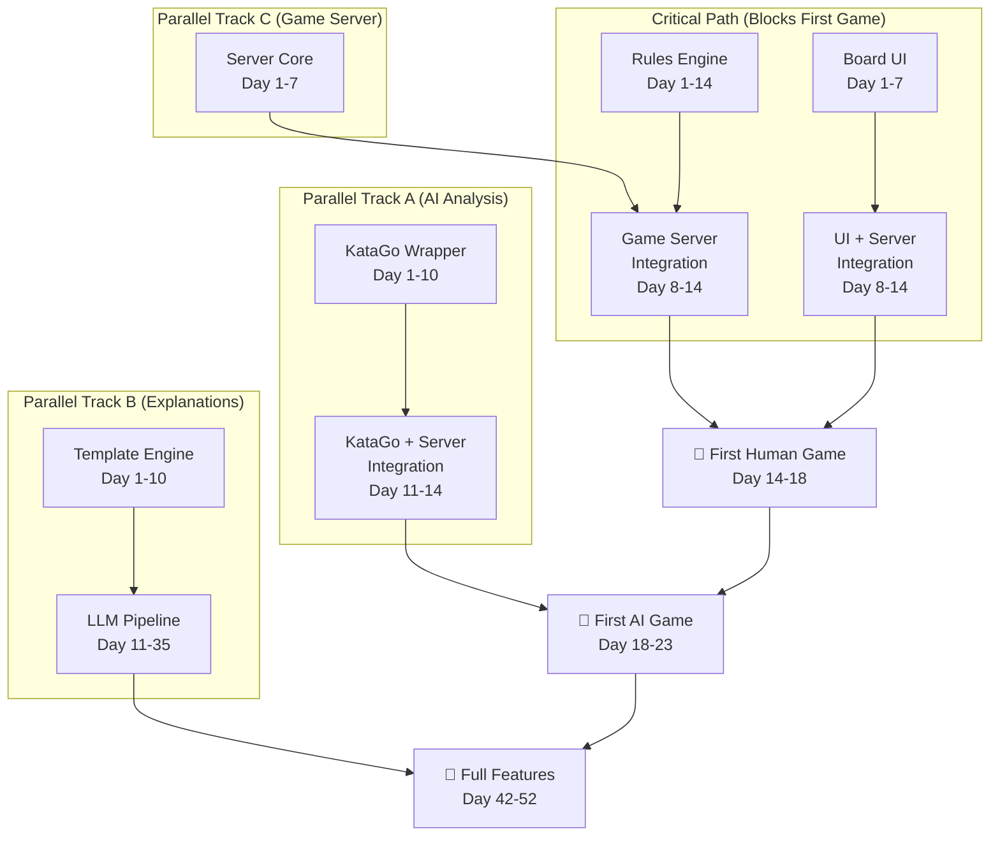
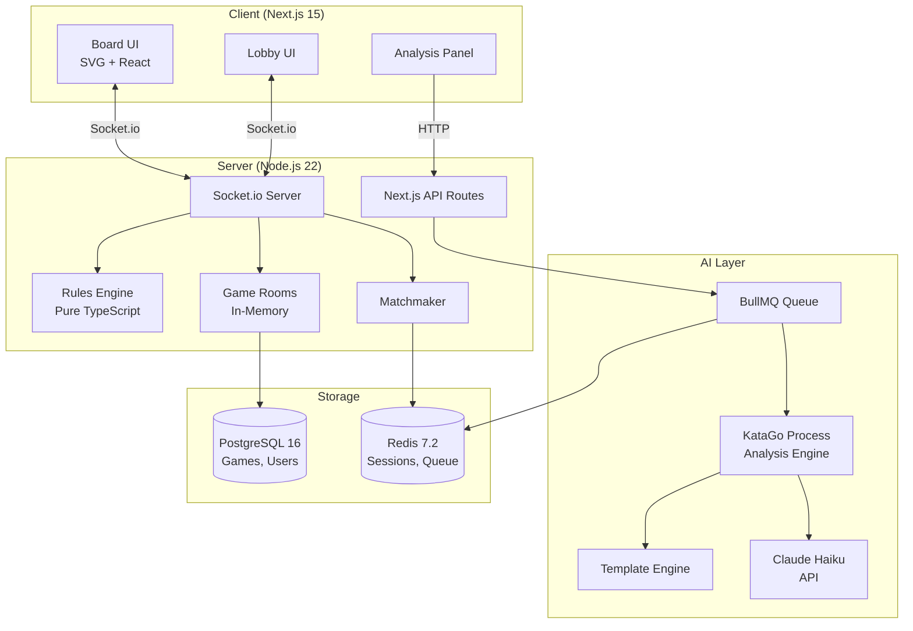

# Baduk Domain Technology PRD — Speed First Scenario

> **Perspective**: Development Speed & Time-to-Market Expert
> **Research**: 3 of 3 (Baduk Domain Technology Deep-Dive)
> **Date**: 2026-03-10
> **Prior Decisions**: Node.js 22, Next.js 15, PostgreSQL 16, Redis 7.2, Drizzle ORM, Biome, Coolify + Hetzner
> **Builder**: AI Agents (Claude Code) — not human developers

---

## Table of Contents

1. [Executive Summary](#1-executive-summary)
2. [Speed Philosophy](#2-speed-philosophy)
3. [Area 1: KataGo Integration](#3-area-1-katago-integration)
4. [Area 2: Go Rules Engine](#4-area-2-go-rules-engine)
5. [Area 3: LLM Explanation Pipeline](#5-area-3-llm-explanation-pipeline)
6. [Area 4: Real-time Game Server](#6-area-4-real-time-game-server)
7. [Area 5: Baduk UI/UX](#7-area-5-baduk-uiux)
8. [Critical Path Analysis](#8-critical-path-analysis)
9. [Gantt-Style Timeline](#9-gantt-style-timeline)
10. [Day 1 to First Game Timeline](#10-day-1-to-first-game-timeline)
11. [Day 1 to Full Feature Timeline](#11-day-1-to-full-feature-timeline)
12. [Velocity & Risk Analysis](#12-velocity--risk-analysis)
13. [Consolidated Architecture](#13-consolidated-architecture)
14. [Sources](#14-sources)

---

## 1. Executive Summary

**The fastest path to a working AI baduk platform is 18 days** to first playable game and **52 days** to full feature set including AI explanations. This is achieved by selecting aggressive/evolutionary/rapid/practical/classical approaches from every branch pair, deferring everything that does not block the first playable game, and exploiting massive parallelization across 5 development tracks.

| Milestone | Optimistic | Realistic | Pessimistic |
|-----------|-----------|-----------|-------------|
| First playable game (2 humans) | Day 14 | Day 18 | Day 24 |
| First AI game (vs KataGo) | Day 18 | Day 23 | Day 30 |
| First "Why?" explanation | Day 22 | Day 28 | Day 35 |
| Production-ready full features | Day 42 | Day 52 | Day 68 |

**Key insight**: The Go rules engine and UI board are on the critical path. Everything else can develop in parallel. KataGo integration is surprisingly fast (3-5 days for basic wrapper) but not needed for the first human-vs-human game.

---

## 2. Speed Philosophy

### 2.1 Principles for Speed-First Domain Development

1. **Ship the board first.** A playable Go board with correct rules is the atomic unit of value. Without it, nothing else matters.
2. **KataGo is a binary, not a build.** Download pre-compiled, spawn as child process, speak JSON. Do not build an engine.
3. **Templates before LLMs.** String interpolation of KataGo analysis data gives 80% of the "Why?" value at 5% of the cost and complexity.
4. **Simple matchmaking is matchmaking.** Random pairing within +/- 3 rank levels. Elo refinement comes later.
5. **Fork proven UI, do not invent.** Shudan/react-baduk components exist. Adapt, do not create from scratch.
6. **Tracked shortcuts, not technical debt.** Every cut corner is documented with a trigger condition for when it must be fixed.

### 2.2 Why Speed Matters for This Specific Product

- **No competitor has NL Go explanations** (Branch 5 finding). First mover advantage is real.
- **MAU 8K target** means perfection is not required — 200-500 concurrent users is the ceiling.
- **AI agents build faster in greenfield.** Claude Code excels at generating new code from clear specifications; it struggles more with complex legacy refactoring.
- **Go community is small but passionate.** A working product with rough edges ships to a forgiving early-adopter audience.

### 2.3 Branch Selection Summary

| Area | Branch Selected | Rejected Branch | Speed Gain |
|------|----------------|-----------------|------------|
| KataGo | Branch 1 (Aggressive) + Branch 2 startup simplicity | Branch 2 full conservative | Faster GPU upgrade path |
| Rules Engine | Branch 3 (Evolutionary) | Branch 4 (Big Bang) | **8 weeks faster** (2 vs 10 weeks) |
| LLM Explanation | Branch 5 (Rapid) | Branch 6 (Robust) | **7 weeks faster** (10d+25d vs 10 weeks) |
| Game Server | Branch 8 (Practical) | Branch 7 (Debt Minimized) | **3 weeks faster** (10-14d vs 5-6 weeks) |
| UI/UX | Branch 10 (Classical) | Branch 9 (Modern) | **1 week faster** (4-5w vs 6w) |

---

## 3. Area 1: KataGo Integration

### 3.1 Speed Analysis

| Metric | Value |
|--------|-------|
| Days to first working version | **3 days** |
| Days to production-ready | **10 days** |
| Branch approach | Hybrid: Branch 1 architecture + Branch 2 startup simplicity |
| Speed advantage over conservative-only | ~2 days (conservative is already fast) |

### 3.2 Fastest Integration Path

**Day 1-2: Spawn & Query**
```
KataGo binary (pre-compiled Eigen/CPU)
  └─ child_process.spawn() with Analysis Engine mode
     └─ JSON line protocol: write query to stdin → read response from stdout
        └─ Node.js readline interface for line-delimited JSON
```

The KataGo Analysis Engine is the killer accelerator here. It accepts JSON queries via stdin and returns JSON responses via stdout. No HTTP server, no REST API, no protocol buffers — just spawn a process and pipe JSON.

**Day 2-3: Service Wrapper**
```typescript
// Core interface — this is the ENTIRE public API needed for MVP
interface KataGoService {
  analyze(position: Position, maxVisits?: number): Promise<AnalysisResult>;
  getBestMoves(position: Position, count?: number): Promise<Move[]>;
  getWinRate(position: Position): Promise<number>;
  shutdown(): void;
}
```

**Day 4-10: Production Hardening**
- BullMQ queue for analysis requests (prevents overload)
- Auto-restart on crash with 3-second backoff (Branch 2)
- Request timeout (30s default, configurable)
- Visits tuning: quick=5, standard=50, deep=500 (Branch 1)
- Health check endpoint

### 3.3 What to Skip/Defer

| Skipped | Why | Trigger to Build |
|---------|-----|-----------------|
| Process pool (2-4 processes) | Single process handles MAU 8K | Queue wait time >5s at p95 |
| GPU support | CPU Eigen sufficient for 100 analyses/min | >500 analyses/min needed |
| HumanSL model | Standard model works for teaching | User research demands human-like play |
| Multi-model switching | One model suffices | A/B testing analysis quality |
| Distributed KataGo | Overkill for target scale | MAU >50K |

### 3.4 Speed vs Quality Tradeoffs

- **Quality loss: minimal.** KataGo is the quality — our wrapper just pipes JSON. There is no quality penalty for a simple wrapper vs. a complex one. The analysis results are identical.
- **Reliability risk: moderate.** Single process means single point of failure. Auto-restart with backoff mitigates this. At MAU 8K, a 3-second restart gap is invisible.
- **Scalability ceiling: MAU ~25K.** Single CPU process tops out at ~100 analyses/min. This is 6x headroom over 8K MAU assuming 1 analysis per active user per minute.

### 3.5 Parallelization

KataGo integration has **zero dependencies** on other areas. It can be built from Day 1 in parallel with everything else. The only integration point is the rules engine providing positions in a format KataGo accepts (standard GTP move lists or board arrays).

### 3.6 Configuration

```yaml
# Minimum viable KataGo config
katago:
  binary: ./bin/katago           # Pre-compiled
  model: b18c384nbt-uec.bin.gz   # Download once
  config: analysis.cfg
  visits:
    quick: 5      # Instant feedback (<100ms)
    standard: 50  # Normal analysis (~500ms)
    deep: 500     # Deep review (~3-5s)
  maxConcurrent: 8  # Analysis engine batches internally
  timeout: 30000    # 30s per query max
  restart:
    maxRetries: 5
    backoffMs: 3000
```

**Estimated cost**: ~$0.001/query on Hetzner CCX33 (€60/mo) — negligible.

---

## 4. Area 2: Go Rules Engine

### 4.1 Speed Analysis

| Metric | Value |
|--------|-------|
| Days to first working version | **5 days** (place + capture + ko) |
| Days to production-ready | **14 days** (+ scoring + pass + resign) |
| Branch approach | Branch 3 (Evolutionary) — decisive winner |
| Speed advantage over Big Bang | **8 weeks** (2 weeks vs 10 weeks) |

### 4.2 Fastest Path to Playable Game

Branch 3's evolutionary approach is the single largest speed win across all five areas. The Big Bang approach (Branch 4) requires 6 rulesets, 45 edge cases, and 4-5K lines of engine code plus 6-8K lines of tests *before anything works*. The evolutionary approach produces a playable game in 5 days.

**Incremental Build Order (Branch 3)**:

```
Day 1-2: Board + Stone Placement
  ├─ 1D Uint8Array (19*19 = 361 elements)
  ├─ Place stone at intersection
  ├─ Adjacency lookup (pre-computed)
  └─ Group detection (flood fill)

Day 3-4: Capture + Ko
  ├─ Liberty counting per group
  ├─ Capture: remove group with 0 liberties
  ├─ Zobrist hashing for board state
  └─ Simple ko: reject if board returns to previous state

Day 5: Game Flow
  ├─ Alternating turns
  ├─ Pass move
  ├─ Game end: two consecutive passes
  └─ Resign

Day 6-10: Chinese Scoring
  ├─ Territory detection (empty regions bounded by one color)
  ├─ Area scoring (Chinese rules = stones + territory)
  ├─ Komi (6.5 default)
  └─ Score display

Day 11-14: Validation & Edge Cases
  ├─ Suicide prevention (Tromp-Taylor allows suicide; Chinese does not)
  ├─ Superko (full positional, using Zobrist hash set)
  ├─ Handicap stone placement
  └─ 100+ test positions from known games
```

### 4.3 Core Data Structure

```typescript
// The entire board state — intentionally minimal
interface GameState {
  board: Uint8Array;         // 361 elements: 0=empty, 1=black, 2=white
  currentPlayer: 1 | 2;
  koPoint: number | null;    // Forbidden point for simple ko
  zobristHash: bigint;       // For superko detection
  hashHistory: Set<bigint>;  // All previous hashes
  moveHistory: number[];     // Move list (for KataGo)
  captures: [number, number]; // [black_captures, white_captures]
  consecutivePasses: number;
  moveNumber: number;
}
```

**Estimated total code**: 200-400 lines TypeScript core (Branch 3 estimate), which aligns with existing minimal Go engine implementations.

### 4.4 What to Skip/Defer

| Skipped | Why | Trigger to Build |
|---------|-----|-----------------|
| Japanese scoring | Chinese scoring simpler, KataGo handles both | User demand >30% requesting Japanese |
| AGA/Ing/NZ rules | Chinese rules cover 80%+ of online play | Tournament feature request |
| Seki detection | KataGo can resolve seki disputes | Manual scoring complaints >5% |
| Dead stone marking | Use KataGo for auto-detection | Never (KataGo does it better) |
| SGF import/export | Not needed for live play | Game review feature (Phase 2) |
| Undo/redo | Not needed for live games | Teaching/review mode |

### 4.5 Speed vs Quality Tradeoffs

- **Quality loss: negligible for live play.** Chinese scoring is the standard for online Go. Japanese scoring nuances (seki, sekis in corners) are edge cases affecting <1% of games.
- **Correctness risk: low.** Tromp-Taylor rules are formally specified and minimal. The implementation can be verified against known game records.
- **Test coverage**: Target 100 test positions from professional games. The rules engine is the ONE area where cutting quality is dangerous — incorrect capture logic destroys the product. Branch 3 handles this by building incrementally with tests at each stage.

### 4.6 Parallelization

The rules engine is on the **critical path**. The UI needs it to validate moves. The game server needs it for authoritative state. However:
- The board UI can be built simultaneously using a mock/stub rules engine (always returns "valid")
- KataGo integration is independent
- LLM templates are independent

---

## 5. Area 3: LLM Explanation Pipeline

### 5.1 Speed Analysis

| Metric | Value |
|--------|-------|
| Days to first working version | **5 days** (template V1) |
| Days to V2 (LLM-powered) | **25 additional days** (35 total) |
| Days to production-ready | **35 days** |
| Branch approach | Branch 5 (Rapid) — decisive winner |
| Speed advantage over Robust | **7+ weeks** (5 weeks vs 10 weeks for full pipeline) |

### 5.2 Two-Phase Approach

**This is THE competitive moat.** No existing Go platform provides natural language explanations of moves. The key research finding from Branch 6 is critical: **LLMs have ZERO Go understanding.** They cannot evaluate positions, count liberties, or understand life-and-death. But they CAN generate fluent natural language from structured data.

The speed-first approach exploits this perfectly: use KataGo for the understanding, use templates/LLMs for the language.

#### Phase 1: Template Engine (Days 1-10)

```typescript
// KataGo gives us structured data like:
{
  bestMove: "Q16",
  winrate: 0.62,        // 62% for black
  scoreLead: 3.2,       // Black leads by 3.2 points
  visits: 50,
  moveInfos: [
    { move: "Q16", winrate: 0.62, scoreLead: 3.2, order: 0 },
    { move: "R14", winrate: 0.58, scoreLead: 1.8, order: 1 },
    { move: "D4",  winrate: 0.55, scoreLead: 0.9, order: 2 }
  ]
}

// Templates transform this into human-readable text:
function explainMove(analysis: AnalysisResult, context: GameContext): string {
  const templates = {
    goodMove: `This move at ${move} is strong. It maintains Black's
      ${winrate}% win rate and ${scoreLead}-point lead.
      The main alternative was ${altMove}, which would be slightly
      less effective (${altWinrate}% win rate).`,

    mistake: `Playing at ${move} was a mistake — it dropped the win rate
      from ${prevWinrate}% to ${winrate}% (a ${drop}-point swing).
      The AI preferred ${bestMove}, which would have maintained
      a ${bestScoreLead}-point advantage.`,

    brilliantMove: `Excellent move! Playing at ${move} increased the
      win rate by ${gain}% — the AI's top choice as well.`,

    opening: `This is a standard opening move, approaching the ${corner}
      corner. It aims to establish influence/territory in this area.`,
  };
  // Select template based on analysis delta
}
```

**Template categories needed** (10-15 templates total):
1. Good move (winrate maintained/improved)
2. Mistake (winrate dropped >5%)
3. Blunder (winrate dropped >15%)
4. Brilliant move (winrate improved >10%)
5. Opening move (move number < 30)
6. Territorial move (scoreLead change)
7. Fighting move (multiple groups in contact)
8. Endgame move (move number > 150)
9. Tenuki (playing away from current action)
10. Pass explanation

**Day 1-3**: Build template engine with KataGo data binding
**Day 4-7**: Write 10-15 templates covering common situations
**Day 8-10**: Integration testing with real game positions

#### Phase 2: LLM Enhancement (Days 11-35)

```
KataGo Analysis → Data Extraction → Prompt Assembly → Haiku API → Response Validation → Display
```

**Day 11-20**: Build LLM prompt pipeline
- Structured prompt with KataGo data, board context, game phase
- Claude 3.5 Haiku for cost efficiency ($1,200-2,200/mo at MAU 8K per Branch 5)
- Response caching (same position = same explanation)
- Fallback to templates on LLM failure/timeout

**Day 21-30**: Quality iteration
- A/B test templates vs LLM explanations
- Build feedback mechanism ("Was this helpful? Yes/No")
- Tune prompts based on user feedback

**Day 31-35**: Production hardening
- Rate limiting per user
- Cost monitoring dashboard
- Cache hit rate optimization (target: >60%)

### 5.3 What to Skip/Defer

| Skipped | Why | Trigger to Build |
|---------|-----|-----------------|
| 4-layer validation pipeline (Branch 6) | Overkill for V1 | Accuracy complaints >20% |
| 200-position golden dataset | Templates do not need validation | LLM V2 quality assessment |
| Fine-tuned Go model | No such model exists yet | Research breakthrough |
| Multi-language explanations | English first | Korean/Japanese/Chinese user demand |
| Voice explanations | Text is sufficient | Accessibility requirements |
| Move-by-move auto-commentary | On-demand only saves cost | Premium feature |

### 5.4 Speed vs Quality Tradeoffs

- **Quality loss: moderate but acceptable.** Templates produce formulaic but *correct* explanations. They cannot say "this threatens a ladder" or "this creates aji" — they say "this move maintains your advantage." Branch 6's finding that LLMs have zero Go understanding actually validates this approach: even with LLMs, deep tactical explanations are unreliable.
- **Competitive moat: still strong.** Even template-based explanations are unprecedented. No competitor shows "This move dropped your win rate by 12% — the AI preferred D4" in natural language.
- **Cost advantage: massive.** Templates cost $0/query. LLM V2 costs ~$0.002/query. Branch 6's validation pipeline adds complexity without proven accuracy gains.

### 5.5 Parallelization

LLM pipeline is **fully independent** of other areas until integration. Requires only:
- KataGo analysis output format (available from Day 3 of KataGo track)
- Game state for context (available from Day 5 of rules engine)

Can begin template development on Day 1 using mock KataGo data.

---

## 6. Area 4: Real-time Game Server

### 6.1 Speed Analysis

| Metric | Value |
|--------|-------|
| Days to first working version | **7 days** (2 players can play a game) |
| Days to production-ready | **14 days** |
| Branch approach | Branch 8 (Practical) — decisive winner |
| Speed advantage over Debt Minimized | **3+ weeks** (14d vs 5-6 weeks) |

### 6.2 Fastest Path to Working Multiplayer

Branch 8's practical approach trades architectural elegance for shipping speed. The tracked shortcuts are safe until MAU 25K+ — 3x beyond target.

**Architecture: Single Process, Socket.io, In-Memory State**

```
Client A                          Server                        Client B
   │                                │                               │
   ├── ws: join_game ──────────────>│                               │
   │                                ├── ws: game_joined ───────────>│
   │                                │                               │
   ├── ws: play_move {x,y} ───────>│                               │
   │                                ├── validate(rules_engine) ─────│
   │                                ├── ws: move_played ───────────>│
   │                                ├── ws: move_played ────────────│
   │                                │                               │
   │                                ├── ws: game_over ─────────────>│
   │<────────── ws: game_over ──────┤                               │
```

**Day 1-3: Core Game Room**
```typescript
// Game room — the central abstraction
interface GameRoom {
  id: string;
  black: Player;
  white: Player;
  gameState: GameState;       // From rules engine
  timeControl: TimeControl;
  spectators: Set<string>;
  status: 'waiting' | 'playing' | 'finished';
}

// Socket.io events — complete list for MVP
const events = {
  // Client → Server
  'seek_game': { rankRange: number },  // Join matchmaking
  'play_move': { x: number, y: number },
  'pass': {},
  'resign': {},

  // Server → Client
  'game_start': { roomId: string, color: Color, opponent: Player },
  'move_played': { x: number, y: number, color: Color, captures: Point[] },
  'game_over': { result: string, score: number },
  'error': { message: string },
};
```

**Day 4-5: Matchmaking**
```typescript
// Simplest possible matchmaking: FIFO queue with rank filter
class SimpleMatchmaker {
  private queue: Player[] = [];

  seek(player: Player): void {
    const match = this.queue.find(p =>
      Math.abs(p.rank - player.rank) <= 3
    );
    if (match) {
      this.queue = this.queue.filter(p => p !== match);
      this.createGame(player, match);
    } else {
      this.queue.push(player);
    }
  }
}
```

**Day 6-7: Time Control**
- Fischer time (main + increment) only
- Server-authoritative clock
- Timeout = auto-loss

**Day 8-14: Production Hardening**
- Reconnection handling (5-minute grace period)
- Game state persistence to PostgreSQL on completion
- Basic anti-abuse (rate limiting, move validation)
- Spectator mode (read-only socket subscription)
- Graceful shutdown (finish in-progress games)

### 6.3 What to Skip/Defer

| Skipped | Why | Trigger to Build |
|---------|-----|-----------------|
| Event sourcing | In-memory state simpler | Game replay/undo feature |
| Horizontal scaling | Single process handles 50K+ connections | >50K concurrent connections |
| Challenge system | Matchmaking is sufficient | User requests direct challenges |
| Tournament mode | Not MVP | Community growth >1K active |
| Game history browsing | Store but do not display | Review feature (Phase 2) |
| Rated vs unrated | All games rated | Casual play demand |
| Multiple time controls | Fischer only | Byoyomi demand from Asian users |
| Correspondence games | Real-time only | Proven engagement |

### 6.4 8 Tracked Shortcuts (from Branch 8)

| # | Shortcut | Risk | Trigger to Fix |
|---|----------|------|---------------|
| 1 | In-memory game state (not event sourced) | Data loss on crash | MAU >10K |
| 2 | Single process | No horizontal scaling | >50K connections |
| 3 | Simple matchmaking (rank range only) | Imprecise matching | Complaints >10% |
| 4 | No game history UI | Cannot review past games | Phase 2 |
| 5 | Fischer time only | Missing byoyomi | Asian user feedback |
| 6 | No spectator chat | Spectators are silent | Community request |
| 7 | No reconnection state persistence | Long disconnects lose game | Mobile users |
| 8 | No rated/unrated distinction | Cannot play casually | Community feedback |

### 6.5 Speed vs Quality Tradeoffs

- **Quality loss: low for MVP.** Users can find games, play in real-time, and see results. The matchmaking is crude but functional.
- **Reliability risk: moderate.** Server crash = all in-progress games lost. Mitigation: persist game state to Redis every move (adds ~1ms latency). Can be added in Day 8-14 hardening.
- **Scalability ceiling: 50K+ concurrent connections** on single Socket.io process. This is 100x beyond MAU 8K peak concurrent estimate (~500).

### 6.6 Parallelization

The game server depends on the rules engine for move validation. However:
- **Days 1-3** can use a stub rules engine (always valid) for socket infrastructure
- **Days 4-7** require the real rules engine (available from rules engine Day 5)
- Full integration by Day 7 of both tracks

---

## 7. Area 5: Baduk UI/UX

### 7.1 Speed Analysis

| Metric | Value |
|--------|-------|
| Days to first working version | **7 days** (board + stone placement + captures visible) |
| Days to production-ready | **21 days** (full game UI) |
| Branch approach | Branch 10 (Classical) |
| Speed advantage over Modern | **~7 days** (4-5 weeks vs 6 weeks) |

### 7.2 Fastest Path to Usable Board

Branch 10's classical approach is faster AND lower risk. The key insight: "innovate around the board, not on it." Go players have used the same board interface for 4,000 years. The board itself should not be novel.

**Component Architecture (18 components, not 30)**

```
GoBoard (SVG root)
├── BoardGrid (lines + star points)
├── StoneLayer
│   └── Stone (black/white circle)
├── MarkerLayer
│   └── Marker (last move dot, territory marks)
├── GhostStone (hover preview)
└── CoordinateLabels (A-T, 1-19)

GamePanel
├── PlayerInfo (name, rank, captures, time)
├── MoveControls (pass, resign)
├── GameClock
└── MoveList

AnalysisPanel (Phase 2)
├── WinRateBar
├── ExplanationBox
└── VariationViewer
```

**Day 1-3: Core Board Rendering**
```typescript
// SVG board — the heart of the UI
// Fork from Shudan or react-baduk, adapt to Next.js 15
const GoBoard: React.FC<{
  boardSize: 9 | 13 | 19;
  stones: StoneMap;
  markers?: MarkerMap;
  ghostStone?: { x: number; y: number; color: Color };
  onIntersectionClick: (x: number, y: number) => void;
}> = (props) => {
  // SVG rendering with viewBox for responsive scaling
  // Pre-computed grid coordinates
  // Stone rendering with radial gradients
};
```

**Day 4-7: Interaction & Game Chrome**
- Click/tap to place stone (with ghost preview on hover)
- Last move indicator (dot on stone)
- Capture animation (stones fade out)
- Player info panels (name, rank, captures, clock)
- Pass/Resign buttons
- Mobile responsive layout (board scales to viewport)

**Day 8-14: Game Flow UI**
- Lobby/matchmaking screen
- Game-over dialog with score
- Basic game list (active games)
- Sound effects (stone click, capture, game end)

**Day 15-21: Analysis UI**
- Win rate bar (horizontal, updates per move)
- "Why?" button → explanation panel
- Best move suggestion overlay (colored dots on board)
- Move quality indicators in move list (good/mistake/blunder colors)

### 7.3 Design Decisions (Speed-Optimized)

| Decision | Choice | Rationale |
|----------|--------|-----------|
| Board rendering | SVG | Universal support, sharp at any scale, simple DOM |
| Base component | Fork Shudan/react-baduk | 70% of board rendering done |
| Stone style | Flat with subtle gradient | Fastest to implement, clear visibility |
| Color scheme | KaTrain-inspired | Proven, accessible, warm wood tones |
| State management | Zustand | Minimal boilerplate, works with Next.js |
| Animation | CSS transitions only | No animation library dependency |
| Touch support | Native pointer events | No gesture library for MVP |
| Responsive | CSS container queries | Modern, no breakpoint management |

### 7.4 What to Skip/Defer

| Skipped | Why | Trigger to Build |
|---------|-----|-----------------|
| Tap-Preview-Confirm (Branch 9) | Standard click is fine for desktop-first | Mobile-first pivot |
| Recharts integration | Win rate bar is a simple div | Advanced statistics feature |
| use-gesture library | Native pointer events suffice | Complex gestures needed |
| Theme switching | One theme is fine | User customization demand |
| Board texture (wood grain) | Flat color is sufficient | Polish phase |
| Stone texture (realistic) | Flat circles are clearer | Polish phase |
| Move tree visualization | Linear move list suffices | Game review feature |
| SGF download | Not needed for live play | Review/share feature |

### 7.5 Speed vs Quality Tradeoffs

- **Quality loss: cosmetic only.** The board functions identically. It just looks less polished. Go players care about accurate stone placement, visible liberties, and clear territory — not wood textures.
- **UX risk: low.** Classical Go UI patterns are proven over 20+ years of online Go. Every OGS/KGS/Tygem player will feel at home immediately.
- **Mobile experience: adequate but not optimized.** Responsive SVG scales well. Advanced touch gestures (pinch zoom, two-finger scroll) deferred.

### 7.6 Parallelization

UI development is **semi-independent**:
- **Days 1-7**: Board rendering and interaction can be built with mock data (no backend needed)
- **Day 7+**: Integration with game server via Socket.io
- **Day 15+**: Integration with KataGo analysis via API calls
- Analysis UI can begin before LLM pipeline is complete (use KataGo raw data)

---

## 8. Critical Path Analysis

### 8.1 Dependency Graph



### 8.2 Sequential vs Parallel Classification

**MUST be sequential:**
1. Rules Engine core (Days 1-5) → Game Server integration (Days 6-7 of server track)
2. KataGo wrapper (Days 1-3) → Template engine data format (Day 4+ of LLM track)
3. Board UI (Days 1-7) → Socket.io integration (Day 8+ of UI track)

**CAN be fully parallel (from Day 1):**
1. Rules Engine ‖ KataGo Wrapper ‖ Board UI ‖ Template Engine ‖ Game Server core
2. All 5 tracks can start simultaneously on Day 1

**Integration points:**
- Day 7-8: Rules Engine + Game Server merge
- Day 7-8: Board UI + Game Server merge
- Day 11-14: KataGo + Game Server merge
- Day 15-21: Analysis UI + KataGo + Templates merge

### 8.3 Critical Path Length

```
Day 1 ──── Rules Engine (5d) ────┐
                                  ├── Integration (3d) ── First Game (Day 14-18)
Day 1 ──── Board UI (7d) ────────┘
```

The critical path is **14-18 days**. Rules engine and board UI are the bottleneck. Everything else has slack.

---

## 9. Gantt-Style Timeline

```
Week 1 (Day 1-7)        Week 2 (Day 8-14)       Week 3 (Day 15-21)      Week 4 (Day 22-28)
├─────────────────────┤├─────────────────────┤├─────────────────────┤├─────────────────────┤

RULES ENGINE
████████████████████████████████████████████   (Day 1-14)
├─ Board+Place (1-2)──┤
├─ Capture+Ko (3-4)───┤
├─ Game Flow (5)──────-┤
├──────── Scoring (6-10)──────────┤
├───────────── Validation (11-14)──────────┤

KATAGO INTEGRATION
██████████████████████████████               (Day 1-10)
├─ Spawn+Query (1-2)──┤
├─ Wrapper (3)────────-┤
├──────── BullMQ+Hardening (4-10)─────────┤

GAME SERVER
██████████████████████████████████████████   (Day 1-14)
├─ Socket Core (1-3)──┤
├─ Matchmaking (4-5)──┤
├─ Time Control (6-7)─┤
├──────── Hardening (8-14)────────────────┤

BOARD UI
██████████████████████████████████████████████████████████████   (Day 1-21)
├─ SVG Board (1-3)────┤
├─ Interaction (4-7)──┤
├──────── Game Flow UI (8-14)─────────────┤
├─────────────── Analysis UI (15-21)──────────────┤

EXPLANATION PIPELINE
██████████████████████████████████████████████████████████████████████████████   (Day 1-35)
├─ Templates (1-10)───────────────────────┤
├────────────── LLM Pipeline (11-25)──────────────────────────────┤
├───────────────────────── Hardening (26-35)───────────────────────────────┤

INTEGRATION & TESTING
                        ████████████████████████████████████████████████████   (Day 8-28)
                        ├─ Rules+Server (8-10)┤
                        ├─ UI+Server (10-12)──┤
                        ├─ KataGo+Server (12-14)──┤
                        ├──────── E2E Testing (15-21)──────────┤
                        ├───────────────── Polish (22-28)──────────────────┤

MILESTONES
              ▲ Day 5: First valid Go move
              ▲ Day 7: Board renders stones
                        ▲ Day 14: First human game (internal)
                              ▲ Day 18: First human game (stable)
                                    ▲ Day 23: First AI game
                                          ▲ Day 28: First "Why?" explanation
                                                      ▲ Day 35: LLM explanations live
                                                                ▲ Day 42-52: Production
```

---

## 10. Day 1 to First Game Timeline

**Goal**: Two humans play a complete game of Go on 19x19 board with correct rules.

```
DAY 1
  AM: [Rules] Initialize board, stone placement, adjacency tables
  AM: [UI] Fork Shudan/react-baduk, render empty 19x19 board
  AM: [Server] Socket.io server scaffolding, room creation
  PM: [Rules] Group detection (flood fill)
  PM: [UI] Render stones from static data
  PM: [Server] Client connection, event routing

DAY 2
  AM: [Rules] Liberty counting, capture detection
  AM: [UI] Click-to-place stone, ghost stone preview
  PM: [Rules] Ko detection (Zobrist hashing)
  PM: [UI] Capture animation, last-move marker

DAY 3
  AM: [Rules] Suicide prevention, turn alternation
  AM: [Server] Game room lifecycle (create, join, play, end)
  PM: [Rules] Pass, resign, game-end detection
  PM: [Server] Move validation integration with rules engine

DAY 4
  AM: [Server] Matchmaking queue
  AM: [UI] Player info panel, clock display
  PM: [Server] Time control (Fischer)
  PM: [UI] Pass/Resign buttons

DAY 5
  AM: [Rules] Two consecutive passes → scoring trigger
  AM: [Integration] Rules engine ↔ Server ↔ UI connected
  PM: [Integration] End-to-end: join game → play moves → see opponent moves
  PM: [Bug fixes] First playthrough, fix critical bugs

DAY 6-7
  [Rules] Chinese scoring implementation
  [UI] Score display, game-over dialog
  [Server] Reconnection handling
  [Integration] Full game flow testing

=== MILESTONE: First Complete Game (Day 7, optimistic) ===

DAY 8-10
  [Server] Game persistence to PostgreSQL
  [UI] Lobby screen, active games list
  [Testing] 20+ end-to-end game scenarios

DAY 11-14
  [All] Bug fixes, edge case handling
  [Server] Rate limiting, anti-abuse
  [UI] Mobile responsiveness
  [Rules] Handicap stones

=== MILESTONE: First Stable Game (Day 14-18, realistic) ===
```

**Absolute minimum to play a Go game**: **Day 5** (two people on localhost, no scoring, no time control, no matchmaking — just alternating moves with captures). Add 2 days for scoring and basic server = **Day 7** optimistic. Add buffer for integration bugs = **Day 14-18** realistic.

---

## 11. Day 1 to Full Feature Timeline

**Goal**: All 5 areas production-ready including AI analysis and NL explanations.

```
PHASE 1: PLAYABLE GAME (Day 1-18)
├── Rules Engine complete with Chinese scoring
├── Game Server with matchmaking + time control
├── Board UI with full game flow
└── ✅ Humans can play each other

PHASE 2: AI INTEGRATION (Day 11-28)
├── KataGo wrapper production-ready (Day 10)
├── Play vs AI mode (Day 18-23)
│   ├── AI opponent using KataGo
│   ├── Difficulty levels (visit count: 5/50/500)
│   └── AI move delay (artificial 1-3s for natural feel)
├── Post-game analysis (Day 20-25)
│   ├── Full game review with KataGo
│   ├── Win rate graph
│   └── Best move suggestions per move
└── ✅ Users can play AI and review games

PHASE 3: EXPLANATIONS (Day 15-35)
├── Template V1 live (Day 10)
│   ├── 10-15 templates covering common situations
│   └── "Why?" button on each move
├── LLM V2 pipeline (Day 25-35)
│   ├── Claude Haiku integration
│   ├── Prompt engineering with KataGo data
│   ├── Response caching
│   └── Fallback to templates
└── ✅ Users get NL explanations for any move

PHASE 4: POLISH & PRODUCTION (Day 28-52)
├── Performance optimization
├── Error handling & edge cases
├── Monitoring & logging
├── Load testing (target: 500 concurrent)
├── Security audit
├── User onboarding flow
├── Landing page
└── ✅ Production deployment

TOTAL: 42-52 days (optimistic-realistic)
```

---

## 12. Velocity & Risk Analysis

### 12.1 AI Agent Development Velocity

Based on research findings (Claude Code building a 100K-line C compiler, 44+ PRs/week reports, SWE-bench 80%+ task completion):

| Metric | Estimate | Basis |
|--------|----------|-------|
| Lines of production code per day | 300-800 | Claude Code greenfield capability |
| Features per week | 5-8 | Discrete, well-specified features |
| Integration tasks per week | 2-3 | Cross-module work is slower |
| Bug fix iterations per day | 10-20 | AI excels at deterministic fixes |
| Test cases per day | 30-50 | High parallelization potential |

**Total estimated codebase size**:

| Component | Lines (TypeScript) | Tests (Lines) |
|-----------|-------------------|---------------|
| Rules Engine | 300-400 | 800-1,000 |
| KataGo Wrapper | 200-300 | 200-300 |
| Game Server | 500-800 | 400-600 |
| Board UI Components | 800-1,200 | 300-500 |
| LLM Pipeline | 400-600 | 300-400 |
| Shared Types/Utils | 200-300 | 100-200 |
| **Total** | **2,400-3,600** | **2,100-3,000** |

This is a modest codebase. At 300-800 lines/day, the raw coding is 5-12 days. The remainder is design decisions, integration, testing, and debugging.

### 12.2 Speed Risks Specific to AI Agent Development

| Risk | Severity | Mitigation |
|------|----------|------------|
| **KataGo binary compatibility** | HIGH | Pre-test binary on exact Hetzner OS image before coding. Cross-compilation issues with Eigen/OpenBLAS can waste days. |
| **Go rules edge cases** | HIGH | Use Tromp-Taylor formal spec as source of truth. Test against known game records. AI agents struggle with ambiguous specs. |
| **Socket.io state synchronization** | MEDIUM | Race conditions in real-time systems are hard for AI agents to debug. Use deterministic game state (moves are sequential, not concurrent). |
| **SVG board performance on mobile** | MEDIUM | 361 elements (19x19) is manageable. But if each intersection has hover/click handlers, event delegation is critical. AI agents may over-engineer this. |
| **LLM prompt engineering** | MEDIUM | AI agents writing prompts for other AI models creates a meta-complexity. Use concrete examples and templates. Measure output quality empirically. |
| **Integration complexity** | HIGH | Each module works in isolation but integration bugs are non-obvious. Mitigate with end-to-end tests from Day 5. |
| **KataGo analysis latency** | LOW | CPU analysis at 50 visits takes <500ms. Not a speed risk for development, just for UX tuning. |
| **WebSocket reconnection edge cases** | MEDIUM | Mobile networks are flaky. Reconnection logic is notoriously tricky. Defer complex reconnection to Phase 4. |

### 12.3 Timeline Confidence

| Scenario | Total Days | Confidence | Key Assumption |
|----------|-----------|------------|----------------|
| **Optimistic** | 42 days | 20% | Zero integration issues, AI agent hits every feature first try |
| **Realistic** | 52 days | 60% | 30% time buffer for bugs, integration, and iteration |
| **Pessimistic** | 68 days | 90% | KataGo binary issues, complex scoring bugs, Socket.io race conditions |

### 12.4 What Could Make It Even Faster

1. **Use WGo.js rules engine instead of building one.** Saves 7-10 days but creates a JavaScript dependency in a TypeScript codebase. Tradeoff: faster now, harder to maintain.
2. **Skip multiplayer entirely, start with "play vs AI" only.** Removes game server complexity. First playable game in ~10 days. But multiplayer is the engagement driver.
3. **Use Colyseus framework** for game server instead of raw Socket.io. Pre-built room management, reconnection, state sync. Risk: framework lock-in and learning curve.
4. **9x9 board only for MVP.** Reduces rules engine edge cases, faster games, simpler UI. Can add 13x13 and 19x19 later. But serious Go players expect 19x19.

---

## 13. Consolidated Architecture

### 13.1 System Architecture (Speed-Optimized)



### 13.2 Data Flow: Playing a Move

```
1. User clicks intersection (x, y) on SVG board
2. Client emits 'play_move' via Socket.io
3. Server receives, finds game room
4. Rules engine validates move:
   a. Is intersection empty?
   b. Would it be suicide? (check liberties after placement)
   c. Is it ko? (check Zobrist hash)
5. If valid:
   a. Update GameState (place stone, remove captures, update hash)
   b. Broadcast 'move_played' to both players + spectators
   c. (Async) Queue KataGo analysis of new position
6. If invalid:
   a. Emit 'error' to player with reason
7. Client receives 'move_played':
   a. Update board rendering
   b. Play stone click sound
   c. Update capture count
   d. Show last-move marker
8. (Later) KataGo analysis completes:
   a. Store win rate + best moves
   b. Available via "Why?" button or post-game review
```

### 13.3 File Structure (Speed-Optimized)

```
src/
├── engine/
│   ├── board.ts              # Board state, stone placement
│   ├── rules.ts              # Capture, ko, scoring
│   ├── zobrist.ts            # Hash tables for ko/superko
│   └── types.ts              # GameState, Move, Color
├── katago/
│   ├── process.ts            # child_process.spawn wrapper
│   ├── protocol.ts           # JSON query/response types
│   ├── service.ts            # KataGoService (public API)
│   └── queue.ts              # BullMQ analysis queue
├── server/
│   ├── socket.ts             # Socket.io event handlers
│   ├── rooms.ts              # Game room management
│   ├── matchmaker.ts         # Simple FIFO matchmaker
│   └── clock.ts              # Fischer time control
├── explanation/
│   ├── templates.ts          # 10-15 NL templates
│   ├── analyzer.ts           # KataGo data → template selection
│   └── llm.ts                # Claude Haiku integration (V2)
├── components/
│   ├── board/
│   │   ├── GoBoard.tsx       # SVG board root
│   │   ├── BoardGrid.tsx     # Lines + star points
│   │   ├── Stone.tsx         # Stone rendering
│   │   ├── GhostStone.tsx    # Hover preview
│   │   └── Markers.tsx       # Last move, territory
│   ├── game/
│   │   ├── GamePanel.tsx     # Player info, controls
│   │   ├── GameClock.tsx     # Time display
│   │   └── MoveList.tsx      # Move history
│   ├── analysis/
│   │   ├── WinRateBar.tsx    # Win rate visualization
│   │   └── Explanation.tsx   # NL explanation display
│   └── lobby/
│       ├── Lobby.tsx         # Game seeking
│       └── GameList.tsx      # Active games
└── app/
    ├── page.tsx              # Landing/Lobby
    ├── game/[id]/page.tsx    # Game view
    └── api/
        └── analysis/route.ts # KataGo analysis endpoint
```

### 13.4 Technology Decisions Summary

| Layer | Choice | Rationale (Speed) |
|-------|--------|-------------------|
| Board rendering | SVG in React | Fork existing components, sharp at any scale |
| State management | Zustand | Minimal boilerplate, no Redux ceremony |
| Real-time | Socket.io | Automatic reconnection, room abstraction, fallback |
| Rules engine | Custom TypeScript | 300 lines, fully controlled, testable |
| AI engine | KataGo Analysis Mode | JSON stdin/stdout, no wrapper framework needed |
| Job queue | BullMQ | Redis-backed, already in stack |
| Explanations V1 | String templates | Zero cost, instant, no API dependency |
| Explanations V2 | Claude 3.5 Haiku | Cheapest quality LLM, fast response |
| Board size | 9x9, 13x13, 19x19 | All from Day 1 (same code, different constant) |
| Scoring | Chinese (area) | Simpler to implement, KataGo default |

---

## 14. Sources

- [OGS Development History](https://forums.online-go.com/t/a-short-travel-through-ogs-history/2806)
- [Internet Go Server - Wikipedia](https://en.wikipedia.org/wiki/Internet_Go_server)
- [Sabaki - GitHub](https://github.com/SabakiHQ/Sabaki)
- [KaTrain - GitHub](https://github.com/sanderland/katrain)
- [KataGo - GitHub](https://github.com/lightvector/KataGo)
- [KataGo Analysis Engine Documentation](https://github.com/lightvector/KataGo/blob/master/docs/Analysis_Engine.md)
- [AI Coding Agents Benchmark 2026 - Faros AI](https://www.faros.ai/blog/best-ai-coding-agents-2026)
- [Claude Code vs Cursor 2026 - Builder.io](https://www.builder.io/blog/cursor-vs-claude-code)
- [Building a C Compiler with Parallel Claudes - Anthropic](https://www.anthropic.com/engineering/building-c-compiler)
- [Solo Founder's Playbook with Claude Code - Stormy AI](https://stormy.ai/blog/solo-founder-playbook-claude-code-startup)
- [LLMs Playing and Commentating on Go: Current State (2025)](https://www.adarie.com/articles/8/)
- [Tromp-Taylor Rules](http://www.cs.cmu.edu/~wjh/go/tmp/rules/TrompTaylor.html)
- [Implementing the Game of Go (Part 1)](https://www.moderndescartes.com/essays/implementing_go/)
- [Colyseus - Multiplayer Framework for Node.js](https://github.com/colyseus/colyseus)
- [react-baduk - npm](https://www.npmjs.com/package/react-baduk)
- [WGo.js - JavaScript Library for Game of Go](https://wgo.waltheri.net/)
- [Matchmaking Service Architecture - Medium](https://yashh21.medium.com/designing-a-simple-real-time-matchmaking-service-architecture-implementation-96e10f095ce1)
- [WebSockets in Real-time Gaming - Pusher](https://pusher.com/blog/websockets-realtime-gaming-low-latency/)
- [Best AI Model for Coding 2026 - MorphLLM](https://www.morphllm.com/best-ai-model-for-coding)
