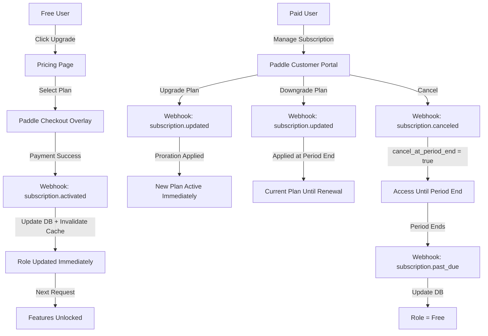

# Baduk App — Payment & Authentication Integration Research

**Version**: 3.0
**Date**: 2026-03-10
**Research Type**: Big Bang Integration Architecture (Research 4 — Complete System from Start)
**Pre-conditions**: Target MAU 8K to 50K, Freemium+Premium model, Global (Korea/Japan/US/EU), Tech Stack: Node.js 22 LTS, Next.js 15, PG 16, Redis 7.2
**Builder**: AI Agents (Claude Code) — no human developers

> **v3.0 Major Update — Big Bang Perspective**: Complete auth and payment system designed from Day 1. Retrofitting is more expensive than doing it properly. Auth.js v5 replaced by Better Auth (26K GitHub stars, 600K+ weekly npm downloads, TypeScript-native). Lucia Auth deprecated (March 2025). Paddle elevated to primary payment recommendation for global tax compliance. 5-tier subscription model. Korean/Japanese social login from launch. 4-week implementation plan.

---

## Executive Summary

This document argues for building the complete authentication and payment system from the start. The "Big Bang" approach front-loads a 4-week investment to avoid the compounding cost of retrofitting auth flows, payment integrations, and subscription logic into a live product.

**Key Recommendations:**
- **Auth**: Better Auth (self-hosted, TypeScript-native) with full social login from Day 1 — Google, GitHub, Apple, Discord, Kakao, Naver, LINE
- **Payment**: Paddle (Merchant of Record, 5% + $0.50) as primary for global tax compliance; Stripe as secondary for maximum flexibility
- **Subscription**: 5-tier model (Free / Basic $4.99 / Pro $9.99 / Instructor $19.99 / Enterprise custom)
- **RBAC**: Role-based access control with feature flags in PostgreSQL, enforced via Next.js middleware
- **2FA**: TOTP + magic link from Day 1 via Better Auth plugins
- **Timeline**: 4 weeks to production-ready complete system
- **Monthly platform cost at 50K MAU**: ~$0 auth (self-hosted) + ~$2,500 Paddle fees (at $50K MRR)

**Why front-load**: Every month of delay in building auth/payment properly costs 2-3x more in refactoring. Account linking bugs, subscription state inconsistencies, and regional payment gaps discovered post-launch cause user churn that is harder to recover than to prevent.

---

## Table of Contents

1. [Complete Auth System — Better Auth Deep Dive](#1-complete-auth-system--better-auth-deep-dive)
2. [Payment Platform Comparison](#2-payment-platform-comparison)
3. [Subscription Tiers Architecture](#3-subscription-tiers-architecture)
4. [International Payment Considerations](#4-international-payment-considerations)
5. [Database Schema Design](#5-database-schema-design)
6. [Implementation Plan — 4 Weeks](#6-implementation-plan--4-weeks)
7. [Decision Matrix & Final Recommendation](#7-decision-matrix--final-recommendation)

---

## 1. Complete Auth System — Better Auth Deep Dive

### 1.1 Auth Solution Landscape (2026)

The authentication library landscape has undergone a major shift since 2025:

| Solution | Type | Status (2026) | GitHub Stars | npm Weekly Downloads | Cost |
|----------|------|---------------|-------------|---------------------|------|
| **Better Auth** | Self-hosted, TypeScript | **Active, recommended** | 26K | 600K+ | Free (OSS) |
| **Auth.js v5** (NextAuth) | Self-hosted, multi-framework | Active, mature | 25K | 400K+ | Free (OSS) |
| **Lucia Auth** | Self-hosted, minimal | **Deprecated (March 2025)** | 9K | Declining | N/A |
| **Clerk** | Managed service | Active | N/A | N/A | $0.02/MAU after 10K free |
| **Auth0** | Managed service | Active | N/A | N/A | $0.07/MAU |

### 1.2 Why Better Auth Over Auth.js v5

Better Auth emerged in 2024-2025 as the community-recommended successor. Key advantages for the baduk app:

| Criterion | Better Auth | Auth.js v5 | Clerk |
|-----------|------------|-----------|-------|
| **TypeScript-native** | Yes (built from ground up) | Partial (JS origins) | N/A (managed) |
| **Plugin architecture** | First-class (2FA, RBAC, Org) | Callbacks-based | Built-in |
| **Kakao/Naver/LINE providers** | Built-in | Built-in | Limited |
| **RBAC** | Admin + Organization plugins | Manual JWT callbacks | Built-in |
| **2FA/TOTP** | Plugin (official) | Manual implementation | Built-in |
| **Magic link** | Built-in | Built-in | Built-in |
| **Account linking** | Built-in (multi-provider) | Manual | Automatic |
| **PostgreSQL adapter** | Kysely-based, auto-migration | Drizzle/Prisma adapters | N/A |
| **Session management** | DB sessions + JWT option | JWT or DB sessions | Managed |
| **Cost at 50K MAU** | $0 (self-hosted) | $0 (self-hosted) | ~$800/mo |
| **Next.js 15 integration** | Official plugin | Native support | Official SDK |
| **Passkeys/WebAuthn** | Supported | Experimental | Supported |

**Decision: Better Auth** — Zero cost at scale (critical for 50K MAU target), TypeScript-native plugin system that handles 2FA/RBAC/account-linking out of the box, and built-in support for all three Asian social login providers (Kakao, Naver, LINE).

**Why not Clerk**: At 50K MAU, Clerk costs ~$800/month ($9,600/year). Better Auth provides equivalent features for $0 in licensing. The engineering time to set up Better Auth (included in the 4-week plan) pays for itself within 2-3 months.

**Why not Auth.js v5**: Still viable, but Better Auth's plugin architecture is more elegant for the features we need (2FA, RBAC, organization/dojo management). Auth.js requires manual JWT callback wiring for features that Better Auth provides as drop-in plugins.

### 1.3 Better Auth Feature Set — Complete Configuration

**Social Login Providers (All from Day 1):**

| Provider | Market | Users | Priority |
|----------|--------|-------|----------|
| **Google** | Global | 2B+ | P0 — Universal |
| **Kakao** | Korea | 53M+ | P0 — Korean market |
| **Naver** | Korea | 42M+ | P0 — Korean market |
| **LINE** | Japan | 96M+ | P0 — Japanese market |
| **Apple** | Global (iOS) | 1B+ devices | P1 — Mobile users |
| **GitHub** | Dev community | 100M+ | P1 — Technical users |
| **Discord** | Gaming/community | 200M+ | P1 — Gaming community |

**Why all providers from Day 1**: Each provider takes ~30 minutes to configure in Better Auth. The total cost of adding 7 providers is ~3.5 hours. The cost of adding them later (database migration, UI updates, account linking edge cases, testing) is 2-3x higher per provider.

**Authentication Methods:**

| Method | Plugin/Feature | Configuration |
|--------|---------------|---------------|
| **Email + Password** | Built-in | Default |
| **Magic Link** | Built-in | Email provider required (Resend/SendGrid) |
| **2FA/TOTP** | `twoFactor` plugin | Authenticator app (Google Authenticator, Authy) |
| **Passkeys/WebAuthn** | `passkey` plugin | FIDO2 hardware keys, biometric |

**Account Linking:**
Better Auth separates user identity from authentication methods. A single user can have multiple `account` records — each representing a different provider (email/password, Google, Kakao, GitHub, etc.). The `allowDifferentEmails` setting enables linking accounts even when provider emails differ.

Current limitation: Account linking primarily supports OAuth providers. Magic link and password-based logins with different emails require the same email match. This is acceptable for the baduk app — users typically use one primary email.

### 1.4 RBAC Implementation

Better Auth's Admin and Organization plugins provide layered access control:

**User Roles (Admin Plugin):**

```typescript
enum UserRole {
  FREE = 'free',           // Default on signup
  BASIC = 'basic',         // $4.99/mo subscribers
  PRO = 'pro',             // $9.99/mo subscribers
  INSTRUCTOR = 'instructor', // $19.99/mo subscribers
  ADMIN = 'admin'          // System administrators
}
```

**Organization Roles (Organization Plugin — for Dojo/Instructor):**

```typescript
enum OrgRole {
  OWNER = 'owner',         // Instructor who created the dojo
  ADMIN = 'admin',         // Co-instructors
  MEMBER = 'member'        // Students
}
```

**Feature Permissions Matrix:**

| Feature | Free | Basic | Pro | Instructor | Admin |
|---------|------|-------|-----|------------|-------|
| Play games (9x9, 13x13) | Yes | Yes | Yes | Yes | Yes |
| Play games (19x19) | No | Yes | Yes | Yes | Yes |
| AI analysis (daily limit) | 3/day | 20/day | Unlimited | Unlimited | Unlimited |
| SGF import/export | No | Yes | Yes | Yes | Yes |
| Move commentary | No | No | Yes | Yes | Yes |
| Opening library | No | No | Yes | Yes | Yes |
| Advanced AI features | No | No | Yes | Yes | Yes |
| Student management | No | No | No | Yes | Yes |
| LMS features | No | No | No | Yes | Yes |
| Custom exercises | No | No | No | Yes | Yes |
| Bulk analytics | No | No | No | Yes | Yes |
| User management | No | No | No | No | Yes |
| System config | No | No | No | No | Yes |

### 1.5 Session Strategy

**Decision: Database sessions with Redis cache**

| Factor | JWT Sessions | Database Sessions + Redis |
|--------|-------------|--------------------------|
| **Validation speed** | 8-10ms | 5-15ms (Redis cached) |
| **Session revocation** | Cannot revoke before expiry | Instant server-side revocation |
| **Role change propagation** | Up to 15min delay | Immediate |
| **Subscription state sync** | Delayed until JWT refresh | Real-time via webhook then cache invalidation |
| **Horizontal scaling** | Stateless | Redis-backed (our stack includes Redis 7.2) |
| **Security** | Token in cookie (attack surface) | Session ID only in cookie |

**Why database sessions for Big Bang**: When a user upgrades from Free to Pro via Paddle checkout, the webhook updates the database. With JWT, the user would need to wait up to 15 minutes for the next token refresh to see their new features. With database sessions + Redis, the webhook invalidates the cache, and the next request reflects the upgrade immediately. For a payment-integrated app, this real-time sync is non-negotiable.

### 1.6 Configuration Architecture

```
src/
  lib/
    auth.ts                      <- Better Auth server instance
    auth-client.ts               <- Better Auth client instance
  app/
    api/auth/[...all]/route.ts   <- Better Auth API route handler
    (auth)/
      login/page.tsx             <- Login with all providers
      register/page.tsx          <- Registration
      verify-email/page.tsx      <- Email verification
      two-factor/page.tsx        <- 2FA setup/verify
    (protected)/
      layout.tsx                 <- Session check wrapper
    middleware.ts                 <- Route protection + RBAC
```

### 1.7 Production Examples Using Better Auth

1. **NuxSaaS** — Nuxt.js full-stack SaaS starter with Better Auth, Drizzle ORM, PostgreSQL for authentication, admin dashboard, and user management.

2. **Hono + Better Auth + Cloudflare Workers** — Scalable backend APIs using Better Auth with Hono framework on Cloudflare Workers, demonstrating edge deployment compatibility.

3. **ZenStack Multi-Tenant Apps** — Building multi-tenant applications with Better Auth for embedded authentication combined with ZenStack for embedded authorization — demonstrating the RBAC capabilities at scale.

4. **Better Auth + Encore.ts** — Complete backend guide using Better Auth with Encore's TypeScript backend framework, showing production patterns for session management and OAuth flows.

### 1.8 Security Considerations

| Concern | Mitigation |
|---------|-----------|
| **CSRF** | Better Auth includes CSRF protection by default |
| **XSS** | HTTP-only cookies for session tokens |
| **Brute force** | Built-in rate limiting plugin |
| **Account enumeration** | Configurable error messages |
| **OAuth state hijacking** | PKCE flow for all OAuth providers |
| **Session fixation** | New session ID on authentication |
| **2FA bypass** | TOTP with backup codes stored hashed |

---

## 2. Payment Platform Comparison

### 2.1 Comprehensive Comparison

| Factor | Stripe | Paddle | Lemon Squeezy |
|--------|--------|--------|---------------|
| **Pricing** | 2.9% + $0.30 | 5% + $0.50 | 5% + $0.50 |
| **Under $10 transactions** | 2.9% + $0.30 | 10% (special rate) | 5% + $0.50 |
| **Merchant of Record** | You (or SMP beta) | Paddle | Lemon Squeezy |
| **Global tax compliance** | Manual (or Stripe Tax) | Automatic (100+ jurisdictions) | Automatic |
| **Korean payments** | Credit cards, KakaoPay (2025), NaverPay | KakaoPay, NaverPay, PAYCO, 22+ local cards | Limited |
| **Japanese payments** | Konbini, JCB, PayPay (2025) | Supported | Limited |
| **Multi-currency** | 135+ currencies | 30+ currencies (KRW, JPY included) | Limited |
| **Subscription management** | Full (Customer Portal) | Full (Retain for churn reduction) | Basic |
| **Webhook reliability** | Excellent | Good (webhook simulator) | Good |
| **Next.js starter kit** | Vercel template | Official paddle-nextjs-starter-kit | Community |
| **Integration time** | 2-4 weeks (full) | 2-5 days (basic) | 1-3 days |
| **Payout timing** | 2 business days | NET-14 to NET-30 | NET-14 |
| **Dispute handling** | You handle ($15/dispute) | Paddle handles (included) | Lemon Squeezy handles |
| **Refund policy** | You decide | Paddle decides (30-day policy) | Lemon Squeezy decides |
| **Status** | Mature, industry standard | Growing, SaaS-focused | Acquired by Stripe (2024) |

Note: Stripe's Korean payment support via Stripe Japan entity; requires Japan-based Stripe account for full Konbini/PayPay support.

### 2.2 Why Paddle as Primary (Big Bang Perspective)

The Big Bang approach prioritizes **completeness from Day 1**. Paddle as Merchant of Record eliminates the single largest operational burden for a globally-targeted baduk app: **international tax compliance**.

**The tax compliance argument:**

| Market | Tax Type | Rate | Stripe (you handle) | Paddle (handled) |
|--------|----------|------|--------------------|--------------------|
| **US** | Sales tax | 0-10.25% (varies by state) | Must register in each nexus state | Paddle handles |
| **EU** | VAT | 17-27% (varies by country) | Must register for VAT MOSS | Paddle handles |
| **Korea** | VAT | 10% | Must register with NTS | Paddle handles |
| **Japan** | Consumption tax | 10% | Must register with NTA | Paddle handles |
| **UK** | VAT | 20% | Must register with HMRC | Paddle handles |

With Stripe, you need to:
1. Register for tax in each jurisdiction where you have customers
2. Calculate correct tax rates per location
3. Collect and remit taxes quarterly/monthly
4. File tax returns in each jurisdiction
5. Handle tax audits

With Paddle, all of this is handled automatically. Paddle is the legal seller — they invoice customers, collect payment, handle tax, and pay you the net amount.

**Cost analysis: "Paddle is expensive" is a myth at this scale.**

At 500 paying users ($9.99/mo average):

| | Stripe | Stripe + Tax Handling | Paddle |
|--|--------|----------------------|--------|
| Transaction fees | $295/mo | $295/mo | $500/mo |
| Tax compliance tool | $0 | $50-100/mo (Stripe Tax) | $0 (included) |
| Accountant for global tax | $0 | $200-500/mo | $0 (included) |
| Developer time for tax logic | $0 | 20-40 hours initial | $0 |
| Dispute handling | $15/dispute | $15/dispute | $0 (included) |
| **Effective total** | **$295/mo + tax risk** | **$545-895/mo** | **$500/mo** |

**Paddle is actually cheaper** when you account for the true cost of global tax compliance.

### 2.3 Stripe as Secondary — When and Why

Stripe remains the superior choice for:
- **Maximum payment method flexibility** (135+ currencies, 100+ payment methods)
- **Usage-based billing** (if AI analysis becomes per-use in the future)
- **Custom checkout flows** (advanced A/B testing, localized pricing experiments)
- **AI agent integration** (Stripe Agent Toolkit for automated operations)

**Recommended dual strategy:**

| Scenario | Primary | Secondary |
|----------|---------|-----------|
| **Day 1 — Global subscriptions** | Paddle | — |
| **Month 3+ — Usage-based AI billing** | Paddle (subscriptions) | Stripe (metered usage) |
| **Month 6+ — Enterprise/custom deals** | Paddle (standard) | Stripe (custom invoicing) |

### 2.4 Lemon Squeezy — Not Recommended

- Acquired by Stripe (July 2024) — future uncertain, possible deprecation
- Only 21 payment methods vs Paddle's 200+ — insufficient for a globally-targeted baduk app
- Same pricing as Paddle (5% + $0.50) but fewer features
- No official Next.js starter kit

### 2.5 Korean Payment Gateways — Supplementary Analysis

For deep Korean market penetration beyond what Paddle provides:

| Gateway | Market Share | Key Features | Fees | Integration Effort |
|---------|-------------|-------------|------|-------------------|
| **Toss Payments** | Growing fast | Modern API, widget integration, developer-friendly | ~2.5-3.2% | Low (REST API + npm SDK) |
| **KG Inicis** | Largest legacy PG | Widest merchant network, all payment methods | ~2.5-3.5% | Medium (older API patterns) |
| **NHN KCP** | Major PG | Stable, hub-type integration | ~2.5-3.5% | Medium |

**Recommendation**: Not needed for initial launch. Paddle already supports KakaoPay, NaverPay, PAYCO, and 22+ Korean local cards. Only consider a dedicated Korean PG if >30% of users are Korean and demand payment methods Paddle does not cover (bank transfer, specific convenience store payments).

**Toss Payments advantages if needed later:**
- Modern RESTful API with official npm package (`toss-payments-server-api`)
- Widget-based checkout (low-code, embed in React)
- Idempotency key support for reliable webhook processing
- Test mode with `test_sk` / `test_gsk` keys
- Documentation in English and Korean

### 2.6 Production Examples

1. **Paddle**: Used by over 4,000+ SaaS companies globally. Paddle processes payments in 200+ countries, handles tax compliance in 100+ jurisdictions, and supports localized checkout experiences.

2. **Stripe + Next.js**: Vercel's official `nextjs-subscription-payments` template demonstrates the complete Stripe subscription lifecycle with Next.js App Router — checkout, webhooks, subscription management, and Customer Portal.

3. **Paddle + Next.js Starter Kit**: Official `PaddleHQ/paddle-nextjs-starter-kit` on GitHub — complete SaaS app powered by Paddle Billing with Next.js, Tailwind, and Supabase. Ready to deploy on Vercel. Auto-syncs customer and subscription data via webhooks.

---

## 3. Subscription Tiers Architecture

### 3.1 5-Tier Pricing Model

```
+──────────────+──────────────+──────────────+──────────────+──────────────+
|   Free       |   Basic      |   Pro        |  Instructor  |  Enterprise  |
|   $0/mo      |   $4.99/mo   |   $9.99/mo   |  $19.99/mo   |  Custom      |
+──────────────+──────────────+──────────────+──────────────+──────────────+
| 3 AI/day     | 20 AI/day    | Unlimited AI | Unlimited AI | Unlimited AI |
| 9x9, 13x13  | All boards   | All boards   | All boards   | All boards   |
| Basic review | Basic review | Deep review  | Deep review  | Deep review  |
| —            | SGF export   | SGF export   | SGF export   | SGF export   |
| —            | —            | Commentary   | Commentary   | Commentary   |
| —            | —            | Opening lib  | Opening lib  | Opening lib  |
| —            | —            | Adv AI feat  | Adv AI feat  | Adv AI feat  |
| —            | —            | —            | Student mgmt | Student mgmt |
| —            | —            | —            | LMS features | LMS features |
| —            | —            | —            | Custom exer  | Custom exer  |
| —            | —            | —            | Bulk analyt  | Bulk analyt  |
| —            | —            | —            | —            | SSO/SAML     |
| —            | —            | —            | —            | Dedicated    |
| —            | —            | —            | —            | SLA          |
+──────────────+──────────────+──────────────+──────────────+──────────────+
```

**Why 5 tiers from Day 1:**
- **Free**: Acquisition funnel — demonstrate AI analysis value
- **Basic ($4.99)**: Low barrier to conversion — "try premium for a coffee price"
- **Pro ($9.99)**: Power users — unlimited AI analysis is the key differentiator
- **Instructor ($19.99)**: Dojo owners/teachers — per-seat for students
- **Enterprise**: Custom — Go schools, federations, tournament organizers

**Comparable pricing in the Go app ecosystem:**
- AI Sensei (Go analysis): ~$5/mo for Pro tier
- Lichess (chess): Donation-based, no subscription tiers
- Chess.com: $5.99-$15.99/mo for Diamond tier

### 3.2 Trial Strategy

**Decision: 7-day free trial of Pro tier, credit card required**

| Metric | 7-day trial (CC required) | 14-day trial | Freemium only |
|--------|--------------------------|-------------|---------------|
| **Conversion rate** | ~40% | ~25-30% | 2-6% |
| **User urgency** | High | Medium | Low |
| **Abuse risk** | Low | Medium | High |

**Baduk-specific rationale**: A Go player can play 10-15 games in 7 days. With AI analysis after each game, the "aha moment" — seeing KataGo reveal a missed tesuji or a suboptimal joseki choice — happens within 3-5 games. 7 days is sufficient to demonstrate value.

### 3.3 Upgrade/Downgrade Flow



**Proration handling (Paddle):**
- **Upgrade**: Immediate access, prorated charge for remaining billing period
- **Downgrade**: Current plan continues until end of billing period, then switches
- **Cancel**: Access continues until end of current billing period

### 3.4 Feature Gating — Three-Layer Implementation

**Layer 1 — Next.js Middleware (Route-Level):**

Runs at the edge before every request. Checks session role against route requirements. `/pro/*` routes require role >= 'pro'. `/instructor/*` routes require role >= 'instructor'. `/admin/*` routes require role === 'admin'. Returns 403 or redirect to `/upgrade` for unauthorized access.

**Layer 2 — FeatureGate Component (UI-Level):**

`<FeatureGate>` wraps individual features. Shows upgrade prompt or hides feature based on user's plan. Uses centralized permissions module — NOT scattered if/else checks.

```typescript
<FeatureGate requiredPlan="pro" fallback={<UpgradePrompt />}>
  <DeepAnalysisPanel game={game} />
</FeatureGate>
```

**Layer 3 — API-Level Rate Limiting (Redis):**

Server-side enforcement for usage-limited features. Free: 3 AI analyses/day, Basic: 20/day, Pro+: unlimited. Redis counter with daily TTL expiry. Returns 429 with upgrade prompt when limit exceeded.

**Best practice**: Centralize all plan-feature mappings in a single `permissions.ts` module. Components and middleware reference this module — no `if (user.plan === 'pro')` scattered across the codebase.

### 3.5 Webhook Processing (Paddle)

**Essential subscription lifecycle events:**

| Paddle Event | Action | DB Update |
|-------------|--------|-----------|
| `subscription.activated` | New subscription created | Create subscription record, update user role, invalidate Redis cache |
| `subscription.updated` | Plan change, trial end | Update plan/status, adjust feature access |
| `subscription.canceled` | Cancellation scheduled | Set `scheduled_change` with cancellation date |
| `subscription.past_due` | Payment failed | Set `past_due` status, trigger dunning email |
| `subscription.paused` | User paused subscription | Set role to `free`, preserve subscription record |
| `subscription.resumed` | User resumed | Restore previous role |
| `transaction.completed` | Payment succeeded | Log payment, update `current_billing_period` |
| `transaction.payment_failed` | Payment failed | Increment retry counter, send notification |

**Paddle webhook best practices:**
- Verify webhook signature using Paddle's notification verification
- Return 200 immediately, process asynchronously
- Store Paddle entity IDs (`subscription_id`, `customer_id`, `transaction_id`) for API calls
- Use the webhook simulator for testing — no need for real checkout completions
- Paddle's Next.js starter kit includes webhook handler boilerplate

---

## 4. International Payment Considerations

### 4.1 Market-by-Market Payment Landscape

| Market | Primary Payment Methods | Paddle Coverage | Stripe Coverage |
|--------|------------------------|----------------|----------------|
| **Korea** | Credit cards, KakaoPay (36M), NaverPay, Toss Pay, PAYCO | KakaoPay, NaverPay, PAYCO, 22+ local cards | Credit cards, KakaoPay, NaverPay |
| **Japan** | Credit cards, Konbini (40% online shoppers), JCB, PayPay (68M) | Supported | Konbini, JCB, PayPay (2025) |
| **US** | Credit cards, Apple Pay, Google Pay, PayPal | Full support | Full support |
| **EU** | Credit cards, SEPA, iDEAL, Bancontact | Full support | Full support |
| **China** | Alipay (1.3B), WeChat Pay (900M) | Supported | Supported (some beta) |

Note: Stripe's Korean payment support requires Japan-based Stripe entity for some features.

### 4.2 Multi-Currency Support

**Paddle approach (recommended):**
- Prices can be set in 30+ currencies including KRW, JPY, USD, EUR
- Automatic currency localization at checkout based on customer location
- Price override per currency per product — set KRW 6,900/mo for Korea, JPY 750/mo for Japan
- No additional setup needed — Paddle handles currency conversion

**Recommended pricing per market:**

| Plan | USD | KRW | JPY | EUR |
|------|-----|-----|-----|-----|
| Basic | $4.99 | 6,900 | 750 | 4.49 |
| Pro | $9.99 | 13,900 | 1,480 | 9.49 |
| Instructor | $19.99 | 27,900 | 2,980 | 18.99 |

**Pricing psychology**: Round to nearest culturally natural number per currency. KRW 6,900 (not 6,712) and JPY 750 (not 749.25).

### 4.3 Tax Compliance — Paddle as MoR

Paddle as Merchant of Record handles:

| Jurisdiction | Tax Type | Rate | Paddle Handles |
|-------------|----------|------|----------------|
| **US (50 states)** | Sales tax | 0-10.25% | Registration, calculation, collection, remittance, filing |
| **EU (27 countries)** | VAT | 17-27% | VAT MOSS registration, reverse charge, invoicing |
| **UK** | VAT | 20% | HMRC registration, quarterly filing |
| **Korea** | VAT | 10% | NTS compliance |
| **Japan** | Consumption tax | 10% | JCT compliance |
| **Canada** | GST/HST/QST | 5-14.975% | Federal + provincial tax handling |
| **Australia** | GST | 10% | ATO compliance |

**What this means in practice**: You receive net revenue (after Paddle's fee and taxes). Paddle issues invoices to customers in their local format, collects the correct tax, and remits it. You never interact with tax authorities for digital product sales.

### 4.4 Regional Authentication Mapping

The authentication system must align with regional payment expectations:

| Region | Auth Provider | Payment Flow |
|--------|-------------|-------------|
| **Korea** | Kakao Login then Paddle checkout with KakaoPay | Single Kakao ecosystem experience |
| **Japan** | LINE Login then Paddle checkout with credit card/JCB | Familiar LINE ecosystem |
| **US/EU** | Google/Apple Login then Paddle checkout with card/PayPal | Standard Western flow |
| **Dev community** | GitHub/Discord Login then Paddle checkout | Technical user flow |

---

## 5. Database Schema Design

### 5.1 Auth Tables (Better Auth + PostgreSQL)

Better Auth auto-generates these tables via CLI migration. Custom fields are added to the `user` table:

```sql
-- Better Auth core tables (auto-managed by Better Auth CLI)
CREATE TABLE "user" (
  id              TEXT PRIMARY KEY,
  name            TEXT,
  email           TEXT UNIQUE NOT NULL,
  email_verified  BOOLEAN NOT NULL DEFAULT FALSE,
  image           TEXT,
  -- Custom fields for baduk app
  role            TEXT NOT NULL DEFAULT 'free',
    -- 'free' | 'basic' | 'pro' | 'instructor' | 'admin'
  paddle_customer_id TEXT UNIQUE,
  display_name    TEXT,            -- Go-specific display name
  go_rank         TEXT,            -- e.g., '5d', '10k', '3p'
  preferred_lang  TEXT DEFAULT 'en', -- 'en' | 'ko' | 'ja'
  created_at      TIMESTAMPTZ NOT NULL DEFAULT NOW(),
  updated_at      TIMESTAMPTZ NOT NULL DEFAULT NOW()
);

CREATE TABLE "account" (
  id                  TEXT PRIMARY KEY,
  user_id             TEXT NOT NULL REFERENCES "user"(id) ON DELETE CASCADE,
  account_id          TEXT NOT NULL,       -- Provider-specific account ID
  provider_id         TEXT NOT NULL,       -- 'google' | 'kakao' | 'naver' | 'line' | 'credential'
  access_token        TEXT,
  refresh_token       TEXT,
  access_token_expires_at TIMESTAMPTZ,
  refresh_token_expires_at TIMESTAMPTZ,
  scope               TEXT,
  id_token            TEXT,
  password            TEXT,               -- Hashed, for credential provider only
  created_at          TIMESTAMPTZ NOT NULL DEFAULT NOW(),
  updated_at          TIMESTAMPTZ NOT NULL DEFAULT NOW()
);

CREATE TABLE "session" (
  id          TEXT PRIMARY KEY,
  user_id     TEXT NOT NULL REFERENCES "user"(id) ON DELETE CASCADE,
  token       TEXT UNIQUE NOT NULL,       -- Session token in cookie
  expires_at  TIMESTAMPTZ NOT NULL,
  ip_address  TEXT,
  user_agent  TEXT,
  created_at  TIMESTAMPTZ NOT NULL DEFAULT NOW(),
  updated_at  TIMESTAMPTZ NOT NULL DEFAULT NOW()
);

CREATE TABLE "verification" (
  id          TEXT PRIMARY KEY,
  identifier  TEXT NOT NULL,              -- Email address
  value       TEXT NOT NULL,              -- Verification token
  expires_at  TIMESTAMPTZ NOT NULL,
  created_at  TIMESTAMPTZ NOT NULL DEFAULT NOW(),
  updated_at  TIMESTAMPTZ NOT NULL DEFAULT NOW()
);

-- Better Auth 2FA plugin tables
CREATE TABLE "two_factor" (
  id          TEXT PRIMARY KEY,
  user_id     TEXT NOT NULL REFERENCES "user"(id) ON DELETE CASCADE,
  secret      TEXT NOT NULL,              -- TOTP secret (encrypted)
  backup_codes TEXT NOT NULL,             -- JSON array of hashed backup codes
  created_at  TIMESTAMPTZ NOT NULL DEFAULT NOW()
);

-- Better Auth Organization plugin tables (for Dojo/Instructor features)
CREATE TABLE "organization" (
  id          TEXT PRIMARY KEY,
  name        TEXT NOT NULL,
  slug        TEXT UNIQUE NOT NULL,
  logo        TEXT,
  metadata    JSONB,                      -- Dojo-specific: address, website, etc.
  created_at  TIMESTAMPTZ NOT NULL DEFAULT NOW()
);

CREATE TABLE "member" (
  id              TEXT PRIMARY KEY,
  organization_id TEXT NOT NULL REFERENCES "organization"(id) ON DELETE CASCADE,
  user_id         TEXT NOT NULL REFERENCES "user"(id) ON DELETE CASCADE,
  role            TEXT NOT NULL DEFAULT 'member', -- 'owner' | 'admin' | 'member'
  created_at      TIMESTAMPTZ NOT NULL DEFAULT NOW(),
  UNIQUE(organization_id, user_id)
);
```

### 5.2 Subscription Tables

```sql
CREATE TABLE subscriptions (
  id                      TEXT PRIMARY KEY DEFAULT gen_random_uuid(),
  user_id                 TEXT NOT NULL REFERENCES "user"(id) ON DELETE CASCADE,
  paddle_subscription_id  TEXT UNIQUE NOT NULL,
  paddle_customer_id      TEXT NOT NULL,
  paddle_price_id         TEXT NOT NULL,
  status                  TEXT NOT NULL DEFAULT 'active',
    -- 'trialing' | 'active' | 'past_due' | 'canceled' | 'paused'
  plan                    TEXT NOT NULL DEFAULT 'basic',
    -- 'basic' | 'pro' | 'instructor'
  current_period_start    TIMESTAMPTZ NOT NULL,
  current_period_end      TIMESTAMPTZ NOT NULL,
  cancel_at_period_end    BOOLEAN NOT NULL DEFAULT FALSE,
  canceled_at             TIMESTAMPTZ,
  paused_at               TIMESTAMPTZ,
  trial_start             TIMESTAMPTZ,
  trial_end               TIMESTAMPTZ,
  -- Paddle-specific
  collection_mode         TEXT DEFAULT 'automatic', -- 'automatic' | 'manual'
  billing_cycle_interval  TEXT DEFAULT 'month',     -- 'month' | 'year'
  scheduled_change        JSONB,                     -- Upcoming plan change details
  created_at              TIMESTAMPTZ NOT NULL DEFAULT NOW(),
  updated_at              TIMESTAMPTZ NOT NULL DEFAULT NOW()
);

CREATE INDEX idx_subscriptions_user ON subscriptions(user_id);
CREATE INDEX idx_subscriptions_paddle ON subscriptions(paddle_subscription_id);
CREATE INDEX idx_subscriptions_status ON subscriptions(status);

CREATE TABLE payment_history (
  id                      TEXT PRIMARY KEY DEFAULT gen_random_uuid(),
  user_id                 TEXT NOT NULL REFERENCES "user"(id) ON DELETE CASCADE,
  paddle_transaction_id   TEXT UNIQUE,
  amount                  INTEGER NOT NULL,          -- In smallest currency unit
  currency                TEXT NOT NULL DEFAULT 'USD',
  status                  TEXT NOT NULL,             -- 'completed' | 'failed' | 'refunded'
  description             TEXT,
  paddle_invoice_url      TEXT,                      -- Link to Paddle-hosted invoice
  created_at              TIMESTAMPTZ NOT NULL DEFAULT NOW()
);

CREATE INDEX idx_payments_user ON payment_history(user_id);
CREATE INDEX idx_payments_status ON payment_history(status);
```

### 5.3 Feature Entitlements Table

```sql
CREATE TABLE feature_entitlements (
  id          TEXT PRIMARY KEY DEFAULT gen_random_uuid(),
  plan        TEXT NOT NULL,
    -- 'free' | 'basic' | 'pro' | 'instructor' | 'enterprise'
  feature_key TEXT NOT NULL,
    -- 'ai_analysis' | 'board_19x19' | 'sgf_export' | 'move_commentary'
    -- | 'opening_library' | 'advanced_ai' | 'student_mgmt' | 'lms'
    -- | 'custom_exercises' | 'bulk_analytics' | 'sso_saml'
  limit_value INTEGER,                   -- NULL = unlimited, number = daily/monthly limit
  limit_type  TEXT,                      -- 'daily' | 'monthly' | NULL (unlimited)
  UNIQUE(plan, feature_key)
);

-- Seed data — complete feature matrix
INSERT INTO feature_entitlements (plan, feature_key, limit_value, limit_type) VALUES
  -- Free tier
  ('free', 'ai_analysis', 3, 'daily'),
  ('free', 'board_9x9', NULL, NULL),
  ('free', 'board_13x13', NULL, NULL),

  -- Basic tier
  ('basic', 'ai_analysis', 20, 'daily'),
  ('basic', 'board_9x9', NULL, NULL),
  ('basic', 'board_13x13', NULL, NULL),
  ('basic', 'board_19x19', NULL, NULL),
  ('basic', 'sgf_export', NULL, NULL),

  -- Pro tier
  ('pro', 'ai_analysis', NULL, NULL),       -- Unlimited
  ('pro', 'board_9x9', NULL, NULL),
  ('pro', 'board_13x13', NULL, NULL),
  ('pro', 'board_19x19', NULL, NULL),
  ('pro', 'sgf_export', NULL, NULL),
  ('pro', 'move_commentary', NULL, NULL),
  ('pro', 'opening_library', NULL, NULL),
  ('pro', 'advanced_ai', NULL, NULL),

  -- Instructor tier
  ('instructor', 'ai_analysis', NULL, NULL),
  ('instructor', 'board_9x9', NULL, NULL),
  ('instructor', 'board_13x13', NULL, NULL),
  ('instructor', 'board_19x19', NULL, NULL),
  ('instructor', 'sgf_export', NULL, NULL),
  ('instructor', 'move_commentary', NULL, NULL),
  ('instructor', 'opening_library', NULL, NULL),
  ('instructor', 'advanced_ai', NULL, NULL),
  ('instructor', 'student_mgmt', NULL, NULL),
  ('instructor', 'lms', NULL, NULL),
  ('instructor', 'custom_exercises', NULL, NULL),
  ('instructor', 'bulk_analytics', NULL, NULL);

-- Usage tracking (Redis-backed for hot path, PG for audit)
CREATE TABLE usage_tracking (
  id          TEXT PRIMARY KEY DEFAULT gen_random_uuid(),
  user_id     TEXT NOT NULL REFERENCES "user"(id) ON DELETE CASCADE,
  feature_key TEXT NOT NULL,
  usage_count INTEGER NOT NULL DEFAULT 0,
  period_start TIMESTAMPTZ NOT NULL,       -- Start of current period (day/month)
  period_end  TIMESTAMPTZ NOT NULL,        -- End of current period
  created_at  TIMESTAMPTZ NOT NULL DEFAULT NOW(),
  updated_at  TIMESTAMPTZ NOT NULL DEFAULT NOW(),
  UNIQUE(user_id, feature_key, period_start)
);

CREATE INDEX idx_usage_user_feature ON usage_tracking(user_id, feature_key);
CREATE INDEX idx_usage_period ON usage_tracking(period_start, period_end);
```

### 5.4 Redis Schema (Feature Gating Hot Path)

```
# Session cache (Better Auth DB session to Redis)
session:{sessionId}  = JSON { userId, role, paddleCustomerId, expiresAt }
TTL: matches session expiry

# Feature entitlement cache
entitlements:{plan}  = JSON { featureKey: { limit, type } }
TTL: 900 seconds (15 min, stable data)

# Usage counter (daily limits)
usage:{userId}:{featureKey}:{YYYY-MM-DD}  = INTEGER (count)
TTL: 86400 seconds (24 hours, auto-expire)

# Rate limiting
ratelimit:{userId}:{endpoint}  = INTEGER (request count)
TTL: 60 seconds (per-minute window)
```

---

## 6. Implementation Plan — 4 Weeks

### 6.1 Week 1: Complete Auth System

| Day | Task | Automatable? | Details |
|-----|------|-------------|---------|
| 1 | Better Auth setup: `auth.ts`, `auth-client.ts`, PostgreSQL adapter | Yes | Install `better-auth`, configure server + client instances |
| 1 | Email + password provider + magic link | Yes | Configure Resend/SendGrid for transactional email |
| 1 | Google OAuth provider | Yes | Google Cloud Console app creation is **manual** |
| 2 | Kakao, Naver, LINE OAuth providers | Yes | Provider registration on each platform is **manual** |
| 2 | GitHub, Discord, Apple OAuth providers | Yes | Provider registration is **manual** |
| 2 | DB migration: all auth tables (user, account, session, verification) | Yes | Better Auth CLI: `npx @better-auth/cli migrate` |
| 3 | 2FA/TOTP plugin setup | Yes | `twoFactor` plugin with TOTP + backup codes |
| 3 | Admin plugin: RBAC with 5 roles | Yes | Configure role hierarchy and permissions |
| 4 | Organization plugin: Dojo management | Yes | Organization + member tables, role assignments |
| 4 | Account linking configuration | Yes | Multi-provider linking with `allowDifferentEmails` |
| 5 | Next.js middleware: route protection + RBAC enforcement | Yes | `/pro/*`, `/instructor/*`, `/admin/*` guards |
| 5 | Login/register/2FA UI pages | Yes | Server Components with Better Auth UI library |
| 5 | Redis session caching | Yes | Session to Redis on create/update, invalidate on logout |
| 6-7 | Integration testing: all 7 OAuth providers + 2FA flows | Partially | OAuth provider callbacks require real credentials |

**Manual steps (cannot be AI-automated):**
- Google Cloud Console: OAuth app creation, redirect URIs
- Kakao Developers: App registration, Kakao Login activation
- Naver Developers: App registration, login API activation
- LINE Developers: Channel creation, login configuration
- Apple Developer: Sign in with Apple configuration
- GitHub Settings: OAuth app registration
- Discord Developer: Application + OAuth2 setup
- Email provider (Resend/SendGrid): Account setup, domain verification, API key

### 6.2 Week 2: Payment Integration (Paddle + Webhooks)

| Day | Task | Automatable? | Details |
|-----|------|-------------|---------|
| 1 | Paddle account setup, products + prices configuration | **Manual** | Dashboard: create 4 products (Basic/Pro/Instructor), set prices per currency |
| 1 | Paddle.js SDK integration | Yes | Client-side checkout overlay |
| 2 | Webhook handler: `/api/webhooks/paddle/route.ts` | Yes | Signature verification, event routing |
| 2 | Webhook to DB sync: subscription lifecycle | Yes | `subscription.activated`, `subscription.updated`, `subscription.canceled` |
| 3 | Webhook to DB sync: payment events | Yes | `transaction.completed`, `transaction.payment_failed` |
| 3 | Redis cache invalidation on subscription changes | Yes | Webhook triggers cache bust for user session/entitlements |
| 4 | Pricing page with plan comparison | Yes | Server Component with Paddle checkout integration |
| 4 | Paddle Customer Portal integration | Yes | Manage subscription, update payment, view invoices |
| 5 | Trial flow: 7-day Pro trial, CC required | Yes | Paddle subscription with `trial_period` configuration |

**Manual steps:**
- Paddle account creation and verification
- Paddle Dashboard: create Products, Prices (per currency), Checkout settings
- Paddle Dashboard: configure notification destination (webhook URL)
- Paddle Dashboard: customize checkout branding

### 6.3 Week 3: Subscription Management + Feature Gating

| Day | Task | Automatable? | Details |
|-----|------|-------------|---------|
| 1 | Feature entitlements table + seed data | Yes | All plan-feature mappings |
| 1 | `permissions.ts` centralized module | Yes | Single source for plan-feature checks |
| 2 | `<FeatureGate>` React component | Yes | UI-level feature gating with upgrade prompts |
| 2 | API-level rate limiting (Redis) | Yes | Daily AI analysis limits per plan |
| 3 | Usage tracking: `usage_tracking` table + Redis counters | Yes | Real-time usage display in user dashboard |
| 3 | Upgrade/downgrade flow: UI + Paddle API | Yes | Plan switching with proration |
| 4 | Dunning flow: payment failure handling | Yes | Email notifications, grace period logic |
| 4 | Trial-ending notification emails | Yes | 3-day warning before trial expires |
| 5 | Admin dashboard: user management, subscription overview | Yes | Admin-only pages with Better Auth admin plugin |

### 6.4 Week 4: Testing + Security Audit

| Day | Task | Automatable? | Details |
|-----|------|-------------|---------|
| 1 | End-to-end auth tests: all 7 OAuth flows | Partially | Requires test credentials for each provider |
| 1 | 2FA enrollment + verification tests | Yes | TOTP generation and validation |
| 2 | Payment flow tests: checkout to webhook to access | Yes | Paddle sandbox environment |
| 2 | Subscription lifecycle tests: trial to active to cancel to expire | Yes | Paddle webhook simulator |
| 3 | Feature gating tests: each plan level access | Yes | Middleware + component + API level |
| 3 | Rate limiting tests: usage counter accuracy | Yes | Redis counter behavior |
| 4 | Security audit: CSRF, XSS, session fixation, injection | Yes | Automated security scanning |
| 4 | Load testing: auth + payment under concurrent users | Yes | k6 or Artillery |
| 5 | Documentation: API endpoints, webhook payloads, deployment guide | Yes | For future maintainers |

### 6.5 Timeline Summary

```
Week 1: Auth (7 providers + 2FA + RBAC + Organizations)  = Foundation
Week 2: Payment (Paddle + webhooks + checkout + portal)   = Revenue
Week 3: Subscriptions (gating + tracking + admin)         = Business logic
Week 4: Testing + Security                                = Quality gate
Total: 4 weeks to production-ready complete system
```

**AI agent automation rate**: ~70% of tasks are fully automatable. The remaining 30% requires manual account creation on OAuth provider platforms, Paddle Dashboard configuration, and credential management.

---

## 7. Decision Matrix & Final Recommendation

### 7.1 Auth Decision

| Decision | Choice | Rationale |
|----------|--------|-----------|
| **Auth library** | Better Auth | TypeScript-native, plugin system (2FA/RBAC/Org), 26K stars, 600K+ weekly downloads, $0 at scale |
| **Session strategy** | DB sessions + Redis cache | Instant role changes on payment events, real-time subscription sync |
| **Social providers (Day 1)** | Google, Kakao, Naver, LINE, Apple, GitHub, Discord | Complete market coverage — Korea, Japan, global |
| **2FA** | TOTP via Better Auth plugin | Built-in, backup codes, no third-party dependency |
| **Account linking** | Better Auth built-in | Multi-provider to single user, allowDifferentEmails |
| **RBAC** | Admin + Organization plugins | 5 user roles + 3 org roles (for Dojo/Instructor) |
| **Passkeys** | Better Auth passkey plugin | Available from Day 1, progressive enhancement |
| **Magic link** | Better Auth built-in | Passwordless option for users who prefer it |

### 7.2 Payment Decision

| Decision | Choice | Rationale |
|----------|--------|-----------|
| **Primary payment** | Paddle (MoR) | Global tax compliance in 100+ jurisdictions, KakaoPay/NaverPay, zero tax overhead |
| **Secondary (future)** | Stripe | Usage-based billing, enterprise custom invoicing, maximum flexibility |
| **Checkout** | Paddle Checkout overlay | Stays on domain, PCI compliant, localized per market |
| **Subscription mgmt** | Paddle Customer Portal | Zero custom billing UI, Paddle-hosted |
| **Trial** | 7-day Pro trial, CC required | ~40% conversion benchmark, sufficient for Go "aha moment" |
| **Tax handling** | Paddle MoR (automatic) | No tax registration, filing, or remittance needed |
| **Multi-currency** | KRW, JPY, USD, EUR localized prices | Paddle handles conversion, display, and collection |
| **Korean payments** | Paddle (KakaoPay, NaverPay, PAYCO, local cards) | Native support, no additional integration |
| **Japanese payments** | Paddle (JCB, credit cards) | Native support |
| **Webhook processing** | Async DB sync + Redis cache invalidation | Real-time feature access on payment events |

### 7.3 Cost Projection

**Auth costs (Better Auth — self-hosted):**

| MAU | Better Auth | Clerk (comparison) | Auth0 (comparison) |
|-----|------------|-------------------|-------------------|
| 8K | $0 | $0 (free tier) | $0 (free tier) |
| 10K | $0 | $0 (free tier limit) | $0 (free tier limit) |
| 25K | $0 | $300/mo | $1,050/mo |
| 50K | $0 | $800/mo | $2,800/mo |
| **Annual at 50K** | **$0** | **$9,600** | **$33,600** |

Better Auth's self-hosted model saves $9,600-$33,600/year at the 50K MAU target. Infrastructure cost (PostgreSQL + Redis, already in the stack) is negligible.

**Payment costs (Paddle at various MRR):**

| Phase | Paying Users | Avg Revenue/User | MRR | Paddle Fees (5%+$0.50) | Net Revenue |
|-------|-------------|-----------------|-----|----------------------|-------------|
| Month 1-3 | 50 | $7.50 | $375 | $44 | $331 |
| Month 3-6 | 200 | $8.00 | $1,600 | $180 | $1,420 |
| Month 6-12 | 500 | $9.00 | $4,500 | $475 | $4,025 |
| Target (50K MAU) | 2,500 | $10.00 | $25,000 | $2,500 | $22,500 |
| Scale (50K MAU) | 5,000 | $10.00 | $50,000 | $5,000 | $45,000 |

**Total monthly platform costs at target scale (50K MAU, 2,500 paying users):**

| Component | Monthly Cost |
|-----------|-------------|
| Auth (Better Auth) | $0 |
| Payment processing (Paddle) | ~$2,500 |
| Email service (Resend) | ~$20 |
| Redis (already in stack) | $0 incremental |
| PostgreSQL (already in stack) | $0 incremental |
| **Total** | **~$2,520/mo** |

### 7.4 Risk Assessment

| Risk | Probability | Impact | Mitigation |
|------|-------------|--------|------------|
| Better Auth breaking changes (v1 to v2) | Medium | Medium | Pin version, follow changelog, TypeScript catches issues at compile time |
| Paddle payout delays (NET-14 to NET-30) | Low | Medium | Cash flow planning, Paddle has reliable payout history |
| Paddle refund policy conflicts | Medium | Low | Set clear refund terms in app, communicate with Paddle support |
| Korean users demand bank transfer payments | Low | Low | Paddle covers 22+ Korean local cards, KakaoPay, NaverPay — sufficient |
| Paddle drops Korean payment support | Very Low | High | Stripe as fallback with TossPayments for Korean market |
| OAuth provider API changes | Low | Low | Better Auth abstracts provider specifics, updates via minor versions |
| 2FA adoption resistance from casual Go players | Medium | N/A | 2FA is optional, only required for instructor/admin roles |
| Scale beyond Paddle's capacity | Very Low | Medium | At >$100K MRR, evaluate Stripe migration (crossover point for fee savings) |
| GDPR/data residency requirements | Medium | Medium | Better Auth stores data in your PG (you control location), Paddle handles customer data as MoR |

### 7.5 Why Front-Loading Pays Off

**The retrofitting cost argument:**

| Component | Build from Start | Retrofit Later | Cost Multiplier |
|-----------|-----------------|---------------|----------------|
| Multi-provider auth | 3 days | 1-2 weeks (+ migration) | 2-3x |
| Account linking | 1 day | 3-5 days (+ data cleanup) | 3-5x |
| RBAC with 5 roles | 2 days | 1 week (+ permission audit) | 2-3x |
| 2FA | 1 day | 2-3 days (+ user communication) | 2-3x |
| Subscription tiers | 2 days | 1 week (+ billing migration) | 3x |
| Feature gating | 2 days | 1 week (+ scattered if/else cleanup) | 3x |
| Webhook processing | 2 days | 3-5 days (+ lost event recovery) | 2x |
| Regional payments | 1 day (Paddle config) | 1-2 weeks (+ second processor integration) | 5-10x |
| **Total** | **~14 days** | **~6-8 weeks** | **~3x average** |

The 4-week Big Bang investment saves 6-12 weeks of future retrofitting and eliminates the user-facing bugs that inevitably occur during live system migrations (failed subscription syncs, broken account links, incorrect feature access after role changes).

---

## Sources

### Authentication
- [Better Auth Official Documentation](https://better-auth.com/)
- [Better Auth GitHub Repository (26K stars)](https://github.com/better-auth/better-auth)
- [Better Auth npm (600K+ weekly downloads)](https://www.npmjs.com/package/better-auth)
- [Better Auth Next.js Integration](https://better-auth.com/docs/integrations/next)
- [Better Auth Two-Factor Authentication Plugin](https://better-auth.com/docs/plugins/2fa)
- [Better Auth Admin Plugin (RBAC)](https://better-auth.com/docs/plugins/admin)
- [Better Auth Organization Plugin](https://better-auth.com/docs/plugins/organization)
- [Better Auth PostgreSQL Adapter](https://better-auth.com/docs/adapters/postgresql)
- [Better Auth Naver Provider](https://www.better-auth.com/docs/authentication/naver)
- [Better Auth Generic OAuth (for custom providers)](https://better-auth.com/docs/plugins/generic-oauth)
- [Better Auth Y Combinator Listing](https://www.ycombinator.com/companies/better-auth)
- [Better Auth vs NextAuth vs Auth0 (Better Stack)](https://betterstack.com/community/guides/scaling-nodejs/better-auth-vs-nextauth-authjs-vs-autho/)
- [Better Auth vs Clerk Comparison (Clerk)](https://clerk.com/articles/better-auth-clerk-complete-authentication-comparison-react-nextjs)
- [Better Auth + ZenStack Multi-Tenant Apps](https://zenstack.dev/blog/better-auth)
- [Better Auth + Encore.ts Backend Guide](https://encore.dev/blog/betterauth-tutorial)
- [Lucia Auth Deprecation (March 2025)](https://blog.logrocket.com/lucia-auth-auth-js-alternative-next-js-authentication/)
- [Next.js Auth Libraries 2025 (Wisp)](https://www.wisp.blog/blog/nextjs-auth-libraries-to-consider-in-2025)
- [Auth.js Kakao Provider](https://authjs.dev/getting-started/providers/kakao)
- [Auth.js Naver Provider](https://authjs.dev/getting-started/providers/naver)
- [Clerk Pricing ($0.02/MAU after 10K)](https://clerk.com/articles/clerk-vs-auth0-for-nextjs)
- [Clerk vs Auth0 Pricing Comparison](https://www.getmonetizely.com/articles/clerk-vs-auth0-pricing-for-startups-how-to-choose-the-right-identity-tool)

### Payment Integration
- [Stripe vs Paddle vs Lemon Squeezy: $10K Through Each](https://medium.com/@muhammadwaniai/stripe-vs-paddle-vs-lemon-squeezy-i-processed-10k-through-each-heres-what-actually-matters-27ef04e4cb43)
- [Stripe vs Lemon Squeezy vs Paddle 2026 Complete Comparison](https://appstackbuilder.com/blog/stripe-vs-lemon-squeezy-vs-paddle)
- [Paddle Official Website](https://www.paddle.com)
- [Paddle Billing — Tax and Compliance](https://www.paddle.com/billing/tax-and-compliance)
- [Paddle VAT Handling](https://www.paddle.com/help/sell/tax/how-paddle-handles-vat-on-your-behalf)
- [Paddle Supported Countries](https://developer.paddle.com/concepts/sell/supported-countries-locales)
- [Paddle Supported Currencies (KRW, JPY included)](https://developer.paddle.com/concepts/sell/supported-currencies)
- [Paddle Korean Local Cards (22+)](https://developer.paddle.com/concepts/payment-methods/korean/local-cobranded-cards)
- [Paddle Payment Methods (KakaoPay, NaverPay, PAYCO)](https://www.paddle.com/help/start/intro-to-paddle/which-payment-methods-do-you-support)
- [Paddle Next.js Starter Kit (GitHub)](https://github.com/PaddleHQ/paddle-nextjs-starter-kit)
- [Paddle Webhook Overview](https://developer.paddle.com/webhooks/overview)
- [Paddle Webhook Simulator](https://developer.paddle.com/webhooks/test-webhooks)
- [Paddle Provisioning via Webhooks](https://developer.paddle.com/build/subscriptions/provision-access-webhooks)
- [Paddle vs Stripe Comparison (Design Revision)](https://designrevision.com/blog/stripe-vs-paddle)
- [Paddle vs Stripe 2026 (Whop)](https://whop.com/blog/paddle-vs-stripe/)
- [Stripe Managed Payments (MoR Beta) Limitations](https://www.paddle.com/resources/stripe-managed-payments)
- [Stripe vs Paddle: Fees, Tax, MoR Compared](https://designrevision.com/blog/stripe-vs-paddle)
- [Top Paddle Alternatives 2026](https://affonso.io/blog/paddle-alternatives-for-saas)
- [Lemon Squeezy Alternatives 2026](https://affonso.io/blog/lemon-squeezy-alternatives-for-saas)
- [SaaS Fee Calculator](https://saasfeecalc.com/)

### Japanese and Korean Payments
- [Stripe Konbini Payments Documentation](https://docs.stripe.com/payments/konbini)
- [Stripe Japan: PayPay Integration (2025)](https://stripe.com/newsroom/news/japan-payments-moment-2025)
- [Stripe Konbini In-Depth Guide](https://stripe.com/resources/more/konbini-an-in-depth-guide)
- [Toss Payments API Guide](https://docs.tosspayments.com/en/api-guide)
- [Toss Payments Widget Integration](https://docs.tosspayments.com/en/integration-widget)
- [Toss Payments npm Package](https://www.npmjs.com/package/toss-payments-server-api)
- [Korean PG Company Comparison (PortOne)](https://blog.portone.io/opi_pg-comparison/)
- [2025 PG Fee Comparison (Chungoose)](https://www.chungoose.kr/blog/25%EB%85%84-pg-%EC%88%98%EC%88%98%EB%A3%8C-%EC%99%84%EB%B2%BD-%EB%B9%84%EA%B5%90-%ED%86%A0%EC%8A%A4-%EC%9D%B4%EB%8B%88%EC%8B%9C%EC%8A%A4-%EB%93%B1)
- [Kakao Login JavaScript SDK](https://developers.kakao.com/docs/latest/en/kakaologin/js)

### Subscription and Feature Gating
- [Stripe Subscription Management](https://docs.stripe.com/billing/subscriptions/overview)
- [Stripe Upgrade/Downgrade with Node.js](https://medium.com/@mr.ali.bhutta/how-to-manage-subscription-upgrades-and-downgrades-in-stripe-using-node-js-472ce39eb6ed)
- [SaaS Subscription Database Model (PostgreSQL)](https://axellarsson.com/blog/modeling-saas-subscriptions-in-postgres/)
- [SaaS Architecture: Billing, RBAC, Onboarding](https://medium.com/appfoster/architecture-patterns-for-saas-platforms-billing-rbac-and-onboarding-964ea071f571)
- [Next.js Middleware for Auth and Access Control](https://pagepro.co/blog/next-js-middleware-what-is-it-and-when-to-use-it/)
- [Next.js RBAC Middleware](https://www.jigz.dev/blogs/how-to-use-middleware-for-role-based-access-control-in-next-js-15-app-router)
- [Vercel Next.js Subscription Payments Template](https://github.com/vercel/nextjs-subscription-payments)
- [AI Sensei Go Subscription Comparison](https://ai-sensei.com/news/h65J0)

### Go/Baduk App Ecosystem
- [AI Sensei — Play and Review Go Games](https://ai-sensei.com/)
- [ZBaduk — Review Baduk Games with AI](https://zbaduk.com/)
- [BadukPop — Learn and Play Go](https://badukpop.com/)
- [Baduk AI (Android)](https://play.google.com/store/apps/details?id=net.kir.baduk_ai)
