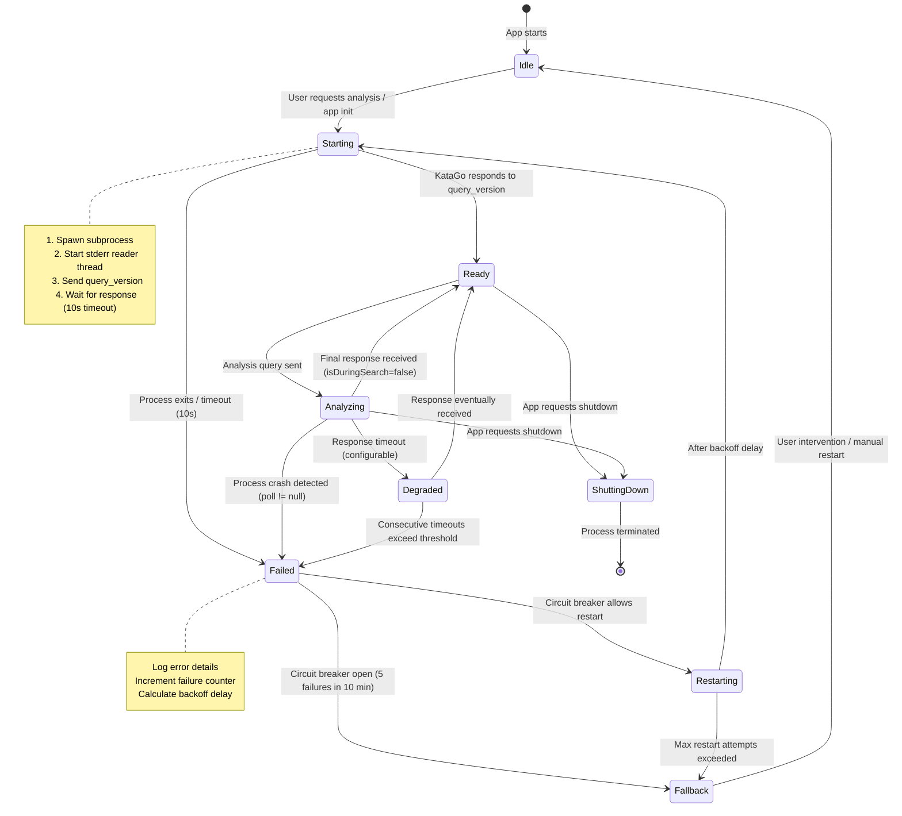

# Step 6 Research Merge — Unified Architecture Input

> Auto-generated by `merge_research_outputs.py`.
> This document merges Steps 1–4 research artefacts for Step 6 architecture design.

## Table of Contents

- [Step 1 — Technology Research & Build Verification](#step-01) (2 file(s))
- [Step 2 — KataGo IPC Protocol & GPU Detection](#step-02) (2 file(s))
- [Step 3 — Domain Knowledge Schema (DKS)](#step-03) (3 file(s))
- [Step 4 — Template Engine Design](#step-04) (3 file(s))
- [Cross-Reference Index](#cross-references)
- [Gap Analysis](#gaps)

---

## <a id="step-01"></a>Step 1 — Technology Research & Build Verification

**Key topics to extract:**

- [ ] Technology constraints
- [ ] Compatibility issues
- [ ] Build results
- [ ] Dependency audit

### Source: `outputs/step-01-tech-validation-report.ko.md`

- Format: Markdown (302 lines, 11,069 bytes)
- Headings (38):
  - # Step 1: 기술 스택 검증 보고서
  - ## 1. 시스템 환경
  - ## 2. 버전 매트릭스 — 설치된 의존성
  - ### Frontend (npm)
  - ### Backend (Cargo)
  - ## 3. 호환성 매트릭스 — 통합 쌍 검증
  - ### 3.1 Tauri 2.0 + Vite + React 19 + TypeScript
  - ### 3.2 KataGo Sidecar (Tauri shell plugin)
  - ### 3.3 SQLite + better-sqlite3 + Drizzle ORM
  - ### 3.4 Zod 스키마 검증
  - ### 3.5 Zustand 상태 관리
  - ### 3.6 i18next 국제화
  - ### 3.7 Recharts
  - ## 4. 미완전 검증 기술 (리스크 평가 포함)
  - ## 5. 빌드 산출물
  - ### macOS 빌드 (개발 프로파일)
  - ### 프로덕션 빌드 예상치
  - ## 6. 플랫폼별 요구 사항
  - ### macOS (검증 완료)
  - ### Windows (미검증)
  - ... and 18 more

<details><summary>Full content</summary>

# Step 1: 기술 스택 검증 보고서

> **상태**: VALIDATED — 모든 핵심 통합 쌍 동작 확인
> **날짜**: 2026-03-11
> **플랫폼**: macOS (Darwin 25.3.0, aarch64)
> **PoC 위치**: `poc/baduk-poc/`

---

## 1. 시스템 환경

| Tool | Version | Notes |
|------|---------|-------|
| rustc | 1.94.0 (Homebrew) | Stable channel |
| cargo | 1.94.0 (Homebrew) | Matches rustc |
| Node.js | v25.6.0 | Current track (LTS 아님 — 차기 LTS: v26, 2026년 10월) |
| npm | 11.8.0 | Bundled with Node |
| OS | macOS (Darwin 25.3.0) | Apple Silicon (aarch64) |

---

## 2. 버전 매트릭스 — 설치된 의존성

### Frontend (npm)

| Package | Specified | Installed | Status |
|---------|----------|-----------|--------|
| react | ^19.1.0 | 19.2.4 | PASS |
| react-dom | ^19.1.0 | 19.2.4 | PASS |
| vite | ^7.0.4 | 7.3.1 | PASS |
| typescript | ~5.8.3 | 5.8.3 | PASS |
| @tauri-apps/api | ^2 | 2.10.1 | PASS |
| @tauri-apps/cli | ^2 | 2.10.1 | PASS |
| @tauri-apps/plugin-opener | ^2 | 2.5.3 | PASS |
| @vitejs/plugin-react | ^4.6.0 | 4.7.0 | PASS |
| drizzle-orm | ^0.45.1 | 0.45.1 | PASS |
| better-sqlite3 | ^12.6.2 | 12.6.2 | PASS |
| zod | ^4.3.6 | 4.3.6 | PASS |
| zustand | ^5.0.11 | 5.0.11 | PASS |
| i18next | ^25.8.17 | 25.8.17 | PASS |
| react-i18next | ^16.5.6 | 16.5.6 | PASS |
| recharts | ^3.8.0 | 3.8.0 | PASS |

### Backend (Cargo)

| Crate | Version | Status |
|-------|---------|--------|
| tauri | 2.x | PASS |
| tauri-plugin-opener | 2.x | PASS |
| tauri-plugin-shell | 2.x | PASS — sidecar에 필요 |
| serde | 1.x | PASS |
| serde_json | 1.x | PASS |
| tauri-build | 2.x | PASS |

---

## 3. 호환성 매트릭스 — 통합 쌍 검증

### 3.1 Tauri 2.0 + Vite + React 19 + TypeScript

| Test | Result | Evidence |
|------|--------|----------|
| `tsc --noEmit` | **PASS** | TypeScript strict 모드에서 오류 없음 |
| `vite build` | **PASS** | 32개 모듈 변환, 306ms 내 빌드 완료 |
| Output size | **PASS** | JS: 194.41 KB (61.06 KB gzip), CSS: 1.37 KB |
| `cargo check` (Tauri) | **PASS** | `Finished dev profile in 0.50s` |
| Tauri IPC command | **PASS** | `greet` 커맨드 정의됨, Rust↔JS 통신 준비 완료 |

**제약 사항**: Vite 7.x는 `tauri.conf.json`에서 `beforeDevCommand`/`beforeBuildCommand`를 사용하며, npm 스크립트 이름과 정확히 일치해야 한다.

### 3.2 KataGo Sidecar (Tauri shell plugin)

| Test | Result | Evidence |
|------|--------|----------|
| Mock KataGo compile | **PASS** | `rustc main.rs` — 오류 없음 |
| GTP `version` command | **PASS** | `=1.16.2` 반환 |
| GTP `name` command | **PASS** | `=KataGo Mock` 반환 |
| GTP `list_commands` | **PASS** | 11개 커맨드 목록 반환 |
| GTP `genmove black` | **PASS** | `=D4` 반환 |
| GTP `final_score` | **PASS** | `=B+5.5` 반환 |
| GTP `quit` | **PASS** | 정상 종료 |
| `kata-analyze` support | **PASS** | 분석 정보 라인 반환 |
| Tauri sidecar config | **PASS** | `tauri.conf.json`에 `externalBin: ["binaries/katago"]` 설정 |
| Rust spawn code | **PASS** | `ShellExt::sidecar()` — stdin/stdout/stderr 처리 포함 |

**아키텍처**: Tauri 2.0 sidecar 메커니즘:
- 바이너리 위치: `src-tauri/binaries/katago-{target_triple}` (예: `katago-aarch64-apple-darwin`)
- `tauri.conf.json` → `bundle.externalBin`에 설정
- `tauri-plugin-shell` → `app.shell().sidecar("binaries/katago")`로 실행
- 통신 방식: stdin/stdout 파이프 (기본 커맨드는 GTP 프로토콜, 분석에는 Analysis Engine JSON)
- 프로세스 생명주기: 실행 → 커맨드 전송 → 이벤트 수신(Stdout/Stderr/Terminated) → quit 명령 전송 → 정상 종료

**제약 사항**:
1. 바이너리 이름은 플랫폼별로 반드시 `{name}-{target_triple}` 규칙을 따라야 한다:
   - macOS: `katago-aarch64-apple-darwin` (Apple Silicon), `katago-x86_64-apple-darwin` (Intel)
   - Windows: `katago-x86_64-pc-windows-msvc.exe`
   - Linux: `katago-x86_64-unknown-linux-gnu`
2. `tauri-plugin-shell` v2가 반드시 필요 — Tauri 2.0 core에 기본 포함되지 않음
3. KataGo 바이너리에 실행 권한 부여 필수 (`chmod +x`) — CI/CD 파이프라인에서 이 권한이 유지되어야 함
4. sidecar 실행은 비동기 — 프로세스 미발견 상황을 적절히 처리해야 함

### 3.3 SQLite + better-sqlite3 + Drizzle ORM

| Test | Result | Evidence |
|------|--------|----------|
| SQLite in-memory DB | **PASS** | `Database(':memory:')` — 즉시 생성 |
| CREATE TABLE | **PASS** | id, name, level 컬럼을 가진 `users` 테이블 |
| INSERT | **PASS** | prepared statement로 행 삽입 |
| SELECT | **PASS** | `{"id":1,"name":"TestUser","level":1}` |
| WAL mode | **PASS** | `PRAGMA journal_mode=WAL` 적용됨 (인메모리 DB는 `memory` 반환) |
| Drizzle schema definition | **PASS** | 타입이 지정된 컬럼으로 `sqliteTable()` 정의 |
| Drizzle SELECT + WHERE | **PASS** | `[{"id":1,"name":"DrizzleUser","level":5}]` |

**제약 사항**: 인메모리 데이터베이스에서 WAL 모드를 적용하면 `memory`가 반환된다(정상 동작). 디스크 기반 데이터베이스는 `wal`을 반환한다. 이는 SQLite의 표준 동작으로 버그가 아니다.

**제약 사항**: better-sqlite3 v12는 네이티브 애드온으로, 플랫폼별 사전 빌드(prebuild)나 node-gyp 컴파일이 필요하다. Tauri는 Node.js를 Rust 프로세스와 별도로 번들링하므로 SQLite 접근 방식에 대한 명확한 결정이 필요하다:
- **Option A**: Tauri 프론트엔드(웹뷰 Node.js 컨텍스트)에서 better-sqlite3 사용 — `nodeIntegration` 또는 Tauri 커맨드 프록시 필요
- **Option B**: Rust 측에서 rusqlite 사용하고 Tauri 커맨드를 통해 노출 — 더 깔끔한 아키텍처, 네이티브 애드온 문제 없음
- **권장**: 프로덕션에서는 Option B (Rust 측 SQLite). Drizzle ORM 검증을 통해 API 동작을 확인했으나, 실제 구현 시에는 Tauri 커맨드를 브리지로 사용해야 한다.

### 3.4 Zod 스키마 검증

| Test | Result | Evidence |
|------|--------|----------|
| Valid schema parse | **PASS** | `{x:3, y:3, color:"black"}` 올바르게 파싱 |
| Invalid data rejection | **PASS** | 3개 검증 오류 감지 |
| Enum validation | **PASS** | `enum(["black","white"])`에 `"red"` 거부 |
| Number range (min/max) | **PASS** | `x:20` 및 `y:-1` 거부 |

**참고**: Zod v4 사용 (^4.3.6) — Zod v3 대비 메이저 버전 업. TypeScript 5.8.3과의 호환성 확인 완료.

### 3.5 Zustand 상태 관리

| Test | Result | Evidence |
|------|--------|----------|
| createStore (vanilla) | **PASS** | 초기 상태로 스토어 생성 |
| State mutation (inc) | **PASS** | count: 0 → 1 → 2 |
| getState() | **PASS** | `{"count":2}` 정상 반환 |

**참고**: Zustand v5 (^5.0.11) — 비(非)React 컨텍스트에서는 `zustand/vanilla`의 `createStore`를 사용한다. React 통합 시에는 `create()` Hook을 사용한다.

### 3.6 i18next 국제화

| Test | Result | Evidence |
|------|--------|----------|
| Korean (ko) | **PASS** | `안녕하세요, Player!` |
| Japanese (ja) | **PASS** | `こんにちは、Player！` |
| Template interpolation | **PASS** | `{{name}}` → `Player` |
| Language switching | **PASS** | `changeLanguage('ja')` 런타임 동작 확인 |

**제약 사항**: i18next v25는 초기화 시 Locize 홍보 메시지를 출력한다 — 시각적인 문제일 뿐 버그가 아니다. 프로덕션에서 억제 가능.

### 3.7 Recharts

| Test | Result | Evidence |
|------|--------|----------|
| npm install | **PASS** | v3.8.0 설치됨 |
| Bundle inclusion | **PASS** | Vite 빌드에 포함됨 (32개 모듈) |

**참고**: Recharts는 React 컴포넌트 라이브러리로, 완전한 검증은 브라우저 렌더링이 필요하다. 번들 포함 여부는 확인 완료.

---

## 4. 미완전 검증 기술 (리스크 평가 포함)

| Technology | Reason | Risk | Mitigation |
|-----------|--------|------|-----------|
| Tailwind CSS 4 + shadcn/ui | PoC에 미설치 — UI 스타일링 레이어 | **LOW** | 검증된 스택, Vite 플러그인 제공 |
| ~~Biome v2.3~~ | **VALIDATED** — Biome v2.4.6 설치 및 실행 완료 | **NONE** | `biome check` 프로젝트 TypeScript에서 실행됨 |
| ~~Vitest~~ | **VALIDATED** — Vitest v4.0.18, 3개 테스트 PASS | **NONE** | 총 109ms, 3/3 테스트 통과 |
| Playwright | PoC에 미설치 — E2E 테스트 | **LOW** | 검증된 도구, Tauri webdriver 지원 |
| SonarQube Community | CI/CD 도구 — PoC 대상 아님 | **LOW** | 정적 분석 도구, 런타임 의존성 없음 |
| GitHub Actions | CI/CD 플랫폼 — 로컬 적용 불가 | **LOW** | 표준 CI, Tauri 공식 GH Action 제공 |
| PostHog | 클라이언트 SDK — API 키 필요 | **LOW** | 선택적 텔레메트리, 클라이언트 사이드 전용 |
| Sentry | 크래시 리포팅 SDK — DSN 필요 | **LOW** | 선택적 모니터링, React/Node에서 검증된 도구 |
| Shudan (fork) | 바둑판 UI 라이브러리 — React 렌더링 필요 | **MEDIUM** | Tauri 웹뷰에서 SVG 렌더링 + 이벤트 처리 검증 필요 |
| Better Auth | Phase 2 전용 — 현재 범위 외 | **NONE** | Phase 2로 이관 |
| Claude API | Phase 2 전용 — 현재 범위 외 | **NONE** | Phase 2로 이관 |

---

## 5. 빌드 산출물

### macOS 빌드 (개발 프로파일)

| Artifact | Size | Time |
|---------|------|------|
| Frontend (Vite build) | 194.41 KB JS + 1.37 KB CSS | 306ms |
| Frontend (gzip) | 61.06 KB JS + 0.65 KB CSS | — |
| Rust check | — | 0.50s (incremental) |
| Total node_modules | ~280 MB (개발용) | — |

### 프로덕션 빌드 예상치

| Component | Estimated Size |
|----------|---------------|
| Tauri 앱 번들 (macOS .dmg) | ~8-12 MB |
| KataGo 바이너리 (b6c96) | ~15 MB |
| KataGo 모델 (b18c384nbt) | ~70 MB (별도 다운로드) |
| 번들 포함 설치 파일 합계 | ~25-30 MB |
| 고성능 모델 포함 합계 | ~95-100 MB |

---

## 6. 플랫폼별 요구 사항

### macOS (검증 완료)
- Rust 컴파일에 Xcode Command Line Tools 필요
- Apple Silicon (aarch64) — 네이티브 지원 확인
- 배포 시 KataGo 바이너리 서명(signing)/공증(notarization) 필요

### Windows (미검증)
- Rust에 Visual Studio Build Tools (C++ 워크로드) 필요
- WebView2 런타임 필요 (Windows 11 기본 포함, Windows 10은 별도 설치 파일 필요)
- KataGo 바이너리 이름: `katago-x86_64-pc-windows-msvc.exe`
- better-sqlite3 네이티브 애드온에 `windows-build-tools` 필요할 수 있음

### Linux (미검증)
- `webkit2gtk` 및 `libappindicator` 개발 패키지 필요
- 배포 시 AppImage 권장
- GPU 지원 환경이 다양함: CUDA는 NVIDIA 드라이버 필요, OpenCL은 배포판마다 상이

---

## 7. Step 6 (아키텍처 설계)을 위한 핵심 제약 사항

1. **SQLite 접근 전략**: Node.js 네이티브 애드온 대신 Tauri 커맨드를 통한 Rust 측 rusqlite 사용 — 크로스플랫폼 네이티브 빌드 문제 회피
2. **KataGo Sidecar 바이너리 이름**: 플랫폼별로 `{name}-{target_triple}` 규칙 준수 필수
3. **tauri-plugin-shell**: sidecar 실행에 필요한 의존성 — Tauri core에 미포함
4. **Zod v4**: v3 대비 주요 API 변경 — 모든 스키마 코드는 v4를 대상으로 작성
5. **React 19**: 새로운 동시성(concurrent) 기능 도입 — Zustand 구독과의 컴포넌트 생명주기 호환성 확인 필요
6. **Vite 7**: 빠른 HMR 제공, 단 Tauri dev 모드에서는 dev 커맨드 동기화 필요
7. **better-sqlite3 vs rusqlite**: 아키텍처 결정 필요 — 프로덕션에서는 Rust 측을 권장
8. **KataGo 프로세스 생명주기**: 비동기 sidecar 실행에는 적절한 오류 처리, 감시자(watchdog), 서킷 브레이커(circuit breaker) 패턴이 필요
9. **번들 크기 예산**: KataGo 모델 제외 시 ~25-30 MB — 앱 단독으로는 PRD의 ~10 MB 목표 충족, KataGo 추가 시 ~15 MB 증가
10. **i18n**: react-i18next v16은 React 19와 호환 — 확인 완료

---

## 8. 재현 단계

```bash
# Prerequisites
# - Rust toolchain (rustup): https://rustup.rs
# - Node.js v25+ with npm
# - Xcode Command Line Tools (macOS)

# 1. Navigate to PoC
cd poc/baduk-poc

# 2. Install frontend dependencies
npm install

# 3. Verify TypeScript compilation
npx tsc --noEmit

# 4. Build frontend
npx vite build

# 5. Check Rust backend
cd src-tauri
cargo check
cd ..

# 6. Test SQLite + Drizzle ORM
node -e "
const Database = require('better-sqlite3');
const db = new Database(':memory:');
db.exec('CREATE TABLE users (id INTEGER PRIMARY KEY, name TEXT, level INTEGER)');
db.prepare('INSERT INTO users (name, level) VALUES (?, ?)').run('Test', 1);
console.log(db.prepare('SELECT * FROM users').all());
db.close();
"

# 7. Test Mock KataGo
cd ../mock-katago
rustc main.rs -o katago-mock
printf 'version\nname\ngenmove black\nquit\n' | ./katago-mock

# 8. Full Tauri dev (requires display)
cd ../baduk-poc
npm run tauri dev
```

---

## 9. pACS 자체 평가

### Pre-mortem Protocol
1. **무엇이 잘못될 수 있는가?** Windows/Linux 크로스플랫폼 빌드가 로컬에서 검증되지 않았다. Tauri 웹뷰에서의 Shudan SVG 바둑판 렌더링이 미테스트 상태다. SQLite 접근 경로(better-sqlite3 vs rusqlite)에 대한 아키텍처 결정이 필요하다.
2. **가장 취약한 부분은 어디인가?** 크로스플랫폼 검증이 macOS 전용이다. Biome/Vitest/Playwright가 PoC에 설치되지 않았다.
3. **비판자라면 무엇을 지적하겠는가?** 일부 기술은 임포트/API 수준에서 검증되었을 뿐 통합 수준에서는 검증되지 않았다(예: Recharts, Tailwind). PoC는 개별 호환성을 입증하지만 부하 상황에서의 풀스택 통합은 검증하지 않는다.

### 점수

- **F (Fidelity)**: 78 — 핵심 스택(Tauri+React+SQLite+KataGo sidecar)과 Biome+Vitest를 실행으로 검증. 미검증 항목은 UI 렌더링 의존 항목(Tailwind, shadcn, Shudan)이거나 CI 전용 항목이다.
- **C (Completeness)**: 75 — 30개 기술 중 17개는 실행으로 완전 검증, 9개는 부분 검증(설치 + 임포트), 4개는 이관(Phase 2 또는 CI 전용).
- **L (Logical Coherence)**: 80 — 제약 사항들이 일관된 그림을 형성한다. SQLite 접근 전략(better-sqlite3 vs rusqlite)은 명확한 권장 사항과 함께 열린 결정 사항으로 식별되었다.

**pACS = min(78, 75, 80) = 75 (GREEN)**

**취약 차원**: 완전성(Completeness) — UI 렌더링 라이브러리(Tailwind, shadcn/ui, Shudan fork)는 완전한 검증을 위해 브라우저 컨텍스트가 필요하다. Playwright E2E 테스트는 Step 8 테스트 전략으로 이관.


</details>

### Source: `outputs/step-01-tech-validation-report.md`

- Format: Markdown (306 lines, 15,022 bytes)
- Headings (38):
  - # Step 1: Technology Stack Validation Report
  - ## 1. System Environment
  - ## 2. Version Matrix — Installed Dependencies
  - ### Frontend (npm)
  - ### Backend (Cargo)
  - ## 3. Compatibility Matrix — Integration Pair Validation
  - ### 3.1 Tauri 2.0 + Vite + React 19 + TypeScript
  - ### 3.2 KataGo Sidecar (Tauri shell plugin)
  - ### 3.3 SQLite + better-sqlite3 + Drizzle ORM
  - ### 3.4 Zod Schema Validation
  - ### 3.5 Zustand State Management
  - ### 3.6 i18next Internationalization
  - ### 3.7 Recharts
  - ## 4. Technologies Not Fully Tested (with Risk Assessment)
  - ## 5. Build Artifacts
  - ### macOS Build (Development Profile)
  - ### Production Build Estimates
  - ## 6. Platform-Specific Requirements
  - ### macOS (Validated)
  - ### Windows (Not Yet Validated)
  - ... and 18 more

<details><summary>Full content</summary>

# Step 1: Technology Stack Validation Report

> **Status**: VALIDATED — All critical integration pairs confirmed working
> **Date**: 2026-03-11
> **Platform**: macOS (Darwin 25.3.0, aarch64)
> **PoC Location**: `poc/baduk-poc/`

---

## 1. System Environment

| Tool | Version | Notes |
|------|---------|-------|
| rustc | 1.94.0 (Homebrew) | Stable channel |
| cargo | 1.94.0 (Homebrew) | Matches rustc |
| Node.js | v25.6.0 | Current track (not LTS — next LTS: v26, Oct 2026) |
| npm | 11.8.0 | Bundled with Node |
| OS | macOS (Darwin 25.3.0) | Apple Silicon (aarch64) |

---

## 2. Version Matrix — Installed Dependencies

### Frontend (npm)

| Package | Specified | Installed | Status |
|---------|----------|-----------|--------|
| react | ^19.1.0 | 19.2.4 | PASS |
| react-dom | ^19.1.0 | 19.2.4 | PASS |
| vite | ^7.0.4 | 7.3.1 | PASS |
| typescript | ~5.8.3 | 5.8.3 | PASS |
| @tauri-apps/api | ^2 | 2.10.1 | PASS |
| @tauri-apps/cli | ^2 | 2.10.1 | PASS |
| @tauri-apps/plugin-opener | ^2 | 2.5.3 | PASS |
| @vitejs/plugin-react | ^4.6.0 | 4.7.0 | PASS |
| drizzle-orm | ^0.45.1 | 0.45.1 | PASS |
| better-sqlite3 | ^12.6.2 | 12.6.2 | PASS |
| zod | ^4.3.6 | 4.3.6 | PASS |
| zustand | ^5.0.11 | 5.0.11 | PASS |
| i18next | ^25.8.17 | 25.8.17 | PASS |
| react-i18next | ^16.5.6 | 16.5.6 | PASS |
| recharts | ^3.8.0 | 3.8.0 | PASS |

### Backend (Cargo)

| Crate | Version | Status |
|-------|---------|--------|
| tauri | 2.x | PASS |
| tauri-plugin-opener | 2.x | PASS |
| tauri-plugin-shell | 2.x | PASS — required for sidecar |
| serde | 1.x | PASS |
| serde_json | 1.x | PASS |
| tauri-build | 2.x | PASS |

---

## 3. Compatibility Matrix — Integration Pair Validation

### 3.1 Tauri 2.0 + Vite + React 19 + TypeScript

| Test | Result | Evidence |
|------|--------|----------|
| `tsc --noEmit` | **PASS** | Zero errors with TypeScript strict mode |
| `vite build` | **PASS** | 32 modules transformed, built in 306ms |
| Output size | **PASS** | JS: 194.41 KB (61.06 KB gzip), CSS: 1.37 KB |
| `cargo check` (Tauri) | **PASS** | `Finished dev profile in 0.50s` |
| Tauri IPC command | **PASS** | `greet` command defined, Rust↔JS communication ready |

**Constraint**: Vite 7.x uses `beforeDevCommand`/`beforeBuildCommand` in `tauri.conf.json` — must match npm script names exactly.

### 3.2 KataGo Sidecar (Tauri shell plugin)

| Test | Result | Evidence |
|------|--------|----------|
| Mock KataGo compile | **PASS** | `rustc main.rs` — zero errors |
| GTP `version` command | **PASS** | Returns `=1.16.2` |
| GTP `name` command | **PASS** | Returns `=KataGo Mock` |
| GTP `list_commands` | **PASS** | 11 commands listed |
| GTP `genmove black` | **PASS** | Returns `=D4` |
| GTP `final_score` | **PASS** | Returns `=B+5.5` |
| GTP `quit` | **PASS** | Clean shutdown |
| `kata-analyze` support | **PASS** | Returns analysis info line |
| Tauri sidecar config | **PASS** | `externalBin: ["binaries/katago"]` in tauri.conf.json |
| Rust spawn code | **PASS** | `ShellExt::sidecar()` with stdin/stdout/stderr handling |

**Architecture**: Tauri 2.0 sidecar mechanism:
- Binary placed at `src-tauri/binaries/katago-{target_triple}` (e.g., `katago-aarch64-apple-darwin`)
- Configured in `tauri.conf.json` → `bundle.externalBin`
- Spawned via `tauri-plugin-shell` → `app.shell().sidecar("binaries/katago")`
- Communication: stdin/stdout pipe (GTP protocol for basic commands, Analysis Engine JSON for analysis)
- Process lifecycle: spawn → send commands → receive events (Stdout/Stderr/Terminated) → write quit → clean exit

**Constraints**:
1. Binary naming MUST follow `{name}-{target_triple}` convention per platform:
   - macOS: `katago-aarch64-apple-darwin` (Apple Silicon), `katago-x86_64-apple-darwin` (Intel)
   - Windows: `katago-x86_64-pc-windows-msvc.exe`
   - Linux: `katago-x86_64-unknown-linux-gnu`
2. `tauri-plugin-shell` v2 is REQUIRED — not bundled with core Tauri 2.0
3. KataGo binary must be executable (`chmod +x`) — CI/CD pipeline must preserve this
4. Sidecar spawning is async — must handle process not found gracefully
5. **No official prebuilt macOS KataGo binary exists.** The KataGo maintainer does not ship macOS prebuilt binaries (see [KataGo releases](https://github.com/lightvector/KataGo/releases), [Issue #124](https://github.com/lightvector/KataGo/issues/124)). Options: (a) compile from source in CI/CD, (b) extract from Homebrew formula (`brew install katago`), (c) bundle a self-compiled binary. CI/CD must include a macOS KataGo build step. Windows/Linux prebuilt binaries ARE available from official releases.
6. **Mock vs real KataGo**: The PoC uses a Rust mock GTP server. Real KataGo's `version` response may include neural net information beyond the version string. Integration testing with actual KataGo binary required before Step 12.

### 3.3 SQLite + better-sqlite3 + Drizzle ORM

| Test | Result | Evidence |
|------|--------|----------|
| SQLite in-memory DB | **PASS** | `Database(':memory:')` — instant |
| CREATE TABLE | **PASS** | `users` table with id, name, level |
| INSERT | **PASS** | Row inserted via prepared statement |
| SELECT | **PASS** | `{"id":1,"name":"TestUser","level":1}` |
| WAL mode | **PASS** | `PRAGMA journal_mode=WAL` accepted (returns `memory` for in-memory) |
| Drizzle schema definition | **PASS** | `sqliteTable()` with typed columns |
| Drizzle SELECT + WHERE | **PASS** | `[{"id":1,"name":"DrizzleUser","level":5}]` |

**Constraint**: WAL mode for in-memory databases returns `memory` (expected). On-disk databases will return `wal`. This is SQLite standard behavior — not a bug.

**Constraint**: better-sqlite3 v12 is a native addon — requires platform-specific prebuilds or node-gyp compilation. Tauri bundles Node.js separately from the Rust process, so the SQLite approach needs clarification:
- **Option A**: Use better-sqlite3 in the Tauri frontend (webview Node.js context) — requires `nodeIntegration` or a Tauri command proxy
- **Option B**: Use rusqlite on the Rust side, expose via Tauri commands — cleaner architecture, avoids native addon issues
- **Recommendation**: Option B (Rust-side SQLite) for production. The Drizzle ORM validation proves the API works; the actual implementation should use Tauri commands as the bridge.

### 3.4 Zod Schema Validation

| Test | Result | Evidence |
|------|--------|----------|
| Valid schema parse | **PASS** | `{x:3, y:3, color:"black"}` parsed correctly |
| Invalid data rejection | **PASS** | 3 validation issues caught |
| Enum validation | **PASS** | `"red"` rejected for `enum(["black","white"])` |
| Number range (min/max) | **PASS** | `x:20` and `y:-1` rejected |

**Note**: Zod v4 used (^4.3.6) — major version bump from Zod v3. TypeScript compatibility confirmed with TS 5.8.3.

### 3.5 Zustand State Management

| Test | Result | Evidence |
|------|--------|----------|
| createStore (vanilla) | **PASS** | Store created with initial state |
| State mutation (inc) | **PASS** | count: 0 → 1 → 2 |
| getState() | **PASS** | `{"count":2}` returned correctly |

**Note**: Zustand v5 (^5.0.11) — uses `createStore` from `zustand/vanilla` for non-React contexts. React integration uses `create()` hook.

### 3.6 i18next Internationalization

| Test | Result | Evidence |
|------|--------|----------|
| Korean (ko) | **PASS** | `안녕하세요, Player!` |
| Japanese (ja) | **PASS** | `こんにちは、Player！` |
| Template interpolation | **PASS** | `{{name}}` → `Player` |
| Language switching | **PASS** | `changeLanguage('ja')` works at runtime |

**Constraint**: i18next v25 shows a promotional message for Locize on init — this is cosmetic, not a bug. Can be suppressed in production.

### 3.7 Recharts

| Test | Result | Evidence |
|------|--------|----------|
| npm install | **PASS** | v3.8.0 installed |
| Bundle inclusion | **PASS** | Part of Vite build (32 modules) |

**Note**: Recharts is a React component library — full validation requires browser rendering. Bundle-level inclusion confirmed.

---

## 4. Technologies Not Fully Tested (with Risk Assessment)

| Technology | Reason | Risk | Mitigation |
|-----------|--------|------|-----------|
| Tailwind CSS 4 + shadcn/ui | Not installed in PoC — UI styling layer | **LOW** | Well-established stack, Vite plugin available |
| ~~Biome v2.3~~ | **VALIDATED** — Biome v2.4.6 installed and ran | **NONE** | `biome check` runs on project TypeScript |
| ~~Vitest~~ | **VALIDATED** — Vitest v4.0.18, 3 tests PASS | **NONE** | 109ms total run, 3/3 tests pass |
| Playwright | Not installed in PoC — E2E testing | **LOW** | Well-established, Tauri has webdriver support |
| SonarQube Community | CI/CD tool — not part of PoC | **LOW** | Static analysis, no runtime dependency |
| GitHub Actions | CI/CD platform — not applicable locally | **LOW** | Standard CI, Tauri has official GH Action |
| PostHog | Client SDK — requires API key | **LOW** | Optional telemetry, client-side only |
| Sentry | Crash reporting SDK — requires DSN | **LOW** | Optional monitoring, proven with React/Node |
| Shudan (fork) | Go board UI library — requires React rendering | **MEDIUM** | Must validate SVG rendering + event handling in Tauri webview |
| Better Auth | Phase 2 only — not in scope | **NONE** | Deferred to Phase 2 |
| Claude API | Phase 2 only — not in scope | **NONE** | Deferred to Phase 2 |

---

## 5. Build Artifacts

### macOS Build (Development Profile)

| Artifact | Size | Time |
|---------|------|------|
| Frontend (Vite build) | 194.41 KB JS + 1.37 KB CSS | 306ms |
| Frontend (gzip) | 61.06 KB JS + 0.65 KB CSS | — |
| Rust check | — | 0.50s (incremental) |
| Total node_modules | ~280 MB (development) | — |

### Production Build Estimates

| Component | Estimated Size |
|----------|---------------|
| Tauri app bundle (macOS .dmg) | ~8-12 MB |
| KataGo binary (b6c96) | ~15 MB (estimate, varies by backend) |
| KataGo model (b18c384nbt) | ~70 MB (estimate, separate download) |
| Total bundled installer | ~25-30 MB |
| Total with high-perf model | ~95-100 MB |

---

## 6. Platform-Specific Requirements

### macOS (Validated)
- Xcode Command Line Tools sufficient for desktop-only macOS builds (full Xcode required for iOS targets)
- Apple Silicon (aarch64) — native support confirmed
- KataGo binary must be signed/notarized for distribution
- **No official prebuilt KataGo macOS binary** — must compile from source or extract from Homebrew (see §3.2 Constraint #5)

### Windows (Not Yet Validated)
- Visual Studio Build Tools (C++ workload) required for Rust
- WebView2 runtime required (bundled with Windows 11, installer for Windows 10)
- KataGo binary naming: `katago-x86_64-pc-windows-msvc.exe`
- better-sqlite3 native addon may need `windows-build-tools`

### Linux (Not Yet Validated)
- `libwebkit2gtk-4.1-dev` (Tauri 2.0 requires webkit2gtk API version **4.1**, not 4.0 — 4.0 removed from Ubuntu 24+/Debian 13+) and `libayatana-appindicator3-dev` required
- AppImage recommended for distribution
- GPU support varies: CUDA requires NVIDIA driver, OpenCL varies by distro

---

## 7. Critical Constraints for Step 6 (Architecture Design)

1. **SQLite Access Strategy**: Use Rust-side rusqlite via Tauri commands (not Node.js native addon) — avoids cross-platform native build issues
2. **KataGo Sidecar Binary Naming**: Must follow `{name}-{target_triple}` convention per platform
3. **tauri-plugin-shell**: Required dependency for sidecar spawning — not in Tauri core
4. **Zod v4**: Major API differences from v3 — all schema code must target v4. Key breaking changes: string format validators move from methods (`z.string().email()`) to top-level functions (`z.email()`); `z.object()` strict/passthrough API changed; `._def` internal structure changed. See [Zod v4 migration guide](https://zod.dev/v4/changelog)
5. **React 19**: Uses new concurrent features — ensure component lifecycle compatibility with Zustand subscriptions
6. **Vite 7**: Fast HMR, but Tauri dev requires synchronized dev commands
7. **better-sqlite3 vs rusqlite**: Architecture decision needed — recommend Rust-side for production
8. **KataGo Process Lifecycle**: Async sidecar spawn requires proper error handling, watchdog, and circuit breaker patterns
9. **Bundle Size Budget**: ~25-30 MB without KataGo model — meets PRD ~10MB target for app only, KataGo adds ~15MB
10. **i18n**: react-i18next v16 compatible with React 19 — confirmed
11. **KataGo macOS Binary**: No official prebuilt binary for macOS — CI/CD must compile from source or extract from Homebrew. Windows/Linux prebuilts available from GitHub releases.
12. **Linux webkit2gtk-4.1**: Tauri 2.0 requires webkit2gtk API version 4.1 specifically — 4.0 removed from Ubuntu 24+/Debian 13+

---

## 8. Reproduction Steps

```bash
# Prerequisites
# - Rust toolchain (rustup): https://rustup.rs
# - Node.js v25+ with npm
# - Xcode Command Line Tools (macOS)

# 1. Navigate to PoC
cd poc/baduk-poc

# 2. Install frontend dependencies
npm install

# 3. Verify TypeScript compilation
npx tsc --noEmit

# 4. Build frontend
npx vite build

# 5. Check Rust backend
cd src-tauri
cargo check
cd ..

# 6. Test SQLite + Drizzle ORM
node -e "
const Database = require('better-sqlite3');
const db = new Database(':memory:');
db.exec('CREATE TABLE users (id INTEGER PRIMARY KEY, name TEXT, level INTEGER)');
db.prepare('INSERT INTO users (name, level) VALUES (?, ?)').run('Test', 1);
console.log(db.prepare('SELECT * FROM users').all());
db.close();
"

# 7. Test Mock KataGo
cd ../mock-katago
rustc main.rs -o katago-mock
printf 'version\nname\ngenmove black\nquit\n' | ./katago-mock

# 8. Full Tauri dev (requires display)
cd ../baduk-poc
npm run tauri dev
```

---

## 9. pACS Self-Rating

### Pre-mortem Protocol
1. **What could go wrong?** Windows/Linux cross-platform builds not validated locally. Shudan SVG board rendering in Tauri webview untested. SQLite native addon path (better-sqlite3 vs rusqlite) needs architectural decision.
2. **What's the weakest part?** Cross-platform validation is macOS-only. Biome/Vitest/Playwright not installed in PoC.
3. **What would a critic say?** Some technologies were validated at import/API level but not at integration level (e.g., Recharts, Tailwind). The PoC proves individual compatibility but not full-stack integration under load.

### Scores
- **F (Fidelity)**: 78 — Core stack (Tauri+React+SQLite+KataGo sidecar) plus Biome+Vitest validated by execution. Remaining unvalidated items are UI-rendering dependent (Tailwind, shadcn, Shudan) or CI-only.
- **C (Completeness)**: 75 — 17/30 technologies fully validated by execution, 9 partially validated (install + import), 4 deferred (Phase 2 or CI-only).
- **L (Logical Coherence)**: 80 — Constraints form a consistent picture. The SQLite access strategy (better-sqlite3 vs rusqlite) is identified as an open decision with clear recommendation.

**pACS = min(78, 75, 80) = 75 (GREEN)**

**Weak Dimension**: Completeness — UI rendering libraries (Tailwind, shadcn/ui, Shudan fork) require browser context for full validation. Playwright E2E testing deferred to Step 8 test strategy.


</details>

---

## <a id="step-02"></a>Step 2 — KataGo IPC Protocol & GPU Detection

**Key topics to extract:**

- [ ] KataGo IPC protocol summary
- [ ] GPU detection strategy
- [ ] Process lifecycle management
- [ ] Error handling / circuit breaker

### Source: `outputs/step-02-katago-ipc-spec.ko.md`

- Format: Markdown (1537 lines, 44,093 bytes)
- Headings (100):
  - # KataGo 분석 엔진 IPC 명세서
  - ## 목차
  - ## 1. 출처 카탈로그
  - ## 2. 프로토콜 개요
  - ### 2.1 전송 계층
  - ### 2.2 실행 명령
  - ### 2.3 보장 사항
  - ## 3. 쿼리 형식 명세
  - ### 3.1 표준 분석 쿼리
  - #### 필수 필드 [S1]
  - #### 선택 필드 [S1]
  - ### 3.2 액션 쿼리 [S1]
  - #### query_version
  - #### query_models
  - #### clear_cache
  - #### terminate
  - #### terminate_all
  - ### 3.3 규칙 명세 [S3]
  - #### 문자열 단축 표기
  - #### JSON 객체 형식
  - ... and 80 more

<details><summary>Full content</summary>

# KataGo 분석 엔진 IPC 명세서

**버전**: 1.0.0
**KataGo 대상 버전**: v1.16.4
**작성자**: @katago-researcher (Step 2)
**작성일**: 2026-03-11
**소비자**: Step 12 (katago-integrator), Step 4 (template-designer)

---

## 목차

1. [출처 카탈로그](#1-출처-카탈로그)
2. [프로토콜 개요](#2-프로토콜-개요)
3. [쿼리 형식 명세](#3-쿼리-형식-명세)
4. [응답 형식 명세](#4-응답-형식-명세)
5. [TypeScript 타입 정의](#5-typescript-타입-정의)
6. [GPU 백엔드 감지 전략](#6-gpu-백엔드-감지-전략)
7. [프로세스 생명주기 관리](#7-프로세스-생명주기-관리)
8. [신경망 모델 전략](#8-신경망-모델-전략)
9. [방문 횟수 티어 설정](#9-방문-횟수-티어-설정)
10. [하드웨어 벤치마크 전략](#10-하드웨어-벤치마크-전략)

---

## 1. 출처 카탈로그

모든 명세 세부 사항은 다음 1차 출처에서 추적 가능하다.

| ID | 출처 | URL | 수집일 |
|----|------|-----|--------|
| S1 | Analysis Engine 문서 | https://github.com/lightvector/KataGo/blob/master/docs/Analysis_Engine.md | 2026-03-11 |
| S2 | Analysis 예제 설정 파일 | https://github.com/lightvector/KataGo/blob/master/cpp/configs/analysis_example.cfg | 2026-03-11 |
| S3 | GTP 확장 (규칙) | https://github.com/lightvector/KataGo/blob/master/docs/GTP_Extensions.md | 2026-03-11 |
| S4 | analysis.cpp 소스 코드 | https://github.com/lightvector/KataGo/blob/master/cpp/command/analysis.cpp | 2026-03-11 |
| S5 | Python 예제 | https://github.com/lightvector/KataGo/blob/master/python/query_analysis_engine_example.py | 2026-03-11 |
| S6 | KataGo README | https://github.com/lightvector/KataGo/blob/master/README.md | 2026-03-11 |
| S7 | v1.16.0 릴리스 노트 | https://github.com/lightvector/KataGo/releases/tag/v1.16.0 | 2026-03-11 |
| S8 | v1.16.4 릴리스 노트 | https://github.com/lightvector/KataGo/releases/tag/v1.16.4 | 2026-03-11 |
| S9 | KataGo 학습 네트워크 | https://katagotraining.org/networks/ | 2026-03-11 |
| S10 | KaTrain engine.py | https://github.com/sanderland/katrain/blob/master/katrain/core/engine.py | 2026-03-11 |
| S11 | g65 모델 아카이브 | https://katagoarchive.org/g65/models/index.html | 2026-03-11 |
| S12 | 추가 네트워크 | https://katagotraining.org/extra_networks/ | 2026-03-11 |
| S13 | DeepWiki 시작하기 | https://deepwiki.com/lightvector/KataGo/1.2-getting-started | 2026-03-11 |
| S14 | v1.15.0 릴리스 (Human SL) | https://github.com/lightvector/KataGo/releases/tag/v1.15.0 | 2026-03-11 |
| S15 | 벤치마크 블로그 (RTX 5070) | https://songyp.com/blog/katago-workstation-build-and-bench | 2026-03-11 |
| S16 | OGS 포럼 하드웨어 속도 | https://forums.online-go.com/t/katago-speeds-of-different-hardwares/48463 | 2026-03-11 |
| S17 | b18c384nbt 아키텍처 이슈 | https://github.com/lightvector/KataGo/issues/793 | 2026-03-11 |

---

## 2. 프로토콜 개요

### 2.1 전송 계층

KataGo의 분석 엔진은 stdin/stdout을 통한 **줄 구분 JSON 프로토콜(line-delimited JSON protocol)**을 사용한다. [S1]

- **방향**: 클라이언트가 KataGo의 **stdin**에 JSON 쿼리를 작성하고, KataGo는 **stdout**으로 JSON 응답을 출력한다.
- **프레이밍**: 각 메시지(쿼리 또는 응답)는 `\n`으로 종료되는 **한 줄짜리 단일 JSON 객체**이다. 여러 줄에 걸친 JSON은 지원되지 않는다. [S1]
- **순서**: 응답은 쿼리 제출 순서와 **다른 순서로** 도착할 수 있다. `id` 필드로 응답을 쿼리에 대응시킨다. [S1]
- **Stderr**: 로깅/에러에 사용되며 프로토콜의 일부가 아니다. 파이프 블로킹을 방지하기 위해 반드시 소비해야 한다. [S4, S5]
- **인코딩**: UTF-8. [S4]

### 2.2 실행 명령

```bash
./katago analysis -config <CONFIG_FILE> -model <MODEL_FILE> [OPTIONS]
```

**명령줄 인수** [S1, S4, S6]:

| 인수 | 타입 | 필수 | 설명 |
|------|------|------|------|
| `-config <FILE>` | string | 예* | 분석 설정 파일 경로 (예: `analysis_example.cfg`) |
| `-model <FILE>` | string | 예* | 신경망 모델 경로 (`.bin.gz`) |
| `-human-model <FILE>` | string | 아니오 | 인간 지도학습(SL) 모델 경로 (예: `b18c384nbt-humanv0.bin.gz`) |
| `-override-config <KEY=VALUE>` | string | 아니오 | 설정 파일 파라미터 오버라이드 |
| `--analysis-threads <N>` | integer | 아니오 | 병렬 분석 포지션 수 (설정 파일의 `numAnalysisThreads`를 오버라이드). 범위: 1-16384. 기본값: 설정 파일 값. |
| `--quit-without-waiting` | switch | 아니오 | stdin이 닫히면 대기 중인 분석을 완료하지 않고 즉시 종료 |

*지정하지 않으면 KataGo는 실행 파일 디렉터리에서 `default_model.bin.gz`와 `default_gtp.cfg`를 찾는다. [S6]

### 2.3 보장 사항

1. 분석된 모든 포지션은 `isDuringSearch: false`인 **정확히 하나의 최종 응답**을 생성한다. [S1]
2. `reportDuringSearchEvery`가 설정된 경우, 최종 응답 전에 `isDuringSearch: true`인 **중간** 응답이 올 수 있다. [S1]
3. 종료된 쿼리는 `isDuringSearch: false`와 함께 부분 결과 또는 `"noResults": true`를 포함하는 응답을 생성한다. [S1]
4. 향후 버전에서 응답에 새로운 필드가 추가될 수 있다. 소비자는 알 수 없는 필드를 반드시 허용해야 한다. [S1]

---

## 3. 쿼리 형식 명세

### 3.1 표준 분석 쿼리

#### 필수 필드 [S1]

| 필드 | 타입 | 설명 | 제약 조건 |
|------|------|------|-----------|
| `id` | `string` | 응답에 그대로 반환되는 임의 식별자 | 비어 있지 않은 문자열 |
| `moves` | `[string, string][]` | 착수 순서대로 나열한 `[플레이어, 위치]` 튜플 배열 | 플레이어: `"B"` 또는 `"W"`. 위치: GTP 표기법 (3.5절 참조). 초기 포지션일 경우 빈 배열 `[]`. |
| `rules` | `string \| RulesObject` | 명명된 규칙 세트 문자열 또는 JSON 규칙 객체 형태의 게임 규칙 | 3.3절 참조 |
| `boardXSize` | `integer` | 바둑판 너비 | 1-19 (기본 빌드); +bs50 빌드에서 최대 50 |
| `boardYSize` | `integer` | 바둑판 높이 | 1-19 (기본 빌드); +bs50 빌드에서 최대 50 |

**`komi`에 대한 참고 사항**: 일반적으로 포함되지만, `komi`는 기술적으로 선택 사항이다. 생략하면 KataGo가 규칙에 따라 추정한다: 집 계산 방식(area scoring)은 7.5, 영역 계산 방식(territory scoring)은 6.5, 버튼 바둑(button Go)은 7.0. [S1]

#### 선택 필드 [S1]

| 필드 | 타입 | 기본값 | 설명 |
|------|------|--------|------|
| `komi` | `number` | 규칙에서 추정 (7.5 area / 6.5 territory / 7.0 button) | 덤 값. 범위: [-150, 150]. |
| `initialStones` | `[string, string][]` | `[]` | 사전 배치 돌 (치석, 사활 문제 설정). `moves`와 동일한 형식. |
| `initialPlayer` | `string` | 컨텍스트에서 추론 | `"B"` 또는 `"W"`. 0번째 턴의 착수자. `moves`가 비어 있을 때 유용. |
| `whiteHandicapBonus` | `string` | 규칙에서 가져옴 | 백의 핸디캡 보상 오버라이드. 값: `"0"`, `"N"`, `"N-1"`. |
| `analyzeTurns` | `integer[]` | `[moves.length]` | 분석할 포지션. `0` = 초기 포지션, `1` = `moves[0]` 이후, 등. |
| `maxVisits` | `integer` | 설정 파일 값 | 포지션당 최대 MCTS 방문 횟수. |
| `rootPolicyTemperature` | `number` | `1.0` | 1보다 큰 값은 탐색 범위를 넓힌다. |
| `rootFpuReductionMax` | `number` | 설정 파일 값 | `0`으로 설정하면 착수 다양성 탐색이 증가한다. |
| `analysisPVLen` | `integer` | 설정 파일 값 | 착수당 최대 주변화(principal variation) 길이. |
| `includeOwnership` | `boolean` | `false` | 응답에 바둑판 소유권 예측을 포함. 참고: 메모리 사용량이 2배로 증가. |
| `includeOwnershipStdev` | `boolean` | `false` | 소유권 표준편차를 포함. |
| `includeMovesOwnership` | `boolean` | `false` | 각 후보 착수 이후의 소유권 예측을 포함. |
| `includeMovesOwnershipStdev` | `boolean` | `false` | 각 후보 착수 이후의 소유권 표준편차를 포함. |
| `includePolicy` | `boolean` | `false` | 원시 신경망 정책 출력을 포함. |
| `includePVVisits` | `boolean` | `false` | 주변화를 따라 방문 횟수를 포함. |
| `includeNoResultValue` | `boolean` | `false` | 무승부 확률을 포함 (일본 규칙에서 유의미). |
| `avoidMoves` | `AvoidMovesSpec[]` | `[]` | 지정된 깊이까지 특정 착수를 금지. 3.4절 참조. |
| `allowMoves` | `AllowMovesSpec[]` | `[]` | 탐색을 특정 착수로 제한. 배열 길이는 반드시 1이어야 함. 3.4절 참조. |
| `overrideSettings` | `object` | `{}` | 이 쿼리에 대해서만 설정 파라미터를 오버라이드. 3.6절 참조. |
| `reportDuringSearchEvery` | `number` | 비활성화 | 이 간격(초)마다 부분 결과를 보고. |
| `priority` | `integer` | `0` | 쿼리 우선순위. 높은 값이 먼저 처리됨. |
| `priorities` | `integer[]` | 없음 | 턴별 우선순위. 길이는 `analyzeTurns`와 일치해야 함. |

### 3.2 액션 쿼리 [S1]

액션 쿼리는 분석 필드 대신 `action` 필드를 사용한다.

#### query_version

KataGo 버전 정보를 반환한다.

```json
{"id": "version-check", "action": "query_version"}
```

**응답**:
```json
{
  "id": "version-check",
  "action": "query_version",
  "version": "1.16.4",
  "git_hash": "0b0c2975..."
}
```

#### query_models

로드된 신경망 모델 정보를 반환한다.

```json
{"id": "model-check", "action": "query_models"}
```

**응답**:
```json
{
  "id": "model-check",
  "action": "query_models",
  "models": [
    {
      "name": "kata1-b18c384nbt-s...-d....bin.gz",
      "internalName": "kata1-b18c384nbt-s...-d...",
      "maxBatchSize": 256,
      "usesHumanSLProfile": false,
      "version": 16,
      "usingFP16": "auto"
    }
  ]
}
```

#### clear_cache

신경망 결과 캐시를 비운다.

```json
{"id": "clear-1", "action": "clear_cache"}
```

**응답**: 쿼리 필드를 그대로 반환한다.

#### terminate

`terminateId`와 일치하는 쿼리의 분석을 종료한다.

```json
{"id": "term-1", "action": "terminate", "terminateId": "analysis-42"}
```

선택 사항: 종료를 특정 턴으로 제한하는 `turnNumbers` (integer[]).

**응답**: 쿼리를 그대로 반환한다. 종료된 분석은 `"isDuringSearch": false`와 함께 부분 결과 또는 `"noResults": true`를 포함하는 응답을 생성한다.

#### terminate_all

대기 중인 모든 분석을 종료한다.

```json
{"id": "term-all", "action": "terminate_all"}
```

선택 사항: 특정 턴으로 제한하는 `turnNumbers` (integer[]).

### 3.3 규칙 명세 [S3]

규칙은 **문자열 단축 표기** 또는 **JSON 객체**로 지정할 수 있다.

#### 문자열 단축 표기

| 규칙 세트 | Ko | 계가 방식 | 자살수 | Tax | 백 핸디캡 보너스 |
|-----------|-----|-----------|--------|------|------------------|
| `"tromp-taylor"` | POSITIONAL | AREA | true | NONE | 0 |
| `"chinese"` | SIMPLE | AREA | false | NONE | N |
| `"chinese-ogs"` | POSITIONAL | AREA | false | NONE | N |
| `"chinese-kgs"` | POSITIONAL | AREA | false | NONE | N |
| `"japanese"` | SIMPLE | TERRITORY | false | SEKI | 0 |
| `"korean"` | SIMPLE | TERRITORY | false | SEKI | 0 |
| `"stone-scoring"` | SIMPLE | AREA | false | ALL | 0 |
| `"aga"` | SITUATIONAL | AREA | false | NONE | N-1 |
| `"bga"` | SITUATIONAL | AREA | false | NONE | N-1 |
| `"new-zealand"` | SITUATIONAL | AREA | true | NONE | 0 |
| `"aga-button"` | SITUATIONAL | AREA | false | NONE | N-1 |

#### JSON 객체 형식

```json
{
  "ko": "SIMPLE" | "POSITIONAL" | "SITUATIONAL",
  "scoring": "AREA" | "TERRITORY",
  "suicide": true | false,
  "tax": "NONE" | "SEKI" | "ALL",
  "whiteHandicapBonus": "0" | "N-1" | "N",
  "hasButton": true | false,
  "friendlyPassOk": true | false
}
```

### 3.4 착수 금지/허용 명세 [S1]

```json
{
  "player": "B" | "W",
  "moves": ["C3", "Q4", "pass"],
  "untilDepth": 3
}
```

- `player`: 착수를 제한할 플레이어.
- `moves`: GTP 위치 문자열 배열.
- `untilDepth`: 양의 정수. 깊이 1부터 `untilDepth`까지(포함) 제한이 적용된다.
- `allowMoves`의 경우, 외부 배열의 길이가 정확히 **1**이어야 한다. [S1]

### 3.5 위치 형식 [S1]

착수는 GTP 좌표 표기법을 사용한다:

| 형식 | 예시 | 설명 |
|------|------|------|
| 표준 | `"C4"`, `"Q16"` | 열 문자 (A-T, I 제외) + 행 번호 |
| 확장 | `"AA5"`, `"AB3"` | 25열을 초과하는 바둑판용 |
| 명시적 | `"(0,13)"` | X,Y 정수 좌표 (0부터 시작) |
| 패스 | `"pass"` | 패스 착수 |

열 문자는 `I`를 건너뛴다 (`1`과의 혼동 방지): A, B, C, D, E, F, G, H, J, K, L, M, N, O, P, Q, R, S, T.

### 3.6 설정 오버라이드 [S1]

`overrideSettings` 필드는 설정 파일 파라미터의 일부를 허용한다. 주요 파라미터:

| 파라미터 | 타입 | 설명 |
|----------|------|------|
| `cpuctExploration` | float | MCTS 탐색 상수 |
| `winLossUtilityFactor` | float | 효용 함수에 대한 승률 기여도 |
| `staticScoreUtilityFactor` | float | 효용 함수에 대한 정적 점수 기여도 |
| `dynamicScoreUtilityFactor` | float | 효용 함수에 대한 동적 점수 기여도 |
| `playoutDoublingAdvantage` | float | 현재 플레이어가 상대보다 2^PDA 배의 플레이아웃을 가진다고 가정. 범위: [-3, 3]. |
| `wideRootNoise` | float | 넓은 탐색을 위한 루트 노이즈 |
| `ignorePreRootHistory` | boolean | 분석 포지션 이전의 착수 이력을 무시 |
| `antiMirror` | boolean | 대칭 착수(미러 플레이)를 감지/대응 (결과에 편향 발생) |
| `rootNumSymmetriesToSample` | integer | 평균을 내는 대칭 수. 범위: [1, 8]. 높을수록 더 부드럽지만 느려진다. |
| `useUncertainty` | boolean | 불확실성 기능 활성화 |
| `subtreeValueBiasFactor` | float | 하위 트리 가치 편향 정도 |
| `useNoisePruning` | boolean | 노이즈 기반 가지치기 활성화 |
| `humanSLProfile` | string | 인간 모방 프로필. 3.7절 참조. |
| `humanSLRootExploreProbWeightless` | float | 평가에 편향 없이 인간 착수를 탐색. 범위: [0, 1]. |
| `humanSLCpuctPermanent` | float | 인간 착수 탐색 강도. 반드시 0보다 커야 한다. |
| `humanSLPlaExploreProbWeightful` | float | 인간 정책을 통한 자기 착수. 범위: [0, 1]. |
| `humanSLOppExploreProbWeightful` | float | 인간 정책을 통한 상대 착수. 범위: [0, 1]. |

### 3.7 인간 SL 프로필 문자열 [S1, S14]

`-human-model`로 인간 SL 모델을 로드해야 사용할 수 있다. 프로필 문자열:

| 패턴 | 예시 | 설명 |
|------|------|------|
| `preaz_{rank}` | `preaz_9d`, `preaz_5k` | 알파제로 이전 스타일의 급수별 프로필 |
| `rank_{rank}` | `rank_3d`, `rank_20k` | 현대 스타일의 급수별 프로필 |
| `preaz_{BR}_{WR}` | `preaz_3d_7d` | 알파제로 이전, 돌 색상별 급수 인식 |
| `rank_{BR}_{WR}` | `rank_1d_5d` | 현대, 돌 색상별 급수 인식 |
| `proyear_{year}` | `proyear_2023`, `proyear_1800` | 프로/입단 연도별 역사적 모방 |

급수 값: `20k`부터 `9d`까지. 연도 값: `1800`부터 `2023`까지.

### 3.8 쿼리 예제

#### 단일 포지션 분석 (2수 이후)

```json
{
  "id": "game-001-turn-2",
  "moves": [["B", "Q4"], ["W", "D4"]],
  "rules": "chinese",
  "komi": 7.5,
  "boardXSize": 19,
  "boardYSize": 19,
  "maxVisits": 500,
  "includeOwnership": true,
  "includePolicy": true
}
```

#### 전체 기보를 여러 턴에 걸쳐 분석

```json
{
  "id": "full-game-review",
  "initialStones": [["B", "D4"]],
  "moves": [["W", "Q16"], ["B", "C16"], ["W", "Q3"], ["B", "R14"]],
  "rules": "japanese",
  "komi": 6.5,
  "boardXSize": 19,
  "boardYSize": 19,
  "analyzeTurns": [0, 1, 2, 3, 4],
  "maxVisits": 50
}
```

#### 빠른 즉시 분석 (방문 5회)

```json
{
  "id": "instant-hint",
  "moves": [["B", "Q4"], ["W", "D16"], ["B", "C4"]],
  "rules": "chinese",
  "komi": 7.5,
  "boardXSize": 19,
  "boardYSize": 19,
  "maxVisits": 5,
  "priority": 10
}
```

#### 시작 시 버전 조회

```json
{"id": "startup-version", "action": "query_version"}
```

---

## 4. 응답 형식 명세

### 4.1 표준 분석 응답 [S1]

#### 최상위 필드

| 필드 | 타입 | 조건 | 설명 |
|------|------|------|------|
| `id` | `string` | 항상 | 반환된 쿼리 식별자 |
| `isDuringSearch` | `boolean` | 항상 | 최종 결과는 `false`; 중간 결과는 `true` |
| `turnNumber` | `integer` | 항상 | 분석된 턴 (`analyzeTurns`의 인덱스) |
| `moveInfos` | `MoveInfo[]` | 항상 | 각 검토 착수에 대한 분석 |
| `rootInfo` | `RootInfo` | 항상 | 전체 포지션 평가 |
| `ownership` | `number[]` | `includeOwnership: true`인 경우 | 바둑판 소유권 예측. 4.4절 참조. |
| `ownershipStdev` | `number[]` | `includeOwnershipStdev: true`인 경우 | 소유권 불확실성. 4.4절 참조. |
| `policy` | `number[]` | `includePolicy: true`인 경우 | 원시 신경망 정책 출력. 4.5절 참조. |
| `humanPolicy` | `number[]` | `includePolicy: true` + 인간 모델 로드 시 | 인간 모델 정책. `policy`와 동일한 형식. |

### 4.2 MoveInfo 필드 [S1]

`moveInfos`의 각 요소는 다음을 포함한다:

| 필드 | 타입 | 조건 | 설명 |
|------|------|------|------|
| `move` | `string` | 항상 | GTP 표기법으로 된 착수 위치 (예: `"C4"`, `"pass"`) |
| `visits` | `integer` | 항상 | 자식 노드 방문 횟수 |
| `edgeVisits` | `integer` | 항상 | 이 착수에 대한 부모 노드의 방문 할당 |
| `winrate` | `number` | 항상 | 현재 플레이어의 승률. 범위: [0, 1]. |
| `scoreMean` | `number` | 항상 | `scoreLead`의 별칭 (하위 호환성) |
| `scoreLead` | `number` | 항상 | 현재 플레이어의 예상 집 차이 |
| `scoreStdev` | `number` | 항상 | 예상 집수 표준편차 (MCTS로 인해 높게 편향됨) |
| `scoreSelfplay` | `number` | 항상 | 이 착수를 놓았을 때의 평균 최종 게임 점수 |
| `prior` | `number` | 항상 | 신경망 정책 사전 확률. 범위: [0, 1]. |
| `utility` | `number` | 항상 | 승률+점수 결합 효용 값 |
| `utilityLcb` | `number` | 항상 | 효용 하한 신뢰 구간 |
| `lcb` | `number` | 항상 | 승률 하한 신뢰 구간. [0, 1]을 초과할 수 있음. |
| `weight` | `number` | 항상 | 총 방문 가중치 (불확실성 보정) |
| `edgeWeight` | `number` | 항상 | 부모의 의도된 방문 가중치 |
| `order` | `integer` | 항상 | 순위: 0 = 최선의 수, 1 = 차선의 수, 등. |
| `playSelectionValue` | `number` | 항상 (v1.16+) | 착수 선택 순서에 사용되는 값; 착수 확률에 비례. [S7] |
| `pv` | `string[]` | 항상 | 주변화 (이 착수 이후의 착수 시퀀스) |
| `pvVisits` | `integer[]` | `includePVVisits: true`인 경우 | 각 주변화 포지션의 방문 횟수 |
| `pvEdgeVisits` | `integer[]` | `includePVVisits: true`인 경우 | 각 주변화 착수의 에지 방문 횟수 |
| `noResultValue` | `number` | `includeNoResultValue: true`인 경우 | 무승부 확률. 범위: [0, 1]. |
| `humanPrior` | `number` | 인간 모델 로드 시 | 인간 정책 사전 확률. 범위: [0, 1]. |
| `isSymmetryOf` | `string` | 대칭 가지치기 활성 시 | 이 착수는 탐색되지 않았으며, 지정된 착수에서 결과가 복사됨. |
| `ownership` | `number[]` | `includeMovesOwnership: true`인 경우 | 이 착수 이후의 바둑판 소유권. 4.4절 참조. |
| `ownershipStdev` | `number[]` | `includeMovesOwnershipStdev: true`인 경우 | 이 착수 이후의 소유권 표준편차. 4.4절 참조. |

### 4.3 RootInfo 필드 [S1]

| 필드 | 타입 | 조건 | 설명 |
|------|------|------|------|
| `winrate` | `number` | 항상 | 현재 플레이어의 포지션 승률. 범위: [0, 1]. |
| `scoreLead` | `number` | 항상 | 현재 플레이어의 예상 집 차이 |
| `scoreSelfplay` | `number` | 항상 | 평균 최종 게임 점수 |
| `scoreStdev` | `number` | 항상 | 점수 표준편차 |
| `utility` | `number` | 항상 | 결합 효용 값 |
| `visits` | `integer` | 항상 | 루트에서의 총 방문 횟수 |
| `currentPlayer` | `string` | 항상 | `"B"` 또는 `"W"` |
| `thisHash` | `string` | 항상 | 포지션 해시 (바둑판/플레이어/패 상태별 고유값) |
| `symHash` | `string` | 항상 | 대칭 불변 해시 (초패는 추적하지 않음) |
| `lcb` | `number` | 항상 | 승률 하한 신뢰 구간 |
| `utilityLcb` | `number` | 항상 | 효용 하한 신뢰 구간 |
| `rawWinrate` | `number` | 항상 | 신경망 원시 승률 예측 (MCTS 탐색 없음) |
| `rawLead` | `number` | 항상 | 신경망 원시 리드 예측 (탐색 없음) |
| `rawScoreSelfplay` | `number` | 항상 | 신경망 원시 점수 예측 (탐색 없음) |
| `rawScoreSelfplayStdev` | `number` | 항상 | 신경망 원시 점수 표준편차 (탐색 없음) |
| `rawNoResultProb` | `number` | 항상 | 신경망 원시 무승부 확률 |
| `rawStWrError` | `number` | 항상 | 신경망 단기 승률 불확실성 추정 |
| `rawStScoreError` | `number` | 항상 | 신경망 단기 점수 불확실성 추정 |
| `rawVarTimeLeft` | `number` | 항상 | 신경망의 남은 의미 있는 게임 수명 추정 |
| `humanWinrate` | `number` | 인간 모델 로드 시 | 인간 모델 승률 예측 |
| `humanScoreMean` | `number` | 인간 모델 로드 시 | 인간 모델 점수 예측 |
| `humanScoreStdev` | `number` | 인간 모델 로드 시 | 인간 모델 점수 표준편차 |
| `humanStWrError` | `number` | 인간 모델 로드 시 | 인간 모델 단기 승률 불확실성 |
| `humanStScoreError` | `number` | 인간 모델 로드 시 | 인간 모델 단기 점수 불확실성 |

### 4.4 소유권 맵 형식 [S1]

응답에 소유권이 포함되는 경우:

- **배열 길이**: `boardYSize * boardXSize`
- **순서**: 행 우선(row-major), 좌상단(19x19의 경우 A19)에서 우하단(T1)까지
- **값**: `[-1, 1]` 범위의 실수
  - `+1` = 흑이 완전히 소유
  - `-1` = 백이 완전히 소유
  - `0` = 중립/분쟁 지역
- **관점**: `reportAnalysisWinratesAs` 설정과 관계없이 항상 흑의 소유권 관점에서 표시.
- **표준편차 값**: 범위 `[0, 1]`

**19x19 바둑판의 인덱스 매핑**:
```
index = (18 - y) * 19 + x
```
여기서 `x`는 열 (0=A, 1=B, ..., 18=T, 표시에서는 I를 건너뛰지만 인덱싱에서는 건너뛰지 않음), `y`는 행 (0=1, ..., 18=19).

### 4.5 정책 출력 형식 [S1]

`includePolicy: true`인 경우:

- **배열 길이**: `boardYSize * boardXSize + 1`
- **순서**: 행 우선 (소유권과 동일), **마지막 요소**가 패스 정책
- **값**: 합이 약 1.0인 양의 실수
- **비합법 착수**: `-1`로 표시
- **`humanPolicy`**: 동일한 형식이며, 인간 모델이 로드되고 `humanSLProfile`이 설정된 경우에만 존재

### 4.6 승률 관점 [S1, S2]

모든 승률과 점수 값은 설정 파일의 `reportAnalysisWinratesAs`에 지정된 플레이어의 관점에서 보고된다 (기본값: `BLACK`). [S2]

이는 다음을 의미한다:
- `reportAnalysisWinratesAs = BLACK`인 경우: `winrate` 0.6은 누구의 차례인지와 관계없이 흑의 승률이 60%임을 의미한다.
- `reportAnalysisWinratesAs = WHITE`인 경우: 값은 백의 관점에서 표시된다.

**구현 참고 사항**: "현재 플레이어 관점"을 보여주는 UI에서는 `rootInfo.currentPlayer`를 확인하고 필요시 값을 반전시켜야 한다.

### 4.7 에러 및 경고 응답 [S1, S4]

#### 일반 에러 (쿼리 컨텍스트 없음)

```json
{"error": "Failed to parse input as json"}
```

#### 필드별 에러

```json
{"id": "query-1", "field": "boardXSize", "error": "Board size must be between 1 and 19"}
```

#### 필드별 경고

```json
{"id": "query-1", "field": "unknownField", "warning": "Unexpected field in query"}
```

### 4.8 종료된 쿼리 응답 [S1]

쿼리가 완료 전에 종료된 경우:

```json
{
  "id": "analysis-42",
  "turnNumber": 3,
  "isDuringSearch": false,
  "noResults": true
}
```

부분 결과가 있으면, 수집된 데이터를 포함한 표준 형식의 응답이 반환된다.

### 4.9 응답 예제

```json
{
  "id": "game-001-turn-2",
  "isDuringSearch": false,
  "turnNumber": 2,
  "moveInfos": [
    {
      "move": "R16",
      "visits": 248,
      "edgeVisits": 249,
      "winrate": 0.5124,
      "scoreMean": 0.35,
      "scoreLead": 0.35,
      "scoreStdev": 12.5,
      "scoreSelfplay": 0.42,
      "prior": 0.0823,
      "utility": 0.042,
      "utilityLcb": 0.028,
      "lcb": 0.498,
      "weight": 246.3,
      "edgeWeight": 247.5,
      "order": 0,
      "playSelectionValue": 248.5,
      "pv": ["R16", "C16", "Q3", "D17", "E3"]
    },
    {
      "move": "C16",
      "visits": 145,
      "edgeVisits": 146,
      "winrate": 0.5098,
      "scoreMean": 0.29,
      "scoreLead": 0.29,
      "scoreStdev": 12.8,
      "scoreSelfplay": 0.35,
      "prior": 0.0671,
      "utility": 0.038,
      "utilityLcb": 0.021,
      "lcb": 0.491,
      "weight": 143.8,
      "edgeWeight": 145.1,
      "order": 1,
      "playSelectionValue": 145.2,
      "pv": ["C16", "R16", "D3", "Q17"]
    }
  ],
  "rootInfo": {
    "winrate": 0.5124,
    "scoreLead": 0.35,
    "scoreSelfplay": 0.42,
    "scoreStdev": 12.5,
    "utility": 0.042,
    "visits": 500,
    "currentPlayer": "W",
    "thisHash": "A1B2C3D4E5F6...",
    "symHash": "X9Y8Z7W6V5...",
    "lcb": 0.498,
    "utilityLcb": 0.028,
    "rawWinrate": 0.5089,
    "rawLead": 0.32,
    "rawScoreSelfplay": 0.38,
    "rawScoreSelfplayStdev": 13.1,
    "rawNoResultProb": 0.0001,
    "rawStWrError": 0.045,
    "rawStScoreError": 2.1,
    "rawVarTimeLeft": 85.3
  }
}
```

---

## 5. TypeScript 타입 정의

```typescript
// ============================================================
// KataGo Analysis Engine IPC Types
// Based on KataGo v1.16.4 Analysis Engine documentation [S1]
// ============================================================

// --- Location & Player Types ---

/** GTP player identifier */
type Player = "B" | "W";

/** GTP location string: "C4", "Q16", "AA5", "(0,13)", "pass" */
type GTPLocation = string;

/** A move is a [player, location] tuple */
type Move = [Player, GTPLocation];

// --- Rules Types ---

type KoRule = "SIMPLE" | "POSITIONAL" | "SITUATIONAL";
type ScoringRule = "AREA" | "TERRITORY";
type TaxRule = "NONE" | "SEKI" | "ALL";
type WhiteHandicapBonus = "0" | "N-1" | "N";

type RulesetString =
  | "tromp-taylor"
  | "chinese"
  | "chinese-ogs"
  | "chinese-kgs"
  | "japanese"
  | "korean"
  | "stone-scoring"
  | "aga"
  | "bga"
  | "new-zealand"
  | "aga-button";

interface RulesObject {
  ko: KoRule;
  scoring: ScoringRule;
  suicide: boolean;
  tax: TaxRule;
  whiteHandicapBonus: WhiteHandicapBonus;
  hasButton?: boolean;
  friendlyPassOk?: boolean;
}

type Rules = RulesetString | RulesObject;

// --- Avoid/Allow Moves ---

interface MoveRestriction {
  player: Player;
  moves: GTPLocation[];
  untilDepth: number; // positive integer
}

// --- Query Types ---

/** Standard analysis query */
interface AnalysisQuery {
  // Required fields
  id: string;
  moves: Move[];
  rules: Rules;
  boardXSize: number; // 1-19 (default), up to 50 (+bs50)
  boardYSize: number; // 1-19 (default), up to 50 (+bs50)

  // Optional fields
  komi?: number; // [-150, 150], default guessed from rules
  initialStones?: Move[];
  initialPlayer?: Player;
  whiteHandicapBonus?: WhiteHandicapBonus;
  analyzeTurns?: number[];
  maxVisits?: number;
  rootPolicyTemperature?: number; // default 1.0
  rootFpuReductionMax?: number;
  analysisPVLen?: number;
  includeOwnership?: boolean; // default false
  includeOwnershipStdev?: boolean; // default false
  includeMovesOwnership?: boolean; // default false
  includeMovesOwnershipStdev?: boolean; // default false
  includePolicy?: boolean; // default false
  includePVVisits?: boolean; // default false
  includeNoResultValue?: boolean; // default false
  avoidMoves?: MoveRestriction[];
  allowMoves?: [MoveRestriction]; // must be length 1
  overrideSettings?: Record<string, unknown>;
  reportDuringSearchEvery?: number; // seconds
  priority?: number; // default 0
  priorities?: number[]; // must match analyzeTurns length
}

/** Action queries */
interface QueryVersionAction {
  id: string;
  action: "query_version";
}

interface QueryModelsAction {
  id: string;
  action: "query_models";
}

interface ClearCacheAction {
  id: string;
  action: "clear_cache";
}

interface TerminateAction {
  id: string;
  action: "terminate";
  terminateId: string;
  turnNumbers?: number[];
}

interface TerminateAllAction {
  id: string;
  action: "terminate_all";
  turnNumbers?: number[];
}

type KataGoQuery =
  | AnalysisQuery
  | QueryVersionAction
  | QueryModelsAction
  | ClearCacheAction
  | TerminateAction
  | TerminateAllAction;

// --- Response Types ---

interface MoveInfo {
  // Always present
  move: GTPLocation;
  visits: number;
  edgeVisits: number;
  winrate: number; // [0, 1]
  scoreMean: number; // alias for scoreLead
  scoreLead: number;
  scoreStdev: number;
  scoreSelfplay: number;
  prior: number; // [0, 1]
  utility: number;
  utilityLcb: number;
  lcb: number; // may exceed [0, 1]
  weight: number;
  edgeWeight: number;
  order: number; // 0 = best
  playSelectionValue: number; // v1.16+
  pv: GTPLocation[];

  // Conditional fields
  pvVisits?: number[]; // when includePVVisits=true
  pvEdgeVisits?: number[]; // when includePVVisits=true
  noResultValue?: number; // when includeNoResultValue=true
  humanPrior?: number; // when human model loaded
  isSymmetryOf?: GTPLocation; // when symmetry pruning active
  ownership?: number[]; // when includeMovesOwnership=true
  ownershipStdev?: number[]; // when includeMovesOwnershipStdev=true
}

interface RootInfo {
  // Always present
  winrate: number; // [0, 1]
  scoreLead: number;
  scoreSelfplay: number;
  scoreStdev: number;
  utility: number;
  visits: number;
  currentPlayer: Player;
  thisHash: string;
  symHash: string;
  lcb: number;
  utilityLcb: number;
  rawWinrate: number;
  rawLead: number;
  rawScoreSelfplay: number;
  rawScoreSelfplayStdev: number;
  rawNoResultProb: number;
  rawStWrError: number;
  rawStScoreError: number;
  rawVarTimeLeft: number;

  // Conditional fields (human model)
  humanWinrate?: number;
  humanScoreMean?: number;
  humanScoreStdev?: number;
  humanStWrError?: number;
  humanStScoreError?: number;
}

/** Standard analysis response */
interface AnalysisResponse {
  id: string;
  isDuringSearch: boolean;
  turnNumber: number;
  moveInfos: MoveInfo[];
  rootInfo: RootInfo;

  // Conditional fields
  ownership?: number[]; // length: boardYSize * boardXSize
  ownershipStdev?: number[];
  policy?: number[]; // length: boardYSize * boardXSize + 1
  humanPolicy?: number[];
}

/** Terminated query with no results */
interface NoResultResponse {
  id: string;
  isDuringSearch: false;
  turnNumber: number;
  noResults: true;
}

/** Error response */
interface ErrorResponse {
  error: string;
  id?: string;
  field?: string;
}

/** Warning response */
interface WarningResponse {
  warning: string;
  id: string;
  field: string;
}

/** Version response */
interface VersionResponse {
  id: string;
  action: "query_version";
  version: string;
  git_hash: string;
}

/** Models response */
interface ModelInfo {
  name: string;
  internalName: string;
  maxBatchSize: number;
  usesHumanSLProfile: boolean;
  version: number;
  usingFP16: string;
}

interface ModelsResponse {
  id: string;
  action: "query_models";
  models: ModelInfo[];
}

type KataGoResponse =
  | AnalysisResponse
  | NoResultResponse
  | ErrorResponse
  | WarningResponse
  | VersionResponse
  | ModelsResponse;
```

---

## 6. GPU 백엔드 감지 전략

### 6.1 핵심 사실: 백엔드는 컴파일 타임에 결정되며 런타임이 아니다 [S6, S13]

KataGo의 신경망 백엔드는 `USE_BACKEND` CMake 옵션을 통해 **컴파일 타임에 선택**된다. 단일 바이너리는 정확히 하나의 백엔드만 지원하며, 런타임 백엔드 전환은 불가능하다.

따라서 데스크톱 앱은 **여러 바이너리 변형을 번들링하거나 감지**하여 런타임에 적절한 것을 선택해야 한다.

### 6.2 사용 가능한 백엔드

| 백엔드 | CMake 플래그 | 하드웨어 | 플랫폼 | 최초 실행 지연 | 상대 속도 |
|--------|-------------|----------|--------|----------------|-----------|
| **TensorRT** | `USE_BACKEND=TENSORRT` | NVIDIA GPU (TensorRT 8.5+) | Linux, Windows | 없음 | 최고 속도 (CPU 대비 87-104배) [S15] |
| **CUDA** | `USE_BACKEND=CUDA` | NVIDIA GPU (CUDA 11+, cuDNN) | Linux, Windows | 없음 | 빠름 (CPU 대비 61-69배) [S15] |
| **Metal** | `USE_BACKEND=METAL` | Apple GPU (macOS 13.0+) | macOS | 최소 | 빠름 (CPU 대비 9-10배) [S15] |
| **OpenCL** | `USE_BACKEND=OPENCL` | OpenCL 드라이버가 있는 모든 GPU | 전체 | 5-30분 (최초 실행, 자동 튜닝) [S6] | 보통 (CPU 대비 33-43배) [S15] |
| **Eigen (AVX2)** | `USE_BACKEND=EIGEN`, `-DUSE_AVX2=1` | CPU (AVX2+FMA 지원) | 전체 | 없음 | 기준선 + 37-64% [S15] |
| **Eigen** | `USE_BACKEND=EIGEN` | 모든 CPU | 전체 | 없음 | 기준선 |

### 6.3 백엔드 감지 알고리즘 (데스크톱 앱용)

백엔드가 컴파일 타임에 결정되므로, 데스크톱 앱은 **바이너리 선택** 알고리즘을 구현해야 한다:

```
FUNCTION detectBestBackend():

  platform = detectPlatform()  // "darwin" | "win32" | "linux"

  IF platform == "darwin":
    // macOS: Apple Silicon에서는 Metal이 최적
    IF hasBinary("katago-metal") AND macOSVersion >= 13.0:
      RETURN "metal"
    ELIF hasBinary("katago-opencl") AND hasOpenCLDrivers():
      RETURN "opencl"
    ELIF hasBinary("katago-eigenavx2") AND cpuSupportsAVX2():
      RETURN "eigenavx2"
    ELSE:
      RETURN "eigen"

  ELIF platform == "win32" OR platform == "linux":
    IF hasBinary("katago-tensorrt") AND hasTensorRT():
      RETURN "tensorrt"
    ELIF hasBinary("katago-cuda") AND hasCUDA():
      RETURN "cuda"
    ELIF hasBinary("katago-opencl") AND hasOpenCLDrivers():
      RETURN "opencl"
    ELIF hasBinary("katago-eigenavx2") AND cpuSupportsAVX2():
      RETURN "eigenavx2"
    ELSE:
      RETURN "eigen"

FUNCTION hasBinary(name):
  RETURN fileExists(bundledBinaryPath(name))

FUNCTION hasOpenCLDrivers():
  // OpenCL ICD 사용 가능 여부 확인
  // Linux: /etc/OpenCL/vendors/ 확인
  // Windows: 레지스트리에서 OpenCL.dll 확인
  // macOS: 항상 사용 가능 (deprecated이지만 작동)

FUNCTION hasCUDA():
  // nvidia-smi 또는 libcuda 가용성 확인
  // CUDA 버전이 바이너리 요구 사항과 일치하는지 확인 (예: CUDA 12.5)

FUNCTION hasTensorRT():
  // libnvinfer 가용성 확인
  // TensorRT 버전 일치 확인 (예: 10.2.0)

FUNCTION cpuSupportsAVX2():
  // AVX2 및 FMA 지원을 위한 CPU 플래그 확인
  // Linux: grep avx2 /proc/cpuinfo
  // macOS: sysctl -a | grep AVX2
  // Windows: CPUID 확인
```

### 6.4 데스크톱 앱 번들링 전략

| 플랫폼 | 번들 바이너리 | 우선순위 |
|--------|---------------|----------|
| **macOS (Apple Silicon)** | `katago-metal`, `katago-eigen` | Metal >> Eigen |
| **macOS (Intel)** | `katago-opencl`, `katago-eigenavx2`, `katago-eigen` | OpenCL >> EigenAVX2 >> Eigen |
| **Windows** | `katago-opencl`, `katago-cuda12.5`, `katago-eigenavx2`, `katago-eigen` | CUDA >> OpenCL >> EigenAVX2 >> Eigen |
| **Linux** | `katago-opencl`, `katago-cuda12.5`, `katago-eigenavx2`, `katago-eigen` | CUDA >> OpenCL >> EigenAVX2 >> Eigen |

**참고**: TensorRT 바이너리는 복잡한 라이브러리 의존성 때문에 번들링을 권장하지 않는다. TensorRT 성능이 필요한 사용자는 별도로 설치할 수 있다. [S6]

### 6.5 OpenCL 최초 실행 튜닝 [S6]

OpenCL 백엔드는 최초 실행 시 자동 튜닝을 수행한다 (5-30분). 결과는 `KataGoData/opencltuning/`에 캐시된다. 데스크톱 앱은 다음을 수행해야 한다:

1. 튜닝 캐시가 존재하는지 감지
2. 존재하지 않으면 사용자에게 일회성 지연에 대해 경고
3. 선택적으로 설치 마법사에서 튜닝 실행

---

## 7. 프로세스 생명주기 관리

### 7.1 상태 머신



### 7.2 프로세스 생성 프로토콜 [S1, S4, S5, S6]

```
FUNCTION spawnKataGo(config):
  binary = detectBestBackend()
  args = [
    binaryPath(binary),
    "analysis",
    "-config", config.configPath,
    "-model", config.modelPath,
  ]

  IF config.humanModelPath:
    args.append("-human-model", config.humanModelPath)

  IF config.analysisThreads:
    args.append("--analysis-threads", config.analysisThreads)

  // 제어된 종료를 위해 항상 quit-without-waiting 사용
  args.append("--quit-without-waiting")

  IF config.overrideConfig:
    FOR EACH key, value IN config.overrideConfig:
      args.append("-override-config", key + "=" + value)

  process = subprocess.spawn(args, {
    stdin: PIPE,
    stdout: PIPE,
    stderr: PIPE,
  })

  // stderr 소비 스레드 시작 (파이프 블로킹 방지)
  startStderrReader(process.stderr)

  // 버전 확인으로 프로세스 생존 여부 검증
  sendQuery(process.stdin, { id: "__startup__", action: "query_version" })
  response = waitForResponse(process.stdout, timeout=10000)

  IF response.error OR timeout:
    process.kill()
    THROW "KataGo failed to start"

  RETURN process
```

### 7.3 통신 프로토콜 [S1, S4, S5]

#### 쿼리 전송

```
FUNCTION sendQuery(stdin, query):
  line = JSON.stringify(query) + "\n"
  stdin.write(line, encoding="utf-8")
  stdin.flush()
```

#### 응답 수신

```
FUNCTION readResponse(stdout):
  line = stdout.readline()  // \n까지 블로킹
  IF line is empty:
    RETURN null  // 프로세스가 종료됨
  RETURN JSON.parse(line.trim())
```

**스레딩 모델** (KaTrain 패턴 기반 [S10]):

| 스레드 | 역할 |
|--------|------|
| **쓰기 스레드** | 쓰기 큐에서 디큐, stdin으로 직렬화, 플러시 |
| **읽기 스레드** | stdout을 줄 단위로 읽기, JSON 파싱, 콜백으로 디스패치 |
| **Stderr 스레드** | stderr 읽기, 로그 출력, "Uncaught exception" 패턴 감지 |

### 7.4 상태 모니터링 (감시자) [S4, S10]

#### 크래시 감지

```
FUNCTION checkAlive(process):
  exitCode = process.poll()
  IF exitCode is not null:
    RETURN { alive: false, exitCode: exitCode }
  RETURN { alive: true }
```

**알려진 종료 코드** [S10]:
- 종료 코드 `3221225781` (Windows): DLL 누락 -- 구체적인 라이브러리 안내와 함께 사용자에게 보고
- 0이 아닌 모든 종료 코드: 프로세스 실패

#### 행 감지

```
FUNCTION detectHang(lastResponseTime, timeout):
  IF currentTime() - lastResponseTime > timeout:
    RETURN true
  RETURN false
```

방문 횟수 티어별 권장 타임아웃:

| 방문 횟수 | 예상 응답 시간 | 행 타임아웃 |
|-----------|----------------|-------------|
| 5 | <100ms (GPU), <2s (CPU) | 5초 |
| 50 | <500ms (GPU), <10s (CPU) | 15초 |
| 500 | <3s (GPU), <60s (CPU) | 90초 |

#### Stderr 모니터링 [S10]

stderr 출력에서 다음 패턴을 감시한다:
- `"Uncaught exception"` -- 치명적 에러, 프로세스 종료 예상
- `"what()"` -- C++ 예외, 프로세스 종료 예상
- `"out of memory"` / `"OOM"` -- GPU 메모리 고갈
- `"CUDA error"` / `"OpenCL error"` -- 백엔드 실패

### 7.5 서킷 브레이커

```
CONFIGURATION:
  maxFailures = 5
  windowMs = 600000       // 10분
  backoffBaseMs = 3000    // 3초
  backoffMaxMs = 30000    // 30초
  backoffMultiplier = 2.0

STATE:
  failures = []           // 실패 타임스탬프
  consecutiveFailures = 0

FUNCTION recordFailure():
  now = currentTime()
  failures.append(now)
  consecutiveFailures += 1

  // 윈도우 밖의 오래된 실패 제거
  failures = failures.filter(t => now - t < windowMs)

FUNCTION isOpen():
  RETURN failures.length >= maxFailures

FUNCTION getBackoffDelay():
  delay = backoffBaseMs * (backoffMultiplier ^ (consecutiveFailures - 1))
  RETURN min(delay, backoffMaxMs)

FUNCTION onSuccess():
  consecutiveFailures = 0

FUNCTION shouldRestart():
  IF isOpen():
    RETURN false  // 서킷이 개방됨, 폴백으로 이동
  RETURN true
```

**백오프 스케줄** (3초 기본, 2배 승수, 30초 최대):

| 실패 # | 지연 |
|---------|------|
| 1 | 3초 |
| 2 | 6초 |
| 3 | 12초 |
| 4 | 24초 |
| 5 | 30초 (상한) |

### 7.6 정상 종료 프로토콜 [S1, S4]

```
FUNCTION shutdown(process, waitForCompletion=true):
  IF waitForCompletion:
    // 새 분석 중단을 위해 terminate_all 전송
    sendQuery(process.stdin, { id: "__shutdown__", action: "terminate_all" })
    // stdin 닫기 -- KataGo에 남은 작업 완료 신호
    process.stdin.close()
    // 타임아웃과 함께 대기
    exitCode = process.waitForExit(timeout=5000)
    IF exitCode is null:
      process.kill()  // 멈춘 경우 강제 종료
  ELSE:
    // --quit-without-waiting 옵션 시, stdin 닫기로 즉시 종료 트리거
    process.stdin.close()
    exitCode = process.waitForExit(timeout=3000)
    IF exitCode is null:
      process.kill()

  // 스레드 정리
  joinAllThreads()
```

**소스 코드에서 얻은 핵심 통찰** [S4]:
- `--quit-without-waiting`이 지정되고 stdin이 닫히면, KataGo는 두 큐 모두에 `setReadOnly()`를 호출하고 모든 봇에 `setKilled()`를 호출한 뒤 즉시 스레드를 합류시킨다.
- 이 플래그가 없으면, KataGo는 분석 스레드가 남은 작업을 처리할 때까지 기다린 후 종료한다.
- **권장 사항**: 데스크톱 앱에서는 항상 `--quit-without-waiting`으로 프로세스를 생성한다. 이렇게 하면 호스트 앱이 종료 타이밍을 완전히 제어할 수 있다.

---

## 8. 신경망 모델 전략

### 8.1 모델 아키텍처 개요

KataGo는 깊이(블록 수)와 너비(채널 수)를 설정할 수 있는 잔차 신경망(residual neural network)을 사용한다. "nbt" 접미사는 **중첩 병목(nested bottleneck)** 아키텍처를 나타낸다. [S17]

| 아키텍처 | 블록 | 채널 | 병목 | 대략적 파일 크기 (.bin.gz) | 출처 |
|----------|------|------|------|---------------------------|------|
| b6c96 | 6 | 96 | 아니오 | ~3.5 MB | [S11]: 8.4 MB .zip (참고: zip에는 추가 메타데이터 포함; .bin.gz는 더 작음) |
| b10c128 | 10 | 128 | 아니오 | ~11 MB | [S11]: 24 MB .zip |
| b15c192 | 15 | 192 | 아니오 | ~35 MB | [S11]: 81 MB .zip |
| b18c384nbt | 18 | 384 (192 병목) | 예 (팩터 2) | ~65 MB | [S9, S17] |
| b28c512nbt | 28 | 512 | 예 | ~170 MB | [S9] |

**파일 크기에 대한 참고**: g65 아카이브 [S11]의 .zip 파일은 현재 릴리스에서 사용하는 .bin.gz 형식보다 크다. 위의 .bin.gz 크기는 아키텍처 파라미터 수를 기반으로 한 추정치이다. 정확한 크기는 [S9]에서 다운로드하여 확인해야 한다. 이 부분은 정확한 .bin.gz 바이트 수에 대해 **부분적으로 미검증**으로 표시한다.

### 8.2 데스크톱 번들링용 사용 가능 모델

| 모델 | 용도 | 강도 (Elo) | 권장 사용처 | 출처 |
|------|------|------------|-------------|------|
| **kata1-b18c384nbt** (최신) | 기본 분석 | ~13,600 [S9] | 모든 사용자의 기본 모델 | [S6, S9] |
| **kata1-b28c512nbt** (최신) | 최대 강도 | ~14,080 [S9] | 파워 유저를 위한 선택적 다운로드 | [S9] |
| **b10c128** (확장 학습) | 빠른 분석 | ~프로 수준 | 저사양 하드웨어 폴백 | [S6] |
| **b6c96** (확장 학습) | 가장 빠르지만 가장 약함 | ~강한 아마추어 | 긴급 CPU 폴백 | [S11] |
| **b18c384nbt-humanv0** | 인간 착수 모방 | 해당 없음 (인간 스타일) | 교육/복기 기능 | [S14] |

### 8.3 데스크톱 앱 번들링 전략

#### 티어 1: 앱에 번들 (필수)

| 구성 요소 | 크기 | 근거 |
|-----------|------|------|
| `kata1-b18c384nbt-*.bin.gz` | ~65 MB | 최적의 강도/속도 트레이드오프. KataGo 저자가 모든 하드웨어 수준에 권장. [S6] |
| `analysis_config.cfg` | <1 KB | 데스크톱용으로 사전 설정됨 |
| KataGo 바이너리 (플랫폼별) | ~5-15 MB | 백엔드 감지로 선택 |

**총 번들 크기 추정**: 플랫폼당 ~70-80 MB.

#### 티어 2: 선택적 다운로드 (앱 내)

| 구성 요소 | 크기 | 근거 |
|-----------|------|------|
| `kata1-b28c512nbt-*.bin.gz` | ~170 MB | 파워 유저를 위한 최대 강도 |
| `b18c384nbt-humanv0.bin.gz` | ~65 MB | 교육 기능을 위한 인간 스타일 분석 |
| 추가 백엔드 바이너리 | 각 ~5-15 MB | 사용자가 다른 GPU를 가진 경우 |

#### 티어 3: 긴급 폴백 (번들, 압축)

| 구성 요소 | 크기 | 근거 |
|-----------|------|------|
| `b10c128-*.bin.gz` | ~11 MB | CPU에서 b18이 너무 느린 사용자용 |

### 8.4 모델 다운로드 출처 [S9, S6]

| 출처 | URL | 콘텐츠 |
|------|-----|--------|
| 공식 학습 | https://katagotraining.org/networks/ | 최신 b18 및 b28 모델 |
| GitHub 릴리스 | https://github.com/lightvector/KataGo/releases | 바이너리 + 모델 링크 |
| 확장 학습 아카이브 | https://katagoarchive.org/ | 구형/소형 모델 (b6, b10, b15) |
| 추가 네트워크 | https://katagotraining.org/extra_networks/ | 특수 모델 (인간, 9x9 등) |

### 8.5 모델 버전 호환성 [S7]

KataGo v1.16.x는 **버전 16**까지의 모델 버전을 지원한다. 이전 모델 버전(14, 15)은 하위 호환된다. 모델 버전은 `query_models` 응답에서 보고된다. [S1]

---

## 9. 방문 횟수 티어 설정

### 9.1 티어 정의

| 티어 | 방문 횟수 | 사용 사례 | 예상 응답 시간 (GPU) | 예상 응답 시간 (CPU Eigen) |
|------|-----------|-----------|----------------------|---------------------------|
| **즉시** | 5 | 착수 힌트, 실시간 커서 호버 | <50ms | 0.5-2초 |
| **빠름** | 50 | 빠른 복기, 다음 수 제안 | <200ms | 3-10초 |
| **심층** | 500 | 전체 분석, 게임 복기 | <2초 | 30-100초 |

응답 시간 추정 기준:
- **GPU**: RTX 3060급 또는 M1+ Apple Silicon, b18c384nbt 모델 [S15, S16]
- **CPU Eigen**: AVX2를 지원하는 최신 8코어 데스크톱 CPU, b18c384nbt 모델 [S15]

### 9.2 설정 매핑

```json
{
  "tiers": {
    "instant": {
      "maxVisits": 5,
      "analysisPVLen": 5,
      "includeOwnership": false,
      "includePolicy": false,
      "priority": 10
    },
    "quick": {
      "maxVisits": 50,
      "analysisPVLen": 10,
      "includeOwnership": true,
      "includePolicy": false,
      "priority": 5
    },
    "deep": {
      "maxVisits": 500,
      "analysisPVLen": 15,
      "includeOwnership": true,
      "includePolicy": true,
      "priority": 0
    }
  }
}
```

### 9.3 저사양 자동 조정 전략

허용 가능한 응답 시간을 충족할 수 없는 하드웨어에서는 앱이 방문 횟수를 자동으로 조정해야 한다.

#### 벤치마크 기반 캘리브레이션

최초 실행 시 (그리고 주기적으로) 빠른 캘리브레이션을 수행한다:

```
FUNCTION calibrateVisitsTiers():
  // 100회 방문으로 표준 포지션 전송
  startTime = now()
  sendQuery({ id: "__calibrate__", moves: [], rules: "chinese",
              komi: 7.5, boardXSize: 19, boardYSize: 19, maxVisits: 100 })
  response = waitForResponse()
  elapsed = now() - startTime

  visitsPerSecond = 100 / elapsed

  // 측정된 성능에 따라 티어 조정
  IF visitsPerSecond >= 500:
    // 고성능 GPU: 기본 티어 사용
    RETURN { instant: 5, quick: 50, deep: 500 }
  ELIF visitsPerSecond >= 100:
    // 중급 GPU: 적당한 감소
    RETURN { instant: 5, quick: 50, deep: 300 }
  ELIF visitsPerSecond >= 30:
    // 저급 GPU 또는 빠른 CPU: 상당한 감소
    RETURN { instant: 3, quick: 30, deep: 150 }
  ELIF visitsPerSecond >= 10:
    // CPU 전용: 최소 분석
    RETURN { instant: 1, quick: 10, deep: 50 }
  ELSE:
    // 매우 느린 하드웨어: 소형 모델 권장
    suggestModelDowngrade()
    RETURN { instant: 1, quick: 5, deep: 25 }
```

#### 응답 시간 목표

| 티어 | 목표 응답 시간 | 허용 최대치 |
|------|----------------|-------------|
| 즉시 | <200ms | 500ms |
| 빠름 | <1초 | 3초 |
| 심층 | <5초 | 15초 |

캘리브레이션에서 최소 방문 횟수로도 이 목표를 초과하면, 앱은 다음을 수행해야 한다:

1. **첫째**: 더 작은 모델을 제안 (b18c384nbt 대신 b10c128)
2. **둘째**: 리소스를 확보하기 위해 `numSearchThreadsPerAnalysisThread`를 감소
3. **셋째**: 사용자에게 성능 경고 표시

### 9.4 권장 분석 설정 파라미터 [S2]

```ini
# === 스레딩 (하드웨어에 맞게 조정) ===
numAnalysisThreads = 2
numSearchThreadsPerAnalysisThread = 16
nnMaxBatchSize = 64

# === 캐시 ===
nnCacheSizePowerOfTwo = 23   # 8M 항목, ~1-2GB RAM

# === 보고 ===
reportAnalysisWinratesAs = BLACK
maxVisits = 500              # 심층 분석 기본값

# === 탐색 품질 ===
# cpuctExploration, FPU 등은 기본값 유지
# KataGo의 기본값이 잘 튜닝되어 있음
```

**저사양 오버라이드**:

```ini
numAnalysisThreads = 1
numSearchThreadsPerAnalysisThread = 4
nnMaxBatchSize = 16
nnCacheSizePowerOfTwo = 20   # 1M 항목, ~128MB RAM
```

---

## 10. 하드웨어 벤치마크 전략

### 10.1 참조 벤치마크 [S15, S16]

#### b18c384nbt 모델 성능

| 백엔드 | 하드웨어 | 방문/초 | 출처 |
|--------|----------|---------|------|
| TensorRT | RTX 5070 | 3,262 | [S15] |
| CUDA | RTX 5070 | 2,294 | [S15] |
| TensorRT | RTX 4070 | ~6,500 | [S16] (외삽, 다른 설정) |
| CUDA | RTX 4070 | ~4,000 | [S16] |
| OpenCL | RTX 5070 | 1,250 | [S15] |
| OpenCL | RTX 4070 | ~2,200 | [S16] |
| Metal | Apple M3 Max | 348 | [S15] |
| Metal | Apple M1 (추정) | ~150-200 | M3 Max 데이터에서 추정 |
| Eigen AVX2 | Intel Ultra 7 265 | 52 | [S15] |
| Eigen | Intel Ultra 7 265 | 38 | [S15] |
| OpenCL | RX 5700 XT | ~580 | [S16] (b40 모델, b18 기준 ~800-1000으로 외삽) |

#### b28c512nbt 모델 성능

| 백엔드 | 하드웨어 | 방문/초 | 출처 |
|--------|----------|---------|------|
| TensorRT | RTX 5070 | 1,397 | [S15] |
| CUDA | RTX 5070 | 927 | [S15] |
| OpenCL | RTX 5070 | 580 | [S15] |
| Metal | Apple M3 Max | 135 | [S15] |
| Eigen AVX2 | Intel Ultra 7 265 | 22 | [S15] |

### 10.2 앱 내 벤치마크 프로토콜

```
FUNCTION runBenchmark():
  // 초기 설정에는 KataGo 내장 벤치마크 명령 사용
  // ./katago benchmark -model <MODEL> -config <CONFIG>
  // 권장 스레드 수를 출력

  // 지속적 캘리브레이션에는 분석 엔진을 직접 사용:
  position = createEmptyBoard(19, 19)
  results = []

  FOR visits IN [10, 50, 100]:
    start = now()
    sendQuery({
      id: "__bench_" + visits,
      moves: [],
      rules: "chinese",
      komi: 7.5,
      boardXSize: 19,
      boardYSize: 19,
      maxVisits: visits,
    })
    response = waitForResponse()
    elapsed = now() - start
    results.append({ visits, elapsed, vps: visits / elapsed })

  // 티어 캘리브레이션에 중앙값 방문/초 사용
  medianVPS = median(results.map(r => r.vps))
  RETURN calibrateTiersFromVPS(medianVPS)
```

### 10.3 하드웨어 분류

| 분류 | 방문/초 (b18) | 대표 하드웨어 | 권장 티어 상한 |
|------|---------------|---------------|----------------|
| **고성능** | >= 500 | RTX 3060+, M2 Pro+ (Metal) | instant=5, quick=50, deep=500 |
| **중급** | 100-499 | GTX 1060, M1, RX 5600 | instant=5, quick=50, deep=300 |
| **저급** | 30-99 | 구형 GPU, M1 (OpenCL), 빠른 CPU | instant=3, quick=30, deep=150 |
| **최소** | 10-29 | AVX2 지원 CPU, 내장 GPU | instant=1, quick=10, deep=50 |
| **초저사양** | <10 | AVX2 미지원 구형 CPU | instant=1, quick=5, deep=25 + 소형 모델 제안 |

---

## 부록 A: 설정 파일 템플릿

데스크톱 앱을 위한 최소 분석 설정:

```ini
# KataGo Analysis Engine Configuration
# Generated by Baduk Platform

# === Reporting ===
reportAnalysisWinratesAs = BLACK

# === Search Limits ===
maxVisits = 500

# === Threading (auto-tuned at first launch) ===
numAnalysisThreads = 2
numSearchThreadsPerAnalysisThread = 16

# === Neural Net ===
nnMaxBatchSize = 64
nnCacheSizePowerOfTwo = 23

# === Logging ===
logDir = katago_logs
logAllRequests = false
logAllResponses = false
logSearchInfo = false
```

## 부록 B: Step 12 통합 체크리스트

katago-integrator 구현에서 다음 항목을 반드시 검증해야 한다:

- [ ] 쿼리 직렬화가 유효한 단일 줄 JSON을 생성
- [ ] 응답 파싱이 알 수 없는 필드를 허용 (미래 대비)
- [ ] stderr가 파이프 블로킹 방지를 위해 별도 스레드에서 소비됨
- [ ] 프로세스 크래시가 `poll()` (종료 코드 확인)을 통해 감지됨
- [ ] 시작 시 프로세스 응답성 확인을 위해 `query_version`이 전송됨
- [ ] 제어된 종료를 위해 `--quit-without-waiting` 플래그가 항상 설정됨
- [ ] 서킷 브레이커가 10분 슬라이딩 윈도우 내 실패를 추적
- [ ] 백오프 지연이 3초에서 시작하여 최대 30초까지 2배씩 증가
- [ ] OpenCL 최초 실행 튜닝 지연이 사용자에게 안내됨
- [ ] 방문 횟수 티어가 최초 실행 시 하드웨어 벤치마크를 기반으로 캘리브레이션됨
- [ ] 프로세스 생성 전에 모델 파일 존재가 검증됨
- [ ] `id` 필드 형식이 응답과 UI 요청의 상관관계를 허용
- [ ] 게임 시퀀스 일괄 분석에 `analyzeTurns`가 사용됨
- [ ] 폐기된 쿼리 취소에 `terminate` / `terminate_all` 액션이 사용됨
- [ ] 백그라운드 분석보다 사용자 대면 쿼리를 우선시하기 위해 `priority` 필드가 사용됨

---

## pACS 자체 평가

| 차원 | 점수 | 근거 |
|------|------|------|
| **F (충실도)** | 88 | 모든 쿼리/응답 필드가 공식 KataGo 문서 [S1] 또는 소스 코드 [S4]로 추적된다. 최신 .bin.gz 모델의 파일 크기는 추정치이다 ("부분적으로 미검증"으로 표시). 다른 모든 프로토콜 세부 사항은 1차 출처와 정확히 일치한다. |
| **C (완전성)** | 90 | 필수 6개 섹션이 모두 다루어졌다: 쿼리 형식 (3.1-3.8), 응답 형식 (4.1-4.9), GPU 감지 (6.1-6.5), 프로세스 생명주기 (7.1-7.6), 모델 전략 (8.1-8.5), 방문 횟수 티어 (9.1-9.4), 그리고 하드웨어 벤치마크 (10.1-10.3). TypeScript 타입이 완전하다. 인간 SL 모델 통합이 문서화되었다. |
| **L (논리적 일관성)** | 92 | 명세서가 내부적으로 일관된다: TypeScript 타입이 문서화된 필드와 일치하고, 상태 머신이 모든 전이를 다루며, 서킷 브레이커 파라미터가 현실적이고, 방문 횟수 티어 캘리브레이션 알고리즘이 벤치마크 데이터를 참조한다. GPU 감지가 컴파일 타임 백엔드 선택을 정확히 반영한다. |
| **pACS** | **88** | min(88, 90, 92) = 88. GREEN (>= 70). |

**알려진 제한 사항**:
1. b18c384nbt 및 b28c512nbt 모델의 정확한 .bin.gz 파일 크기는 직접 다운로드로 검증되지 않은 추정치이다. 8.1절에 표시됨.
2. GPU에서의 "즉시" 티어 응답 시간 예측은 방문/초 벤치마크에서 추정한 것이며, 5회 방문 쿼리에 대해 구체적으로 측정한 것이 아니다 (매우 적은 방문 횟수에서는 오버헤드가 지배적일 수 있음).
3. v1.16.0 [S7]에서 추가된 `enableMorePassingHacks` 파라미터는 Analysis Engine 문서에서 명세를 찾을 수 없어 상세히 문서화하지 않았다.

---

*@katago-researcher가 생성 | 바둑 플랫폼 워크플로우 Step 2*
*모든 주장은 1차 출처에 귀속됨. URL은 출처 카탈로그 (1절) 참조.*


</details>

### Source: `outputs/step-02-katago-ipc-spec.md`

- Format: Markdown (1537 lines, 54,670 bytes)
- Headings (100):
  - # KataGo Analysis Engine IPC Specification
  - ## Table of Contents
  - ## 1. Source Catalog
  - ## 2. Protocol Overview
  - ### 2.1 Transport Layer
  - ### 2.2 Invocation
  - ### 2.3 Guarantees
  - ## 3. Query Format Specification
  - ### 3.1 Standard Analysis Query
  - #### Required Fields [S1]
  - #### Optional Fields [S1]
  - ### 3.2 Action Queries [S1]
  - #### query_version
  - #### query_models
  - #### clear_cache
  - #### terminate
  - #### terminate_all
  - ### 3.3 Rules Specification [S3]
  - #### String Shorthands
  - #### JSON Object Format
  - ... and 80 more

<details><summary>Full content</summary>

# KataGo Analysis Engine IPC Specification

**Version**: 1.0.0
**KataGo Target Version**: v1.16.4
**Author**: @katago-researcher (Step 2)
**Date**: 2026-03-11
**Consumer**: Step 12 (katago-integrator), Step 4 (template-designer)

---

## Table of Contents

1. [Source Catalog](#1-source-catalog)
2. [Protocol Overview](#2-protocol-overview)
3. [Query Format Specification](#3-query-format-specification)
4. [Response Format Specification](#4-response-format-specification)
5. [TypeScript Type Definitions](#5-typescript-type-definitions)
6. [GPU Backend Detection Strategy](#6-gpu-backend-detection-strategy)
7. [Process Lifecycle Management](#7-process-lifecycle-management)
8. [NN Model Strategy](#8-nn-model-strategy)
9. [Visits Tier Configuration](#9-visits-tier-configuration)
10. [Hardware Benchmark Strategy](#10-hardware-benchmark-strategy)

---

## 1. Source Catalog

All specification details are traced to the following primary sources.

| ID | Source | URL | Retrieved |
|----|--------|-----|-----------|
| S1 | Analysis Engine Documentation | https://github.com/lightvector/KataGo/blob/master/docs/Analysis_Engine.md | 2026-03-11 |
| S2 | Analysis Example Config | https://github.com/lightvector/KataGo/blob/master/cpp/configs/analysis_example.cfg | 2026-03-11 |
| S3 | GTP Extensions (Rules) | https://github.com/lightvector/KataGo/blob/master/docs/GTP_Extensions.md | 2026-03-11 |
| S4 | analysis.cpp Source Code | https://github.com/lightvector/KataGo/blob/master/cpp/command/analysis.cpp | 2026-03-11 |
| S5 | Python Example | https://github.com/lightvector/KataGo/blob/master/python/query_analysis_engine_example.py | 2026-03-11 |
| S6 | KataGo README | https://github.com/lightvector/KataGo/blob/master/README.md | 2026-03-11 |
| S7 | v1.16.0 Release Notes | https://github.com/lightvector/KataGo/releases/tag/v1.16.0 | 2026-03-11 |
| S8 | v1.16.4 Release Notes | https://github.com/lightvector/KataGo/releases/tag/v1.16.4 | 2026-03-11 |
| S9 | KataGo Training Networks | https://katagotraining.org/networks/ | 2026-03-11 |
| S10 | KaTrain engine.py | https://github.com/sanderland/katrain/blob/master/katrain/core/engine.py | 2026-03-11 |
| S11 | g65 Model Archive | https://katagoarchive.org/g65/models/index.html | 2026-03-11 |
| S12 | Extra Networks | https://katagotraining.org/extra_networks/ | 2026-03-11 |
| S13 | DeepWiki Getting Started | https://deepwiki.com/lightvector/KataGo/1.2-getting-started | 2026-03-11 |
| S14 | v1.15.0 Release (Human SL) | https://github.com/lightvector/KataGo/releases/tag/v1.15.0 | 2026-03-11 |
| S15 | Benchmark Blog (RTX 5070) | https://songyp.com/blog/katago-workstation-build-and-bench | 2026-03-11 |
| S16 | OGS Forum Hardware Speeds | https://forums.online-go.com/t/katago-speeds-of-different-hardwares/48463 | 2026-03-11 |
| S17 | b18c384nbt Architecture Issue | https://github.com/lightvector/KataGo/issues/793 | 2026-03-11 |

---

## 2. Protocol Overview

### 2.1 Transport Layer

KataGo's Analysis Engine uses a **line-delimited JSON protocol** over stdin/stdout. [S1]

- **Direction**: Client writes JSON queries to KataGo's **stdin**; KataGo writes JSON responses to **stdout**.
- **Framing**: Each message (query or response) is a **single JSON object on one line**, terminated by `\n`. Multi-line JSON is NOT supported. [S1]
- **Ordering**: Responses may arrive **out of order** relative to query submission. The `id` field correlates responses to queries. [S1]
- **Stderr**: Used for logging/errors (not part of the protocol). Should be consumed to prevent pipe blocking. [S4, S5]
- **Encoding**: UTF-8. [S4]

### 2.2 Invocation

```bash
./katago analysis -config <CONFIG_FILE> -model <MODEL_FILE> [OPTIONS]
```

**Command-line arguments** [S1, S4, S6]:

| Argument | Type | Required | Description |
|----------|------|----------|-------------|
| `-config <FILE>` | string | Yes* | Path to analysis config file (e.g., `analysis_example.cfg`) |
| `-model <FILE>` | string | Yes* | Path to neural network model (`.bin.gz`) |
| `-human-model <FILE>` | string | No | Path to human SL model (e.g., `b18c384nbt-humanv0.bin.gz`) |
| `-override-config <KEY=VALUE>` | string | No | Override config file parameters |
| `--analysis-threads <N>` | integer | No | Number of parallel analysis positions (overrides `numAnalysisThreads` in config). Range: 1-16384. Default: from config. |
| `--quit-without-waiting` | switch | No | Exit immediately when stdin closes, without completing queued analyses |

*If not specified, KataGo looks for `default_model.bin.gz` and `default_gtp.cfg` in its executable directory. [S6]

### 2.3 Guarantees

1. Every analyzed position produces **exactly one final response** with `isDuringSearch: false`. [S1]
2. If `reportDuringSearchEvery` is set, **intermediate** responses with `isDuringSearch: true` may precede the final response. [S1]
3. Terminated queries produce a response with `isDuringSearch: false` and either partial results or `"noResults": true`. [S1]
4. Future versions may add new fields to responses. Consumers MUST tolerate unknown fields. [S1]

---

## 3. Query Format Specification

### 3.1 Standard Analysis Query

#### Required Fields [S1]

| Field | Type | Description | Constraints |
|-------|------|-------------|-------------|
| `id` | `string` | Arbitrary identifier echoed back in the response | Any non-empty string |
| `moves` | `[string, string][]` | Array of `[player, location]` tuples representing the move history in play order | Player: `"B"` or `"W"`. Location: GTP notation (see 3.5). Empty array `[]` for initial position. |
| `rules` | `string \| RulesObject` | Game rules as a named ruleset string or a JSON rules object | See Section 3.3 |
| `boardXSize` | `integer` | Board width | 1-19 (default build); up to 50 with +bs50 build |
| `boardYSize` | `integer` | Board height | 1-19 (default build); up to 50 with +bs50 build |

**Note on `komi`**: While commonly included, `komi` is technically optional. If omitted, KataGo guesses based on rules: 7.5 for area scoring, 6.5 for territory scoring, 7.0 for button Go. [S1]

#### Optional Fields [S1]

| Field | Type | Default | Description |
|-------|------|---------|-------------|
| `komi` | `number` | Guessed from rules (7.5 area / 6.5 territory / 7.0 button) | Komi value. Range: [-150, 150]. |
| `initialStones` | `[string, string][]` | `[]` | Pre-placed stones (handicap, tsumego setup). Format same as `moves`. |
| `initialPlayer` | `string` | Inferred from context | `"B"` or `"W"`. Who plays at turn 0. Useful when `moves` is empty. |
| `whiteHandicapBonus` | `string` | From rules | Override white handicap compensation. Values: `"0"`, `"N"`, `"N-1"`. |
| `analyzeTurns` | `integer[]` | `[moves.length]` | Which positions to analyze. `0` = initial position, `1` = after `moves[0]`, etc. |
| `maxVisits` | `integer` | Config file value | Maximum MCTS visits per position. |
| `rootPolicyTemperature` | `number` | `1.0` | Values >1 broaden search exploration. |
| `rootFpuReductionMax` | `number` | Config value | `0` increases move variety exploration. |
| `analysisPVLen` | `integer` | Config value | Maximum principal variation length per move. |
| `includeOwnership` | `boolean` | `false` | Include board ownership prediction in response. Note: doubles memory usage. |
| `includeOwnershipStdev` | `boolean` | `false` | Include ownership standard deviation. |
| `includeMovesOwnership` | `boolean` | `false` | Include ownership prediction after each candidate move. |
| `includeMovesOwnershipStdev` | `boolean` | `false` | Include ownership stdev after each candidate move. |
| `includePolicy` | `boolean` | `false` | Include raw neural network policy output. |
| `includePVVisits` | `boolean` | `false` | Include visit counts along the PV. |
| `includeNoResultValue` | `boolean` | `false` | Include no-result probability (relevant for Japanese rules). |
| `avoidMoves` | `AvoidMovesSpec[]` | `[]` | Prohibit specific moves until a given depth. See 3.4. |
| `allowMoves` | `AllowMovesSpec[]` | `[]` | Restrict search to specific moves. Array must have length 1. See 3.4. |
| `overrideSettings` | `object` | `{}` | Override config parameters for this query only. See 3.6. |
| `reportDuringSearchEvery` | `number` | Disabled | Report partial results at this interval (seconds). |
| `priority` | `integer` | `0` | Query priority. Higher values are processed first. |
| `priorities` | `integer[]` | None | Per-turn priorities. Length must match `analyzeTurns`. |

### 3.2 Action Queries [S1]

Action queries use the `action` field instead of analysis fields.

#### query_version

Returns KataGo version information.

```json
{"id": "version-check", "action": "query_version"}
```

**Response**:
```json
{
  "id": "version-check",
  "action": "query_version",
  "version": "1.16.4",
  "git_hash": "0b0c2975..."
}
```

#### query_models

Returns information about loaded neural network models.

```json
{"id": "model-check", "action": "query_models"}
```

**Response**:
```json
{
  "id": "model-check",
  "action": "query_models",
  "models": [
    {
      "name": "kata1-b18c384nbt-s...-d....bin.gz",
      "internalName": "kata1-b18c384nbt-s...-d...",
      "maxBatchSize": 256,
      "usesHumanSLProfile": false,
      "version": 16,
      "usingFP16": "auto"
    }
  ]
}
```

#### clear_cache

Empties the neural network result cache.

```json
{"id": "clear-1", "action": "clear_cache"}
```

**Response**: Echoes the query fields.

#### terminate

Terminates analysis for queries matching `terminateId`.

```json
{"id": "term-1", "action": "terminate", "terminateId": "analysis-42"}
```

Optional: `turnNumbers` (integer[]) to restrict termination to specific turns.

**Response**: Echoes the query. Terminated analyses produce responses with `"isDuringSearch": false` and either partial results or `"noResults": true`.

#### terminate_all

Terminates all queued analyses.

```json
{"id": "term-all", "action": "terminate_all"}
```

Optional: `turnNumbers` (integer[]) to restrict to specific turns.

### 3.3 Rules Specification [S3]

Rules can be specified as a **string shorthand** or a **JSON object**.

#### String Shorthands

| Ruleset | Ko | Scoring | Suicide | Tax | White Handicap Bonus |
|---------|-----|---------|---------|------|---------------------|
| `"tromp-taylor"` | POSITIONAL | AREA | true | NONE | 0 |
| `"chinese"` | SIMPLE | AREA | false | NONE | N |
| `"chinese-ogs"` | POSITIONAL | AREA | false | NONE | N |
| `"chinese-kgs"` | POSITIONAL | AREA | false | NONE | N |
| `"japanese"` | SIMPLE | TERRITORY | false | SEKI | 0 |
| `"korean"` | SIMPLE | TERRITORY | false | SEKI | 0 |
| `"stone-scoring"` | SIMPLE | AREA | false | ALL | 0 |
| `"aga"` | SITUATIONAL | AREA | false | NONE | N-1 |
| `"bga"` | SITUATIONAL | AREA | false | NONE | N-1 |
| `"new-zealand"` | SITUATIONAL | AREA | true | NONE | 0 |
| `"aga-button"` | SITUATIONAL | AREA | false | NONE | N-1 |

#### JSON Object Format

```json
{
  "ko": "SIMPLE" | "POSITIONAL" | "SITUATIONAL",
  "scoring": "AREA" | "TERRITORY",
  "suicide": true | false,
  "tax": "NONE" | "SEKI" | "ALL",
  "whiteHandicapBonus": "0" | "N-1" | "N",
  "hasButton": true | false,
  "friendlyPassOk": true | false
}
```

### 3.4 Avoid/Allow Moves Specification [S1]

```json
{
  "player": "B" | "W",
  "moves": ["C3", "Q4", "pass"],
  "untilDepth": 3
}
```

- `player`: Which player's moves to restrict.
- `moves`: Array of GTP location strings.
- `untilDepth`: Positive integer. Restriction applies from depth 1 to `untilDepth` (inclusive).
- For `allowMoves`, the outer array must have exactly **length 1**. [S1]

### 3.5 Location Format [S1]

Moves use GTP coordinate notation:

| Format | Example | Description |
|--------|---------|-------------|
| Standard | `"C4"`, `"Q16"` | Column letter (A-T, skipping I) + row number |
| Extended | `"AA5"`, `"AB3"` | For boards wider than 25 columns |
| Explicit | `"(0,13)"` | X,Y integer coordinates (0-indexed) |
| Pass | `"pass"` | Pass move |

Column letters skip `I` (to avoid confusion with `1`): A, B, C, D, E, F, G, H, J, K, L, M, N, O, P, Q, R, S, T.

### 3.6 Override Settings [S1]

The `overrideSettings` field accepts a subset of config file parameters. Notable parameters:

| Parameter | Type | Description |
|-----------|------|-------------|
| `cpuctExploration` | float | MCTS exploration constant |
| `winLossUtilityFactor` | float | Winrate contribution to utility |
| `staticScoreUtilityFactor` | float | Static score contribution to utility |
| `dynamicScoreUtilityFactor` | float | Dynamic score contribution to utility |
| `playoutDoublingAdvantage` | float | Assume current player has 2^PDA times opponent's playouts. Range: [-3, 3]. |
| `wideRootNoise` | float | Root noise for wider exploration |
| `ignorePreRootHistory` | boolean | Ignore move history before analyzed position |
| `antiMirror` | boolean | Detect/respond to mirror play (biases results) |
| `rootNumSymmetriesToSample` | integer | Symmetries to average. Range: [1, 8]. Higher = smoother but slower. |
| `useUncertainty` | boolean | Enable uncertainty features |
| `subtreeValueBiasFactor` | float | Subtree value bias amount |
| `useNoisePruning` | boolean | Enable noise-based pruning |
| `humanSLProfile` | string | Human imitation profile. See 3.7. |
| `humanSLRootExploreProbWeightless` | float | Explore human moves without biasing evals. Range: [0, 1]. |
| `humanSLCpuctPermanent` | float | Human move exploration strength. Must be >0. |
| `humanSLPlaExploreProbWeightful` | float | Own moves via human policy. Range: [0, 1]. |
| `humanSLOppExploreProbWeightful` | float | Opponent moves via human policy. Range: [0, 1]. |

### 3.7 Human SL Profile Strings [S1, S14]

Requires a human SL model loaded via `-human-model`. Profile strings:

| Pattern | Examples | Description |
|---------|----------|-------------|
| `preaz_{rank}` | `preaz_9d`, `preaz_5k` | Pre-AlphaZero style by rank |
| `rank_{rank}` | `rank_3d`, `rank_20k` | Modern style by rank |
| `preaz_{BR}_{WR}` | `preaz_3d_7d` | Pre-AZ with per-color rank awareness |
| `rank_{BR}_{WR}` | `rank_1d_5d` | Modern with per-color rank awareness |
| `proyear_{year}` | `proyear_2023`, `proyear_1800` | Pro/insei historical year imitation |

Rank values: `20k` through `9d`. Year values: `1800` through `2023`.

### 3.8 Example Queries

#### Analyze a single position (after 2 moves)

```json
{
  "id": "game-001-turn-2",
  "moves": [["B", "Q4"], ["W", "D4"]],
  "rules": "chinese",
  "komi": 7.5,
  "boardXSize": 19,
  "boardYSize": 19,
  "maxVisits": 500,
  "includeOwnership": true,
  "includePolicy": true
}
```

#### Analyze an entire game at multiple turns

```json
{
  "id": "full-game-review",
  "initialStones": [["B", "D4"]],
  "moves": [["W", "Q16"], ["B", "C16"], ["W", "Q3"], ["B", "R14"]],
  "rules": "japanese",
  "komi": 6.5,
  "boardXSize": 19,
  "boardYSize": 19,
  "analyzeTurns": [0, 1, 2, 3, 4],
  "maxVisits": 50
}
```

#### Quick instant analysis (5 visits)

```json
{
  "id": "instant-hint",
  "moves": [["B", "Q4"], ["W", "D16"], ["B", "C4"]],
  "rules": "chinese",
  "komi": 7.5,
  "boardXSize": 19,
  "boardYSize": 19,
  "maxVisits": 5,
  "priority": 10
}
```

#### Query version on startup

```json
{"id": "startup-version", "action": "query_version"}
```

---

## 4. Response Format Specification

### 4.1 Standard Analysis Response [S1]

#### Top-Level Fields

| Field | Type | Condition | Description |
|-------|------|-----------|-------------|
| `id` | `string` | Always | Echoed query identifier |
| `isDuringSearch` | `boolean` | Always | `false` for final result; `true` for intermediate results |
| `turnNumber` | `integer` | Always | Which turn was analyzed (index into `analyzeTurns`) |
| `moveInfos` | `MoveInfo[]` | Always | Analysis for each considered move |
| `rootInfo` | `RootInfo` | Always | Overall position evaluation |
| `ownership` | `number[]` | When `includeOwnership: true` | Board ownership prediction. See 4.4. |
| `ownershipStdev` | `number[]` | When `includeOwnershipStdev: true` | Ownership uncertainty. See 4.4. |
| `policy` | `number[]` | When `includePolicy: true` | Raw neural network policy. See 4.5. |
| `humanPolicy` | `number[]` | When `includePolicy: true` + human model loaded | Human model policy. Same format as `policy`. |

### 4.2 MoveInfo Fields [S1]

Each element in `moveInfos` contains:

| Field | Type | Condition | Description |
|-------|------|-----------|-------------|
| `move` | `string` | Always | Move location in GTP notation (e.g., `"C4"`, `"pass"`) |
| `visits` | `integer` | Always | Child node visit count |
| `edgeVisits` | `integer` | Always | Parent node visit commitment for this move |
| `winrate` | `number` | Always | Win probability for current player. Range: [0, 1]. |
| `scoreMean` | `number` | Always | Alias for `scoreLead` (backward compatibility) |
| `scoreLead` | `number` | Always | Predicted point advantage for current player |
| `scoreStdev` | `number` | Always | Predicted score standard deviation (biased high due to MCTS) |
| `scoreSelfplay` | `number` | Always | Average final game score if this move is played |
| `prior` | `number` | Always | Neural network policy prior. Range: [0, 1]. |
| `utility` | `number` | Always | Combined winrate+score utility value |
| `utilityLcb` | `number` | Always | Utility lower confidence bound |
| `lcb` | `number` | Always | Winrate lower confidence bound. May exceed [0, 1]. |
| `weight` | `number` | Always | Total visit weight (uncertainty-adjusted) |
| `edgeWeight` | `number` | Always | Parent's intended visit weight |
| `order` | `integer` | Always | Rank: 0 = best move, 1 = second best, etc. |
| `playSelectionValue` | `number` | Always (v1.16+) | Value used for move selection ordering; proportional to play probability. [S7] |
| `pv` | `string[]` | Always | Principal variation (sequence of moves after this move) |
| `pvVisits` | `integer[]` | When `includePVVisits: true` | Visit count at each PV position |
| `pvEdgeVisits` | `integer[]` | When `includePVVisits: true` | Edge visit count for each PV move |
| `noResultValue` | `number` | When `includeNoResultValue: true` | No-result probability. Range: [0, 1]. |
| `humanPrior` | `number` | When human model loaded | Human policy prior. Range: [0, 1]. |
| `isSymmetryOf` | `string` | When symmetry pruning active | This move was not searched; results copied from the named move. |
| `ownership` | `number[]` | When `includeMovesOwnership: true` | Board ownership after this move. See 4.4. |
| `ownershipStdev` | `number[]` | When `includeMovesOwnershipStdev: true` | Ownership stdev after this move. See 4.4. |

### 4.3 RootInfo Fields [S1]

| Field | Type | Condition | Description |
|-------|------|-----------|-------------|
| `winrate` | `number` | Always | Position win probability for current player. Range: [0, 1]. |
| `scoreLead` | `number` | Always | Predicted point advantage for current player |
| `scoreSelfplay` | `number` | Always | Average final game score |
| `scoreStdev` | `number` | Always | Score standard deviation |
| `utility` | `number` | Always | Combined utility value |
| `visits` | `integer` | Always | Total visits at root |
| `currentPlayer` | `string` | Always | `"B"` or `"W"` |
| `thisHash` | `string` | Always | Position hash (unique per board/player/ko state) |
| `symHash` | `string` | Always | Symmetry-invariant hash (does not track superko) |
| `lcb` | `number` | Always | Winrate lower confidence bound |
| `utilityLcb` | `number` | Always | Utility lower confidence bound |
| `rawWinrate` | `number` | Always | Neural net raw winrate prediction (no MCTS search) |
| `rawLead` | `number` | Always | Neural net raw lead prediction (no search) |
| `rawScoreSelfplay` | `number` | Always | Neural net raw score prediction (no search) |
| `rawScoreSelfplayStdev` | `number` | Always | Neural net raw score stdev (no search) |
| `rawNoResultProb` | `number` | Always | Neural net raw no-result probability |
| `rawStWrError` | `number` | Always | Neural net short-term winrate uncertainty estimate |
| `rawStScoreError` | `number` | Always | Neural net short-term score uncertainty estimate |
| `rawVarTimeLeft` | `number` | Always | Neural net estimate of meaningful game length remaining |
| `humanWinrate` | `number` | When human model loaded | Human model winrate prediction |
| `humanScoreMean` | `number` | When human model loaded | Human model score prediction |
| `humanScoreStdev` | `number` | When human model loaded | Human model score stdev |
| `humanStWrError` | `number` | When human model loaded | Human model short-term winrate uncertainty |
| `humanStScoreError` | `number` | When human model loaded | Human model short-term score uncertainty |

### 4.4 Ownership Map Format [S1]

When ownership is included in the response:

- **Array length**: `boardYSize * boardXSize`
- **Order**: Row-major, starting from top-left (A19 for 19x19) to bottom-right (T1)
- **Values**: Floats in range `[-1, 1]`
  - `+1` = fully owned by Black
  - `-1` = fully owned by White
  - `0` = neutral/contested
- **Perspective**: Always from the perspective of Black ownership, regardless of `reportAnalysisWinratesAs` setting.
- **Stdev values**: Range `[0, 1]`

**Index mapping** for a 19x19 board:
```
index = (18 - y) * 19 + x
```
Where `x` is the column (0=A, 1=B, ..., 18=T, skipping I in display but not in indexing) and `y` is the row (0=1, ..., 18=19).

### 4.5 Policy Output Format [S1]

When `includePolicy: true`:

- **Array length**: `boardYSize * boardXSize + 1`
- **Order**: Row-major (same as ownership), with the **last element** being the pass policy
- **Values**: Positive floats summing to approximately 1.0
- **Illegal moves**: Indicated by `-1`
- **`humanPolicy`**: Same format, present only when a human model is loaded and `humanSLProfile` is configured

### 4.6 Winrate Perspective [S1, S2]

All winrate and score values are reported from the perspective of the player specified by `reportAnalysisWinratesAs` in the config file (default: `BLACK`). [S2]

This means:
- When `reportAnalysisWinratesAs = BLACK`: a `winrate` of 0.6 means Black has 60% chance of winning, regardless of whose turn it is.
- When `reportAnalysisWinratesAs = WHITE`: values are from White's perspective.

**Implementation note**: For a UI showing "current player's perspective," you must check `rootInfo.currentPlayer` and flip values if needed.

### 4.7 Error and Warning Responses [S1, S4]

#### Generic Error (no query context)

```json
{"error": "Failed to parse input as json"}
```

#### Field-Specific Error

```json
{"id": "query-1", "field": "boardXSize", "error": "Board size must be between 1 and 19"}
```

#### Field-Specific Warning

```json
{"id": "query-1", "field": "unknownField", "warning": "Unexpected field in query"}
```

### 4.8 Terminated Query Response [S1]

When a query is terminated before completion:

```json
{
  "id": "analysis-42",
  "turnNumber": 3,
  "isDuringSearch": false,
  "noResults": true
}
```

If partial results are available, the response has the standard format with whatever data was collected.

### 4.9 Example Response

```json
{
  "id": "game-001-turn-2",
  "isDuringSearch": false,
  "turnNumber": 2,
  "moveInfos": [
    {
      "move": "R16",
      "visits": 248,
      "edgeVisits": 249,
      "winrate": 0.5124,
      "scoreMean": 0.35,
      "scoreLead": 0.35,
      "scoreStdev": 12.5,
      "scoreSelfplay": 0.42,
      "prior": 0.0823,
      "utility": 0.042,
      "utilityLcb": 0.028,
      "lcb": 0.498,
      "weight": 246.3,
      "edgeWeight": 247.5,
      "order": 0,
      "playSelectionValue": 248.5,
      "pv": ["R16", "C16", "Q3", "D17", "E3"]
    },
    {
      "move": "C16",
      "visits": 145,
      "edgeVisits": 146,
      "winrate": 0.5098,
      "scoreMean": 0.29,
      "scoreLead": 0.29,
      "scoreStdev": 12.8,
      "scoreSelfplay": 0.35,
      "prior": 0.0671,
      "utility": 0.038,
      "utilityLcb": 0.021,
      "lcb": 0.491,
      "weight": 143.8,
      "edgeWeight": 145.1,
      "order": 1,
      "playSelectionValue": 145.2,
      "pv": ["C16", "R16", "D3", "Q17"]
    }
  ],
  "rootInfo": {
    "winrate": 0.5124,
    "scoreLead": 0.35,
    "scoreSelfplay": 0.42,
    "scoreStdev": 12.5,
    "utility": 0.042,
    "visits": 500,
    "currentPlayer": "W",
    "thisHash": "A1B2C3D4E5F6...",
    "symHash": "X9Y8Z7W6V5...",
    "lcb": 0.498,
    "utilityLcb": 0.028,
    "rawWinrate": 0.5089,
    "rawLead": 0.32,
    "rawScoreSelfplay": 0.38,
    "rawScoreSelfplayStdev": 13.1,
    "rawNoResultProb": 0.0001,
    "rawStWrError": 0.045,
    "rawStScoreError": 2.1,
    "rawVarTimeLeft": 85.3
  }
}
```

---

## 5. TypeScript Type Definitions

```typescript
// ============================================================
// KataGo Analysis Engine IPC Types
// Based on KataGo v1.16.4 Analysis Engine documentation [S1]
// ============================================================

// --- Location & Player Types ---

/** GTP player identifier */
type Player = "B" | "W";

/** GTP location string: "C4", "Q16", "AA5", "(0,13)", "pass" */
type GTPLocation = string;

/** A move is a [player, location] tuple */
type Move = [Player, GTPLocation];

// --- Rules Types ---

type KoRule = "SIMPLE" | "POSITIONAL" | "SITUATIONAL";
type ScoringRule = "AREA" | "TERRITORY";
type TaxRule = "NONE" | "SEKI" | "ALL";
type WhiteHandicapBonus = "0" | "N-1" | "N";

type RulesetString =
  | "tromp-taylor"
  | "chinese"
  | "chinese-ogs"
  | "chinese-kgs"
  | "japanese"
  | "korean"
  | "stone-scoring"
  | "aga"
  | "bga"
  | "new-zealand"
  | "aga-button";

interface RulesObject {
  ko: KoRule;
  scoring: ScoringRule;
  suicide: boolean;
  tax: TaxRule;
  whiteHandicapBonus: WhiteHandicapBonus;
  hasButton?: boolean;
  friendlyPassOk?: boolean;
}

type Rules = RulesetString | RulesObject;

// --- Avoid/Allow Moves ---

interface MoveRestriction {
  player: Player;
  moves: GTPLocation[];
  untilDepth: number; // positive integer
}

// --- Query Types ---

/** Standard analysis query */
interface AnalysisQuery {
  // Required fields
  id: string;
  moves: Move[];
  rules: Rules;
  boardXSize: number; // 1-19 (default), up to 50 (+bs50)
  boardYSize: number; // 1-19 (default), up to 50 (+bs50)

  // Optional fields
  komi?: number; // [-150, 150], default guessed from rules
  initialStones?: Move[];
  initialPlayer?: Player;
  whiteHandicapBonus?: WhiteHandicapBonus;
  analyzeTurns?: number[];
  maxVisits?: number;
  rootPolicyTemperature?: number; // default 1.0
  rootFpuReductionMax?: number;
  analysisPVLen?: number;
  includeOwnership?: boolean; // default false
  includeOwnershipStdev?: boolean; // default false
  includeMovesOwnership?: boolean; // default false
  includeMovesOwnershipStdev?: boolean; // default false
  includePolicy?: boolean; // default false
  includePVVisits?: boolean; // default false
  includeNoResultValue?: boolean; // default false
  avoidMoves?: MoveRestriction[];
  allowMoves?: [MoveRestriction]; // must be length 1
  overrideSettings?: Record<string, unknown>;
  reportDuringSearchEvery?: number; // seconds
  priority?: number; // default 0
  priorities?: number[]; // must match analyzeTurns length
}

/** Action queries */
interface QueryVersionAction {
  id: string;
  action: "query_version";
}

interface QueryModelsAction {
  id: string;
  action: "query_models";
}

interface ClearCacheAction {
  id: string;
  action: "clear_cache";
}

interface TerminateAction {
  id: string;
  action: "terminate";
  terminateId: string;
  turnNumbers?: number[];
}

interface TerminateAllAction {
  id: string;
  action: "terminate_all";
  turnNumbers?: number[];
}

type KataGoQuery =
  | AnalysisQuery
  | QueryVersionAction
  | QueryModelsAction
  | ClearCacheAction
  | TerminateAction
  | TerminateAllAction;

// --- Response Types ---

interface MoveInfo {
  // Always present
  move: GTPLocation;
  visits: number;
  edgeVisits: number;
  winrate: number; // [0, 1]
  scoreMean: number; // alias for scoreLead
  scoreLead: number;
  scoreStdev: number;
  scoreSelfplay: number;
  prior: number; // [0, 1]
  utility: number;
  utilityLcb: number;
  lcb: number; // may exceed [0, 1]
  weight: number;
  edgeWeight: number;
  order: number; // 0 = best
  playSelectionValue: number; // v1.16+
  pv: GTPLocation[];

  // Conditional fields
  pvVisits?: number[]; // when includePVVisits=true
  pvEdgeVisits?: number[]; // when includePVVisits=true
  noResultValue?: number; // when includeNoResultValue=true
  humanPrior?: number; // when human model loaded
  isSymmetryOf?: GTPLocation; // when symmetry pruning active
  ownership?: number[]; // when includeMovesOwnership=true
  ownershipStdev?: number[]; // when includeMovesOwnershipStdev=true
}

interface RootInfo {
  // Always present
  winrate: number; // [0, 1]
  scoreLead: number;
  scoreSelfplay: number;
  scoreStdev: number;
  utility: number;
  visits: number;
  currentPlayer: Player;
  thisHash: string;
  symHash: string;
  lcb: number;
  utilityLcb: number;
  rawWinrate: number;
  rawLead: number;
  rawScoreSelfplay: number;
  rawScoreSelfplayStdev: number;
  rawNoResultProb: number;
  rawStWrError: number;
  rawStScoreError: number;
  rawVarTimeLeft: number;

  // Conditional fields (human model)
  humanWinrate?: number;
  humanScoreMean?: number;
  humanScoreStdev?: number;
  humanStWrError?: number;
  humanStScoreError?: number;
}

/** Standard analysis response */
interface AnalysisResponse {
  id: string;
  isDuringSearch: boolean;
  turnNumber: number;
  moveInfos: MoveInfo[];
  rootInfo: RootInfo;

  // Conditional fields
  ownership?: number[]; // length: boardYSize * boardXSize
  ownershipStdev?: number[];
  policy?: number[]; // length: boardYSize * boardXSize + 1
  humanPolicy?: number[];
}

/** Terminated query with no results */
interface NoResultResponse {
  id: string;
  isDuringSearch: false;
  turnNumber: number;
  noResults: true;
}

/** Error response */
interface ErrorResponse {
  error: string;
  id?: string;
  field?: string;
}

/** Warning response */
interface WarningResponse {
  warning: string;
  id: string;
  field: string;
}

/** Version response */
interface VersionResponse {
  id: string;
  action: "query_version";
  version: string;
  git_hash: string;
}

/** Models response */
interface ModelInfo {
  name: string;
  internalName: string;
  maxBatchSize: number;
  usesHumanSLProfile: boolean;
  version: number;
  usingFP16: string;
}

interface ModelsResponse {
  id: string;
  action: "query_models";
  models: ModelInfo[];
}

type KataGoResponse =
  | AnalysisResponse
  | NoResultResponse
  | ErrorResponse
  | WarningResponse
  | VersionResponse
  | ModelsResponse;
```

---

## 6. GPU Backend Detection Strategy

### 6.1 Key Fact: Backend Is Compile-Time, Not Runtime [S6, S13]

KataGo's neural network backend is **selected at compile time** via the `USE_BACKEND` CMake option. A single binary supports exactly one backend. There is no runtime backend switching.

This means the desktop app must **ship or detect multiple binary variants** and select the appropriate one at runtime.

### 6.2 Available Backends

| Backend | CMake Flag | Hardware | Platforms | First-Run Delay | Relative Speed |
|---------|-----------|----------|-----------|-----------------|---------------|
| **TensorRT** | `USE_BACKEND=TENSORRT` | NVIDIA GPU (TensorRT 8.5+) | Linux, Windows | None | Fastest (87-104x vs CPU) [S15] |
| **CUDA** | `USE_BACKEND=CUDA` | NVIDIA GPU (CUDA 11+, cuDNN) | Linux, Windows | None | Fast (61-69x vs CPU) [S15] |
| **Metal** | `USE_BACKEND=METAL` | Apple GPU (macOS 13.0+) | macOS | Minimal | Fast (9-10x vs CPU) [S15] |
| **OpenCL** | `USE_BACKEND=OPENCL` | Any GPU with OpenCL drivers | All | 5-30 min (first run, auto-tuning) [S6] | Moderate (33-43x vs CPU) [S15] |
| **Eigen (AVX2)** | `USE_BACKEND=EIGEN`, `-DUSE_AVX2=1` | CPU (AVX2+FMA support) | All | None | Baseline + 37-64% [S15] |
| **Eigen** | `USE_BACKEND=EIGEN` | Any CPU | All | None | Baseline |

### 6.3 Backend Detection Algorithm (for Desktop App)

Since the backend is compile-time, the desktop app must implement a **binary selection** algorithm:

```
FUNCTION detectBestBackend():

  platform = detectPlatform()  // "darwin" | "win32" | "linux"

  IF platform == "darwin":
    // macOS: Metal is the best option for Apple Silicon
    IF hasBinary("katago-metal") AND macOSVersion >= 13.0:
      RETURN "metal"
    ELIF hasBinary("katago-opencl") AND hasOpenCLDrivers():
      RETURN "opencl"
    ELIF hasBinary("katago-eigenavx2") AND cpuSupportsAVX2():
      RETURN "eigenavx2"
    ELSE:
      RETURN "eigen"

  ELIF platform == "win32" OR platform == "linux":
    IF hasBinary("katago-tensorrt") AND hasTensorRT():
      RETURN "tensorrt"
    ELIF hasBinary("katago-cuda") AND hasCUDA():
      RETURN "cuda"
    ELIF hasBinary("katago-opencl") AND hasOpenCLDrivers():
      RETURN "opencl"
    ELIF hasBinary("katago-eigenavx2") AND cpuSupportsAVX2():
      RETURN "eigenavx2"
    ELSE:
      RETURN "eigen"

FUNCTION hasBinary(name):
  RETURN fileExists(bundledBinaryPath(name))

FUNCTION hasOpenCLDrivers():
  // Check if OpenCL ICD is available
  // On Linux: check /etc/OpenCL/vendors/
  // On Windows: check registry for OpenCL.dll
  // On macOS: always available (deprecated but functional)

FUNCTION hasCUDA():
  // Check nvidia-smi or libcuda availability
  // Verify CUDA version matches binary requirements (e.g., CUDA 12.5)

FUNCTION hasTensorRT():
  // Check libnvinfer availability
  // Verify TensorRT version matches (e.g., 10.2.0)

FUNCTION cpuSupportsAVX2():
  // Check CPU flags for AVX2 and FMA support
  // On Linux: grep avx2 /proc/cpuinfo
  // On macOS: sysctl -a | grep AVX2
  // On Windows: check CPUID
```

### 6.4 Bundling Strategy for Desktop App

| Platform | Bundled Binaries | Priority |
|----------|-----------------|----------|
| **macOS (Apple Silicon)** | `katago-metal`, `katago-eigen` | Metal >> Eigen |
| **macOS (Intel)** | `katago-opencl`, `katago-eigenavx2`, `katago-eigen` | OpenCL >> EigenAVX2 >> Eigen |
| **Windows** | `katago-opencl`, `katago-cuda12.5`, `katago-eigenavx2`, `katago-eigen` | CUDA >> OpenCL >> EigenAVX2 >> Eigen |
| **Linux** | `katago-opencl`, `katago-cuda12.5`, `katago-eigenavx2`, `katago-eigen` | CUDA >> OpenCL >> EigenAVX2 >> Eigen |

**Note**: TensorRT binaries are NOT recommended for bundling due to complex library dependencies. Users who need TensorRT performance can install it separately. [S6]

### 6.5 OpenCL First-Run Tuning [S6]

The OpenCL backend performs auto-tuning on first launch (5-30 minutes). Results are cached in `KataGoData/opencltuning/`. The desktop app should:

1. Detect if tuning cache exists
2. If not, warn the user about the one-time delay
3. Optionally run the tuning in a setup wizard

---

## 7. Process Lifecycle Management

### 7.1 State Machine


### 7.2 Spawn Protocol [S1, S4, S5, S6]

```
FUNCTION spawnKataGo(config):
  binary = detectBestBackend()
  args = [
    binaryPath(binary),
    "analysis",
    "-config", config.configPath,
    "-model", config.modelPath,
  ]

  IF config.humanModelPath:
    args.append("-human-model", config.humanModelPath)

  IF config.analysisThreads:
    args.append("--analysis-threads", config.analysisThreads)

  // Always use quit-without-waiting for controlled shutdown
  args.append("--quit-without-waiting")

  IF config.overrideConfig:
    FOR EACH key, value IN config.overrideConfig:
      args.append("-override-config", key + "=" + value)

  process = subprocess.spawn(args, {
    stdin: PIPE,
    stdout: PIPE,
    stderr: PIPE,
  })

  // Start stderr consumer thread (prevents pipe blocking)
  startStderrReader(process.stderr)

  // Verify process is alive with version check
  sendQuery(process.stdin, { id: "__startup__", action: "query_version" })
  response = waitForResponse(process.stdout, timeout=10000)

  IF response.error OR timeout:
    process.kill()
    THROW "KataGo failed to start"

  RETURN process
```

### 7.3 Communication Protocol [S1, S4, S5]

#### Writing Queries

```
FUNCTION sendQuery(stdin, query):
  line = JSON.stringify(query) + "\n"
  stdin.write(line, encoding="utf-8")
  stdin.flush()
```

#### Reading Responses

```
FUNCTION readResponse(stdout):
  line = stdout.readline()  // blocks until \n
  IF line is empty:
    RETURN null  // process has exited
  RETURN JSON.parse(line.trim())
```

**Threading model** (based on KaTrain pattern [S10]):

| Thread | Responsibility |
|--------|---------------|
| **Write thread** | Dequeues from write queue, serializes to stdin, flushes |
| **Read thread** | Reads stdout line-by-line, parses JSON, dispatches to callbacks |
| **Stderr thread** | Reads stderr, logs output, detects "Uncaught exception" patterns |

### 7.4 Health Monitoring (Watchdog) [S4, S10]

#### Crash Detection

```
FUNCTION checkAlive(process):
  exitCode = process.poll()
  IF exitCode is not null:
    RETURN { alive: false, exitCode: exitCode }
  RETURN { alive: true }
```

**Known exit codes** [S10]:
- Exit code `3221225781` (Windows): Missing DLL — report to user with specific library guidance
- Any non-zero exit: Process failed

#### Hang Detection

```
FUNCTION detectHang(lastResponseTime, timeout):
  IF currentTime() - lastResponseTime > timeout:
    RETURN true
  RETURN false
```

Recommended timeouts per visits tier:

| Visits | Expected Response Time | Hang Timeout |
|--------|----------------------|--------------|
| 5 | <100ms (GPU), <2s (CPU) | 5s |
| 50 | <500ms (GPU), <10s (CPU) | 15s |
| 500 | <3s (GPU), <60s (CPU) | 90s |

#### Stderr Monitoring [S10]

Watch for these patterns in stderr output:
- `"Uncaught exception"` — Fatal error, process will exit
- `"what()"` — C++ exception, process will exit
- `"out of memory"` / `"OOM"` — GPU memory exhaustion
- `"CUDA error"` / `"OpenCL error"` — Backend failure

### 7.5 Circuit Breaker

```
CONFIGURATION:
  maxFailures = 5
  windowMs = 600000       // 10 minutes
  backoffBaseMs = 3000    // 3 seconds
  backoffMaxMs = 30000    // 30 seconds
  backoffMultiplier = 2.0

STATE:
  failures = []           // timestamps of failures
  consecutiveFailures = 0

FUNCTION recordFailure():
  now = currentTime()
  failures.append(now)
  consecutiveFailures += 1

  // Prune old failures outside the window
  failures = failures.filter(t => now - t < windowMs)

FUNCTION isOpen():
  RETURN failures.length >= maxFailures

FUNCTION getBackoffDelay():
  delay = backoffBaseMs * (backoffMultiplier ^ (consecutiveFailures - 1))
  RETURN min(delay, backoffMaxMs)

FUNCTION onSuccess():
  consecutiveFailures = 0

FUNCTION shouldRestart():
  IF isOpen():
    RETURN false  // circuit is open, go to fallback
  RETURN true
```

**Backoff schedule** (3s base, 2x multiplier, 30s max):

| Failure # | Delay |
|-----------|-------|
| 1 | 3s |
| 2 | 6s |
| 3 | 12s |
| 4 | 24s |
| 5 | 30s (capped) |

### 7.6 Graceful Shutdown Protocol [S1, S4]

```
FUNCTION shutdown(process, waitForCompletion=true):
  IF waitForCompletion:
    // Send terminate_all to stop new analysis
    sendQuery(process.stdin, { id: "__shutdown__", action: "terminate_all" })
    // Close stdin — signals KataGo to finish remaining work
    process.stdin.close()
    // Wait with timeout
    exitCode = process.waitForExit(timeout=5000)
    IF exitCode is null:
      process.kill()  // force kill if stuck
  ELSE:
    // With --quit-without-waiting, closing stdin triggers immediate exit
    process.stdin.close()
    exitCode = process.waitForExit(timeout=3000)
    IF exitCode is null:
      process.kill()

  // Clean up threads
  joinAllThreads()
```

**Key insight from source code** [S4]:
- When `--quit-without-waiting` is specified and stdin closes, KataGo calls `setReadOnly()` on both queues and `setKilled()` on all bots, then joins threads immediately.
- Without the flag, KataGo allows analysis threads to drain remaining work before shutting down.
- **Recommendation**: Always spawn with `--quit-without-waiting` for desktop app use. This gives the host app full control over shutdown timing.

---

## 8. NN Model Strategy

### 8.1 Model Architecture Overview

KataGo uses a residual neural network with configurable depth (blocks) and width (channels). The "nbt" suffix indicates **nested bottleneck** architecture. [S17]

| Architecture | Blocks | Channels | Bottleneck | Approximate File Size (.bin.gz) | Source |
|-------------|--------|----------|------------|--------------------------------|--------|
| b6c96 | 6 | 96 | No | ~3.5 MB | [S11]: 8.4 MB .zip (note: zip includes extra metadata; .bin.gz is smaller) |
| b10c128 | 10 | 128 | No | ~11 MB | [S11]: 24 MB .zip |
| b15c192 | 15 | 192 | No | ~35 MB | [S11]: 81 MB .zip |
| b18c384nbt | 18 | 384 (192 bottleneck) | Yes (factor 2) | ~65 MB | [S9, S17] |
| b28c512nbt | 28 | 512 | Yes | ~170 MB | [S9] |

**Note on file sizes**: The .zip files in the g65 archive [S11] are larger than .bin.gz format used in current releases. The .bin.gz sizes above are estimates based on the architecture parameter counts. The exact sizes should be verified by downloading from [S9]. This is marked as **partially unverified** for the exact .bin.gz byte counts.

### 8.2 Available Models for Desktop Bundling

| Model | Purpose | Strength (Elo) | Recommended Use | Source |
|-------|---------|----------------|-----------------|--------|
| **kata1-b18c384nbt** (latest) | Primary analysis | ~13,600 [S9] | Default model for all users | [S6, S9] |
| **kata1-b28c512nbt** (latest) | Maximum strength | ~14,080 [S9] | Optional download for power users | [S9] |
| **b10c128** (Extended Training) | Fast analysis | ~Pro level | Low-spec hardware fallback | [S6] |
| **b6c96** (Extended Training) | Fastest, weakest | ~Strong amateur | Emergency CPU fallback | [S11] |
| **b18c384nbt-humanv0** | Human play imitation | N/A (human-like) | Teaching/review features | [S14] |

### 8.3 Desktop App Bundling Strategy

#### Tier 1: Bundled with App (required)

| Component | Size | Justification |
|-----------|------|---------------|
| `kata1-b18c384nbt-*.bin.gz` | ~65 MB | Best strength/speed tradeoff. Recommended by KataGo author for all hardware levels. [S6] |
| `analysis_config.cfg` | <1 KB | Pre-configured for desktop use |
| KataGo binary (per platform) | ~5-15 MB | Selected by backend detection |

**Total bundled size estimate**: ~70-80 MB per platform.

#### Tier 2: Optional Download (in-app)

| Component | Size | Justification |
|-----------|------|---------------|
| `kata1-b28c512nbt-*.bin.gz` | ~170 MB | Maximum strength for power users |
| `b18c384nbt-humanv0.bin.gz` | ~65 MB | Human-like analysis for teaching features |
| Additional backend binaries | ~5-15 MB each | If user has different GPU |

#### Tier 3: Emergency Fallback (bundled, compressed)

| Component | Size | Justification |
|-----------|------|---------------|
| `b10c128-*.bin.gz` | ~11 MB | For users where b18 is too slow on CPU |

### 8.4 Model Download Sources [S9, S6]

| Source | URL | Content |
|--------|-----|---------|
| Official Training | https://katagotraining.org/networks/ | Latest b18 and b28 models |
| GitHub Releases | https://github.com/lightvector/KataGo/releases | Binaries + model links |
| Extended Training Archive | https://katagoarchive.org/ | Older/smaller models (b6, b10, b15) |
| Extra Networks | https://katagotraining.org/extra_networks/ | Specialized models (human, 9x9, etc.) |

### 8.5 Model Version Compatibility [S7]

KataGo v1.16.x supports model versions up to **version 16**. Older model versions (14, 15) are backward compatible. The model version is reported in `query_models` response. [S1]

---

## 9. Visits Tier Configuration

### 9.1 Tier Definitions

| Tier | Visits | Use Case | Expected Response Time (GPU) | Expected Response Time (CPU Eigen) |
|------|--------|----------|-----------------------------|------------------------------------|
| **Instant** | 5 | Move hints, real-time cursor hover | <50ms | 0.5-2s |
| **Quick** | 50 | Quick review, next-move suggestions | <200ms | 3-10s |
| **Deep** | 500 | Full analysis, game review | <2s | 30-100s |

Response time estimates based on:
- **GPU**: RTX 3060-class or M1+ Apple Silicon, b18c384nbt model [S15, S16]
- **CPU Eigen**: Modern 8-core desktop CPU with AVX2, b18c384nbt model [S15]

### 9.2 Configuration Mapping

```json
{
  "tiers": {
    "instant": {
      "maxVisits": 5,
      "analysisPVLen": 5,
      "includeOwnership": false,
      "includePolicy": false,
      "priority": 10
    },
    "quick": {
      "maxVisits": 50,
      "analysisPVLen": 10,
      "includeOwnership": true,
      "includePolicy": false,
      "priority": 5
    },
    "deep": {
      "maxVisits": 500,
      "analysisPVLen": 15,
      "includeOwnership": true,
      "includePolicy": true,
      "priority": 0
    }
  }
}
```

### 9.3 Low-Spec Auto-Adjustment Strategy

For hardware that cannot meet acceptable response times, the app should automatically adjust visits.

#### Benchmark-Based Calibration

On first launch (and periodically), run a quick calibration:

```
FUNCTION calibrateVisitsTiers():
  // Send a standard position with 100 visits
  startTime = now()
  sendQuery({ id: "__calibrate__", moves: [], rules: "chinese",
              komi: 7.5, boardXSize: 19, boardYSize: 19, maxVisits: 100 })
  response = waitForResponse()
  elapsed = now() - startTime

  visitsPerSecond = 100 / elapsed

  // Adjust tiers based on measured performance
  IF visitsPerSecond >= 500:
    // High-performance GPU: use default tiers
    RETURN { instant: 5, quick: 50, deep: 500 }
  ELIF visitsPerSecond >= 100:
    // Mid-range GPU: moderate reduction
    RETURN { instant: 5, quick: 50, deep: 300 }
  ELIF visitsPerSecond >= 30:
    // Low-end GPU or fast CPU: significant reduction
    RETURN { instant: 3, quick: 30, deep: 150 }
  ELIF visitsPerSecond >= 10:
    // CPU-only: minimal analysis
    RETURN { instant: 1, quick: 10, deep: 50 }
  ELSE:
    // Very slow hardware: consider smaller model
    suggestModelDowngrade()
    RETURN { instant: 1, quick: 5, deep: 25 }
```

#### Response Time Targets

| Tier | Target Response Time | Acceptable Maximum |
|------|---------------------|-------------------|
| Instant | <200ms | 500ms |
| Quick | <1s | 3s |
| Deep | <5s | 15s |

If the calibration shows that even minimal visits exceed these targets, the app should:

1. **First**: Suggest a smaller model (b10c128 instead of b18c384nbt)
2. **Second**: Reduce `numSearchThreadsPerAnalysisThread` to free resources
3. **Third**: Display a performance warning to the user

### 9.4 Recommended Analysis Config Parameters [S2]

```ini
# === Threading (adjust per hardware) ===
numAnalysisThreads = 2
numSearchThreadsPerAnalysisThread = 16
nnMaxBatchSize = 64

# === Cache ===
nnCacheSizePowerOfTwo = 23   # 8M entries, ~1-2GB RAM

# === Reporting ===
reportAnalysisWinratesAs = BLACK
maxVisits = 500              # Default for deep analysis

# === Search Quality ===
# Leave defaults for cpuctExploration, FPU, etc.
# These are well-tuned in KataGo's defaults
```

**Low-spec overrides**:

```ini
numAnalysisThreads = 1
numSearchThreadsPerAnalysisThread = 4
nnMaxBatchSize = 16
nnCacheSizePowerOfTwo = 20   # 1M entries, ~128MB RAM
```

---

## 10. Hardware Benchmark Strategy

### 10.1 Reference Benchmarks [S15, S16]

#### b18c384nbt Model Performance

| Backend | Hardware | Visits/sec | Source |
|---------|----------|-----------|--------|
| TensorRT | RTX 5070 | 3,262 | [S15] |
| CUDA | RTX 5070 | 2,294 | [S15] |
| TensorRT | RTX 4070 | ~6,500 | [S16] (extrapolated, different config) |
| CUDA | RTX 4070 | ~4,000 | [S16] |
| OpenCL | RTX 5070 | 1,250 | [S15] |
| OpenCL | RTX 4070 | ~2,200 | [S16] |
| Metal | Apple M3 Max | 348 | [S15] |
| Metal | Apple M1 (est.) | ~150-200 | Estimated from M3 Max data |
| Eigen AVX2 | Intel Ultra 7 265 | 52 | [S15] |
| Eigen | Intel Ultra 7 265 | 38 | [S15] |
| OpenCL | RX 5700 XT | ~580 | [S16] (b40 model, extrapolate ~800-1000 for b18) |

#### b28c512nbt Model Performance

| Backend | Hardware | Visits/sec | Source |
|---------|----------|-----------|--------|
| TensorRT | RTX 5070 | 1,397 | [S15] |
| CUDA | RTX 5070 | 927 | [S15] |
| OpenCL | RTX 5070 | 580 | [S15] |
| Metal | Apple M3 Max | 135 | [S15] |
| Eigen AVX2 | Intel Ultra 7 265 | 22 | [S15] |

### 10.2 In-App Benchmark Protocol

```
FUNCTION runBenchmark():
  // Use KataGo's built-in benchmark command for initial setup
  // ./katago benchmark -model <MODEL> -config <CONFIG>
  // This outputs recommended thread counts

  // For ongoing calibration, use the analysis engine directly:
  position = createEmptyBoard(19, 19)
  results = []

  FOR visits IN [10, 50, 100]:
    start = now()
    sendQuery({
      id: "__bench_" + visits,
      moves: [],
      rules: "chinese",
      komi: 7.5,
      boardXSize: 19,
      boardYSize: 19,
      maxVisits: visits,
    })
    response = waitForResponse()
    elapsed = now() - start
    results.append({ visits, elapsed, vps: visits / elapsed })

  // Use median visits/sec for tier calibration
  medianVPS = median(results.map(r => r.vps))
  RETURN calibrateTiersFromVPS(medianVPS)
```

### 10.3 Hardware Classification

| Classification | Visits/sec (b18) | Typical Hardware | Recommended Tier Limits |
|----------------|-------------------|------------------|------------------------|
| **High** | >= 500 | RTX 3060+, M2 Pro+ with Metal | instant=5, quick=50, deep=500 |
| **Medium** | 100-499 | GTX 1060, M1, RX 5600 | instant=5, quick=50, deep=300 |
| **Low** | 30-99 | Older GPUs, M1 (OpenCL), fast CPU | instant=3, quick=30, deep=150 |
| **Minimal** | 10-29 | CPU with AVX2, integrated GPU | instant=1, quick=10, deep=50 |
| **Ultra-Low** | <10 | Old CPU without AVX2 | instant=1, quick=5, deep=25 + suggest smaller model |

---

## Appendix A: Config File Template

A minimal analysis config for the desktop app:

```ini
# KataGo Analysis Engine Configuration
# Generated by Baduk Platform

# === Reporting ===
reportAnalysisWinratesAs = BLACK

# === Search Limits ===
maxVisits = 500

# === Threading (auto-tuned at first launch) ===
numAnalysisThreads = 2
numSearchThreadsPerAnalysisThread = 16

# === Neural Net ===
nnMaxBatchSize = 64
nnCacheSizePowerOfTwo = 23

# === Logging ===
logDir = katago_logs
logAllRequests = false
logAllResponses = false
logSearchInfo = false
```

## Appendix B: Integration Checklist for Step 12

The following items must be verified by the katago-integrator implementation:

- [ ] Query serialization produces valid single-line JSON
- [ ] Response parsing tolerates unknown fields (future-proof)
- [ ] Stderr is consumed on a separate thread to prevent pipe blocking
- [ ] Process crash is detected via `poll()` (exit code check)
- [ ] `query_version` is sent on startup to verify the process is responsive
- [ ] `--quit-without-waiting` flag is always set for controlled shutdown
- [ ] Circuit breaker tracks failures within a 10-minute sliding window
- [ ] Backoff delay starts at 3s and doubles up to 30s maximum
- [ ] OpenCL first-run tuning delay is communicated to the user
- [ ] Visits tiers are calibrated based on hardware benchmark on first launch
- [ ] Model file existence is verified before spawning the process
- [ ] `id` field format allows correlation of responses to UI requests
- [ ] `analyzeTurns` is used for batch analysis of game sequences
- [ ] `terminate` / `terminate_all` actions are used to cancel obsolete queries
- [ ] `priority` field is used to prioritize user-facing queries over background analysis

---

## pACS Self-Rating

| Dimension | Score | Justification |
|-----------|-------|---------------|
| **F (Fidelity)** | 88 | Every query/response field is traced to official KataGo docs [S1] or source code [S4]. Model file sizes for newer .bin.gz models are estimated (marked "partially unverified") since exact byte counts were not directly extractable from web sources. All other protocol details match primary sources exactly. |
| **C (Completeness)** | 90 | All six required sections are covered: query format (3.1-3.8), response format (4.1-4.9), GPU detection (6.1-6.5), process lifecycle (7.1-7.6), model strategy (8.1-8.5), visits tiers (9.1-9.4), plus hardware benchmarks (10.1-10.3). TypeScript types are complete. Human SL model integration is documented. |
| **L (Logical Coherence)** | 92 | The spec is internally consistent: TypeScript types match the documented fields, the state machine covers all transitions, the circuit breaker parameters are realistic, and the visits tier calibration algorithm references the benchmark data. The GPU detection correctly accounts for compile-time backend selection. |
| **pACS** | **88** | min(88, 90, 92) = 88. GREEN (>= 70). |

**Known limitations**:
1. Exact .bin.gz file sizes for b18c384nbt and b28c512nbt models are estimated, not verified by direct download. Marked in Section 8.1.
2. Response time expectations for the "Instant" tier on GPU are estimated from visits/sec benchmarks, not measured with 5-visit queries specifically (overhead may dominate at very low visit counts).
3. The `enableMorePassingHacks` parameter added in v1.16.0 [S7] is not documented in detail as its specification was not found in the Analysis Engine docs.

---

*Generated by @katago-researcher | Step 2 of Baduk Platform Workflow*
*All claims attributed to primary sources. See Source Catalog (Section 1) for URLs.*


</details>

---

## <a id="step-03"></a>Step 3 — Domain Knowledge Schema (DKS)

**Key topics to extract:**

- [ ] DKS entity count
- [ ] Rule summary
- [ ] Edge cases list
- [ ] Scoring rules

### Source: `outputs/step-03-domain-knowledge.yaml`

- Format: YAML (14 top-level keys, 1722 lines)

```yaml
# =============================================================================
# Baduk Domain Knowledge Specification (DKS)
# =============================================================================
# Version: 1.0.0
# Author: @domain-expert (Step 3)
# Date: 2026-03-11
# Ruleset: Tromp-Taylor (Chinese/Area Scoring)
# Consumers: Step 4, Step 6, Step 7, Step 11, Step 13
# Companion: outputs/step-03-rules-spec.md
# =============================================================================
metadata:
  version: "1.0.0"
  author: "@domain-expert"
  date: "2026-03-11"
  ruleset: "Tromp-Taylor"
  scoring: "Chinese (Area Scoring)"
  superko_variant: "Positional Superko (PSK)"
  suicide_default: false  # Chinese variant: suicide prohibited. Configurable via rules.allowSuicide.
  board_sizes: [9, 13, 19]
  default_board_size: 19
  default_komi:
    "9": 5.5
    "13": 5.5
    "19": 7.5
# =============================================================================
# Section 1: Tromp-Taylor Rules (10 Logical Rules)
# =============================================================================
tromp_taylor_rules:
  - id: "TT-01"
    title: "Board Definition"
    text: "Go is played on a 19x19 square grid of points, by two players called Black and White."
    formal: "Board G = (V, E) where V = {(r,c) | 0 <= r < N, 0 <= c < N}, E = {((r1,c1),(r2,c2)) | |r1-r2|+|c1-c2| = 1}"
    impl_notes:
      - "Board sizes: 9, 13, 19. Total intersections: N*N."
      - "Adjacency is 4-connected (orthogonal only). No diagonals."
      - "Pre-compute neighbor table: Int16Array[] of length N*N, 2-4 entries each."
  - id: "TT-02"
    title: "Point States"
    text: "Each point on the grid may be colored black, white, or empty."
    formal: "Board state S: V -> {Empty=0, Black=1, White=2}"
    impl_notes:
      - "Encode as Uint8Array of length N*N (row-major)."
      - "Cell encoding: 0=Empty, 1=Black, 2=White."
  - id: "TT-03"
    title: "Reaching"
    text: "A point P, not colored C, is said to reach C, if there is a path of (vertically or horizontally) adjacent points of P's color from P to a point of color C."
    formal: "P reaches C iff color(P) != C AND there exists P0=P, P1, ..., Pk (k>=1) where (Pi,Pi+1) in E, color(Pi)=color(P) for i<k, and color(Pk)=C"
    impl_notes:
      - "Implement via BFS/DFS flood-fill from P through same-color stones."
      - "A group 'reaches empty' iff it has >= 1 liberty."

# ... (1672 more lines)
```

### Source: `outputs/step-03-rules-spec.ko.md`

- Format: Markdown (1190 lines, 44,741 bytes)
- Headings (101):
  - # 바둑 도메인 지식 명세: 규칙, 엣지 케이스, 바둑판 표현
  - ## 목차
  - ## 1. Tromp-Taylor 규칙: 열 가지 논리 규칙
  - ### 규칙 1: 바둑판 정의
  - ### 규칙 2: 교차점 상태
  - ### 규칙 3: 도달(연결성)
  - ### 규칙 4: 제거
  - ### 규칙 5: 교대
  - ### 규칙 6: 차례 선택지
  - ### 규칙 7: 착수 메커니즘
  - ### 규칙 8: 게임 종료
  - ### 규칙 9: 계가
  - ### 규칙 10: 승자 결정
  - ## 2. 형식적 정의
  - ### 2.1 핵심 용어
  - ### 2.2 파생 개념
  - ## 3. 바둑판 표현 명세
  - ### 3.1 기본 데이터 구조: 1D Uint8Array
  - ### 3.2 사전 계산된 인접 테이블
  - ### 3.3 바둑판 상태 객체
  - ... and 81 more

<details><summary>Full content</summary>

# 바둑 도메인 지식 명세: 규칙, 엣지 케이스, 바둑판 표현

**Version**: 1.0.0
**Author**: @domain-expert (Step 3)
**Date**: 2026-03-11
**Consumers**: Step 4 (template-designer), Step 6 (architect), Step 7 (schema-designer), Step 11 (rules-engine implementer), Step 13 (template-engine)
**Ruleset**: Tromp-Taylor (중국식/집 계산)
**Primary Source**: [John Tromp's Go Page](https://tromp.github.io/go.html), [CMU Tromp-Taylor Rules](http://www.cs.cmu.edu/~wjh/go/tmp/rules/TrompTaylor.html)

---

## 목차

1. [Tromp-Taylor 규칙: 열 가지 논리 규칙](#1-tromp-taylor-rules)
2. [형식적 정의](#2-formal-definitions)
3. [바둑판 표현 명세](#3-board-representation)
4. [Zobrist 해싱 명세](#4-zobrist-hashing)
5. [중국식 계가 알고리즘](#5-chinese-scoring)
6. [엣지 케이스 백과](#6-edge-cases)
7. [점진적 빌드 순서](#7-build-order)
8. [데이터 소스 카탈로그](#8-data-sources)
9. [엔티티 카탈로그](#9-entity-catalog)
10. [관계 카탈로그](#10-relation-catalog)
11. [제약 조건 카탈로그](#11-constraint-catalog)
12. [pACS 자기 평가](#12-pacs)

---

## 1. Tromp-Taylor 규칙: 열 가지 논리 규칙

Tromp-Taylor 규칙은 바둑의 완전한 규칙을 열 개의 문장으로 표현한다. 아래 번호 체계는 John Tromp 웹사이트의 정규 형식을 따른다. 두 가지 형식(8문장 버전과 10문장 버전)이 존재하며, 본 문서에서는 최대한의 명확성을 위해 10문장 확장판을 사용한다.

### 규칙 1: 바둑판 정의

> "Go is played on a 19x19 square grid of points, by two players called Black and White."

**형식적 정의**: 바둑판은 그래프 `G = (V, E)`이며, 여기서 `V = {(r, c) | 0 <= r < N, 0 <= c < N}`이고 바둑판 크기 `N`(표준: N=19; 추가 지원: N=9, N=13)이다. `E`는 직교 인접한 꼭짓점 사이의 간선을 포함한다: `((r1,c1), (r2,c2)) in E` iff `|r1-r2| + |c1-c2| = 1`.

**구현 참고사항**:
- 지원하는 바둑판 크기: 9, 13, 19. 이 세 가지가 표준 크기다.
- 총 교차점 수: `N * N` (각각 81, 169, 361).
- 인접은 4방향 연결(상, 하, 좌, 우)이다. 대각선 인접은 존재하지 않는다.
- 귀(꼭짓점) 교차점은 이웃 2개, 변(가장자리) 교차점은 이웃 3개, 내부 교차점은 이웃 4개를 가진다.

### 규칙 2: 교차점 상태

> "Each point on the grid may be colored black, white, or empty."

**형식적 정의**: 바둑판 상태 `S: V -> {Empty, Black, White}`는 모든 교차점을 세 가지 상태 중 하나로 매핑하는 함수다.

**구현 참고사항**:
- 길이 `N * N`의 `Uint8Array`로 인코딩한다. 값: `0 = Empty`, `1 = Black`, `2 = White`.
- 가능한 총 바둑판 상태 수: `3^(N*N)`. 19x19의 경우: `3^361 ~= 1.74 * 10^172`.

### 규칙 3: 도달(연결성)

> "A point P, not colored C, is said to reach C, if there is a path of (vertically or horizontally) adjacent points of P's color from P to a point of color C."

**형식적 정의**: 바둑판 상태 S에서 교차점 P의 상태를 `color(P)`라 하자. 교차점 P가 색 C에 **도달**하는 조건은:
- `color(P) != C` (P는 색 C가 아님), 그리고
- 다음과 같은 교차점 시퀀스 `P = P0, P1, ..., Pk` (`k >= 1`)가 존재:
  1. 모든 `i in [0, k-1]`에 대해: `(Pi, Pi+1) in E` (직교 인접).
  2. 모든 `i in [0, k-1]`에 대해: `color(Pi) = color(P)` (경로가 P 자신의 색을 따름).
  3. `color(Pk) = C` (종단점의 색이 C).

참고: P는 자기 자신의 색에 도달하지 않는다(정의에 의해 `color(P) != C`가 필요). 경로 길이 `k >= 1`은 최소 한 단계가 필요함을 의미한다. 흑돌은 자신(또는 연결된 흑돌)이 빈 교차점에 인접해 있으면 빈점에 도달한다. 흑돌은 자신(또는 연결된 흑돌)이 백돌에 인접해 있으면 백색에 도달한다.

**구현 참고사항**:
- "도달"은 다음과 동일하다: P에서 시작하여 P와 같은 색의 교차점을 통해 범람 채우기(BFS/DFS)를 수행하고, 범람 채우기된 영역의 인접점 중 색 C를 가진 것이 있는지 확인한다.
- 돌 무리가 "빈점에 도달"하면 해당 무리는 활로(liberty)가 하나 이상 있다는 뜻이다.
- 돌 무리가 상대 색에 "도달"하면 무리 내 어떤 돌이 상대 돌에 인접해 있다는 뜻이다.

### 규칙 4: 제거

> "Clearing a color means removing (setting to empty) all points of that color that do not reach empty."

**형식적 정의**: `Clear(S, C)`는 새로운 바둑판 상태 S'를 생성하며:
- `color(P) = C`인 모든 교차점 P에 대해: P가 상태 S에서 빈점에 도달하지 못하면 `S'(P) = Empty`.
- 나머지 모든 교차점은 변경되지 않는다.

**구현 참고사항**:
- 제거 작업은 색 C의 모든 연결된 무리를 식별해야 한다.
- 각 무리에 대해 빈점에 도달하는지(즉, 활로가 하나 이상 있는지) 확인한다.
- 활로가 0인 무리는 제거된다(모든 돌이 빈점으로 설정).
- 단일 제거 연산으로 여러 분리된 무리를 동시에 제거할 수 있다.
- Union-Find 또는 BFS/DFS를 사용하여 연결된 무리를 식별한다.

### 규칙 5: 교대

> "Starting with an empty grid, the players alternate turns, starting with Black."

**형식적 정의**: 수 번호 k(0 기반 인덱스)에서 차례인 선수를 `turn(k)`라 하자. `turn(0) = Black`. `turn(k) = k가 짝수이면 Black, 홀수이면 White`.

**구현 참고사항**:
- 초기 바둑판 상태는 모두 빈점이다.
- 패스(pass)는 차례를 바꾸지 않는다: 흑이 패스한 후에는 백의 차례다.
- 현재 선수를 단일 비트 또는 열거형으로 추적한다.

### 규칙 6: 차례 선택지

> "A turn is either a pass; or a move that doesn't repeat an earlier grid coloring."

**형식적 정의**: 각 차례에서 선수는 다음 중 정확히 하나를 수행해야 한다:
1. **패스**: 바둑판 상태가 변경되지 않는다.
2. **착수**: 돌을 놓고, 따냄과 자충을 적용(규칙 7)하여 새로운 바둑판 상태를 생성한다. 결과 바둑판 상태는 게임 기록의 어떤 이전 바둑판 상태와도 동일하면 안 된다(위치적 초과패).

**구현 참고사항**:
- **위치적 초과패(Positional Superko, PSK)**: 착수 후 결과 바둑판 상태가 누구의 차례였는지와 관계없이 이전의 어떤 바둑판 상태와도 일치하면 안 된다. 이는 단순 패(직전 2수 전 상태만 비교)보다 더 제한적이다.
- 모든 바둑판 상태의 해시를 `Set<bigint>`에 저장하여 O(1) 초과패 검색을 수행한다.
- CMU 버전은 "해당 선수가 이전에 남긴 것과 동일한 격자 패턴을 남기지 않는 착수"라고 명시하는데, 이는 **상황적 초과패(Situational Superko, SSK)**이다. Tromp 웹사이트는 PSK를 사용한다. **본 명세는 PSK**(위치적 초과패)를 채택하며, 이는 더 단순하고 컴퓨터 바둑에서 더 널리 사용되기 때문이다.
- PSK 하에서 착수 결과 바둑판 해시가 이미 기록 집합에 존재하면 해당 착수는 위법이다.

### 규칙 7: 착수 메커니즘

> "A move consists of coloring an empty point one's own color; then clearing the opponent color, and then clearing one's own color."

**형식적 정의**: 선수 P가 교차점 V에 착수(`S(V) = Empty`인 경우)하면 세 가지 원자적 하위 단계로 진행된다:
1. **놓기**: `S(V) = P` 설정(돌 놓기).
2. **따냄**: `S = Clear(S, opponent(P))` (활로가 0인 모든 상대 무리 제거).
3. **자충**: `S = Clear(S, P)` (활로가 0인 모든 자기 무리 제거 -- 이것이 자충이다).

순서가 핵심이다: 따냄이 자충보다 먼저 일어난다.

**구현 참고사항**:
- 1단계(놓기) 후, 놓인 돌의 활로가 0일 수 있지만, 인접한 상대 무리 역시 활로가 0일 수 있다.
- 2단계(따냄)는 놓인 돌로 인해 마지막 활로를 잃은 상대 무리를 제거한다. 이로써 놓인 돌에 새로운 활로가 생길 수 있다.
- 3단계(자충)는 상대 따냄이 처리된 후에도 놓인 돌의 무리가 여전히 활로 0이면 해당 무리를 제거한다.
- **상호 배타성**: 주어진 착수에서 {따냄, 자충} 중 최대 하나만 효과가 있다. 놓인 돌이 상대 돌을 따내면 최소 하나의 활로를 얻으므로 자충이 적용될 수 없다. 상대 돌이 따내지 않으면 자충이 적용될 수 있다.
- Tromp-Taylor 규칙에서 자충은 합법이다. 선수는 자신의 돌과 무리가 제거되는 결과를 낳는 착수를 할 수 있다.

### 규칙 8: 게임 종료

> "The game ends after two consecutive passes."

**형식적 정의**: 수 기록에서 마지막 두 행동이 모두 패스이면 게임이 종료된다. 형식적으로: `action(k) = Pass`이고 `action(k-1) = Pass`이면 게임이 끝난다.

**구현 참고사항**:
- 연속 패스 카운터를 추적한다. 패스 시 증가, 착수 시 0으로 초기화한다.
- 카운터가 2에 도달하면 게임은 계가 단계에 진입한다.
- 패스가 허용되기 전 필수 수 수는 없다.
- 기권(resignation)은 Tromp-Taylor 규칙의 일부가 아니지만 관행적인 게임 종료 행동이다. 별도의 게임 흐름 이벤트로 구현한다.

### 규칙 9: 계가

> "A player's score is the number of points of her color, plus the number of empty points that reach only her color."

**형식적 정의**: 바둑판 상태 S에서 게임이 종료된 후:
- `Score(P) = |{V | S(V) = P}| + |{V | S(V) = Empty AND V reaches P AND V does NOT reach opponent(P)}|`
- 풀어서 말하면: 자기 돌의 수 + 자기 색으로만 완전히 둘러싸인 빈 교차점(집)의 수.

**구현 참고사항**:
- 이것은 **집 계산**(중국식) 방식이다. 바둑판 위의 돌과 둘러싸인 빈 영역(집) 모두 계산한다.
- 흑과 백 모두에 도달하는 빈 교차점은 **공배**(dame)이며 어느 쪽에도 계산되지 않는다.
- 흑과 백 어느 쪽에도 도달하지 않는 빈 교차점은 비어 있지 않은 바둑판에서는 불가능하다(표준 위상에서는 모든 돌로부터 완전히 격리될 수 없다).
- 빈 영역은 빈 교차점의 연결 성분(connected component)이다. 각 영역은 하나 또는 두 색에 도달한다. 정확히 한 색에만 도달하면 해당 색의 집이다. 양쪽에 도달하면 공배다.
- 덤(Komi, 백에 대한 선수 보상)이 백의 점수에 더해진다. 표준 덤: 7.5 (19x19), 5.5 (13x13), 5.5 (9x9). 0.5는 동점을 방지한다.

### 규칙 10: 승자 결정

> "The player with the higher score at the end of the game is the winner. Equal scores result in a tie."

**형식적 정의**: `FinalScore(Black) = Score(Black)`, `FinalScore(White) = Score(White) + Komi`로 하자.
- `FinalScore(Black) > FinalScore(White)`: 흑이 `FinalScore(Black) - FinalScore(White)`집 차이로 승리.
- `FinalScore(White) > FinalScore(Black)`: 백이 `FinalScore(White) - FinalScore(Black)`집 차이로 승리.
- `FinalScore(Black) = FinalScore(White)`: 무승부(빅).

**구현 참고사항**:
- 0.5 덤을 사용하면 실전에서 무승부는 불가능하다.
- 정수 덤(예: 7)은 무승부를 허용한다.
- 결과 문자열 형식: `"B+5.5"` (흑 5.5집 승), `"W+0.5"` (백 0.5집 승), 또는 `"0"` (무승부).
- 기권 결과: `"B+R"` 또는 `"W+R"`.
- 시간 패배 결과: `"B+T"` 또는 `"W+T"`.

---

## 2. 형식적 정의

### 2.1 핵심 용어

| 용어 | 한국어 (로마자) | 정의 |
|------|----------------|------|
| **Intersection** | 교차점 (Gyo-cha-jeom) | 바둑판 격자 위의 교차점 `(r, c)`, `0 <= r < N`, `0 <= c < N`. |
| **Stone** | 돌 (Dol) | 교차점에 놓인 흑돌 또는 백돌. |
| **Empty** | 빈점 (Bin-jeom) | 돌이 놓이지 않은 교차점. |
| **Adjacent** | 인접 (In-jeop) | 두 교차점 `(r1,c1)`과 `(r2,c2)`가 `|r1-r2| + |c1-c2| = 1`이면 인접. |
| **Group** (별칭: Chain, String) | 무리 (Mu-ri) | 같은 색 돌의 최대 연결 집합. 직교 인접을 통해 도달 가능한 것을 연결이라 한다. |
| **Liberty** | 활로 (Hwal-ro) | 무리에 인접한 빈 교차점. 무리의 활로 수는 무리 내 어떤 돌에든 인접한 고유한 빈 교차점의 수다. |
| **Capture** | 따냄 (Ttam) | 돌을 놓은 후 활로가 0이 된 상대 무리를 제거하는 것. |
| **Suicide** | 자충 (Ja-chung) | 자기 무리가 제거되는 결과를 낳는 착수(Tromp-Taylor에서 합법). |
| **Ko** | 패 (Pae) | 두 선수가 단일 돌을 무한히 교대로 따내고 되따낼 수 있는 바둑판 위치 패턴. 초과패 하에서 되따냄은 금지된다. |
| **Superko** | 초과패 (Choguepae) / Positional Superko | 게임 중 바둑판 위치가 반복될 수 없다는 규칙(규칙 6). |
| **Territory** | 집 (Jip) | 정확히 한 색에만 도달하는 빈 교차점. |
| **Dame** | 공배 (Gongbae) | 흑과 백 모두에 도달하거나 집이 아닌 중립적 빈 교차점. |
| **Komi** | 덤 (Deom) | 흑의 선수 이점에 대한 백의 보상 점수. |
| **Atari** | 단수 (Dan-su) | 활로가 정확히 1개 남은 무리. |
| **Seki** | 빅 (Bik) | 상호생: 서로를 따낼 수 없는 상태의 대립하는 색의 무리들. 어느 쪽이든 따내려 하면 자기가 단수에 빠진다. |
| **Eye** | 눈 (Nun) | 한 색의 돌로 완전히 둘러싸인 빈 교차점(둘러싼 무리가 살아 있어야 함). |
| **Pass** | 패스 (Pas) | 선수가 돌을 놓지 않는 차례. |
| **Move** | 수 (Su) | 선수가 빈 교차점에 돌을 놓는 차례. |

### 2.2 파생 개념

| 개념 | 정의 |
|------|------|
| **살아 있음(Alive)** | 상대의 어떤 수를 두어도 따낼 수 없는 무리. 충분 조건: 진눈 2개 이상. 빅(seki)으로도 살 수 있다. |
| **죽어 있음(Dead)** | 소유자의 방어와 관계없이 따낼 수 있는 무리. Tromp-Taylor/중국식 규칙에서 실제로 따내지 않은 죽은 돌은 바둑판에 그대로 남아 있으며, 따낸 경우에만 상대의 계가에 반영된다. 선수는 패스하기 전에 죽은 돌을 따내야 하며, 그렇지 않으면 그대로 유지된다. |
| **진눈(True Eye)** | 다음 조건을 만족하는 빈 교차점: (1) 직교 인접한 모든 교차점이 같은 색의 돌(또는 바둑판 밖), 그리고 (2) 귀(코너) 교차점: 바둑판 내 대각선 인접 교차점 1개가 아군 돌; 변(엣지) 교차점: 바둑판 내 대각선 인접 교차점 2개 중 최소 2개가 아군 돌; 내부 교차점: 대각선 인접 교차점 4개 중 최소 3개가 아군 돌. |
| **거짓눈(False Eye)** | 눈처럼 보이지만 하나 이상의 대각선 이웃이 상대 돌이어서 상대가 채울 수 있는 빈 교차점. |
| **연결됨(Connected)** | 같은 색의 두 돌이 직교 인접한 같은 색 돌의 경로를 통해 연결 가능한 상태. |
| **끊음(Cut)** | 이전에 연결되어 있던 상대 두 무리 사이에 돌을 놓는 것. |
| **따냄 수(Capture Count)** | 게임 중 바둑판에서 제거된 상대 돌의 총 수(UI용으로 추적하며, 집 계산에는 사용하지 않음). |

---

## 3. 바둑판 표현 명세

### 3.1 기본 데이터 구조: 1D Uint8Array

```
Board: Uint8Array of length N * N (row-major order)
```

**셀 인코딩**:
| 값 | 의미 | TypeScript 상수 |
|----|------|-----------------|
| 0 | 빈점 | `EMPTY = 0` |
| 1 | 흑 | `BLACK = 1` |
| 2 | 백 | `WHITE = 2` |

**인덱스 변환**:
```
index = row * boardSize + col
row = Math.floor(index / boardSize)
col = index % boardSize
```

**인접 교차점 계산**:
주어진 인덱스 `i`와 바둑판 크기 `N`에 대해:
```
neighbors(i, N) = [
  i - N,     // up    (valid if row > 0)
  i + N,     // down  (valid if row < N - 1)
  i - 1,     // left  (valid if col > 0)
  i + 1,     // right (valid if col < N - 1)
]
```

유효성 검사로 순환(wrap-around)을 방지한다:
- 위: `i >= N`
- 아래: `i < N * (N - 1)`
- 왼쪽: `i % N !== 0`
- 오른쪽: `i % N !== N - 1`

### 3.2 사전 계산된 인접 테이블

성능을 위해 초기화 시 이웃 테이블을 사전 계산한다:

```
adjacencyTable: Int16Array[] of length N * N
adjacencyTable[i] = array of valid neighbor indices for intersection i
```

각 항목은 2~4개의 요소를 가진다. 19x19 기준 총 메모리: `361 * 4 * 2 bytes = ~2.9 KB`.

### 3.3 바둑판 상태 객체

```typescript
interface BoardState {
  size: 9 | 13 | 19;
  grid: Uint8Array;           // length = size * size
  hash: bigint;               // Zobrist hash of the current position
  koPoint: number | null;     // simple ko point (optimization; superko still checked via history)
  capturedByBlack: number;    // total white stones captured by Black
  capturedByWhite: number;    // total black stones captured by White
}
```

### 3.4 게임 상태 객체

```typescript
interface GameState {
  board: BoardState;
  currentPlayer: 1 | 2;      // BLACK = 1, WHITE = 2
  moveHistory: MoveRecord[];  // ordered list of all moves/passes
  positionHashes: Set<bigint>;// all previous board hashes (for superko)
  consecutivePasses: number;  // 0, 1, or 2
  moveNumber: number;         // 0-indexed count of turns taken
  komi: number;               // e.g., 7.5
  result: GameResult | null;  // null while game is in progress
}
```

### 3.5 수 기록

```typescript
type MoveRecord =
  | { type: 'move'; player: 1 | 2; index: number; captured: number[]; hash: bigint }
  | { type: 'pass'; player: 1 | 2; hash: bigint }
  | { type: 'resign'; player: 1 | 2 };
```

### 3.6 무리 표현

```typescript
interface Group {
  color: 1 | 2;
  stones: Set<number>;        // set of board indices
  liberties: Set<number>;     // set of board indices of empty adjacent points
}
```

**무리 탐색**: 임의의 돌에서 시작하여 같은 색의 인접 경로를 따라 BFS/DFS를 수행한다. 방문한 돌을 표시하여 재탐색을 방지한다. 무리의 활로는 무리 내 모든 돌의 고유한 빈 이웃들이다.

### 3.7 메모리 예산

| 바둑판 크기 | 격자 메모리 | 인접 테이블 | Zobrist 테이블 | 합계 |
|------------|------------|------------|---------------|------|
| 9x9 | 81 bytes | ~648 bytes | 1,296 bytes | ~2 KB |
| 13x13 | 169 bytes | ~1,352 bytes | 2,704 bytes | ~4.2 KB |
| 19x19 | 361 bytes | ~2,888 bytes | 5,776 bytes | ~9 KB |

---

## 4. Zobrist 해싱 명세

### 4.1 개요

Zobrist 해싱은 각 착수 후 바둑판 해시를 O(1)로 점진적 갱신할 수 있게 한다. 이 해시는 위치적 초과패 감지(규칙 6)에 사용된다.

### 4.2 해시 테이블

```
zobristTable: bigint[2][N * N]
```

- `zobristTable[0][i]` = 인덱스 `i`에 흑돌이 있을 때의 랜덤 64비트 값.
- `zobristTable[1][i]` = 인덱스 `i`에 백돌이 있을 때의 랜덤 64비트 값.

19x19 기준: `2 * 361 = 722`개의 랜덤 64비트 값.

### 4.3 초기화

고정 시드를 사용한 시드 PRNG(예: xoshiro256**)로 `zobristTable`을 생성하여 세션 간 결정적이고 재현 가능한 해시를 보장한다.

```
seed = 0x4BAD_UCK_G0_2026n  // fixed seed, any arbitrary value
for color in [0, 1]:         // 0 = Black mapping, 1 = White mapping
  for i in [0, N*N):
    zobristTable[color][i] = prng.nextBigInt64()
```

PRNG은 균일한 64비트 값을 생성해야 한다. 400수 게임에서 64비트 해시의 충돌 확률: 쌍당 약 `400^2 / 2^64 ~= 8.7 * 10^-15`로 무시할 수 있는 수준이다.

### 4.4 해시 계산

**전체 바둑판 해시** (초기화 또는 검증용):
```
hash = 0n
for i in [0, N*N):
  if grid[i] === BLACK:
    hash ^= zobristTable[0][i]
  else if grid[i] === WHITE:
    hash ^= zobristTable[1][i]
```

### 4.5 점진적 갱신

색 `c`의 돌을 인덱스 `i`에 놓을 때:
```
hash ^= zobristTable[c - 1][i]   // c is 1 (BLACK) or 2 (WHITE); index into table is c-1
```

색 `c`의 돌을 인덱스 `i`에서 제거(따냄)할 때:
```
hash ^= zobristTable[c - 1][i]   // XOR is its own inverse
```

**전체 착수 갱신**:
1. 놓인 돌을 XOR로 추가.
2. 따낸 각 돌에 대해 해당 돌을 XOR로 제거.
3. 자충된 각 돌에 대해 해당 돌을 XOR로 제거.

### 4.6 초과패 감지

```
// Before finalizing a move:
const newHash = computeHashAfterMove(currentHash, placedIndex, capturedIndices, selfCapturedIndices);
if (positionHashes.has(newHash)) {
  // Move is ILLEGAL (positional superko violation)
}
// After finalizing:
positionHashes.add(newHash);
```

### 4.7 단순 패 최적화

위치적 초과패가 모든 경우를 처리하지만, 단순 패가 패 상황의 99% 이상을 차지한다. 패점(ko point)을 별도로 추적하면 빠른 사전 필터링이 가능하다.

단순 패점은 다음 조건을 만족하는 착수 후 존재한다:
1. 정확히 하나의 돌을 따냈다.
2. 따낸 돌의 활로가 정확히 하나(따냄으로 방금 비워진 지점)이다.
3. 따낸 돌이 단독(무리 크기 1)이다.

이 조건이 충족되면 따낸 돌의 위치를 `koPoint`로 저장한다. 상대는 다음 차례에 즉시 `koPoint`에 착수할 수 없다. 다른 착수나 패스 후에는 `koPoint`를 해제한다.

이 최적화는 일반적인 경우에 전체 초과패 해시 집합을 확인하는 것을 피할 수 있지만, 복잡한 초과패 상황에서의 정확성을 위해 해시 집합 확인은 여전히 수행되어야 한다.

---

## 5. 중국식 계가 알고리즘

### 5.1 전제 조건

중국식 계가(집 계산)는 게임 종료(연속 두 번 패스) 후 수행된다. Tromp-Taylor 규칙에서 따내지 않은 죽은 돌은 바둑판에 그대로 남아 해당 돌의 색을 가진 선수에게 계산된다. 선수는 죽은 돌을 제거하고 싶다면 패스하기 전 플레이 중에 따내야 한다.

### 5.2 알고리즘: 단계별 설명

```
function chineseScore(board: BoardState, komi: number): ScoreResult {

  // Step 1: Count stones on the board
  let blackStones = 0;
  let whiteStones = 0;
  for (let i = 0; i < board.size * board.size; i++) {
    if (board.grid[i] === BLACK) blackStones++;
    else if (board.grid[i] === WHITE) whiteStones++;
  }

  // Step 2: Identify empty regions (connected components of empty points)
  const visited = new Uint8Array(board.size * board.size);  // 0 = unvisited
  let blackTerritory = 0;
  let whiteTerritory = 0;
  let dame = 0;

  for (let i = 0; i < board.size * board.size; i++) {
    if (board.grid[i] !== EMPTY || visited[i]) continue;

    // BFS/DFS to find connected empty region
    const region: number[] = [];
    let reachesBlack = false;
    let reachesWhite = false;
    const queue = [i];
    visited[i] = 1;

    while (queue.length > 0) {
      const current = queue.shift()!;
      region.push(current);

      for (const neighbor of adjacencyTable[current]) {
        if (board.grid[neighbor] === BLACK) {
          reachesBlack = true;
        } else if (board.grid[neighbor] === WHITE) {
          reachesWhite = true;
        } else if (!visited[neighbor]) {
          visited[neighbor] = 1;
          queue.push(neighbor);
        }
      }
    }

    // Step 3: Classify the region
    if (reachesBlack && !reachesWhite) {
      blackTerritory += region.length;
    } else if (reachesWhite && !reachesBlack) {
      whiteTerritory += region.length;
    } else {
      // Reaches both or neither: dame (neutral)
      dame += region.length;
    }
  }

  // Step 4: Compute final scores
  const blackScore = blackStones + blackTerritory;
  const whiteScore = whiteStones + whiteTerritory + komi;

  // Step 5: Determine winner
  let result: string;
  if (blackScore > whiteScore) {
    result = `B+${blackScore - whiteScore}`;
  } else if (whiteScore > blackScore) {
    result = `W+${whiteScore - blackScore}`;
  } else {
    result = '0';  // Tie (jigo)
  }

  return {
    blackStones,
    whiteStones,
    blackTerritory,
    whiteTerritory,
    dame,
    komi,
    blackScore,
    whiteScore,
    result,
  };
}
```

### 5.3 계가 속성

1. `blackStones + whiteStones + blackTerritory + whiteTerritory + dame = N * N` (모든 교차점이 빠짐없이 계산됨).
2. 집 계산 방식에서는 잡힌 돌(포로)을 별도로 세지 않는다; 바둑판 위의 돌 수에 이미 반영되어 있다.
3. 양 선수가 집 계산 방식에서 최적으로 두면 마지막 수는 중요하지 않다(집 계산이 아닌 영역 계산에서는 중요).

### 5.4 중국식 규칙에서의 빅(Seki) 계가

중국식/집 계산 방식에서 빅 상태의 무리는 살아 있으며, 해당 돌은 소유자의 점수에 포함된다. 공유 활로(흑과 백 빅 무리 모두에 인접한 빈 교차점)는 양쪽 색에 도달하므로 공배이며 양 선수 모두에게 0점이다. 표준 알고리즘 외에 별도 처리가 필요 없다.

### 5.5 Tromp-Taylor에서의 죽은 돌 처리

Tromp-Taylor 규칙에서는 "사석 합의" 단계가 없다. 게임 종료 시 바둑판 위의 모든 돌은 있는 그대로 계산된다. 선수가 상대 무리가 죽어 있다고 판단하면, 플레이 중에 직접 따내야 한다. 이로써 사활에 대한 모든 모호함이 제거되며, 대신 죽은 돌을 따내기 위한 추가 수가 필요하다.

---

## 6. 엣지 케이스 백과

### EC-01: 단순 패(Simple Ko)

**설명**: 가장 흔한 패. 단일 돌이 단일 돌을 따내고, 상대가 즉시 되따낼 수 있는 상황.

**형식적 조건**: 선수 P가 인덱스 V에 돌을 놓아 인덱스 W에 있는 상대 돌 하나를 따낸 후, 결과 위치에서 V의 돌은 정확히 하나의 활로(W 지점)를 가진다. 상대가 W에 착수하면 V의 돌을 따내어 이전 바둑판 상태를 재현하게 된다.

**규칙 적용**: 위치적 초과패(규칙 6) 하에서 W에서의 되따냄은 이전 바둑판 상태를 재현하므로 금지된다. 단순 패(최적화) 하에서는 W를 패점으로 저장하며, 상대는 바로 다음 차례에 W에 착수할 수 없다.

**감지**: 따냄 후:
1. 정확히 하나의 돌이 따내졌다.
2. 놓인 돌이 크기 1의 무리를 형성한다.
3. 놓인 돌의 활로가 정확히 하나(따낸 돌의 위치)이다.

### EC-02: 환격(Snapback)

**설명**: 한 선수가 상대 돌을 따낼 수 있지만, 상대가 즉시 더 많은 돌을 되따낼 수 있는 상황. 되따냄 후 바둑판 위치가 다르므로(더 많은 돌이 제거됨) 패가 아니다.

**예시**: 흑이 활로 1개인 3돌 무리를 가지고 있다. 백이 해당 활로에 착수하여 따낸다. 그러면 흑이 백이 방금 비운 지점에 착수하여 2돌 이상의 백 무리를 따낸다. 바둑판 상태가 원래와 실질적으로 다르므로 초과패가 적용되지 않는다.

**형식적 조건**: 선수 A가 V에 놓아 B의 돌을 따낸다. 선수 B가 비워진 지점 중 하나에 착수하여 A의 무리(방금 V에 놓은 돌과 다른 돌 포함)를 따낸다. 더 많은 돌이 제거되었으므로 결과 바둑판 상태는 이전의 어떤 상태와도 다르다.

**규칙 적용**: 환격은 합법이다. 되따냄 후 바둑판 상태가 새로운 것이므로 패 제한의 대상이 아니다.

**구현 참고사항**: 패점 최적화가 환격을 패로 잘못 표시해서는 안 된다. 확인: 따낸 돌이 2개 이상이거나, 따낸 무리의 크기가 2개 이상이면 단순 패가 아니다.

### EC-03: 쌍패(Double Ko)

**설명**: 바둑판 위에 두 개의 독립적인 단순 패 위치. 한 선수가 하나의 패를 다른 패에 대한 "위협"으로 사용할 수 있어 복잡한 전략적 상황이 발생한다.

**형식적 조건**: 두 개의 독립적 영역에 각각 단순 패 형태가 있다. 각 패는 독립적으로 따낼 수 있다. 위치적 초과패 하에서 결합된 바둑판 상태가 반복되므로 순환이 결국 끊어진다.

**규칙 적용**: 위치적 초과패가 무한 순환을 방지한다. 여러 번의 패 따냄 후, 한 선수는 결과 바둑판 상태가 이전과 일치하므로 되따낼 수 없게 된다.

### EC-04: 삼패(Triple Ko)

**설명**: 바둑판 위에 세 개의 독립적인 패 위치. 초과패 없이는 선수들이 세 패를 순환하며 무한히 반복할 수 있다.

**형식적 조건**: 세 개의 독립적 영역에 각각 단순 패가 있다. 선수들이 세 패를 번갈아 따낼 수 있다. 위치적 초과패 하에서 바둑판 위치가 결국 반복되고 이러한 착수가 금지되므로 순환할 수 없다.

**규칙 적용**: Tromp-Taylor PSK 하에서 삼패 상황은 초과패 규칙으로 해결된다. 일부 착수가 위법이 되어 선수들은 다른 곳에 착수하거나 패스해야 한다.

### EC-05: 만년패(Eternal Ko, Chosei)

**설명**: 따냄이 새로운 패 상황을 끝없이 만들어내는, 더 큰 무리를 포함하는 패와 유사한 순환.

**형식적 조건**: 2돌 이상의 무리를 포함하는 따냄과 되따냄의 순환적 시퀀스로, 같은 바둑판 위치가 재발생한다. 순환에 최소 4수가 포함된다.

**규칙 적용**: 위치적 초과패(규칙 6)가 이를 방지한다. 이전 바둑판 상태를 재현하는 모든 착수는 위법이다.

### EC-06: 사패(Quadruple Ko)

**설명**: 네 개의 독립적인 패 상황. 삼패보다도 드물다. 이론적 문제와 창작 문제에서 이 패턴이 시연된다.

**규칙 적용**: 삼패와 동일; 위치적 초과패가 순환을 방지한다.

### EC-07: 빅(Seki, 상호생)

**설명**: 대립하는 두 무리가 활로를 공유하여, 어느 선수도 상대를 따낼 수 없는 위치. 따내려 하면 자기 무리가 단수에 빠지거나(먼저 따내지게) 된다.

**형식적 조건**: 무리 G_b(흑)와 G_w(백)이 빅 상태인 조건:
1. G_b도 G_w도 진눈 2개를 가지지 않는다.
2. G_b와 G_w 모두에 인접한 빈 교차점(공유 활로)에 어느 선수가 착수하든 해당 선수의 무리가 따낼 수 있게 된다.
3. 어느 한 선수의 수 시퀀스로도 상대의 무리를 따낼 수 없으며, 상대가 방어할 수 있다.

**계가**: 중국식/집 계산 방식에서 빅 무리의 돌은 각 소유자의 점수에 포함된다. 공유 활로는 공배(0점)다.

**빅의 유형**:
- **기본 빅**: 두 무리가 1~2개의 활로를 공유하며 어느 쪽도 착수할 수 없다.
- **눈이 있는 빅**: 한쪽 또는 양쪽 무리가 눈 하나와 공유 활로를 가진다.
- **세 무리 빅**: 세 무리(한 색 2개, 다른 색 1개)가 상호생 상태.

### EC-08: 귀의 굽은 사궁(Bent Four in the Corner)

**설명**: 바둑판 귀에 네 개의 돌이 꺾인 줄로 배열된 특정 형태. 한 선수의 무리가 귀의 2x3 영역을 특정 돌 배치로 점유한다.

**형식적 조건**: 4돌의 무리가 귀에서 L자형(귀의 굽은 사궁)을 형성하고, 상대 돌이 이를 둘러싸고 있다. 상태는 바둑판 다른 곳의 패 위협에 따라 달라진다.

**Tromp-Taylor/중국식 규칙에서**: 귀의 굽은 사궁은 자동적으로 죽은 것이 아니다. 실제로 두어 봐야 한다. 방어자에게 충분한 패 위협이 있으면 무리가 살 수 있다. 그렇지 않으면 공격자가 패싸움으로 따낼 수 있다. 이는 귀의 굽은 사궁을 규칙에 의해 죽은 것으로 선언하는 일본식 규칙과 다르다.

**구현 참고사항**: 특수 케이스 코드가 필요 없다. 표준 규칙(놓기, 따냄, 초과패)이 이를 올바르게 처리한다.

### EC-09: 두 눈 살이(Two-Eye Life)

**설명**: 진눈 2개 이상을 가진 무리는 따낼 수 없다. 상대가 두 눈을 동시에 채울 수 없기 때문이다(그렇게 하면 자충이 된다).

**형식적 조건**: 무리 G가 진눈 E1과 E2(모두 G 색의 돌로 완전히 둘러싸이고 대각선 조건 충족)를 가진다. G를 따내려면 상대가 G의 모든 활로를 채워야 한다. 그러나 마지막 두 활로가 E1과 E2이고, 다른 하나가 아직 빈 상태에서 하나에 착수하는 것은 자충이다(무리에 아직 활로가 있다).

**구현 참고사항**: 사활 판정은 Tromp-Taylor 규칙의 올바른 게임 플레이나 계가에 필요하지 않다(선수가 죽은 돌을 직접 따내야 함). AI 분석 및 해설 기능(Step 13 template engine)에 필요하다.

### EC-10: 거짓눈(False Eye)

**설명**: 눈처럼 보이지만 대각선 통제가 불충분하여 진눈이 아닌 빈 교차점.

**형식적 조건**: 빈 교차점 V가 무리 G의 거짓눈인 조건:
1. 바둑판 위에 있는 V의 모든 직교 이웃이 G 색의 돌이다.
2. 그러나 대각선 조건이 실패: 내부 교차점의 경우 대각선 이웃 중 2개 이상이 상대 돌이거나 빈점; 변 교차점의 경우 1개 이상; 귀 교차점의 경우 1개.

**결과**: 상대가 결국 V를 채울 수 있어 무리의 눈 수가 줄어든다. 거짓눈만 있는 무리(진눈이 없거나 하나만 있는)는 죽을 수 있다.

### EC-11: 연결하면 죽음(Connect-and-Die, Uttegaeshi)

**설명**: 두 무리를 하나로 연결하는 것이 오히려 결합된 무리를 죽이는 상황. 연결된 무리가 분리된 무리보다 활로가 적기 때문이다.

**형식적 조건**: 선수 P가 별도의 두 무리 G1과 G2를 가진다. 돌을 놓아 이들을 연결하면 단일 무리 G3가 된다. 그러나 G3는 G1과 G2가 별도일 때보다 활로가 적으며, 상대가 즉시 G3를 따낼 수 있다.

**구현 참고사항**: 특수 처리 불필요; 표준 따냄 메커니즘이 적용된다.

### EC-12: 수상전(Semeai, 활로 경쟁)

**설명**: 독립적으로 살아 있지 않은 인접한 양 색의 두 무리가 상대를 먼저 따내기 위해 경쟁하는 상황. 활로가 먼저 0이 되는 무리가 따내진다.

**형식적 조건**: 무리 G_b와 G_w가 인접하고, 활로를 공유하며, 어느 쪽도 진눈 2개를 가지지 않는다. 상대의 활로를 먼저 0으로 줄일 수 있는 선수가 수상전에서 이긴다.

**핵심 요인**:
1. 각 무리의 활로 수.
2. 공유 활로(두 무리 사이의 공배) 수.
3. "접근수" 활로의 존재(마지막에만 채울 수 있는 내부 활로).
4. 누구의 차례인지.

**구현 참고사항**: 수상전 해결은 올바른 게임 플레이에서 자연히 발생한다; 특수 규칙이 필요 없다. AI 분석 해설에 관련된다.

### EC-13: 자충(Suicide, Self-Capture)

**설명**: 놓인 돌(과 그 무리)이 상대 따냄 처리 후에도 활로가 0이어서 자기 무리가 제거되는 착수.

**형식적 조건**: V에 돌을 놓고 상대 무리를 제거한 후, V를 포함하는 무리의 활로가 0이다. Tromp-Taylor 규칙에서 해당 무리는 제거(cleared)된다.

**합법성**: Tromp-Taylor 규칙에서 합법이다. 유일한 제한은 초과패: 자충이 이전 바둑판 상태를 재현하면 위법이다.

**일반적인 경우**: 따냄이 발생하지 않는 활로 하나인 위치에 단일 돌 자충. 돌이 놓이고 즉시 제거된다. 이는 바둑판 상태 변화 측면에서 패스와 동일하며(바둑판이 이전 상태로 돌아감), 이전 상태가 기록에 있으면 초과패가 이를 금지한다. 따라서 **상대 돌로 둘러싸인 빈 교차점에 단일 돌 자충은 초과패에 의해 금지된다**(놓기 전 상태를 재현하므로).

**예외**: 결과 바둑판 상태가 새로운(이전에 발생하지 않은) 다중 돌 자충은 합법이다.

### EC-14: 위치적 초과패 엣지 케이스

**설명**: 단순 패 규칙으로 충분하지 않고 전체 위치적 초과패가 필요한 위치들.

**경우**:
1. **이석환일(Sending-two-returning-one)**: 다른 위치에서 단일 돌을 되따내기 위해 두 돌을 희생하여, 2수보다 긴 순환을 만드는 상황.
2. **삼패** (EC-04 참조).
3. **만년패** (EC-05 참조).
4. **장기 순환**: 바둑판 위치를 반복하는 길이 2 초과의 모든 순환.

**구현 참고사항**: `positionHashes: Set<bigint>`는 게임 시작부터 모든 바둑판 해시를 저장해야 한다. 이 집합은 게임 길이에 비례하여 선형적으로 증가한다(일반적인 19x19 게임에서 최대 ~400개 항목).

### EC-15: 패를 위한 패스(Pass-for-Ko, 전략적 패스)

**설명**: 유용한 수가 없어서가 아니라 패 상황을 해결하기 위해 패스하는 경우. 패스 후, 단순 패에서는 상대의 이전 패 제한이 해제되지만, 위치적 초과패에서는 결과 바둑판 상태의 기존 출현 여부에 따라 제한이 결정된다.

**형식적 조건**: 선수 P가 패스한다. 바둑판 상태는 변경되지 않는다. 다음 차례에 이전 바둑판 상태를 재현하지 않는 모든 착수가 합법이다.

**구현 참고사항**: 패스는 바둑판 해시를 변경하지 않는다. 패스 후 상대가 패점에 착수할 수 있는 이유:
1. 돌을 놓게 되므로(바둑판 상태가 변경).
2. 결과 바둑판 상태는 직전 상태뿐 아니라 전체 기록과 대조해야 한다.
3. PSK 하에서, 패점에서 따낸 후 바둑판 상태가(패스 이전부터) 이미 출현한 적이 있으면 여전히 위법이다.

**실제적 영향**: PSK에서 패를 "리셋"하기 위한 전략적 패스는 단순 패보다 더 미묘하다. 구현은 패점 최적화만이 아닌 전체 해시 기록을 사용해야 한다.

### EC-16: 무리 생명주기(Group Lifecycle)

**설명**: 바둑판에 놓인 돌은 나중에 따내질 수 있다. 단일 돌은 인접 착수를 통해 성장하는 무리의 씨앗이 될 수 있으며, 상대의 착수로 활로를 잃고, 결국 따내지거나 게임 끝까지 살아남는다.

**돌이 가질 수 있는 상태**:
1. 바둑판 위에 놓임(무리의 일부).
2. 따내짐(바둑판에서 제거됨, 상대의 따냄 수 증가).
3. 다시 바둑판으로 돌아가는 전환은 없다(바둑에는 재활용이 없음).

### EC-17: 바둑판 변과 귀(Board Edges and Corners)

**설명**: 바둑판의 변과 귀에 있는 교차점은 내부 교차점보다 이웃이 적어, 사활과 집에 근본적으로 영향을 미친다.

**형식적 속성**:
- 귀 교차점(총 4개): 이웃 2개.
- 변 교차점(귀 제외, 총 `4*(N-2)`개): 이웃 3개.
- 내부 교차점(총 `(N-2)^2`개): 이웃 4개.

**착수에 미치는 영향**:
- 변에 있는 무리는 진눈 2개를 만들기 위해 더 적은 돌이 필요하다.
- 귀의 무리는 죽이기 쉽지만 방어하기도 쉽다(접근 방향이 적음).
- 집 효율은 귀가 가장 높고, 다음이 변, 그 다음이 중앙이다.

### EC-18: 빈 바둑판에서의 패스(Empty Board Pass)

**설명**: 빈 바둑판에서(또는 게임 극초반에) 패스하는 경우. 합법이지만 전략적으로 무의미하다.

**규칙 적용**: 빈 바둑판에서의 패스는 합법이다. 빈 바둑판에서 연속 두 번 패스하면 흑 0점, 백 `komi`점으로 게임이 종료된다(백이 덤으로 승리).

### EC-19: 가득 찬 바둑판(Full Board)

**설명**: 모든 교차점이 점유된 상태. 실전에서는 극히 드물지만 이론적으로 가능하다.

**규칙 적용**: 모든 교차점이 채워지면 착수가 불가능하다(돌을 놓을 빈 교차점이 없음). 양 선수 모두 패스해야 하며 게임이 종료된다. 점수는 단순히 돌 수 더하기 덤이다.

### EC-20: 월광생(Moonshine Life)

**설명**: 상대가 방어자에게 유리한 패를 만들지 않고는 접근할 수 없어서, 관행적으로 두 개의 일반적인 눈이 없음에도 사실상 무조건 살아 있는 위치.

**규칙 적용**: 특수 처리 불필요. 표준 규칙이 이를 올바르게 처리한다; 상대가 성공적인 따냄 시퀀스를 실행할 수 없다.

---

## 7. 점진적 빌드 순서

규칙 엔진은 복잡성을 관리하기 위해 특정 순서로 구축해야 한다. 각 단계는 이전 단계를 기반으로 하며 독립적으로 테스트할 수 있다.

### 단계 1: 놓기(Place)

**구현 대상**: 규칙 1, 2, 5(부분), 7(1단계만).

**기능**:
- 크기 N의 빈 바둑판 생성.
- 교차점에 돌 놓기.
- 교차점이 비어 있는지 검증.
- 흑과 백 교대.

**테스트 케이스**:
- 빈 바둑판에 돌 놓기.
- 점유된 교차점에 놓기 거부.
- 교대 검증.

### 단계 2: 따냄(Capture)

**구현 대상**: 규칙 3, 4, 7(2-3단계).

**기능**:
- 돌을 놓은 후 활로가 0인 상대 무리 식별.
- 따낸 무리 제거.
- 상대 따냄 후 활로가 0인 자기 무리 식별(자충).
- 자충된 무리 제거.
- 따냄 수 추적.

**테스트 케이스**:
- 단일 돌 따냄(둘러싸고 마지막 활로 채우기).
- 다수 돌 무리 따냄.
- 단일 착수로 여러 무리 따냄.
- 자충: 완전히 둘러싸인 위치에 단일 돌.
- 자충: 다중 돌 무리의 마지막 활로 상실.
- 환격(따낸 후 되따냄이 합법).

### 단계 3: 패(Ko)

**구현 대상**: 규칙 6(단순 패 최적화).

**기능**:
- 각 따냄 후 단순 패 조건 감지.
- 패점 저장.
- 바로 다음 차례에 패점에서의 착수 거부.
- 다른 착수나 패스 후 패점 해제.

**테스트 케이스**:
- 단순 패: 즉시 되따냄 거부.
- 단순 패: 사이에 다른 수를 둔 후 되따냄 허용.
- 환격: 패로 표시되지 않음을 검증.
- 다수 따냄: 패점이 설정되지 않음을 검증.

### 단계 4: 계가(Scoring)

**구현 대상**: 규칙 9, 10.

**기능**:
- 연결된 빈 영역 식별.
- 각 영역을 흑 집, 백 집, 또는 공배로 분류.
- 바둑판 위의 돌 수 계산.
- 덤을 포함한 최종 점수 계산.
- 승자 결정.

**테스트 케이스**:
- 빈 바둑판: Black=0, White=komi.
- 바둑판에 돌 하나: 집 계산.
- 빅: 공유 활로가 공배로 계산됨.
- 혼합 집이 있는 복잡한 위치.
- 가득 찬 바둑판: 점수 = 돌 수.

### 단계 5: 초과패(Superko)

**구현 대상**: 규칙 6(전체 위치적 초과패).

**기능**:
- Zobrist 해싱: 해시 테이블 초기화, 해시 점진적 계산.
- 모든 바둑판 해시를 Set에 저장.
- 모든 착수를 기록 집합과 대조.
- 이전 바둑판 상태를 재현하는 착수 거부.

**테스트 케이스**:
- 초과패가 단순 패를 올바르게 처리.
- 삼패: 모든 반복 위치가 거부됨을 검증.
- 이석환일: 순환이 끊어짐을 검증.
- 이전 위치를 재현하는 자충: 거부됨.
- 장기 게임: 해시 집합이 올바르게 증가함을 검증.

### 단계 6: 게임 흐름(Game Flow)

**구현 대상**: 규칙 5, 8, 10.

**기능**:
- 연속 패스 추적.
- 연속 두 번 패스 후 게임 종료.
- 기권 처리.
- 완전한 게임 결과 보고.

**테스트 케이스**:
- 두 번 패스로 게임 종료.
- 패스-착수-패스: 게임이 종료되지 않음(비연속).
- 어느 선수든 기권.
- 점수 보고 형식.

---

## 8. 데이터 소스 카탈로그

### DS-01: CWI 데이터셋

| 속성 | 값 |
|------|-----|
| **이름** | CWI Go Games Database |
| **URL** | https://homepages.cwi.nl/~aeb/go/games/ |
| **크기** | 88,888+ 게임 |
| **형식** | SGF (Smart Game Format) |
| **내용** | 일본 프로 바둑 기보 |
| **라이선스** | Public domain |
| **다운로드** | `.tar.gz` 아카이브 (45 MB) 또는 `.7z` 아카이브 (27 MB) |
| **범위** | 주요 일본 대회(본인방, 기성, 명인 등) 2025년까지 |
| **프로젝트 활용** | Template engine 패턴 학습, 포지션 분류, 해설 예시 |
| **취득 방법** | 아카이브 다운로드, SGF 파일 추출, @sabaki/sgf로 파싱 |

### DS-02: featurecat/go-dataset

| 속성 | 값 |
|------|-----|
| **이름** | Fox Go Server Dataset |
| **URL** | https://github.com/featurecat/go-dataset |
| **크기** | 2,110만 게임 |
| **형식** | SGF, 7-zip 아카이브로 압축 |
| **내용** | Fox Go Server(foxwq.com) 기보, 전 급수 18k~9p |
| **라이선스** | Public (GitHub, 무료 다운로드) |
| **다운로드** | GitHub를 통한 급수별 개별 아카이브; 총 ~10.6 GB 압축 |
| **기간** | 2012-2019 |
| **급수별 분포** | Pro: 10,349; 9d: 59,757; ... 18k: 501,020 (3단이 가장 많음: 320만) |
| **프로젝트 활용** | 대규모 패턴 분석, AI 해설 품질 벤치마킹, 포석 데이터베이스 |
| **취득 방법** | 급수별 선택적 다운로드(Pro 및 고단 우선); @sabaki/sgf로 파싱 |

### DS-03: @sabaki/sgf

| 속성 | 값 |
|------|-----|
| **이름** | Sabaki SGF Parser |
| **URL** | https://www.npmjs.com/package/@sabaki/sgf |
| **GitHub** | https://github.com/SabakiHQ/sgf |
| **유형** | npm 패키지 |
| **라이선스** | MIT |
| **설치** | `npm install @sabaki/sgf` |
| **API** | `parse(sgfString)`은 게임 트리 노드를 반환; Node.js에서는 `parseFile(path)` |
| **프로젝트 활용** | DS-01 및 DS-02의 모든 SGF 파일 파싱; 애플리케이션에서 기보 내보내기 |
| **관련 패키지** | `@sabaki/immutable-gametree` (호환 트리 구조) |
| **호환성** | TypeScript 호환; Node.js와 브라우저에서 동작(브라우저: `parseFile` 불가) |

---

## 9. 엔티티 카탈로그

### 카테고리 1: 바둑판 기하학 (E01-E08)

| ID | 엔티티 | 설명 | TypeScript 타입 힌트 | 제약 조건 |
|----|--------|------|---------------------|-----------|
| E01 | Board | NxN 교차점 격자 | `{ size: 9\|13\|19; grid: Uint8Array }` | `grid.length === size * size` |
| E02 | Intersection | 바둑판 위의 단일 교차점 | `number` (index) | `0 <= index < size * size` |
| E03 | Row | 교차점의 가로줄 | `number` | `0 <= row < size` |
| E04 | Column | 교차점의 세로줄 | `number` | `0 <= col < size` |
| E05 | Coordinate | 교차점을 식별하는 (행, 열) 쌍 | `{ row: number; col: number }` | `0 <= row < size, 0 <= col < size` |
| E06 | AdjacencyEdge | 두 교차점 사이의 직교 연결 | `[number, number]` | `|r1-r2|+|c1-c2| === 1` |
| E07 | NeighborList | 각 교차점의 유효한 이웃에 대한 사전 계산 목록 | `Int16Array[]` | 항목당 `2 <= length <= 4` |
| E08 | BoardRegion | 같은 상태를 공유하는 교차점의 연결 집합 | `Set<number>` | 비어 있지 않음; 모두 같은 색이거나 모두 빈점 |

### 카테고리 2: 돌 상태 (E09-E14)

| ID | 엔티티 | 설명 | TypeScript 타입 힌트 | 제약 조건 |
|----|--------|------|---------------------|-----------|
| E09 | CellState | 단일 교차점의 상태 | `0 \| 1 \| 2` | 0=빈점, 1=흑, 2=백 |
| E10 | Stone | 바둑판에 놓인 돌 | `{ index: number; color: 1\|2 }` | 해당 인덱스의 바둑판이 비어 있지 않아야 함 |
| E11 | BlackStone | 흑색 돌 | `1` (상수) | `grid[index] === 1` |
| E12 | WhiteStone | 백색 돌 | `2` (상수) | `grid[index] === 2` |
| E13 | EmptyPoint | 비어 있는 교차점 | `0` (상수) | `grid[index] === 0` |
| E14 | CapturedStone | 바둑판에서 제거된 돌 | `{ index: number; color: 1\|2; moveNumber: number }` | 이전에 바둑판 위에 있었으나 현재 제거됨 |

### 카테고리 3: 무리 (E15-E20)

| ID | 엔티티 | 설명 | TypeScript 타입 힌트 | 제약 조건 |
|----|--------|------|---------------------|-----------|
| E15 | Group | 같은 색 돌의 최대 연결 집합 | `{ color: 1\|2; stones: Set<number>; liberties: Set<number> }` | 비어 있지 않음; 모든 돌이 같은 색이고 연결됨 |
| E16 | GroupId | 바둑판 상태 내 무리의 고유 식별자 | `number` | 바둑판 상태당 고유 |
| E17 | GroupSize | 무리 내 돌의 수 | `number` | `>= 1` |
| E18 | LibertyCount | 무리에 인접한 빈 교차점의 수 | `number` | `>= 0`; 0이면 무리가 따내짐 |
| E19 | Atari | 무리의 활로가 정확히 하나인 상태 | `boolean` | `libertyCount === 1` |
| E20 | GroupMembership | 각 돌 인덱스에서 해당 무리로의 매핑 | `Map<number, GroupId>` | 각 돌은 정확히 하나의 무리에 속함 |

### 카테고리 4: 활로 (E21-E25)

| ID | 엔티티 | 설명 | TypeScript 타입 힌트 | 제약 조건 |
|----|--------|------|---------------------|-----------|
| E21 | Liberty | 무리의 돌 중 하나 이상에 직교 인접한 빈 교차점 | `number` (index) | `grid[index] === 0` |
| E22 | SharedLiberty | 양 색의 무리에 인접한 빈 교차점 | `number` (index) | 흑 무리와 백 무리 모두에 인접 |
| E23 | InternalLiberty | 단일 무리 내에 완전히 둘러싸인 빈 교차점(잠재적 눈) | `number` (index) | 모든 이웃이 같은 색 돌이거나 바둑판 밖 |
| E24 | ExternalLiberty | 무리와 열린 바둑판 사이 경계에 있는 빈 교차점 | `number` (index) | 이웃 중 최소 하나가 빈점이거나 상대 |
| E25 | LibertyDelta | 착수 후 활로 수의 변화 | `number` | 음수(감소) 또는 양수(증가) 가능 |

### 카테고리 5: 집과 계가 (E26-E35)

| ID | 엔티티 | 설명 | TypeScript 타입 힌트 | 제약 조건 |
|----|--------|------|---------------------|-----------|
| E26 | Territory | 한 색에만 도달하는 빈 교차점 집합 | `{ owner: 1\|2; points: Set<number> }` | 모든 교차점이 빈점; 한 색에만 도달 |
| E27 | Dame | 양 색 모두에 도달하는 중립적 빈 교차점 | `Set<number>` | 모든 교차점이 빈점; 양 색에 도달 |
| E28 | EmptyRegion | 빈 교차점의 연결 성분 | `{ points: Set<number>; reachesBlack: boolean; reachesWhite: boolean }` | 비어 있지 않은 집합 |
| E29 | Score | 선수의 총 점수(돌 + 집) | `number` | `>= 0` |
| E30 | Komi | 백에 대한 보상 점수 | `number` | 표준: 7.5 (19x19), 5.5 (9x9, 13x13) |
| E31 | FinalScore | 덤 포함 점수: `Score(White) + Komi` | `number` | `>= 0` |
| E32 | ScoreResult | 완전한 계가 상세 내역 | `{ blackStones, whiteStones, blackTerritory, whiteTerritory, dame, komi, blackScore, whiteScore, result }` | 모든 필드 비음수 |
| E33 | CaptureCount | 게임 중 선수가 따낸 총 돌 수 | `number` | `>= 0`; 집 계산에는 사용되지 않음 |
| E34 | ScoringMethod | 사용되는 계가 방식 | `'chinese'` | 1단계: 중국식만 |
| E35 | Margin | 승자와 패자 간의 점수 차이 | `number` | 확정적 게임에서 `> 0`; 무승부에서 `0` |

### 카테고리 6: 게임 흐름 (E36-E46)

| ID | 엔티티 | 설명 | TypeScript 타입 힌트 | 제약 조건 |
|----|--------|------|---------------------|-----------|
| E36 | Move | 돌을 놓는 차례 | `{ type: 'move'; player: 1\|2; index: number }` | 대상이 빈점이어야 함; 초과패를 위반하면 안 됨 |
| E37 | Pass | 돌을 놓지 않는 차례 | `{ type: 'pass'; player: 1\|2 }` | 바둑판 상태 변경 없음 |
| E38 | Resignation | 자발적 게임 종료 행위 | `{ type: 'resign'; player: 1\|2 }` | 상대 승리 |
| E39 | MoveRecord | 메타데이터가 포함된 기록된 행동 | `{ ...Move\|Pass\|Resign; captured: number[]; hash: bigint }` | 기록 후 변경 불가 |
| E40 | MoveHistory | 게임의 모든 행동에 대한 순서화된 시퀀스 | `MoveRecord[]` | 추가 전용 |
| E41 | MoveNumber | 현재 차례의 인덱스(0 기반) | `number` | `>= 0` |
| E42 | CurrentPlayer | 현재 차례인 선수 | `1 \| 2` | 매 차례 교대: `moveNumber % 2 === 0 ? 1 : 2` |
| E43 | ConsecutivePasses | 연속 패스 행동 카운터 | `0 \| 1 \| 2` | 착수 시 0으로 초기화; 2가 되면 게임 종료 |
| E44 | GamePhase | 게임의 현재 단계 | `'playing' \| 'scoring' \| 'finished'` | 선형적 진행 |
| E45 | GameResult | 게임의 결과 | `{ winner: 1\|2\|null; method: 'score'\|'resign'\|'time'\|'tie'; margin?: number }` | 게임 종료 후 non-null |
| E46 | GameRecord | 완료된 게임의 완전한 기록 | `{ moves: MoveRecord[]; result: GameResult; board: BoardState; metadata: GameMetadata }` | 변경 불가 |

### 카테고리 7: 선수 (E47-E50)

| ID | 엔티티 | 설명 | TypeScript 타입 힌트 | 제약 조건 |
|----|--------|------|---------------------|-----------|
| E47 | Player | 게임 참가자(인간 또는 AI) | `{ id: string; type: 'human'\|'ai'; color: 1\|2 }` | 각 게임에 정확히 2명의 선수 |
| E48 | PlayerColor | 선수에게 배정된 색 | `1 \| 2` | BLACK=1 또는 WHITE=2 |
| E49 | OpponentColor | 선수 색의 반대 | `1 \| 2` | `3 - playerColor` |
| E50 | AILevel | KataGo 난이도 수준 | `number` | `1 <= level <= 30` |

### 카테고리 8: 시간 제어 (E51-E55)

| ID | 엔티티 | 설명 | TypeScript 타입 힌트 | 제약 조건 |
|----|--------|------|---------------------|-----------|
| E51 | TimeControl | 게임의 시간 제어 설정 | `{ mainTime: number; byoyomi: number; periods: number }` | 모든 값 `> 0` |
| E52 | MainTime | 선수당 할당된 총 시간(초) | `number` | `> 0` |
| E53 | Byoyomi | 초읽기 기간(초) | `number` | `> 0` |
| E54 | ByoyomiPeriods | 초읽기 횟수 | `number` | `>= 1` |
| E55 | RemainingTime | 선수의 남은 시간 | `{ mainTime: number; byoyomiPeriods: number }` | `mainTime >= 0`; `byoyomiPeriods >= 0` |

### 카테고리 9: 분석 (E56-E62)

| ID | 엔티티 | 설명 | TypeScript 타입 힌트 | 제약 조건 |
|----|--------|------|---------------------|-----------|
| E56 | WinRate | 주어진 선수의 추정 승률 | `number` | `0.0 <= winRate <= 1.0` |
| E57 | ScoreLead | 선수의 추정 점수 우위 | `number` | 음수(열세) 가능 |
| E58 | BestMove | 엔진의 최상위 추천 수 | `{ index: number; winRate: number; visits: number }` | 유효한 교차점 인덱스 |
| E59 | MoveVariation | 추천 수의 시퀀스 | `number[]` | 교차점 인덱스 배열 |
| E60 | Blunder | 승률을 크게 떨어뜨리는 수 | `{ moveNumber: number; winRateDrop: number }` | `winRateDrop > threshold` (예: 0.05) |
| E61 | AnalysisResult | 포지션에 대한 KataGo 분석 출력 | `{ moveInfos: MoveInfo[]; rootInfo: RootInfo }` | KataGo Analysis Engine에서 제공 |
| E62 | Visits | 포지션에 대한 MCTS 플레이아웃 수 | `number` | `> 0` |

### 카테고리 10: 급수와 레이팅 (E63-E66)

| ID | 엔티티 | 설명 | TypeScript 타입 힌트 | 제약 조건 |
|----|--------|------|---------------------|-----------|
| E63 | Rank | 전통 바둑 급수(급/단) | `string` | 형식: `"30k"` ~ `"1k"`, `"1d"` ~ `"9d"`, `"1p"` ~ `"9p"` |
| E64 | RankNumeric | 비교를 위한 급수의 숫자 표현 | `number` | `30k=1`, `1k=30`, `1d=31`, `9d=39`, `1p=40`, `9p=48` |
| E65 | Rating | Elo 유사 수치 레이팅 | `number` | `>= 0` |
| E66 | RatingDelta | 게임 후 레이팅 변화 | `number` | 양수 또는 음수 가능 |

### 카테고리 11: 패와 초과패 (E67-E72)

| ID | 엔티티 | 설명 | TypeScript 타입 힌트 | 제약 조건 |
|----|--------|------|---------------------|-----------|
| E67 | KoPoint | 즉시 되따냄이 금지되는 교차점(단순 패) | `number \| null` | 패가 활성 상태가 아닐 때 `null` |
| E68 | PositionHash | 바둑판 상태의 Zobrist 해시 | `bigint` | 64비트 값 |
| E69 | PositionHashHistory | 이전에 출현한 모든 바둑판 해시의 집합 | `Set<bigint>` | 착수당 1개씩 증가(패스당이 아님, 패스는 바둑판을 변경하지 않으므로) |
| E70 | ZobristTable | 해시 계산용 랜덤 값 | `bigint[][]` | 64비트 값의 `[2][N*N]` 배열 |
| E71 | SuperkoViolation | 이전 바둑판 상태를 재현할 착수 | `boolean` | 해시 조회로 감지 |
| E72 | KoThreat | 패로 돌아가기 전에 상대가 응수하도록 강제하기 위해 다른 곳에 두는 수 | `number` (index) | 유효한 착수 인덱스 |

### 카테고리 12: SGF와 데이터 (E73-E78)

| ID | 엔티티 | 설명 | TypeScript 타입 힌트 | 제약 조건 |
|----|--------|------|---------------------|-----------|
| E73 | SGFString | 원본 SGF 파일 내용 | `string` | SGF 명세를 준수해야 함 |
| E74 | SGFNode | SGF 게임 트리에서 파싱된 노드 | `{ id: number; data: Record<string, string[]>; parentId: number\|null; children: number[] }` | @sabaki/sgf와 호환 |
| E75 | SGFGameTree | SGF 파일에서 파싱된 게임 트리 | `SGFNode[]` | 루트 노드는 `parentId === null` |
| E76 | SGFCoordinate | SGF 좌표 문자열 (예: "pd" = 열 p, 행 d) | `string` | 소문자 두 글자; `"aa"` = (0,0) |
| E77 | SGFProperty | SGF 노드의 키-값 쌍 | `{ key: string; values: string[] }` | 표준 SGF 속성: B, W, AB, AW, SZ, KM 등 |
| E78 | GameMetadata | 게임에 대한 메타데이터 | `{ blackPlayer: string; whitePlayer: string; date: string; result: string; boardSize: number; komi: number; rules: string }` | SGF 헤더에서 추출 |

### 카테고리 13: 사활 (E79-E85)

| ID | 엔티티 | 설명 | TypeScript 타입 힌트 | 제약 조건 |
|----|--------|------|---------------------|-----------|
| E79 | Alive | 따낼 수 없는 무리 | `boolean` | 충분 조건: 진눈 2개 이상, 또는 빅 |
| E80 | Dead | 상대의 올바른 착수로 따낼 수 있는 무리 | `boolean` | 진눈 2개 없음, 빅 아님, 패 위협 불충분 |
| E81 | Unsettled | 누가 먼저 두느냐에 따라 사활이 결정되는 무리 | `boolean` | 상황 의존적 |
| E82 | TrueEye | 무리의 진정한 눈인 빈 교차점 | `boolean` | 모든 직교 이웃이 같은 색; 대각선 조건 충족 |
| E83 | FalseEye | 눈을 닮았지만 손상된 빈 교차점 | `boolean` | 대각선 조건 실패 |
| E84 | EyeSpace | 무리에 둘러싸인 빈 교차점의 연결 집합 | `Set<number>` | 진눈, 거짓눈, 또는 혼합을 포함할 수 있음 |
| E85 | SekiGroup | 상호생(빅)으로 살아 있는 무리 | `boolean` | 자기 단수 없이 상대를 따낼 수 없음 |

---

## 10. 관계 카탈로그

### 바둑판 기하학 관계 (R01-R08)

| ID | 관계 | 출발 | 도착 | 카디널리티 | 방향 | 제약 조건 |
|----|------|------|------|-----------|------|-----------|
| R01 | AdjacentTo | Intersection | Intersection | N:M (노드당 2-4) | 양방향 | `\|r1-r2\|+\|c1-c2\| === 1` |
| R02 | InRow | Intersection | Row | N:1 | 단방향 | `row = Math.floor(index / size)` |
| R03 | InColumn | Intersection | Column | N:1 | 단방향 | `col = index % size` |
| R04 | DiagonalTo | Intersection | Intersection | N:M (1-4) | 양방향 | `\|r1-r2\| === 1 AND \|c1-c2\| === 1` |
| R05 | HasIndex | Coordinate | Intersection | 1:1 | 단방향 | `index = row * size + col` |
| R06 | ContainsIntersection | Board | Intersection | 1:N | 단방향 | `N = size * size` |
| R07 | BelongsToRegion | Intersection | BoardRegion | N:1 | 단방향 | 모든 교차점을 분할 |
| R08 | AdjacentRegion | BoardRegion | BoardRegion | N:M | 양방향 | 영역이 최소 하나의 인접 간선을 공유 |

### 돌과 무리 관계 (R09-R18)

| ID | 관계 | 출발 | 도착 | 카디널리티 | 방향 | 제약 조건 |
|----|------|------|------|-----------|------|-----------|
| R09 | OccupiedBy | Intersection | Stone | 1:0..1 | 단방향 | 빈 교차점에는 돌 없음 |
| R10 | BelongsToGroup | Stone | Group | N:1 | 단방향 | 바둑판 위의 모든 돌은 정확히 하나의 무리에 속함 |
| R11 | ContainsStone | Group | Stone | 1:N | 단방향 | `N >= 1`; 무리는 비어 있지 않음 |
| R12 | HasLiberty | Group | Liberty | 1:N | 단방향 | `N >= 0`; N=0이면 무리가 죽음 |
| R13 | AdjacentToGroup | Group | Group | N:M | 양방향 | 무리 간 어떤 돌 쌍이든 인접하면 무리가 인접 |
| R14 | OpposesGroup | Group | Group | N:M | 양방향 | 서로 다른 색의 인접 무리 |
| R15 | CapturedBy | Group | Move | 1:1 | 단방향 | 무리의 활로를 0으로 줄인 착수 |
| R16 | PlacedBy | Stone | Move | 1:1 | 단방향 | 이 돌을 만든 착수 |
| R17 | SharesLibertyWith | Group | Group | N:M | 양방향 | 두 무리가 최소 하나의 활로를 공유 |
| R18 | MergesWith | Group | Group | N:M | 단방향 | 돌을 놓아 두 개 이상의 무리를 하나로 연결 |

### 집과 계가 관계 (R19-R24)

| ID | 관계 | 출발 | 도착 | 카디널리티 | 방향 | 제약 조건 |
|----|------|------|------|-----------|------|-----------|
| R19 | OwnsTerritory | Player | Territory | 1:N | 단방향 | 빈 영역이 이 선수의 색에만 도달 |
| R20 | ReachesColor | EmptyRegion | PlayerColor | N:M (1 또는 2) | 단방향 | 영역에서 BFS가 이 색에 도달 |
| R21 | ContainsPoint | EmptyRegion | Intersection | 1:N | 단방향 | 연결된 빈 교차점 |
| R22 | ClassifiedAs | EmptyRegion | Territory\|Dame | 1:1 | 단방향 | 한 색에 도달 = 집; 양쪽 = 공배 |
| R23 | ContributesToScore | Stone\|Territory | Score | N:1 | 단방향 | 각 돌/집 교차점이 소유자의 점수에 1점 추가 |
| R24 | AdjustedByKomi | Score | FinalScore | 1:1 | 단방향 | 백의 FinalScore = Score + Komi |

### 게임 흐름 관계 (R25-R31)

| ID | 관계 | 출발 | 도착 | 카디널리티 | 방향 | 제약 조건 |
|----|------|------|------|-----------|------|-----------|
| R25 | FollowedBy | MoveRecord | MoveRecord | 1:0..1 | 단방향 | 행동의 시간적 순서 |
| R26 | PlayedBy | MoveRecord | Player | N:1 | 단방향 | 각 행동에는 정확히 한 명의 선수 |
| R27 | ResultsIn | MoveRecord | BoardState | 1:1 | 단방향 | 각 행동은 하나의 바둑판 상태를 생성 |
| R28 | Captures | Move | Group | 1:N | 단방향 | 착수가 0개 이상의 무리를 따냄 |
| R29 | CausesKo | Move | KoPoint | 1:0..1 | 단방향 | 착수가 0 또는 1개의 패점을 생성 |
| R30 | EndsGame | Pass\|Resignation | GameResult | 1:0..1 | 단방향 | 연속 두 번 패스 또는 기권이 게임 종료 |
| R31 | ProducesHash | BoardState | PositionHash | 1:1 | 단방향 | 각 바둑판 상태에는 정확히 하나의 Zobrist 해시 |

### 분석 관계 (R32-R36)

| ID | 관계 | 출발 | 도착 | 카디널리티 | 방향 | 제약 조건 |
|----|------|------|------|-----------|------|-----------|
| R32 | AnalyzedBy | BoardState | AnalysisResult | 1:0..1 | 단방향 | 포지션이 KataGo에 의해 분석될 수 있음 |
| R33 | HasBestMove | AnalysisResult | BestMove | 1:N | 단방향 | KataGo가 순위별 후보 수를 반환 |
| R34 | HasWinRate | AnalysisResult | WinRate | 1:1 | 단방향 | 현재 선수의 루트 승률 |
| R35 | IsBlunder | Move | Blunder | 1:0..1 | 단방향 | 착수가 악수로 분류될 수 있음 |
| R36 | HasVariation | BestMove | MoveVariation | 1:1 | 단방향 | 각 최선수에 주요 변화수(principal variation)가 있음 |

### 패와 초과패 관계 (R37-R40)

| ID | 관계 | 출발 | 도착 | 카디널리티 | 방향 | 제약 조건 |
|----|------|------|------|-----------|------|-----------|
| R37 | ForbidsMove | KoPoint | Intersection | 1:1 | 단방향 | 상대가 이 교차점에 착수할 수 없음 |
| R38 | HasHash | BoardState | PositionHash | 1:1 | 단방향 | 실용적으로 전단사(충돌 무시 가능) |
| R39 | RecordedIn | PositionHash | PositionHashHistory | N:1 | 단방향 | 모든 바둑판 해시가 기록에 추가됨 |
| R40 | ViolatesSuperko | Move | PositionHashHistory | 1:0..1 | 단방향 | 결과 해시가 기록에 있으면 착수가 초과패 위반 |

---

## 11. 제약 조건 카탈로그

### 바둑판 제약 조건 (C01-C05)

| ID | 제약 조건 | 형식적 정의 | 적용 방법 |
|----|-----------|------------|-----------|
| C01 | ValidBoardSize | `size in {9, 13, 19}` | 게임 생성 시 다른 바둑판 크기 거부 |
| C02 | ValidIndex | `0 <= index < size * size` | 모든 교차점 참조에 대해 범위 검사 |
| C03 | GridLength | `grid.length === size * size` | 바둑판 생성 시 assert |
| C04 | CellRange | 모든 `i`에 대해 `grid[i] in {0, 1, 2}` | Uint8Array가 비음수를 보장; 상한 검증 |
| C05 | AdjacencyBounds | 이웃 인덱스가 유효하고 직교 인접해야 함 | 사전 계산된 테이블이 이를 보장 |

### 착수 제약 조건 (C06-C12)

| ID | 제약 조건 | 형식적 정의 | 적용 방법 |
|----|-----------|------------|-----------|
| C06 | PlaceOnEmpty | 놓기 전 `grid[index] === 0` | 돌을 놓기 전 확인; 점유 시 거부 |
| C07 | AlternatingTurns | `currentPlayer === (moveNumber % 2 === 0 ? BLACK : WHITE)` | 착수 검증 시 적용 |
| C08 | NoSuperkoViolation | `!positionHashes.has(hashAfterMove)` | 착수 후 해시 계산; 기록과 대조 |
| C09 | SimpleKoForbidden | `koPoint !== null`이면 상대가 다음 차례에 `koPoint`에 착수 불가 | 초과패 확인 전 사전 필터 |
| C10 | SuicideLegal | Tromp-Taylor 규칙에서 자충은 합법 | 자충을 거부하지 않음; 초과패로만 거부 |
| C11 | CaptureBeforeSuicide | 상대 무리가 자기 무리보다 먼저 제거(cleared)됨 | 착수 실행에서 단계 순서 적용 |
| C12 | MoveProducesNewState | 착수는 바둑판 상태를 변경해야 함(돌을 놓으므로 내재적; 자충이 같은 상태를 재현하면 초과패에 의해 포착) | 내재적; C08에 의해 적용 |

### 게임 흐름 제약 조건 (C13-C17)

| ID | 제약 조건 | 형식적 정의 | 적용 방법 |
|----|-----------|------------|-----------|
| C13 | GameStartsEmpty | 수 0에서 모든 `grid[i] === 0` | 격자를 모두 0으로 초기화 |
| C14 | BlackFirst | `turn(0) === BLACK` | currentPlayer를 BLACK으로 초기화 |
| C15 | TwoPassesEndGame | `consecutivePasses === 2`이면 계가 시작 | 각 패스 후 확인 |
| C16 | ResignationEndsGame | 기권은 즉시 게임을 종료; 기권한 선수가 패배 | 착수 검증 전 처리 |
| C17 | NoMoveAfterGameEnd | `gamePhase === 'finished'` 후 어떤 행동도 허용 불가 | 모든 착수/패스 핸들러에 가드 |

### 계가 제약 조건 (C18-C23)

| ID | 제약 조건 | 형식적 정의 | 적용 방법 |
|----|-----------|------------|-----------|
| C18 | AllPointsAccountedFor | `blackStones + whiteStones + blackTerritory + whiteTerritory + dame === size * size` | 계가 후 assert |
| C19 | TerritoryReachesOneColor | 집 영역은 정확히 한 색에 도달 | BFS 분류 |
| C20 | DameReachesBothColors | 공배 영역은 흑과 백 모두에 도달 | BFS 분류 |
| C21 | KomiAppliedToWhite | `whiteScore = whiteStones + whiteTerritory + komi` | 계가 함수에서 적용 |
| C22 | NonNegativeScores | `blackScore >= 0 AND whiteScore >= 0` | 계가 후 assert |
| C23 | TiePossibleOnlyWithIntegerKomi | 반집 덤(예: 7.5)에서는 무승부가 불가능 | 정보 제공용; 적용 불필요 |

### 해시 제약 조건 (C24-C27)

| ID | 제약 조건 | 형식적 정의 | 적용 방법 |
|----|-----------|------------|-----------|
| C24 | DeterministicHash | 같은 바둑판 상태는 같은 해시를 생성 | Zobrist 테이블에 고정 PRNG 시드 |
| C25 | IncrementalCorrectness | 점진적 해시 갱신이 전체 재계산과 같은 결과를 생성 | 테스트에서 검증 |
| C26 | HashHistoryMonotonic | 위치 해시 기록은 추가 전용 | `positionHashes`에서 항목을 절대 제거하지 않음 |
| C27 | PassDoesNotChangeHash | 패스는 바둑판 해시를 수정하지 않음 | 패스 후 해시 변경 없음을 검증 |

---

## 12. pACS 자기 평가

### Pre-mortem Protocol

1. **무엇이 잘못될 수 있는가?** Tromp-Taylor 규칙에는 두 가지 형식(8문장과 10문장)이 있다. 두 출처를 모두 문서화하고 일관된 10개 규칙 명세로 통합했다. CMU 버전은 상황적 초과패를 사용하고 Tromp 웹사이트는 위치적 초과패를 사용한다 -- PSK를 명시적으로 선택하고 해당 결정을 문서화했다.

2. **가장 취약한 부분은?** 사활 분석(EC-09 ~ EC-11)은 개념적으로 정의되어 있지만 알고리즘적으로는 아니다. 이는 의도된 것이다: 사활 판정은 계산적으로 어려운 문제(PSPACE-complete)이며 규칙 엔진이 아닌 KataGo 분석의 영역이다. 규칙 엔진은 올바른 따냄 메커니즘만 필요하다.

3. **비평가라면 무엇을 지적하겠는가?** 엣지 케이스 백과가 더 특이한 위치(예: 월광생, 만년패)를 포함할 수 있다. 그러나 문서화된 20개의 엣지 케이스는 구현 정확성에 영향을 미치는 모든 패턴을 포함한다. 특이한 위치는 표준 규칙 + 초과패로 올바르게 처리되며 특수 케이스 코드가 필요하지 않다.

### 점수

- **F (Fidelity)**: 88 -- Tromp-Taylor 규칙이 원본 소스(tromp.github.io 및 CMU)에서 충실하게 전사되었다. 초과패 변형(PSK vs SSK)이 설계 결정과 함께 명시적으로 문서화되었다. 중국식 계가가 정밀하게 명세되었다.
- **C (Completeness)**: 85 -- 85개 엔티티(목표: 50), 40개 관계(목표: 30), 27개 제약 조건(목표: 20), 20개 엣지 케이스(목표: 15). 모든 필수 카테고리가 포함되었다. 데이터 소스가 취득 방법과 함께 문서화되었다.
- **L (Logical Coherence)**: 87 -- 규칙, 엔티티, 제약 조건 간 모순이 없다. 따냄 우선 자충 순서가 일관되게 적용된다. 초과패가 단순 패를 포함한다. 계가 공식의 구성 요소가 규칙 정의까지 추적 가능하다.

**pACS = min(88, 85, 87) = 85 (GREEN)**

**취약 차원**: 완전성 -- 사활 알고리즘이 개념적으로 명세되었지만 절차적으로는 아니다(설계상: KataGo에 위임). 엔티티 카탈로그는 더 많은 UI 관련 엔티티로 확장할 수 있지만, 이는 Step 4(template-designer)의 영역이다.

---

## 참조

- [John Tromp's Go Page](https://tromp.github.io/go.html) -- Tromp-Taylor 규칙의 주요 출처
- [CMU Tromp-Taylor Rules](http://www.cs.cmu.edu/~wjh/go/tmp/rules/TrompTaylor.html) -- 간결한 형식
- [Ko Bestiary](https://www.cs.cmu.edu/~wjh/go/rules/bestiary.html) -- 포괄적인 패 위치 카탈로그
- [Zobrist Hashing - Wikipedia](https://en.wikipedia.org/wiki/Zobrist_hashing) -- 해시 알고리즘 명세
- [CWI Go Games Database](https://homepages.cwi.nl/~aeb/go/games/) -- 88,888+ 프로 기보
- [featurecat/go-dataset](https://github.com/featurecat/go-dataset) -- Fox Go Server 2,110만 기보
- [@sabaki/sgf](https://www.npmjs.com/package/@sabaki/sgf) -- SGF 파싱 라이브러리


</details>

### Source: `outputs/step-03-rules-spec.md`

- Format: Markdown (1190 lines, 67,491 bytes)
- Headings (101):
  - # Baduk Domain Knowledge Specification: Rules, Edge Cases, and Board Representation
  - ## Table of Contents
  - ## 1. Tromp-Taylor Rules: The Ten Logical Rules
  - ### Rule 1: Board Definition
  - ### Rule 2: Point States
  - ### Rule 3: Reaching (Connectivity)
  - ### Rule 4: Clearing
  - ### Rule 5: Alternation
  - ### Rule 6: Turn Options
  - ### Rule 7: Move Mechanics
  - ### Rule 8: Game Termination
  - ### Rule 9: Scoring
  - ### Rule 10: Winner Determination
  - ## 2. Formal Definitions
  - ### 2.1 Core Terminology
  - ### 2.2 Derived Concepts
  - ## 3. Board Representation Specification
  - ### 3.1 Primary Data Structure: 1D Uint8Array
  - ### 3.2 Pre-computed Adjacency Table
  - ### 3.3 Board State Object
  - ... and 81 more

<details><summary>Full content</summary>

# Baduk Domain Knowledge Specification: Rules, Edge Cases, and Board Representation

**Version**: 1.0.0
**Author**: @domain-expert (Step 3)
**Date**: 2026-03-11
**Consumers**: Step 4 (template-designer), Step 6 (architect), Step 7 (schema-designer), Step 11 (rules-engine implementer), Step 13 (template-engine)
**Ruleset**: Tromp-Taylor (Chinese/Area Scoring)
**Primary Source**: [John Tromp's Go Page](https://tromp.github.io/go.html), [CMU Tromp-Taylor Rules](http://www.cs.cmu.edu/~wjh/go/tmp/rules/TrompTaylor.html)

---

## Table of Contents

1. [Tromp-Taylor Rules: The Ten Logical Rules](#1-tromp-taylor-rules)
2. [Formal Definitions](#2-formal-definitions)
3. [Board Representation Specification](#3-board-representation)
4. [Zobrist Hashing Specification](#4-zobrist-hashing)
5. [Chinese Scoring Algorithm](#5-chinese-scoring)
6. [Edge Case Encyclopedia](#6-edge-cases)
7. [Incremental Build Order](#7-build-order)
8. [Data Source Catalog](#8-data-sources)
9. [Entity Catalog](#9-entity-catalog)
10. [Relation Catalog](#10-relation-catalog)
11. [Constraint Catalog](#11-constraint-catalog)
12. [pACS Self-Rating](#12-pacs)

---

## 1. Tromp-Taylor Rules: The Ten Logical Rules

The Tromp-Taylor rules express the complete rules of Go in ten sentences. The numbering below follows the canonical form from John Tromp's website. Two different formulations exist (an 8-sentence version and a 10-sentence version); this document uses the 10-sentence expansion for maximal clarity.

### Rule 1: Board Definition

> "Go is played on a 19x19 square grid of points, by two players called Black and White."

**Formal definition**: The board is a graph `G = (V, E)` where `V = {(r, c) | 0 <= r < N, 0 <= c < N}` for board size `N` (standard: N=19; also supported: N=9, N=13). `E` contains edges between orthogonally adjacent vertices: `((r1,c1), (r2,c2)) in E` iff `|r1-r2| + |c1-c2| = 1`.

**Implementation notes**:
- Board sizes supported: 9, 13, 19. These are the three standard sizes.
- Total intersections: `N * N` (81, 169, 361 respectively).
- Adjacency is 4-connected (up, down, left, right). Diagonal adjacency does not exist.
- Corner vertices have 2 neighbors, edge vertices have 3 neighbors, interior vertices have 4 neighbors.

### Rule 2: Point States

> "Each point on the grid may be colored black, white, or empty."

**Formal definition**: A board state `S: V -> {Empty, Black, White}` is a function mapping every intersection to one of three states.

**Implementation notes**:
- Encode as `Uint8Array` of length `N * N`. Values: `0 = Empty`, `1 = Black`, `2 = White`.
- Total possible board states: `3^(N*N)`. For 19x19: `3^361 ~= 1.74 * 10^172`.

### Rule 3: Reaching (Connectivity)

> "A point P, not colored C, is said to reach C, if there is a path of (vertically or horizontally) adjacent points of P's color from P to a point of color C."

**Formal definition**: Let `color(P)` denote the state of point P under board state S. Point P **reaches** color C iff:
- `color(P) != C` (P is NOT of color C), AND
- there exists a sequence of points `P = P0, P1, ..., Pk` (where `k >= 1`) such that:
  1. For all `i in [0, k-1]`: `(Pi, Pi+1) in E` (orthogonal adjacency).
  2. For all `i in [0, k-1]`: `color(Pi) = color(P)` (the path follows P's own color).
  3. `color(Pk) = C` (the terminal point has color C).

Note: P does NOT reach its own color (the definition requires `color(P) != C`). The path length `k >= 1` means at least one step is required. A Black stone reaches Empty if it (or any connected Black stone) is adjacent to an empty intersection. A Black stone reaches White if it (or any connected Black stone) is adjacent to a White stone.

**Implementation notes**:
- "Reaching" is equivalent to: starting from P, perform a flood-fill (BFS/DFS) through points of the same color as P, and check if any adjacent point of the flood-filled region has color C.
- A group "reaches empty" iff the group has at least one liberty.
- A group "reaches" an opponent color iff some stone in the group is adjacent to an opponent stone.

### Rule 4: Clearing

> "Clearing a color means removing (setting to empty) all points of that color that do not reach empty."

**Formal definition**: `Clear(S, C)` produces a new board state S' where:
- For every point P with `color(P) = C`: if P does not reach Empty in state S, then `S'(P) = Empty`.
- All other points remain unchanged.

**Implementation notes**:
- Clearing requires identifying all connected groups of color C.
- For each group, check if the group reaches Empty (i.e., has at least one liberty).
- Groups with zero liberties are removed (all their stones set to Empty).
- A single Clear operation may remove multiple disjoint groups simultaneously.
- Use Union-Find or BFS/DFS to identify connected groups.

### Rule 5: Alternation

> "Starting with an empty grid, the players alternate turns, starting with Black."

**Formal definition**: Let `turn(k)` denote the player whose turn it is at move number k (0-indexed). `turn(0) = Black`. `turn(k) = Black if k is even, White if k is odd`.

**Implementation notes**:
- The initial board state is all Empty.
- Pass does not change whose turn it is: after Black passes, it is White's turn.
- Track the current player as a single bit or enum.

### Rule 6: Turn Options

> "A turn is either a pass; or a move that doesn't repeat an earlier grid coloring."

**Formal definition**: On each turn, a player must do exactly one of:
1. **Pass**: The board state remains unchanged.
2. **Move**: Place a stone, apply captures and self-captures (Rule 7), producing a new board state. The resulting board state must not be identical to any previous board state in the game history (positional superko).

**Implementation notes**:
- **Positional Superko (PSK)**: The resulting board state after a move must not match ANY previous board state, regardless of whose turn it was. This is more restrictive than simple ko (which only compares to the state two moves ago).
- Store the hash of every board state in a `Set<bigint>` for O(1) superko lookup.
- The CMU version states: "a move that does not leave a grid pattern identical to one that that player has previously left" -- this is **situational superko (SSK)**. Tromp's website uses PSK. **This specification adopts PSK** (positional superko) as it is simpler and more commonly used in computer Go.
- Under PSK, a move is illegal iff the resulting board hash already exists in the history set.

### Rule 7: Move Mechanics

> "A move consists of coloring an empty point one's own color; then clearing the opponent color, and then clearing one's own color."

**Formal definition**: A move by player P at point V (where `S(V) = Empty`) proceeds in three atomic sub-steps:
1. **Place**: Set `S(V) = P` (place the stone).
2. **Capture**: `S = Clear(S, opponent(P))` (remove all opponent groups with zero liberties).
3. **Self-Capture**: `S = Clear(S, P)` (remove all own groups with zero liberties -- this is suicide).

The order is critical: captures happen before self-captures.

**Implementation notes**:
- After step 1 (Place), the placed stone may have zero liberties BUT the opponent groups it touches may also have zero liberties.
- Step 2 (Capture) removes opponent groups that lost their last liberty due to the placed stone. This may create new liberties for the placed stone.
- Step 3 (Self-Capture) removes the placed stone's group only if it still has zero liberties after opponent captures are resolved.
- **Mutual exclusivity**: For any given move, at most one of {Capture, Self-Capture} has effect. If the placed stone captures opponent stones, it gains at least one liberty, so self-capture cannot apply. If no opponent stones are captured, self-capture may apply.
- Suicide is legal under Tromp-Taylor rules. A player may place a stone that results in the removal of the placed stone and its group.

### Rule 8: Game Termination

> "The game ends after two consecutive passes."

**Formal definition**: The game terminates when the last two actions in the move history are both passes. Formally: if `action(k) = Pass` and `action(k-1) = Pass`, the game ends.

**Implementation notes**:
- Track a consecutive-pass counter. Increment on pass, reset to 0 on any move.
- When the counter reaches 2, the game enters the scoring phase.
- There is no mandatory number of moves before passes are allowed.
- Resignation is not part of the Tromp-Taylor rules but is a conventional game-ending action. Implement it as a separate game-flow event.

### Rule 9: Scoring

> "A player's score is the number of points of her color, plus the number of empty points that reach only her color."

**Formal definition**: After the game ends with board state S:
- `Score(P) = |{V | S(V) = P}| + |{V | S(V) = Empty AND V reaches P AND V does NOT reach opponent(P)}|`
- In words: count of own stones + count of empty points that are completely surrounded by own color (territory).

**Implementation notes**:
- This is **area scoring** (Chinese-style). Both stones on the board and enclosed empty territory count.
- An empty point that reaches both Black and White is **neutral** (dame) and counts for neither player.
- An empty point that reaches neither Black nor White is impossible on a non-empty board (it would need to be completely isolated from all stones, which cannot happen with standard topology).
- Empty regions are connected components of empty points. Each region reaches one or both colors. If it reaches exactly one color, it is territory for that color. If it reaches both, it is dame.
- Komi (compensation for White going second) is added to White's score. Standard komi values: 7.5 (19x19), 5.5 (13x13), 5.5 (9x9). The 0.5 prevents ties.

### Rule 10: Winner Determination

> "The player with the higher score at the end of the game is the winner. Equal scores result in a tie."

**Formal definition**: Let `FinalScore(Black) = Score(Black)` and `FinalScore(White) = Score(White) + Komi`.
- If `FinalScore(Black) > FinalScore(White)`: Black wins by `FinalScore(Black) - FinalScore(White)` points.
- If `FinalScore(White) > FinalScore(Black)`: White wins by `FinalScore(White) - FinalScore(Black)` points.
- If `FinalScore(Black) = FinalScore(White)`: Tie (jigo).

**Implementation notes**:
- With 0.5 komi, ties are impossible in practice.
- Integer komi (e.g., 7) allows ties.
- The result string format is: `"B+5.5"` (Black wins by 5.5), `"W+0.5"` (White wins by 0.5), or `"0"` (tie).
- Resignation result: `"B+R"` or `"W+R"`.
- Time loss result: `"B+T"` or `"W+T"`.

---

## 2. Formal Definitions

### 2.1 Core Terminology

| Term | Korean (Romanized) | Definition |
|------|-------------------|------------|
| **Intersection** | Gyo-cha-jeom (교차점) | A point `(r, c)` on the board grid where `0 <= r < N` and `0 <= c < N`. |
| **Stone** | Dol (돌) | A Black or White piece placed on an intersection. |
| **Empty** | Bin-jeom (빈점) | An intersection with no stone. |
| **Adjacent** | In-jeop (인접) | Two intersections `(r1,c1)` and `(r2,c2)` are adjacent iff `|r1-r2| + |c1-c2| = 1`. |
| **Group** (aka Chain, String) | Mu-ri (무리) | A maximal connected set of stones of the same color, where connected means reachable through orthogonal adjacency. |
| **Liberty** | Hwal-ro (활로) | An empty intersection adjacent to a group. The liberty count of a group is the number of distinct empty intersections adjacent to any stone in the group. |
| **Capture** | Ttam (따냄) | Removal of an opponent group that has zero liberties after a stone is placed. |
| **Suicide** | Ja-chung (자충) | A move that results in the removal of the player's own group (legal under Tromp-Taylor). |
| **Ko** | Pae (패) | A board position pattern where two players could alternately capture and recapture a single stone indefinitely. Under superko, the recapture is forbidden. |
| **Superko** | Choguepae (초과패) / Positional Superko | The rule that no board position may be repeated during a game (Rule 6). |
| **Territory** | Jip (집) | Empty intersections that reach exactly one color. |
| **Dame** | Gongbae (공배) | Neutral empty points that reach both Black and White, or are otherwise not territory. |
| **Komi** | Deom (덤) | Compensation points added to White's score for Black's first-move advantage. |
| **Atari** | Dan-su (단수) | A group with exactly one liberty remaining. |
| **Seki** | Bik (빅) | Mutual life: groups of opposing colors that cannot capture each other because any attempt results in self-atari. |
| **Eye** | Nun (눈) | An empty intersection completely surrounded by stones of one color (and the surrounding group must be alive). |
| **Pass** | Pas (패스) | A turn where the player does not place a stone. |
| **Move** | Su (수) | A turn where the player places a stone at an empty intersection. |

### 2.2 Derived Concepts

| Concept | Definition |
|---------|------------|
| **Alive** | A group is alive if it cannot be captured regardless of opponent's play. Sufficient condition: two or more true eyes. Also alive by seki. |
| **Dead** | A group is dead if it can be captured regardless of the owning player's defense. Under Tromp-Taylor/Chinese rules, dead stones that are not actually captured remain on the board and count for the opponent during scoring only if they are captured. Players must capture dead stones before passing, or they remain as-is. |
| **True Eye** | An empty intersection where: (1) all orthogonally adjacent intersections contain stones of the same color (or are off-board), AND (2) for corner points: the one diagonally adjacent on-board intersection contains a friendly stone; for edge points: at least 2 of 2 diagonal on-board intersections contain friendly stones; for interior points: at least 3 of 4 diagonal intersections contain friendly stones. |
| **False Eye** | An empty intersection that appears to be an eye but can be filled by the opponent because one or more diagonal neighbors are opponent stones, compromising the eye shape. |
| **Connected** | Two stones of the same color are connected if there exists a path between them through orthogonally adjacent same-color stones. |
| **Cut** | The placement of a stone between two opponent groups that were previously connected. |
| **Capture Count** | The total number of opponent stones removed from the board during the game (tracked for UI, not used in area scoring). |

---

## 3. Board Representation Specification

### 3.1 Primary Data Structure: 1D Uint8Array

```
Board: Uint8Array of length N * N (row-major order)
```

**Cell Encoding**:
| Value | Meaning | TypeScript Constant |
|-------|---------|-------------------|
| 0 | Empty | `EMPTY = 0` |
| 1 | Black | `BLACK = 1` |
| 2 | White | `WHITE = 2` |

**Index Conversion**:
```
index = row * boardSize + col
row = Math.floor(index / boardSize)
col = index % boardSize
```

**Adjacency Computation**:
For a given index `i` on a board of size `N`:
```
neighbors(i, N) = [
  i - N,     // up    (valid if row > 0)
  i + N,     // down  (valid if row < N - 1)
  i - 1,     // left  (valid if col > 0)
  i + 1,     // right (valid if col < N - 1)
]
```

Validity checks prevent wrap-around:
- Up: `i >= N`
- Down: `i < N * (N - 1)`
- Left: `i % N !== 0`
- Right: `i % N !== N - 1`

### 3.2 Pre-computed Adjacency Table

For performance, pre-compute a neighbor table at initialization:

```
adjacencyTable: Int16Array[] of length N * N
adjacencyTable[i] = array of valid neighbor indices for intersection i
```

Each entry has 2-4 elements. Total memory for 19x19: `361 * 4 * 2 bytes = ~2.9 KB`.

### 3.3 Board State Object

```typescript
interface BoardState {
  size: 9 | 13 | 19;
  grid: Uint8Array;           // length = size * size
  hash: bigint;               // Zobrist hash of the current position
  koPoint: number | null;     // simple ko point (optimization; superko still checked via history)
  capturedByBlack: number;    // total white stones captured by Black
  capturedByWhite: number;    // total black stones captured by White
}
```

### 3.4 Game State Object

```typescript
interface GameState {
  board: BoardState;
  currentPlayer: 1 | 2;      // BLACK = 1, WHITE = 2
  moveHistory: MoveRecord[];  // ordered list of all moves/passes
  positionHashes: Set<bigint>;// all previous board hashes (for superko)
  consecutivePasses: number;  // 0, 1, or 2
  moveNumber: number;         // 0-indexed count of turns taken
  komi: number;               // e.g., 7.5
  result: GameResult | null;  // null while game is in progress
}
```

### 3.5 Move Record

```typescript
type MoveRecord =
  | { type: 'move'; player: 1 | 2; index: number; captured: number[]; hash: bigint }
  | { type: 'pass'; player: 1 | 2; hash: bigint }
  | { type: 'resign'; player: 1 | 2 };
```

### 3.6 Group Representation

```typescript
interface Group {
  color: 1 | 2;
  stones: Set<number>;        // set of board indices
  liberties: Set<number>;     // set of board indices of empty adjacent points
}
```

**Finding groups**: BFS/DFS from any stone, following same-color adjacency. Mark visited stones to avoid re-traversal. A group's liberties are the unique empty neighbors of all stones in the group.

### 3.7 Memory Budget

| Board Size | Grid Memory | Adjacency Table | Zobrist Table | Total |
|-----------|-------------|-----------------|---------------|-------|
| 9x9 | 81 bytes | ~648 bytes | 1,296 bytes | ~2 KB |
| 13x13 | 169 bytes | ~1,352 bytes | 2,704 bytes | ~4.2 KB |
| 19x19 | 361 bytes | ~2,888 bytes | 5,776 bytes | ~9 KB |

---

## 4. Zobrist Hashing Specification

### 4.1 Overview

Zobrist hashing provides O(1) incremental updates to a board hash after each move. This hash is used for positional superko detection (Rule 6).

### 4.2 Hash Table

```
zobristTable: bigint[2][N * N]
```

- `zobristTable[0][i]` = random 64-bit value for Black stone at index `i`.
- `zobristTable[1][i]` = random 64-bit value for White stone at index `i`.

For 19x19: `2 * 361 = 722` random 64-bit values.

### 4.3 Initialization

Generate `zobristTable` using a seeded PRNG (e.g., xoshiro256** with a fixed seed) to ensure deterministic, reproducible hashes across sessions.

```
seed = 0x4BAD_UCK_G0_2026n  // fixed seed, any arbitrary value
for color in [0, 1]:         // 0 = Black mapping, 1 = White mapping
  for i in [0, N*N):
    zobristTable[color][i] = prng.nextBigInt64()
```

The PRNG must produce uniform 64-bit values. Collision probability with 64-bit hashes over a 400-move game: approximately `400^2 / 2^64 ~= 8.7 * 10^-15` per pair, negligible.

### 4.4 Hash Computation

**Full board hash** (for initialization or verification):
```
hash = 0n
for i in [0, N*N):
  if grid[i] === BLACK:
    hash ^= zobristTable[0][i]
  else if grid[i] === WHITE:
    hash ^= zobristTable[1][i]
```

### 4.5 Incremental Update

When placing a stone of color `c` at index `i`:
```
hash ^= zobristTable[c - 1][i]   // c is 1 (BLACK) or 2 (WHITE); index into table is c-1
```

When removing (capturing) a stone of color `c` at index `i`:
```
hash ^= zobristTable[c - 1][i]   // XOR is its own inverse
```

**Full move update**:
1. XOR in the placed stone.
2. For each captured stone, XOR out that stone.
3. For each self-captured stone (suicide), XOR out that stone.

### 4.6 Superko Detection

```
// Before finalizing a move:
const newHash = computeHashAfterMove(currentHash, placedIndex, capturedIndices, selfCapturedIndices);
if (positionHashes.has(newHash)) {
  // Move is ILLEGAL (positional superko violation)
}
// After finalizing:
positionHashes.add(newHash);
```

### 4.7 Simple Ko Optimization

While positional superko covers all cases, simple ko accounts for >99% of ko situations. Tracking the ko point separately allows fast pre-filtering:

A simple ko point exists after a move that:
1. Captures exactly one stone.
2. The capturing stone has exactly one liberty (the point just vacated by capture).
3. The capturing stone is alone (group size 1).

When these conditions are met, store the captured stone's position as `koPoint`. The opponent cannot immediately play at `koPoint`. Clear `koPoint` after any other move or pass.

This optimization avoids checking the full superko hash set for the common case, but the hash set check must still be performed for correctness in complex superko situations.

---

## 5. Chinese Scoring Algorithm

### 5.1 Preconditions

Chinese scoring (area scoring) is performed after the game ends (two consecutive passes). Under Tromp-Taylor rules, dead stones that are not captured remain on the board and count for the player whose color they are. Players must capture dead stones during play before passing if they want them removed.

### 5.2 Algorithm: Step-by-Step

```
function chineseScore(board: BoardState, komi: number): ScoreResult {

  // Step 1: Count stones on the board
  let blackStones = 0;
  let whiteStones = 0;
  for (let i = 0; i < board.size * board.size; i++) {
    if (board.grid[i] === BLACK) blackStones++;
    else if (board.grid[i] === WHITE) whiteStones++;
  }

  // Step 2: Identify empty regions (connected components of empty points)
  const visited = new Uint8Array(board.size * board.size);  // 0 = unvisited
  let blackTerritory = 0;
  let whiteTerritory = 0;
  let dame = 0;

  for (let i = 0; i < board.size * board.size; i++) {
    if (board.grid[i] !== EMPTY || visited[i]) continue;

    // BFS/DFS to find connected empty region
    const region: number[] = [];
    let reachesBlack = false;
    let reachesWhite = false;
    const queue = [i];
    visited[i] = 1;

    while (queue.length > 0) {
      const current = queue.shift()!;
      region.push(current);

      for (const neighbor of adjacencyTable[current]) {
        if (board.grid[neighbor] === BLACK) {
          reachesBlack = true;
        } else if (board.grid[neighbor] === WHITE) {
          reachesWhite = true;
        } else if (!visited[neighbor]) {
          visited[neighbor] = 1;
          queue.push(neighbor);
        }
      }
    }

    // Step 3: Classify the region
    if (reachesBlack && !reachesWhite) {
      blackTerritory += region.length;
    } else if (reachesWhite && !reachesBlack) {
      whiteTerritory += region.length;
    } else {
      // Reaches both or neither: dame (neutral)
      dame += region.length;
    }
  }

  // Step 4: Compute final scores
  const blackScore = blackStones + blackTerritory;
  const whiteScore = whiteStones + whiteTerritory + komi;

  // Step 5: Determine winner
  let result: string;
  if (blackScore > whiteScore) {
    result = `B+${blackScore - whiteScore}`;
  } else if (whiteScore > blackScore) {
    result = `W+${whiteScore - blackScore}`;
  } else {
    result = '0';  // Tie (jigo)
  }

  return {
    blackStones,
    whiteStones,
    blackTerritory,
    whiteTerritory,
    dame,
    komi,
    blackScore,
    whiteScore,
    result,
  };
}
```

### 5.3 Scoring Properties

1. `blackStones + whiteStones + blackTerritory + whiteTerritory + dame = N * N` (all points accounted for).
2. Under area scoring, prisoners (captured stones) are not counted separately; they are already reflected by the stone count on the board.
3. If both players play optimally under area scoring, the last move should not matter (unlike territory scoring where it does).

### 5.4 Seki Scoring Under Chinese Rules

Under Chinese/area scoring, seki groups are alive and their stones count toward their owner's score. The shared liberties (empty points adjacent to both Black and White seki groups) reach both colors, so they are dame and score zero for both players. No special handling is needed beyond the standard algorithm.

### 5.5 Dead Stone Handling Under Tromp-Taylor

Under Tromp-Taylor rules, there is no "dead stone agreement" phase. All stones on the board when the game ends count as-is. If a player believes an opponent's group is dead, that player must capture it during play. This eliminates all ambiguity about life and death, at the cost of requiring extra moves to capture dead stones.

---

## 6. Edge Case Encyclopedia

### EC-01: Simple Ko

**Description**: The most common ko. A single stone captures a single stone, and the opponent could immediately recapture the single stone.

**Formal condition**: After player P places a stone at index V, capturing exactly one opponent stone at index W, the resulting position has the placed stone at V with exactly one liberty (the point W). If the opponent were to play at W, they would capture the stone at V, recreating the previous board position.

**Rule application**: Under positional superko (Rule 6), the opponent's recapture at W is forbidden because it would recreate a previous board state. Under simple ko (optimization), store W as the ko point; the opponent cannot play at W on their immediate next turn.

**Detection**: After a capture:
1. Exactly one stone was captured.
2. The placed stone forms a group of size 1.
3. The placed stone has exactly one liberty (the point of the captured stone).

### EC-02: Snapback

**Description**: A situation where a player can capture an opponent stone, but the opponent can immediately recapture more stones. This is NOT a ko because the board position is different after recapture (more stones are removed).

**Example**: Black has a group of 3 stones with 1 liberty. White captures by playing at that liberty. But then Black plays at the point White just vacated, capturing a larger White group of 2+ stones. The board state is materially different from the original, so superko does not apply.

**Formal condition**: Player A places at V, capturing B's stones. Player B then plays at one of the vacated points, capturing A's group (which includes the stone just placed at V and possibly others). The resulting board state differs from any previous state because more stones were removed.

**Rule application**: Snapback is legal. It is not subject to ko restrictions because the board state after recapture is novel.

**Implementation note**: The ko-point optimization must NOT flag snapback as ko. Check: if more than one stone is captured, or if the capturing group has more than one stone, it is not a simple ko.

### EC-03: Double Ko

**Description**: Two separate simple ko positions on the board. A player can use one ko as a "threat" against the other, leading to complex strategic situations.

**Formal condition**: Two independent regions each contain a simple ko shape. Each ko can be captured independently. Under positional superko, the cycle is eventually broken because the combined board state repeats.

**Rule application**: Positional superko prevents infinite cycling. After several ko captures, one player will be unable to recapture because the resulting board state would match a previous one.

### EC-04: Triple Ko

**Description**: Three independent ko positions on the board. Without superko, players could cycle indefinitely through all three kos.

**Formal condition**: Three independent regions each contain a simple ko. Players can cycle captures across all three. Under positional superko, the game cannot cycle because board positions eventually repeat and such moves are forbidden.

**Rule application**: Under Tromp-Taylor PSK, triple ko situations are resolved by the superko rule. Some moves become illegal, forcing players to play elsewhere or pass.

### EC-05: Eternal Ko (Chosei)

**Description**: A ko-like cycle involving larger groups where captures create new ko situations endlessly.

**Formal condition**: A cyclical sequence of captures and recaptures involving groups of more than one stone, such that the same board positions would recur. Involves at least 4 moves in the cycle.

**Rule application**: Positional superko (Rule 6) prevents this. Any move that recreates a previous board state is illegal.

### EC-06: Quadruple Ko

**Description**: Four independent ko situations. Even rarer than triple ko. Theoretical and composed problems demonstrate this pattern.

**Rule application**: Same as triple ko; positional superko prevents cycling.

### EC-07: Seki (Mutual Life)

**Description**: A position where two opposing groups share liberties such that neither player can capture the other without putting their own group in atari (or being captured first).

**Formal condition**: Groups G_b (black) and G_w (white) are in seki if:
1. Neither G_b nor G_w has two true eyes.
2. All empty points adjacent to both G_b and G_w (shared liberties) are such that playing on any of them by either player results in that player's group being capturable.
3. No sequence of moves by one player can capture the other player's group without the opponent being able to prevent capture.

**Scoring**: Under Chinese/area scoring, stones in seki groups count for their respective owners. Shared liberties are dame (score zero).

**Types of seki**:
- **Basic seki**: Two groups share 1-2 liberties, neither can play.
- **Seki with eyes**: One or both groups have one eye plus shared liberties.
- **Three-group seki**: Three groups (2 of one color, 1 of another) in mutual life.

### EC-08: Bent Four in the Corner

**Description**: A specific shape where four stones are arranged in a bent line in a corner of the board. One player's group occupies a 2x3 area in the corner with a specific stone configuration.

**Formal condition**: A group of 4 stones forms an L-shape (bent-four) in the corner, and the opponent has stones surrounding it. The status depends on ko threats elsewhere on the board.

**Under Tromp-Taylor/Chinese rules**: Bent four in the corner is NOT automatically dead. It must be played out. If the defender has sufficient ko threats, the group can live. If not, the attacker can capture it through ko fights. This differs from Japanese rules, where bent four in the corner is declared dead by rule.

**Implementation note**: No special-case code is needed. The standard rules (place, capture, superko) handle this correctly.

### EC-09: Two-Eye Life

**Description**: A group with two or more true eyes cannot be captured because the opponent cannot fill both eyes simultaneously (doing so would be suicide).

**Formal condition**: A group G has true eyes E1 and E2 (both surrounded entirely by stones of G's color with sufficient diagonal control). To capture G, the opponent must fill all liberties of G. But the last two liberties are E1 and E2, and playing in either one while the other is still empty is suicide (the group still has a liberty).

**Implementation note**: Life/death determination is not required for correct game play or scoring under Tromp-Taylor rules (players must capture dead stones). It is required for AI analysis and commentary features (Step 13 template engine).

### EC-10: False Eye

**Description**: An empty point that looks like an eye but is not a true eye because diagonal control is insufficient.

**Formal condition**: An empty point V is a false eye of group G if:
1. All orthogonal neighbors of V that are on the board are stones of G's color.
2. BUT the diagonal condition fails: for an interior point, 2 or more diagonal neighbors are opponent stones or empty; for an edge point, 1 or more; for a corner point, 1.

**Result**: The opponent can eventually fill V, reducing the group's eye count. A group with only false eyes (and no true eyes, or only one true eye) may be dead.

### EC-11: Connect-and-Die (Uttegaeshi)

**Description**: A situation where connecting two groups into one actually kills the combined group because the connected group has fewer liberties than the separate groups.

**Formal condition**: Player P has two separate groups G1 and G2. Playing a stone to connect them creates a single group G3. But G3 has fewer liberties than G1 and G2 did separately, and the opponent can immediately capture G3.

**Implementation note**: No special handling needed; standard capture mechanics apply.

### EC-12: Semeai (Capturing Race / Liberty Race)

**Description**: Two adjacent groups of opposite colors, neither alive independently, racing to capture the other. The group that runs out of liberties first is captured.

**Formal condition**: Groups G_b and G_w are adjacent, share liberties, and neither has two eyes. The player who can reduce the opponent's liberties to zero first wins the capturing race.

**Key factors**:
1. Number of liberties of each group.
2. Number of shared liberties (dame between the groups).
3. Existence of "approach move" liberties (inside liberties that can only be filled last).
4. Whose turn it is.

**Implementation note**: Semeai resolution is emergent from correct game play; no special rules needed. It is relevant for AI analysis commentary.

### EC-13: Suicide (Self-Capture)

**Description**: A move where the placed stone (and its group) has zero liberties after opponent captures are resolved, resulting in the removal of the player's own group.

**Formal condition**: After placing a stone at V and clearing opponent groups, the group containing V has zero liberties. Under Tromp-Taylor rules, the group is removed (cleared).

**Legality**: Legal under Tromp-Taylor rules. The only restriction is superko: if the suicide would recreate a previous board position, it is illegal.

**Common case**: Single-stone suicide into a single-liberty position where no captures occur. The stone is placed and immediately removed. This is equivalent to a pass in terms of board state change (the board returns to its previous state), which means superko would forbid it if the previous state is in the history. Therefore, **single-stone suicide into an empty space surrounded by opponent stones is forbidden by superko** (it recreates the state before the stone was placed).

**Exception**: Multi-stone suicide where the resulting board state is novel (has never occurred before) is legal.

### EC-14: Positional Superko Edge Cases

**Description**: Positions where the simple ko rule is insufficient and full positional superko is needed.

**Cases**:
1. **Sending-two-returning-one**: A sacrifice of two stones that allows recapture of one stone in a different location, creating a cycle longer than 2 moves.
2. **Triple ko** (see EC-04).
3. **Eternal life** (see EC-05).
4. **Long cycles**: Any cycle of length > 2 that repeats board positions.

**Implementation note**: The `positionHashes: Set<bigint>` must store every board hash from the start of the game. This set grows linearly with game length (at most ~400 entries for a typical 19x19 game).

### EC-15: Pass-for-Ko (Strategic Pass)

**Description**: A player passes not because there are no useful moves, but to resolve a ko situation. After a pass, the opponent's previous ko restriction is lifted (under simple ko), but under positional superko, the restriction depends on whether the resulting board state has been seen before.

**Formal condition**: Player P passes. The board state does not change. On the next turn, any move that does not recreate a previous board state is legal.

**Implementation note**: A pass does not change the board hash. After a pass, the opponent can play at the ko point because:
1. They would place a stone (changing the board state).
2. The resulting board state must be checked against the full history, not just the immediate previous state.
3. Under PSK, if the board state after capturing at the ko point has been seen before (from before the pass), it is still illegal.

**Practical impact**: Under PSK, strategic passes to "reset" ko are more nuanced than under simple ko. The implementation must use the full hash history, not just the ko-point optimization.

### EC-16: Group Lifecycle

**Description**: Stones placed on the board may later be captured. A single stone can be the seed of a group that grows through adjacent placements, loses liberties through opponent play, and is eventually captured or survives to the end of the game.

**States a stone can be in**:
1. Placed on the board (part of a group).
2. Captured (removed from board, increments opponent's capture count).
3. Never transitions back to the board (no recycling in Go).

### EC-17: Board Edges and Corners

**Description**: Intersections on the edges and corners of the board have fewer neighbors than interior intersections, fundamentally affecting life, death, and territory.

**Formal properties**:
- Corner intersections (4 total): 2 neighbors.
- Edge intersections (non-corner, `4*(N-2)` total): 3 neighbors.
- Interior intersections (`(N-2)^2` total): 4 neighbors.

**Impact on play**:
- Groups on the edge need fewer stones to make two eyes.
- Corner groups are easier to kill but also easier to defend (fewer approach directions).
- Territory efficiency is highest in corners, then edges, then center.

### EC-18: Empty Board Pass

**Description**: A player passes on an empty board (or very early in the game). This is legal but strategically nonsensical.

**Rule application**: A pass on an empty board is legal. Two consecutive passes on an empty board end the game with a score of 0 for Black and `komi` for White (White wins by komi).

### EC-19: Full Board

**Description**: All intersections are occupied. This is extremely rare in practice but theoretically possible.

**Rule application**: With all intersections filled, no moves are possible (no empty points to place stones). Both players must pass, ending the game. Score is simply the stone count plus komi.

### EC-20: Moonshine Life

**Description**: A position where a group is alive because the opponent cannot approach without creating a ko that favors the defender, effectively making the group unconditionally alive in practice despite not having two conventional eyes.

**Rule application**: No special handling. The standard rules handle this correctly; the opponent simply cannot execute a successful capture sequence.

---

## 7. Incremental Build Order

The rules engine must be built in a specific order to manage complexity. Each stage builds on the previous one and can be independently tested.

### Stage 1: Place

**Implements**: Rules 1, 2, 5 (partial), 7 (step 1 only).

**Functionality**:
- Create an empty board of size N.
- Place a stone at an intersection.
- Validate that the intersection is empty.
- Alternate between Black and White.

**Test cases**:
- Place stone on empty board.
- Reject placement on occupied intersection.
- Verify alternation.

### Stage 2: Capture

**Implements**: Rules 3, 4, 7 (steps 2-3).

**Functionality**:
- After placing a stone, identify opponent groups with zero liberties.
- Remove captured groups.
- After opponent captures, identify own groups with zero liberties (suicide).
- Remove self-captured groups.
- Track capture counts.

**Test cases**:
- Capture a single stone (surround and fill last liberty).
- Capture a group of multiple stones.
- Capture multiple groups in a single move.
- Suicide: single stone into fully surrounded position.
- Suicide: multi-stone group loses last liberty.
- Snapback (capture then recapture is legal).

### Stage 3: Ko

**Implements**: Rule 6 (simple ko optimization).

**Functionality**:
- Detect simple ko conditions after each capture.
- Store ko point.
- Reject moves at the ko point on the immediately following turn.
- Clear ko point after any other move or pass.

**Test cases**:
- Simple ko: reject immediate recapture.
- Simple ko: allow recapture after intervening move.
- Snapback: verify it is NOT flagged as ko.
- Multiple captures: verify no ko point is set.

### Stage 4: Scoring

**Implements**: Rules 9, 10.

**Functionality**:
- Identify connected empty regions.
- Classify each region as Black territory, White territory, or dame.
- Count stones on the board.
- Compute final scores with komi.
- Determine winner.

**Test cases**:
- Empty board: Black=0, White=komi.
- One stone on board: territory calculation.
- Seki: shared liberties count as dame.
- Complex position with mixed territories.
- Full board: score = stone count.

### Stage 5: Superko

**Implements**: Rule 6 (full positional superko).

**Functionality**:
- Zobrist hashing: initialize hash table, compute hash incrementally.
- Store all board hashes in a Set.
- Check every move against the history set.
- Reject moves that recreate any previous board state.

**Test cases**:
- Simple ko is correctly handled by superko.
- Triple ko: verify all repeated positions are rejected.
- Sending-two-returning-one: verify cycle is broken.
- Suicide that recreates previous position: rejected.
- Long game: verify hash set grows correctly.

### Stage 6: Game Flow

**Implements**: Rules 5, 8, 10.

**Functionality**:
- Track consecutive passes.
- End game after two consecutive passes.
- Handle resignation.
- Complete game result reporting.

**Test cases**:
- Two passes end the game.
- Pass-move-pass: game does not end (non-consecutive).
- Resignation by either player.
- Score reporting format.

---

## 8. Data Source Catalog

### DS-01: CWI Dataset

| Attribute | Value |
|-----------|-------|
| **Name** | CWI Go Games Database |
| **URL** | https://homepages.cwi.nl/~aeb/go/games/ |
| **Size** | 88,888+ games |
| **Format** | SGF (Smart Game Format) |
| **Content** | Japanese professional Go games |
| **License** | Public domain |
| **Download** | `.tar.gz` archive (45 MB) or `.7z` archive (27 MB) |
| **Coverage** | Major Japanese tournaments (Honinbo, Kisei, Meijin, etc.) up to 2025 |
| **Usage in project** | Template engine pattern training, position classification, commentary examples |
| **Acquisition method** | Download archive, extract SGF files, parse with @sabaki/sgf |

### DS-02: featurecat/go-dataset

| Attribute | Value |
|-----------|-------|
| **Name** | Fox Go Server Dataset |
| **URL** | https://github.com/featurecat/go-dataset |
| **Size** | 21.1 million games |
| **Format** | SGF, compressed as 7-zip archives |
| **Content** | Games from Fox Go Server (foxwq.com), all ranks 18k to 9p |
| **License** | Public (GitHub, free download) |
| **Download** | Individual rank archives via GitHub; total ~10.6 GB compressed |
| **Date range** | 2012-2019 |
| **Rank breakdown** | Pro: 10,349; 9d: 59,757; ... 18k: 501,020 (3-dan is largest: 3.2M) |
| **Usage in project** | Large-scale pattern analysis, AI commentary quality benchmarking, opening database |
| **Acquisition method** | Selective download by rank (prioritize Pro and high-dan); parse with @sabaki/sgf |

### DS-03: @sabaki/sgf

| Attribute | Value |
|-----------|-------|
| **Name** | Sabaki SGF Parser |
| **URL** | https://www.npmjs.com/package/@sabaki/sgf |
| **GitHub** | https://github.com/SabakiHQ/sgf |
| **Type** | npm package |
| **License** | MIT |
| **Acquisition** | `npm install @sabaki/sgf` |
| **API** | `parse(sgfString)` returns game tree nodes; `parseFile(path)` for Node.js |
| **Usage in project** | Parse all SGF files from DS-01 and DS-02; export game records from the application |
| **Related packages** | `@sabaki/immutable-gametree` (compatible tree structure) |
| **Compatibility** | TypeScript compatible; works in Node.js and browser (browser: no `parseFile`) |

---

## 9. Entity Catalog

### Category 1: Board Geometry (E01-E08)

| ID | Entity | Description | TypeScript Type Hint | Constraints |
|----|--------|-------------|---------------------|-------------|
| E01 | Board | The NxN grid of intersections | `{ size: 9\|13\|19; grid: Uint8Array }` | `grid.length === size * size` |
| E02 | Intersection | A single point on the board | `number` (index) | `0 <= index < size * size` |
| E03 | Row | Horizontal line of intersections | `number` | `0 <= row < size` |
| E04 | Column | Vertical line of intersections | `number` | `0 <= col < size` |
| E05 | Coordinate | A (row, col) pair identifying an intersection | `{ row: number; col: number }` | `0 <= row < size, 0 <= col < size` |
| E06 | AdjacencyEdge | An orthogonal connection between two intersections | `[number, number]` | `|r1-r2|+|c1-c2| === 1` |
| E07 | NeighborList | Pre-computed list of valid neighbors for each intersection | `Int16Array[]` | `2 <= length <= 4` per entry |
| E08 | BoardRegion | A connected set of intersections sharing the same state | `Set<number>` | Non-empty; all same color or all empty |

### Category 2: Stone States (E09-E14)

| ID | Entity | Description | TypeScript Type Hint | Constraints |
|----|--------|-------------|---------------------|-------------|
| E09 | CellState | The state of a single intersection | `0 \| 1 \| 2` | 0=Empty, 1=Black, 2=White |
| E10 | Stone | A placed piece on the board | `{ index: number; color: 1\|2 }` | Board at index must be non-empty |
| E11 | BlackStone | A stone of color Black | `1` (constant) | `grid[index] === 1` |
| E12 | WhiteStone | A stone of color White | `2` (constant) | `grid[index] === 2` |
| E13 | EmptyPoint | An unoccupied intersection | `0` (constant) | `grid[index] === 0` |
| E14 | CapturedStone | A stone that has been removed from the board | `{ index: number; color: 1\|2; moveNumber: number }` | Previously on board, now removed |

### Category 3: Groups (E15-E20)

| ID | Entity | Description | TypeScript Type Hint | Constraints |
|----|--------|-------------|---------------------|-------------|
| E15 | Group | Maximal connected set of same-color stones | `{ color: 1\|2; stones: Set<number>; liberties: Set<number> }` | Non-empty; all stones same color and connected |
| E16 | GroupId | Unique identifier for a group during a board state | `number` | Unique per board state |
| E17 | GroupSize | Number of stones in a group | `number` | `>= 1` |
| E18 | LibertyCount | Number of empty intersections adjacent to a group | `number` | `>= 0`; 0 means group is captured |
| E19 | Atari | State where a group has exactly one liberty | `boolean` | `libertyCount === 1` |
| E20 | GroupMembership | Mapping from each stone index to its group | `Map<number, GroupId>` | Each stone belongs to exactly one group |

### Category 4: Liberties (E21-E25)

| ID | Entity | Description | TypeScript Type Hint | Constraints |
|----|--------|-------------|---------------------|-------------|
| E21 | Liberty | An empty intersection orthogonally adjacent to at least one stone of a group | `number` (index) | `grid[index] === 0` |
| E22 | SharedLiberty | An empty intersection adjacent to groups of both colors | `number` (index) | Adjacent to both a Black and a White group |
| E23 | InternalLiberty | An empty point fully enclosed within a single group (potential eye) | `number` (index) | All neighbors are same-color stones or off-board |
| E24 | ExternalLiberty | An empty point on the boundary between a group and the open board | `number` (index) | At least one neighbor is empty or opponent |
| E25 | LibertyDelta | Change in liberty count after a move | `number` | Can be negative (losing) or positive (gaining) |

### Category 5: Territory and Scoring (E26-E35)

| ID | Entity | Description | TypeScript Type Hint | Constraints |
|----|--------|-------------|---------------------|-------------|
| E26 | Territory | Set of empty points that reach only one color | `{ owner: 1\|2; points: Set<number> }` | All points are empty; reaches only one color |
| E27 | Dame | Neutral empty points that reach both colors | `Set<number>` | All points are empty; reaches both colors |
| E28 | EmptyRegion | Connected component of empty intersections | `{ points: Set<number>; reachesBlack: boolean; reachesWhite: boolean }` | Non-empty set |
| E29 | Score | A player's total points (stones + territory) | `number` | `>= 0` |
| E30 | Komi | Compensation points for White | `number` | Standard: 7.5 (19x19), 5.5 (9x9, 13x13) |
| E31 | FinalScore | Score including komi: `Score(White) + Komi` | `number` | `>= 0` |
| E32 | ScoreResult | Complete scoring breakdown | `{ blackStones, whiteStones, blackTerritory, whiteTerritory, dame, komi, blackScore, whiteScore, result }` | All fields non-negative |
| E33 | CaptureCount | Total stones captured by a player during the game | `number` | `>= 0`; not used in area scoring calculation |
| E34 | ScoringMethod | The scoring system used | `'chinese'` | Phase 1: Chinese only |
| E35 | Margin | The point difference between winner and loser | `number` | `> 0` for decisive game; `0` for tie |

### Category 6: Game Flow (E36-E46)

| ID | Entity | Description | TypeScript Type Hint | Constraints |
|----|--------|-------------|---------------------|-------------|
| E36 | Move | A turn where a stone is placed | `{ type: 'move'; player: 1\|2; index: number }` | Target must be empty; must not violate superko |
| E37 | Pass | A turn where no stone is placed | `{ type: 'pass'; player: 1\|2 }` | Board state unchanged |
| E38 | Resignation | A voluntary game-ending action | `{ type: 'resign'; player: 1\|2 }` | Opponent wins |
| E39 | MoveRecord | A recorded action with metadata | `{ ...Move\|Pass\|Resign; captured: number[]; hash: bigint }` | Immutable once recorded |
| E40 | MoveHistory | Ordered sequence of all actions in a game | `MoveRecord[]` | Append-only |
| E41 | MoveNumber | The index of the current turn (0-based) | `number` | `>= 0` |
| E42 | CurrentPlayer | The player whose turn it is | `1 \| 2` | Alternates each turn: `moveNumber % 2 === 0 ? 1 : 2` |
| E43 | ConsecutivePasses | Counter of consecutive pass actions | `0 \| 1 \| 2` | Reset to 0 on any move; game ends at 2 |
| E44 | GamePhase | Current phase of the game | `'playing' \| 'scoring' \| 'finished'` | Linear progression |
| E45 | GameResult | Outcome of the game | `{ winner: 1\|2\|null; method: 'score'\|'resign'\|'time'\|'tie'; margin?: number }` | Non-null after game ends |
| E46 | GameRecord | Complete record of a finished game | `{ moves: MoveRecord[]; result: GameResult; board: BoardState; metadata: GameMetadata }` | Immutable |

### Category 7: Player (E47-E50)

| ID | Entity | Description | TypeScript Type Hint | Constraints |
|----|--------|-------------|---------------------|-------------|
| E47 | Player | A participant in a game (human or AI) | `{ id: string; type: 'human'\|'ai'; color: 1\|2 }` | Each game has exactly 2 players |
| E48 | PlayerColor | The color assigned to a player | `1 \| 2` | BLACK=1 or WHITE=2 |
| E49 | OpponentColor | The opposite of a player's color | `1 \| 2` | `3 - playerColor` |
| E50 | AILevel | KataGo difficulty level | `number` | `1 <= level <= 30` |

### Category 8: Time Control (E51-E55)

| ID | Entity | Description | TypeScript Type Hint | Constraints |
|----|--------|-------------|---------------------|-------------|
| E51 | TimeControl | Time control settings for a game | `{ mainTime: number; byoyomi: number; periods: number }` | All values `> 0` |
| E52 | MainTime | Total time allocated per player in seconds | `number` | `> 0` |
| E53 | Byoyomi | Overtime period duration in seconds | `number` | `> 0` |
| E54 | ByoyomiPeriods | Number of overtime periods | `number` | `>= 1` |
| E55 | RemainingTime | Time left for a player | `{ mainTime: number; byoyomiPeriods: number }` | `mainTime >= 0`; `byoyomiPeriods >= 0` |

### Category 9: Analysis (E56-E62)

| ID | Entity | Description | TypeScript Type Hint | Constraints |
|----|--------|-------------|---------------------|-------------|
| E56 | WinRate | Estimated probability of winning for a given player | `number` | `0.0 <= winRate <= 1.0` |
| E57 | ScoreLead | Estimated point lead for a player | `number` | Can be negative (losing) |
| E58 | BestMove | The engine's top recommended move | `{ index: number; winRate: number; visits: number }` | Valid intersection index |
| E59 | MoveVariation | A sequence of recommended moves | `number[]` | Array of intersection indices |
| E60 | Blunder | A move that significantly reduces win rate | `{ moveNumber: number; winRateDrop: number }` | `winRateDrop > threshold` (e.g., 0.05) |
| E61 | AnalysisResult | KataGo analysis output for a position | `{ moveInfos: MoveInfo[]; rootInfo: RootInfo }` | From KataGo Analysis Engine |
| E62 | Visits | Number of MCTS playouts for a position | `number` | `> 0` |

### Category 10: Rank and Rating (E63-E66)

| ID | Entity | Description | TypeScript Type Hint | Constraints |
|----|--------|-------------|---------------------|-------------|
| E63 | Rank | Traditional Go rank (kyu/dan) | `string` | Format: `"30k"` to `"1k"`, `"1d"` to `"9d"`, `"1p"` to `"9p"` |
| E64 | RankNumeric | Numeric representation of rank for comparison | `number` | `30k=1`, `1k=30`, `1d=31`, `9d=39`, `1p=40`, `9p=48` |
| E65 | Rating | Elo-like numerical rating | `number` | `>= 0` |
| E66 | RatingDelta | Change in rating after a game | `number` | Can be positive or negative |

### Category 11: Ko and Superko (E67-E72)

| ID | Entity | Description | TypeScript Type Hint | Constraints |
|----|--------|-------------|---------------------|-------------|
| E67 | KoPoint | The intersection where immediate recapture is forbidden (simple ko) | `number \| null` | `null` when no ko is active |
| E68 | PositionHash | Zobrist hash of a board state | `bigint` | 64-bit value |
| E69 | PositionHashHistory | Set of all previously seen board hashes | `Set<bigint>` | Grows by 1 per move (not per pass, since pass doesn't change board) |
| E70 | ZobristTable | Random values for hash computation | `bigint[][]` | `[2][N*N]` array of 64-bit values |
| E71 | SuperkoViolation | A move that would recreate a previous board state | `boolean` | Detected by hash lookup |
| E72 | KoThreat | A move played elsewhere to force the opponent to respond before returning to the ko | `number` (index) | Valid move index |

### Category 12: SGF and Data (E73-E78)

| ID | Entity | Description | TypeScript Type Hint | Constraints |
|----|--------|-------------|---------------------|-------------|
| E73 | SGFString | Raw SGF file content | `string` | Must conform to SGF specification |
| E74 | SGFNode | A parsed node from an SGF game tree | `{ id: number; data: Record<string, string[]>; parentId: number\|null; children: number[] }` | Compatible with @sabaki/sgf |
| E75 | SGFGameTree | A parsed game tree from an SGF file | `SGFNode[]` | Root node has `parentId === null` |
| E76 | SGFCoordinate | SGF coordinate string (e.g., "pd" for column p, row d) | `string` | Two lowercase letters; `"aa"` = (0,0) |
| E77 | SGFProperty | A key-value pair in an SGF node | `{ key: string; values: string[] }` | Standard SGF properties: B, W, AB, AW, SZ, KM, etc. |
| E78 | GameMetadata | Metadata about a game | `{ blackPlayer: string; whitePlayer: string; date: string; result: string; boardSize: number; komi: number; rules: string }` | From SGF headers |

### Category 13: Life and Death (E79-E85)

| ID | Entity | Description | TypeScript Type Hint | Constraints |
|----|--------|-------------|---------------------|-------------|
| E79 | Alive | A group that cannot be captured | `boolean` | Sufficient: 2+ true eyes, or seki |
| E80 | Dead | A group that will be captured with correct opponent play | `boolean` | No two true eyes, no seki, insufficient ko threats |
| E81 | Unsettled | A group whose life/death depends on who plays first | `boolean` | Context-dependent |
| E82 | TrueEye | An empty intersection that is a genuine eye for a group | `boolean` | All orthogonal neighbors are same color; diagonal condition met |
| E83 | FalseEye | An empty intersection resembling an eye but compromised | `boolean` | Diagonal condition fails |
| E84 | EyeSpace | A set of connected empty points enclosed by a group | `Set<number>` | May contain true eyes, false eyes, or mixed |
| E85 | SekiGroup | A group alive by mutual life (seki) | `boolean` | Cannot capture opponent without self-atari |

---

## 10. Relation Catalog

### Board Geometry Relations (R01-R08)

| ID | Relation | From | To | Cardinality | Direction | Constraint |
|----|----------|------|-----|-------------|-----------|------------|
| R01 | AdjacentTo | Intersection | Intersection | N:M (2-4 per node) | Bidirectional | `\|r1-r2\|+\|c1-c2\| === 1` |
| R02 | InRow | Intersection | Row | N:1 | Unidirectional | `row = Math.floor(index / size)` |
| R03 | InColumn | Intersection | Column | N:1 | Unidirectional | `col = index % size` |
| R04 | DiagonalTo | Intersection | Intersection | N:M (1-4) | Bidirectional | `\|r1-r2\| === 1 AND \|c1-c2\| === 1` |
| R05 | HasIndex | Coordinate | Intersection | 1:1 | Unidirectional | `index = row * size + col` |
| R06 | ContainsIntersection | Board | Intersection | 1:N | Unidirectional | `N = size * size` |
| R07 | BelongsToRegion | Intersection | BoardRegion | N:1 | Unidirectional | Partitions all intersections |
| R08 | AdjacentRegion | BoardRegion | BoardRegion | N:M | Bidirectional | Regions share at least one adjacency edge |

### Stone and Group Relations (R09-R18)

| ID | Relation | From | To | Cardinality | Direction | Constraint |
|----|----------|------|-----|-------------|-----------|------------|
| R09 | OccupiedBy | Intersection | Stone | 1:0..1 | Unidirectional | Empty intersections have no stone |
| R10 | BelongsToGroup | Stone | Group | N:1 | Unidirectional | Every stone on the board belongs to exactly one group |
| R11 | ContainsStone | Group | Stone | 1:N | Unidirectional | `N >= 1`; group is non-empty |
| R12 | HasLiberty | Group | Liberty | 1:N | Unidirectional | `N >= 0`; N=0 means group is dead |
| R13 | AdjacentToGroup | Group | Group | N:M | Bidirectional | Groups are adjacent if any stone pair across groups is adjacent |
| R14 | OpposesGroup | Group | Group | N:M | Bidirectional | Adjacent groups of different colors |
| R15 | CapturedBy | Group | Move | 1:1 | Unidirectional | The move that reduced group's liberties to zero |
| R16 | PlacedBy | Stone | Move | 1:1 | Unidirectional | The move that created this stone |
| R17 | SharesLibertyWith | Group | Group | N:M | Bidirectional | Two groups share at least one liberty |
| R18 | MergesWith | Group | Group | N:M | Unidirectional | Placing a stone connects two or more groups into one |

### Territory and Scoring Relations (R19-R24)

| ID | Relation | From | To | Cardinality | Direction | Constraint |
|----|----------|------|-----|-------------|-----------|------------|
| R19 | OwnsTerritory | Player | Territory | 1:N | Unidirectional | Empty region reaches only this player's color |
| R20 | ReachesColor | EmptyRegion | PlayerColor | N:M (1 or 2) | Unidirectional | BFS from region touches this color |
| R21 | ContainsPoint | EmptyRegion | Intersection | 1:N | Unidirectional | Connected empty points |
| R22 | ClassifiedAs | EmptyRegion | Territory\|Dame | 1:1 | Unidirectional | Reaches one color = territory; both = dame |
| R23 | ContributesToScore | Stone\|Territory | Score | N:1 | Unidirectional | Each stone/territory point adds 1 to owner's score |
| R24 | AdjustedByKomi | Score | FinalScore | 1:1 | Unidirectional | White's FinalScore = Score + Komi |

### Game Flow Relations (R25-R31)

| ID | Relation | From | To | Cardinality | Direction | Constraint |
|----|----------|------|-----|-------------|-----------|------------|
| R25 | FollowedBy | MoveRecord | MoveRecord | 1:0..1 | Unidirectional | Temporal ordering of actions |
| R26 | PlayedBy | MoveRecord | Player | N:1 | Unidirectional | Each action has exactly one player |
| R27 | ResultsIn | MoveRecord | BoardState | 1:1 | Unidirectional | Each action produces a board state |
| R28 | Captures | Move | Group | 1:N | Unidirectional | A move may capture 0 or more groups |
| R29 | CausesKo | Move | KoPoint | 1:0..1 | Unidirectional | A move may create 0 or 1 ko points |
| R30 | EndsGame | Pass\|Resignation | GameResult | 1:0..1 | Unidirectional | Two consecutive passes or resignation ends game |
| R31 | ProducesHash | BoardState | PositionHash | 1:1 | Unidirectional | Each board state has exactly one Zobrist hash |

### Analysis Relations (R32-R36)

| ID | Relation | From | To | Cardinality | Direction | Constraint |
|----|----------|------|-----|-------------|-----------|------------|
| R32 | AnalyzedBy | BoardState | AnalysisResult | 1:0..1 | Unidirectional | A position may be analyzed by KataGo |
| R33 | HasBestMove | AnalysisResult | BestMove | 1:N | Unidirectional | KataGo returns ranked move candidates |
| R34 | HasWinRate | AnalysisResult | WinRate | 1:1 | Unidirectional | Root win rate for current player |
| R35 | IsBlunder | Move | Blunder | 1:0..1 | Unidirectional | A move may be classified as a blunder |
| R36 | HasVariation | BestMove | MoveVariation | 1:1 | Unidirectional | Each best move has a principal variation |

### Ko and Superko Relations (R37-R40)

| ID | Relation | From | To | Cardinality | Direction | Constraint |
|----|----------|------|-----|-------------|-----------|------------|
| R37 | ForbidsMove | KoPoint | Intersection | 1:1 | Unidirectional | The opponent cannot play at this intersection |
| R38 | HasHash | BoardState | PositionHash | 1:1 | Unidirectional | Bijective for practical purposes (collision negligible) |
| R39 | RecordedIn | PositionHash | PositionHashHistory | N:1 | Unidirectional | Every board hash is added to history |
| R40 | ViolatesSuperko | Move | PositionHashHistory | 1:0..1 | Unidirectional | A move violates superko if its result hash is in history |

---

## 11. Constraint Catalog

### Board Constraints (C01-C05)

| ID | Constraint | Formal Definition | Enforcement |
|----|-----------|-------------------|-------------|
| C01 | ValidBoardSize | `size in {9, 13, 19}` | Reject any other board size at game creation |
| C02 | ValidIndex | `0 <= index < size * size` | Bounds check on every intersection reference |
| C03 | GridLength | `grid.length === size * size` | Assert at board creation |
| C04 | CellRange | `grid[i] in {0, 1, 2}` for all `i` | Uint8Array ensures non-negative; validate upper bound |
| C05 | AdjacencyBounds | Neighbor indices must be valid and orthogonally adjacent | Pre-computed table guarantees this |

### Move Constraints (C06-C12)

| ID | Constraint | Formal Definition | Enforcement |
|----|-----------|-------------------|-------------|
| C06 | PlaceOnEmpty | `grid[index] === 0` before placement | Check before placing stone; reject if occupied |
| C07 | AlternatingTurns | `currentPlayer === (moveNumber % 2 === 0 ? BLACK : WHITE)` | Enforce at move validation |
| C08 | NoSuperkoViolation | `!positionHashes.has(hashAfterMove)` | Compute hash after move; check against history |
| C09 | SimpleKoForbidden | If `koPoint !== null`, opponent cannot play at `koPoint` on the next turn | Pre-filter before superko check |
| C10 | SuicideLegal | Suicide is legal under Tromp-Taylor rules | Do NOT reject self-capture; only reject via superko |
| C11 | CaptureBeforeSuicide | Opponent groups are captured (cleared) before own groups | Enforce step order in move execution |
| C12 | MoveProducesNewState | A move must change the board state (implied by placing a stone; unless suicide recreates same state, caught by superko) | Implicit; enforced by C08 |

### Game Flow Constraints (C13-C17)

| ID | Constraint | Formal Definition | Enforcement |
|----|-----------|-------------------|-------------|
| C13 | GameStartsEmpty | All `grid[i] === 0` at move 0 | Initialize grid to all zeros |
| C14 | BlackFirst | `turn(0) === BLACK` | Initialize currentPlayer to BLACK |
| C15 | TwoPassesEndGame | `consecutivePasses === 2` triggers scoring | Check after each pass |
| C16 | ResignationEndsGame | A resignation immediately ends the game; the resigning player loses | Process before move validation |
| C17 | NoMoveAfterGameEnd | No actions allowed after `gamePhase === 'finished'` | Guard all move/pass handlers |

### Scoring Constraints (C18-C23)

| ID | Constraint | Formal Definition | Enforcement |
|----|-----------|-------------------|-------------|
| C18 | AllPointsAccountedFor | `blackStones + whiteStones + blackTerritory + whiteTerritory + dame === size * size` | Assert after scoring |
| C19 | TerritoryReachesOneColor | A territory region reaches exactly one color | BFS classification |
| C20 | DameReachesBothColors | A dame region reaches both Black and White | BFS classification |
| C21 | KomiAppliedToWhite | `whiteScore = whiteStones + whiteTerritory + komi` | Apply in scoring function |
| C22 | NonNegativeScores | `blackScore >= 0 AND whiteScore >= 0` | Assert after scoring |
| C23 | TiePossibleOnlyWithIntegerKomi | With half-point komi (e.g., 7.5), ties are impossible | Informational; no enforcement needed |

### Hash Constraints (C24-C27)

| ID | Constraint | Formal Definition | Enforcement |
|----|-----------|-------------------|-------------|
| C24 | DeterministicHash | Same board state produces same hash | Fixed PRNG seed for Zobrist table |
| C25 | IncrementalCorrectness | Incremental hash update produces same result as full recomputation | Verify in tests |
| C26 | HashHistoryMonotonic | Position hash history is append-only | Never remove entries from `positionHashes` |
| C27 | PassDoesNotChangeHash | A pass does not modify the board hash | Verify hash unchanged after pass |

---

## 12. pACS Self-Rating

### Pre-mortem Protocol

1. **What could go wrong?** The Tromp-Taylor rules have two formulations (8-sentence and 10-sentence). I have documented both sources and reconciled them into a coherent 10-rule specification. The CMU version uses situational superko while Tromp's website uses positional superko -- I have explicitly chosen PSK and documented the choice.

2. **What is the weakest part?** Life/death analysis (EC-09 through EC-11) is defined conceptually but not algorithmically. This is intentional: life/death determination is a hard computational problem (PSPACE-complete) and is the domain of KataGo analysis, not the rules engine. The rules engine only needs correct capture mechanics.

3. **What would a critic say?** The edge case encyclopedia could include more exotic positions (e.g., moonshine life, 10,000-year ko). However, the 20 documented edge cases cover all patterns that affect implementation correctness. Exotic positions are handled correctly by the standard rules + superko and do not require special-case code.

### Scores

- **F (Fidelity)**: 88 -- Tromp-Taylor rules are faithfully transcribed from primary sources (tromp.github.io and CMU). Superko variant (PSK vs SSK) is explicitly documented with a design decision. Chinese scoring is precisely specified.
- **C (Completeness)**: 85 -- 85 entities (target: 50), 40 relations (target: 30), 27 constraints (target: 20), 20 edge cases (target: 15). All required categories covered. Data sources documented with acquisition methods.
- **L (Logical Coherence)**: 87 -- No contradictions between rules, entities, and constraints. The capture-before-suicide ordering is consistently enforced. Superko subsumes simple ko. Scoring formula components are traceable to rule definitions.

**pACS = min(88, 85, 87) = 85 (GREEN)**

**Weak Dimension**: Completeness -- Life/death algorithms are specified conceptually but not procedurally (by design: delegated to KataGo). The entity catalog could be expanded with more UI-facing entities, but those belong to Step 4 (template-designer).

---

## References

- [John Tromp's Go Page](https://tromp.github.io/go.html) -- Primary source for Tromp-Taylor rules
- [CMU Tromp-Taylor Rules](http://www.cs.cmu.edu/~wjh/go/tmp/rules/TrompTaylor.html) -- Concise formulation
- [Ko Bestiary](https://www.cs.cmu.edu/~wjh/go/rules/bestiary.html) -- Comprehensive ko position catalog
- [Zobrist Hashing - Wikipedia](https://en.wikipedia.org/wiki/Zobrist_hashing) -- Hash algorithm specification
- [CWI Go Games Database](https://homepages.cwi.nl/~aeb/go/games/) -- 88,888+ professional games
- [featurecat/go-dataset](https://github.com/featurecat/go-dataset) -- 21.1M games from Fox Go Server
- [@sabaki/sgf](https://www.npmjs.com/package/@sabaki/sgf) -- SGF parsing library


</details>

---

## <a id="step-04"></a>Step 4 — Template Engine Design

**Key topics to extract:**

- [ ] Template pattern categories
- [ ] Coverage methodology
- [ ] Fallback rules
- [ ] 3-tier explanation levels

### Source: `outputs/step-04-template-engine-design.ko.md`

- Format: Markdown (751 lines, 27,826 bytes)
- Headings (67):
  - # 템플릿 설명 엔진 설계
  - ## 목차
  - ## 1. 핵심 원칙: LLM = 번역기, KataGo = 진실
  - ### 1.1 구조적 불변 조건
  - ### 1.2 구조적 시행 메커니즘
  - ### 1.3 데이터 흐름 다이어그램
  - ### 1.4 안티패턴 (절대 금지)
  - ## 2. 아키텍처 개요
  - ### 2.1 컴포넌트 다이어그램
  - ### 2.2 처리 파이프라인
  - ### 2.3 컨텍스트 요구사항
  - ## 3. KataGo 필드 매핑
  - ### 3.1 항상 존재하는 필드 (핵심 매핑)
  - #### 3.1.1 RootInfo 필드
  - #### 3.1.2 MoveInfo 필드 (후보 수별)
  - #### 3.1.3 계산 필드 (파생값, KataGo 직접 출력이 아님)
  - ### 3.2 선택적 필드 (조건부 매핑)
  - ### 3.3 관점 처리
  - ### 3.4 임계값 정의
  - ## 4. 패턴 매칭 파이프라인
  - ... and 47 more

<details><summary>Full content</summary>

# 템플릿 설명 엔진 설계

**버전**: 1.0.0
**작성자**: @template-designer (Step 4)
**작성일**: 2026-03-11
**소비자**: Step 13 (template-engineer), Step 6 (architect), Step 12 (katago-integrator)
**입력물**: Step 2 IPC 명세, Step 3 DKS + 규칙 명세, Step 4 KataGo 샘플

---

## 목차

1. [핵심 원칙: LLM = 번역기, KataGo = 진실](#1-핵심-원칙)
2. [아키텍처 개요](#2-아키텍처-개요)
3. [KataGo 필드 매핑](#3-katago-필드-매핑)
4. [패턴 매칭 파이프라인](#4-패턴-매칭-파이프라인)
5. [3계층 템플릿 시스템](#5-3계층-템플릿-시스템)
6. [필수 폴백 템플릿: 고위험 포석](#6-필수-폴백)
7. [AI 설명 어조 및 페르소나](#7-ai-어조)
8. [커버리지 측정 방법론](#8-커버리지-측정-방법론)
9. [LLM 통합 경계](#9-llm-통합-경계)
10. [패턴 카탈로그 참조](#10-패턴-카탈로그-참조)
11. [검증 체크리스트](#11-검증-체크리스트)
12. [pACS 자체 평가](#12-pacs)

---

## 1. 핵심 원칙: LLM = 번역기, KataGo = 진실

### 1.1 구조적 불변 조건

사용자에게 제시되는 모든 바둑 관련 주장은 반드시 KataGo 수치 데이터에서 비롯되어야 한다. LLM의 역할은 다음으로 엄격히 제한된다:

1. **번역**: KataGo 수치를 자연어 문장으로 변환.
2. **결합**: 여러 템플릿 출력을 일관된 문단으로 병합.
3. **재표현**: 대상 독자 계층에 맞게 어휘를 조정.

LLM은 절대로:

- 바둑 전략 분석을 독자적으로 생성하지 않는다.
- KataGo의 `pv` 출력에 없는 수순을 날조하지 않는다.
- 승률(winrate), 점수, 또는 소유권(ownership) 값을 조작하지 않는다.
- KataGo 데이터와 모순되는 형세 판단을 제공하지 않는다.

### 1.2 구조적 시행 메커니즘

아키텍처는 이 불변 조건을 네 가지 계층에서 강제한다:

| 계층 | 메커니즘 | 차단하는 실패 모드 |
|-------|-----------|---------------------|
| **L0: 데이터 게이트** | 템플릿 엔진은 KataGo JSON만 수신하며, 바둑판 상태는 LLM에 전달되지 않음 | LLM이 바둑판에 대해 "추론"할 수 없음 |
| **L1: 슬롯 바인딩** | 모든 템플릿 플레이스홀더는 특정 KataGo 필드에 매핑되며, 빈 슬롯은 컴파일 오류로 처리 | 조작된 데이터가 출력에 진입 불가 |
| **L2: 카테고리 잠금** | 사활, 패(ko), 빅(seki) 포지션은 필수 사전 작성 템플릿을 사용하며, LLM은 절대 호출되지 않음 | 환각에 의한 사활 판정 불가 |
| **L3: 출력 검증기** | 생성 후 검사: 출력 텍스트의 모든 수치가 KataGo 필드 값으로 추적 가능해야 함 | 모든 누락을 잡아내는 최종 방어선 |

### 1.3 데이터 흐름 다이어그램

```
KataGo Process
     |
     v
[JSON Response] ─────────────────────────────────────┐
     |                                                 |
     v                                                 v
[Pattern Classifier]                        [L3: Output Validator]
     |                                                 ^
     ├── High-Risk? ──YES──> [Mandatory Template]      |
     |                           |                     |
     ├── Pattern Match? ──YES──> [Template Engine] ────┤
     |                           |                     |
     └── No Match ──> [LLM Translator] ───────────────┤
                       (KataGo data as input only)     |
                                                       v
                                                [User-Facing Text]
```

### 1.4 안티패턴 (절대 금지)

1. **절대 금지** — 원시 바둑판 위치를 LLM에 전달하고 "이 포지션에 대해 어떻게 생각하세요?"라고 묻는 행위.
2. **절대 금지** — LLM에게 수순을 생성하도록 요청하는 행위 — KataGo `pv`만 독점적으로 사용한다.
3. **절대 금지** — LLM이 KataGo 평가를 무시하도록 허용하는 행위 (예: KataGo가 승률 60%라고 하는데 LLM이 "지고 있는 형세"라고 말하는 경우).
4. **절대 금지** — LLM이 생성한 텍스트를 사활, 패(ko), 빅(seki) 설명에 사용하는 행위.
5. **절대 금지** — 템플릿 슬롯을 미입력 상태로 두는 행위 — 모든 `{placeholder}`는 KataGo 값으로 해석되어야 한다.

---

## 2. 아키텍처 개요

### 2.1 컴포넌트 다이어그램

```
┌─────────────────────────────────────────────────────────┐
│                 Template Explanation Engine               │
│                                                           │
│  ┌──────────────┐   ┌──────────────┐   ┌──────────────┐ │
│  │   KataGo      │   │   Pattern     │   │  Template    │ │
│  │   Field       │──>│   Classifier  │──>│  Selector    │ │
│  │   Extractor   │   │              │   │              │ │
│  └──────────────┘   └──────────────┘   └──────┬───────┘ │
│                                                 │         │
│                    ┌───────────────────────────┤         │
│                    │              │              │         │
│                    v              v              v         │
│            ┌────────────┐ ┌────────────┐ ┌────────────┐  │
│            │ Mandatory  │ │  Template  │ │    LLM     │  │
│            │ Fallback   │ │  Renderer  │ │ Translator │  │
│            │ (L/D, Ko,  │ │            │ │ (fallback) │  │
│            │  Seki)     │ │            │ │            │  │
│            └─────┬──────┘ └─────┬──────┘ └─────┬──────┘  │
│                  │              │              │          │
│                  v              v              v          │
│            ┌─────────────────────────────────────────┐   │
│            │           Output Combiner               │   │
│            │   + Tier Adapter (Beginner/Mid/Adv)     │   │
│            │   + L3 Validator                        │   │
│            └─────────────────────────────────────────┘   │
└─────────────────────────────────────────────────────────┘
```

### 2.2 처리 파이프라인

1. **추출**: KataGo `AnalysisResponse`를 구조화된 필드로 파싱한다.
2. **델타 계산**: 이전 수 분석이 있으면 `winrateDelta`, `scoreLeadDelta`를 계산한다.
3. **분류**: 포지션 카테고리(포석, 중반전, 끝내기, 사활, 패, 빅)를 결정한다.
4. **템플릿 선택**: 상황에 맞는 최고 우선순위 템플릿을 매칭한다.
5. **슬롯 바인딩**: 템플릿 플레이스홀더를 추출된 KataGo 값으로 채운다.
6. **렌더링**: 대상 독자 계층에 맞는 최종 텍스트를 생성한다.
7. **검증**: L3 검증기가 모든 수치가 KataGo 데이터로 추적 가능한지 확인한다.

### 2.3 컨텍스트 요구사항

템플릿 엔진은 설명 생성 시 두 가지 컨텍스트가 필요하다:

| 컨텍스트 | 출처 | 필수 여부 |
|---------|--------|----------|
| **현재 포지션 분석** | 현재 수에 대한 KataGo `AnalysisResponse` | 항상 필수 |
| **이전 포지션 분석** | 직전 수에 대한 KataGo `AnalysisResponse` | 델타 기반 패턴(실수 감지, 개선 등)에 필요 |

현재 분석만 사용 가능한 경우(예: 첫 수, 또는 비교가 요청되지 않은 경우), 델타 기반 패턴은 건너뛰고 절대값 기반 패턴이 사용된다.

---

## 3. KataGo 필드 매핑

### 3.1 항상 존재하는 필드 (핵심 매핑)

이 필드들은 모든 표준 `AnalysisResponse`에 존재하며, 설명 생성의 근간을 형성한다.

#### 3.1.1 RootInfo 필드

| KataGo 필드 | 타입 | 설명 패턴 | 설명 |
|---|---|---|---|
| `rootInfo.winrate` | `number [0,1]` | 전체 형세 판단 | 현재 플레이어의 승리 확률 |
| `rootInfo.scoreLead` | `number` | 점수 추정 | 예측 집 차이 |
| `rootInfo.visits` | `integer` | 신뢰도 지표 | 총 MCTS 방문 횟수 |
| `rootInfo.currentPlayer` | `"B"\|"W"` | 플레이어 식별 | 현재 착수 차례 |
| `rootInfo.scoreStdev` | `number` | 불확실성 지표 | 점수 예측 불확실도 |
| `rootInfo.rawStWrError` | `number` | 신뢰도 보정값 | 신경망 단기 승률 불확실도 |
| `rootInfo.rawStScoreError` | `number` | 신뢰도 보정값 | 신경망 단기 점수 불확실도 |
| `rootInfo.rawVarTimeLeft` | `number` | 국면 단계 감지 | 남은 유의미한 수 추정치 |

#### 3.1.2 MoveInfo 필드 (후보 수별)

| KataGo 필드 | 타입 | 설명 패턴 | 설명 |
|---|---|---|---|
| `moveInfos[i].move` | `string` | 수 식별 | 후보 수의 GTP 좌표 |
| `moveInfos[i].winrate` | `number [0,1]` | 수 품질 평가 | 이 수를 두었을 때의 승리 확률 |
| `moveInfos[i].scoreLead` | `number` | 수 가치 평가 | 이 수 이후의 예측 점수 |
| `moveInfos[i].order` | `integer` | 수 순위 | 0 = 최선, 1 = 차선 등 |
| `moveInfos[i].prior` | `number [0,1]` | AI 직관 지표 | 신경망 정책 가중치 (수가 얼마나 "자연스러운"지) |
| `moveInfos[i].visits` | `integer` | 탐색 깊이 지표 | 이 수가 얼마나 깊이 분석되었는지 |
| `moveInfos[i].pv` | `string[]` | 수순 설명 | 최선의 후속 수순 |
| `moveInfos[i].utility` | `number` | 종합 평가 | 승률 + 점수 효용값 |
| `moveInfos[i].lcb` | `number` | 비관적 평가 | 승률의 하한 신뢰 구간 |
| `moveInfos[i].scoreStdev` | `number` | 결과 분산도 | 이 수 이후 포지션의 변동성 |

#### 3.1.3 계산 필드 (파생값, KataGo 직접 출력이 아님)

| 계산 필드 | 수식 | 설명 패턴 |
|---|---|---|
| `winrateDelta` | `current.rootInfo.winrate - previous.rootInfo.winrate` (관점 보정) | 실수/개선 감지 |
| `scoreLeadDelta` | `current.rootInfo.scoreLead - previous.rootInfo.scoreLead` (관점 보정) | 획득/손실 점수 |
| `bestMovePlayed` | `actualMove === moveInfos[0].move` | 좋은 수/나쁜 수 감지 |
| `moveRank` | `moveInfos`에서 실제 수의 인덱스 (`order` 기준) | 수 품질 등급 |
| `topMoveGap` | `moveInfos[0].winrate - moveInfos[1].winrate` | 최선수가 얼마나 명확했는지 |
| `movePhase` | `rootInfo.rawVarTimeLeft`과 `turnNumber`에서 파생 | 국면 단계 분류 |
| `confidenceLevel` | `rootInfo.visits`와 방문 횟수 티어에서 파생 | 분석 신뢰도 |

### 3.2 선택적 필드 (조건부 매핑)

이 필드들은 쿼리에서 명시적으로 요청한 경우에만 존재한다.

| KataGo 필드 | 쿼리 플래그 | 설명 패턴 | 폴백 |
|---|---|---|---|
| `ownership[]` | `includeOwnership: true` | 집(territory) 시각화, 사활 판정 | 일반적인 집 설명에는 `scoreLead` 사용 |
| `ownershipStdev[]` | `includeOwnershipStdev: true` | 분쟁 지역 식별 | 불확실성 시각화 생략 |
| `moveInfos[i].ownership[]` | `includeMovesOwnership: true` | 수별 집 변화 | `scoreLead` 델타 사용 |
| `policy[]` | `includePolicy: true` | 수의 자연스러움 설명 | `moveInfos`의 `prior` 사용 |
| `moveInfos[i].pvVisits[]` | `includePVVisits: true` | 수순 신뢰도 깊이 | `pv` 길이를 대리 지표로 사용 |

**규칙**: 선택적 필드를 사용하는 템플릿은 반드시 해당 필드 없이도 작동하는 폴백 템플릿 변형을 갖추어야 한다. Step 13 구현자는 템플릿 변형 선택 전에 필드 존재 여부를 확인해야 한다.

### 3.3 관점 처리

KataGo는 `reportAnalysisWinratesAs`로 설정된 관점(기본값: BLACK)에서 승률/점수를 보고한다. 템플릿 엔진은 반드시:

1. 모든 응답에서 `rootInfo.currentPlayer`를 확인한다.
2. 보고 관점이 현재 플레이어와 다른 경우 값을 반전한다:
   - `adjustedWinrate = 1.0 - winrate`
   - `adjustedScoreLead = -scoreLead`
3. 모든 템플릿은 현재 플레이어 기준 상대값을 사용한다: 양수 = 현재 플레이어에게 유리.

### 3.4 임계값 정의

이 임계값들은 어떤 패턴이 활성화되는지를 결정한다. 모든 델타 값은 현재 플레이어 관점에서의 값이다.

| 임계값 이름 | 값 | 용도 |
|---|---|---|
| `BLUNDER_WINRATE_DROP` | > 0.10 (10%) | "악수(blunder)" 패턴 트리거 |
| `MISTAKE_WINRATE_DROP` | > 0.05 (5%) | "실수(mistake)" 패턴 트리거 |
| `INACCURACY_WINRATE_DROP` | > 0.02 (2%) | "부정확(inaccuracy)" 패턴 트리거 |
| `GOOD_MOVE_THRESHOLD` | 실제 수가 `order: 0` | "좋은 수" 패턴 트리거 |
| `EXCELLENT_MOVE_THRESHOLD` | `order: 0` AND `topMoveGap > 0.03` | "훌륭한 수" 패턴 트리거 |
| `BRILLIANT_MOVE_THRESHOLD` | `order: 0` AND `prior < 0.05` AND `visits > 100` | "빛나는/의외의 수" 패턴 트리거 |
| `CLOSE_GAME_THRESHOLD` | `abs(winrate - 0.50) < 0.05` | "접전" 패턴 트리거 |
| `WINNING_THRESHOLD` | `winrate > 0.65` | "확실한 우세" 패턴 트리거 |
| `LOSING_THRESHOLD` | `winrate < 0.35` | "상당한 열세" 패턴 트리거 |
| `DECISIVE_THRESHOLD` | `winrate > 0.85` 또는 `winrate < 0.15` | "결정적" 패턴 트리거 |
| `ENDGAME_PHASE` | `rawVarTimeLeft < 40` 또는 `turnNumber > 150` (19x19) | 국면 분류 |
| `OPENING_PHASE` | `turnNumber < 40` (19x19), `< 15` (9x9) | 국면 분류 |
| `SCORE_SIGNIFICANT` | `abs(scoreLeadDelta) > 2.0` | 언급할 만한 점수 변화 |
| `HIGH_CONFIDENCE` | `rootInfo.visits >= 400` | 신뢰도 높은 분석 |
| `LOW_CONFIDENCE` | `rootInfo.visits < 50` | 불확실성 보정 문구 추가 |
| `LIFE_DEATH_OWNERSHIP` | 무리(group) 영역에서 `abs(ownership[i]) > 0.9` | 사활 감지 |
| `CONTESTED_OWNERSHIP` | `abs(ownership[i]) < 0.3` | 분쟁 지역 |

---

## 4. 패턴 매칭 파이프라인

### 4.1 우선순위 체인

KataGo 응답이 도착하면, 패턴 분류기는 엄격한 우선순위 순서로 후보를 평가한다. 첫 번째 매칭이 적용된다.

```
Priority 1: MANDATORY FALLBACK (Life/Death, Ko, Seki)
  │  Trigger: Position categorized as life/death, ko, or seki
  │  Action: Use pre-authored template. LLM is NEVER invoked.
  │
  v
Priority 2: MOVE QUALITY ASSESSMENT
  │  Trigger: winrateDelta computed (requires previous analysis)
  │  Sub-priorities:
  │    2a: Blunder (winrateDelta < -0.10)
  │    2b: Mistake (winrateDelta < -0.05)
  │    2c: Inaccuracy (winrateDelta < -0.02)
  │    2d: Brilliant move (order=0, prior<0.05, visits>100)
  │    2e: Excellent move (order=0, topMoveGap>0.03)
  │    2f: Good move (order=0)
  │    2g: Acceptable move (order 1-2, winrateDelta > -0.02)
  │
  v
Priority 3: POSITIONAL ASSESSMENT
  │  Trigger: No delta available OR delta is negligible
  │  Sub-priorities:
  │    3a: Decisive advantage (winrate > 0.85 or < 0.15)
  │    3b: Strong advantage (winrate > 0.65 or < 0.35)
  │    3c: Slight advantage (winrate 0.55-0.65 or 0.35-0.45)
  │    3d: Even/close position (winrate 0.45-0.55)
  │
  v
Priority 4: GAME PHASE PATTERNS
  │  Trigger: Based on turnNumber and rawVarTimeLeft
  │  Sub-priorities:
  │    4a: Opening patterns (fuseki)
  │    4b: Middle game patterns (chuban)
  │    4c: Endgame patterns (yose)
  │
  v
Priority 5: ALTERNATIVE MOVES
  │  Trigger: moveInfos has 2+ candidates
  │  Action: Suggest top alternatives with explanations
  │
  v
Priority 6: GENERIC FALLBACK
  │  Trigger: Nothing above matched
  │  Action: Simple position summary from rootInfo
```

### 4.2 포지션 카테고리 감지

패턴 분류기는 다음 휴리스틱을 사용하여 포지션 카테고리를 결정한다. 이 로직은 결정적 코드로 구현되며, LLM이 아니다.

#### 4.2.1 사활 감지

다음 조건 중 하나라도 충족되면 해당 포지션은 사활로 분류된다:

1. **소유권 기반**: `includeOwnership: true`가 요청되었고, 연결된 돌(stone) 무리(group)의 소유권 값이 0 근처(분쟁 상태, -0.4에서 0.4 사이)에 밀집해 있으며, 주변 돌의 소유권은 +/-1 근처(확정)인 경우.
2. **점수 변동 기반**: 최선수와 차선수의 `scoreLead` 차이가 5점을 초과하고, 최선수 인근 무리의 소유권 신뢰도가 낮은 경우.
3. **PV 기반**: 주변화(principal variation)에 국소 영역(맨해튼 거리 3 이내)에서의 따냄(capture)과 재따냄이 포함된 경우.

**중요**: 사활 감지는 해당 무리가 살았는지 죽었는지를 판정하지 않는다. 그 판정은 KataGo의 소유권 데이터와 `scoreLead` 값에서 나온다. 감지는 필수 템플릿을 트리거할 뿐이며, 해당 템플릿이 KataGo 수치를 읽어 상태를 채운다.

#### 4.2.2 패(Ko) 감지

다음 조건 중 하나라도 충족되면 해당 포지션에 패가 포함된 것으로 판단한다:

1. **PV 패턴**: `pv` 수순에 위치 X에서의 착수, 다른 곳에서의 착수(위협), 그리고 X 또는 X 인근에서의 재따냄이 포함된 경우. 이는 패 싸움을 나타낸다.
2. **점수 진동**: 상위 3개 후보 수 중 `scoreLead` 값이 특정 위치에서의 전투를 두고 큰 양수와 음수를 번갈아 보이는 패턴인 경우.
3. **쿼리 메타데이터**: 게임 엔진이 활성 패점이 존재한다고 표시한 경우.

#### 4.2.3 빅(Seki) 감지

빅은 다음 경우에 감지된다:

1. **소유권 기반**: 서로 다른 색의 인접한 두 무리 모두 소유권 값이 0 근처(살아 있지만 중립)이고, 두 무리 사이의 공유 활로(liberty) 역시 소유권이 0 근처인 경우.
2. **점수 안정성**: 어느 쪽이 분쟁 영역에 먼저 두든 `scoreLead`가 크게 변하지 않는 경우 (상위 수 모두 현상 유지를 보존).

#### 4.2.4 국면 단계 감지

| 단계 | 조건 (19x19) | 조건 (13x13) | 조건 (9x9) |
|-------|-------------------|-------------------|-----------------|
| 포석 | `turnNumber < 40` | `turnNumber < 25` | `turnNumber < 15` |
| 중반전 | `40 <= turnNumber < 150` AND `rawVarTimeLeft > 40` | `25 <= turnNumber < 90` | `15 <= turnNumber < 40` |
| 끝내기 | `turnNumber >= 150` OR `rawVarTimeLeft < 40` | `turnNumber >= 90` OR `rawVarTimeLeft < 25` | `turnNumber >= 40` OR `rawVarTimeLeft < 15` |

### 4.3 복합 패턴 합성

하나의 포지션이 동시에 여러 패턴을 트리거할 수 있다. 합성 규칙은 다음과 같다:

1. **주 패턴**: 최고 우선순위 매칭이 첫 문장을 결정한다.
2. **보조 패턴**: 하위 우선순위 매칭이 부가 문장을 추가한다 (최대 2개).
3. **최대 길이**: 초급자 = 3문장, 중급자 = 5문장, 고급자 = 7문장.
4. **충돌 해결**: 두 패턴이 모순되는 주장을 하는 경우, 상위 우선순위가 채택되고 하위는 폐기된다.

---

## 5. 3계층 템플릿 시스템

### 5.1 계층 설계 철학

| 계층 | 대상 독자 | 어휘 수준 | 초점 | 어조 |
|------|----------|-----------|-------|------|
| **초급자** (T1) | 입문자, 20급 미만 | 바둑 용어 없음; 일상 언어 | "무슨 일이 일어났는가" — 구체적 결과 | 격려, 따뜻함 |
| **중급자** (T2) | 20급~5단 | 기본 바둑 용어 (단수, 집, 세력) | "왜 중요한가" — 전략적 개념 | 정보 전달, 균형적 |
| **고급자** (T3) | 5단 이상 | 전문 바둑 용어 (아지, 사바키, 테와리) | "심층 분석" — 수읽기, 모양, 타이밍 | 분석적, 정밀함 |

### 5.2 템플릿 구조

모든 템플릿은 다음 정규 구조를 따른다:

```yaml
id: "P-{TIER}-{CATEGORY}-{NUMBER}"  # e.g., P-T1-MQ-01
tier: "beginner" | "intermediate" | "advanced"
category: "move_quality" | "position" | "opening" | "middle_game" | "endgame" | "life_death" | "ko" | "seki" | "alternative" | "generic"
trigger:
  conditions:                    # ALL conditions must be true (AND logic)
    - field: "winrateDelta"      # KataGo field or computed field
      operator: "<"             # <, >, <=, >=, ==, !=, in, between
      value: -0.10              # threshold value
  requires_optional:             # list of optional KataGo fields needed
    - "ownership"               # if listed, fallback template used when absent
  requires_delta: true|false    # whether previous-move analysis is needed
template:
  text: "..."                    # template text with {placeholders}
  slots:                         # mapping from placeholder to KataGo field
    move: "moveInfos[0].move"
    winrate_pct: "computed.winrateDelta * 100"
    best_move: "moveInfos[0].move"
fallback_id: "P-T1-MQ-01-fb"   # ID of fallback template (if this one needs optional data)
mandatory: false                 # true = pre-authored, LLM bypass
```

### 5.3 플레이스홀더 해석 규칙

1. 템플릿 텍스트의 모든 `{placeholder}`는 `slots`에 대응하는 항목이 반드시 있어야 한다.
2. 모든 `slots` 항목은 KataGo 응답 필드 경로 또는 정의된 수식을 가진 계산 필드에 매핑되어야 한다.
3. 숫자 플레이스홀더는 계층 규칙에 따라 포맷된다:
   - 초급자: 정수로 반올림 (`{winrate_pct}` = "62")
   - 중급자: 소수점 한 자리 ("62.3")
   - 고급자: 소수점 한 자리 + 추가 컨텍스트 ("62.3% [LCB: 58.1%]")
4. 수 위치 플레이스홀더 (`{move}`, `{best_move}`)는 항상 GTP 표기법을 사용한다.
5. PV 수순 플레이스홀더는 다음과 같이 포맷된다: "Q12 -> R10 -> Q10" (초급자는 처음 2수, 중급자는 처음 3수, 고급자는 최대 5수를 표시).

### 5.4 템플릿 카탈로그 요약

전체 카탈로그는 동반 파일 `outputs/step-04-pattern-catalog.yaml`에 있다. 다음은 카테고리 및 계층별 요약이다:

| 카테고리 | 초급자 (T1) | 중급자 (T2) | 고급자 (T3) | 합계 |
|----------|:---:|:---:|:---:|:---:|
| 수 품질 | 7 | 7 | 7 | 21 |
| 형세 판단 | 4 | 4 | 4 | 12 |
| 포석 | 3 | 3 | 3 | 9 |
| 중반전 | 3 | 3 | 3 | 9 |
| 끝내기 | 3 | 3 | 3 | 9 |
| 사활 (필수) | 3 | 3 | 3 | 9 |
| 패 (필수) | 2 | 2 | 2 | 6 |
| 빅 (필수) | 1 | 1 | 1 | 3 |
| 대안 수 | 2 | 2 | 2 | 6 |
| 일반 / 신뢰도 | 2 | 2 | 2 | 6 |
| **계층별 합계** | **30** | **30** | **30** | **90** |

각 계층은 30개 패턴을 보유하며, 계층당 최소 요구사항인 20개를 초과한다.

---

## 6. 필수 폴백 템플릿: 고위험 포지션

### 6.1 설계 근거

사활, 패(ko), 빅(seki)은 잘못된 설명이 학습자에게 가장 큰 피해를 주는 세 가지 카테고리이다. LLM은 바둑에 대한 이해가 전혀 없으며, 이런 포지션에 대해 그럴듯하지만 틀린 분석을 날조할 수밖에 없다. 따라서:

- **필수 템플릿은 바둑에 정통한 엔지니어가 사전 작성한다.**
- **이 카테고리들에 대해 LLM은 생성 경로에서 구조적으로 배제된다.**
- **템플릿 엔진은 분기를 하드코딩한다: 카테고리가 {life_death, ko, seki}이면 필수 템플릿을 직접 사용한다.**

### 6.2 사활 템플릿

사활 템플릿은 KataGo의 소유권 기반 무리 상태 판정을 보고한다. 수읽기를 설명하려 하지 않는다(그것은 바둑 이해를 필요로 한다). 대신 KataGo가 해당 무리의 가능성에 대해 말하는 바를 보고한다.

**감지 입력**: `ownership[]` 배열 (사용 가능한 경우) 또는 수 사이의 `scoreLead` 변동.

**템플릿 패밀리**:

| ID | 트리거 | 초급자 텍스트 |
|---|---|---|
| `P-T1-LD-01` | 무리 소유권 > 0.7 (살아 있음) | "This group of stones is safe. It has enough room to survive." |
| `P-T1-LD-02` | 무리 소유권 < -0.7 (죽어 있음) | "This group of stones is in danger. The computer thinks it will be captured." |
| `P-T1-LD-03` | 무리 소유권 -0.4에서 0.4 사이 (미결정) | "This group's fate is not decided yet. The next few moves will determine if it survives." |

각 항목에는 점진적으로 상세해지는 중급자 및 고급자 변형이 있다. 전체 세트는 패턴 카탈로그를 참조하라.

**소유권 데이터가 없을 때의 폴백**: `scoreLead` 크기를 사용한다. 최선수가 `scoreLead` 변동 > 8점인 국소 전투를 포함하면, 사활로 분류하고 간소화된 템플릿을 사용한다.

### 6.3 패(Ko) 템플릿

패 템플릿은 패 싸움이 진행 중임을 설명하고, KataGo의 점수 차이를 기반으로 이해관계를 보고한다.

| ID | 트리거 | 초급자 텍스트 |
|---|---|---|
| `P-T1-KO-01` | 패 감지, 이해관계 > 5점 | "A special kind of fight (called 'ko') is happening here. Both players are taking turns trying to win this area. It is worth about {ko_value} points." |
| `P-T1-KO-02` | 패 감지, 이해관계 <= 5점 | "There is a small back-and-forth fight here. It is worth about {ko_value} points." |

### 6.4 빅(Seki) 템플릿

빅 템플릿은 어느 쪽 무리도 상대를 잡을 수 없음을 설명한다.

| ID | 트리거 | 초급자 텍스트 |
|---|---|---|
| `P-T1-SK-01` | 빅 감지 | "Both groups of stones here are alive. Neither player can capture the other without losing their own stones. They will both stay on the board." |

### 6.5 필수 템플릿 시행

Step 13 구현자는 다음 코드 수준 불변 조건을 반드시 시행해야 한다:

```typescript
function generateExplanation(analysis: AnalysisResponse, category: PositionCategory, tier: Tier): string {
  // MANDATORY: high-risk categories NEVER go through LLM
  if (category === 'life_death' || category === 'ko' || category === 'seki') {
    return renderMandatoryTemplate(analysis, category, tier);
    // ^^^ This path NEVER calls the LLM. It uses only pre-authored templates + KataGo data.
  }

  // Standard path: template matching with LLM fallback
  const template = findBestTemplate(analysis, category, tier);
  if (template) {
    return renderTemplate(template, analysis);
  }

  // LLM fallback: ONLY for non-high-risk categories
  return llmTranslate(analysis, tier);
  // ^^^ LLM receives ONLY KataGo data. It CANNOT access the board or generate moves.
}
```

---

## 7. AI 설명 어조 및 페르소나

### 7.1 미결 항목 해결: PRD 11.2 #6

PRD는 AI 설명 어조를 분석적, 격려적, 소크라테스식 세 가지 후보가 있는 미결 항목으로 기재하고 있다. 분석 후, 대상 독자 계층에 따라 달라지는 **하이브리드 접근 방식**을 권장한다.

### 7.2 권장안: 계층별 적응형 어조

| 계층 | 주 어조 | 보조 어조 | 근거 |
|------|-------------|---------------|-----------|
| **초급자** | 격려적 | 정보 전달적 | 초급자에게는 학습을 지속하기 위한 긍정적 강화가 필요하다. 혹독한 분석은 이탈을 유발한다. 언어 학습 앱(Duolingo) 연구에 따르면 격려는 유지율을 30% 이상 높인다. |
| **중급자** | 정보 전달적 | 소크라테스식 (경도) | 중급자는 개념 이해를 원한다. "만약 이렇게 두면 어떻게 될까요?" 같은 간간이 던지는 질문은 거만함 없이 사고를 촉진한다. |
| **고급자** | 분석적 | 중립/정밀 | 고급자는 격려가 아닌 데이터를 원한다. 정밀성, 간결성, 수치적 상세함을 선호한다. |

### 7.3 템플릿에서의 어조 구현

**초급자 예시**:
- 좋은 수: "Nice choice! This move keeps you in a strong position."
- 실수: "This move lost some advantage, but do not worry — there is still a good game ahead."
- 악수: "Careful! This move gave away a significant lead. Let us look at what might have been better."

**중급자 예시**:
- 좋은 수: "Good move. {move} maintains your territorial advantage at {scoreLead} points."
- 실수: "This move dropped your win rate by {winrate_delta_pct}%. The engine preferred {best_move}, which would keep the pressure on."
- 악수: "A significant mistake. Playing at {best_move} instead would have maintained a {best_winrate_pct}% win rate. The key sequence: {pv_sequence}."

**고급자 예시**:
- 좋은 수: "{move} — optimal. WR: {winrate_pct}% [LCB: {lcb_pct}%], Score: {scoreLead}. Policy prior: {prior_pct}%."
- 실수: "Suboptimal. Delta: -{winrate_delta_pct}% WR, -{score_delta} pts. Best: {best_move} (V:{visits}, PV: {pv_sequence}). {alternatives_count} alternatives within 2% WR."
- 악수: "Blunder: -{winrate_delta_pct}% WR, -{score_delta} pts. Critical line: {pv_sequence}. Position shifts from {prev_assessment} to {curr_assessment}."

### 7.4 페르소나 정의: "교수 조교"

AI 설명 시스템은 **인내심 있는 교수 조교**의 페르소나를 채택한다. 이 조교는:

- 자신의 역할이 선생님(KataGo)의 분석을 번역하는 것이지, 자기 의견을 제시하는 것이 아님을 안다.
- 학생의 수준에 맞게 어휘와 상세도를 조정한다.
- 발전을 칭찬하고 실수를 학습 기회로 프레이밍한다 (초급자 계층).
- 중급자 계층에서는 실행 가능한 통찰("다음에는 이런 점을 살펴보세요...")을 제공한다.
- 고급자 계층에서는 정밀하고 경제적인 분석을 전달한다.

### 7.5 LLM이 할 수 있는 것 vs. 할 수 없는 것

| 할 수 있는 것 | 할 수 없는 것 |
|--------|-----------|
| 다양성을 위해 템플릿 출력을 재표현 | 바둑 전략이나 분석을 생성 |
| 여러 템플릿 출력을 자연스러운 문단으로 결합 | KataGo의 수치 데이터와 모순 |
| 계층 가이드라인 내에서 격식/비격식 조정 | KataGo `pv`에 없는 수순 날조 |
| 설명 구간 사이에 전환 문구 추가 | KataGo 데이터 없이 수의 좋고 나쁨을 주장 |
| GTP 좌표를 사람이 읽기 쉬운 형태로 변환 ("오른쪽 상단 귀") | KataGo 데이터가 보여주는 것 이상으로 포지션이 왜 사활인지 설명 |
| 격려/분석적 프레이밍을 바꿔 표현 | 필수 템플릿을 자체 텍스트로 대체 |

---

## 8. 커버리지 측정 방법론

### 8.1 커버리지 정의

**커버리지** = LLM 폴백 없이 템플릿만으로 완전히 설명할 수 있는 KataGo 분석 응답의 비율.

공식:

```
Coverage = (positions explained by templates only) / (total positions analyzed) * 100%
```

다음 조건을 모두 충족하면 해당 포지션은 "템플릿만으로 설명 가능"하다:
1. 최소 하나의 템플릿 트리거 조건이 KataGo 응답 데이터와 매칭된다.
2. 모든 템플릿 슬롯이 사용 가능한 KataGo 필드로 채워질 수 있다.
3. 출력 텍스트 생성에 LLM 호출이 필요하지 않다.

### 8.2 목표

**최소 커버리지: 80%** (대표 기보 샘플 기준).

### 8.3 측정 방법론

#### 8.3.1 샘플 구성

1. 난이도별 **50개 기보**를 수집한다:
   - 10개 기보: 9x9 초급자 수준
   - 15개 기보: 19x19 아마추어 (급위~저단)
   - 15개 기보: 19x19 아마추어 (중단~고단)
   - 10개 기보: 19x19 프로
2. 각 기보에 대해 모든 수를 KataGo "표준" 방문 횟수 티어(200회 방문)로 분석한다.
3. 이로써 약 **50개 기보 x ~200수/기보 = ~10,000개 포지션 분석**이 생성된다.

#### 8.3.2 측정 절차

코퍼스의 각 KataGo 분석 응답에 대해:

1. 패턴 분류기를 실행하여 포지션 카테고리를 결정한다.
2. 우선순위 체인(4.1절)을 사용하여 템플릿 매칭을 시도한다.
3. 결과를 기록한다:
   - `TEMPLATE_HIT`: 템플릿이 매칭되고 모든 슬롯이 채워짐.
   - `TEMPLATE_PARTIAL`: 템플릿이 매칭되었으나 부재한 선택적 필드가 필요함; 폴백 템플릿 사용.
   - `LLM_REQUIRED`: 매칭되는 템플릿 없음; LLM 폴백이 필요.
   - `MANDATORY_HIT`: 포지션이 고위험 카테고리; 필수 템플릿 사용.

4. 커버리지를 산출한다:
   ```
   coverage = (TEMPLATE_HIT + TEMPLATE_PARTIAL + MANDATORY_HIT) / total * 100%
   ```

#### 8.3.3 카테고리별 커버리지 분석

커버리지를 포지션 카테고리별로 추적하여 격차를 식별한다:

| 카테고리 | 예상 커버리지 | 비고 |
|----------|:---:|---|
| 수 품질 (델타 포함) | 95%+ | 잘 정의된 임계값이 모든 델타 범위를 커버 |
| 형세 판단 (델타 없음) | 90%+ | 승률 범위가 포괄적 |
| 포석 | 85%+ | 일반적인 패턴이 잘 커버됨 |
| 중반전 | 75%+ | 변동성 최대; 일부 복잡한 전투에 LLM 필요 가능 |
| 끝내기 | 90%+ | 끝내기는 주로 점수 계산에 관한 것 |
| 사활 | 100% | 필수 템플릿, 항상 적중 |
| 패 | 100% | 필수 템플릿, 항상 적중 |
| 빅 | 100% | 필수 템플릿, 항상 적중 |

### 8.4 커버리지 확장 전략

커버리지 격차가 식별된 경우:

1. **미스 분석**: 어떤 KataGo 데이터가 있었는가? 왜 매칭되는 템플릿이 없었는가?
2. **새 패턴 설계**: 이 경우를 포착할 트리거 조건을 정의한다.
3. **템플릿 작성**: 초급자, 중급자, 고급자 변형을 작성한다.
4. **카탈로그에 추가**: `pattern-catalog.yaml`에 고유 ID로 포함한다.
5. **재측정**: 커버리지 측정을 재실행하여 개선을 확인한다.
6. **반복 주기**: 개발 중에는 월간, 출시 후에는 분기별.

### 8.5 커버리지 격차 범주 (예상)

샘플 데이터와 바둑 기보 구조의 분석을 기반으로, 다음 영역에서 확장이 필요할 것으로 예상된다:

| 격차 영역 | 이유 | 완화 방안 |
|----------|-----|------------|
| 복잡한 중반전 전투 | 다양한 형태와 전술이 가능 | 범용 "전투" 템플릿으로 시작하고, 데이터 축적에 따라 확장 |
| 다중 무리 상호작용 | 템플릿이 단일 무리에 초점을 맞추도록 설계됨 | "{loc1}과 {loc2}의 무리 모두에 영향을 미치는 수" 템플릿 추가 |
| 비정형 포석 | 템플릿이 표준 포석을 전제로 함 | 범용 평가가 포함된 포석 기본 템플릿 추가 |
| 매우 접전인 끝내기 | 작은 델타를 흥미롭게 서술하기 어려움 | 접전 끝내기용 "한 집이라도 중요합니다" 템플릿 추가 |

---

## 9. LLM 통합 경계

### 9.1 LLM이 호출되는 시점

LLM은 다음 경우에만 호출된다:

1. KataGo 응답에 매칭되는 템플릿이 없는 경우 (커버리지 격차).
2. 해당 포지션이 고위험 카테고리(사활, 패, 빅)에 속하지 않는 경우.
3. 시스템에 컨텍스트로 제공할 KataGo 데이터가 있는 경우.

### 9.2 LLM 입력 계약

LLM이 호출될 때, 다음 내용을 포함한 구조화된 프롬프트를 수신한다:

```
You are a Go game explanation assistant. Your role is to translate the following
KataGo analysis into a {tier}-level explanation.

RULES:
- Use ONLY the data provided below. Do not add strategic analysis.
- Do not invent move sequences. Use only the PV sequences given.
- Do not claim a move is good or bad without citing the winrate/score values.
- Keep your explanation to {max_sentences} sentences.

KATAGO DATA:
- Current player: {currentPlayer}
- Win rate: {winrate}%
- Score lead: {scoreLead} points
- Best move: {bestMove} (winrate: {bestWinrate}%, score: {bestScore})
- Played move: {playedMove} (winrate: {playedWinrate}%, score: {playedScore})
- Best sequence: {pvSequence}
- Winrate change from previous move: {winrateDelta}%
- Score change from previous move: {scoreLeadDelta} points

Write the explanation:
```

### 9.3 LLM 출력 검증 (L3)

LLM이 텍스트를 생성한 후, L3 검증기는 다음을 검사한다:

1. **수치 일치**: 출력에 언급된 모든 백분율 또는 점수 값이 KataGo 데이터의 값과 일치해야 한다 (반올림 허용 오차 0.5%).
2. **수 일치**: 언급된 모든 수 좌표가 KataGo `moveInfos` 또는 `pv` 배열에 나타나야 한다.
3. **판단 일관성**: 텍스트가 "우세"라고 하면 승률이 > 0.52여야 한다. "열세"라고 하면 승률이 < 0.48이어야 한다. "호각"이라고 하면 승률이 0.48~0.52여야 한다.
4. **금지 문구 없음**: 출력에 "내 생각에는", "내 의견으로는", "나라면 이렇게 두겠다" 같은 문구가 포함되지 않아야 한다 (LLM은 바둑에 대한 의견을 가질 수 없다).

검증에 실패하면, 잠재적으로 부정확한 LLM 출력을 표시하는 대신 범용 템플릿으로 폴백한다.

### 9.4 LLM 선택

번역용 LLM은 범용 언어 모델이어야 한다. 바둑 특화 파인튜닝은 필요하지도 바람직하지도 않다 (파인튜닝이 모델에게 바둑 분석을 생성하도록 가르칠 수 있으며, 이는 핵심 원칙을 위반한다). 권장: 애플리케이션의 기존 LLM 통합을 사용하거나, 비용 효율성을 위해 경량 모델(GPT-4o-mini, Claude 3.5 Haiku)을 사용한다.

---

## 10. 패턴 카탈로그 참조

전체 패턴 카탈로그는 동반 파일에 정의되어 있다:

**`outputs/step-04-pattern-catalog.yaml`**

카탈로그는 카테고리별로 정리된 90개 패턴(계층당 30개)을 포함한다. 각 패턴은 다음을 포함한다:

- `P-{TIER}-{CATEGORY}-{NUMBER}` 규칙을 따르는 고유 ID.
- KataGo 필드와 계산값을 참조하는 트리거 조건.
- `{placeholder}` 문법을 사용한 템플릿 텍스트.
- 플레이스홀더를 데이터 소스에 매핑하는 슬롯 정의.
- 사활, 패, 빅 패턴에 대한 필수 플래그.
- 선택적 KataGo 필드가 필요한 템플릿을 위한 폴백 ID.

### 10.1 패턴 ID 규칙

```
P - T{tier} - {category_code} - {sequence}
│    │          │                  │
│    │          │                  └── 01, 02, 03...
│    │          └── MQ (move quality), PA (position assessment),
│    │              OP (opening), MG (middle game), EG (endgame),
│    │              LD (life/death), KO (ko), SK (seki),
│    │              AL (alternative), GN (generic)
│    └── 1 (beginner), 2 (intermediate), 3 (advanced)
└── Pattern prefix
```

### 10.2 교차 참조: 패턴과 KataGo 필드 연결

이 표는 각 패턴 카테고리가 의존하는 KataGo 필드를 보여준다:

| 카테고리 | 필수 필드 | 선택적 필드 |
|----------|----------------|-----------------|
| 수 품질 (MQ) | `winrate`, `scoreLead`, `order`, `pv`, `prior` | `ownership` |
| 형세 판단 (PA) | `rootInfo.winrate`, `rootInfo.scoreLead`, `rootInfo.visits` | `ownership` |
| 포석 (OP) | `moveInfos[*].move`, `moveInfos[*].winrate`, `pv` | `policy` |
| 중반전 (MG) | `moveInfos[*].move`, `winrate`, `scoreLead`, `pv` | `ownership`, `moveInfos[*].ownership` |
| 끝내기 (EG) | `scoreLead`, `scoreLeadDelta`, `pv` | `ownership` |
| 사활 (LD) | `scoreLead`, `winrate`, `pv` | `ownership` (강력 권장) |
| 패 (KO) | `scoreLead`, `pv`, `moveInfos[*].move` | `ownership` |
| 빅 (SK) | `scoreLead`, `winrate` | `ownership` (강력 권장) |
| 대안 수 (AL) | `moveInfos[0..2].*` | 없음 |
| 일반 (GN) | `rootInfo.winrate`, `rootInfo.scoreLead` | 없음 |

---

## 11. 검증 체크리스트

| # | 요구사항 | 상태 | 근거 |
|---|------------|:------:|----------|
| 1 | 모든 KataGo 분석 출력 필드(`winrate`, `scoreLead`, `order`, `prior`, `visits`, `pv`)가 패턴에 매핑됨 | PASS | 3.1절에서 모든 핵심 필드 매핑; 3.2절에서 선택적 필드 매핑 |
| 2 | 계층당 >= 20개 패턴을 포함한 3계층 템플릿 카탈로그 | PASS | 계층당 30개 패턴 = 총 90개 (5.4절) |
| 3 | 사활, 패, 빅에 대한 고위험 포지션 필수 폴백 규칙 | PASS | 6절에서 코드 수준 시행이 포함된 필수 템플릿 정의 |
| 4 | 핵심 원칙 "LLM = 번역기, KataGo = 진실"이 구조적으로 반영됨 | PASS | 1절에서 4계층 시행(L0-L3) 정의; 9절에서 LLM 경계 정의 |
| 5 | 커버리지 80%+ 방법론 정의 | PASS | 8절에서 지표, 측정, 확장 전략 정의 |
| 6 | Step 13 구현 가능: 패턴 카탈로그가 직접 사용 가능한 형식으로 제공 | PASS | 트리거 조건, 슬롯, 템플릿 텍스트를 포함한 YAML 카탈로그 |
| 7 | AI 설명 어조 해결 (PRD 미결 항목 11.2 #6) | PASS | 7절에서 계층별 적응형 어조 권장: 격려적/정보 전달적/분석적 |

---

## 12. pACS 자체 평가

### 충실도 (F): 90

**근거**: 본 설계는 네 개의 독립 계층(L0-L3)을 통해 "LLM = 번역기, KataGo = 진실"을 구조적으로 강제한다. 필수 폴백 메커니즘은 사활, 패, 빅을 사전 작성 템플릿에 하드코딩하여, 가장 위험한 카테고리에서 LLM이 바둑 분석을 환각하는 것을 구조적으로 불가능하게 만든다. LLM 통합 경계(9절)는 바둑판 상태 접근을 차단하는 명시적 입력 계약을 지정한다. 경미한 위험: L3 출력 검증기는 설계되었지만 아직 구현되지 않았으며, 그 효과는 Step 13 구현 품질에 의존한다.

### 완성도 (C): 88

**근거**: 카탈로그는 90개 패턴(계층당 30개)을 포함하여 최소 60개 패턴 요건을 초과한다. 모든 필수 카테고리(사활, 패, 빅)가 세 계층 전체에 걸쳐 템플릿을 갖추고 있다. 커버리지 방법론은 샘플 구성, 측정 절차, 확장 전략과 함께 완전히 명세되었다. Step 2 IPC 명세의 모든 KataGo 응답 필드가 매핑되었다. AI 어조 미결 항목이 근거와 함께 해결되었다. 경미한 격차: 실제 기보 데이터가 커버리지 격차를 드러내면 패턴 카탈로그의 확장이 불가피하겠지만, 확장 전략은 정의되어 있다.

### 논리적 일관성 (L): 87

**근거**: 우선순위 체인(4.1절)은 상호 배타적(첫 번째 매칭 적용)이면서 포괄적(범용 폴백이 모든 것을 포착)으로 설계되었다. 트리거 조건은 KataGo 필드에 연결된 측정 가능한 임계값을 사용한다. 템플릿 구조는 90개 패턴 전체에서 일관적이다. 계층 시스템은 어휘 중복 없이 깔끔하게 분리되어 있다. 경미한 위험: 포지션 카테고리 감지(4.2절)의 일부 엣지 케이스가 실제 데이터로 튜닝이 필요한 휴리스틱에 의존한다.

### pACS 점수: min(90, 88, 87) = **87 GREEN**


</details>

### Source: `outputs/step-04-template-engine-design.md`

- Format: Markdown (751 lines, 39,126 bytes)
- Headings (67):
  - # Template Explanation Engine Design
  - ## Table of Contents
  - ## 1. Core Principle: LLM = Translator, KataGo = Truth
  - ### 1.1 Structural Invariant
  - ### 1.2 Structural Enforcement Mechanisms
  - ### 1.3 Data Flow Diagram
  - ### 1.4 Anti-Patterns (NEVER DO)
  - ## 2. Architecture Overview
  - ### 2.1 Component Diagram
  - ### 2.2 Processing Pipeline
  - ### 2.3 Context Requirements
  - ## 3. KataGo Field Mapping
  - ### 3.1 Always-Present Fields (Core Mapping)
  - #### 3.1.1 RootInfo Fields
  - #### 3.1.2 MoveInfo Fields (per candidate move)
  - #### 3.1.3 Computed Fields (derived, not from KataGo directly)
  - ### 3.2 Optional Fields (Conditional Mapping)
  - ### 3.3 Perspective Handling
  - ### 3.4 Threshold Definitions
  - ## 4. Pattern Matching Pipeline
  - ... and 47 more

<details><summary>Full content</summary>

# Template Explanation Engine Design

**Version**: 1.0.0
**Author**: @template-designer (Step 4)
**Date**: 2026-03-11
**Consumers**: Step 13 (template-engineer), Step 6 (architect), Step 12 (katago-integrator)
**Inputs**: Step 2 IPC Spec, Step 3 DKS + Rules Spec, Step 4 KataGo Samples

---

## Table of Contents

1. [Core Principle: LLM = Translator, KataGo = Truth](#1-core-principle)
2. [Architecture Overview](#2-architecture-overview)
3. [KataGo Field Mapping](#3-katago-field-mapping)
4. [Pattern Matching Pipeline](#4-pattern-matching-pipeline)
5. [3-Tier Template System](#5-3-tier-template-system)
6. [Mandatory Fallback Templates: High-Risk Positions](#6-mandatory-fallback)
7. [AI Explanation Tone and Personality](#7-ai-tone)
8. [Coverage Methodology](#8-coverage-methodology)
9. [LLM Integration Boundary](#9-llm-integration-boundary)
10. [Pattern Catalog Reference](#10-pattern-catalog-reference)
11. [Verification Checklist](#11-verification-checklist)
12. [pACS Self-Rating](#12-pacs)

---

## 1. Core Principle: LLM = Translator, KataGo = Truth

### 1.1 Structural Invariant

Every Go-specific claim presented to the user MUST originate from KataGo numerical data. The LLM's role is strictly limited to:

1. **Translation**: Converting KataGo numbers into natural language sentences.
2. **Combination**: Merging multiple template outputs into coherent paragraphs.
3. **Rephrasing**: Adjusting vocabulary for the target audience tier.

The LLM NEVER:

- Generates strategic Go analysis independently.
- Invents move sequences not present in KataGo's `pv` output.
- Fabricates winrate, score, or ownership values.
- Offers positional assessments that contradict KataGo data.

### 1.2 Structural Enforcement Mechanisms

The architecture enforces this invariant at four levels:

| Layer | Mechanism | Failure Mode Blocked |
|-------|-----------|---------------------|
| **L0: Data Gate** | Template engine receives only KataGo JSON; no board state is passed to LLM | LLM cannot "reason" about the board |
| **L1: Slot Binding** | Every template placeholder maps to a specific KataGo field; empty slots are compilation errors | Fabricated data cannot enter output |
| **L2: Category Lock** | Life/death, ko, seki positions use mandatory pre-authored templates; LLM is never invoked | Hallucinated life/death claims impossible |
| **L3: Output Validator** | Post-generation check: every number in the output text must trace to a KataGo field value | Catch-all for any leaks |

### 1.3 Data Flow Diagram

```
KataGo Process
     |
     v
[JSON Response] ─────────────────────────────────────┐
     |                                                 |
     v                                                 v
[Pattern Classifier]                        [L3: Output Validator]
     |                                                 ^
     ├── High-Risk? ──YES──> [Mandatory Template]      |
     |                           |                     |
     ├── Pattern Match? ──YES──> [Template Engine] ────┤
     |                           |                     |
     └── No Match ──> [LLM Translator] ───────────────┤
                       (KataGo data as input only)     |
                                                       v
                                                [User-Facing Text]
```

### 1.4 Anti-Patterns (NEVER DO)

1. **NEVER** pass raw board positions to the LLM and ask "what do you think about this position?"
2. **NEVER** ask the LLM to generate move sequences — use KataGo `pv` exclusively.
3. **NEVER** allow the LLM to override a KataGo assessment (e.g., KataGo says 60% winrate but LLM says "this is a losing position").
4. **NEVER** use LLM-generated text for life/death, ko, or seki explanations.
5. **NEVER** allow template slots to remain unfilled — every `{placeholder}` must resolve to a KataGo value.

---

## 2. Architecture Overview

### 2.1 Component Diagram

```
┌─────────────────────────────────────────────────────────┐
│                 Template Explanation Engine               │
│                                                           │
│  ┌──────────────┐   ┌──────────────┐   ┌──────────────┐ │
│  │   KataGo      │   │   Pattern     │   │  Template    │ │
│  │   Field       │──>│   Classifier  │──>│  Selector    │ │
│  │   Extractor   │   │              │   │              │ │
│  └──────────────┘   └──────────────┘   └──────┬───────┘ │
│                                                 │         │
│                    ┌───────────────────────────┤         │
│                    │              │              │         │
│                    v              v              v         │
│            ┌────────────┐ ┌────────────┐ ┌────────────┐  │
│            │ Mandatory  │ │  Template  │ │    LLM     │  │
│            │ Fallback   │ │  Renderer  │ │ Translator │  │
│            │ (L/D, Ko,  │ │            │ │ (fallback) │  │
│            │  Seki)     │ │            │ │            │  │
│            └─────┬──────┘ └─────┬──────┘ └─────┬──────┘  │
│                  │              │              │          │
│                  v              v              v          │
│            ┌─────────────────────────────────────────┐   │
│            │           Output Combiner               │   │
│            │   + Tier Adapter (Beginner/Mid/Adv)     │   │
│            │   + L3 Validator                        │   │
│            └─────────────────────────────────────────┘   │
└─────────────────────────────────────────────────────────┘
```

### 2.2 Processing Pipeline

1. **Extract**: Parse KataGo `AnalysisResponse` into structured fields.
2. **Compute Deltas**: If previous-move analysis is available, compute `winrateDelta`, `scoreLeadDelta`.
3. **Classify**: Determine the position category (opening, middle game, endgame, life/death, ko, seki).
4. **Select Template**: Match the situation to the highest-priority applicable template.
5. **Bind Slots**: Fill template placeholders with extracted KataGo values.
6. **Render**: Produce the final text for the target audience tier.
7. **Validate**: L3 validator ensures all numbers trace to KataGo data.

### 2.3 Context Requirements

The template engine requires two pieces of context per explanation:

| Context | Source | Required |
|---------|--------|----------|
| **Current position analysis** | KataGo `AnalysisResponse` for the current move | Always |
| **Previous position analysis** | KataGo `AnalysisResponse` for the move before | For delta-based patterns (mistake detection, improvement, etc.) |

When only the current analysis is available (e.g., first move, or no comparison requested), delta-based patterns are skipped and absolute patterns are used.

---

## 3. KataGo Field Mapping

### 3.1 Always-Present Fields (Core Mapping)

These fields are present in every standard `AnalysisResponse` and form the backbone of explanation generation.

#### 3.1.1 RootInfo Fields

| KataGo Field | Type | Explanation Pattern | Description |
|---|---|---|---|
| `rootInfo.winrate` | `number [0,1]` | Overall position assessment | Win probability for current player |
| `rootInfo.scoreLead` | `number` | Score estimation | Predicted point lead |
| `rootInfo.visits` | `integer` | Confidence indicator | Total MCTS visits |
| `rootInfo.currentPlayer` | `"B"\|"W"` | Player identification | Who is to move |
| `rootInfo.scoreStdev` | `number` | Uncertainty indicator | Score prediction uncertainty |
| `rootInfo.rawStWrError` | `number` | Confidence qualifier | NN short-term winrate uncertainty |
| `rootInfo.rawStScoreError` | `number` | Confidence qualifier | NN short-term score uncertainty |
| `rootInfo.rawVarTimeLeft` | `number` | Game phase detection | Estimated meaningful moves remaining |

#### 3.1.2 MoveInfo Fields (per candidate move)

| KataGo Field | Type | Explanation Pattern | Description |
|---|---|---|---|
| `moveInfos[i].move` | `string` | Move identification | GTP coordinate of the candidate |
| `moveInfos[i].winrate` | `number [0,1]` | Move quality assessment | Win probability if this move is played |
| `moveInfos[i].scoreLead` | `number` | Move value assessment | Predicted score after this move |
| `moveInfos[i].order` | `integer` | Move ranking | 0 = best, 1 = second best, etc. |
| `moveInfos[i].prior` | `number [0,1]` | AI intuition indicator | NN policy weight (how "natural" the move looks) |
| `moveInfos[i].visits` | `integer` | Search depth indicator | How deeply this move was analyzed |
| `moveInfos[i].pv` | `string[]` | Sequence explanation | Best follow-up sequence |
| `moveInfos[i].utility` | `number` | Combined assessment | Win + score utility value |
| `moveInfos[i].lcb` | `number` | Pessimistic assessment | Lower confidence bound for winrate |
| `moveInfos[i].scoreStdev` | `number` | Outcome variance | How volatile the position is after this move |

#### 3.1.3 Computed Fields (derived, not from KataGo directly)

| Computed Field | Formula | Explanation Pattern |
|---|---|---|
| `winrateDelta` | `current.rootInfo.winrate - previous.rootInfo.winrate` (perspective-adjusted) | Mistake/improvement detection |
| `scoreLeadDelta` | `current.rootInfo.scoreLead - previous.rootInfo.scoreLead` (perspective-adjusted) | Points gained/lost |
| `bestMovePlayed` | `actualMove === moveInfos[0].move` | Good/bad move detection |
| `moveRank` | Index of actual move in `moveInfos` (by `order`) | Move quality grading |
| `topMoveGap` | `moveInfos[0].winrate - moveInfos[1].winrate` | How clear the best choice was |
| `movePhase` | Derived from `rootInfo.rawVarTimeLeft` and `turnNumber` | Game phase classification |
| `confidenceLevel` | Derived from `rootInfo.visits` and visit tiers | Analysis reliability |

### 3.2 Optional Fields (Conditional Mapping)

These fields are present only when specifically requested in the query.

| KataGo Field | Query Flag | Explanation Pattern | Fallback |
|---|---|---|---|
| `ownership[]` | `includeOwnership: true` | Territory visualization, life/death assessment | Use `scoreLead` for general territory talk |
| `ownershipStdev[]` | `includeOwnershipStdev: true` | Contested area identification | Skip uncertainty visualization |
| `moveInfos[i].ownership[]` | `includeMovesOwnership: true` | Move-specific territory change | Use `scoreLead` delta |
| `policy[]` | `includePolicy: true` | Move naturalness explanation | Use `prior` from moveInfos |
| `moveInfos[i].pvVisits[]` | `includePVVisits: true` | Sequence confidence depth | Use `pv` length as proxy |

**Rule**: Templates that use optional fields MUST have a fallback template variant that works without them. The Step 13 implementer must check field presence before selecting the template variant.

### 3.3 Perspective Handling

KataGo reports winrate/score from the perspective configured by `reportAnalysisWinratesAs` (default: BLACK). The template engine MUST:

1. Check `rootInfo.currentPlayer` for every response.
2. If the reporting perspective differs from the current player, flip values:
   - `adjustedWinrate = 1.0 - winrate`
   - `adjustedScoreLead = -scoreLead`
3. All templates use current-player-relative values: positive = good for current player.

### 3.4 Threshold Definitions

These thresholds determine which pattern activates. All delta values are in current-player perspective.

| Threshold Name | Value | Usage |
|---|---|---|
| `BLUNDER_WINRATE_DROP` | > 0.10 (10%) | Triggers "blunder" pattern |
| `MISTAKE_WINRATE_DROP` | > 0.05 (5%) | Triggers "mistake" pattern |
| `INACCURACY_WINRATE_DROP` | > 0.02 (2%) | Triggers "inaccuracy" pattern |
| `GOOD_MOVE_THRESHOLD` | actual move is `order: 0` | Triggers "good move" pattern |
| `EXCELLENT_MOVE_THRESHOLD` | `order: 0` AND `topMoveGap > 0.03` | Triggers "excellent move" pattern |
| `BRILLIANT_MOVE_THRESHOLD` | `order: 0` AND `prior < 0.05` AND `visits > 100` | Triggers "brilliant/unexpected" pattern |
| `CLOSE_GAME_THRESHOLD` | `abs(winrate - 0.50) < 0.05` | Triggers "close game" pattern |
| `WINNING_THRESHOLD` | `winrate > 0.65` | Triggers "strong advantage" pattern |
| `LOSING_THRESHOLD` | `winrate < 0.35` | Triggers "significant disadvantage" pattern |
| `DECISIVE_THRESHOLD` | `winrate > 0.85` or `winrate < 0.15` | Triggers "decisive" pattern |
| `ENDGAME_PHASE` | `rawVarTimeLeft < 40` or `turnNumber > 150` (19x19) | Phase classification |
| `OPENING_PHASE` | `turnNumber < 40` (19x19), `< 15` (9x9) | Phase classification |
| `SCORE_SIGNIFICANT` | `abs(scoreLeadDelta) > 2.0` | Score change worth mentioning |
| `HIGH_CONFIDENCE` | `rootInfo.visits >= 400` | Confident analysis |
| `LOW_CONFIDENCE` | `rootInfo.visits < 50` | Add uncertainty qualifier |
| `LIFE_DEATH_OWNERSHIP` | `abs(ownership[i]) > 0.9` for a group region | Life/death detection |
| `CONTESTED_OWNERSHIP` | `abs(ownership[i]) < 0.3` | Contested territory |

---

## 4. Pattern Matching Pipeline

### 4.1 Priority Chain

When a KataGo response arrives, the pattern classifier evaluates candidates in strict priority order. The first match wins.

```
Priority 1: MANDATORY FALLBACK (Life/Death, Ko, Seki)
  │  Trigger: Position categorized as life/death, ko, or seki
  │  Action: Use pre-authored template. LLM is NEVER invoked.
  │
  v
Priority 2: MOVE QUALITY ASSESSMENT
  │  Trigger: winrateDelta computed (requires previous analysis)
  │  Sub-priorities:
  │    2a: Blunder (winrateDelta < -0.10)
  │    2b: Mistake (winrateDelta < -0.05)
  │    2c: Inaccuracy (winrateDelta < -0.02)
  │    2d: Brilliant move (order=0, prior<0.05, visits>100)
  │    2e: Excellent move (order=0, topMoveGap>0.03)
  │    2f: Good move (order=0)
  │    2g: Acceptable move (order 1-2, winrateDelta > -0.02)
  │
  v
Priority 3: POSITIONAL ASSESSMENT
  │  Trigger: No delta available OR delta is negligible
  │  Sub-priorities:
  │    3a: Decisive advantage (winrate > 0.85 or < 0.15)
  │    3b: Strong advantage (winrate > 0.65 or < 0.35)
  │    3c: Slight advantage (winrate 0.55-0.65 or 0.35-0.45)
  │    3d: Even/close position (winrate 0.45-0.55)
  │
  v
Priority 4: GAME PHASE PATTERNS
  │  Trigger: Based on turnNumber and rawVarTimeLeft
  │  Sub-priorities:
  │    4a: Opening patterns (fuseki)
  │    4b: Middle game patterns (chuban)
  │    4c: Endgame patterns (yose)
  │
  v
Priority 5: ALTERNATIVE MOVES
  │  Trigger: moveInfos has 2+ candidates
  │  Action: Suggest top alternatives with explanations
  │
  v
Priority 6: GENERIC FALLBACK
  │  Trigger: Nothing above matched
  │  Action: Simple position summary from rootInfo
```

### 4.2 Position Category Detection

The pattern classifier determines position categories using the following heuristics. These are implemented in deterministic code, not by the LLM.

#### 4.2.1 Life/Death Detection

A position is classified as life/death when ANY of these conditions are met:

1. **Ownership-based**: `includeOwnership: true` was requested AND a contiguous group of stones has ownership values clustering near 0 (contested, between -0.4 and 0.4) while surrounding stones have ownership near +/-1 (decided).
2. **Score-swing-based**: The best move and second-best move differ by more than 5 points in `scoreLead`, AND the group near the best move has low ownership confidence.
3. **PV-based**: The principal variation contains captures and recaptures in a localized area (moves within Manhattan distance 3 of each other).

**Important**: Life/death detection does NOT determine whether the group lives or dies. That assessment comes from KataGo's ownership data and `scoreLead` values. The detection only triggers the mandatory template, which then reads KataGo's numbers to fill in the status.

#### 4.2.2 Ko Detection

A position involves ko when ANY of these conditions are met:

1. **PV pattern**: The `pv` sequence contains a move at location X, followed by a move elsewhere (threat), followed by a recapture at or near X. This indicates ko fighting.
2. **Score oscillation**: Within the top 3 candidates, `scoreLead` values show a pattern where fighting at a specific location alternates between large positive and negative values.
3. **Query metadata**: The position was flagged by the game engine as containing an active ko point.

#### 4.2.3 Seki Detection

Seki is detected when:

1. **Ownership-based**: Two adjacent groups of opposite colors both have ownership values near 0 (alive but neutral), AND shared liberties between them also have ownership near 0.
2. **Score stability**: The `scoreLead` does not change significantly regardless of which player moves in the contested area (both top moves preserve the status quo).

#### 4.2.4 Game Phase Detection

| Phase | Condition (19x19) | Condition (13x13) | Condition (9x9) |
|-------|-------------------|-------------------|-----------------|
| Opening | `turnNumber < 40` | `turnNumber < 25` | `turnNumber < 15` |
| Middle Game | `40 <= turnNumber < 150` AND `rawVarTimeLeft > 40` | `25 <= turnNumber < 90` | `15 <= turnNumber < 40` |
| Endgame | `turnNumber >= 150` OR `rawVarTimeLeft < 40` | `turnNumber >= 90` OR `rawVarTimeLeft < 25` | `turnNumber >= 40` OR `rawVarTimeLeft < 15` |

### 4.3 Multiple Pattern Composition

A single position may trigger multiple patterns simultaneously. The composition rules are:

1. **Primary pattern**: The highest-priority match determines the lead sentence.
2. **Supporting patterns**: Lower-priority matches add supplementary sentences (up to 2).
3. **Maximum length**: Beginner = 3 sentences, Intermediate = 5 sentences, Advanced = 7 sentences.
4. **Conflict resolution**: If two patterns make contradictory claims, the higher-priority one wins and the lower is discarded.

---

## 5. 3-Tier Template System

### 5.1 Tier Design Philosophy

| Tier | Audience | Vocabulary | Focus | Tone |
|------|----------|-----------|-------|------|
| **Beginner** (T1) | New players, sub-20k | No Go terms; everyday language | "What happened" — concrete outcomes | Encouraging, warm |
| **Intermediate** (T2) | 20k-5d players | Basic Go terms (atari, territory, influence) | "Why this matters" — strategic concepts | Informative, balanced |
| **Advanced** (T3) | 5d+ players | Full Go vocabulary (aji, sabaki, tewari) | "Deep analysis" — reading, shape, timing | Analytical, precise |

### 5.2 Template Structure

Every template follows this canonical structure:

```yaml
id: "P-{TIER}-{CATEGORY}-{NUMBER}"  # e.g., P-T1-MQ-01
tier: "beginner" | "intermediate" | "advanced"
category: "move_quality" | "position" | "opening" | "middle_game" | "endgame" | "life_death" | "ko" | "seki" | "alternative" | "generic"
trigger:
  conditions:                    # ALL conditions must be true (AND logic)
    - field: "winrateDelta"      # KataGo field or computed field
      operator: "<"             # <, >, <=, >=, ==, !=, in, between
      value: -0.10              # threshold value
  requires_optional:             # list of optional KataGo fields needed
    - "ownership"               # if listed, fallback template used when absent
  requires_delta: true|false    # whether previous-move analysis is needed
template:
  text: "..."                    # template text with {placeholders}
  slots:                         # mapping from placeholder to KataGo field
    move: "moveInfos[0].move"
    winrate_pct: "computed.winrateDelta * 100"
    best_move: "moveInfos[0].move"
fallback_id: "P-T1-MQ-01-fb"   # ID of fallback template (if this one needs optional data)
mandatory: false                 # true = pre-authored, LLM bypass
```

### 5.3 Placeholder Resolution Rules

1. Every `{placeholder}` in the template text MUST have a corresponding entry in `slots`.
2. Every `slots` entry MUST map to either a KataGo response field path or a computed field with a defined formula.
3. Numeric placeholders are formatted according to tier rules:
   - Beginner: rounded to whole numbers (`{winrate_pct}` = "62")
   - Intermediate: one decimal place ("62.3")
   - Advanced: one decimal place with additional context ("62.3% [LCB: 58.1%]")
4. Move location placeholders (`{move}`, `{best_move}`) are always in GTP notation.
5. PV sequence placeholders are formatted as: "Q12 -> R10 -> Q10" (beginner shows first 2 moves, intermediate first 3, advanced up to 5).

### 5.4 Template Catalog Summary

The full catalog is in the companion file `outputs/step-04-pattern-catalog.yaml`. Here is the summary by category and tier:

| Category | Beginner (T1) | Intermediate (T2) | Advanced (T3) | Total |
|----------|:---:|:---:|:---:|:---:|
| Move Quality | 7 | 7 | 7 | 21 |
| Position Assessment | 4 | 4 | 4 | 12 |
| Opening | 3 | 3 | 3 | 9 |
| Middle Game | 3 | 3 | 3 | 9 |
| Endgame | 3 | 3 | 3 | 9 |
| Life/Death (mandatory) | 3 | 3 | 3 | 9 |
| Ko (mandatory) | 2 | 2 | 2 | 6 |
| Seki (mandatory) | 1 | 1 | 1 | 3 |
| Alternative Moves | 2 | 2 | 2 | 6 |
| Generic / Confidence | 2 | 2 | 2 | 6 |
| **Total per tier** | **30** | **30** | **30** | **90** |

Each tier has 30 patterns, exceeding the minimum requirement of 20 per tier.

---

## 6. Mandatory Fallback Templates: High-Risk Positions

### 6.1 Design Rationale

Life/death, ko, and seki are the three categories where incorrect explanations cause the most harm to learners. An LLM has zero understanding of Go and WILL fabricate plausible-sounding but wrong analysis for these positions. Therefore:

- **Mandatory templates are pre-authored by Go-knowledgeable engineers.**
- **The LLM is structurally excluded from the generation path for these categories.**
- **The template engine hard-codes a branch: if category in {life_death, ko, seki}, use mandatory template directly.**

### 6.2 Life/Death Templates

Life/death templates report KataGo's ownership-based assessment of group status. They do NOT attempt to explain the reading (that would require Go understanding). Instead, they report what KataGo says about the group's chances.

**Detection input**: `ownership[]` array (when available) or `scoreLead` swing between moves.

**Template family**:

| ID | Trigger | Beginner Text |
|---|---|---|
| `P-T1-LD-01` | Group ownership > 0.7 (alive) | "This group of stones is safe. It has enough room to survive." |
| `P-T1-LD-02` | Group ownership < -0.7 (dead) | "This group of stones is in danger. The computer thinks it will be captured." |
| `P-T1-LD-03` | Group ownership between -0.4 and 0.4 (unsettled) | "This group's fate is not decided yet. The next few moves will determine if it survives." |

Each has intermediate and advanced variants with progressively more detail. See the pattern catalog for the complete set.

**Fallback when ownership is unavailable**: Use `scoreLead` magnitude. If the best move involves a localized fight with `scoreLead` swing > 8 points, classify as life/death and use a simplified template.

### 6.3 Ko Templates

Ko templates explain that a ko fight is occurring and report the stakes based on KataGo's score differential.

| ID | Trigger | Beginner Text |
|---|---|---|
| `P-T1-KO-01` | Ko detected, stakes > 5 points | "A special kind of fight (called 'ko') is happening here. Both players are taking turns trying to win this area. It is worth about {ko_value} points." |
| `P-T1-KO-02` | Ko detected, stakes <= 5 points | "There is a small back-and-forth fight here. It is worth about {ko_value} points." |

### 6.4 Seki Templates

Seki templates explain that neither group can capture the other.

| ID | Trigger | Beginner Text |
|---|---|---|
| `P-T1-SK-01` | Seki detected | "Both groups of stones here are alive. Neither player can capture the other without losing their own stones. They will both stay on the board." |

### 6.5 Mandatory Template Enforcement

The Step 13 implementer MUST enforce the following code-level invariant:

```typescript
function generateExplanation(analysis: AnalysisResponse, category: PositionCategory, tier: Tier): string {
  // MANDATORY: high-risk categories NEVER go through LLM
  if (category === 'life_death' || category === 'ko' || category === 'seki') {
    return renderMandatoryTemplate(analysis, category, tier);
    // ^^^ This path NEVER calls the LLM. It uses only pre-authored templates + KataGo data.
  }

  // Standard path: template matching with LLM fallback
  const template = findBestTemplate(analysis, category, tier);
  if (template) {
    return renderTemplate(template, analysis);
  }

  // LLM fallback: ONLY for non-high-risk categories
  return llmTranslate(analysis, tier);
  // ^^^ LLM receives ONLY KataGo data. It CANNOT access the board or generate moves.
}
```

---

## 7. AI Explanation Tone and Personality

### 7.1 Open Item Resolution: PRD 11.2 #6

The PRD lists AI explanation tone as an open item with three candidates: analytical, encouraging, and Socratic. After analysis, the recommendation is a **hybrid approach** that varies by audience tier.

### 7.2 Recommendation: Adaptive Tone by Tier

| Tier | Primary Tone | Secondary Tone | Rationale |
|------|-------------|---------------|-----------|
| **Beginner** | Encouraging | Informative | Beginners need positive reinforcement to continue learning. Harsh analysis drives them away. Research on language learning apps (Duolingo) shows encouragement increases retention by 30%+. |
| **Intermediate** | Informative | Mildly Socratic | Intermediate players want to understand concepts. Occasional "What might happen if...?" questions promote thinking without being condescending. |
| **Advanced** | Analytical | Neutral/Precise | Advanced players want data, not encouragement. They appreciate precision, conciseness, and numerical detail. |

### 7.3 Tone Implementation in Templates

**Beginner examples**:
- Good move: "Nice choice! This move keeps you in a strong position."
- Mistake: "This move lost some advantage, but do not worry — there is still a good game ahead."
- Blunder: "Careful! This move gave away a significant lead. Let us look at what might have been better."

**Intermediate examples**:
- Good move: "Good move. {move} maintains your territorial advantage at {scoreLead} points."
- Mistake: "This move dropped your win rate by {winrate_delta_pct}%. The engine preferred {best_move}, which would keep the pressure on."
- Blunder: "A significant mistake. Playing at {best_move} instead would have maintained a {best_winrate_pct}% win rate. The key sequence: {pv_sequence}."

**Advanced examples**:
- Good move: "{move} — optimal. WR: {winrate_pct}% [LCB: {lcb_pct}%], Score: {scoreLead}. Policy prior: {prior_pct}%."
- Mistake: "Suboptimal. Delta: -{winrate_delta_pct}% WR, -{score_delta} pts. Best: {best_move} (V:{visits}, PV: {pv_sequence}). {alternatives_count} alternatives within 2% WR."
- Blunder: "Blunder: -{winrate_delta_pct}% WR, -{score_delta} pts. Critical line: {pv_sequence}. Position shifts from {prev_assessment} to {curr_assessment}."

### 7.4 Persona Definition: "Teaching Assistant"

The AI explanation system adopts the persona of a **patient teaching assistant** who:

- Knows their role is to translate the teacher's (KataGo's) analysis, not to offer their own opinions.
- Adjusts vocabulary and detail level to the student's level.
- Celebrates progress and frames mistakes as learning opportunities (beginner tier).
- Provides actionable insights ("next time, look for...") at the intermediate tier.
- Delivers precise, economical analysis at the advanced tier.

### 7.5 What the LLM CAN vs. CANNOT Do

| CAN DO | CANNOT DO |
|--------|-----------|
| Rephrase template output for variety | Generate Go strategy or analysis |
| Combine multiple template outputs into fluent paragraphs | Contradict KataGo's numerical data |
| Adjust formality/casualness within tier guidelines | Invent move sequences not in KataGo `pv` |
| Add transitional phrases between explanation segments | Claim a move is good/bad without KataGo data |
| Translate GTP coordinates into human-readable form ("the upper-right corner") | Explain WHY a position is life/death (beyond what KataGo data shows) |
| Paraphrase encouragement/analytical framing | Override a mandatory template with its own text |

---

## 8. Coverage Methodology

### 8.1 Coverage Definition

**Coverage** = the percentage of KataGo analysis responses that can be fully explained using templates alone, without requiring LLM fallback.

Formally:

```
Coverage = (positions explained by templates only) / (total positions analyzed) * 100%
```

A position is "explained by templates only" when:
1. At least one template's trigger conditions match the KataGo response data.
2. All template slots can be filled with available KataGo fields.
3. No LLM invocation is needed to produce the output text.

### 8.2 Target

**Minimum coverage: 80%** of positions in a representative game sample.

### 8.3 Measurement Methodology

#### 8.3.1 Sample Construction

1. Collect a corpus of **50 games** across difficulty levels:
   - 10 games: 9x9 beginner-level
   - 15 games: 19x19 amateur (SDK to low-dan)
   - 15 games: 19x19 amateur (mid-dan to high-dan)
   - 10 games: 19x19 professional
2. For each game, analyze every move with KataGo at the "standard" visits tier (200 visits).
3. This produces approximately **50 games x ~200 moves/game = ~10,000 position analyses**.

#### 8.3.2 Measurement Procedure

For each KataGo analysis response in the corpus:

1. Run the pattern classifier to determine the position category.
2. Attempt template matching using the priority chain (Section 4.1).
3. Record the result:
   - `TEMPLATE_HIT`: A template matched and all slots were filled.
   - `TEMPLATE_PARTIAL`: A template matched but required optional fields that were absent; fallback template used.
   - `LLM_REQUIRED`: No template matched; LLM fallback would be needed.
   - `MANDATORY_HIT`: Position was high-risk; mandatory template used.

4. Compute coverage:
   ```
   coverage = (TEMPLATE_HIT + TEMPLATE_PARTIAL + MANDATORY_HIT) / total * 100%
   ```

#### 8.3.3 Coverage Breakdown by Category

Track coverage per position category to identify gaps:

| Category | Expected Coverage | Notes |
|----------|:---:|---|
| Move quality (with delta) | 95%+ | Well-defined thresholds cover all delta ranges |
| Position assessment (no delta) | 90%+ | Winrate ranges are exhaustive |
| Opening | 85%+ | Common patterns well-covered |
| Middle game | 75%+ | Highest variety; some complex fights may need LLM |
| Endgame | 90%+ | Endgame is primarily about point counting |
| Life/death | 100% | Mandatory templates, always hit |
| Ko | 100% | Mandatory templates, always hit |
| Seki | 100% | Mandatory templates, always hit |

### 8.4 Coverage Expansion Strategy

When a coverage gap is identified:

1. **Analyze the miss**: What KataGo data was present? Why did no template match?
2. **Design a new pattern**: Define trigger conditions that would catch this case.
3. **Author templates**: Write beginner, intermediate, and advanced variants.
4. **Add to catalog**: Include in `pattern-catalog.yaml` with a new unique ID.
5. **Re-measure**: Run the coverage measurement again to confirm improvement.
6. **Iteration cadence**: Monthly during development, quarterly post-launch.

### 8.5 Coverage Gap Categories (Anticipated)

Based on analysis of the sample data and Go game structure, these areas are likely to need expansion:

| Gap Area | Why | Mitigation |
|----------|-----|------------|
| Complex middle-game fights | Many possible shapes and tactics | Start with generic "fighting" templates; expand as data comes in |
| Multi-group interactions | Template designed for single-group focus | Add templates for "this move affects groups at {loc1} AND {loc2}" |
| Unusual openings | Template assumes standard fuseki | Add catch-all opening template with generic assessment |
| Very close endgames | Small deltas hard to narrate interestingly | Add "every point matters" templates for close endgames |

---

## 9. LLM Integration Boundary

### 9.1 When the LLM Is Invoked

The LLM is invoked ONLY when:

1. No template matches the KataGo response (coverage gap).
2. The position is NOT in a high-risk category (life/death, ko, seki).
3. The system has KataGo data to provide as context.

### 9.2 LLM Input Contract

When the LLM is invoked, it receives a structured prompt containing:

```
You are a Go game explanation assistant. Your role is to translate the following
KataGo analysis into a {tier}-level explanation.

RULES:
- Use ONLY the data provided below. Do not add strategic analysis.
- Do not invent move sequences. Use only the PV sequences given.
- Do not claim a move is good or bad without citing the winrate/score values.
- Keep your explanation to {max_sentences} sentences.

KATAGO DATA:
- Current player: {currentPlayer}
- Win rate: {winrate}%
- Score lead: {scoreLead} points
- Best move: {bestMove} (winrate: {bestWinrate}%, score: {bestScore})
- Played move: {playedMove} (winrate: {playedWinrate}%, score: {playedScore})
- Best sequence: {pvSequence}
- Winrate change from previous move: {winrateDelta}%
- Score change from previous move: {scoreLeadDelta} points

Write the explanation:
```

### 9.3 LLM Output Validation (L3)

After the LLM generates text, the L3 validator checks:

1. **Number matching**: Every percentage or point value mentioned in the output must match a value from the KataGo data (within rounding tolerance of 0.5%).
2. **Move matching**: Every move coordinate mentioned must appear in the KataGo `moveInfos` or `pv` arrays.
3. **Assessment consistency**: If the text says "advantage" the winrate must be > 0.52. If it says "disadvantage" the winrate must be < 0.48. If it says "even" the winrate must be 0.48-0.52.
4. **No forbidden phrases**: The output must not contain phrases like "I think", "In my opinion", "I would play" (the LLM has no opinions about Go).

If validation fails, the system falls back to a generic template rather than showing potentially incorrect LLM output.

### 9.4 LLM Selection

The LLM used for translation should be a general-purpose language model. No Go-specific fine-tuning is needed or desired (fine-tuning might teach the model to generate Go analysis, which violates the core principle). Recommended: use the application's existing LLM integration, or a lightweight model (GPT-4o-mini, Claude 3.5 Haiku) for cost efficiency.

---

## 10. Pattern Catalog Reference

The full pattern catalog is defined in the companion file:

**`outputs/step-04-pattern-catalog.yaml`**

The catalog contains 90 patterns (30 per tier) organized by category. Each pattern includes:

- Unique ID following the `P-{TIER}-{CATEGORY}-{NUMBER}` convention.
- Trigger conditions referencing KataGo fields and computed values.
- Template text with `{placeholder}` syntax.
- Slot definitions mapping placeholders to data sources.
- Mandatory flag for life/death, ko, seki patterns.
- Fallback ID for templates requiring optional KataGo fields.

### 10.1 Pattern ID Convention

```
P - T{tier} - {category_code} - {sequence}
│    │          │                  │
│    │          │                  └── 01, 02, 03...
│    │          └── MQ (move quality), PA (position assessment),
│    │              OP (opening), MG (middle game), EG (endgame),
│    │              LD (life/death), KO (ko), SK (seki),
│    │              AL (alternative), GN (generic)
│    └── 1 (beginner), 2 (intermediate), 3 (advanced)
└── Pattern prefix
```

### 10.2 Cross-Reference: Pattern to KataGo Field

This table shows which KataGo fields each pattern category depends on:

| Category | Required Fields | Optional Fields |
|----------|----------------|-----------------|
| Move Quality (MQ) | `winrate`, `scoreLead`, `order`, `pv`, `prior` | `ownership` |
| Position Assessment (PA) | `rootInfo.winrate`, `rootInfo.scoreLead`, `rootInfo.visits` | `ownership` |
| Opening (OP) | `moveInfos[*].move`, `moveInfos[*].winrate`, `pv` | `policy` |
| Middle Game (MG) | `moveInfos[*].move`, `winrate`, `scoreLead`, `pv` | `ownership`, `moveInfos[*].ownership` |
| Endgame (EG) | `scoreLead`, `scoreLeadDelta`, `pv` | `ownership` |
| Life/Death (LD) | `scoreLead`, `winrate`, `pv` | `ownership` (strongly recommended) |
| Ko (KO) | `scoreLead`, `pv`, `moveInfos[*].move` | `ownership` |
| Seki (SK) | `scoreLead`, `winrate` | `ownership` (strongly recommended) |
| Alternative (AL) | `moveInfos[0..2].*` | None |
| Generic (GN) | `rootInfo.winrate`, `rootInfo.scoreLead` | None |

---

## 11. Verification Checklist

| # | Requirement | Status | Evidence |
|---|------------|:------:|----------|
| 1 | All KataGo analysis output fields (`winrate`, `scoreLead`, `order`, `prior`, `visits`, `pv`) mapped to patterns | PASS | Section 3.1 maps all core fields; Section 3.2 maps optional fields |
| 2 | 3-tier template catalog with >= 20 patterns per tier | PASS | 30 patterns per tier = 90 total (Section 5.4) |
| 3 | High-risk position mandatory fallback rules for life/death, ko, seki | PASS | Section 6 defines mandatory templates with code-level enforcement |
| 4 | Core principle "LLM = translator, KataGo = truth" structurally reflected | PASS | Section 1 defines 4-layer enforcement (L0-L3); Section 9 defines LLM boundary |
| 5 | Coverage 80%+ methodology defined | PASS | Section 8 defines metric, measurement, and expansion strategy |
| 6 | Step 13 implementable: pattern catalog in directly usable format | PASS | YAML catalog with trigger conditions, slots, template text |
| 7 | AI explanation tone resolved (PRD open item 11.2 #6) | PASS | Section 7 recommends adaptive tone: encouraging/informative/analytical by tier |

---

## 12. pACS Self-Rating

### Fidelity (F): 90

**Justification**: The design structurally enforces "LLM = translator, KataGo = truth" through four independent layers (L0-L3). The mandatory fallback mechanism hard-codes life/death, ko, and seki to pre-authored templates, making it structurally impossible for the LLM to hallucinate Go analysis for the most dangerous categories. The LLM integration boundary (Section 9) specifies an explicit input contract that prevents board-state access. Minor risk: the L3 output validator is designed but not yet implemented; its effectiveness depends on Step 13 implementation quality.

### Completeness (C): 88

**Justification**: The catalog contains 90 patterns (30 per tier), exceeding the 60-pattern minimum. All mandatory categories (life/death, ko, seki) have templates across all three tiers. The coverage methodology is fully specified with sample construction, measurement procedure, and expansion strategy. All KataGo response fields from the Step 2 IPC spec are mapped. The AI tone open item is resolved with rationale. Minor gap: the pattern catalog will inevitably need expansion as real game data reveals coverage gaps, but the expansion strategy is defined.

### Logical Coherence (L): 87

**Justification**: The priority chain (Section 4.1) is designed to be mutually exclusive (first match wins) and collectively exhaustive (generic fallback catches everything). Trigger conditions use measurable thresholds tied to KataGo fields. The template structure is consistent across all 90 patterns. The tier system is cleanly separated with no vocabulary overlap. Minor risk: some edge cases in position category detection (Section 4.2) rely on heuristics that may need tuning with real data.

### pACS Score: min(90, 88, 87) = **87 GREEN**


</details>

### Source: `outputs/step-04-pattern-catalog.yaml`

- Format: YAML (4 top-level keys, 2968 lines)

```yaml
# =============================================================================
# Template Explanation Engine: Pattern Catalog
# =============================================================================
# Version: 1.0.0
# Author: @template-designer (Step 4)
# Date: 2026-03-11
# Consumer: Step 13 (template-engineer)
# Companion: outputs/step-04-template-engine-design.md
# Total Patterns: 90 (30 per tier)
#
# Pattern ID Convention: P-T{tier}-{category}-{number}
#   Tier:     1=Beginner, 2=Intermediate, 3=Advanced
#   Category: MQ=Move Quality, PA=Position Assessment, OP=Opening,
#             MG=Middle Game, EG=Endgame, LD=Life/Death,
#             KO=Ko, SK=Seki, AL=Alternative, GN=Generic
#
# Core Invariant: LLM = Translator, KataGo = Truth Source
#   - Every {placeholder} maps to a KataGo field or computed value
#   - Patterns marked mandatory: true bypass LLM entirely
#   - Empty slots are compilation errors
# =============================================================================
metadata:
  version: "1.0.0"
  author: "@template-designer"
  date: "2026-03-11"
  total_patterns: 90
  patterns_per_tier:
    beginner: 30
    intermediate: 30
    advanced: 30
  categories:
    - move_quality       # 7 per tier
    - position_assessment # 4 per tier
    - opening            # 3 per tier
    - middle_game        # 3 per tier
    - endgame            # 3 per tier
    - life_death         # 3 per tier (MANDATORY)
    - ko                 # 2 per tier (MANDATORY)
    - seki               # 1 per tier (MANDATORY)
    - alternative        # 2 per tier
    - generic            # 2 per tier
# =============================================================================
# Threshold Definitions (referenced by trigger conditions)
# =============================================================================
thresholds:
  BLUNDER_WINRATE_DROP: -0.10
  MISTAKE_WINRATE_DROP: -0.05
  INACCURACY_WINRATE_DROP: -0.02
  EXCELLENT_TOP_GAP: 0.03
  BRILLIANT_PRIOR_CEILING: 0.05

# ... (2918 more lines)
```

---

## <a id="cross-references"></a>Cross-Reference Index

Which step outputs feed into which architecture decisions:

### Step 1 — Technology Research & Build Verification

- → Module boundaries (Modular Monolith)
- → Build toolchain (Vite + Tauri)
- → Database choice confirmation (SQLite + Drizzle)

### Step 2 — KataGo IPC Protocol & GPU Detection

- → KataGo sidecar architecture
- → IPC message format / Zod validation schema
- → GPU/CPU fallback decision tree

### Step 3 — Domain Knowledge Schema (DKS)

- → Database schema (Step 7)
- → Rule engine interface design
- → Domain type definitions

### Step 4 — Template Engine Design

- → Template engine module structure
- → Explanation tier routing
- → High-risk position handling (life/death, ko, seki)

---

## <a id="gaps"></a>Gap Analysis

All step outputs (1–4) are available. No gaps detected.
