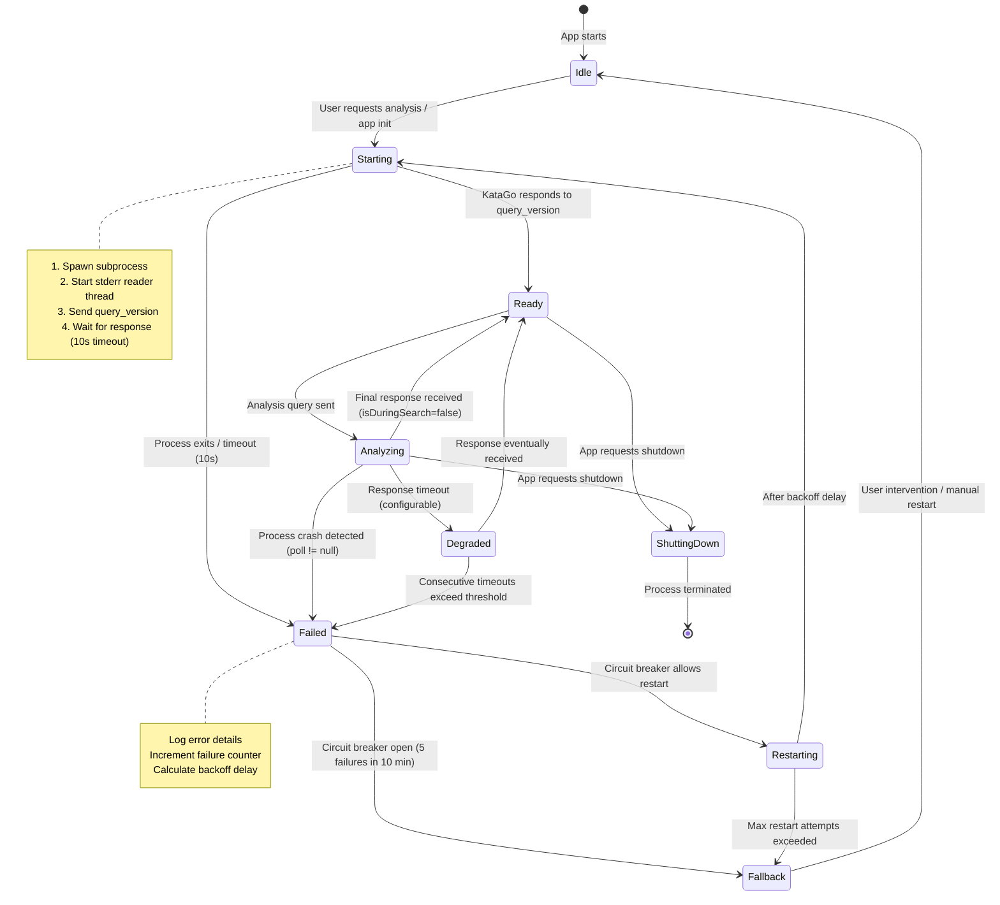

# KataGo 분석 엔진 IPC 명세서

**버전**: 1.0.0
**KataGo 대상 버전**: v1.16.4
**작성자**: @katago-researcher (Step 2)
**작성일**: 2026-03-11
**소비자**: Step 12 (katago-integrator), Step 4 (template-designer)

---

## 목차

1. [출처 카탈로그](#1-출처-카탈로그)
2. [프로토콜 개요](#2-프로토콜-개요)
3. [쿼리 형식 명세](#3-쿼리-형식-명세)
4. [응답 형식 명세](#4-응답-형식-명세)
5. [TypeScript 타입 정의](#5-typescript-타입-정의)
6. [GPU 백엔드 감지 전략](#6-gpu-백엔드-감지-전략)
7. [프로세스 생명주기 관리](#7-프로세스-생명주기-관리)
8. [신경망 모델 전략](#8-신경망-모델-전략)
9. [방문 횟수 티어 설정](#9-방문-횟수-티어-설정)
10. [하드웨어 벤치마크 전략](#10-하드웨어-벤치마크-전략)

---

## 1. 출처 카탈로그

모든 명세 세부 사항은 다음 1차 출처에서 추적 가능하다.

| ID | 출처 | URL | 수집일 |
|----|------|-----|--------|
| S1 | Analysis Engine 문서 | https://github.com/lightvector/KataGo/blob/master/docs/Analysis_Engine.md | 2026-03-11 |
| S2 | Analysis 예제 설정 파일 | https://github.com/lightvector/KataGo/blob/master/cpp/configs/analysis_example.cfg | 2026-03-11 |
| S3 | GTP 확장 (규칙) | https://github.com/lightvector/KataGo/blob/master/docs/GTP_Extensions.md | 2026-03-11 |
| S4 | analysis.cpp 소스 코드 | https://github.com/lightvector/KataGo/blob/master/cpp/command/analysis.cpp | 2026-03-11 |
| S5 | Python 예제 | https://github.com/lightvector/KataGo/blob/master/python/query_analysis_engine_example.py | 2026-03-11 |
| S6 | KataGo README | https://github.com/lightvector/KataGo/blob/master/README.md | 2026-03-11 |
| S7 | v1.16.0 릴리스 노트 | https://github.com/lightvector/KataGo/releases/tag/v1.16.0 | 2026-03-11 |
| S8 | v1.16.4 릴리스 노트 | https://github.com/lightvector/KataGo/releases/tag/v1.16.4 | 2026-03-11 |
| S9 | KataGo 학습 네트워크 | https://katagotraining.org/networks/ | 2026-03-11 |
| S10 | KaTrain engine.py | https://github.com/sanderland/katrain/blob/master/katrain/core/engine.py | 2026-03-11 |
| S11 | g65 모델 아카이브 | https://katagoarchive.org/g65/models/index.html | 2026-03-11 |
| S12 | 추가 네트워크 | https://katagotraining.org/extra_networks/ | 2026-03-11 |
| S13 | DeepWiki 시작하기 | https://deepwiki.com/lightvector/KataGo/1.2-getting-started | 2026-03-11 |
| S14 | v1.15.0 릴리스 (Human SL) | https://github.com/lightvector/KataGo/releases/tag/v1.15.0 | 2026-03-11 |
| S15 | 벤치마크 블로그 (RTX 5070) | https://songyp.com/blog/katago-workstation-build-and-bench | 2026-03-11 |
| S16 | OGS 포럼 하드웨어 속도 | https://forums.online-go.com/t/katago-speeds-of-different-hardwares/48463 | 2026-03-11 |
| S17 | b18c384nbt 아키텍처 이슈 | https://github.com/lightvector/KataGo/issues/793 | 2026-03-11 |

---

## 2. 프로토콜 개요

### 2.1 전송 계층

KataGo의 분석 엔진은 stdin/stdout을 통한 **줄 구분 JSON 프로토콜(line-delimited JSON protocol)**을 사용한다. [S1]

- **방향**: 클라이언트가 KataGo의 **stdin**에 JSON 쿼리를 작성하고, KataGo는 **stdout**으로 JSON 응답을 출력한다.
- **프레이밍**: 각 메시지(쿼리 또는 응답)는 `\n`으로 종료되는 **한 줄짜리 단일 JSON 객체**이다. 여러 줄에 걸친 JSON은 지원되지 않는다. [S1]
- **순서**: 응답은 쿼리 제출 순서와 **다른 순서로** 도착할 수 있다. `id` 필드로 응답을 쿼리에 대응시킨다. [S1]
- **Stderr**: 로깅/에러에 사용되며 프로토콜의 일부가 아니다. 파이프 블로킹을 방지하기 위해 반드시 소비해야 한다. [S4, S5]
- **인코딩**: UTF-8. [S4]

### 2.2 실행 명령

```bash
./katago analysis -config <CONFIG_FILE> -model <MODEL_FILE> [OPTIONS]
```

**명령줄 인수** [S1, S4, S6]:

| 인수 | 타입 | 필수 | 설명 |
|------|------|------|------|
| `-config <FILE>` | string | 예* | 분석 설정 파일 경로 (예: `analysis_example.cfg`) |
| `-model <FILE>` | string | 예* | 신경망 모델 경로 (`.bin.gz`) |
| `-human-model <FILE>` | string | 아니오 | 인간 지도학습(SL) 모델 경로 (예: `b18c384nbt-humanv0.bin.gz`) |
| `-override-config <KEY=VALUE>` | string | 아니오 | 설정 파일 파라미터 오버라이드 |
| `--analysis-threads <N>` | integer | 아니오 | 병렬 분석 포지션 수 (설정 파일의 `numAnalysisThreads`를 오버라이드). 범위: 1-16384. 기본값: 설정 파일 값. |
| `--quit-without-waiting` | switch | 아니오 | stdin이 닫히면 대기 중인 분석을 완료하지 않고 즉시 종료 |

*지정하지 않으면 KataGo는 실행 파일 디렉터리에서 `default_model.bin.gz`와 `default_gtp.cfg`를 찾는다. [S6]

### 2.3 보장 사항

1. 분석된 모든 포지션은 `isDuringSearch: false`인 **정확히 하나의 최종 응답**을 생성한다. [S1]
2. `reportDuringSearchEvery`가 설정된 경우, 최종 응답 전에 `isDuringSearch: true`인 **중간** 응답이 올 수 있다. [S1]
3. 종료된 쿼리는 `isDuringSearch: false`와 함께 부분 결과 또는 `"noResults": true`를 포함하는 응답을 생성한다. [S1]
4. 향후 버전에서 응답에 새로운 필드가 추가될 수 있다. 소비자는 알 수 없는 필드를 반드시 허용해야 한다. [S1]

---

## 3. 쿼리 형식 명세

### 3.1 표준 분석 쿼리

#### 필수 필드 [S1]

| 필드 | 타입 | 설명 | 제약 조건 |
|------|------|------|-----------|
| `id` | `string` | 응답에 그대로 반환되는 임의 식별자 | 비어 있지 않은 문자열 |
| `moves` | `[string, string][]` | 착수 순서대로 나열한 `[플레이어, 위치]` 튜플 배열 | 플레이어: `"B"` 또는 `"W"`. 위치: GTP 표기법 (3.5절 참조). 초기 포지션일 경우 빈 배열 `[]`. |
| `rules` | `string \| RulesObject` | 명명된 규칙 세트 문자열 또는 JSON 규칙 객체 형태의 게임 규칙 | 3.3절 참조 |
| `boardXSize` | `integer` | 바둑판 너비 | 1-19 (기본 빌드); +bs50 빌드에서 최대 50 |
| `boardYSize` | `integer` | 바둑판 높이 | 1-19 (기본 빌드); +bs50 빌드에서 최대 50 |

**`komi`에 대한 참고 사항**: 일반적으로 포함되지만, `komi`는 기술적으로 선택 사항이다. 생략하면 KataGo가 규칙에 따라 추정한다: 집 계산 방식(area scoring)은 7.5, 영역 계산 방식(territory scoring)은 6.5, 버튼 바둑(button Go)은 7.0. [S1]

#### 선택 필드 [S1]

| 필드 | 타입 | 기본값 | 설명 |
|------|------|--------|------|
| `komi` | `number` | 규칙에서 추정 (7.5 area / 6.5 territory / 7.0 button) | 덤 값. 범위: [-150, 150]. |
| `initialStones` | `[string, string][]` | `[]` | 사전 배치 돌 (치석, 사활 문제 설정). `moves`와 동일한 형식. |
| `initialPlayer` | `string` | 컨텍스트에서 추론 | `"B"` 또는 `"W"`. 0번째 턴의 착수자. `moves`가 비어 있을 때 유용. |
| `whiteHandicapBonus` | `string` | 규칙에서 가져옴 | 백의 핸디캡 보상 오버라이드. 값: `"0"`, `"N"`, `"N-1"`. |
| `analyzeTurns` | `integer[]` | `[moves.length]` | 분석할 포지션. `0` = 초기 포지션, `1` = `moves[0]` 이후, 등. |
| `maxVisits` | `integer` | 설정 파일 값 | 포지션당 최대 MCTS 방문 횟수. |
| `rootPolicyTemperature` | `number` | `1.0` | 1보다 큰 값은 탐색 범위를 넓힌다. |
| `rootFpuReductionMax` | `number` | 설정 파일 값 | `0`으로 설정하면 착수 다양성 탐색이 증가한다. |
| `analysisPVLen` | `integer` | 설정 파일 값 | 착수당 최대 주변화(principal variation) 길이. |
| `includeOwnership` | `boolean` | `false` | 응답에 바둑판 소유권 예측을 포함. 참고: 메모리 사용량이 2배로 증가. |
| `includeOwnershipStdev` | `boolean` | `false` | 소유권 표준편차를 포함. |
| `includeMovesOwnership` | `boolean` | `false` | 각 후보 착수 이후의 소유권 예측을 포함. |
| `includeMovesOwnershipStdev` | `boolean` | `false` | 각 후보 착수 이후의 소유권 표준편차를 포함. |
| `includePolicy` | `boolean` | `false` | 원시 신경망 정책 출력을 포함. |
| `includePVVisits` | `boolean` | `false` | 주변화를 따라 방문 횟수를 포함. |
| `includeNoResultValue` | `boolean` | `false` | 무승부 확률을 포함 (일본 규칙에서 유의미). |
| `avoidMoves` | `AvoidMovesSpec[]` | `[]` | 지정된 깊이까지 특정 착수를 금지. 3.4절 참조. |
| `allowMoves` | `AllowMovesSpec[]` | `[]` | 탐색을 특정 착수로 제한. 배열 길이는 반드시 1이어야 함. 3.4절 참조. |
| `overrideSettings` | `object` | `{}` | 이 쿼리에 대해서만 설정 파라미터를 오버라이드. 3.6절 참조. |
| `reportDuringSearchEvery` | `number` | 비활성화 | 이 간격(초)마다 부분 결과를 보고. |
| `priority` | `integer` | `0` | 쿼리 우선순위. 높은 값이 먼저 처리됨. |
| `priorities` | `integer[]` | 없음 | 턴별 우선순위. 길이는 `analyzeTurns`와 일치해야 함. |

### 3.2 액션 쿼리 [S1]

액션 쿼리는 분석 필드 대신 `action` 필드를 사용한다.

#### query_version

KataGo 버전 정보를 반환한다.

```json
{"id": "version-check", "action": "query_version"}
```

**응답**:
```json
{
  "id": "version-check",
  "action": "query_version",
  "version": "1.16.4",
  "git_hash": "0b0c2975..."
}
```

#### query_models

로드된 신경망 모델 정보를 반환한다.

```json
{"id": "model-check", "action": "query_models"}
```

**응답**:
```json
{
  "id": "model-check",
  "action": "query_models",
  "models": [
    {
      "name": "kata1-b18c384nbt-s...-d....bin.gz",
      "internalName": "kata1-b18c384nbt-s...-d...",
      "maxBatchSize": 256,
      "usesHumanSLProfile": false,
      "version": 16,
      "usingFP16": "auto"
    }
  ]
}
```

#### clear_cache

신경망 결과 캐시를 비운다.

```json
{"id": "clear-1", "action": "clear_cache"}
```

**응답**: 쿼리 필드를 그대로 반환한다.

#### terminate

`terminateId`와 일치하는 쿼리의 분석을 종료한다.

```json
{"id": "term-1", "action": "terminate", "terminateId": "analysis-42"}
```

선택 사항: 종료를 특정 턴으로 제한하는 `turnNumbers` (integer[]).

**응답**: 쿼리를 그대로 반환한다. 종료된 분석은 `"isDuringSearch": false`와 함께 부분 결과 또는 `"noResults": true`를 포함하는 응답을 생성한다.

#### terminate_all

대기 중인 모든 분석을 종료한다.

```json
{"id": "term-all", "action": "terminate_all"}
```

선택 사항: 특정 턴으로 제한하는 `turnNumbers` (integer[]).

### 3.3 규칙 명세 [S3]

규칙은 **문자열 단축 표기** 또는 **JSON 객체**로 지정할 수 있다.

#### 문자열 단축 표기

| 규칙 세트 | Ko | 계가 방식 | 자살수 | Tax | 백 핸디캡 보너스 |
|-----------|-----|-----------|--------|------|------------------|
| `"tromp-taylor"` | POSITIONAL | AREA | true | NONE | 0 |
| `"chinese"` | SIMPLE | AREA | false | NONE | N |
| `"chinese-ogs"` | POSITIONAL | AREA | false | NONE | N |
| `"chinese-kgs"` | POSITIONAL | AREA | false | NONE | N |
| `"japanese"` | SIMPLE | TERRITORY | false | SEKI | 0 |
| `"korean"` | SIMPLE | TERRITORY | false | SEKI | 0 |
| `"stone-scoring"` | SIMPLE | AREA | false | ALL | 0 |
| `"aga"` | SITUATIONAL | AREA | false | NONE | N-1 |
| `"bga"` | SITUATIONAL | AREA | false | NONE | N-1 |
| `"new-zealand"` | SITUATIONAL | AREA | true | NONE | 0 |
| `"aga-button"` | SITUATIONAL | AREA | false | NONE | N-1 |

#### JSON 객체 형식

```json
{
  "ko": "SIMPLE" | "POSITIONAL" | "SITUATIONAL",
  "scoring": "AREA" | "TERRITORY",
  "suicide": true | false,
  "tax": "NONE" | "SEKI" | "ALL",
  "whiteHandicapBonus": "0" | "N-1" | "N",
  "hasButton": true | false,
  "friendlyPassOk": true | false
}
```

### 3.4 착수 금지/허용 명세 [S1]

```json
{
  "player": "B" | "W",
  "moves": ["C3", "Q4", "pass"],
  "untilDepth": 3
}
```

- `player`: 착수를 제한할 플레이어.
- `moves`: GTP 위치 문자열 배열.
- `untilDepth`: 양의 정수. 깊이 1부터 `untilDepth`까지(포함) 제한이 적용된다.
- `allowMoves`의 경우, 외부 배열의 길이가 정확히 **1**이어야 한다. [S1]

### 3.5 위치 형식 [S1]

착수는 GTP 좌표 표기법을 사용한다:

| 형식 | 예시 | 설명 |
|------|------|------|
| 표준 | `"C4"`, `"Q16"` | 열 문자 (A-T, I 제외) + 행 번호 |
| 확장 | `"AA5"`, `"AB3"` | 25열을 초과하는 바둑판용 |
| 명시적 | `"(0,13)"` | X,Y 정수 좌표 (0부터 시작) |
| 패스 | `"pass"` | 패스 착수 |

열 문자는 `I`를 건너뛴다 (`1`과의 혼동 방지): A, B, C, D, E, F, G, H, J, K, L, M, N, O, P, Q, R, S, T.

### 3.6 설정 오버라이드 [S1]

`overrideSettings` 필드는 설정 파일 파라미터의 일부를 허용한다. 주요 파라미터:

| 파라미터 | 타입 | 설명 |
|----------|------|------|
| `cpuctExploration` | float | MCTS 탐색 상수 |
| `winLossUtilityFactor` | float | 효용 함수에 대한 승률 기여도 |
| `staticScoreUtilityFactor` | float | 효용 함수에 대한 정적 점수 기여도 |
| `dynamicScoreUtilityFactor` | float | 효용 함수에 대한 동적 점수 기여도 |
| `playoutDoublingAdvantage` | float | 현재 플레이어가 상대보다 2^PDA 배의 플레이아웃을 가진다고 가정. 범위: [-3, 3]. |
| `wideRootNoise` | float | 넓은 탐색을 위한 루트 노이즈 |
| `ignorePreRootHistory` | boolean | 분석 포지션 이전의 착수 이력을 무시 |
| `antiMirror` | boolean | 대칭 착수(미러 플레이)를 감지/대응 (결과에 편향 발생) |
| `rootNumSymmetriesToSample` | integer | 평균을 내는 대칭 수. 범위: [1, 8]. 높을수록 더 부드럽지만 느려진다. |
| `useUncertainty` | boolean | 불확실성 기능 활성화 |
| `subtreeValueBiasFactor` | float | 하위 트리 가치 편향 정도 |
| `useNoisePruning` | boolean | 노이즈 기반 가지치기 활성화 |
| `humanSLProfile` | string | 인간 모방 프로필. 3.7절 참조. |
| `humanSLRootExploreProbWeightless` | float | 평가에 편향 없이 인간 착수를 탐색. 범위: [0, 1]. |
| `humanSLCpuctPermanent` | float | 인간 착수 탐색 강도. 반드시 0보다 커야 한다. |
| `humanSLPlaExploreProbWeightful` | float | 인간 정책을 통한 자기 착수. 범위: [0, 1]. |
| `humanSLOppExploreProbWeightful` | float | 인간 정책을 통한 상대 착수. 범위: [0, 1]. |

### 3.7 인간 SL 프로필 문자열 [S1, S14]

`-human-model`로 인간 SL 모델을 로드해야 사용할 수 있다. 프로필 문자열:

| 패턴 | 예시 | 설명 |
|------|------|------|
| `preaz_{rank}` | `preaz_9d`, `preaz_5k` | 알파제로 이전 스타일의 급수별 프로필 |
| `rank_{rank}` | `rank_3d`, `rank_20k` | 현대 스타일의 급수별 프로필 |
| `preaz_{BR}_{WR}` | `preaz_3d_7d` | 알파제로 이전, 돌 색상별 급수 인식 |
| `rank_{BR}_{WR}` | `rank_1d_5d` | 현대, 돌 색상별 급수 인식 |
| `proyear_{year}` | `proyear_2023`, `proyear_1800` | 프로/입단 연도별 역사적 모방 |

급수 값: `20k`부터 `9d`까지. 연도 값: `1800`부터 `2023`까지.

### 3.8 쿼리 예제

#### 단일 포지션 분석 (2수 이후)

```json
{
  "id": "game-001-turn-2",
  "moves": [["B", "Q4"], ["W", "D4"]],
  "rules": "chinese",
  "komi": 7.5,
  "boardXSize": 19,
  "boardYSize": 19,
  "maxVisits": 500,
  "includeOwnership": true,
  "includePolicy": true
}
```

#### 전체 기보를 여러 턴에 걸쳐 분석

```json
{
  "id": "full-game-review",
  "initialStones": [["B", "D4"]],
  "moves": [["W", "Q16"], ["B", "C16"], ["W", "Q3"], ["B", "R14"]],
  "rules": "japanese",
  "komi": 6.5,
  "boardXSize": 19,
  "boardYSize": 19,
  "analyzeTurns": [0, 1, 2, 3, 4],
  "maxVisits": 50
}
```

#### 빠른 즉시 분석 (방문 5회)

```json
{
  "id": "instant-hint",
  "moves": [["B", "Q4"], ["W", "D16"], ["B", "C4"]],
  "rules": "chinese",
  "komi": 7.5,
  "boardXSize": 19,
  "boardYSize": 19,
  "maxVisits": 5,
  "priority": 10
}
```

#### 시작 시 버전 조회

```json
{"id": "startup-version", "action": "query_version"}
```

---

## 4. 응답 형식 명세

### 4.1 표준 분석 응답 [S1]

#### 최상위 필드

| 필드 | 타입 | 조건 | 설명 |
|------|------|------|------|
| `id` | `string` | 항상 | 반환된 쿼리 식별자 |
| `isDuringSearch` | `boolean` | 항상 | 최종 결과는 `false`; 중간 결과는 `true` |
| `turnNumber` | `integer` | 항상 | 분석된 턴 (`analyzeTurns`의 인덱스) |
| `moveInfos` | `MoveInfo[]` | 항상 | 각 검토 착수에 대한 분석 |
| `rootInfo` | `RootInfo` | 항상 | 전체 포지션 평가 |
| `ownership` | `number[]` | `includeOwnership: true`인 경우 | 바둑판 소유권 예측. 4.4절 참조. |
| `ownershipStdev` | `number[]` | `includeOwnershipStdev: true`인 경우 | 소유권 불확실성. 4.4절 참조. |
| `policy` | `number[]` | `includePolicy: true`인 경우 | 원시 신경망 정책 출력. 4.5절 참조. |
| `humanPolicy` | `number[]` | `includePolicy: true` + 인간 모델 로드 시 | 인간 모델 정책. `policy`와 동일한 형식. |

### 4.2 MoveInfo 필드 [S1]

`moveInfos`의 각 요소는 다음을 포함한다:

| 필드 | 타입 | 조건 | 설명 |
|------|------|------|------|
| `move` | `string` | 항상 | GTP 표기법으로 된 착수 위치 (예: `"C4"`, `"pass"`) |
| `visits` | `integer` | 항상 | 자식 노드 방문 횟수 |
| `edgeVisits` | `integer` | 항상 | 이 착수에 대한 부모 노드의 방문 할당 |
| `winrate` | `number` | 항상 | 현재 플레이어의 승률. 범위: [0, 1]. |
| `scoreMean` | `number` | 항상 | `scoreLead`의 별칭 (하위 호환성) |
| `scoreLead` | `number` | 항상 | 현재 플레이어의 예상 집 차이 |
| `scoreStdev` | `number` | 항상 | 예상 집수 표준편차 (MCTS로 인해 높게 편향됨) |
| `scoreSelfplay` | `number` | 항상 | 이 착수를 놓았을 때의 평균 최종 게임 점수 |
| `prior` | `number` | 항상 | 신경망 정책 사전 확률. 범위: [0, 1]. |
| `utility` | `number` | 항상 | 승률+점수 결합 효용 값 |
| `utilityLcb` | `number` | 항상 | 효용 하한 신뢰 구간 |
| `lcb` | `number` | 항상 | 승률 하한 신뢰 구간. [0, 1]을 초과할 수 있음. |
| `weight` | `number` | 항상 | 총 방문 가중치 (불확실성 보정) |
| `edgeWeight` | `number` | 항상 | 부모의 의도된 방문 가중치 |
| `order` | `integer` | 항상 | 순위: 0 = 최선의 수, 1 = 차선의 수, 등. |
| `playSelectionValue` | `number` | 항상 (v1.16+) | 착수 선택 순서에 사용되는 값; 착수 확률에 비례. [S7] |
| `pv` | `string[]` | 항상 | 주변화 (이 착수 이후의 착수 시퀀스) |
| `pvVisits` | `integer[]` | `includePVVisits: true`인 경우 | 각 주변화 포지션의 방문 횟수 |
| `pvEdgeVisits` | `integer[]` | `includePVVisits: true`인 경우 | 각 주변화 착수의 에지 방문 횟수 |
| `noResultValue` | `number` | `includeNoResultValue: true`인 경우 | 무승부 확률. 범위: [0, 1]. |
| `humanPrior` | `number` | 인간 모델 로드 시 | 인간 정책 사전 확률. 범위: [0, 1]. |
| `isSymmetryOf` | `string` | 대칭 가지치기 활성 시 | 이 착수는 탐색되지 않았으며, 지정된 착수에서 결과가 복사됨. |
| `ownership` | `number[]` | `includeMovesOwnership: true`인 경우 | 이 착수 이후의 바둑판 소유권. 4.4절 참조. |
| `ownershipStdev` | `number[]` | `includeMovesOwnershipStdev: true`인 경우 | 이 착수 이후의 소유권 표준편차. 4.4절 참조. |

### 4.3 RootInfo 필드 [S1]

| 필드 | 타입 | 조건 | 설명 |
|------|------|------|------|
| `winrate` | `number` | 항상 | 현재 플레이어의 포지션 승률. 범위: [0, 1]. |
| `scoreLead` | `number` | 항상 | 현재 플레이어의 예상 집 차이 |
| `scoreSelfplay` | `number` | 항상 | 평균 최종 게임 점수 |
| `scoreStdev` | `number` | 항상 | 점수 표준편차 |
| `utility` | `number` | 항상 | 결합 효용 값 |
| `visits` | `integer` | 항상 | 루트에서의 총 방문 횟수 |
| `currentPlayer` | `string` | 항상 | `"B"` 또는 `"W"` |
| `thisHash` | `string` | 항상 | 포지션 해시 (바둑판/플레이어/패 상태별 고유값) |
| `symHash` | `string` | 항상 | 대칭 불변 해시 (초패는 추적하지 않음) |
| `lcb` | `number` | 항상 | 승률 하한 신뢰 구간 |
| `utilityLcb` | `number` | 항상 | 효용 하한 신뢰 구간 |
| `rawWinrate` | `number` | 항상 | 신경망 원시 승률 예측 (MCTS 탐색 없음) |
| `rawLead` | `number` | 항상 | 신경망 원시 리드 예측 (탐색 없음) |
| `rawScoreSelfplay` | `number` | 항상 | 신경망 원시 점수 예측 (탐색 없음) |
| `rawScoreSelfplayStdev` | `number` | 항상 | 신경망 원시 점수 표준편차 (탐색 없음) |
| `rawNoResultProb` | `number` | 항상 | 신경망 원시 무승부 확률 |
| `rawStWrError` | `number` | 항상 | 신경망 단기 승률 불확실성 추정 |
| `rawStScoreError` | `number` | 항상 | 신경망 단기 점수 불확실성 추정 |
| `rawVarTimeLeft` | `number` | 항상 | 신경망의 남은 의미 있는 게임 수명 추정 |
| `humanWinrate` | `number` | 인간 모델 로드 시 | 인간 모델 승률 예측 |
| `humanScoreMean` | `number` | 인간 모델 로드 시 | 인간 모델 점수 예측 |
| `humanScoreStdev` | `number` | 인간 모델 로드 시 | 인간 모델 점수 표준편차 |
| `humanStWrError` | `number` | 인간 모델 로드 시 | 인간 모델 단기 승률 불확실성 |
| `humanStScoreError` | `number` | 인간 모델 로드 시 | 인간 모델 단기 점수 불확실성 |

### 4.4 소유권 맵 형식 [S1]

응답에 소유권이 포함되는 경우:

- **배열 길이**: `boardYSize * boardXSize`
- **순서**: 행 우선(row-major), 좌상단(19x19의 경우 A19)에서 우하단(T1)까지
- **값**: `[-1, 1]` 범위의 실수
  - `+1` = 흑이 완전히 소유
  - `-1` = 백이 완전히 소유
  - `0` = 중립/분쟁 지역
- **관점**: `reportAnalysisWinratesAs` 설정과 관계없이 항상 흑의 소유권 관점에서 표시.
- **표준편차 값**: 범위 `[0, 1]`

**19x19 바둑판의 인덱스 매핑**:
```
index = (18 - y) * 19 + x
```
여기서 `x`는 열 (0=A, 1=B, ..., 18=T, 표시에서는 I를 건너뛰지만 인덱싱에서는 건너뛰지 않음), `y`는 행 (0=1, ..., 18=19).

### 4.5 정책 출력 형식 [S1]

`includePolicy: true`인 경우:

- **배열 길이**: `boardYSize * boardXSize + 1`
- **순서**: 행 우선 (소유권과 동일), **마지막 요소**가 패스 정책
- **값**: 합이 약 1.0인 양의 실수
- **비합법 착수**: `-1`로 표시
- **`humanPolicy`**: 동일한 형식이며, 인간 모델이 로드되고 `humanSLProfile`이 설정된 경우에만 존재

### 4.6 승률 관점 [S1, S2]

모든 승률과 점수 값은 설정 파일의 `reportAnalysisWinratesAs`에 지정된 플레이어의 관점에서 보고된다 (기본값: `BLACK`). [S2]

이는 다음을 의미한다:
- `reportAnalysisWinratesAs = BLACK`인 경우: `winrate` 0.6은 누구의 차례인지와 관계없이 흑의 승률이 60%임을 의미한다.
- `reportAnalysisWinratesAs = WHITE`인 경우: 값은 백의 관점에서 표시된다.

**구현 참고 사항**: "현재 플레이어 관점"을 보여주는 UI에서는 `rootInfo.currentPlayer`를 확인하고 필요시 값을 반전시켜야 한다.

### 4.7 에러 및 경고 응답 [S1, S4]

#### 일반 에러 (쿼리 컨텍스트 없음)

```json
{"error": "Failed to parse input as json"}
```

#### 필드별 에러

```json
{"id": "query-1", "field": "boardXSize", "error": "Board size must be between 1 and 19"}
```

#### 필드별 경고

```json
{"id": "query-1", "field": "unknownField", "warning": "Unexpected field in query"}
```

### 4.8 종료된 쿼리 응답 [S1]

쿼리가 완료 전에 종료된 경우:

```json
{
  "id": "analysis-42",
  "turnNumber": 3,
  "isDuringSearch": false,
  "noResults": true
}
```

부분 결과가 있으면, 수집된 데이터를 포함한 표준 형식의 응답이 반환된다.

### 4.9 응답 예제

```json
{
  "id": "game-001-turn-2",
  "isDuringSearch": false,
  "turnNumber": 2,
  "moveInfos": [
    {
      "move": "R16",
      "visits": 248,
      "edgeVisits": 249,
      "winrate": 0.5124,
      "scoreMean": 0.35,
      "scoreLead": 0.35,
      "scoreStdev": 12.5,
      "scoreSelfplay": 0.42,
      "prior": 0.0823,
      "utility": 0.042,
      "utilityLcb": 0.028,
      "lcb": 0.498,
      "weight": 246.3,
      "edgeWeight": 247.5,
      "order": 0,
      "playSelectionValue": 248.5,
      "pv": ["R16", "C16", "Q3", "D17", "E3"]
    },
    {
      "move": "C16",
      "visits": 145,
      "edgeVisits": 146,
      "winrate": 0.5098,
      "scoreMean": 0.29,
      "scoreLead": 0.29,
      "scoreStdev": 12.8,
      "scoreSelfplay": 0.35,
      "prior": 0.0671,
      "utility": 0.038,
      "utilityLcb": 0.021,
      "lcb": 0.491,
      "weight": 143.8,
      "edgeWeight": 145.1,
      "order": 1,
      "playSelectionValue": 145.2,
      "pv": ["C16", "R16", "D3", "Q17"]
    }
  ],
  "rootInfo": {
    "winrate": 0.5124,
    "scoreLead": 0.35,
    "scoreSelfplay": 0.42,
    "scoreStdev": 12.5,
    "utility": 0.042,
    "visits": 500,
    "currentPlayer": "W",
    "thisHash": "A1B2C3D4E5F6...",
    "symHash": "X9Y8Z7W6V5...",
    "lcb": 0.498,
    "utilityLcb": 0.028,
    "rawWinrate": 0.5089,
    "rawLead": 0.32,
    "rawScoreSelfplay": 0.38,
    "rawScoreSelfplayStdev": 13.1,
    "rawNoResultProb": 0.0001,
    "rawStWrError": 0.045,
    "rawStScoreError": 2.1,
    "rawVarTimeLeft": 85.3
  }
}
```

---

## 5. TypeScript 타입 정의

```typescript
// ============================================================
// KataGo Analysis Engine IPC Types
// Based on KataGo v1.16.4 Analysis Engine documentation [S1]
// ============================================================

// --- Location & Player Types ---

/** GTP player identifier */
type Player = "B" | "W";

/** GTP location string: "C4", "Q16", "AA5", "(0,13)", "pass" */
type GTPLocation = string;

/** A move is a [player, location] tuple */
type Move = [Player, GTPLocation];

// --- Rules Types ---

type KoRule = "SIMPLE" | "POSITIONAL" | "SITUATIONAL";
type ScoringRule = "AREA" | "TERRITORY";
type TaxRule = "NONE" | "SEKI" | "ALL";
type WhiteHandicapBonus = "0" | "N-1" | "N";

type RulesetString =
  | "tromp-taylor"
  | "chinese"
  | "chinese-ogs"
  | "chinese-kgs"
  | "japanese"
  | "korean"
  | "stone-scoring"
  | "aga"
  | "bga"
  | "new-zealand"
  | "aga-button";

interface RulesObject {
  ko: KoRule;
  scoring: ScoringRule;
  suicide: boolean;
  tax: TaxRule;
  whiteHandicapBonus: WhiteHandicapBonus;
  hasButton?: boolean;
  friendlyPassOk?: boolean;
}

type Rules = RulesetString | RulesObject;

// --- Avoid/Allow Moves ---

interface MoveRestriction {
  player: Player;
  moves: GTPLocation[];
  untilDepth: number; // positive integer
}

// --- Query Types ---

/** Standard analysis query */
interface AnalysisQuery {
  // Required fields
  id: string;
  moves: Move[];
  rules: Rules;
  boardXSize: number; // 1-19 (default), up to 50 (+bs50)
  boardYSize: number; // 1-19 (default), up to 50 (+bs50)

  // Optional fields
  komi?: number; // [-150, 150], default guessed from rules
  initialStones?: Move[];
  initialPlayer?: Player;
  whiteHandicapBonus?: WhiteHandicapBonus;
  analyzeTurns?: number[];
  maxVisits?: number;
  rootPolicyTemperature?: number; // default 1.0
  rootFpuReductionMax?: number;
  analysisPVLen?: number;
  includeOwnership?: boolean; // default false
  includeOwnershipStdev?: boolean; // default false
  includeMovesOwnership?: boolean; // default false
  includeMovesOwnershipStdev?: boolean; // default false
  includePolicy?: boolean; // default false
  includePVVisits?: boolean; // default false
  includeNoResultValue?: boolean; // default false
  avoidMoves?: MoveRestriction[];
  allowMoves?: [MoveRestriction]; // must be length 1
  overrideSettings?: Record<string, unknown>;
  reportDuringSearchEvery?: number; // seconds
  priority?: number; // default 0
  priorities?: number[]; // must match analyzeTurns length
}

/** Action queries */
interface QueryVersionAction {
  id: string;
  action: "query_version";
}

interface QueryModelsAction {
  id: string;
  action: "query_models";
}

interface ClearCacheAction {
  id: string;
  action: "clear_cache";
}

interface TerminateAction {
  id: string;
  action: "terminate";
  terminateId: string;
  turnNumbers?: number[];
}

interface TerminateAllAction {
  id: string;
  action: "terminate_all";
  turnNumbers?: number[];
}

type KataGoQuery =
  | AnalysisQuery
  | QueryVersionAction
  | QueryModelsAction
  | ClearCacheAction
  | TerminateAction
  | TerminateAllAction;

// --- Response Types ---

interface MoveInfo {
  // Always present
  move: GTPLocation;
  visits: number;
  edgeVisits: number;
  winrate: number; // [0, 1]
  scoreMean: number; // alias for scoreLead
  scoreLead: number;
  scoreStdev: number;
  scoreSelfplay: number;
  prior: number; // [0, 1]
  utility: number;
  utilityLcb: number;
  lcb: number; // may exceed [0, 1]
  weight: number;
  edgeWeight: number;
  order: number; // 0 = best
  playSelectionValue: number; // v1.16+
  pv: GTPLocation[];

  // Conditional fields
  pvVisits?: number[]; // when includePVVisits=true
  pvEdgeVisits?: number[]; // when includePVVisits=true
  noResultValue?: number; // when includeNoResultValue=true
  humanPrior?: number; // when human model loaded
  isSymmetryOf?: GTPLocation; // when symmetry pruning active
  ownership?: number[]; // when includeMovesOwnership=true
  ownershipStdev?: number[]; // when includeMovesOwnershipStdev=true
}

interface RootInfo {
  // Always present
  winrate: number; // [0, 1]
  scoreLead: number;
  scoreSelfplay: number;
  scoreStdev: number;
  utility: number;
  visits: number;
  currentPlayer: Player;
  thisHash: string;
  symHash: string;
  lcb: number;
  utilityLcb: number;
  rawWinrate: number;
  rawLead: number;
  rawScoreSelfplay: number;
  rawScoreSelfplayStdev: number;
  rawNoResultProb: number;
  rawStWrError: number;
  rawStScoreError: number;
  rawVarTimeLeft: number;

  // Conditional fields (human model)
  humanWinrate?: number;
  humanScoreMean?: number;
  humanScoreStdev?: number;
  humanStWrError?: number;
  humanStScoreError?: number;
}

/** Standard analysis response */
interface AnalysisResponse {
  id: string;
  isDuringSearch: boolean;
  turnNumber: number;
  moveInfos: MoveInfo[];
  rootInfo: RootInfo;

  // Conditional fields
  ownership?: number[]; // length: boardYSize * boardXSize
  ownershipStdev?: number[];
  policy?: number[]; // length: boardYSize * boardXSize + 1
  humanPolicy?: number[];
}

/** Terminated query with no results */
interface NoResultResponse {
  id: string;
  isDuringSearch: false;
  turnNumber: number;
  noResults: true;
}

/** Error response */
interface ErrorResponse {
  error: string;
  id?: string;
  field?: string;
}

/** Warning response */
interface WarningResponse {
  warning: string;
  id: string;
  field: string;
}

/** Version response */
interface VersionResponse {
  id: string;
  action: "query_version";
  version: string;
  git_hash: string;
}

/** Models response */
interface ModelInfo {
  name: string;
  internalName: string;
  maxBatchSize: number;
  usesHumanSLProfile: boolean;
  version: number;
  usingFP16: string;
}

interface ModelsResponse {
  id: string;
  action: "query_models";
  models: ModelInfo[];
}

type KataGoResponse =
  | AnalysisResponse
  | NoResultResponse
  | ErrorResponse
  | WarningResponse
  | VersionResponse
  | ModelsResponse;
```

---

## 6. GPU 백엔드 감지 전략

### 6.1 핵심 사실: 백엔드는 컴파일 타임에 결정되며 런타임이 아니다 [S6, S13]

KataGo의 신경망 백엔드는 `USE_BACKEND` CMake 옵션을 통해 **컴파일 타임에 선택**된다. 단일 바이너리는 정확히 하나의 백엔드만 지원하며, 런타임 백엔드 전환은 불가능하다.

따라서 데스크톱 앱은 **여러 바이너리 변형을 번들링하거나 감지**하여 런타임에 적절한 것을 선택해야 한다.

### 6.2 사용 가능한 백엔드

| 백엔드 | CMake 플래그 | 하드웨어 | 플랫폼 | 최초 실행 지연 | 상대 속도 |
|--------|-------------|----------|--------|----------------|-----------|
| **TensorRT** | `USE_BACKEND=TENSORRT` | NVIDIA GPU (TensorRT 8.5+) | Linux, Windows | 없음 | 최고 속도 (CPU 대비 87-104배) [S15] |
| **CUDA** | `USE_BACKEND=CUDA` | NVIDIA GPU (CUDA 11+, cuDNN) | Linux, Windows | 없음 | 빠름 (CPU 대비 61-69배) [S15] |
| **Metal** | `USE_BACKEND=METAL` | Apple GPU (macOS 13.0+) | macOS | 최소 | 빠름 (CPU 대비 9-10배) [S15] |
| **OpenCL** | `USE_BACKEND=OPENCL` | OpenCL 드라이버가 있는 모든 GPU | 전체 | 5-30분 (최초 실행, 자동 튜닝) [S6] | 보통 (CPU 대비 33-43배) [S15] |
| **Eigen (AVX2)** | `USE_BACKEND=EIGEN`, `-DUSE_AVX2=1` | CPU (AVX2+FMA 지원) | 전체 | 없음 | 기준선 + 37-64% [S15] |
| **Eigen** | `USE_BACKEND=EIGEN` | 모든 CPU | 전체 | 없음 | 기준선 |

### 6.3 백엔드 감지 알고리즘 (데스크톱 앱용)

백엔드가 컴파일 타임에 결정되므로, 데스크톱 앱은 **바이너리 선택** 알고리즘을 구현해야 한다:

```
FUNCTION detectBestBackend():

  platform = detectPlatform()  // "darwin" | "win32" | "linux"

  IF platform == "darwin":
    // macOS: Apple Silicon에서는 Metal이 최적
    IF hasBinary("katago-metal") AND macOSVersion >= 13.0:
      RETURN "metal"
    ELIF hasBinary("katago-opencl") AND hasOpenCLDrivers():
      RETURN "opencl"
    ELIF hasBinary("katago-eigenavx2") AND cpuSupportsAVX2():
      RETURN "eigenavx2"
    ELSE:
      RETURN "eigen"

  ELIF platform == "win32" OR platform == "linux":
    IF hasBinary("katago-tensorrt") AND hasTensorRT():
      RETURN "tensorrt"
    ELIF hasBinary("katago-cuda") AND hasCUDA():
      RETURN "cuda"
    ELIF hasBinary("katago-opencl") AND hasOpenCLDrivers():
      RETURN "opencl"
    ELIF hasBinary("katago-eigenavx2") AND cpuSupportsAVX2():
      RETURN "eigenavx2"
    ELSE:
      RETURN "eigen"

FUNCTION hasBinary(name):
  RETURN fileExists(bundledBinaryPath(name))

FUNCTION hasOpenCLDrivers():
  // OpenCL ICD 사용 가능 여부 확인
  // Linux: /etc/OpenCL/vendors/ 확인
  // Windows: 레지스트리에서 OpenCL.dll 확인
  // macOS: 항상 사용 가능 (deprecated이지만 작동)

FUNCTION hasCUDA():
  // nvidia-smi 또는 libcuda 가용성 확인
  // CUDA 버전이 바이너리 요구 사항과 일치하는지 확인 (예: CUDA 12.5)

FUNCTION hasTensorRT():
  // libnvinfer 가용성 확인
  // TensorRT 버전 일치 확인 (예: 10.2.0)

FUNCTION cpuSupportsAVX2():
  // AVX2 및 FMA 지원을 위한 CPU 플래그 확인
  // Linux: grep avx2 /proc/cpuinfo
  // macOS: sysctl -a | grep AVX2
  // Windows: CPUID 확인
```

### 6.4 데스크톱 앱 번들링 전략

| 플랫폼 | 번들 바이너리 | 우선순위 |
|--------|---------------|----------|
| **macOS (Apple Silicon)** | `katago-metal`, `katago-eigen` | Metal >> Eigen |
| **macOS (Intel)** | `katago-opencl`, `katago-eigenavx2`, `katago-eigen` | OpenCL >> EigenAVX2 >> Eigen |
| **Windows** | `katago-opencl`, `katago-cuda12.5`, `katago-eigenavx2`, `katago-eigen` | CUDA >> OpenCL >> EigenAVX2 >> Eigen |
| **Linux** | `katago-opencl`, `katago-cuda12.5`, `katago-eigenavx2`, `katago-eigen` | CUDA >> OpenCL >> EigenAVX2 >> Eigen |

**참고**: TensorRT 바이너리는 복잡한 라이브러리 의존성 때문에 번들링을 권장하지 않는다. TensorRT 성능이 필요한 사용자는 별도로 설치할 수 있다. [S6]

### 6.5 OpenCL 최초 실행 튜닝 [S6]

OpenCL 백엔드는 최초 실행 시 자동 튜닝을 수행한다 (5-30분). 결과는 `KataGoData/opencltuning/`에 캐시된다. 데스크톱 앱은 다음을 수행해야 한다:

1. 튜닝 캐시가 존재하는지 감지
2. 존재하지 않으면 사용자에게 일회성 지연에 대해 경고
3. 선택적으로 설치 마법사에서 튜닝 실행

---

## 7. 프로세스 생명주기 관리

### 7.1 상태 머신



### 7.2 프로세스 생성 프로토콜 [S1, S4, S5, S6]

```
FUNCTION spawnKataGo(config):
  binary = detectBestBackend()
  args = [
    binaryPath(binary),
    "analysis",
    "-config", config.configPath,
    "-model", config.modelPath,
  ]

  IF config.humanModelPath:
    args.append("-human-model", config.humanModelPath)

  IF config.analysisThreads:
    args.append("--analysis-threads", config.analysisThreads)

  // 제어된 종료를 위해 항상 quit-without-waiting 사용
  args.append("--quit-without-waiting")

  IF config.overrideConfig:
    FOR EACH key, value IN config.overrideConfig:
      args.append("-override-config", key + "=" + value)

  process = subprocess.spawn(args, {
    stdin: PIPE,
    stdout: PIPE,
    stderr: PIPE,
  })

  // stderr 소비 스레드 시작 (파이프 블로킹 방지)
  startStderrReader(process.stderr)

  // 버전 확인으로 프로세스 생존 여부 검증
  sendQuery(process.stdin, { id: "__startup__", action: "query_version" })
  response = waitForResponse(process.stdout, timeout=10000)

  IF response.error OR timeout:
    process.kill()
    THROW "KataGo failed to start"

  RETURN process
```

### 7.3 통신 프로토콜 [S1, S4, S5]

#### 쿼리 전송

```
FUNCTION sendQuery(stdin, query):
  line = JSON.stringify(query) + "\n"
  stdin.write(line, encoding="utf-8")
  stdin.flush()
```

#### 응답 수신

```
FUNCTION readResponse(stdout):
  line = stdout.readline()  // \n까지 블로킹
  IF line is empty:
    RETURN null  // 프로세스가 종료됨
  RETURN JSON.parse(line.trim())
```

**스레딩 모델** (KaTrain 패턴 기반 [S10]):

| 스레드 | 역할 |
|--------|------|
| **쓰기 스레드** | 쓰기 큐에서 디큐, stdin으로 직렬화, 플러시 |
| **읽기 스레드** | stdout을 줄 단위로 읽기, JSON 파싱, 콜백으로 디스패치 |
| **Stderr 스레드** | stderr 읽기, 로그 출력, "Uncaught exception" 패턴 감지 |

### 7.4 상태 모니터링 (감시자) [S4, S10]

#### 크래시 감지

```
FUNCTION checkAlive(process):
  exitCode = process.poll()
  IF exitCode is not null:
    RETURN { alive: false, exitCode: exitCode }
  RETURN { alive: true }
```

**알려진 종료 코드** [S10]:
- 종료 코드 `3221225781` (Windows): DLL 누락 -- 구체적인 라이브러리 안내와 함께 사용자에게 보고
- 0이 아닌 모든 종료 코드: 프로세스 실패

#### 행 감지

```
FUNCTION detectHang(lastResponseTime, timeout):
  IF currentTime() - lastResponseTime > timeout:
    RETURN true
  RETURN false
```

방문 횟수 티어별 권장 타임아웃:

| 방문 횟수 | 예상 응답 시간 | 행 타임아웃 |
|-----------|----------------|-------------|
| 5 | <100ms (GPU), <2s (CPU) | 5초 |
| 50 | <500ms (GPU), <10s (CPU) | 15초 |
| 500 | <3s (GPU), <60s (CPU) | 90초 |

#### Stderr 모니터링 [S10]

stderr 출력에서 다음 패턴을 감시한다:
- `"Uncaught exception"` -- 치명적 에러, 프로세스 종료 예상
- `"what()"` -- C++ 예외, 프로세스 종료 예상
- `"out of memory"` / `"OOM"` -- GPU 메모리 고갈
- `"CUDA error"` / `"OpenCL error"` -- 백엔드 실패

### 7.5 서킷 브레이커

```
CONFIGURATION:
  maxFailures = 5
  windowMs = 600000       // 10분
  backoffBaseMs = 3000    // 3초
  backoffMaxMs = 30000    // 30초
  backoffMultiplier = 2.0

STATE:
  failures = []           // 실패 타임스탬프
  consecutiveFailures = 0

FUNCTION recordFailure():
  now = currentTime()
  failures.append(now)
  consecutiveFailures += 1

  // 윈도우 밖의 오래된 실패 제거
  failures = failures.filter(t => now - t < windowMs)

FUNCTION isOpen():
  RETURN failures.length >= maxFailures

FUNCTION getBackoffDelay():
  delay = backoffBaseMs * (backoffMultiplier ^ (consecutiveFailures - 1))
  RETURN min(delay, backoffMaxMs)

FUNCTION onSuccess():
  consecutiveFailures = 0

FUNCTION shouldRestart():
  IF isOpen():
    RETURN false  // 서킷이 개방됨, 폴백으로 이동
  RETURN true
```

**백오프 스케줄** (3초 기본, 2배 승수, 30초 최대):

| 실패 # | 지연 |
|---------|------|
| 1 | 3초 |
| 2 | 6초 |
| 3 | 12초 |
| 4 | 24초 |
| 5 | 30초 (상한) |

### 7.6 정상 종료 프로토콜 [S1, S4]

```
FUNCTION shutdown(process, waitForCompletion=true):
  IF waitForCompletion:
    // 새 분석 중단을 위해 terminate_all 전송
    sendQuery(process.stdin, { id: "__shutdown__", action: "terminate_all" })
    // stdin 닫기 -- KataGo에 남은 작업 완료 신호
    process.stdin.close()
    // 타임아웃과 함께 대기
    exitCode = process.waitForExit(timeout=5000)
    IF exitCode is null:
      process.kill()  // 멈춘 경우 강제 종료
  ELSE:
    // --quit-without-waiting 옵션 시, stdin 닫기로 즉시 종료 트리거
    process.stdin.close()
    exitCode = process.waitForExit(timeout=3000)
    IF exitCode is null:
      process.kill()

  // 스레드 정리
  joinAllThreads()
```

**소스 코드에서 얻은 핵심 통찰** [S4]:
- `--quit-without-waiting`이 지정되고 stdin이 닫히면, KataGo는 두 큐 모두에 `setReadOnly()`를 호출하고 모든 봇에 `setKilled()`를 호출한 뒤 즉시 스레드를 합류시킨다.
- 이 플래그가 없으면, KataGo는 분석 스레드가 남은 작업을 처리할 때까지 기다린 후 종료한다.
- **권장 사항**: 데스크톱 앱에서는 항상 `--quit-without-waiting`으로 프로세스를 생성한다. 이렇게 하면 호스트 앱이 종료 타이밍을 완전히 제어할 수 있다.

---

## 8. 신경망 모델 전략

### 8.1 모델 아키텍처 개요

KataGo는 깊이(블록 수)와 너비(채널 수)를 설정할 수 있는 잔차 신경망(residual neural network)을 사용한다. "nbt" 접미사는 **중첩 병목(nested bottleneck)** 아키텍처를 나타낸다. [S17]

| 아키텍처 | 블록 | 채널 | 병목 | 대략적 파일 크기 (.bin.gz) | 출처 |
|----------|------|------|------|---------------------------|------|
| b6c96 | 6 | 96 | 아니오 | ~3.5 MB | [S11]: 8.4 MB .zip (참고: zip에는 추가 메타데이터 포함; .bin.gz는 더 작음) |
| b10c128 | 10 | 128 | 아니오 | ~11 MB | [S11]: 24 MB .zip |
| b15c192 | 15 | 192 | 아니오 | ~35 MB | [S11]: 81 MB .zip |
| b18c384nbt | 18 | 384 (192 병목) | 예 (팩터 2) | ~65 MB | [S9, S17] |
| b28c512nbt | 28 | 512 | 예 | ~170 MB | [S9] |

**파일 크기에 대한 참고**: g65 아카이브 [S11]의 .zip 파일은 현재 릴리스에서 사용하는 .bin.gz 형식보다 크다. 위의 .bin.gz 크기는 아키텍처 파라미터 수를 기반으로 한 추정치이다. 정확한 크기는 [S9]에서 다운로드하여 확인해야 한다. 이 부분은 정확한 .bin.gz 바이트 수에 대해 **부분적으로 미검증**으로 표시한다.

### 8.2 데스크톱 번들링용 사용 가능 모델

| 모델 | 용도 | 강도 (Elo) | 권장 사용처 | 출처 |
|------|------|------------|-------------|------|
| **kata1-b18c384nbt** (최신) | 기본 분석 | ~13,600 [S9] | 모든 사용자의 기본 모델 | [S6, S9] |
| **kata1-b28c512nbt** (최신) | 최대 강도 | ~14,080 [S9] | 파워 유저를 위한 선택적 다운로드 | [S9] |
| **b10c128** (확장 학습) | 빠른 분석 | ~프로 수준 | 저사양 하드웨어 폴백 | [S6] |
| **b6c96** (확장 학습) | 가장 빠르지만 가장 약함 | ~강한 아마추어 | 긴급 CPU 폴백 | [S11] |
| **b18c384nbt-humanv0** | 인간 착수 모방 | 해당 없음 (인간 스타일) | 교육/복기 기능 | [S14] |

### 8.3 데스크톱 앱 번들링 전략

#### 티어 1: 앱에 번들 (필수)

| 구성 요소 | 크기 | 근거 |
|-----------|------|------|
| `kata1-b18c384nbt-*.bin.gz` | ~65 MB | 최적의 강도/속도 트레이드오프. KataGo 저자가 모든 하드웨어 수준에 권장. [S6] |
| `analysis_config.cfg` | <1 KB | 데스크톱용으로 사전 설정됨 |
| KataGo 바이너리 (플랫폼별) | ~5-15 MB | 백엔드 감지로 선택 |

**총 번들 크기 추정**: 플랫폼당 ~70-80 MB.

#### 티어 2: 선택적 다운로드 (앱 내)

| 구성 요소 | 크기 | 근거 |
|-----------|------|------|
| `kata1-b28c512nbt-*.bin.gz` | ~170 MB | 파워 유저를 위한 최대 강도 |
| `b18c384nbt-humanv0.bin.gz` | ~65 MB | 교육 기능을 위한 인간 스타일 분석 |
| 추가 백엔드 바이너리 | 각 ~5-15 MB | 사용자가 다른 GPU를 가진 경우 |

#### 티어 3: 긴급 폴백 (번들, 압축)

| 구성 요소 | 크기 | 근거 |
|-----------|------|------|
| `b10c128-*.bin.gz` | ~11 MB | CPU에서 b18이 너무 느린 사용자용 |

### 8.4 모델 다운로드 출처 [S9, S6]

| 출처 | URL | 콘텐츠 |
|------|-----|--------|
| 공식 학습 | https://katagotraining.org/networks/ | 최신 b18 및 b28 모델 |
| GitHub 릴리스 | https://github.com/lightvector/KataGo/releases | 바이너리 + 모델 링크 |
| 확장 학습 아카이브 | https://katagoarchive.org/ | 구형/소형 모델 (b6, b10, b15) |
| 추가 네트워크 | https://katagotraining.org/extra_networks/ | 특수 모델 (인간, 9x9 등) |

### 8.5 모델 버전 호환성 [S7]

KataGo v1.16.x는 **버전 16**까지의 모델 버전을 지원한다. 이전 모델 버전(14, 15)은 하위 호환된다. 모델 버전은 `query_models` 응답에서 보고된다. [S1]

---

## 9. 방문 횟수 티어 설정

### 9.1 티어 정의

| 티어 | 방문 횟수 | 사용 사례 | 예상 응답 시간 (GPU) | 예상 응답 시간 (CPU Eigen) |
|------|-----------|-----------|----------------------|---------------------------|
| **즉시** | 5 | 착수 힌트, 실시간 커서 호버 | <50ms | 0.5-2초 |
| **빠름** | 50 | 빠른 복기, 다음 수 제안 | <200ms | 3-10초 |
| **심층** | 500 | 전체 분석, 게임 복기 | <2초 | 30-100초 |

응답 시간 추정 기준:
- **GPU**: RTX 3060급 또는 M1+ Apple Silicon, b18c384nbt 모델 [S15, S16]
- **CPU Eigen**: AVX2를 지원하는 최신 8코어 데스크톱 CPU, b18c384nbt 모델 [S15]

### 9.2 설정 매핑

```json
{
  "tiers": {
    "instant": {
      "maxVisits": 5,
      "analysisPVLen": 5,
      "includeOwnership": false,
      "includePolicy": false,
      "priority": 10
    },
    "quick": {
      "maxVisits": 50,
      "analysisPVLen": 10,
      "includeOwnership": true,
      "includePolicy": false,
      "priority": 5
    },
    "deep": {
      "maxVisits": 500,
      "analysisPVLen": 15,
      "includeOwnership": true,
      "includePolicy": true,
      "priority": 0
    }
  }
}
```

### 9.3 저사양 자동 조정 전략

허용 가능한 응답 시간을 충족할 수 없는 하드웨어에서는 앱이 방문 횟수를 자동으로 조정해야 한다.

#### 벤치마크 기반 캘리브레이션

최초 실행 시 (그리고 주기적으로) 빠른 캘리브레이션을 수행한다:

```
FUNCTION calibrateVisitsTiers():
  // 100회 방문으로 표준 포지션 전송
  startTime = now()
  sendQuery({ id: "__calibrate__", moves: [], rules: "chinese",
              komi: 7.5, boardXSize: 19, boardYSize: 19, maxVisits: 100 })
  response = waitForResponse()
  elapsed = now() - startTime

  visitsPerSecond = 100 / elapsed

  // 측정된 성능에 따라 티어 조정
  IF visitsPerSecond >= 500:
    // 고성능 GPU: 기본 티어 사용
    RETURN { instant: 5, quick: 50, deep: 500 }
  ELIF visitsPerSecond >= 100:
    // 중급 GPU: 적당한 감소
    RETURN { instant: 5, quick: 50, deep: 300 }
  ELIF visitsPerSecond >= 30:
    // 저급 GPU 또는 빠른 CPU: 상당한 감소
    RETURN { instant: 3, quick: 30, deep: 150 }
  ELIF visitsPerSecond >= 10:
    // CPU 전용: 최소 분석
    RETURN { instant: 1, quick: 10, deep: 50 }
  ELSE:
    // 매우 느린 하드웨어: 소형 모델 권장
    suggestModelDowngrade()
    RETURN { instant: 1, quick: 5, deep: 25 }
```

#### 응답 시간 목표

| 티어 | 목표 응답 시간 | 허용 최대치 |
|------|----------------|-------------|
| 즉시 | <200ms | 500ms |
| 빠름 | <1초 | 3초 |
| 심층 | <5초 | 15초 |

캘리브레이션에서 최소 방문 횟수로도 이 목표를 초과하면, 앱은 다음을 수행해야 한다:

1. **첫째**: 더 작은 모델을 제안 (b18c384nbt 대신 b10c128)
2. **둘째**: 리소스를 확보하기 위해 `numSearchThreadsPerAnalysisThread`를 감소
3. **셋째**: 사용자에게 성능 경고 표시

### 9.4 권장 분석 설정 파라미터 [S2]

```ini
# === 스레딩 (하드웨어에 맞게 조정) ===
numAnalysisThreads = 2
numSearchThreadsPerAnalysisThread = 16
nnMaxBatchSize = 64

# === 캐시 ===
nnCacheSizePowerOfTwo = 23   # 8M 항목, ~1-2GB RAM

# === 보고 ===
reportAnalysisWinratesAs = BLACK
maxVisits = 500              # 심층 분석 기본값

# === 탐색 품질 ===
# cpuctExploration, FPU 등은 기본값 유지
# KataGo의 기본값이 잘 튜닝되어 있음
```

**저사양 오버라이드**:

```ini
numAnalysisThreads = 1
numSearchThreadsPerAnalysisThread = 4
nnMaxBatchSize = 16
nnCacheSizePowerOfTwo = 20   # 1M 항목, ~128MB RAM
```

---

## 10. 하드웨어 벤치마크 전략

### 10.1 참조 벤치마크 [S15, S16]

#### b18c384nbt 모델 성능

| 백엔드 | 하드웨어 | 방문/초 | 출처 |
|--------|----------|---------|------|
| TensorRT | RTX 5070 | 3,262 | [S15] |
| CUDA | RTX 5070 | 2,294 | [S15] |
| TensorRT | RTX 4070 | ~6,500 | [S16] (외삽, 다른 설정) |
| CUDA | RTX 4070 | ~4,000 | [S16] |
| OpenCL | RTX 5070 | 1,250 | [S15] |
| OpenCL | RTX 4070 | ~2,200 | [S16] |
| Metal | Apple M3 Max | 348 | [S15] |
| Metal | Apple M1 (추정) | ~150-200 | M3 Max 데이터에서 추정 |
| Eigen AVX2 | Intel Ultra 7 265 | 52 | [S15] |
| Eigen | Intel Ultra 7 265 | 38 | [S15] |
| OpenCL | RX 5700 XT | ~580 | [S16] (b40 모델, b18 기준 ~800-1000으로 외삽) |

#### b28c512nbt 모델 성능

| 백엔드 | 하드웨어 | 방문/초 | 출처 |
|--------|----------|---------|------|
| TensorRT | RTX 5070 | 1,397 | [S15] |
| CUDA | RTX 5070 | 927 | [S15] |
| OpenCL | RTX 5070 | 580 | [S15] |
| Metal | Apple M3 Max | 135 | [S15] |
| Eigen AVX2 | Intel Ultra 7 265 | 22 | [S15] |

### 10.2 앱 내 벤치마크 프로토콜

```
FUNCTION runBenchmark():
  // 초기 설정에는 KataGo 내장 벤치마크 명령 사용
  // ./katago benchmark -model <MODEL> -config <CONFIG>
  // 권장 스레드 수를 출력

  // 지속적 캘리브레이션에는 분석 엔진을 직접 사용:
  position = createEmptyBoard(19, 19)
  results = []

  FOR visits IN [10, 50, 100]:
    start = now()
    sendQuery({
      id: "__bench_" + visits,
      moves: [],
      rules: "chinese",
      komi: 7.5,
      boardXSize: 19,
      boardYSize: 19,
      maxVisits: visits,
    })
    response = waitForResponse()
    elapsed = now() - start
    results.append({ visits, elapsed, vps: visits / elapsed })

  // 티어 캘리브레이션에 중앙값 방문/초 사용
  medianVPS = median(results.map(r => r.vps))
  RETURN calibrateTiersFromVPS(medianVPS)
```

### 10.3 하드웨어 분류

| 분류 | 방문/초 (b18) | 대표 하드웨어 | 권장 티어 상한 |
|------|---------------|---------------|----------------|
| **고성능** | >= 500 | RTX 3060+, M2 Pro+ (Metal) | instant=5, quick=50, deep=500 |
| **중급** | 100-499 | GTX 1060, M1, RX 5600 | instant=5, quick=50, deep=300 |
| **저급** | 30-99 | 구형 GPU, M1 (OpenCL), 빠른 CPU | instant=3, quick=30, deep=150 |
| **최소** | 10-29 | AVX2 지원 CPU, 내장 GPU | instant=1, quick=10, deep=50 |
| **초저사양** | <10 | AVX2 미지원 구형 CPU | instant=1, quick=5, deep=25 + 소형 모델 제안 |

---

## 부록 A: 설정 파일 템플릿

데스크톱 앱을 위한 최소 분석 설정:

```ini
# KataGo Analysis Engine Configuration
# Generated by Baduk Platform

# === Reporting ===
reportAnalysisWinratesAs = BLACK

# === Search Limits ===
maxVisits = 500

# === Threading (auto-tuned at first launch) ===
numAnalysisThreads = 2
numSearchThreadsPerAnalysisThread = 16

# === Neural Net ===
nnMaxBatchSize = 64
nnCacheSizePowerOfTwo = 23

# === Logging ===
logDir = katago_logs
logAllRequests = false
logAllResponses = false
logSearchInfo = false
```

## 부록 B: Step 12 통합 체크리스트

katago-integrator 구현에서 다음 항목을 반드시 검증해야 한다:

- [ ] 쿼리 직렬화가 유효한 단일 줄 JSON을 생성
- [ ] 응답 파싱이 알 수 없는 필드를 허용 (미래 대비)
- [ ] stderr가 파이프 블로킹 방지를 위해 별도 스레드에서 소비됨
- [ ] 프로세스 크래시가 `poll()` (종료 코드 확인)을 통해 감지됨
- [ ] 시작 시 프로세스 응답성 확인을 위해 `query_version`이 전송됨
- [ ] 제어된 종료를 위해 `--quit-without-waiting` 플래그가 항상 설정됨
- [ ] 서킷 브레이커가 10분 슬라이딩 윈도우 내 실패를 추적
- [ ] 백오프 지연이 3초에서 시작하여 최대 30초까지 2배씩 증가
- [ ] OpenCL 최초 실행 튜닝 지연이 사용자에게 안내됨
- [ ] 방문 횟수 티어가 최초 실행 시 하드웨어 벤치마크를 기반으로 캘리브레이션됨
- [ ] 프로세스 생성 전에 모델 파일 존재가 검증됨
- [ ] `id` 필드 형식이 응답과 UI 요청의 상관관계를 허용
- [ ] 게임 시퀀스 일괄 분석에 `analyzeTurns`가 사용됨
- [ ] 폐기된 쿼리 취소에 `terminate` / `terminate_all` 액션이 사용됨
- [ ] 백그라운드 분석보다 사용자 대면 쿼리를 우선시하기 위해 `priority` 필드가 사용됨

---

## pACS 자체 평가

| 차원 | 점수 | 근거 |
|------|------|------|
| **F (충실도)** | 88 | 모든 쿼리/응답 필드가 공식 KataGo 문서 [S1] 또는 소스 코드 [S4]로 추적된다. 최신 .bin.gz 모델의 파일 크기는 추정치이다 ("부분적으로 미검증"으로 표시). 다른 모든 프로토콜 세부 사항은 1차 출처와 정확히 일치한다. |
| **C (완전성)** | 90 | 필수 6개 섹션이 모두 다루어졌다: 쿼리 형식 (3.1-3.8), 응답 형식 (4.1-4.9), GPU 감지 (6.1-6.5), 프로세스 생명주기 (7.1-7.6), 모델 전략 (8.1-8.5), 방문 횟수 티어 (9.1-9.4), 그리고 하드웨어 벤치마크 (10.1-10.3). TypeScript 타입이 완전하다. 인간 SL 모델 통합이 문서화되었다. |
| **L (논리적 일관성)** | 92 | 명세서가 내부적으로 일관된다: TypeScript 타입이 문서화된 필드와 일치하고, 상태 머신이 모든 전이를 다루며, 서킷 브레이커 파라미터가 현실적이고, 방문 횟수 티어 캘리브레이션 알고리즘이 벤치마크 데이터를 참조한다. GPU 감지가 컴파일 타임 백엔드 선택을 정확히 반영한다. |
| **pACS** | **88** | min(88, 90, 92) = 88. GREEN (>= 70). |

**알려진 제한 사항**:
1. b18c384nbt 및 b28c512nbt 모델의 정확한 .bin.gz 파일 크기는 직접 다운로드로 검증되지 않은 추정치이다. 8.1절에 표시됨.
2. GPU에서의 "즉시" 티어 응답 시간 예측은 방문/초 벤치마크에서 추정한 것이며, 5회 방문 쿼리에 대해 구체적으로 측정한 것이 아니다 (매우 적은 방문 횟수에서는 오버헤드가 지배적일 수 있음).
3. v1.16.0 [S7]에서 추가된 `enableMorePassingHacks` 파라미터는 Analysis Engine 문서에서 명세를 찾을 수 없어 상세히 문서화하지 않았다.

---

*@katago-researcher가 생성 | 바둑 플랫폼 워크플로우 Step 2*
*모든 주장은 1차 출처에 귀속됨. URL은 출처 카탈로그 (1절) 참조.*
