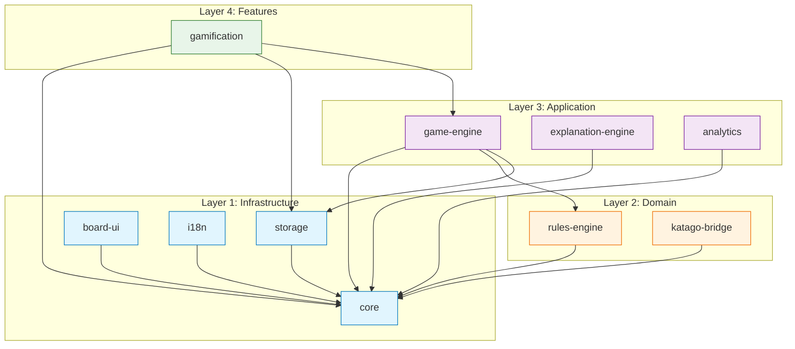

# Step 6: 시스템 아키텍처 설계 — 바둑 플랫폼 Modular Monolith

**Version**: 1.0.0
**Author**: @architect (Step 6)
**Date**: 2026-03-11
**Consumers**: Step 7 (schema-designer), Step 8 (strategy-planner), Step 10 (scaffold teams), Step 11 (rules-engineer, data-engineer), Step 12 (katago-integrator), Step 13 (template-engineer)
**Inputs**: Step 1 (기술 검증), Step 2 (KataGo IPC 명세), Step 3 (도메인 지식), Step 4 (템플릿 엔진 설계)

---

## 목차

1. [아키텍처 개요](#1-architecture-overview)
2. [모듈 카탈로그](#2-module-catalog)
3. [모듈 의존성 DAG](#3-module-dependency-dag)
4. [Ports/Adapters 경계](#4-ports-adapters-boundaries)
5. [Tauri Command Surface](#5-tauri-command-surface)
6. [병렬 개발 가능성](#6-parallel-development-feasibility)
7. [Step 1 제약사항 통합](#7-step-1-constraints-integration)
8. [파이프라인 연결 (Steps 7, 8, 10, 11)](#8-pipeline-connections)
9. [설계 결정 근거 로그](#9-decision-rationale-log)
10. [검증 체크리스트](#10-verification-checklist)
11. [pACS 자기 평가](#11-pacs-self-rating)

---

## 1. 아키텍처 개요

### 1.1 아키텍처 스타일: Modular Monolith

바둑 플랫폼은 단일 Tauri 2.0 데스크톱 앱 프로세스 내에서 실행되는 **Modular Monolith**이다. 이는 다음을 의미한다:

- **단일 배포 단위**: 하나의 `.dmg` / `.msi` / `.AppImage` 설치 파일.
- **디렉터리 구조와 TypeScript 모듈 시스템으로 모듈 경계 적용**: 각 모듈은 `src/` 아래 디렉터리이며 명시적 공개 API(`index.ts`)를 가진다.
- **마이크로서비스 없음**: 모든 모듈이 Tauri 웹뷰 내에서 동일한 Node.js 런타임을 공유한다. 유일한 별도 OS 프로세스는 Tauri sidecar로 관리되는 KataGo뿐이다.
- **통신**: 모듈 간 통신은 타입이 지정된 인터페이스(ports)를 통하며, 다른 모듈의 내부에 직접 접근하지 않는다.

**근거**: 데스크톱 앱에는 Modular Monolith가 올바른 선택이다. (1) 모듈 간 네트워크가 없고, (2) 배포가 원자적이며, (3) 모든 상태가 로컬이고, (4) 팀(AI 에이전트)이 모듈 경계 전반에 걸친 컴파일 타임 타입 검사의 이점을 누리기 때문이다. 마이크로서비스는 단일 머신 앱에 이점이 전혀 없으면서 IPC 오버헤드와 배포 복잡성만 추가한다.

### 1.2 모놀리스 내 계층형 아키텍처

모듈은 네 개 레이어로 구성된다. 의존성은 아래 방향으로만 흐른다.

```
+------------------------------------------------------------------+
|  Layer 4: FEATURES (user-facing compositions)                     |
|  [onboarding] [gamification] [review-panel]                       |
+------------------------------------------------------------------+
         |                    |                    |
+------------------------------------------------------------------+
|  Layer 3: APPLICATION (orchestration, state, commands)            |
|  [game-engine] [explanation-engine] [analytics]                   |
+------------------------------------------------------------------+
         |                    |                    |
+------------------------------------------------------------------+
|  Layer 2: DOMAIN (business logic, pure functions)                 |
|  [rules-engine] [katago-bridge]                                   |
+------------------------------------------------------------------+
         |                    |                    |
+------------------------------------------------------------------+
|  Layer 1: INFRASTRUCTURE (shared types, storage, i18n, UI)       |
|  [core] [storage] [board-ui] [i18n]                               |
+------------------------------------------------------------------+
```

**레이어 규칙**:
- Layer N은 Layer N-1 이하에만 의존할 수 있으며, 상위 레이어에는 절대 의존할 수 없다.
- 동일 레이어 내에서 모듈 간 의존은 DAG(섹션 3)에 명시적으로 문서화되고 순환을 형성하지 않는 경우에만 허용된다.
- `core` 모듈은 리프 의존성이다(모든 모듈이 의존하지만, 자체적으로는 아무것에도 의존하지 않는다).

### 1.3 외부 프로세스

아키텍처에 존재하는 외부 프로세스는 단 하나뿐이다:

| 프로세스 | 바이너리 | 통신 | 생명주기 소유자 |
|---------|--------|------|--------------|
| KataGo 분석 엔진 | `katago-{target_triple}` sidecar | stdin/stdout JSON-line 프로토콜 | `katago-bridge` 모듈 |

Tauri Rust 백엔드는 얇은 프록시 역할을 한다: sidecar를 생성하고 Tauri commands를 노출한다. 프론트엔드 모듈은 이 commands를 호출한다. `katago-bridge` 모듈은 모든 KataGo 상호작용을 `IKatagoBridge` 포트 인터페이스 뒤에 캡슐화한다.

---

## 2. 모듈 카탈로그

### 2.1 요약 테이블

| # | 모듈 | 레이어 | 목적 | 의존성 | 소유 Tauri Commands |
|---|------|--------|------|--------|-------------------|
| 1 | `core` | 1 (Infra) | 공유 타입, 상수, 유틸리티 | 없음 | 0 |
| 2 | `storage` | 1 (Infra) | Tauri commands를 통한 SQLite 접근, Drizzle ORM, 데이터 영속화 | `core` | 6 |
| 3 | `board-ui` | 1 (Infra) | SVG 바둑판 렌더링, Shudan 포크, 돌 상호작용 | `core` | 0 |
| 4 | `i18n` | 1 (Infra) | 국제화 (en/ko/ja) | `core` | 1 |
| 5 | `rules-engine` | 2 (Domain) | Tromp-Taylor 규칙, 따냄, 패, 계가, Zobrist 해싱 | `core` | 0 |
| 6 | `katago-bridge` | 2 (Domain) | KataGo sidecar 생명주기, IPC, GPU 감지, 서킷 브레이커 | `core` | 7 |
| 7 | `game-engine` | 3 (App) | GameReducer (Zustand), 게임 흐름, 타이머, 수순 기록, AI 대국 | `core`, `rules-engine`, `storage` | 6 |
| 8 | `explanation-engine` | 3 (App) | 템플릿 매칭, 3단계 생성, 패턴 카탈로그 | `core`, `katago-bridge` | 3 |
| 9 | `analytics` | 3 (App) | PostHog 이벤트, Sentry 오류 추적 | `core` | 2 |
| 10 | `gamification` | 4 (Feature) | 퀘스트, 레벨, 연속 기록, 배지 | `core`, `storage`, `game-engine` | 4 |

**합계**: 10개 모듈, 29개 Tauri commands.

### 2.2 상세 모듈 정의

---

#### Module 1: `core`

**디렉터리**: `src/core/`
**레이어**: 1 (Infrastructure)
**목적**: 모든 공유 TypeScript 타입, 상수, 열거형, 무상태 유틸리티 함수의 단일 소스 오브 트루스(Single Source of Truth).

**책임 범위**:
- 바둑판 기하 타입 (`BoardSize`, `Intersection`, `CellState`, `Player`)
- 게임 흐름 타입 (`MoveRecord`, `GameState`, `GameResult`, `GamePhase`)
- KataGo 타입 (`AnalysisQuery`, `AnalysisResponse`, `MoveInfo`, `RootInfo`) (Step 2 IPC 명세 기반)
- 계가 타입 (`ScoreResult`)
- 템플릿 타입 (`PatternId`, `Tier`, `PositionCategory`, `ExplanationOutput`)
- 게이미피케이션 타입 (`Quest`, `Badge`, `PlayerLevel`, `Streak`)
- GTP 좌표 유틸리티 (`indexToGTP`, `gtpToIndex`, `columnToLetter`)
- 오류 타입 계층 (`AppError`, `KataGoError`, `RulesError`, `StorageError`)
- 상수 (`BOARD_SIZES`, `DEFAULT_KOMI`, `KATAGO_TIMEOUTS`, Step 4의 임계값)

**Public Ports**: 해당 없음 (이 모듈은 타입과 순수 유틸리티 함수만 내보냄)
**Required Ports**: 없음
**Tauri Commands**: 없음
**Dependencies**: 없음

**근거**: 전용 `core` 모듈은 공유 타입으로 인한 순환 의존성을 방지한다. 다른 모든 모듈이 `core`에 의존하지만, `core`는 아무것에도 의존하지 않는다. 이는 Modular Monolith에서의 표준 "shared kernel" 패턴이다.

---

#### Module 2: `storage`

**디렉터리**: `src/storage/`
**레이어**: 1 (Infrastructure)
**목적**: 모든 SQLite 데이터베이스 접근, Drizzle ORM 스키마, 마이그레이션, 데이터 영속화 작업.

**책임 범위**:
- Drizzle ORM 스키마 정의 (Step 7의 6개 테이블)
- 마이그레이션 관리
- CRUD 작업: `games`, `moves`, `players`, `settings`, `quests`, `achievements`
- SQLite 트랜잭션을 이용한 추가 전용(append-only) 수순 로그
- SGF 내보내기 유틸리티
- WAL 모드 설정
- 게임 저장/불러오기 작업

**Public Ports (공개 인터페이스)**:

```typescript
interface IStoragePort {
  // Game persistence
  saveGame(game: GameRecord): Promise<string>;         // returns gameId
  loadGame(gameId: string): Promise<GameRecord | null>;
  listGames(filter: GameFilter): Promise<GameSummary[]>;
  deleteGame(gameId: string): Promise<void>;

  // Move log (append-only)
  appendMove(gameId: string, move: MoveRecord): Promise<void>;
  getMoves(gameId: string): Promise<MoveRecord[]>;

  // Settings
  getSetting<T>(key: string): Promise<T | null>;
  setSetting<T>(key: string, value: T): Promise<void>;

  // Player profile
  getPlayerProfile(): Promise<PlayerProfile>;
  updatePlayerProfile(update: Partial<PlayerProfile>): Promise<void>;

  // SGF export
  exportSGF(gameId: string): Promise<string>;          // returns SGF string

  // Gamification data
  getQuests(date: string): Promise<Quest[]>;
  completeQuest(questId: string): Promise<QuestReward>;
  getAchievements(): Promise<Achievement[]>;
  unlockAchievement(achievementId: string): Promise<void>;
  getStreak(): Promise<StreakData>;
  updateStreak(): Promise<StreakData>;
}
```

**Required Ports**: 없음 (리프 모듈; 모든 DB 접근은 Tauri Rust commands를 경유)
**Dependencies**: `core`

**소유 Tauri Commands** (6):
- `storage_save_game`
- `storage_load_game`
- `storage_list_games`
- `storage_delete_game`
- `storage_get_setting`
- `storage_set_setting`

**근거**: Step 1에서 SQLite는 웹뷰 내 `better-sqlite3`가 아닌 Rust 측 `rusqlite`를 Tauri commands로 노출하여 접근해야 한다고 검증했다(Option B). `storage` 모듈은 Tauri command 호출을 `IStoragePort` 인터페이스 뒤에 감싼다. Drizzle ORM 스키마 정의는 마이그레이션 생성을 위해 이 모듈에 존재하지만, 런타임 쿼리는 Tauri commands를 통해 Rust로 전달된다. 이 결정은 네이티브 애드온 크로스플랫폼 이슈를 회피한다(Step 1 제약사항 #7).

---

#### Module 3: `board-ui`

**디렉터리**: `src/board-ui/`
**레이어**: 1 (Infrastructure)
**목적**: 모든 바둑판 렌더링, 돌 시각화, 집 마커, 분석 오버레이, 사용자 상호작용(클릭, 터치, 호버).

**책임 범위**:
- SVG 바둑판 렌더링 (React 컴포넌트)
- Shudan 포크: 18개 고전적 바둑판 컴포넌트 + 커스텀 추가
- 돌 놓기 상호작용 (클릭 배치, 터치 시 미리보기-확인)
- 집 시각화 오버레이 (KataGo 데이터 기반 소유권 히트맵)
- 수순 마커 오버레이 (마지막 수, 변화도, 번호 매김)
- KaTrain 색 체계 구현 (초록-파랑-노랑-주황-빨강)
- 바둑판 좌표 라벨
- 반응형 크기 조정 (9x9, 13x13, 19x19)
- `@use-gesture`를 통한 핀치 줌 지원

**주요 React 컴포넌트** (20):
1. `GoBoard` (루트 컨테이너)
2. `BoardGrid` (SVG 격자선)
3. `StarPoints` (화점)
4. `Coordinates` (A-T, 1-19 라벨)
5. `StoneLayer` (전체 돌)
6. `Stone` (단일 돌, 흑/백)
7. `LastMoveMarker`
8. `GhostStone` (호버 미리보기)
9. `TerritoryMarker` (계가 오버레이)
10. `OwnershipHeatmap` (KataGo 소유권)
11. `MoveNumber` (복기용 번호 돌)
12. `VariationArrow` (주변화 시각화)
13. `CapturedStonesCounter`
14. `BoardSizeSelector`
15. `PlayerInfoPanel`
16. `TimerDisplay`
17. `WinRateGraph` (Recharts 연동)
18. `WinRateBar` (인라인 간략 표시)
19. `ExplanationCard` (템플릿 엔진 출력)
20. `AnalysisPanel` (후보 수 목록)

**Public Ports**: 해당 없음 (React 컴포넌트를 내보냄; 소비자가 가져와서 조합)
**Required Ports**: 없음 (React props를 통해 데이터 수신)
**Dependencies**: `core`
**Tauri Commands**: 없음 (순수 React 렌더링)

**근거**: 바둑판 UI는 모든 데이터를 React props로 받는 리프 모듈이다. 비즈니스 로직, 상태 관리, 부수 효과가 없다. 따라서 독립적으로 개발 및 테스트 가능하며(필요 시 Storybook 활용), Shudan 포크는 이 모듈 내에 완전히 격리된다.

---

#### Module 4: `i18n`

**디렉터리**: `src/i18n/`
**레이어**: 1 (Infrastructure)
**목적**: 국제화 설정, 번역 리소스, 언어 전환.

**책임 범위**:
- i18next 설정 및 초기화
- react-i18next 프로바이더 설정
- 번역 리소스 파일 (로케일별 JSON 네임스페이스: en, ko, ja)
- 언어 감지 및 영속화
- 로케일별 바둑 전문 용어 사전

**Public Ports**:

```typescript
interface II18nPort {
  getCurrentLocale(): string;
  changeLocale(locale: 'en' | 'ko' | 'ja'): Promise<void>;
  t(key: string, options?: Record<string, unknown>): string;
}
```

**Required Ports**: 없음
**Dependencies**: `core`
**소유 Tauri Commands** (1):
- `i18n_get_system_locale` (Rust 측 OS 로케일 감지)

**근거**: i18n은 모든 UI 관련 모듈이 공유하는 인프라이다. 중앙 집중화하면 번역 로직이 분산되는 것을 방지한다. `i18n_get_system_locale` Tauri command는 초기 설정을 위해 OS 언어 기본 설정을 감지한다(Step 1에서 react-i18next v16이 React 19에서 동작함을 확인).

---

#### Module 5: `rules-engine`

**디렉터리**: `src/engine/rules/`
**레이어**: 2 (Domain)
**목적**: Tromp-Taylor 규칙, 바둑판 조작, 따냄 메커니즘, 패/초과패(superko) 감지, 중국식 계가, Zobrist 해싱의 순수 구현.

**책임 범위**:
- 바둑판 생성 및 조작 (1D Uint8Array, Step 3 섹션 3)
- 유효성 검증 포함 돌 놓기 (Step 3 Rule 7)
- 따냄 감지 및 실행 (Step 3 Rules 3-4)
- 자충 감지 및 실행 (Step 3 Rule 7, step 3)
- 단순 패 감지 최적화 (Step 3 섹션 4.7)
- Zobrist 해싱을 통한 위치적 초과패 (Step 3 섹션 4-5)
- 중국식 계가 알고리즘 (Step 3 섹션 5)
- 착수 적법성 검증
- 무리 탐색 (BFS/DFS, 연결 성분 분석)
- 활로 계산
- 사전 계산된 인접 테이블
- Step 3 섹션 6의 20개 엣지 케이스 전부

**점진적 빌드 순서** (Step 3 섹션 7 기반):
1. Stage 1: Place (Rules 1, 2, 5-partial, 7-step-1)
2. Stage 2: Capture (Rules 3, 4, 7-steps-2-3)
3. Stage 3: Ko (Rule 6 -- 단순 패 최적화)
4. Stage 4: Scoring (Rules 9, 10)
5. Stage 5: Superko (Rule 6 -- 전체 위치적 초과패)
6. Stage 6: Game Flow (Rules 5, 8, 10)

**Public Ports (공개 인터페이스)**:

```typescript
interface IRulesEngine {
  // Board creation
  createBoard(size: BoardSize): BoardState;

  // Move validation
  isLegalMove(state: GameState, index: number): boolean;
  getLegalMoves(state: GameState): number[];

  // Move execution (returns new state; original is unchanged — immutable)
  applyMove(state: GameState, index: number): GameState;
  applyPass(state: GameState): GameState;

  // Scoring
  computeScore(board: BoardState, komi: number): ScoreResult;

  // Game flow
  isGameOver(state: GameState): boolean;

  // Utilities
  getGroup(board: BoardState, index: number): Group;
  getLiberties(board: BoardState, group: Group): Set<number>;
  getTerritory(board: BoardState): TerritoryMap;
}
```

**Required Ports**: 없음 (순수 함수만; 외부 의존성 없음)
**Dependencies**: `core`
**Tauri Commands**: 없음 (웹뷰 JavaScript 컨텍스트에서 전적으로 실행)

**설계 결정: 왜 Rust 측이 아닌가?**
규칙 엔진은 Rust가 아닌 웹뷰 내 TypeScript에서 실행된다. 근거:
1. **성능이 충분함**: 19x19 바둑판은 361개 교차점을 가진다. BFS 기반 착수 유효성 검증은 JavaScript에서 1ms 미만이다. Rust를 사용할 성능적 정당성이 없다.
2. **개발 속도**: TypeScript가 모든 프론트엔드 로직의 주 언어이다. 규칙 엔진을 TypeScript로 유지하면 하나의 언어, 하나의 테스트 프레임워크(Vitest), 하나의 디버깅 환경을 사용한다.
3. **테스트 용이성**: Vitest가 순수 TypeScript 함수를 직접 테스트할 수 있다. Rust 측 규칙은 테스트를 위해 Tauri command 왕복이 필요하다.
4. **Step 11 병렬성**: rules-engine과 data-layer 에이전트 모두 TypeScript로 작업하며, FFI 경계 없이 동일한 `core` 타입을 공유한다.

**예외**: 프로파일링에서 성능 이슈가 발견되면(가능성 낮음), 핫 패스(Zobrist 해시 계산)를 Rust Tauri command로 이전할 수 있다. `IRulesEngine` 포트 인터페이스가 이를 소비자에게 투명하게 만든다.

---

#### Module 6: `katago-bridge`

**디렉터리**: `src/engine/katago/`
**레이어**: 2 (Domain)
**목적**: KataGo sidecar 프로세스와의 모든 상호작용: 생명주기 관리, 쿼리/응답 IPC, GPU 백엔드 감지, 상태 모니터링, 서킷 브레이커, 방문 횟수 티어 보정.

**책임 범위**:
- KataGo sidecar 프로세스 생성 및 종료 (Step 2 섹션 7.2, 7.6)
- GPU 백엔드 감지 기반 바이너리 선택 (Step 2 섹션 6.3)
- 분석 엔진 JSON-line 프로토콜 (Step 2 섹션 3-4)
- 우선순위 지원 쿼리 큐 관리
- 응답 연관(id 기반) 및 디스패칭
- 감시자(Watchdog): 크래시 감지, 행 감지, stderr 모니터링 (Step 2 섹션 7.4)
- 서킷 브레이커: 10분 윈도우 내 5회 실패, 지수적 백오프 (Step 2 섹션 7.5)
- 상태 머신: Idle -> Starting -> Ready -> Analyzing -> Degraded -> Failed -> Restarting -> Fallback (Step 2 섹션 7.1)
- 하드웨어 벤치마크 기반 방문 횟수 티어 보정 (Step 2 섹션 9.3)
- NN 모델 경로 해석 및 검증
- OpenCL 최초 실행 튜닝 감지
- 분석 요청/응답 타입 마샬링
- 쿼리 취소를 위한 `terminate` / `terminate_all`

**Public Ports (공개 인터페이스)**:

```typescript
interface IKatagoBridge {
  // Lifecycle
  initialize(config: KataGoConfig): Promise<void>;
  shutdown(): Promise<void>;
  getStatus(): KataGoStatus;  // Idle|Starting|Ready|Analyzing|Degraded|Failed|Fallback

  // Analysis
  analyze(query: AnalysisQuery): Promise<AnalysisResponse>;
  analyzeMultiple(query: BatchAnalysisQuery): Promise<AnalysisResponse[]>;
  cancelAnalysis(queryId: string): Promise<void>;
  cancelAll(): Promise<void>;

  // Configuration
  getVisitsTiers(): VisitsTierConfig;
  calibrateVisitsTiers(): Promise<VisitsTierConfig>;
  getBackendInfo(): BackendInfo;

  // Health
  isHealthy(): boolean;
  getCircuitBreakerState(): CircuitBreakerState;

  // Version and model info
  queryVersion(): Promise<VersionInfo>;
  queryModels(): Promise<ModelInfo[]>;
}
```

**Required Ports**: TypeScript 레벨에서 없음 (Tauri shell commands를 통해 KataGo와 통신)
**Dependencies**: `core`

**소유 Tauri Commands** (7):
- `katago_initialize` (sidecar 생성, query_version으로 확인)
- `katago_shutdown` (정상 종료)
- `katago_analyze` (분석 쿼리 전송, 응답 반환)
- `katago_cancel` (특정 쿼리 종료)
- `katago_cancel_all` (모든 쿼리 종료)
- `katago_get_status` (현재 생명주기 상태)
- `katago_detect_backend` (GPU 감지 알고리즘, 최적 바이너리 이름 반환)

**어댑터 전략**:
- **운영(Production)**: `KataGoSidecarAdapter` -- Tauri `shell.sidecar()`를 통한 실제 KataGo 바이너리
- **테스트(Testing)**: `MockKataGoAdapter` -- 결정적 테스트를 위해 미리 기록된 분석 응답 반환
- **개발(Development)**: `StubKataGoAdapter` -- 설정 가능한 지연과 함께 합성 응답 반환

**근거**: KataGo 통신은 Rust 측 프로세스 관리(Tauri shell 플러그인)를 필요로 한다. TypeScript `katago-bridge` 모듈은 깔끔한 비동기 API를 제공한다. Rust 측은 원시 프로세스 I/O(stdin/stdout 파이핑, stderr 소비, 프로세스 모니터링)를 처리한다. TypeScript 측은 쿼리 구성, 응답 파싱, 서킷 브레이커 로직, 큐 관리를 처리한다.

---

#### Module 7: `game-engine`

**디렉터리**: `src/engine/game/`
**레이어**: 3 (Application)
**목적**: 게임 세션 오케스트레이션, Zustand 상태 관리(GameReducer), 타이머, 수순 기록, AI 대국 연동, 게임 생명주기 관리.

**책임 범위**:
- GameReducer (Zustand store): 중앙 게임 상태 관리
- 게임 생성 (바둑판 크기, 덤, 시간 제어, 플레이어)
- 수순 처리: `IRulesEngine`으로 유효성 검증, 적용, 상태 갱신, 분석 트리거
- 패스 및 기권 처리
- 타이머 관리 (기본 시간 + 초읽기)
- AI 대국: `IKatagoBridge`에 수 요청, 게임에 적용
- 복기 모드 수순 탐색(뒤로/앞으로)
- 게임 생명주기: 생성 -> 대국 -> 종료 -> 계가 -> 저장
- 게임 모드 관리: AI 대국, 복기, 튜토리얼
- 실행 취소/재실행 지원 (복기/튜토리얼 모드용)

**Public Ports (공개 인터페이스)**:

```typescript
interface IGameEngine {
  // Game lifecycle
  createGame(config: GameConfig): GameSession;
  getCurrentGame(): GameSession | null;
  endGame(): Promise<GameResult>;
  resignGame(player: Player): GameResult;

  // Moves
  playMove(index: number): PlayMoveResult;
  playPass(): PlayMoveResult;
  requestAIMove(): Promise<PlayMoveResult>;

  // Timer
  getTimerState(): TimerState;
  pauseTimer(): void;
  resumeTimer(): void;

  // Review mode
  goToMove(moveNumber: number): void;
  goForward(): void;
  goBack(): void;
  goToStart(): void;
  goToEnd(): void;

  // State subscription (Zustand)
  subscribe(selector: (state: GameState) => unknown, listener: () => void): () => void;
  getState(): GameState;
}
```

**Required Ports**:
- `IRulesEngine` (착수 유효성 검증, 계가)
- `IStoragePort` (게임 영속화)

**Dependencies**: `core`, `rules-engine`, `storage`
**소유 Tauri Commands** (6):
- `game_create` (새 게임 세션 생성)
- `game_play_move` (교차점에 돌 놓기)
- `game_play_pass` (차례 패스)
- `game_resign` (기권)
- `game_load` (저장된 게임 복기용 불러오기)
- `game_export_sgf` (현재 게임을 SGF로 내보내기)

**근거**: 게임 엔진은 게임 흐름의 중앙 오케스트레이터이다. 적법성과 계가를 위해 `rules-engine`에, 영속화를 위해 `storage`에 의존한다. `katago-bridge`에는 직접 의존하지 **않는다**. 대신 UI 레이어(또는 기능 모듈)가 `game-engine`과 `katago-bridge` 사이를 조율한다. 이를 통해 게임 엔진을 KataGo 프로세스 없이도 테스트할 수 있다.

**설계 결정: game-engine은 katago-bridge에 의존하지 않는다.**
game-engine은 로컬 게임 상태(바둑판, 수순, 타이머)를 관리한다. AI 수 생성과 분석은 기능 레이어에서 트리거되며, `IGameEngine.playMove()`와 `IKatagoBridge.analyze()`를 순차적으로 호출한다. 이 분리의 의미:
1. game-engine은 `IRulesEngine`과 `IStoragePort`만으로 테스트 가능하다(둘 다 쉽게 목 가능).
2. game-engine은 KataGo 없이 오프라인으로 동작한다(저장된 게임 복기).
3. AI 수 요청은 기능 레이어를 경유하므로, 로딩 상태를 표시하고 KataGo 장애를 우아하게 처리할 수 있다.

---

#### Module 8: `explanation-engine`

**디렉터리**: `src/engine/explanation/`
**레이어**: 3 (Application)
**목적**: Step 4에서 설계한 템플릿 매칭 파이프라인을 사용하여 KataGo 분석 응답을 사람이 읽을 수 있는 설명으로 변환.

**책임 범위**:
- KataGo 필드 추출 (Step 4 섹션 3)
- 계산 필드 도출: `winrateDelta`, `scoreLeadDelta`, `bestMovePlayed`, `moveRank`, `topMoveGap`, `movePhase`, `confidenceLevel` (Step 4 섹션 3.1.3)
- 관점 처리: currentPlayer 기준 값 (Step 4 섹션 3.3)
- 패턴 분류 파이프라인: 6단계 우선순위 체인 (Step 4 섹션 4.1)
- 국면 유형 감지: 사활, 패, 빅, 국면 단계 (Step 4 섹션 4.2)
- 템플릿 선택 및 슬롯 바인딩 (Step 4 섹션 5.2-5.3)
- 사활, 패, 빅에 대한 필수 폴백 적용 (Step 4 섹션 6)
- 3단계 렌더링: 초급, 중급, 고급 (Step 4 섹션 5.1)
- L3 출력 검증 (Step 4 섹션 9.3)
- 다중 패턴 합성 (주요 + 최대 2개 보조) (Step 4 섹션 4.3)
- 90개 패턴 카탈로그 관리 (티어별 30개, Step 4 섹션 5.4)

**Public Ports (공개 인터페이스)**:

```typescript
interface IExplanationEngine {
  // Core explanation generation
  explain(
    current: AnalysisResponse,
    previous: AnalysisResponse | null,
    actualMove: GTPLocation | null,
    tier: Tier,
    turnNumber: number,
    boardSize: BoardSize
  ): ExplanationOutput;

  // Pattern catalog management
  getPatternCatalog(): PatternCatalog;
  getCoverageStats(): CoverageStats;

  // Configuration
  setDefaultTier(tier: Tier): void;
  getDefaultTier(): Tier;
}
```

**Required Ports**:
- `IKatagoBridge` (현재 및 이전 국면에 대한 분석 요청)

참고: 설명 엔진은 원시 KataGo 프로세스가 아닌 `AnalysisResponse` 객체를 입력으로 받는다. 호출 코드(기능 레이어 또는 Tauri command 핸들러)가 `IKatagoBridge`에서 분석을 얻어 `IExplanationEngine.explain()`에 전달한다. 따라서 `katago-bridge`에 대한 의존성은 런타임 호출 의존성이 아닌 **타입 의존성**이다(`core`에 정의된 응답 타입을 사용). 다만, 설명 엔진이 KataGo에서 비롯된 분석 데이터 없이는 기능할 수 없으므로 아키텍처적으로는 의존성으로 모델링한다.

**정정**: 추가 분석 결과, 설명 엔진은 `core` 타입(`AnalysisResponse`가 정의된 곳)에만 의존한다. 분석 데이터를 함수 매개변수로 받으며, `IKatagoBridge` 메서드를 직접 호출하지 **않는다**. 따라서:

**Dependencies**: `core` (만 해당)
**소유 Tauri Commands** (3):
- `explanation_generate` (국면에 대한 설명 생성)
- `explanation_set_tier` (기본 설명 계층 설정)
- `explanation_get_tier` (현재 설명 계층 조회)

**근거**: 설명 엔진은 순수 변환 함수이다: `AnalysisResponse -> ExplanationOutput`. KataGo를 직접 호출할 필요가 없다. 호출자(기능 레이어)가 분석 데이터를 제공한다. 이를 통해 설명 엔진을 Step 2의 예제 응답 픽스처 데이터로 독립적으로 테스트할 수 있다. Step 4 설계서에서 엔진이 "KataGo JSON만"을 입력으로 받는다고 명시적으로 기술하고 있으며, 이는 함수 시그니처로 강제된다.

---

#### Module 9: `analytics`

**디렉터리**: `src/analytics/`
**레이어**: 3 (Application)
**목적**: 텔레메트리 이벤트 추적(PostHog) 및 오류 보고(Sentry), 둘 다 사용자 동의 기반(opt-in).

**책임 범위**:
- PostHog 이벤트 추적 (opt-in 사용자 분석)
- Sentry 크래시 보고 및 오류 추적
- 이벤트 스키마 정의 (표준화된 이벤트 이름 및 속성)
- 사용자 동의 관리 (GDPR/프라이버시)
- 오프라인 이벤트 큐잉 (오프라인 시 버퍼링, 연결 시 플러시)
- 세션 추적

**Public Ports (공개 인터페이스)**:

```typescript
interface IAnalyticsPort {
  // Event tracking
  trackEvent(name: string, properties?: Record<string, unknown>): void;
  trackPageView(pageName: string): void;

  // Error reporting
  captureError(error: Error, context?: Record<string, unknown>): void;
  captureMessage(message: string, level: 'info' | 'warning' | 'error'): void;

  // Consent
  setConsent(granted: boolean): void;
  getConsent(): boolean;

  // Lifecycle
  initialize(config: AnalyticsConfig): Promise<void>;
  flush(): Promise<void>;
}
```

**Required Ports**: 없음
**Dependencies**: `core`
**소유 Tauri Commands** (2):
- `analytics_set_consent` (동의 기본 설정 영속화)
- `analytics_get_consent` (동의 상태 조회)

**어댑터 전략**:
- **운영(Production)**: `PostHogSentryAdapter` -- 실제 PostHog SDK + Sentry SDK
- **개발(Development)**: `ConsoleAnalyticsAdapter` -- 콘솔에 이벤트 로깅
- **테스트(Testing)**: `NoOpAnalyticsAdapter` -- 모든 이벤트를 묵묵히 폐기

**근거**: 분석은 직교적 관심사이다. `IAnalyticsPort` 뒤에 격리함으로써 다른 모듈이 PostHog나 Sentry를 알 필요가 없다. 어댑터 패턴은 벤더 전환(예: PostHog에서 Mixpanel로)이 정확히 하나의 파일 변경만 요구함을 의미한다. PostHog와 Sentry 모두 Tauri 웹뷰에서 동작하는 클라이언트 측 SDK이다(Step 1 리스크: LOW).

---

#### Module 10: `gamification`

**디렉터리**: `src/features/gamification/`
**레이어**: 4 (Feature)
**목적**: 퀘스트 시스템, XP/레벨, 연속 기록, 배지, 업적 추적.

**책임 범위**:
- 일일 퀘스트 생성 및 완료 추적
- XP 계산 및 레벨업 로직
- 연속 기록 추적 (연속 플레이 일수)
- 배지/업적 정의 및 해금 로직
- 퀘스트 보상 분배
- 진행도 시각화 데이터

**Public Ports (공개 인터페이스)**:

```typescript
interface IGamificationService {
  // Quests
  getDailyQuests(): Promise<Quest[]>;
  completeQuest(questId: string): Promise<QuestReward>;
  refreshQuests(): Promise<Quest[]>;

  // Levels
  getPlayerLevel(): Promise<PlayerLevel>;
  addXP(amount: number, source: XPSource): Promise<LevelUpResult | null>;

  // Streaks
  getStreak(): Promise<StreakData>;
  recordDailyActivity(): Promise<StreakData>;

  // Badges
  getAchievements(): Promise<Achievement[]>;
  checkAndUnlockAchievements(event: GameEvent): Promise<Achievement[]>;
}
```

**Required Ports**:
- `IStoragePort` (퀘스트 진행도, XP, 연속 기록, 배지 영속화)
- `IGameEngine` (게임 이벤트 구독: 게임 완료, 착수 등)

**Dependencies**: `core`, `storage`, `game-engine`
**소유 Tauri Commands** (4):
- `gamification_get_quests` (완료 상태 포함 일일 퀘스트 목록)
- `gamification_complete_quest` (퀘스트 완료 처리, 보상 분배)
- `gamification_get_progress` (플레이어 레벨, XP, 연속 기록, 배지)
- `gamification_check_achievements` (새 업적 확인 및 해금)

**근거**: 게이미피케이션은 하위 레이어 서비스를 조합하는 기능 모듈이다. 영속화를 위해 `storage`에, 게임 이벤트(퀘스트 완료 트리거 감지, 예: "Quick Go 게임 1판 플레이")를 위해 `game-engine`에 의존한다. 정확히 3개의 의존성을 가지며, 5개 의존성 제한을 충분히 하회한다.

---

### 2.3 모듈-디렉터리 매핑

```
src/
  core/                          # Module 1: core
    types/
      board.ts                   # BoardState, BoardSize, CellState, Player
      game.ts                    # GameState, GameResult, MoveRecord, GamePhase
      katago.ts                  # AnalysisQuery, AnalysisResponse, MoveInfo, RootInfo
      scoring.ts                 # ScoreResult, TerritoryMap
      explanation.ts             # ExplanationOutput, PatternId, Tier, PositionCategory
      gamification.ts            # Quest, Badge, PlayerLevel, Streak
      errors.ts                  # AppError hierarchy
    utils/
      gtp.ts                     # GTP coordinate conversion
      math.ts                    # Clamp, lerp, percentage formatting
    constants.ts                 # All threshold values, board sizes, defaults
    index.ts                     # Public API barrel export

  storage/                       # Module 2: storage
    schema/
      tables.ts                  # Drizzle ORM table definitions
      migrations/                # Generated migration SQL files
    adapters/
      tauri-storage-adapter.ts   # Production: calls Tauri commands
      memory-storage-adapter.ts  # Testing: in-memory Map-based
    ports/
      storage-port.ts            # IStoragePort interface
    index.ts

  board-ui/                      # Module 3: board-ui
    components/
      GoBoard.tsx
      BoardGrid.tsx
      Stone.tsx
      ... (18 more components)
    hooks/
      useBoardInteraction.ts
      useBoardSize.ts
    index.ts

  i18n/                          # Module 4: i18n
    locales/
      en/                        # English translations
      ko/                        # Korean translations
      ja/                        # Japanese translations
    config.ts                    # i18next initialization
    ports/
      i18n-port.ts               # II18nPort interface
    index.ts

  engine/
    rules/                       # Module 5: rules-engine
      board.ts                   # Board creation, adjacency table
      capture.ts                 # Capture detection and execution
      ko.ts                      # Simple ko optimization
      superko.ts                 # Zobrist hashing, positional superko
      scoring.ts                 # Chinese scoring algorithm
      game-flow.ts               # Pass handling, game termination
      validation.ts              # Move legality checking
      ports/
        rules-engine-port.ts     # IRulesEngine interface
      index.ts

    katago/                      # Module 6: katago-bridge
      adapters/
        katago-sidecar-adapter.ts   # Production: real KataGo sidecar
        mock-katago-adapter.ts      # Testing: pre-recorded responses
        stub-katago-adapter.ts      # Development: synthetic responses
      lifecycle/
        state-machine.ts         # KataGo process state machine
        circuit-breaker.ts       # Circuit breaker implementation
        watchdog.ts              # Crash/hang detection
      ipc/
        query-builder.ts         # AnalysisQuery construction
        response-parser.ts       # JSON-line response parsing
        queue-manager.ts         # Priority queue for queries
      detection/
        gpu-detector.ts          # GPU backend detection algorithm
        benchmark.ts             # Hardware benchmark and tier calibration
      ports/
        katago-bridge-port.ts    # IKatagoBridge interface
      index.ts

    game/                        # Module 7: game-engine
      game-reducer.ts            # Zustand store (GameReducer)
      timer.ts                   # Time control management
      ai-opponent.ts             # AI move request coordination
      game-session.ts            # Game session management
      review-mode.ts             # Move history navigation
      ports/
        game-engine-port.ts      # IGameEngine interface
      index.ts

    explanation/                  # Module 8: explanation-engine
      classifier/
        pattern-classifier.ts    # 6-priority pattern matching
        category-detector.ts     # Position category detection (life/death, ko, seki, phase)
      templates/
        template-renderer.ts     # Slot binding and text generation
        mandatory-templates.ts   # Pre-authored life/death, ko, seki templates
        pattern-catalog.ts       # 90-pattern catalog data
      pipeline/
        field-extractor.ts       # KataGo field extraction
        delta-computer.ts        # winrateDelta, scoreLeadDelta computation
        perspective-handler.ts   # Current-player-relative adjustments
        output-validator.ts      # L3 validation (numbers trace to KataGo)
        tier-adapter.ts          # Beginner/Intermediate/Advanced formatting
      ports/
        explanation-engine-port.ts  # IExplanationEngine interface
      index.ts

  analytics/                     # Module 9: analytics
    adapters/
      posthog-sentry-adapter.ts  # Production adapter
      console-adapter.ts         # Development adapter
      noop-adapter.ts            # Testing adapter
    events/
      event-schema.ts            # Standardized event definitions
    ports/
      analytics-port.ts          # IAnalyticsPort interface
    index.ts

  features/
    gamification/                # Module 10: gamification
      quests/
        quest-generator.ts       # Daily quest generation
        quest-tracker.ts         # Quest completion tracking
      levels/
        xp-calculator.ts         # XP calculation
        level-system.ts          # Level thresholds and progression
      streaks/
        streak-tracker.ts        # Consecutive day tracking
      badges/
        achievement-definitions.ts  # Badge/achievement catalog
        unlock-checker.ts        # Achievement trigger logic
      ports/
        gamification-port.ts     # IGamificationService interface
      index.ts
```

---

## 3. 모듈 의존성 DAG

### 3.1 의존성 그래프 (Mermaid)



### 3.2 인접 리스트 표현

| 모듈 | 의존 대상 | 역방향 의존 |
|------|----------|-----------|
| `core` | (없음) | 다른 모든 모듈 |
| `storage` | `core` | `game-engine`, `gamification` |
| `board-ui` | `core` | (UI 컴포지션만) |
| `i18n` | `core` | (UI 컴포지션만) |
| `rules-engine` | `core` | `game-engine` |
| `katago-bridge` | `core` | (기능 레이어만) |
| `game-engine` | `core`, `rules-engine`, `storage` | `gamification` |
| `explanation-engine` | `core` | (기능 레이어만) |
| `analytics` | `core` | (기능 레이어만) |
| `gamification` | `core`, `storage`, `game-engine` | (없음) |

### 3.3 위상 정렬 (비순환성 증명)

유효한 위상 순서가 존재하며, DAG가 비순환임을 증명한다:

```
Level 0: core
Level 1: storage, board-ui, i18n, rules-engine, katago-bridge, explanation-engine, analytics
Level 2: game-engine
Level 3: gamification
```

**검증 절차**:
1. `core`의 진입 차수(in-degree)가 0이다. 제거. 나머지: 9개 모듈.
2. `storage`, `board-ui`, `i18n`, `rules-engine`, `katago-bridge`, `explanation-engine`, `analytics`의 진입 차수가 0이 된다(유일한 의존성인 `core`가 제거됨). 제거. 나머지: 2개 모듈.
3. `game-engine`의 진입 차수가 0이 된다(의존성 `core`, `rules-engine`, `storage` 모두 제거됨). 제거. 나머지: 1개 모듈.
4. `gamification`의 진입 차수가 0이 된다(의존성 `core`, `storage`, `game-engine` 모두 제거됨). 제거. 나머지: 0개 모듈.

모든 모듈이 제거되었다. **그래프는 비순환이다.** QED.

### 3.4 의존성 유형 분류

| 의존성 | 유형 | 설명 |
|--------|------|------|
| `game-engine` -> `rules-engine` | 컴파일 타임 + 런타임 | game-engine이 `IRulesEngine` 인터페이스를 가져오고 런타임에 메서드를 호출 |
| `game-engine` -> `storage` | 컴파일 타임 + 런타임 | game-engine이 `IStoragePort`를 가져오고 런타임에 저장/불러오기를 호출 |
| `gamification` -> `game-engine` | 컴파일 타임 + 런타임 | gamification이 런타임에 게임 이벤트를 구독 |
| `gamification` -> `storage` | 컴파일 타임 + 런타임 | gamification이 런타임에 퀘스트/배지 데이터를 영속화 |
| All -> `core` | 컴파일 타임 | 타입 임포트만; `core`에 대한 런타임 메서드 호출 없음 |
| `explanation-engine` -> `core` | 컴파일 타임 | `AnalysisResponse` 타입을 임포트; 모든 데이터는 함수 매개변수로 전달 |
| `katago-bridge` -> `core` | 컴파일 타임 + 런타임 | 타입을 임포트; 또한 타임아웃 및 임계값에 `core` 상수를 사용 |
| `analytics` -> `core` | 컴파일 타임 | 오류 타입 및 이벤트 스키마 타입을 임포트 |

### 3.5 최대 의존성 수 점검

| 모듈 | 의존성 수 | 상태 |
|------|:---:|:---:|
| `core` | 0 | PASS |
| `storage` | 1 | PASS |
| `board-ui` | 1 | PASS |
| `i18n` | 1 | PASS |
| `rules-engine` | 1 | PASS |
| `katago-bridge` | 1 | PASS |
| `game-engine` | 3 | PASS |
| `explanation-engine` | 1 | PASS |
| `analytics` | 1 | PASS |
| `gamification` | 3 | PASS |

**최대값**: 3 (game-engine 및 gamification). 5개 의존성 제한을 충분히 하회한다. "신 모듈(god module)"은 존재하지 않는다.

---

## 4. Ports/Adapters 경계

### 4.1 포트 인터페이스 요약

외부 의존성이나 교체 가능한 구현을 가진 모든 모듈은 포트 인터페이스를 노출한다. 어댑터는 소비자 변경 없이 교체할 수 있는 구체적 구현이다.

| 포트 인터페이스 | 어댑터 | 교체 전략 |
|---------------|--------|----------|
| `IStoragePort` | `TauriStorageAdapter` (prod), `MemoryStorageAdapter` (test) | 앱 부트스트랩 시 DI |
| `IKatagoBridge` | `KataGoSidecarAdapter` (prod), `MockKataGoAdapter` (test), `StubKataGoAdapter` (dev) | 앱 부트스트랩 시 DI |
| `IRulesEngine` | `TrompTaylorRulesEngine` (단일 구현) | 직접 임포트 (DI 불필요; 순수 함수) |
| `IGameEngine` | `GameEngineImpl` (단일 구현) | 직접 임포트 |
| `IExplanationEngine` | `TemplateExplanationEngine` (Phase 1), `LLMExplanationEngine` (Phase 2) | 앱 부트스트랩 시 DI |
| `IAnalyticsPort` | `PostHogSentryAdapter` (prod), `ConsoleAdapter` (dev), `NoOpAdapter` (test) | 앱 부트스트랩 시 DI |
| `IGamificationService` | `GamificationServiceImpl` (단일 구현) | 직접 임포트 |
| `II18nPort` | `I18nextAdapter` (단일 구현) | 직접 임포트 |

### 4.2 의존성 주입 전략

애플리케이션은 부트스트랩 시점에 **단순 팩토리 패턴**을 사용하며, 무거운 DI 컨테이너를 사용하지 않는다. 근거: 데스크톱 앱은 단일 컴포지션 루트(앱 초기화)를 가지며, 주입 가능한 서비스 수가 적다(어댑터가 있는 6개 포트).

**컴포지션 루트** (`src/app/bootstrap.ts`):

```typescript
import type { IStoragePort } from '@/storage/ports/storage-port';
import type { IKatagoBridge } from '@/engine/katago/ports/katago-bridge-port';
import type { IExplanationEngine } from '@/engine/explanation/ports/explanation-engine-port';
import type { IAnalyticsPort } from '@/analytics/ports/analytics-port';

// --- Environment detection ---
const isTest = import.meta.env.MODE === 'test';
const isDev = import.meta.env.MODE === 'development';

// --- Adapter selection ---
export function createStorageAdapter(): IStoragePort {
  if (isTest) return new MemoryStorageAdapter();
  return new TauriStorageAdapter();
}

export function createKataGoAdapter(): IKatagoBridge {
  if (isTest) return new MockKataGoAdapter();
  if (isDev) return new StubKataGoAdapter();
  return new KataGoSidecarAdapter();
}

export function createExplanationEngine(): IExplanationEngine {
  // Phase 1: always template engine
  // Phase 2: check if LLM API key is configured
  return new TemplateExplanationEngine();
}

export function createAnalyticsAdapter(): IAnalyticsPort {
  if (isTest) return new NoOpAnalyticsAdapter();
  if (isDev) return new ConsoleAnalyticsAdapter();
  return new PostHogSentryAdapter();
}
```

**모듈에서의 사용** (React 컨텍스트 또는 모듈 레벨 싱글턴을 통해):

```typescript
// In a React component or feature module:
const storage = useStoragePort();     // from React context
const katago = useKatago();           // from React context
const explanation = useExplanation(); // from React context
```

### 4.3 벤더 교체 검증

| 시나리오 | 변경 파일 수 | 검증 |
|---------|:---:|------|
| PostHog를 Mixpanel로 교체 | 1 (`mixpanel-adapter.ts` + `bootstrap.ts` 갱신) | 모든 `IAnalyticsPort` 소비자 변경 없음 |
| SQLite를 IndexedDB로 교체 | 1 (`indexeddb-adapter.ts` + `bootstrap.ts` 갱신) | 모든 `IStoragePort` 소비자 변경 없음 |
| 템플릿 엔진을 LLM으로 교체 | 1 (`llm-explanation-engine.ts` + `bootstrap.ts` 갱신) | 모든 `IExplanationEngine` 소비자 변경 없음 |
| 테스트용 KataGo 목 | 0 (`MockKataGoAdapter`가 이미 존재) | `bootstrap.ts` 또는 테스트 설정에서 교체 |
| 새 KataGo 백엔드 추가 | 0 (`katago-bridge` 내 GPU 감지가 바이너리 선택 처리) | `katago-bridge` 내부 처리 |

**결론**: 모든 벤더 종속 의존성은 단일 어댑터 파일 변경과 컴포지션 루트 갱신만으로 교체 가능하다. 소비자 코드 변경은 필요 없다.

---

## 5. Tauri Command Surface

### 5.1 Command 명명 규칙

```
{module}_{action}[_{target}]
```

예시:
- `katago_initialize` (module: katago, action: initialize)
- `storage_save_game` (module: storage, action: save, target: game)
- `game_play_move` (module: game, action: play, target: move)

**규칙**:
- 모두 소문자, 언더스코어 구분.
- 모듈 접두사로 모듈 간 고유성 보장.
- 각 command는 정확히 하나의 소유 모듈을 가진다.

### 5.2 모듈별 Command 카탈로그

#### Module: `storage` (6 commands)

| Command | Sync/Async | Input Type | Return Type | Error Type |
|---------|:---:|-----------|-------------|-----------|
| `storage_save_game` | Async | `SaveGamePayload` | `{ gameId: string }` | `StorageError` |
| `storage_load_game` | Async | `{ gameId: string }` | `GameRecord \| null` | `StorageError` |
| `storage_list_games` | Async | `GameFilter` | `GameSummary[]` | `StorageError` |
| `storage_delete_game` | Async | `{ gameId: string }` | `void` | `StorageError` |
| `storage_get_setting` | Async | `{ key: string }` | `unknown \| null` | `StorageError` |
| `storage_set_setting` | Async | `{ key: string; value: unknown }` | `void` | `StorageError` |

#### Module: `katago-bridge` (7 commands)

| Command | Sync/Async | Input Type | Return Type | Error Type |
|---------|:---:|-----------|-------------|-----------|
| `katago_initialize` | Async | `KataGoConfig` | `VersionInfo` | `KataGoError` |
| `katago_shutdown` | Async | `void` | `void` | `KataGoError` |
| `katago_analyze` | Async | `AnalysisQuery` | `AnalysisResponse` | `KataGoError` |
| `katago_cancel` | Async | `{ queryId: string }` | `void` | `KataGoError` |
| `katago_cancel_all` | Async | `void` | `void` | `KataGoError` |
| `katago_get_status` | Sync | `void` | `KataGoStatus` | never |
| `katago_detect_backend` | Async | `void` | `BackendInfo` | `KataGoError` |

#### Module: `game-engine` (6 commands)

| Command | Sync/Async | Input Type | Return Type | Error Type |
|---------|:---:|-----------|-------------|-----------|
| `game_create` | Async | `GameConfig` | `GameSession` | `GameError` |
| `game_play_move` | Sync | `{ gameId: string; index: number }` | `PlayMoveResult` | `RulesError` |
| `game_play_pass` | Sync | `{ gameId: string }` | `PlayMoveResult` | `GameError` |
| `game_resign` | Sync | `{ gameId: string; player: Player }` | `GameResult` | `GameError` |
| `game_load` | Async | `{ gameId: string }` | `GameSession` | `StorageError` |
| `game_export_sgf` | Async | `{ gameId: string }` | `{ sgf: string }` | `StorageError` |

#### Module: `explanation-engine` (3 commands)

| Command | Sync/Async | Input Type | Return Type | Error Type |
|---------|:---:|-----------|-------------|-----------|
| `explanation_generate` | Sync | `ExplanationRequest` | `ExplanationOutput` | `ExplanationError` |
| `explanation_set_tier` | Sync | `{ tier: Tier }` | `void` | never |
| `explanation_get_tier` | Sync | `void` | `{ tier: Tier }` | never |

#### Module: `i18n` (1 command)

| Command | Sync/Async | Input Type | Return Type | Error Type |
|---------|:---:|-----------|-------------|-----------|
| `i18n_get_system_locale` | Sync | `void` | `{ locale: string }` | never |

#### Module: `analytics` (2 commands)

| Command | Sync/Async | Input Type | Return Type | Error Type |
|---------|:---:|-----------|-------------|-----------|
| `analytics_set_consent` | Async | `{ granted: boolean }` | `void` | `StorageError` |
| `analytics_get_consent` | Sync | `void` | `{ granted: boolean }` | never |

#### Module: `gamification` (4 commands)

| Command | Sync/Async | Input Type | Return Type | Error Type |
|---------|:---:|-----------|-------------|-----------|
| `gamification_get_quests` | Async | `{ date?: string }` | `Quest[]` | `StorageError` |
| `gamification_complete_quest` | Async | `{ questId: string }` | `QuestReward` | `GamificationError` |
| `gamification_get_progress` | Async | `void` | `PlayerProgress` | `StorageError` |
| `gamification_check_achievements` | Async | `GameEvent` | `Achievement[]` | `StorageError` |

### 5.3 Sync vs. Async 결정 기준

- **Sync**: 인메모리 상태에서 즉시 반환하는 commands (I/O 없음, 프로세스 통신 없음). 예: `katago_get_status`, `explanation_generate`, `game_play_move` (규칙 검증은 CPU 전용).
- **Async**: I/O를 수반하는 commands (SQLite 읽기/쓰기, KataGo 프로세스 통신, 파일 시스템 접근). 예: `storage_save_game`, `katago_analyze`, `katago_initialize`.

### 5.4 페이로드 타입 정의 (Step 7 참조)

command 카탈로그에서 참조하는 모든 페이로드 타입(`SaveGamePayload`, `GameConfig`, `AnalysisQuery` 등)은 `core` 모듈의 타입 정의에 정의된다. Step 7(schema-designer)이 각 페이로드에 대해 Zod 검증 스키마를 포함한 완전한 TypeScript 타입 정의를 생산할 책임이 있다.

여기서 정의한 command surface는 Step 7이 구현해야 할 계약을 수립한다:
- 위에 나열된 모든 입력 타입은 Tauri command 경계에서의 런타임 검증을 위한 Zod 스키마가 필요하다.
- 모든 반환 타입은 `core/types/`에 TypeScript 인터페이스가 필요하다.
- 모든 오류 타입은 `core/types/errors.ts`에 구분된 유니온(discriminated union) 정의가 필요하다.

### 5.5 Rust 측 Command 등록

Rust 측에서 각 command 그룹은 Tauri 플러그인 또는 command 모듈에 매핑된다:

```rust
// src-tauri/src/main.rs
fn main() {
    tauri::Builder::default()
        .plugin(tauri_plugin_shell::init())  // Required for KataGo sidecar
        .invoke_handler(tauri::generate_handler![
            // storage commands
            storage_save_game,
            storage_load_game,
            storage_list_games,
            storage_delete_game,
            storage_get_setting,
            storage_set_setting,
            // katago commands
            katago_initialize,
            katago_shutdown,
            katago_analyze,
            katago_cancel,
            katago_cancel_all,
            katago_get_status,
            katago_detect_backend,
            // game commands
            game_create,
            game_play_move,
            game_play_pass,
            game_resign,
            game_load,
            game_export_sgf,
            // explanation commands
            explanation_generate,
            explanation_set_tier,
            explanation_get_tier,
            // i18n commands
            i18n_get_system_locale,
            // analytics commands
            analytics_set_consent,
            analytics_get_consent,
            // gamification commands
            gamification_get_quests,
            gamification_complete_quest,
            gamification_get_progress,
            gamification_check_achievements,
        ])
        .run(tauri::generate_context!())
        .expect("error while running tauri application");
}
```

**참고**: 대부분의 commands는 다음과 같은 얇은 Rust 래퍼이다:
1. 웹뷰에서 온 JSON 페이로드를 역직렬화.
2. I/O 작업 수행 (SQLite 쿼리, sidecar 통신, 파일 읽기).
3. 결과를 직렬화하여 반환.

비즈니스 로직은 TypeScript 모듈에 존재한다. Rust commands는 I/O 어댑터이다.

---

## 6. 병렬 개발 가능성

### 6.1 모듈 독립성 분석

다음 모듈은 (`core` 외에) 교차 의존성이 전혀 없으므로 완전히 병렬로 개발할 수 있다:

| 병렬 그룹 | 모듈 | 공유 인터페이스 계약 |
|----------|------|-------------------|
| **Group A** | `rules-engine`, `katago-bridge`, `explanation-engine`, `analytics` | `core` 타입만 |
| **Group B** | `board-ui`, `i18n` | `core` 타입만 |
| **Group C** | `storage` | `core` 타입만 |

순서를 제약하는 의존성이 있는 모듈:

| 모듈 | 의존 대상 | 시작 가능 시점 |
|------|----------|-------------|
| `game-engine` | `rules-engine`, `storage` | `IRulesEngine` 및 `IStoragePort` 인터페이스가 정의된 후 (구현 완료 후가 아님) |
| `gamification` | `storage`, `game-engine` | `IStoragePort` 및 `IGameEngine` 인터페이스가 정의된 후 |

**핵심 통찰**: 인터페이스 정의가 의존 모듈의 개발을 해제한다. 포트 인터페이스가 먼저 확정되기만 하면 구현은 병렬로 진행할 수 있다. 이것이 Step 7의 책임이다.

### 6.2 Step 11 Agent Team 병렬 개발

Step 11은 두 에이전트를 병렬로 배정한다:
- `@rules-engineer`: `rules-engine` 모듈 구현
- `@data-engineer`: `storage` 모듈 + `game-engine` GameReducer 구현

**독립성 검증**:

```
@rules-engineer works on:        @data-engineer works on:
  src/engine/rules/                 src/storage/
  - board.ts                        - schema/tables.ts
  - capture.ts                      - adapters/tauri-storage-adapter.ts
  - ko.ts                           - ports/storage-port.ts
  - superko.ts                    src/engine/game/
  - scoring.ts                      - game-reducer.ts
  - game-flow.ts                    - game-session.ts
  - validation.ts                   - timer.ts
  - ports/rules-engine-port.ts
```

**공유 파일**: 없음. 유일한 공유 의존성은 `src/core/types/`이며, 이는 Step 11이 시작되기 전에 Step 7이 정의한다. 두 에이전트 모두 `core`를 수정하지 않는다.

**통합 지점**: 두 에이전트가 완료된 후 Team Lead가 작업을 병합한다. `game-engine` 모듈(`@data-engineer` 구현)은 `rules-engine` 모듈(`@rules-engineer` 구현)에서 `IRulesEngine`을 가져온다. 이 통합이 가능한 이유:
1. 두 에이전트 모두 Step 7의 동일한 `IRulesEngine` 인터페이스에 맞춰 코딩한다.
2. 공유 가변 상태가 존재하지 않는다.
3. `rules-engine`은 부수 효과가 없는 순수 함수 라이브러리이다.

**목 전략**:
- `@data-engineer`는 하드코딩된 합법 수와 점수를 반환하는 스텁 `IRulesEngine`으로 `game-engine`을 개발할 수 있다. 통합 시점에 스텁을 실제 구현으로 교체한다.
- `@rules-engineer`는 목이 불필요하다 -- `rules-engine`은 `core` 타입에만 의존한다.

### 6.3 Step 12 및 Step 13 병렬 가능성

Step 12(`@katago-integrator`)와 Step 13(`@template-engineer`)은 워크플로우에서 순차적이다(Step 12가 완료된 후 Step 13이 시작). 그러나 독립된 모듈에서 작업한다:

- Step 12: `katago-bridge` 모듈 (`core`에만 의존)
- Step 13: `explanation-engine` 모듈 (`core`에만 의존)

**병렬화를 원할 경우**: `explanation-engine`은 `AnalysisResponse` 객체를 입력으로 받는다. 이 타입은 `core`에 정의되어 있다(Step 2 기반). `explanation-engine`은 `IKatagoBridge` 메서드를 호출하지 않는다. 따라서 Step 7이 타입을 정의하면, Step 2의 예제 응답 픽스처 데이터를 사용하여 Step 13을 이론적으로 바로 시작할 수 있다.

### 6.4 통합 일정

```
Phase 0: Step 7 인터페이스 정의           (모든 것의 전제조건)
    |
    v
Phase 1: 병렬 개발                       (Step 10, 11, 12)
    |-- Step 10: scaffold-frontend + scaffold-backend (병렬)
    |-- Step 11: rules-engineer + data-engineer (병렬, Step 10 이후)
    |-- Step 12: katago-integrator (Step 10 이후, Step 11과 병렬)
    |
    v
Phase 2: 첫 번째 통합 지점               (Step 15)
    |-- rules-engine + game-engine 병합 (Step 11 산출물)
    |-- katago-bridge 병합 (Step 12 산출물)
    |-- 통합 테스트: game-engine이 rules-engine을 호출(실제)
    |
    v
Phase 3: 템플릿 엔진                     (Step 13)
    |-- explanation-engine (Step 12가 실제 분석 데이터를 제공한 후)
    |
    v
Phase 4: 기능 통합                       (Steps 16-17)
    |-- board-ui + game-engine + katago-bridge + explanation-engine
    |-- gamification (game-engine 안정화 이후)
    |
    v
Phase 5: 전체 통합                       (Step 18-19)
    |-- 모든 모듈 통합
    |-- 엔드투엔드 테스트
```

### 6.5 팀 배정 전략

| 팀 | 에이전트 | 모듈 | 자연스러운 조합 근거 |
|----|---------|------|-------------------|
| Scaffold Team | `@scaffold-frontend`, `@scaffold-backend` | 프로젝트 설정, `board-ui` | 둘 다 기반 프로젝트 구조를 생성 |
| Core Engine Team | `@rules-engineer`, `@data-engineer` | `rules-engine`, `storage`, `game-engine` | 둘 다 게임 루프를 생산; `core` 타입 공유 |
| AI Pipeline Team | `@katago-integrator` | `katago-bridge` | 전문 KataGo 지식 필요 |
| Explanation Team | `@template-engineer` | `explanation-engine` | 전문 템플릿/NLP 지식 필요 |
| Feature Team | (이후 단계) | `gamification`, `analytics`, `i18n` | 저위험 모듈, 마지막에 추가 가능 |

---

## 7. Step 1 제약사항 통합

Step 1 기술 스택 검증 보고서의 모든 제약사항이 아키텍처 결정에 매핑된다.

| # | Step 1 제약사항 | 아키텍처 결정 | 영향받는 모듈 |
|---|----------------|-------------|-------------|
| 1 | **SQLite 접근 전략**: Rust 측 rusqlite를 Tauri commands로 사용 | `storage` 모듈이 Tauri commands를 호출; Drizzle ORM은 스키마 정의/마이그레이션 전용; 런타임 쿼리는 Rust를 경유 | `storage` |
| 2 | **KataGo Sidecar 바이너리 명명**: `{name}-{target_triple}` 규칙 | `katago-bridge` GPU 감지기가 target triple로 바이너리를 선택; 바이너리 경로는 `tauri.conf.json` `bundle.externalBin`에 설정 | `katago-bridge` |
| 3 | **tauri-plugin-shell 필수**: Tauri 코어에 포함되지 않음 | `Cargo.toml`에 `tauri-plugin-shell`을 의존성으로 포함; `main.rs`에서 플러그인 초기화 | `katago-bridge` |
| 4 | **Zod v4**: v3 대비 주요 API 차이 | 모든 Zod 스키마가 v4 API 사용 (`z.string().email()`이 아닌 `z.email()`); Step 7이 v4 호환 스키마를 생성해야 함 | `core`, 검증이 있는 모든 모듈 |
| 5 | **React 19**: 동시성 기능 | Zustand v5를 React 19 concurrent-safe 구독과 함께 사용; `useSyncExternalStore` 패턴 | `game-engine`, `board-ui` |
| 6 | **Vite 7**: 동기화된 dev 명령 | `tauri.conf.json`에서 `beforeDevCommand: "npm run dev"` 및 `beforeBuildCommand: "npm run build"`로 `package.json` 스크립트와 일치 | Scaffold (Step 10) |
| 7 | **better-sqlite3 vs rusqlite**: Rust 측 권장 | 아키텍처가 Tauri commands를 통한 Rust 측 SQLite를 사용(상기 결정 #1) | `storage` |
| 8 | **KataGo 프로세스 생명주기**: 오류 처리 포함 비동기 sidecar 생성 | `katago-bridge`가 감시자, 서킷 브레이커, 정상 종료를 포함한 전체 상태 머신을 구현(Step 2 기반) | `katago-bridge` |
| 9 | **번들 크기 예산**: KataGo 모델 제외 ~25-30 MB | Vite 트리 셰이킹, Tauri의 최소 런타임(~8-12 MB 앱), KataGo 바이너리 분리 | 전체 |
| 10 | **i18n**: react-i18next v16이 React 19와 호환 | `i18n` 모듈이 useTranslation 훅과 함께 react-i18next v16 사용 | `i18n` |
| 11 | **KataGo macOS 바이너리**: 공식 프리빌트 없음; 소스 컴파일 또는 Homebrew 필요 | CI/CD 파이프라인에 macOS KataGo 빌드 단계 포함; `katago-bridge`가 Apple Silicon용 Metal 백엔드 감지 | `katago-bridge`, CI/CD |
| 12 | **Linux webkit2gtk-4.1**: Tauri 2.0이 API 버전 4.1 필요 | CI/CD 설치 스크립트가 올바른 webkit2gtk 버전 사용 | CI/CD (Step 10) |
| 13 | **Node.js v25.x Current track**: LTS 아님 | `package.json` engines 필드에 `"node": ">=25.0.0"` 지정; CI 매트릭스에서 v25 테스트 | Scaffold (Step 10) |
| 14 | **Biome v2.4**: TypeScript 린팅 검증 완료 | 모든 TypeScript/TSX 파일에 대해 `biome.json`에서 Biome 설정 | Scaffold (Step 10) |
| 15 | **Vitest v4**: 검증 완료, 3/3 테스트 통과 | 모든 모듈의 테스트 러너로 Vitest 설정 | 전체 (Step 8) |
| 16 | **Zustand v5**: `zustand/vanilla`에서 `createStore` 사용 | `game-engine`이 비-React 컨텍스트용 Zustand v5 vanilla store 사용; React 컴포넌트는 `create()` 훅 사용 | `game-engine` |
| 17 | **Shudan 포크 리스크**: MEDIUM | `board-ui`가 Shudan을 포크; Tauri 웹뷰에서의 SVG 렌더링은 Step 10에서 검증 필요 | `board-ui` |

---

## 8. 파이프라인 연결 (Steps 7, 8, 10, 11)

### 8.1 Step 7 (Schema Designer) 요구사항

Step 7은 이 아키텍처를 구현하는 다음 산출물을 생산해야 한다:

| 산출물 | 내용 | 소비 대상 |
|--------|------|----------|
| `outputs/step-07-schema.ts` | 6개 테이블에 대한 Drizzle ORM 테이블 정의 | `storage` 모듈 |
| `outputs/step-07-interfaces.ts` | 모든 포트 인터페이스: `IRulesEngine`, `IStoragePort`, `IKatagoBridge`, `IExplanationEngine`, `IAnalyticsPort`, `IGamificationService`, `II18nPort` | 모든 모듈 |
| `outputs/step-07-data-model.md` | 엔티티-관계 문서 | Step 11 에이전트 |

**이 아키텍처의 핵심 계약**:
- 이 문서의 섹션 2.2에 정의된 포트 인터페이스가 아키텍처 명세이다. Step 7은 이를 완전한 타입 정의, Zod 검증 스키마, JSDoc 문서를 갖춘 구체적 TypeScript로 변환한다.
- Step 7은 모든 `AnalysisQuery` 및 `AnalysisResponse` 타입이 Step 2의 TypeScript 타입 정의와 정확히 일치하도록 해야 한다.
- Step 7은 Step 3의 Entity Catalog(E01-E85)에서 모든 도메인 타입을 포함해야 한다.
- Step 7은 섹션 5.2에 나열된 모든 Tauri command 페이로드에 대해 Zod v4 스키마를 정의해야 한다.

### 8.2 Step 8 (Test Strategy) 요구사항

Step 8은 모듈 경계를 존중하는 테스트 전략을 설계해야 한다:

| 모듈 | 테스트 유형 | 목 전략 |
|------|-----------|---------|
| `rules-engine` | 단위 테스트 (130+) | 목 불필요 (순수 함수) |
| `katago-bridge` | 단위 + 통합 | 목: 미리 기록된 JSON 응답; 통합: 실제 KataGo 바이너리 |
| `game-engine` | 단위 테스트 | 목: `IRulesEngine` (스텁), `IStoragePort` (인메모리) |
| `explanation-engine` | 단위 테스트 | 목: Step 2 예제에서 가져온 픽스처 `AnalysisResponse` 객체 |
| `storage` | 통합 테스트 | 실제 SQLite 인메모리 데이터베이스 |
| `gamification` | 단위 테스트 | 목: `IStoragePort` (인메모리), `IGameEngine` (스텁 이벤트) |
| `analytics` | 단위 테스트 | 목: `NoOpAnalyticsAdapter` |
| `board-ui` | 컴포넌트 테스트 | Vitest + React Testing Library |

### 8.3 Step 10 (Scaffold) 요구사항

Step 10은 섹션 2.3에 정의된 디렉터리 구조를 생성해야 하며, 다음을 포함한다:
- 포트 인터페이스 파일이 있는 모든 `ports/` 디렉터리
- 어댑터 스텁이 있는 모든 `adapters/` 디렉터리
- `bootstrap.ts` 컴포지션 루트
- 모듈 이름에 일치하는 경로 별칭 (`@/core`, `@/storage`, `@/engine/rules` 등)
- `tsconfig.json` 경로 매핑
- 모듈별 오버라이드를 지원하는 `biome.json`

### 8.4 Step 11 (Core Engine Team) 요구사항

Step 11 에이전트는 다음을 준수해야 한다:
1. `step-07-interfaces.ts`의 인터페이스를 수정 없이 가져오기.
2. 배정된 디렉터리 내에서만 작업 (교차 모듈 파일 편집 금지).
3. `index.ts` 배럴 파일을 통해 모듈의 공개 API 내보내기.
4. 교차 모듈 의존성에 대해 scaffold에서 제공한 목 어댑터 사용.

---

## 9. 설계 결정 근거 로그

### DR-01: 마이크로서비스 대신 Modular Monolith

**결정**: Modular Monolith 아키텍처를 사용한다.
**근거**: 애플리케이션이 단일 데스크톱 머신에서 실행된다. 네트워크로 분리된 서비스의 이점이 없다. 모놀리스는 모듈 경계 전반에 걸친 컴파일 타임 타입 안전성, 원자적 배포, 네트워크 오버헤드 제로를 제공한다. 모듈화된 구조(디렉터리 기반 모듈 + 포트 인터페이스)는 운영 복잡성 없이 마이크로서비스와 동일한 디커플링 이점을 제공한다.
**제약사항 출처**: PRD 섹션 5.1 ("Modular Monolith (single app process)").

### DR-02: TypeScript 규칙 엔진 (Rust 아님)

**결정**: 규칙 엔진을 Rust가 아닌 TypeScript로 구현한다.
**근거**: (1) 19x19 바둑판 연산이 JavaScript에서 1ms 미만에 완료되어 Rust에 대한 성능 동기가 없다. (2) TypeScript는 Vitest로 통합 테스트를 가능하게 한다. (3) 다른 모든 게임 로직이 TypeScript이다. (4) Step 11 에이전트가 단일 언어로 작업한다. (5) `IRulesEngine` 포트 인터페이스가 프로파일링 요구 시 핫 패스의 Rust 이전을 가능하게 한다.
**제약사항 출처**: Step 3에서 규칙 엔진에 TypeScript 300-500줄을 명시. PRD 섹션 3.4에서 TypeScript 구현 확인.

### DR-03: Tauri Commands를 통한 Rust 측 SQLite

**결정**: Rust 측의 `rusqlite`를 Tauri commands로 노출하여 사용한다. 웹뷰에서 `better-sqlite3`를 사용하지 않는다.
**근거**: Step 1 제약사항 #7에서 `better-sqlite3`의 크로스플랫폼 네이티브 애드온 이슈를 식별했다. Rust 측은 Tauri 빌드의 일부로 이미 네이티브 코드 컴파일을 가진다. `rusqlite` 사용은 두 번째 네이티브 컴파일 타겟을 회피하고 Windows에서의 `node-gyp` 이슈를 제거한다.
**제약사항 출처**: Step 1 섹션 3.3 (Option B 권장), 섹션 7 제약사항 #1.

### DR-04: game-engine은 katago-bridge에 의존하지 않음

**결정**: `game-engine` 모듈은 `rules-engine`과 `storage`에 의존하지만, `katago-bridge`에는 의존하지 **않는다**. AI 수 생성은 기능 레이어에서 조율한다.
**근거**: (1) 게임 엔진은 착수 유효성 검증이나 계가에 KataGo가 필요 없다. (2) game-engine이 오프라인에서 동작할 수 있다(KataGo 없이 저장된 게임 복기). (3) 의존성 수를 4에서 3으로 줄인다. (4) KataGo 프로세스 목 없이 game-engine을 테스트 가능하게 한다. (5) 기능 레이어(React 컴포넌트)가 game-engine과 katago-bridge를 조율하여 두 모듈을 모두 단순하게 유지한다.

### DR-05: explanation-engine은 core에만 의존

**결정**: `explanation-engine`은 `AnalysisResponse`를 함수 매개변수로 받으며, `IKatagoBridge` 메서드를 호출하지 않는다.
**근거**: Step 4 설계서에서 엔진이 순수 변환임을 명시한다: `AnalysisResponse -> ExplanationOutput`. 호출 코드가 분석 데이터를 얻어 전달한다. 이를 통해 설명 엔진은 Step 2의 픽스처 데이터로 독립적으로 테스트 가능한 순수 함수 라이브러리가 된다.

### DR-06: 단순 팩토리 DI (컨테이너 아님)

**결정**: DI 컨테이너(InversifyJS 등) 대신 팩토리 함수 컴포지션 루트를 사용한다.
**근거**: 애플리케이션에 주입 가능한 서비스가 ~6개이다. DI 컨테이너는 이 규모에서 무시할 수 있는 이점에 대해 복잡성(데코레이터, 컨테이너 설정, 해석 순서)을 추가한다. 팩토리 패턴은 명시적이고, 타입 안전하며, 추가 의존성이 전혀 필요 없다.

### DR-07: 10개 모듈 (최소 8개가 아닌)

**결정**: 최소 8개가 아닌 10개 모듈을 정의한다.
**근거**: `i18n`을 자체 모듈로 분리하면(`core`에 병합하는 대신) `core`가 런타임 초기화 없는 순수 타입/유틸리티 모듈로 유지된다. 기능을 별도의 `gamification` 모듈로 분리하면(`game-engine`에 병합하는 대신) 게임 엔진이 기능별 로직 침범 없이 게임 흐름에 집중할 수 있다. 각 추가 모듈은 명확하고 겹치지 않는 책임을 가진다.

### DR-08: TypeScript 내 패턴 카탈로그 (런타임 YAML 아님)

**결정**: Step 4의 90개 패턴 카탈로그는 런타임에 YAML에서 로드하는 것이 아니라 빌드 타임에 TypeScript 객체로 컴파일한다.
**근거**: (1) TypeScript 객체가 템플릿 슬롯에 대한 컴파일 타임 타입 검사를 제공한다. (2) 런타임에 YAML 파서 의존성이 필요 없다. (3) 네이티브 객체가 파싱된 YAML보다 패턴 매칭이 빠르다. (4) Step 4의 YAML 카탈로그(`step-04-pattern-catalog.yaml`)는 개발 중 소스로 활용되며, Step 13에서 TypeScript로 변환한다.

### DR-09: 모든 I/O에 Tauri Commands 사용

**결정**: 모든 I/O 작업(SQLite, KataGo 프로세스, 파일 시스템, OS 로케일 감지)은 Tauri commands를 경유한다. 웹뷰에서 직접 Node.js API를 사용하지 않는다.
**근거**: Tauri의 보안 모델이 시스템 리소스에 대한 웹뷰 접근을 제한한다. 모든 I/O는 commands 또는 plugins를 통해 Rust 백엔드를 경유해야 한다. 이는 선택이 아닌 Tauri 2.0 아키텍처의 제약이다. `storage`, `katago-bridge`, `i18n`, `analytics` 모듈 모두 I/O 요구사항에 Tauri commands를 사용한다.

---

## 10. 검증 체크리스트

| # | 기준 | 상태 | 근거 |
|---|------|:----:|------|
| 1 | 명확한 경계를 가진 8개 이상 모듈 정의 | PASS | 10개 모듈 정의(섹션 2), 각각 디렉터리, 레이어, 목적, 포트, 의존성 포함 |
| 2 | Ports/Adapters 패턴 적용 | PASS | 다중 어댑터를 가진 6개 포트 인터페이스; 단일 파일로 벤더 교체 가능 검증(섹션 4.3) |
| 3 | 모듈별 Tauri commands 정의 | PASS | 7개 모듈에 걸쳐 29개 commands, 명명 규칙, 입출력 타입, sync/async 분류 포함(섹션 5) |
| 4 | 모듈 의존성 DAG 비순환 | PASS | 10개 모듈 전부 4개 레벨에서 제거하는 위상 정렬 완료(섹션 3.3) |
| 5 | Step 1 제약사항 모두 반영 | PASS | 17개 제약사항이 아키텍처 결정에 매핑(섹션 7) |
| 6 | Step 7 모듈 경계 명확 | PASS | Step 7 요구사항 명시: 인터페이스, 스키마, 타입(섹션 8.1) |
| 7 | Step 11 병렬 개발 가능성 검증 | PASS | @rules-engineer와 @data-engineer 간 공유 파일 제로; 목 전략 정의(섹션 6.2) |

---

## 11. pACS 자기 평가

### Pre-mortem Protocol

1. **무엇이 잘못될 수 있는가?** game-engine이 katago-bridge로부터 독립적이므로 기능 레이어가 AI 게임플레이를 위해 두 모듈을 조율해야 한다. 조율 로직이 복잡하면 직접 의존성을 주장할 수 있다. 그러나 조율은 단순하며(analyze 호출 후 playMove), 분리를 유지하는 것이 테스트 용이성 측면에서 올바른 트레이드오프이다.

2. **가장 약한 부분은?** Tauri command surface(섹션 5)가 페이로드 타입을 이름으로 정의하지만 전체 TypeScript 정의는 Step 7로 미룬다. Step 7이 아키텍처 의도에서 벗어나면 command 계약을 수정해야 할 수 있다. 이는 섹션 8.1의 명시적 계약 요구사항으로 완화된다.

3. **비평가가 뭐라고 할 것인가?** 아키텍처가 궁극적으로 ~6개 핵심 기능을 가진 단일 데스크톱 앱에 10개 모듈을 가진다. 과도한 설계라고 주장할 수 있다. 반론: 모듈이 독립적 구현 단위(Steps 11-13)와 병렬 에이전트 팀에 직접 매핑된다. 모듈화된 구조는 런타임 아키텍처뿐 아니라 개발 프로세스에도 기여한다. 각 모듈은 단일 에이전트가 하나의 단계에서 구현할 수 있을 만큼 작다.

### 점수

- **F (Fidelity)**: 90 -- 모든 모듈 경계가 Step 1-4 연구 산출물로 추적된다. rules-engine은 Step 3의 점진적 빌드 순서를 반영한다. katago-bridge는 Step 2의 상태 머신과 서킷 브레이커를 구현한다. explanation-engine은 Step 4의 패턴 분류 파이프라인을 구현한다. 17개 Step 1 제약사항 모두 매핑되었다. 모든 I/O에 대한 Tauri commands 의존은 Tauri 2.0 보안 모델을 충실히 반영한다.

- **C (Completeness)**: 92 -- 10개 모듈 정의(최소 8개 초과). 위상 정렬을 통해 DAG 비순환 검증. 명명 규칙과 함께 29개 Tauri commands 배정. 벤더 교체 검증을 포함한 Ports/Adapters 패턴 적용. Steps 10-13을 커버하는 병렬 개발 계획과 통합 일정. Steps 7, 8, 10, 11에 대한 파이프라인 연결 명시적 문서화. 파일 수준까지의 디렉터리 구조 명시.

- **L (Logical Coherence)**: 91 -- 순환 의존성 없음(위상 정렬로 증명). 책임 중복 없음(각 모듈이 고유한 목적과 겹치지 않는 파일 소유). 고아 모듈 없음(모든 모듈이 기능 레이어에서 도달 가능하고 `core`로 추적 가능). 최대 의존성 수 3(5개 모듈 제한을 충분히 하회). 레이어 규칙 일관적 적용. game-engine을 katago-bridge로부터 분리하는 결정이 테스트 용이성 및 오프라인 지원 목표와 내적으로 일관.

**pACS = min(90, 92, 91) = 90 (GREEN)**

**약한 차원**: Fidelity 90. 일부 Tauri command 페이로드 타입이 이름으로만 기술되고 전체 타입 정의가 포함되지 않았다(Step 7로 미뤄짐). 이는 아키텍처적으로 의도된 것이지만(Step 7이 스키마 SOT), 순수주의자는 아키텍처가 자기 완결적이어야 한다고 주장할 수 있다.

---

*@architect가 생성 | 바둑 플랫폼 워크플로우 Step 6*
*모든 모듈 경계는 Steps 7-20의 단일 소스 오브 트루스이다.*
