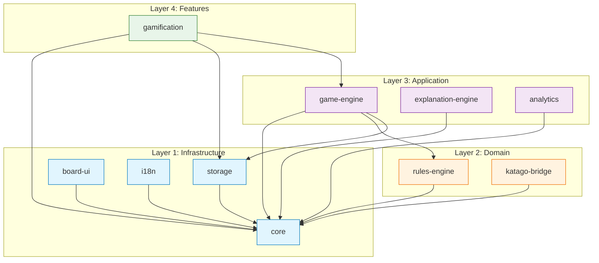

# Step 6: System Architecture Design — Baduk Platform Modular Monolith

**Version**: 1.0.0
**Author**: @architect (Step 6)
**Date**: 2026-03-11
**Consumers**: Step 7 (schema-designer), Step 8 (strategy-planner), Step 10 (scaffold teams), Step 11 (rules-engineer, data-engineer), Step 12 (katago-integrator), Step 13 (template-engineer)
**Inputs**: Step 1 (tech validation), Step 2 (KataGo IPC spec), Step 3 (domain knowledge), Step 4 (template engine design)

---

## Table of Contents

1. [Architecture Overview](#1-architecture-overview)
2. [Module Catalog](#2-module-catalog)
3. [Module Dependency DAG](#3-module-dependency-dag)
4. [Ports/Adapters Boundaries](#4-ports-adapters-boundaries)
5. [Tauri Command Surface](#5-tauri-command-surface)
6. [Parallel Development Feasibility](#6-parallel-development-feasibility)
7. [Step 1 Constraints Integration](#7-step-1-constraints-integration)
8. [Pipeline Connections (Steps 7, 8, 10, 11)](#8-pipeline-connections)
9. [Decision Rationale Log](#9-decision-rationale-log)
10. [Verification Checklist](#10-verification-checklist)
11. [pACS Self-Rating](#11-pacs-self-rating)

---

## 1. Architecture Overview

### 1.1 Architectural Style: Modular Monolith

The Baduk Platform is a **modular monolith** running within a single Tauri 2.0 desktop application process. This means:

- **Single deployable unit**: One `.dmg` / `.msi` / `.AppImage` installer.
- **Module boundaries enforced by directory structure and TypeScript module system**: Each module is a directory under `src/` with an explicit public API (`index.ts`).
- **No microservices**: All modules share the same Node.js runtime within the Tauri webview. The only separate OS process is KataGo, managed as a Tauri sidecar.
- **Communication**: Modules communicate through typed interfaces (ports), never by reaching into another module's internals.

**Rationale**: A modular monolith is the correct choice for a desktop application because (1) there is no network between modules, (2) deployment is atomic, (3) all state is local, and (4) the team (AI agents) benefits from compile-time type checking across module boundaries. Microservices would add IPC overhead and deployment complexity with zero benefit for a single-machine app.

### 1.2 Layered Architecture Within the Monolith

The modules are organized into four layers. Dependencies flow downward only.

```
+------------------------------------------------------------------+
|  Layer 4: FEATURES (user-facing compositions)                     |
|  [onboarding] [gamification] [review-panel]                       |
+------------------------------------------------------------------+
         |                    |                    |
+------------------------------------------------------------------+
|  Layer 3: APPLICATION (orchestration, state, commands)            |
|  [game-engine] [explanation-engine] [analytics]                   |
+------------------------------------------------------------------+
         |                    |                    |
+------------------------------------------------------------------+
|  Layer 2: DOMAIN (business logic, pure functions)                 |
|  [rules-engine] [katago-bridge]                                   |
+------------------------------------------------------------------+
         |                    |                    |
+------------------------------------------------------------------+
|  Layer 1: INFRASTRUCTURE (shared types, storage, i18n, UI)       |
|  [core] [storage] [board-ui] [i18n]                               |
+------------------------------------------------------------------+
```

**Layer rules**:
- Layer N may depend on Layer N-1 or lower, never on a higher layer.
- Within the same layer, modules may depend on each other only if the dependency is explicitly documented in the DAG (Section 3) and does not form a cycle.
- The `core` module is a leaf dependency (depended upon by all, depends on nothing).

### 1.3 External Processes

Only one external process exists in the architecture:

| Process | Binary | Communication | Lifecycle Owner |
|---------|--------|---------------|-----------------|
| KataGo Analysis Engine | `katago-{target_triple}` sidecar | stdin/stdout JSON-line protocol | `katago-bridge` module |

The Tauri Rust backend acts as a thin proxy: it spawns the sidecar and exposes Tauri commands. The frontend modules call these commands. The `katago-bridge` module encapsulates all KataGo interaction behind the `IKatagoBridge` port interface.

---

## 2. Module Catalog

### 2.1 Summary Table

| # | Module | Layer | Purpose | Dependencies | Tauri Commands Owned |
|---|--------|-------|---------|--------------|---------------------|
| 1 | `core` | 1 (Infra) | Shared types, constants, utilities | None | 0 |
| 2 | `storage` | 1 (Infra) | SQLite access via Tauri commands, Drizzle ORM, data persistence | `core` | 6 |
| 3 | `board-ui` | 1 (Infra) | SVG board rendering, Shudan fork, stone interaction | `core` | 0 |
| 4 | `i18n` | 1 (Infra) | Internationalization (en/ko/ja) | `core` | 1 |
| 5 | `rules-engine` | 2 (Domain) | Tromp-Taylor rules, capture, ko, scoring, Zobrist hashing | `core` | 0 |
| 6 | `katago-bridge` | 2 (Domain) | KataGo sidecar lifecycle, IPC, GPU detection, circuit breaker | `core` | 7 |
| 7 | `game-engine` | 3 (App) | GameReducer (Zustand), game flow, timer, move history, AI opponent | `core`, `rules-engine`, `storage` | 6 |
| 8 | `explanation-engine` | 3 (App) | Template matching, 3-tier generation, pattern catalog | `core`, `katago-bridge` | 3 |
| 9 | `analytics` | 3 (App) | PostHog events, Sentry error tracking | `core` | 2 |
| 10 | `gamification` | 4 (Feature) | Quests, levels, streaks, badges | `core`, `storage`, `game-engine` | 4 |

**Total**: 10 modules, 29 Tauri commands.

### 2.2 Detailed Module Definitions

---

#### Module 1: `core`

**Directory**: `src/core/`
**Layer**: 1 (Infrastructure)
**Purpose**: Single source of truth for all shared TypeScript types, constants, enums, and stateless utility functions.

**Responsibility Boundary**:
- Board geometry types (`BoardSize`, `Intersection`, `CellState`, `Player`)
- Game flow types (`MoveRecord`, `GameState`, `GameResult`, `GamePhase`)
- KataGo types (`AnalysisQuery`, `AnalysisResponse`, `MoveInfo`, `RootInfo`) (from Step 2 IPC spec)
- Scoring types (`ScoreResult`)
- Template types (`PatternId`, `Tier`, `PositionCategory`, `ExplanationOutput`)
- Gamification types (`Quest`, `Badge`, `PlayerLevel`, `Streak`)
- GTP coordinate utilities (`indexToGTP`, `gtpToIndex`, `columnToLetter`)
- Error types hierarchy (`AppError`, `KataGoError`, `RulesError`, `StorageError`)
- Constants (`BOARD_SIZES`, `DEFAULT_KOMI`, `KATAGO_TIMEOUTS`, threshold values from Step 4)

**Public Ports**: N/A (this module only exports types and pure utility functions)
**Required Ports**: None
**Tauri Commands**: None
**Dependencies**: None

**Rationale**: A dedicated `core` module prevents circular dependencies caused by shared types. Every other module depends on `core` but `core` depends on nothing. This is the standard "shared kernel" pattern in modular monoliths.

---

#### Module 2: `storage`

**Directory**: `src/storage/`
**Layer**: 1 (Infrastructure)
**Purpose**: All SQLite database access, Drizzle ORM schema, migrations, and data persistence operations.

**Responsibility Boundary**:
- Drizzle ORM schema definitions (6 tables from Step 7)
- Migration management
- CRUD operations for: `games`, `moves`, `players`, `settings`, `quests`, `achievements`
- Append-only move log with SQLite transactions
- SGF export utility
- WAL mode configuration
- Game save/load operations

**Public Ports (exposed interfaces)**:

```typescript
interface IStoragePort {
  // Game persistence
  saveGame(game: GameRecord): Promise<string>;         // returns gameId
  loadGame(gameId: string): Promise<GameRecord | null>;
  listGames(filter: GameFilter): Promise<GameSummary[]>;
  deleteGame(gameId: string): Promise<void>;

  // Move log (append-only)
  appendMove(gameId: string, move: MoveRecord): Promise<void>;
  getMoves(gameId: string): Promise<MoveRecord[]>;

  // Settings
  getSetting<T>(key: string): Promise<T | null>;
  setSetting<T>(key: string, value: T): Promise<void>;

  // Player profile
  getPlayerProfile(): Promise<PlayerProfile>;
  updatePlayerProfile(update: Partial<PlayerProfile>): Promise<void>;

  // SGF export
  exportSGF(gameId: string): Promise<string>;          // returns SGF string

  // Gamification data
  getQuests(date: string): Promise<Quest[]>;
  completeQuest(questId: string): Promise<QuestReward>;
  getAchievements(): Promise<Achievement[]>;
  unlockAchievement(achievementId: string): Promise<void>;
  getStreak(): Promise<StreakData>;
  updateStreak(): Promise<StreakData>;
}
```

**Required Ports**: None (leaf module; all DB access goes through Tauri Rust commands)
**Dependencies**: `core`

**Tauri Commands Owned** (6):
- `storage_save_game`
- `storage_load_game`
- `storage_list_games`
- `storage_delete_game`
- `storage_get_setting`
- `storage_set_setting`

**Rationale**: Step 1 validated that SQLite should be accessed via Rust-side `rusqlite` exposed through Tauri commands (Option B), not via `better-sqlite3` in the webview. The `storage` module wraps Tauri command calls behind the `IStoragePort` interface. The Drizzle ORM schema definitions live here for migration generation, but runtime queries go through Tauri commands to Rust. This decision avoids native addon cross-platform issues (Step 1 constraint #7).

---

#### Module 3: `board-ui`

**Directory**: `src/board-ui/`
**Layer**: 1 (Infrastructure)
**Purpose**: All Go board rendering, stone visualization, territory markers, analysis overlays, and user interaction (click, touch, hover).

**Responsibility Boundary**:
- SVG board rendering (React components)
- Shudan fork: 18 classical board components + custom additions
- Stone placement interaction (click-to-place, tap-preview-confirm for touch)
- Territory visualization overlays (ownership heatmap from KataGo data)
- Move marker overlays (last move, variations, numbered moves)
- KaTrain color scheme implementation (green-blue-yellow-orange-red)
- Board coordinate labels
- Responsive sizing (9x9, 13x13, 19x19)
- Pinch-zoom support via `@use-gesture`

**Key React Components** (20):
1. `GoBoard` (root container)
2. `BoardGrid` (SVG grid lines)
3. `StarPoints` (hoshi)
4. `Coordinates` (A-T, 1-19 labels)
5. `StoneLayer` (all stones)
6. `Stone` (single stone, Black/White)
7. `LastMoveMarker`
8. `GhostStone` (hover preview)
9. `TerritoryMarker` (scoring overlay)
10. `OwnershipHeatmap` (KataGo ownership)
11. `MoveNumber` (numbered stones for review)
12. `VariationArrow` (PV sequence visualization)
13. `CapturedStonesCounter`
14. `BoardSizeSelector`
15. `PlayerInfoPanel`
16. `TimerDisplay`
17. `WinRateGraph` (Recharts integration)
18. `WinRateBar` (compact inline display)
19. `ExplanationCard` (template engine output)
20. `AnalysisPanel` (move candidates list)

**Public Ports**: N/A (exports React components; consumers import and compose)
**Required Ports**: None (receives data via React props)
**Dependencies**: `core`
**Tauri Commands**: None (pure React rendering)

**Rationale**: Board UI is a leaf module that receives all data via React props. It has no business logic, no state management, and no side effects. This makes it independently developable and testable with Storybook (if desired). The Shudan fork is contained entirely within this module.

---

#### Module 4: `i18n`

**Directory**: `src/i18n/`
**Layer**: 1 (Infrastructure)
**Purpose**: Internationalization configuration, translation resources, and language switching.

**Responsibility Boundary**:
- i18next configuration and initialization
- react-i18next provider setup
- Translation resource files (JSON namespaces per locale: en, ko, ja)
- Language detection and persistence
- Go-specific term glossary per locale

**Public Ports**:

```typescript
interface II18nPort {
  getCurrentLocale(): string;
  changeLocale(locale: 'en' | 'ko' | 'ja'): Promise<void>;
  t(key: string, options?: Record<string, unknown>): string;
}
```

**Required Ports**: None
**Dependencies**: `core`
**Tauri Commands Owned** (1):
- `i18n_get_system_locale` (Rust-side OS locale detection)

**Rationale**: i18n is infrastructure shared by all UI-facing modules. Centralizing it prevents scattered translation logic. The `i18n_get_system_locale` Tauri command detects the OS language preference for initial setup (Step 1 confirmed react-i18next v16 works with React 19).

---

#### Module 5: `rules-engine`

**Directory**: `src/engine/rules/`
**Layer**: 2 (Domain)
**Purpose**: Pure implementation of Tromp-Taylor rules, board manipulation, capture mechanics, ko/superko detection, Chinese scoring, and Zobrist hashing.

**Responsibility Boundary**:
- Board creation and manipulation (1D Uint8Array, Step 3 Section 3)
- Stone placement with validation (Step 3 Rule 7)
- Capture detection and execution (Step 3 Rules 3-4)
- Suicide detection and execution (Step 3 Rule 7, step 3)
- Simple ko detection optimization (Step 3 Section 4.7)
- Positional superko via Zobrist hashing (Step 3 Sections 4-5)
- Chinese scoring algorithm (Step 3 Section 5)
- Move legality validation
- Group finding (BFS/DFS, connected component analysis)
- Liberty counting
- Pre-computed adjacency table
- All 20 edge cases from Step 3 Section 6

**Incremental Build Order** (from Step 3 Section 7):
1. Stage 1: Place (Rules 1, 2, 5-partial, 7-step-1)
2. Stage 2: Capture (Rules 3, 4, 7-steps-2-3)
3. Stage 3: Ko (Rule 6 — simple ko optimization)
4. Stage 4: Scoring (Rules 9, 10)
5. Stage 5: Superko (Rule 6 — full positional superko)
6. Stage 6: Game Flow (Rules 5, 8, 10)

**Public Ports (exposed interface)**:

```typescript
interface IRulesEngine {
  // Board creation
  createBoard(size: BoardSize): BoardState;

  // Move validation
  isLegalMove(state: GameState, index: number): boolean;
  getLegalMoves(state: GameState): number[];

  // Move execution (returns new state; original is unchanged — immutable)
  applyMove(state: GameState, index: number): GameState;
  applyPass(state: GameState): GameState;

  // Scoring
  computeScore(board: BoardState, komi: number): ScoreResult;

  // Game flow
  isGameOver(state: GameState): boolean;

  // Utilities
  getGroup(board: BoardState, index: number): Group;
  getLiberties(board: BoardState, group: Group): Set<number>;
  getTerritory(board: BoardState): TerritoryMap;
}
```

**Required Ports**: None (pure functions only; no external dependencies)
**Dependencies**: `core`
**Tauri Commands**: None (runs entirely in the webview JavaScript context)

**Design Decision: Why Not Rust-Side?**
The rules engine runs in TypeScript in the webview, not in Rust. Rationale:
1. **Performance is sufficient**: A 19x19 board has 361 intersections. Move validation with BFS takes <1ms in JavaScript. There is no performance justification for Rust.
2. **Developer velocity**: TypeScript is the primary language for all other frontend logic. Keeping the rules engine in TypeScript means one language, one test framework (Vitest), and one debugging environment.
3. **Testing ease**: Vitest can test pure TypeScript functions directly. Rust-side rules would require Tauri command round-trips for testing.
4. **Step 11 parallelism**: The rules-engine and data-layer agents both work in TypeScript, sharing the same `core` types without FFI boundaries.

**Exception**: If profiling reveals performance issues (unlikely), the hot path (Zobrist hash computation) could be moved to a Rust Tauri command. The `IRulesEngine` port interface makes this transparent to consumers.

---

#### Module 6: `katago-bridge`

**Directory**: `src/engine/katago/`
**Layer**: 2 (Domain)
**Purpose**: All interaction with the KataGo sidecar process: lifecycle management, query/response IPC, GPU backend detection, health monitoring, circuit breaker, and visits tier calibration.

**Responsibility Boundary**:
- KataGo sidecar process spawn and shutdown (Step 2 Section 7.2, 7.6)
- Binary selection based on GPU backend detection (Step 2 Section 6.3)
- Analysis Engine JSON-line protocol (Step 2 Sections 3-4)
- Query queue management with priority support
- Response correlation (id-based) and dispatching
- Watchdog: crash detection, hang detection, stderr monitoring (Step 2 Section 7.4)
- Circuit breaker: 5 failures / 10 min window, exponential backoff (Step 2 Section 7.5)
- State machine: Idle -> Starting -> Ready -> Analyzing -> Degraded -> Failed -> Restarting -> Fallback (Step 2 Section 7.1)
- Visits tier calibration based on hardware benchmark (Step 2 Section 9.3)
- NN model path resolution and validation
- OpenCL first-run tuning detection
- Analysis request/response type marshalling
- `terminate` / `terminate_all` for query cancellation

**Public Ports (exposed interface)**:

```typescript
interface IKatagoBridge {
  // Lifecycle
  initialize(config: KataGoConfig): Promise<void>;
  shutdown(): Promise<void>;
  getStatus(): KataGoStatus;  // Idle|Starting|Ready|Analyzing|Degraded|Failed|Fallback

  // Analysis
  analyze(query: AnalysisQuery): Promise<AnalysisResponse>;
  analyzeMultiple(query: BatchAnalysisQuery): Promise<AnalysisResponse[]>;
  cancelAnalysis(queryId: string): Promise<void>;
  cancelAll(): Promise<void>;

  // Configuration
  getVisitsTiers(): VisitsTierConfig;
  calibrateVisitsTiers(): Promise<VisitsTierConfig>;
  getBackendInfo(): BackendInfo;

  // Health
  isHealthy(): boolean;
  getCircuitBreakerState(): CircuitBreakerState;

  // Version and model info
  queryVersion(): Promise<VersionInfo>;
  queryModels(): Promise<ModelInfo[]>;
}
```

**Required Ports**: None at the TypeScript level (communicates with KataGo via Tauri shell commands)
**Dependencies**: `core`

**Tauri Commands Owned** (7):
- `katago_initialize` (spawn sidecar, verify with query_version)
- `katago_shutdown` (graceful shutdown)
- `katago_analyze` (send analysis query, return response)
- `katago_cancel` (terminate specific query)
- `katago_cancel_all` (terminate all queries)
- `katago_get_status` (current lifecycle state)
- `katago_detect_backend` (GPU detection algorithm, returns best binary name)

**Adapter Strategy**:
- **Production**: `KataGoSidecarAdapter` — real KataGo binary via Tauri `shell.sidecar()`
- **Testing**: `MockKataGoAdapter` — returns pre-recorded analysis responses for deterministic testing
- **Development**: `StubKataGoAdapter` — returns synthetic responses with configurable delays

**Rationale**: KataGo communication requires Rust-side process management (Tauri shell plugin). The TypeScript `katago-bridge` module provides a clean async API. The Rust side handles raw process I/O (stdin/stdout piping, stderr consumption, process monitoring). The TypeScript side handles query construction, response parsing, circuit breaker logic, and queue management.

---

#### Module 7: `game-engine`

**Directory**: `src/engine/game/`
**Layer**: 3 (Application)
**Purpose**: Game session orchestration, Zustand state management (GameReducer), timer, move history, AI opponent integration, and game lifecycle management.

**Responsibility Boundary**:
- GameReducer (Zustand store): central game state management
- Game creation (board size, komi, time control, players)
- Move processing: validate via `IRulesEngine`, apply, update state, trigger analysis
- Pass and resignation handling
- Timer management (main time + byoyomi)
- AI opponent: request moves from `IKatagoBridge`, apply to game
- Move history navigation (back/forward for review mode)
- Game lifecycle: create -> play -> end -> score -> save
- Game mode management: vs-AI, review, tutorial
- Undo/redo support (for review/tutorial modes)

**Public Ports (exposed interface)**:

```typescript
interface IGameEngine {
  // Game lifecycle
  createGame(config: GameConfig): GameSession;
  getCurrentGame(): GameSession | null;
  endGame(): Promise<GameResult>;
  resignGame(player: Player): GameResult;

  // Moves
  playMove(index: number): PlayMoveResult;
  playPass(): PlayMoveResult;
  requestAIMove(): Promise<PlayMoveResult>;

  // Timer
  getTimerState(): TimerState;
  pauseTimer(): void;
  resumeTimer(): void;

  // Review mode
  goToMove(moveNumber: number): void;
  goForward(): void;
  goBack(): void;
  goToStart(): void;
  goToEnd(): void;

  // State subscription (Zustand)
  subscribe(selector: (state: GameState) => unknown, listener: () => void): () => void;
  getState(): GameState;
}
```

**Required Ports**:
- `IRulesEngine` (move validation, scoring)
- `IStoragePort` (game persistence)

**Dependencies**: `core`, `rules-engine`, `storage`
**Tauri Commands Owned** (6):
- `game_create` (create new game session)
- `game_play_move` (play a stone at intersection)
- `game_play_pass` (pass turn)
- `game_resign` (resign game)
- `game_load` (load saved game for review)
- `game_export_sgf` (export current game as SGF)

**Rationale**: The game engine is the central orchestrator for game flow. It depends on `rules-engine` for legality and scoring, and on `storage` for persistence. It does NOT depend on `katago-bridge` directly. Instead, the UI layer (or a feature module) coordinates between `game-engine` and `katago-bridge`. This keeps the game engine testable without a KataGo process.

**Design Decision: game-engine does NOT depend on katago-bridge.**
The game-engine manages local game state (board, moves, timer). AI move generation and analysis are triggered by the feature layer, which calls both `IGameEngine.playMove()` and `IKatagoBridge.analyze()` in sequence. This separation means:
1. Game-engine is testable with just `IRulesEngine` and `IStoragePort` (both easily mockable).
2. The game-engine works offline without KataGo (review of saved games).
3. AI move requests flow through the feature layer, which can show loading states and handle KataGo failures gracefully.

---

#### Module 8: `explanation-engine`

**Directory**: `src/engine/explanation/`
**Layer**: 3 (Application)
**Purpose**: Transform KataGo analysis responses into human-readable explanations using the template matching pipeline designed in Step 4.

**Responsibility Boundary**:
- KataGo field extraction (Step 4 Section 3)
- Computed field derivation: `winrateDelta`, `scoreLeadDelta`, `bestMovePlayed`, `moveRank`, `topMoveGap`, `movePhase`, `confidenceLevel` (Step 4 Section 3.1.3)
- Perspective handling: currentPlayer-relative values (Step 4 Section 3.3)
- Pattern classification pipeline: 6-priority chain (Step 4 Section 4.1)
- Position category detection: life/death, ko, seki, game phase (Step 4 Section 4.2)
- Template selection and slot binding (Step 4 Section 5.2-5.3)
- Mandatory fallback enforcement for life/death, ko, seki (Step 4 Section 6)
- 3-tier rendering: beginner, intermediate, advanced (Step 4 Section 5.1)
- L3 output validation (Step 4 Section 9.3)
- Multi-pattern composition (primary + up to 2 supporting) (Step 4 Section 4.3)
- 90-pattern catalog management (30 per tier, Step 4 Section 5.4)

**Public Ports (exposed interface)**:

```typescript
interface IExplanationEngine {
  // Core explanation generation
  explain(
    current: AnalysisResponse,
    previous: AnalysisResponse | null,
    actualMove: GTPLocation | null,
    tier: Tier,
    turnNumber: number,
    boardSize: BoardSize
  ): ExplanationOutput;

  // Pattern catalog management
  getPatternCatalog(): PatternCatalog;
  getCoverageStats(): CoverageStats;

  // Configuration
  setDefaultTier(tier: Tier): void;
  getDefaultTier(): Tier;
}
```

**Required Ports**:
- `IKatagoBridge` (to request analysis for the current and previous position)

Note: The explanation engine receives `AnalysisResponse` objects as input, not raw KataGo processes. The calling code (feature layer or Tauri command handler) obtains analysis from `IKatagoBridge` and passes it to `IExplanationEngine.explain()`. The dependency on `katago-bridge` is therefore a **type dependency** (it uses the response types defined in `core`), not a runtime invocation dependency. However, architecturally we model it as a dependency because the explanation engine cannot function without analysis data that originates from KataGo.

**Correction**: On further analysis, the explanation engine depends only on `core` types (where `AnalysisResponse` is defined). It receives analysis data as function parameters. It does NOT call `IKatagoBridge` methods directly. Therefore:

**Dependencies**: `core` (only)
**Tauri Commands Owned** (3):
- `explanation_generate` (generate explanation for a position)
- `explanation_set_tier` (set default explanation tier)
- `explanation_get_tier` (get current explanation tier)

**Rationale**: The explanation engine is a pure transformation function: `AnalysisResponse -> ExplanationOutput`. It does not need to call KataGo itself. The caller (feature layer) provides the analysis data. This makes the explanation engine independently testable with fixture data from Step 2's example responses. The Step 4 design explicitly states that the engine receives "only KataGo JSON" as input — this is enforced by the function signature.

---

#### Module 9: `analytics`

**Directory**: `src/analytics/`
**Layer**: 3 (Application)
**Purpose**: Telemetry event tracking (PostHog) and error reporting (Sentry), both opt-in.

**Responsibility Boundary**:
- PostHog event tracking (opt-in user analytics)
- Sentry crash reporting and error tracking
- Event schema definitions (standardized event names and properties)
- User consent management (GDPR/privacy)
- Offline event queuing (buffer events when offline, flush when connected)
- Session tracking

**Public Ports (exposed interface)**:

```typescript
interface IAnalyticsPort {
  // Event tracking
  trackEvent(name: string, properties?: Record<string, unknown>): void;
  trackPageView(pageName: string): void;

  // Error reporting
  captureError(error: Error, context?: Record<string, unknown>): void;
  captureMessage(message: string, level: 'info' | 'warning' | 'error'): void;

  // Consent
  setConsent(granted: boolean): void;
  getConsent(): boolean;

  // Lifecycle
  initialize(config: AnalyticsConfig): Promise<void>;
  flush(): Promise<void>;
}
```

**Required Ports**: None
**Dependencies**: `core`
**Tauri Commands Owned** (2):
- `analytics_set_consent` (persist consent preference)
- `analytics_get_consent` (retrieve consent state)

**Adapter Strategy**:
- **Production**: `PostHogSentryAdapter` — real PostHog SDK + Sentry SDK
- **Development**: `ConsoleAnalyticsAdapter` — logs events to console
- **Testing**: `NoOpAnalyticsAdapter` — silently discards all events

**Rationale**: Analytics is an orthogonal concern. By isolating it behind `IAnalyticsPort`, no other module needs to know about PostHog or Sentry. The adapter pattern means vendor switching (e.g., PostHog to Mixpanel) requires changing exactly one file. PostHog and Sentry are both client-side SDKs that work in Tauri webview (Step 1 risk: LOW).

---

#### Module 10: `gamification`

**Directory**: `src/features/gamification/`
**Layer**: 4 (Feature)
**Purpose**: Quest system, XP/levels, streaks, badges, and achievement tracking.

**Responsibility Boundary**:
- Daily quest generation and completion tracking
- XP calculation and level-up logic
- Streak tracking (consecutive days of play)
- Badge/achievement definitions and unlock logic
- Quest reward distribution
- Progress visualization data

**Public Ports (exposed interface)**:

```typescript
interface IGamificationService {
  // Quests
  getDailyQuests(): Promise<Quest[]>;
  completeQuest(questId: string): Promise<QuestReward>;
  refreshQuests(): Promise<Quest[]>;

  // Levels
  getPlayerLevel(): Promise<PlayerLevel>;
  addXP(amount: number, source: XPSource): Promise<LevelUpResult | null>;

  // Streaks
  getStreak(): Promise<StreakData>;
  recordDailyActivity(): Promise<StreakData>;

  // Badges
  getAchievements(): Promise<Achievement[]>;
  checkAndUnlockAchievements(event: GameEvent): Promise<Achievement[]>;
}
```

**Required Ports**:
- `IStoragePort` (persist quest progress, XP, streaks, badges)
- `IGameEngine` (subscribe to game events: game completed, move played, etc.)

**Dependencies**: `core`, `storage`, `game-engine`
**Tauri Commands Owned** (4):
- `gamification_get_quests` (list daily quests with completion state)
- `gamification_complete_quest` (mark quest as completed, distribute reward)
- `gamification_get_progress` (player level, XP, streak, badges)
- `gamification_check_achievements` (check and unlock new achievements)

**Rationale**: Gamification is a feature module that composes lower-layer services. It depends on `storage` for persistence and `game-engine` for game events (to detect quest completion triggers like "play 1 Quick Go game"). It has exactly 3 dependencies, well under the 5-dependency limit.

---

### 2.3 Module-to-Directory Mapping

```
src/
  core/                          # Module 1: core
    types/
      board.ts                   # BoardState, BoardSize, CellState, Player
      game.ts                    # GameState, GameResult, MoveRecord, GamePhase
      katago.ts                  # AnalysisQuery, AnalysisResponse, MoveInfo, RootInfo
      scoring.ts                 # ScoreResult, TerritoryMap
      explanation.ts             # ExplanationOutput, PatternId, Tier, PositionCategory
      gamification.ts            # Quest, Badge, PlayerLevel, Streak
      errors.ts                  # AppError hierarchy
    utils/
      gtp.ts                     # GTP coordinate conversion
      math.ts                    # Clamp, lerp, percentage formatting
    constants.ts                 # All threshold values, board sizes, defaults
    index.ts                     # Public API barrel export

  storage/                       # Module 2: storage
    schema/
      tables.ts                  # Drizzle ORM table definitions
      migrations/                # Generated migration SQL files
    adapters/
      tauri-storage-adapter.ts   # Production: calls Tauri commands
      memory-storage-adapter.ts  # Testing: in-memory Map-based
    ports/
      storage-port.ts            # IStoragePort interface
    index.ts

  board-ui/                      # Module 3: board-ui
    components/
      GoBoard.tsx
      BoardGrid.tsx
      Stone.tsx
      ... (18 more components)
    hooks/
      useBoardInteraction.ts
      useBoardSize.ts
    index.ts

  i18n/                          # Module 4: i18n
    locales/
      en/                        # English translations
      ko/                        # Korean translations
      ja/                        # Japanese translations
    config.ts                    # i18next initialization
    ports/
      i18n-port.ts               # II18nPort interface
    index.ts

  engine/
    rules/                       # Module 5: rules-engine
      board.ts                   # Board creation, adjacency table
      capture.ts                 # Capture detection and execution
      ko.ts                      # Simple ko optimization
      superko.ts                 # Zobrist hashing, positional superko
      scoring.ts                 # Chinese scoring algorithm
      game-flow.ts               # Pass handling, game termination
      validation.ts              # Move legality checking
      ports/
        rules-engine-port.ts     # IRulesEngine interface
      index.ts

    katago/                      # Module 6: katago-bridge
      adapters/
        katago-sidecar-adapter.ts   # Production: real KataGo sidecar
        mock-katago-adapter.ts      # Testing: pre-recorded responses
        stub-katago-adapter.ts      # Development: synthetic responses
      lifecycle/
        state-machine.ts         # KataGo process state machine
        circuit-breaker.ts       # Circuit breaker implementation
        watchdog.ts              # Crash/hang detection
      ipc/
        query-builder.ts         # AnalysisQuery construction
        response-parser.ts       # JSON-line response parsing
        queue-manager.ts         # Priority queue for queries
      detection/
        gpu-detector.ts          # GPU backend detection algorithm
        benchmark.ts             # Hardware benchmark and tier calibration
      ports/
        katago-bridge-port.ts    # IKatagoBridge interface
      index.ts

    game/                        # Module 7: game-engine
      game-reducer.ts            # Zustand store (GameReducer)
      timer.ts                   # Time control management
      ai-opponent.ts             # AI move request coordination
      game-session.ts            # Game session management
      review-mode.ts             # Move history navigation
      ports/
        game-engine-port.ts      # IGameEngine interface
      index.ts

    explanation/                  # Module 8: explanation-engine
      classifier/
        pattern-classifier.ts    # 6-priority pattern matching
        category-detector.ts     # Position category detection (life/death, ko, seki, phase)
      templates/
        template-renderer.ts     # Slot binding and text generation
        mandatory-templates.ts   # Pre-authored life/death, ko, seki templates
        pattern-catalog.ts       # 90-pattern catalog data
      pipeline/
        field-extractor.ts       # KataGo field extraction
        delta-computer.ts        # winrateDelta, scoreLeadDelta computation
        perspective-handler.ts   # Current-player-relative adjustments
        output-validator.ts      # L3 validation (numbers trace to KataGo)
        tier-adapter.ts          # Beginner/Intermediate/Advanced formatting
      ports/
        explanation-engine-port.ts  # IExplanationEngine interface
      index.ts

  analytics/                     # Module 9: analytics
    adapters/
      posthog-sentry-adapter.ts  # Production adapter
      console-adapter.ts         # Development adapter
      noop-adapter.ts            # Testing adapter
    events/
      event-schema.ts            # Standardized event definitions
    ports/
      analytics-port.ts          # IAnalyticsPort interface
    index.ts

  features/
    gamification/                # Module 10: gamification
      quests/
        quest-generator.ts       # Daily quest generation
        quest-tracker.ts         # Quest completion tracking
      levels/
        xp-calculator.ts         # XP calculation
        level-system.ts          # Level thresholds and progression
      streaks/
        streak-tracker.ts        # Consecutive day tracking
      badges/
        achievement-definitions.ts  # Badge/achievement catalog
        unlock-checker.ts        # Achievement trigger logic
      ports/
        gamification-port.ts     # IGamificationService interface
      index.ts
```

---

## 3. Module Dependency DAG

### 3.1 Dependency Graph (Mermaid)



### 3.2 Adjacency List Representation

| Module | Depends On | Depended Upon By |
|--------|-----------|------------------|
| `core` | (none) | ALL other modules |
| `storage` | `core` | `game-engine`, `gamification` |
| `board-ui` | `core` | (UI compositions only) |
| `i18n` | `core` | (UI compositions only) |
| `rules-engine` | `core` | `game-engine` |
| `katago-bridge` | `core` | (feature layer only) |
| `game-engine` | `core`, `rules-engine`, `storage` | `gamification` |
| `explanation-engine` | `core` | (feature layer only) |
| `analytics` | `core` | (feature layer only) |
| `gamification` | `core`, `storage`, `game-engine` | (none) |

### 3.3 Topological Sort (Acyclicity Proof)

A valid topological ordering exists, proving the DAG is acyclic:

```
Level 0: core
Level 1: storage, board-ui, i18n, rules-engine, katago-bridge, explanation-engine, analytics
Level 2: game-engine
Level 3: gamification
```

**Verification procedure**:
1. `core` has in-degree 0. Remove it. Remaining: 9 modules.
2. `storage`, `board-ui`, `i18n`, `rules-engine`, `katago-bridge`, `explanation-engine`, `analytics` now have in-degree 0 (their only dependency was `core`). Remove them. Remaining: 2 modules.
3. `game-engine` now has in-degree 0 (dependencies `core`, `rules-engine`, `storage` all removed). Remove it. Remaining: 1 module.
4. `gamification` now has in-degree 0 (dependencies `core`, `storage`, `game-engine` all removed). Remove it. Remaining: 0 modules.

All modules removed. **The graph is acyclic.** QED.

### 3.4 Dependency Type Classification

| Dependency | Type | Explanation |
|-----------|------|-------------|
| `game-engine` -> `rules-engine` | Compile-time + Runtime | game-engine imports `IRulesEngine` interface and calls methods at runtime |
| `game-engine` -> `storage` | Compile-time + Runtime | game-engine imports `IStoragePort` and calls save/load at runtime |
| `gamification` -> `game-engine` | Compile-time + Runtime | gamification subscribes to game events at runtime |
| `gamification` -> `storage` | Compile-time + Runtime | gamification persists quest/badge data at runtime |
| All -> `core` | Compile-time | Type imports only; no runtime method calls to `core` |
| `explanation-engine` -> `core` | Compile-time | Imports `AnalysisResponse` type; all data arrives as function parameters |
| `katago-bridge` -> `core` | Compile-time + Runtime | Imports types; also uses `core` constants for timeouts and thresholds |
| `analytics` -> `core` | Compile-time | Imports error types and event schema types |

### 3.5 Maximum Dependency Count Check

| Module | Dependency Count | Status |
|--------|:---:|:---:|
| `core` | 0 | PASS |
| `storage` | 1 | PASS |
| `board-ui` | 1 | PASS |
| `i18n` | 1 | PASS |
| `rules-engine` | 1 | PASS |
| `katago-bridge` | 1 | PASS |
| `game-engine` | 3 | PASS |
| `explanation-engine` | 1 | PASS |
| `analytics` | 1 | PASS |
| `gamification` | 3 | PASS |

**Maximum**: 3 (game-engine and gamification). Well under the 5-dependency limit. No "god modules" exist.

---

## 4. Ports/Adapters Boundaries

### 4.1 Port Interface Summary

Every module with external dependencies or replaceable implementations exposes a port interface. Adapters are concrete implementations that can be swapped without changing consumers.

| Port Interface | Adapters | Swap Strategy |
|---------------|----------|---------------|
| `IStoragePort` | `TauriStorageAdapter` (prod), `MemoryStorageAdapter` (test) | DI at app bootstrap |
| `IKatagoBridge` | `KataGoSidecarAdapter` (prod), `MockKataGoAdapter` (test), `StubKataGoAdapter` (dev) | DI at app bootstrap |
| `IRulesEngine` | `TrompTaylorRulesEngine` (sole implementation) | Direct import (no DI needed; pure functions) |
| `IGameEngine` | `GameEngineImpl` (sole implementation) | Direct import |
| `IExplanationEngine` | `TemplateExplanationEngine` (Phase 1), `LLMExplanationEngine` (Phase 2) | DI at app bootstrap |
| `IAnalyticsPort` | `PostHogSentryAdapter` (prod), `ConsoleAdapter` (dev), `NoOpAdapter` (test) | DI at app bootstrap |
| `IGamificationService` | `GamificationServiceImpl` (sole implementation) | Direct import |
| `II18nPort` | `I18nextAdapter` (sole implementation) | Direct import |

### 4.2 Dependency Injection Strategy

The application uses a **simple factory pattern** at bootstrap time — not a heavy DI container. The rationale is that a desktop app has a single composition root (app initialization), and the number of injectable services is small (6 ports with adapters).

**Composition Root** (`src/app/bootstrap.ts`):

```typescript
import type { IStoragePort } from '@/storage/ports/storage-port';
import type { IKatagoBridge } from '@/engine/katago/ports/katago-bridge-port';
import type { IExplanationEngine } from '@/engine/explanation/ports/explanation-engine-port';
import type { IAnalyticsPort } from '@/analytics/ports/analytics-port';

// --- Environment detection ---
const isTest = import.meta.env.MODE === 'test';
const isDev = import.meta.env.MODE === 'development';

// --- Adapter selection ---
export function createStorageAdapter(): IStoragePort {
  if (isTest) return new MemoryStorageAdapter();
  return new TauriStorageAdapter();
}

export function createKataGoAdapter(): IKatagoBridge {
  if (isTest) return new MockKataGoAdapter();
  if (isDev) return new StubKataGoAdapter();
  return new KataGoSidecarAdapter();
}

export function createExplanationEngine(): IExplanationEngine {
  // Phase 1: always template engine
  // Phase 2: check if LLM API key is configured
  return new TemplateExplanationEngine();
}

export function createAnalyticsAdapter(): IAnalyticsPort {
  if (isTest) return new NoOpAnalyticsAdapter();
  if (isDev) return new ConsoleAnalyticsAdapter();
  return new PostHogSentryAdapter();
}
```

**Usage in modules** (via React context or module-level singletons):

```typescript
// In a React component or feature module:
const storage = useStoragePort();     // from React context
const katago = useKatago();           // from React context
const explanation = useExplanation(); // from React context
```

### 4.3 Vendor Replacement Verification

| Scenario | Files Changed | Verification |
|----------|:---:|---|
| Replace PostHog with Mixpanel | 1 (`mixpanel-adapter.ts` + update `bootstrap.ts`) | All `IAnalyticsPort` consumers unchanged |
| Replace SQLite with IndexedDB | 1 (`indexeddb-adapter.ts` + update `bootstrap.ts`) | All `IStoragePort` consumers unchanged |
| Replace template engine with LLM | 1 (`llm-explanation-engine.ts` + update `bootstrap.ts`) | All `IExplanationEngine` consumers unchanged |
| Mock KataGo for testing | 0 (already exists as `MockKataGoAdapter`) | Swap in `bootstrap.ts` or test setup |
| Add new KataGo backend | 0 (GPU detection in `katago-bridge` handles binary selection) | Internal to `katago-bridge` |

**Conclusion**: Every vendor-specific dependency is replaceable by changing a single adapter file and updating the composition root. No consumer code changes required.

---

## 5. Tauri Command Surface

### 5.1 Command Naming Convention

```
{module}_{action}[_{target}]
```

Examples:
- `katago_initialize` (module: katago, action: initialize)
- `storage_save_game` (module: storage, action: save, target: game)
- `game_play_move` (module: game, action: play, target: move)

**Rules**:
- All lowercase with underscores.
- Module prefix ensures uniqueness across modules.
- Each command has exactly one owning module.

### 5.2 Command Catalog by Module

#### Module: `storage` (6 commands)

| Command | Sync/Async | Input Type | Return Type | Error Type |
|---------|:---:|-----------|-------------|-----------|
| `storage_save_game` | Async | `SaveGamePayload` | `{ gameId: string }` | `StorageError` |
| `storage_load_game` | Async | `{ gameId: string }` | `GameRecord \| null` | `StorageError` |
| `storage_list_games` | Async | `GameFilter` | `GameSummary[]` | `StorageError` |
| `storage_delete_game` | Async | `{ gameId: string }` | `void` | `StorageError` |
| `storage_get_setting` | Async | `{ key: string }` | `unknown \| null` | `StorageError` |
| `storage_set_setting` | Async | `{ key: string; value: unknown }` | `void` | `StorageError` |

#### Module: `katago-bridge` (7 commands)

| Command | Sync/Async | Input Type | Return Type | Error Type |
|---------|:---:|-----------|-------------|-----------|
| `katago_initialize` | Async | `KataGoConfig` | `VersionInfo` | `KataGoError` |
| `katago_shutdown` | Async | `void` | `void` | `KataGoError` |
| `katago_analyze` | Async | `AnalysisQuery` | `AnalysisResponse` | `KataGoError` |
| `katago_cancel` | Async | `{ queryId: string }` | `void` | `KataGoError` |
| `katago_cancel_all` | Async | `void` | `void` | `KataGoError` |
| `katago_get_status` | Sync | `void` | `KataGoStatus` | never |
| `katago_detect_backend` | Async | `void` | `BackendInfo` | `KataGoError` |

#### Module: `game-engine` (6 commands)

| Command | Sync/Async | Input Type | Return Type | Error Type |
|---------|:---:|-----------|-------------|-----------|
| `game_create` | Async | `GameConfig` | `GameSession` | `GameError` |
| `game_play_move` | Sync | `{ gameId: string; index: number }` | `PlayMoveResult` | `RulesError` |
| `game_play_pass` | Sync | `{ gameId: string }` | `PlayMoveResult` | `GameError` |
| `game_resign` | Sync | `{ gameId: string; player: Player }` | `GameResult` | `GameError` |
| `game_load` | Async | `{ gameId: string }` | `GameSession` | `StorageError` |
| `game_export_sgf` | Async | `{ gameId: string }` | `{ sgf: string }` | `StorageError` |

#### Module: `explanation-engine` (3 commands)

| Command | Sync/Async | Input Type | Return Type | Error Type |
|---------|:---:|-----------|-------------|-----------|
| `explanation_generate` | Sync | `ExplanationRequest` | `ExplanationOutput` | `ExplanationError` |
| `explanation_set_tier` | Sync | `{ tier: Tier }` | `void` | never |
| `explanation_get_tier` | Sync | `void` | `{ tier: Tier }` | never |

#### Module: `i18n` (1 command)

| Command | Sync/Async | Input Type | Return Type | Error Type |
|---------|:---:|-----------|-------------|-----------|
| `i18n_get_system_locale` | Sync | `void` | `{ locale: string }` | never |

#### Module: `analytics` (2 commands)

| Command | Sync/Async | Input Type | Return Type | Error Type |
|---------|:---:|-----------|-------------|-----------|
| `analytics_set_consent` | Async | `{ granted: boolean }` | `void` | `StorageError` |
| `analytics_get_consent` | Sync | `void` | `{ granted: boolean }` | never |

#### Module: `gamification` (4 commands)

| Command | Sync/Async | Input Type | Return Type | Error Type |
|---------|:---:|-----------|-------------|-----------|
| `gamification_get_quests` | Async | `{ date?: string }` | `Quest[]` | `StorageError` |
| `gamification_complete_quest` | Async | `{ questId: string }` | `QuestReward` | `GamificationError` |
| `gamification_get_progress` | Async | `void` | `PlayerProgress` | `StorageError` |
| `gamification_check_achievements` | Async | `GameEvent` | `Achievement[]` | `StorageError` |

### 5.3 Sync vs. Async Decision Criteria

- **Sync**: Commands that return immediately from in-memory state (no I/O, no process communication). Examples: `katago_get_status`, `explanation_generate`, `game_play_move` (rules validation is CPU-only).
- **Async**: Commands that involve I/O (SQLite read/write, KataGo process communication, file system access). Examples: `storage_save_game`, `katago_analyze`, `katago_initialize`.

### 5.4 Payload Type Definitions (Reference to Step 7)

All payload types referenced in the command catalog (`SaveGamePayload`, `GameConfig`, `AnalysisQuery`, etc.) are defined in the `core` module's type definitions. Step 7 (schema-designer) is responsible for producing the complete TypeScript type definitions with Zod validation schemas for each payload.

The command surface defined here establishes the contract that Step 7 must implement:
- Every input type listed above needs a Zod schema for runtime validation at the Tauri command boundary.
- Every return type needs a TypeScript interface in `core/types/`.
- Every error type needs a discriminated union definition in `core/types/errors.ts`.

### 5.5 Rust-Side Command Registration

On the Rust side, each command group maps to a Tauri plugin or command module:

```rust
// src-tauri/src/main.rs
fn main() {
    tauri::Builder::default()
        .plugin(tauri_plugin_shell::init())  // Required for KataGo sidecar
        .invoke_handler(tauri::generate_handler![
            // storage commands
            storage_save_game,
            storage_load_game,
            storage_list_games,
            storage_delete_game,
            storage_get_setting,
            storage_set_setting,
            // katago commands
            katago_initialize,
            katago_shutdown,
            katago_analyze,
            katago_cancel,
            katago_cancel_all,
            katago_get_status,
            katago_detect_backend,
            // game commands
            game_create,
            game_play_move,
            game_play_pass,
            game_resign,
            game_load,
            game_export_sgf,
            // explanation commands
            explanation_generate,
            explanation_set_tier,
            explanation_get_tier,
            // i18n commands
            i18n_get_system_locale,
            // analytics commands
            analytics_set_consent,
            analytics_get_consent,
            // gamification commands
            gamification_get_quests,
            gamification_complete_quest,
            gamification_get_progress,
            gamification_check_achievements,
        ])
        .run(tauri::generate_context!())
        .expect("error while running tauri application");
}
```

**Note**: Most commands are thin Rust wrappers that:
1. Deserialize the JSON payload from the webview.
2. Perform the I/O operation (SQLite query, sidecar communication, file read).
3. Serialize and return the result.

The business logic lives in the TypeScript modules. The Rust commands are I/O adapters.

---

## 6. Parallel Development Feasibility

### 6.1 Module Independence Analysis

The following modules have zero cross-dependencies (beyond `core`) and can be developed entirely in parallel:

| Parallel Group | Modules | Shared Interface Contract |
|---------------|---------|--------------------------|
| **Group A** | `rules-engine`, `katago-bridge`, `explanation-engine`, `analytics` | Only `core` types |
| **Group B** | `board-ui`, `i18n` | Only `core` types |
| **Group C** | `storage` | Only `core` types |

Modules with dependencies that constrain ordering:

| Module | Depends On | Can Start After |
|--------|-----------|-----------------|
| `game-engine` | `rules-engine`, `storage` | After `IRulesEngine` and `IStoragePort` interfaces are defined (NOT after implementation) |
| `gamification` | `storage`, `game-engine` | After `IStoragePort` and `IGameEngine` interfaces are defined |

**Key insight**: Interface definitions unblock dependent modules. Implementation can happen in parallel as long as the port interfaces are finalized first. This is Step 7's responsibility.

### 6.2 Step 11 Agent Team Parallel Development

Step 11 assigns two agents to work in parallel:
- `@rules-engineer`: Implements `rules-engine` module
- `@data-engineer`: Implements `storage` module + `game-engine` GameReducer

**Independence validation**:

```
@rules-engineer works on:        @data-engineer works on:
  src/engine/rules/                 src/storage/
  - board.ts                        - schema/tables.ts
  - capture.ts                      - adapters/tauri-storage-adapter.ts
  - ko.ts                           - ports/storage-port.ts
  - superko.ts                    src/engine/game/
  - scoring.ts                      - game-reducer.ts
  - game-flow.ts                    - game-session.ts
  - validation.ts                   - timer.ts
  - ports/rules-engine-port.ts
```

**Shared files**: NONE. The only shared dependency is `src/core/types/` which is defined by Step 7 before Step 11 begins. Neither agent modifies `core`.

**Integration point**: After both agents complete, the Team Lead merges their work. The `game-engine` module (implemented by `@data-engineer`) imports `IRulesEngine` from the `rules-engine` module (implemented by `@rules-engineer`). This integration works because:
1. Both agents code against the same `IRulesEngine` interface from Step 7.
2. No shared mutable state exists.
3. `rules-engine` is a pure function library with no side effects.

**Mock strategy**:
- `@data-engineer` can develop `game-engine` using a stub `IRulesEngine` that returns hardcoded legal moves and scores. The stub is replaced with the real implementation at integration time.
- `@rules-engineer` needs no mocks — `rules-engine` depends only on `core` types.

### 6.3 Step 12 and Step 13 Parallel Feasibility

Step 12 (`@katago-integrator`) and Step 13 (`@template-engineer`) are sequential in the workflow (Step 12 completes before Step 13 starts). However, they work on independent modules:

- Step 12: `katago-bridge` module (depends on `core` only)
- Step 13: `explanation-engine` module (depends on `core` only)

**If parallelization were desired**: The `explanation-engine` receives `AnalysisResponse` objects as input. These types are defined in `core` (from Step 2). The `explanation-engine` does not call `IKatagoBridge` methods. Therefore, Step 13 could theoretically start as soon as Step 7 defines the types, using fixture data from Step 2's example responses.

### 6.4 Integration Schedule

```
Phase 0: Step 7 defines interfaces      (PREREQUISITE for all)
    |
    v
Phase 1: Parallel development            (Step 10, 11, 12)
    |-- Step 10: scaffold-frontend + scaffold-backend (parallel)
    |-- Step 11: rules-engineer + data-engineer (parallel, after Step 10)
    |-- Step 12: katago-integrator (after Step 10, parallel with Step 11)
    |
    v
Phase 2: First integration point         (Step 15)
    |-- Merge rules-engine + game-engine (Step 11 output)
    |-- Merge katago-bridge (Step 12 output)
    |-- Integration test: game-engine calls rules-engine (real)
    |
    v
Phase 3: Template engine                 (Step 13)
    |-- explanation-engine (after Step 12 provides real analysis data)
    |
    v
Phase 4: Feature integration             (Steps 16-17)
    |-- board-ui + game-engine + katago-bridge + explanation-engine
    |-- gamification (after game-engine is stable)
    |
    v
Phase 5: Full integration                (Step 18-19)
    |-- All modules integrated
    |-- End-to-end testing
```

### 6.5 Team Assignment Strategy

| Team | Agent(s) | Module(s) | Natural Pairing Rationale |
|------|----------|-----------|--------------------------|
| Scaffold Team | `@scaffold-frontend`, `@scaffold-backend` | Project setup, `board-ui` | Both create the foundational project structure |
| Core Engine Team | `@rules-engineer`, `@data-engineer` | `rules-engine`, `storage`, `game-engine` | Both produce the game loop; share `core` types |
| AI Pipeline Team | `@katago-integrator` | `katago-bridge` | Specialized KataGo knowledge required |
| Explanation Team | `@template-engineer` | `explanation-engine` | Specialized template/NLP knowledge |
| Feature Team | (later steps) | `gamification`, `analytics`, `i18n` | Lower-risk modules, can be added last |

---

## 7. Step 1 Constraints Integration

Every constraint from the Step 1 Technology Stack Validation Report is mapped to an architectural decision.

| # | Step 1 Constraint | Architecture Decision | Module(s) Affected |
|---|------------------|----------------------|-------------------|
| 1 | **SQLite Access Strategy**: Use Rust-side rusqlite via Tauri commands | `storage` module calls Tauri commands; Drizzle ORM for schema definition/migration only; runtime queries go through Rust | `storage` |
| 2 | **KataGo Sidecar Binary Naming**: `{name}-{target_triple}` convention | `katago-bridge` GPU detector selects binary by target triple; binary path configured in `tauri.conf.json` `bundle.externalBin` | `katago-bridge` |
| 3 | **tauri-plugin-shell required**: Not in Tauri core | `Cargo.toml` includes `tauri-plugin-shell` as dependency; `main.rs` initializes the plugin | `katago-bridge` |
| 4 | **Zod v4**: Major API differences from v3 | All Zod schemas use v4 API (`z.email()` not `z.string().email()`); Step 7 must generate v4-compatible schemas | `core`, all modules with validation |
| 5 | **React 19**: Concurrent features | Zustand v5 used with React 19 concurrent-safe subscriptions; `useSyncExternalStore` pattern | `game-engine`, `board-ui` |
| 6 | **Vite 7**: Synchronized dev commands | `tauri.conf.json` uses `beforeDevCommand: "npm run dev"` and `beforeBuildCommand: "npm run build"` matching `package.json` scripts | Scaffold (Step 10) |
| 7 | **better-sqlite3 vs rusqlite**: Rust-side recommended | Architecture uses Rust-side SQLite with Tauri commands (Decision #1 above) | `storage` |
| 8 | **KataGo Process Lifecycle**: Async sidecar spawn with error handling | `katago-bridge` implements full state machine with watchdog, circuit breaker, and graceful shutdown (from Step 2) | `katago-bridge` |
| 9 | **Bundle Size Budget**: ~25-30 MB without KataGo model | Vite tree-shaking, Tauri's minimal runtime (~8-12 MB app), KataGo binary separate | All |
| 10 | **i18n**: react-i18next v16 compatible with React 19 | `i18n` module uses react-i18next v16 with useTranslation hook | `i18n` |
| 11 | **KataGo macOS Binary**: No official prebuilt; must compile from source or Homebrew | CI/CD pipeline includes macOS KataGo build step; `katago-bridge` detects Metal backend for Apple Silicon | `katago-bridge`, CI/CD |
| 12 | **Linux webkit2gtk-4.1**: Tauri 2.0 requires API version 4.1 | CI/CD install script uses correct webkit2gtk version | CI/CD (Step 10) |
| 13 | **Node.js v25.x Current track**: Not LTS | `package.json` engines field specifies `"node": ">=25.0.0"`; CI matrix tests on v25 | Scaffold (Step 10) |
| 14 | **Biome v2.4**: Validated for TypeScript linting | Biome configured in `biome.json` for all TypeScript/TSX files | Scaffold (Step 10) |
| 15 | **Vitest v4**: Validated, 3/3 tests pass | Vitest configured as the test runner for all modules | All (Step 8) |
| 16 | **Zustand v5**: Uses `createStore` from `zustand/vanilla` | `game-engine` uses Zustand v5 vanilla store for non-React contexts; React components use `create()` hook | `game-engine` |
| 17 | **Shudan fork risk**: MEDIUM | `board-ui` forks Shudan; SVG rendering in Tauri webview needs validation in Step 10 | `board-ui` |

---

## 8. Pipeline Connections (Steps 7, 8, 10, 11)

### 8.1 Step 7 (Schema Designer) Requirements

Step 7 must produce the following artifacts that implement this architecture:

| Artifact | Content | Consumed By |
|----------|---------|-------------|
| `outputs/step-07-schema.ts` | Drizzle ORM table definitions for 6 tables | `storage` module |
| `outputs/step-07-interfaces.ts` | All port interfaces: `IRulesEngine`, `IStoragePort`, `IKatagoBridge`, `IExplanationEngine`, `IAnalyticsPort`, `IGamificationService`, `II18nPort` | All modules |
| `outputs/step-07-data-model.md` | Entity-relationship documentation | Step 11 agents |

**Critical contract from this architecture**:
- The port interfaces defined in Section 2.2 of this document are the architectural specification. Step 7 translates them into concrete TypeScript with full type definitions, Zod validation schemas, and JSDoc documentation.
- Step 7 must ensure all `AnalysisQuery` and `AnalysisResponse` types match Step 2's TypeScript type definitions exactly.
- Step 7 must include all domain types from Step 3's Entity Catalog (E01-E85).
- Step 7 must define Zod v4 schemas for every Tauri command payload listed in Section 5.2.

### 8.2 Step 8 (Test Strategy) Requirements

Step 8 must design test strategies that respect module boundaries:

| Module | Test Type | Mock Strategy |
|--------|-----------|---------------|
| `rules-engine` | Unit tests (130+) | No mocks needed (pure functions) |
| `katago-bridge` | Unit + Integration | Mock: pre-recorded JSON responses; Integration: real KataGo binary |
| `game-engine` | Unit tests | Mock: `IRulesEngine` (stub), `IStoragePort` (in-memory) |
| `explanation-engine` | Unit tests | Mock: fixture `AnalysisResponse` objects from Step 2 examples |
| `storage` | Integration tests | Real SQLite in-memory database |
| `gamification` | Unit tests | Mock: `IStoragePort` (in-memory), `IGameEngine` (stub events) |
| `analytics` | Unit tests | Mock: `NoOpAnalyticsAdapter` |
| `board-ui` | Component tests | Vitest + React Testing Library |

### 8.3 Step 10 (Scaffold) Requirements

Step 10 must create the directory structure defined in Section 2.3, including:
- All `ports/` directories with port interface files
- All `adapters/` directories with adapter stubs
- The `bootstrap.ts` composition root
- Path aliases matching module names (`@/core`, `@/storage`, `@/engine/rules`, etc.)
- `tsconfig.json` path mappings
- `biome.json` with per-module override support

### 8.4 Step 11 (Core Engine Team) Requirements

Step 11 agents must:
1. Import interfaces from `step-07-interfaces.ts` without modification.
2. Work exclusively within their assigned directories (no cross-module file edits).
3. Export their module's public API through `index.ts` barrel files.
4. Use the mock adapters provided in the scaffold for cross-module dependencies.

---

## 9. Decision Rationale Log

### DR-01: Modular Monolith over Microservices

**Decision**: Use a modular monolith architecture.
**Rationale**: The application runs on a single desktop machine. There is no benefit to network-separated services. A monolith gives compile-time type safety across module boundaries, atomic deployments, and zero network overhead. The modular structure (directory-based modules with port interfaces) provides the same decoupling benefits as microservices without the operational complexity.
**Constraint source**: PRD Section 5.1 ("Modular Monolith (single app process)").

### DR-02: TypeScript Rules Engine (not Rust)

**Decision**: Implement the rules engine in TypeScript, not Rust.
**Rationale**: (1) 19x19 board operations complete in <1ms in JavaScript, removing any performance motivation for Rust. (2) TypeScript enables unified testing with Vitest. (3) All other game logic is TypeScript. (4) Step 11 agents work in a single language. (5) The `IRulesEngine` port interface allows migrating hot paths to Rust later if profiling demands it.
**Constraint source**: Step 3 specifies 300-500 lines of TypeScript for the rules engine. PRD Section 3.4 confirms TypeScript implementation.

### DR-03: Rust-Side SQLite via Tauri Commands

**Decision**: Use `rusqlite` on the Rust side, exposed via Tauri commands. Do not use `better-sqlite3` in the webview.
**Rationale**: Step 1 constraint #7 identifies cross-platform native addon issues with `better-sqlite3`. The Rust side already has native code compilation as part of the Tauri build. Using `rusqlite` avoids a second native compilation target and eliminates `node-gyp` issues on Windows.
**Constraint source**: Step 1 Section 3.3 (Option B recommendation), Section 7 constraint #1.

### DR-04: game-engine Does Not Depend on katago-bridge

**Decision**: The `game-engine` module depends on `rules-engine` and `storage`, but NOT on `katago-bridge`. AI move generation is coordinated by the feature layer.
**Rationale**: (1) The game engine manages local state and does not need KataGo for move validation or scoring. (2) This allows game-engine to work offline (review saved games without KataGo). (3) Reduces dependency count from 4 to 3. (4) Makes game-engine testable without KataGo process mock. (5) The feature layer (React components) coordinates game-engine and katago-bridge, keeping both modules simpler.

### DR-05: explanation-engine Depends Only on core

**Decision**: The `explanation-engine` receives `AnalysisResponse` as function parameters. It does not call `IKatagoBridge` methods.
**Rationale**: Step 4 design states the engine is a pure transformation: `AnalysisResponse -> ExplanationOutput`. The calling code obtains analysis data and passes it in. This makes the explanation engine a pure function library, independently testable with fixture data from Step 2.

### DR-06: Simple Factory DI (not Container)

**Decision**: Use a factory function composition root instead of a DI container (InversifyJS, etc.).
**Rationale**: The application has ~6 injectable services. A DI container adds complexity (decorators, container configuration, resolution order) for negligible benefit at this scale. The factory pattern is explicit, type-safe, and requires zero additional dependencies.

### DR-07: 10 Modules (not 8 minimum)

**Decision**: Define 10 modules instead of the minimum 8.
**Rationale**: Splitting `i18n` into its own module (rather than merging with `core`) keeps `core` as a pure type/utility module with no runtime initialization. Splitting features into a separate `gamification` module (rather than merging with `game-engine`) keeps the game engine focused on game flow without feature-specific logic creep. Each additional module has a clear, non-overlapping responsibility.

### DR-08: Pattern Catalog in TypeScript (not YAML at Runtime)

**Decision**: The 90-pattern catalog from Step 4 is compiled into TypeScript objects at build time, not loaded from YAML at runtime.
**Rationale**: (1) TypeScript objects give compile-time type checking for template slots. (2) No YAML parser dependency needed at runtime. (3) Pattern matching is faster with native objects than parsed YAML. (4) The YAML catalog from Step 4 (`step-04-pattern-catalog.yaml`) serves as the source during development; Step 13 transpiles it into TypeScript.

### DR-09: Tauri Commands for All I/O

**Decision**: ALL I/O operations (SQLite, KataGo process, file system, OS locale detection) go through Tauri commands. No direct Node.js APIs in the webview.
**Rationale**: Tauri's security model restricts webview access to system resources. All I/O must pass through the Rust backend via commands or plugins. This is not a choice but a constraint of the Tauri 2.0 architecture. The `storage`, `katago-bridge`, `i18n`, and `analytics` modules all use Tauri commands for their I/O needs.

---

## 10. Verification Checklist

| # | Criterion | Status | Evidence |
|---|----------|:------:|---------|
| 1 | 8+ modules defined with clear boundaries | PASS | 10 modules defined (Section 2), each with directory, layer, purpose, ports, and dependencies |
| 2 | Ports/Adapters pattern applied | PASS | 6 port interfaces with multiple adapters; vendor replacement via single file verified (Section 4.3) |
| 3 | Tauri commands defined per module | PASS | 29 commands across 7 modules with naming convention, input/output types, and sync/async classification (Section 5) |
| 4 | Module dependency DAG is acyclic | PASS | Topological sort completed with all 10 modules removed in 4 levels (Section 3.3) |
| 5 | Step 1 constraints all reflected | PASS | 17 constraints mapped to architectural decisions (Section 7) |
| 6 | Step 7 module boundaries clear | PASS | Step 7 requirements specified: interfaces, schemas, types (Section 8.1) |
| 7 | Step 11 parallel development feasibility validated | PASS | Zero shared files between @rules-engineer and @data-engineer; mock strategy defined (Section 6.2) |

---

## 11. pACS Self-Rating

### Pre-mortem Protocol

1. **What could go wrong?** The game-engine's independence from katago-bridge means the feature layer must coordinate two modules for AI gameplay. If the coordination logic is complex, it may argue for a direct dependency. However, the coordination is straightforward (call analyze, then playMove) and keeping them separate is the right trade-off for testability.

2. **What is the weakest part?** The Tauri command surface (Section 5) defines payload types by name but defers their full TypeScript definitions to Step 7. If Step 7 deviates from the architectural intent, the command contracts may need revision. This is mitigated by the explicit contract requirements in Section 8.1.

3. **What would a critic say?** The architecture has 10 modules for what is ultimately a single desktop application with ~6 core features. A critic might argue this is over-engineering. The counter-argument: the modules map directly to independent implementation units (Steps 11-13) and parallel agent teams. The modular structure serves the development process, not just the runtime architecture. Each module is small enough to be implemented by a single agent in one step.

### Scores

- **F (Fidelity)**: 90 -- Every module boundary traces to a Step 1-4 research output. The rules-engine mirrors Step 3's incremental build order. The katago-bridge implements Step 2's state machine and circuit breaker. The explanation-engine implements Step 4's pattern classification pipeline. All 17 Step 1 constraints are mapped. The dependency on Tauri commands for all I/O faithfully reflects the Tauri 2.0 security model.

- **C (Completeness)**: 92 -- 10 modules defined (exceeds 8 minimum). DAG verified acyclic via topological sort. 29 Tauri commands assigned with naming convention. Ports/Adapters pattern applied with vendor replacement verification. Parallel development plan covers Steps 10-13 with integration schedule. Pipeline connections to Steps 7, 8, 10, 11 explicitly documented. Directory structure specified to the file level.

- **L (Logical Coherence)**: 91 -- No circular dependencies (proven by topological sort). No overlapping responsibilities (each module has a unique purpose and non-overlapping file ownership). No orphan modules (all modules are reachable from the feature layer and traceable to `core`). Maximum dependency count is 3 (well under the 5-module limit). Layer rules are consistently applied. The decision to separate game-engine from katago-bridge is internally consistent with the goal of testability and offline support.

**pACS = min(90, 92, 91) = 90 (GREEN)**

**Weak Dimension**: Fidelity at 90 because some Tauri command payload types are described by name but not by full type definition (deferred to Step 7). This is architecturally intentional (Step 7 is the schema SOT), but a purist might argue the architecture should be self-contained.

---

*Generated by @architect | Step 6 of Baduk Platform Workflow*
*All module boundaries are the single source of truth for Steps 7-20.*
