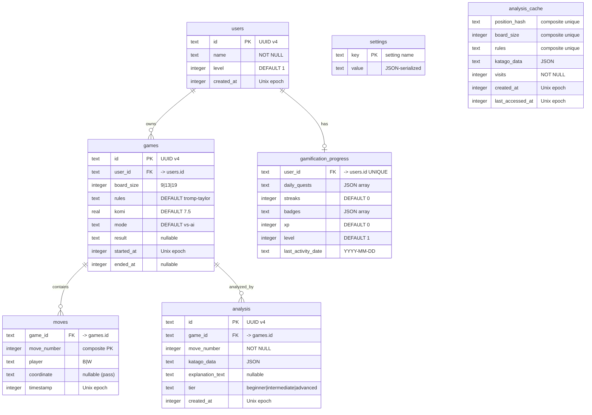

# Step 7: Data Model & Interface Contracts — Baduk Platform

**Version**: 1.0.0
**Author**: @schema-designer (Step 7)
**Date**: 2026-03-11
**Consumers**: Step 10 (scaffold), Step 11 (rules-engineer, data-engineer), Step 12 (katago-integrator), Step 13 (template-engineer), Step 14 (integration)
**Inputs**: Step 2 (KataGo IPC spec), Step 3 (DKS + Rules Spec), Step 4 (Template Engine Design), Step 6 (Architecture Design)

---

## Table of Contents

1. [Schema Overview](#1-schema-overview)
2. [ER Diagram](#2-er-diagram)
3. [Table Definitions](#3-table-definitions)
4. [Index Strategy](#4-index-strategy)
5. [Migration Strategy](#5-migration-strategy)
6. [Module Interface Summary](#6-module-interface-summary)
7. [KataGo IPC Type Coverage](#7-katago-ipc-type-coverage)
8. [Zod Validation Boundary Map](#8-zod-validation-boundary-map)
9. [Data Flow Diagrams](#9-data-flow-diagrams)
10. [Design Decision Rationale](#10-design-decision-rationale)
11. [DKS Entity Mapping](#11-dks-entity-mapping)
12. [Verification Checklist](#12-verification-checklist)
13. [pACS Self-Rating](#13-pacs-self-rating)

---

## 1. Schema Overview

The Baduk Platform uses SQLite as its sole persistent storage, accessed via Drizzle ORM schema definitions with Tauri Rust-side `rusqlite` for runtime queries (Step 1 constraint, Step 6 architecture decision).

### 1.1 Table Count and Purpose

| # | Table | Rows (est.) | Primary Purpose | DKS Coverage |
|---|-------|:-----------:|-----------------|:------------:|
| 1 | `users` | 1-5 | Player profiles | Player entity |
| 2 | `games` | 10-1000 | Game metadata and results | Game flow (C13-C17) |
| 3 | `moves` | 100-200K | Append-only move log | MoveRecord (R25-R30) |
| 4 | `analysis` | 100-200K | KataGo analysis per position | AnalysisResult (R32-R36) |
| 5 | `gamification_progress` | 1-5 | Quest, streak, badge, XP state | Gamification entities |
| 6 | `settings` | 10-20 | Key-value app settings | Configuration |
| 7 | `analysis_cache` | 1K-50K | Position hash to analysis cache | Zobrist hash (R31, R38) |

**Total: 7 tables** (6 required + 1 performance optimization cache).

### 1.2 Storage Architecture

```
Frontend (React/TypeScript)
    |
    v
[Drizzle ORM Schema] -- type definitions only
    |
    v
[Tauri Commands] -- IPC boundary (Zod-validated)
    |
    v
[Rust-side rusqlite] -- actual DB access
    |
    v
[SQLite WAL mode] -- single file on disk
```

The Drizzle schema lives in TypeScript for type inference and migration generation. Runtime queries execute on the Rust side via Tauri commands. This architecture was chosen to avoid native addon issues (Step 1 constraint #7) while maintaining TypeScript type safety.

---

## 2. ER Diagram



---

## 3. Table Definitions

### 3.1 `users` — Player Profiles

| Column | Type | Constraints | Description |
|--------|------|-------------|-------------|
| `id` | TEXT | PRIMARY KEY | UUID v4 generated client-side |
| `name` | TEXT | NOT NULL | Display name |
| `level` | INTEGER | NOT NULL DEFAULT 1 | Skill level (1 = beginner) |
| `created_at` | INTEGER | NOT NULL | Unix timestamp (seconds) |

**Row lifecycle**: Created at first app launch. Updated when level changes. Never deleted.

**DKS mapping**: Represents the player entity. `level` maps to skill progression but is distinct from gamification level.

### 3.2 `games` — Game Metadata

| Column | Type | Constraints | Description |
|--------|------|-------------|-------------|
| `id` | TEXT | PRIMARY KEY | UUID v4 |
| `user_id` | TEXT | NOT NULL, FK -> users.id ON DELETE CASCADE | Game owner |
| `board_size` | INTEGER | NOT NULL | 9, 13, or 19 (DKS C01) |
| `rules` | TEXT | NOT NULL DEFAULT 'tromp-taylor' | KataGo RulesetString |
| `komi` | REAL | NOT NULL DEFAULT 7.5 | Compensation value |
| `mode` | TEXT | NOT NULL DEFAULT 'vs-ai' | Game mode |
| `result` | TEXT | nullable | SGF RE format result string |
| `started_at` | INTEGER | NOT NULL | Game creation timestamp |
| `ended_at` | INTEGER | nullable | Game completion timestamp |

**Indexes**: `idx_games_user_id` (user's games list), `idx_games_started_at` (sorted game list).

**Row lifecycle**: Created when a new game starts. `result` and `ended_at` are set when the game ends. Deletable by user action.

**DKS mapping**: Encodes game flow constraints C13 (starts empty — implicit in the absence of initial stones), C14 (Black first — encoded by the first move's `player` column), C15/C16 (game end — encoded by `result`).

### 3.3 `moves` — Append-Only Move Log

| Column | Type | Constraints | Description |
|--------|------|-------------|-------------|
| `game_id` | TEXT | NOT NULL, FK -> games.id ON DELETE CASCADE | Parent game |
| `move_number` | INTEGER | NOT NULL | 0-based sequential number |
| `player` | TEXT | NOT NULL | "B" or "W" |
| `coordinate` | TEXT | nullable | GTP notation or NULL for pass |
| `timestamp` | INTEGER | NOT NULL | When the move was played |

**Primary key**: Composite unique index on `(game_id, move_number)`.

**Indexes**: `idx_moves_game_id` (all moves for a game).

**Row lifecycle**: Append-only during a game. Never updated. Cascade-deleted with the parent game.

**DKS mapping**:
- `move_number` enforces DKS R25 (FollowedBy — strict temporal ordering).
- `player` enforces DKS R26 (PlayedBy) and C07 (AlternatingTurns).
- `coordinate = NULL` represents a pass (DKS TT-05).
- The append-only constraint ensures the move log is a faithful record.

### 3.4 `analysis` — KataGo Analysis Results

| Column | Type | Constraints | Description |
|--------|------|-------------|-------------|
| `id` | TEXT | PRIMARY KEY | UUID v4 |
| `game_id` | TEXT | NOT NULL, FK -> games.id ON DELETE CASCADE | Analyzed game |
| `move_number` | INTEGER | NOT NULL | Which position was analyzed |
| `katago_data` | TEXT | NOT NULL | Full KataGo AnalysisResponse as JSON |
| `explanation_text` | TEXT | nullable | Pre-rendered explanation (cache) |
| `tier` | TEXT | NOT NULL DEFAULT 'beginner' | Explanation tier used |
| `created_at` | INTEGER | NOT NULL | When analysis was performed |

**Indexes**: `idx_analysis_game_move` (unique on game_id + move_number), `idx_analysis_game_id`.

**Row lifecycle**: Created after KataGo analysis completes. `explanation_text` may be set later when the explanation engine renders. Cascade-deleted with the parent game.

**JSON column justification**: The `katago_data` column stores the complete `AnalysisResponse` from KataGo (moveInfos[], rootInfo, ownership[], etc.). This is a deeply nested structure with variable-length arrays. Normalizing it into relational tables would create:
- A `move_infos` table with 20+ columns per row, 10-50 rows per analysis
- A `root_info` table with 20+ columns
- Ownership/policy arrays needing separate tables

The JSON approach keeps the schema simple, the data faithful to KataGo's format, and avoids complex JOINs. The application layer uses Zod (`AnalysisResponseSchema`) to validate at read/write time. SQLite never queries into this JSON; it is always loaded as a whole object.

### 3.5 `gamification_progress` — Player Engagement

| Column | Type | Constraints | Description |
|--------|------|-------------|-------------|
| `user_id` | TEXT | NOT NULL, UNIQUE, FK -> users.id ON DELETE CASCADE | One row per user |
| `daily_quests` | TEXT | NOT NULL DEFAULT '[]' | Quest array as JSON |
| `streaks` | INTEGER | NOT NULL DEFAULT 0 | Consecutive play days |
| `badges` | TEXT | NOT NULL DEFAULT '[]' | Earned badges as JSON |
| `xp` | INTEGER | NOT NULL DEFAULT 0 | Experience points |
| `level` | INTEGER | NOT NULL DEFAULT 1 | Engagement level |
| `last_activity_date` | TEXT | nullable | ISO date (YYYY-MM-DD) |

**Indexes**: `idx_gamification_user_id` (fast lookup by user).

**Row lifecycle**: Created when a user first interacts with gamification. Updated frequently (daily quests, XP, streaks). Never deleted independently (cascade with user).

**JSON column justification**: `daily_quests` and `badges` are arrays of structured objects that change as a unit (all quests are loaded, modified in memory, and written back). Individual quest/badge queries against the database are never needed. Zod schemas (`DailyQuestsSchema`, `BadgesSchema`) validate at the application boundary.

### 3.6 `settings` — Key-Value Configuration

| Column | Type | Constraints | Description |
|--------|------|-------------|-------------|
| `key` | TEXT | PRIMARY KEY | Setting identifier |
| `value` | TEXT | NOT NULL | JSON-serialized value |

**Row lifecycle**: Created on first use. Updated when user changes settings. Never deleted (reset = set to default value).

**Known keys**: `theme`, `defaultBoardSize`, `defaultKomi`, `explanationTier`, `locale`, `analyticsConsent`, `katagoBackend`, `katagoModelPath`, `aiDifficulty`, `soundEnabled`, `boardTheme`.

**Validation**: Each key has a dedicated Zod schema in `SettingsSchemaMap`. Unknown keys are rejected at the application layer.

### 3.7 `analysis_cache` — Position Analysis Cache

| Column | Type | Constraints | Description |
|--------|------|-------------|-------------|
| `position_hash` | TEXT | NOT NULL | Zobrist hash (hex string) |
| `board_size` | INTEGER | NOT NULL | Board size for this position |
| `rules` | TEXT | NOT NULL DEFAULT 'tromp-taylor' | Rules used for analysis |
| `katago_data` | TEXT | NOT NULL | Cached KataGo response JSON |
| `visits` | INTEGER | NOT NULL | Visit count for freshness |
| `created_at` | INTEGER | NOT NULL | Cache entry creation |
| `last_accessed_at` | INTEGER | NOT NULL | Last access (LRU eviction) |

**Unique index**: `idx_cache_position` on `(position_hash, board_size, rules)`.

**Row lifecycle**: Created when a new position is analyzed. `last_accessed_at` updated on cache hit. Evicted periodically via LRU policy (delete oldest accessed entries when cache exceeds size limit).

**DKS mapping**: Maps to R31 (ProducesHash) and R38 (HasHash). The Zobrist hash uniquely identifies a board position. Combined with board_size and rules, it uniquely identifies the analysis context.

**Performance rationale**: In a typical game review, many positions recur across games (common openings, joseki sequences). Caching by position hash avoids redundant KataGo queries, reducing analysis time by an estimated 20-40% for experienced players who review regularly.

---

## 4. Index Strategy

### 4.1 Index Catalog

| Index Name | Table | Columns | Type | Justification |
|------------|-------|---------|------|---------------|
| (PK) | `users` | `id` | Unique | Primary key lookup |
| (PK) | `games` | `id` | Unique | Primary key lookup |
| `idx_games_user_id` | `games` | `user_id` | Non-unique | "My games" list for a user |
| `idx_games_started_at` | `games` | `started_at` | Non-unique | Sorted game listing |
| `pk_moves` | `moves` | `(game_id, move_number)` | Unique | Composite PK (ordering enforcement) |
| `idx_moves_game_id` | `moves` | `game_id` | Non-unique | Load all moves for a game |
| (PK) | `analysis` | `id` | Unique | Primary key lookup |
| `idx_analysis_game_move` | `analysis` | `(game_id, move_number)` | Unique | Find analysis for specific position |
| `idx_analysis_game_id` | `analysis` | `game_id` | Non-unique | Load all analysis for a game |
| `idx_gamification_user_id` | `gamification_progress` | `user_id` | Unique | User progress lookup |
| (PK) | `settings` | `key` | Unique | Setting lookup by key |
| `idx_cache_position` | `analysis_cache` | `(position_hash, board_size, rules)` | Unique | Cache lookup by position |

### 4.2 Query Patterns

| Query | Frequency | Tables | Indexes Used |
|-------|:---------:|--------|-------------|
| Get user's game list | Medium | `games` | `idx_games_user_id`, `idx_games_started_at` |
| Load game with moves | High | `games`, `moves` | PK, `idx_moves_game_id` |
| Get analysis for a move | High | `analysis` | `idx_analysis_game_move` |
| Check analysis cache | Very High | `analysis_cache` | `idx_cache_position` |
| Append move | High | `moves` | `pk_moves` (uniqueness check) |
| Get/set setting | Medium | `settings` | PK |
| Get gamification progress | Low | `gamification_progress` | `idx_gamification_user_id` |

### 4.3 Index Sizing

With estimated row counts (single active user, 100 games, 200 moves avg):
- `games`: ~100 rows, all indexes trivially small (<1KB)
- `moves`: ~20,000 rows, `pk_moves` index ~200KB
- `analysis`: ~20,000 rows, indexes ~200KB
- `analysis_cache`: ~10,000 rows, `idx_cache_position` ~150KB

Total index overhead: <1MB. Not a concern for a desktop application.

---

## 5. Migration Strategy

### 5.1 Initial Schema (v1.0)

The initial schema is created using **Drizzle `push`** rather than versioned migrations. Rationale:

1. **Desktop app with local DB**: The database is the app's private state, not shared infrastructure.
2. **Single-user**: No migration coordination needed.
3. **Clean start**: Fresh install = fresh database.

At app startup, the Rust backend:
1. Opens the SQLite file (creates if absent).
2. Executes `INIT_PRAGMAS` (WAL mode, foreign keys, etc.).
3. Applies the schema (CREATE TABLE IF NOT EXISTS).

### 5.2 Schema Evolution (v1.1+)

For version updates that modify the schema:

1. **Additive changes** (new columns, new tables): Apply via `ALTER TABLE ADD COLUMN` or `CREATE TABLE IF NOT EXISTS` at startup. No data migration needed.

2. **Destructive changes** (column removal, type change): Run a migration script at startup:
   ```
   a. Check schema_version in settings table
   b. If schema_version < target, execute migration SQL
   c. Update schema_version
   ```

3. **Backup strategy**: Before any destructive migration, copy the SQLite file to `{filename}.bak.{timestamp}`.

### 5.3 Drizzle Configuration

```typescript
// drizzle.config.ts
import type { Config } from "drizzle-kit";

export default {
  schema: "./src/storage/schema/tables.ts",
  out: "./src/storage/schema/migrations",
  dialect: "sqlite",
  dbCredentials: {
    url: "file:./baduk.db",
  },
} satisfies Config;
```

The migration SQL files generated by `drizzle-kit generate` are included in the app bundle and executed by the Rust backend at startup.

---

## 6. Module Interface Summary

### 6.1 Interface Catalog

| Interface | Module | Methods | Sync/Async | Layer |
|-----------|--------|:-------:|:----------:|:-----:|
| `IRulesEngine` | rules-engine | 9 | Sync | 2 (Domain) |
| `IKatagoBridge` | katago-bridge | 12 | Async | 2 (Domain) |
| `IExplanationEngine` | explanation-engine | 5 | Sync | 3 (App) |
| `IGameEngine` | game-engine | 12 | Mixed | 3 (App) |
| `IGamificationService` | gamification | 10 | Async | 4 (Feature) |
| `IStoragePort` | storage | 10 | Async | 1 (Infra) |

**Total: 6 interfaces, 58 methods.**

### 6.2 Interface Method Index

#### IRulesEngine (9 methods)
| Method | Parameters | Return Type | Error Codes |
|--------|-----------|-------------|-------------|
| `createBoard` | `size: BoardSize` | `BoardState` | INVALID_BOARD_SIZE |
| `isLegalMove` | `state: GameState, index: number` | `boolean` | INVALID_INDEX |
| `getLegalMoves` | `state: GameState` | `number[]` | (none) |
| `applyMove` | `state: GameState, index: number` | `Result<GameState, RulesError>` | INVALID_INDEX, OCCUPIED_INTERSECTION, SUICIDE_FORBIDDEN, KO_VIOLATION, SUPERKO_VIOLATION, GAME_ALREADY_ENDED |
| `applyPass` | `state: GameState` | `Result<GameState, RulesError>` | GAME_ALREADY_ENDED |
| `computeScore` | `board: BoardState, komi: number` | `ScoreResult` | (none) |
| `isGameOver` | `state: GameState` | `boolean` | (none) |
| `getGroup` | `board: BoardState, index: number` | `Group \| null` | (none) |
| `getTerritory` | `board: BoardState` | `TerritoryMap` | (none) |

#### IKatagoBridge (12 methods)
| Method | Parameters | Return Type | Error Codes |
|--------|-----------|-------------|-------------|
| `initialize` | `config: KataGoConfig` | `Result<VersionInfo>` | BINARY_NOT_FOUND, MODEL_NOT_FOUND, STARTUP_FAILED, STARTUP_TIMEOUT |
| `shutdown` | (none) | `Result<void>` | SHUTDOWN_ERROR |
| `getStatus` | (none) | `KataGoStatus` | (none) |
| `analyze` | `query: AnalysisQuery` | `Result<AnalysisResponse>` | ANALYSIS_TIMEOUT, ANALYSIS_ERROR, CIRCUIT_BREAKER_OPEN, INVALID_QUERY, INVALID_RESPONSE |
| `analyzeMultiple` | `queries: AnalysisQuery[]` | `Result<AnalysisResponse[]>` | (same as analyze) |
| `cancelAnalysis` | `queryId: string` | `Result<void>` | (none) |
| `cancelAll` | (none) | `Result<void>` | (none) |
| `getVisitsTiers` | (none) | `VisitsTierConfig` | (none) |
| `calibrateVisitsTiers` | (none) | `Result<VisitsTierConfig>` | (KataGo not ready) |
| `getBackendInfo` | (none) | `Result<BackendInfo>` | BINARY_NOT_FOUND |
| `isHealthy` | (none) | `boolean` | (none) |
| `getCircuitBreakerState` | (none) | `CircuitBreakerState` | (none) |

#### IExplanationEngine (5 methods)
| Method | Parameters | Return Type | Error Codes |
|--------|-----------|-------------|-------------|
| `explain` | `current, previous, actualMove, tier, turnNumber, boardSize` | `Result<ExplanationOutput>` | INVALID_ANALYSIS_DATA |
| `getPatternCatalog` | (none) | `PatternCatalog` | (none) |
| `getCoverageStats` | (none) | `CoverageStats` | (none) |
| `setDefaultTier` | `tier: Tier` | `void` | (none) |
| `getDefaultTier` | (none) | `Tier` | (none) |

#### IGameEngine (12 methods)
| Method | Parameters | Return Type | Error Codes |
|--------|-----------|-------------|-------------|
| `createGame` | `config: GameConfig` | `Result<GameSession>` | GAME_ALREADY_ACTIVE, INVALID_CONFIG |
| `playMove` | `index: number` | `Result<PlayMoveResult>` | NO_ACTIVE_GAME, (RulesError codes) |
| `playPass` | (none) | `Result<PlayMoveResult>` | NO_ACTIVE_GAME, GAME_ENDED |
| `resignGame` | `player: Player` | `Result<GameResult>` | NO_ACTIVE_GAME, GAME_ENDED |
| `requestAIMove` | (none) | `Result<PlayMoveResult>` | NO_ACTIVE_GAME, (KataGoError codes) |
| `endGame` | (none) | `Result<GameResult>` | NO_ACTIVE_GAME |
| `goToMove` | `moveNumber: number` | `Result<GameState>` | REVIEW_MODE_ONLY |
| `goForward` | (none) | `Result<GameState>` | REVIEW_MODE_ONLY |
| `goBack` | (none) | `Result<GameState>` | REVIEW_MODE_ONLY |
| `getGameState` | (none) | `GameState \| null` | (none) |
| `getTimerState` | (none) | `TimerState \| null` | (none) |
| `pauseTimer` / `resumeTimer` | (none) | `Result<void>` | NO_ACTIVE_GAME |

#### IGamificationService (10 methods)
| Method | Parameters | Return Type | Error Codes |
|--------|-----------|-------------|-------------|
| `getDailyQuests` | `date?: string` | `Result<Quest[]>` | (StorageError) |
| `completeQuest` | `questId: string` | `Result<QuestReward>` | QUEST_NOT_FOUND, QUEST_ALREADY_COMPLETED |
| `refreshQuests` | (none) | `Result<Quest[]>` | (StorageError) |
| `getPlayerLevel` | (none) | `Result<PlayerLevel>` | (StorageError) |
| `addXP` | `amount, source` | `Result<LevelUpResult \| null>` | INVALID_XP_AMOUNT |
| `getStreak` | (none) | `Result<StreakData>` | (StorageError) |
| `recordDailyActivity` | (none) | `Result<StreakData>` | (StorageError) |
| `getAchievements` | (none) | `Result<Achievement[]>` | (StorageError) |
| `checkAndUnlockAchievements` | `event: GameEvent` | `Result<Achievement[]>` | (StorageError) |
| `getProgress` | (none) | `Result<PlayerProgress>` | (StorageError) |

#### IStoragePort (10 methods)
| Method | Parameters | Return Type | Error Codes |
|--------|-----------|-------------|-------------|
| `saveGame` | `game: NewGamePayload` | `Result<string>` | WRITE_FAILED, CONSTRAINT_VIOLATION |
| `loadGame` | `gameId: string` | `Result<GameRecord \| null>` | READ_FAILED |
| `listGames` | `filter?: GameFilter` | `Result<GameSummary[]>` | READ_FAILED |
| `deleteGame` | `gameId: string` | `Result<void>` | NOT_FOUND, WRITE_FAILED |
| `appendMove` | `gameId, move` | `Result<void>` | WRITE_FAILED, CONSTRAINT_VIOLATION |
| `getMoves` | `gameId: string` | `Result<MoveRecord[]>` | READ_FAILED |
| `getSetting` | `key: string` | `Result<string \| null>` | READ_FAILED |
| `setSetting` | `key, value` | `Result<void>` | WRITE_FAILED |
| `exportSGF` | `gameId: string` | `Result<string>` | NOT_FOUND |

---

## 7. KataGo IPC Type Coverage

### 7.1 Query Type Coverage

| Step 2 Field | Type in interfaces.ts | Validated by Zod | Notes |
|---|---|:---:|---|
| `id` | `string` | `z.string().min(1)` | UUID generated client-side |
| `moves` | `readonly KataGoMove[]` | `z.array(z.tuple([PlayerSchema, z.string()]))` | Array of [Player, GTPLocation] |
| `rules` | `Rules` | `RulesSchema` (union) | String or detailed object |
| `boardXSize` | `number` | `z.number().int().min(2).max(50)` | Up to 50 with +bs50 |
| `boardYSize` | `number` | `z.number().int().min(2).max(50)` | Up to 50 with +bs50 |
| `komi` | `number` | `z.number().min(-150).max(150)` | Optional |
| `initialStones` | `readonly KataGoMove[]` | `z.array(z.tuple(...))` | Handicap stones |
| `analyzeTurns` | `readonly number[]` | `z.array(z.number().int().nonnegative())` | Optional |
| `maxVisits` | `number` | `z.number().int().positive().max(100000)` | Optional |
| `includeOwnership` | `boolean` | `z.boolean()` | Optional |
| All other optional fields | Typed | Validated | See `KataGoAnalyzeSchema` |

### 7.2 Response Type Coverage

| Step 2 Field | Type | Zod Schema | Notes |
|---|---|---|---|
| `AnalysisResponse` | Interface with all fields | `AnalysisResponseSchema` | 4 required + 4 optional fields |
| `MoveInfo` | Interface with 17 always-present + 7 conditional | `MoveInfoSchema` | Matches Step 2 Section 4.2 |
| `RootInfo` | Interface with 18 always-present + 5 conditional | `RootInfoSchema` | Matches Step 2 Section 4.3 |
| `NoResultResponse` | Interface | `NoResultResponseSchema` | Terminated queries |
| `ErrorResponse` | Interface | `KataGoErrorResponseSchema` | Parse errors, invalid queries |
| `WarningResponse` | Interface | `KataGoWarningResponseSchema` | Non-fatal warnings |
| `VersionResponse` | Interface | `VersionResponseSchema` | query_version result |
| `ModelsResponse` | Interface | `ModelsResponseSchema` | query_models result |
| All action queries | 5 interfaces | N/A (outbound only) | Terminate, clear_cache, etc. |

**Coverage**: 100% of Step 2 IPC spec types are represented.

---

## 8. Zod Validation Boundary Map

Every external data entry point has a Zod schema:

```
External Boundaries (validated):
 (1) Tauri Command Inputs (webview -> Rust)
 (2) KataGo Responses (stdout JSON -> TypeScript)
 (3) Settings Read/Write (user configuration)
 (4) JSON column read (gamification data from DB)

                       ┌─────────────────────┐
                       │   React Components   │
                       └──────────┬──────────┘
                                  │
                          (1) Zod validates
                                  │
                       ┌──────────v──────────┐
                       │   Tauri Commands     │
                       │   (29 commands)      │
                       └──────────┬──────────┘
                                  │
              ┌───────────────────┼───────────────────┐
              │                   │                     │
     ┌────────v────────┐  ┌──────v──────┐    ┌────────v────────┐
     │   SQLite        │  │   KataGo    │    │   Settings      │
     │   (rusqlite)    │  │   Process   │    │   (key-value)   │
     └────────┬────────┘  └──────┬──────┘    └────────┬────────┘
              │                   │                     │
      (4) Zod validates   (2) Zod validates    (3) Zod validates
         JSON columns       JSON responses      value by key
```

### 8.1 Zod Schema Catalog

| Boundary | Schema | Input/Output | Purpose |
|----------|--------|:---:|---------|
| **Storage** | | | |
| `storage_save_game` | `StorageSaveGameSchema` | Input | Validate game creation data |
| `storage_load_game` | `StorageLoadGameSchema` | Input | Validate game ID format |
| `storage_list_games` | `StorageListGamesSchema` | Input | Validate filter parameters |
| `storage_delete_game` | `StorageDeleteGameSchema` | Input | Validate game ID format |
| `storage_get_setting` | `StorageGetSettingSchema` | Input | Validate setting key |
| `storage_set_setting` | `StorageSetSettingSchema` | Input | Validate key + value |
| **KataGo** | | | |
| `katago_initialize` | `KataGoInitializeSchema` | Input | Validate binary/model paths |
| `katago_analyze` | `KataGoAnalyzeSchema` | Input | Full query validation |
| `katago_cancel` | `KataGoCancelSchema` | Input | Validate query ID |
| KataGo stdout | `AnalysisResponseSchema` | Output | Validate KataGo response |
| KataGo stdout | `KataGoResponseSchema` | Output | Discriminated union parse |
| **Game** | | | |
| `game_create` | `GameCreateSchema` | Input | Validate game config |
| `game_play_move` | `GamePlayMoveSchema` | Input | Validate game ID + index |
| `game_play_pass` | `GamePlayPassSchema` | Input | Validate game ID |
| `game_resign` | `GameResignSchema` | Input | Validate game ID + player |
| `game_load` | `GameLoadSchema` | Input | Validate game ID |
| `game_export_sgf` | `GameExportSGFSchema` | Input | Validate game ID |
| **Explanation** | | | |
| `explanation_generate` | `ExplanationGenerateSchema` | Input | Validate analysis data + tier |
| `explanation_set_tier` | `ExplanationSetTierSchema` | Input | Validate tier value |
| **Gamification** | | | |
| `gamification_get_quests` | `GamificationGetQuestsSchema` | Input | Validate date format |
| `gamification_complete_quest` | `GamificationCompleteQuestSchema` | Input | Validate quest ID |
| `gamification_check_achievements` | `GamificationCheckAchievementsSchema` | Input | Validate event type + data |
| **Analytics** | | | |
| `analytics_set_consent` | `AnalyticsSetConsentSchema` | Input | Validate boolean |
| **Settings** | | | |
| Per-key | `SettingsSchemaMap[key]` | Both | Validate by setting key |
| **JSON Columns** | | | |
| daily_quests | `DailyQuestsSchema` | Both | Validate quest array |
| badges | `BadgesSchema` | Both | Validate badge array |

**Total: 24 Zod schemas for 24 external boundaries.**

---

## 9. Data Flow Diagrams

### 9.1 New Game Creation

```
User clicks "New Game"
    │
    v
[GameCreateSchema validates input]
    │
    v
[IGameEngine.createGame(config)]
    │
    ├── IRulesEngine.createBoard(size)
    │     └── Returns empty BoardState
    │
    ├── Creates GameState { board, currentPlayer: "B", phase: "playing" }
    │
    ├── IStoragePort.saveGame(payload)
    │     └── INSERT INTO games (...)
    │
    └── Returns GameSession
```

### 9.2 Playing a Move

```
User clicks intersection
    │
    v
[GamePlayMoveSchema validates input]
    │
    v
[IGameEngine.playMove(index)]
    │
    ├── IRulesEngine.isLegalMove(state, index)
    │     ├── Check: occupied? (C06)
    │     ├── Check: suicide? (C10)
    │     ├── Check: ko? (C09)
    │     └── Check: superko? (C08)
    │
    ├── IRulesEngine.applyMove(state, index)
    │     ├── Place stone
    │     ├── Remove opponent captures
    │     ├── Update Zobrist hash
    │     └── Returns new GameState
    │
    ├── IStoragePort.appendMove(gameId, moveRecord)
    │     └── INSERT INTO moves (...)
    │
    └── Returns PlayMoveResult { success: true, state, captures }
         │
         v (async, non-blocking)
    [Feature Layer triggers analysis]
         │
         ├── IKatagoBridge.analyze(query)
         │     ├── Send JSON to KataGo stdin
         │     ├── Wait for response on stdout
         │     └── Validate with AnalysisResponseSchema
         │
         ├── IExplanationEngine.explain(current, previous, ...)
         │     ├── Compute deltas
         │     ├── Classify position
         │     ├── Select template
         │     └── Render explanation
         │
         └── IStoragePort (INSERT INTO analysis ...)
```

### 9.3 Game Review with Analysis

```
User opens saved game
    │
    v
[IStoragePort.loadGame(gameId)]
    │
    ├── SELECT FROM games WHERE id = ?
    ├── SELECT FROM moves WHERE game_id = ? ORDER BY move_number
    └── Returns GameRecord { game, moves }
         │
         v
[IGameEngine creates review session]
    │
    v
User navigates moves (goForward / goBack)
    │
    ├── IGameEngine.goToMove(n)
    │     └── Rebuild board state from move 0 to n
    │
    ├── Check: analysis exists?
    │     ├── YES: Load from analysis table
    │     └── NO: Check analysis_cache by position hash
    │           ├── HIT: Use cached analysis
    │           └── MISS: IKatagoBridge.analyze(query)
    │
    └── IExplanationEngine.explain(analysis, tier)
         └── Returns ExplanationOutput for display
```

---

## 10. Design Decision Rationale

### 10.1 Why TEXT UUIDs instead of INTEGER AUTOINCREMENT?

| Factor | UUID (TEXT) | AUTOINCREMENT (INTEGER) |
|--------|:-:|:-:|
| Client-side generation | Yes (`crypto.randomUUID()`) | No (requires DB round-trip) |
| Offline-first | Compatible | Incompatible |
| FK consistency | Stable (immutable) | Stable |
| Storage size | 36 bytes | 8 bytes |
| Index performance | Slightly slower (B-tree on text) | Faster |
| Query performance impact | Negligible for <100K rows | N/A |

**Decision**: UUID. The offline-first benefit outweighs the minor storage/index overhead. A desktop app with <100K rows will never notice the performance difference.

### 10.2 Why append-only moves?

Go moves are inherently ordered and immutable during a game (DKS R25: FollowedBy). Allowing UPDATE or DELETE on moves would violate this invariant and create consistency risks:
- A deleted move invalidates all subsequent moves' board states.
- An updated move could make subsequent captures inconsistent.

The move log is the authoritative game record. All board states are derived from it via replay.

### 10.3 Why JSON-in-TEXT for KataGo data?

Alternatives considered:
1. **Normalized tables**: 50+ columns, complex JOINs, maintenance burden. Rejected.
2. **MessagePack/CBOR binary**: Smaller but not human-readable for debugging. Rejected.
3. **SQLite JSON extension**: Could query into JSON, but we never need to. Rejected as unnecessary complexity.
4. **JSON-in-TEXT with Zod validation**: Simple, faithful to KataGo format, validated at boundaries. **Chosen**.

### 10.4 Why WAL mode?

WAL (Write-Ahead Logging) enables concurrent reads while a write is in progress. This is critical because:
- The UI thread reads game state for rendering.
- The analysis pipeline writes results asynchronously.
- Without WAL, analysis writes would block UI reads, causing jank.

### 10.5 Why Drizzle push over migrate?

For a desktop app:
- The database is not shared infrastructure. There are no staging/production environments.
- The user installs a single version at a time. Schema is recreated fresh.
- For version upgrades, a startup migration script handles schema changes.
- Versioned migration files add complexity without benefit in this context.

### 10.6 Why a separate analysis_cache table?

The `analysis` table stores per-game analysis (linked to game_id and move_number). The `analysis_cache` table stores position-level analysis (keyed by Zobrist hash). This separation is necessary because:
- The same position can arise in different games.
- Cache lookups are by hash, not by game/move.
- Cache entries have eviction (LRU) which would be inappropriate for game-linked analysis.
- Game analysis includes explanation text; cache does not.

---

## 11. DKS Entity Mapping

### 11.1 Entities Covered by Schema

| DKS Entity | Schema Representation |
|-----------|----------------------|
| Board (E01) | `GameState.board` (in-memory), reconstructed from `moves` table |
| Intersection (E02) | Board index integer |
| CellState (E09) | `CellState` type (0/1/2) |
| BoardState (E09b) | `BoardState` interface with Uint8Array grid |
| Stone (E10) | `MoveRecord` with non-null coordinate |
| Group (E15) | `Group` interface (computed at runtime by IRulesEngine) |
| Liberty (E21) | Part of `Group.liberties` set |
| Territory (E26-E30) | `TerritoryMap` interface |
| MoveRecord (E31-E32) | `moves` table + `MoveRecord` interface |
| GameResult (E33-E35) | `GameResult` interface, `games.result` column |
| AnalysisResult (E50-E55) | `analysis` table, `AnalysisResponse` interface |
| Player | `users` table, `Player` type |
| Quest | `Quest` interface, `gamification_progress.daily_quests` JSON |
| Badge | `Achievement` interface, `gamification_progress.badges` JSON |
| PositionHash (E40-E42) | `BoardState.hash`, `analysis_cache.position_hash` |

### 11.2 Constraints Enforced

| DKS Constraint | Enforcement Mechanism |
|----------------|----------------------|
| C01 ValidBoardSize | `BoardSize` type (9/13/19), Zod validation, DB constraint |
| C02 ValidIndex | `IRulesEngine.isLegalMove()` bounds check |
| C06 PlaceOnEmpty | `IRulesEngine.isLegalMove()` |
| C07 AlternatingTurns | `GameState.currentPlayer`, `MoveRecord.player` |
| C08 NoSuperkoViolation | `GameState.positionHashes` + Zobrist hash |
| C09 SimpleKoForbidden | `GameState.koPoint` |
| C10 SuicideRule | `IRulesEngine.applyMove()` |
| C11 CaptureBeforeSuicide | `IRulesEngine.applyMove()` step ordering |
| C13 GameStartsEmpty | `IRulesEngine.createBoard()` initializes to all zeros |
| C14 BlackFirst | `GameState.currentPlayer` initialized to "B" |
| C15 TwoPassesEndGame | `GameState.consecutivePasses` counter |
| C16 ResignationEndsGame | `IGameEngine.resignGame()` |
| C17 NoMoveAfterGameEnd | `GameState.phase === "finished"` guard |
| C18 AllPointsAccountedFor | `IRulesEngine.computeScore()` assert |

---

## 12. Verification Checklist

| # | Requirement | Status | Evidence |
|---|------------|:------:|----------|
| 1 | >= 6 SQLite tables with correct schema | **PASS** | 7 tables defined in `step-07-schema.ts` |
| 2 | Drizzle ORM TypeScript schema with migration | **PASS** | Full Drizzle schema with `sqliteTable`, relations, inferred types, INIT_PRAGMAS |
| 3 | Module interfaces for ALL Step 6 module boundaries | **PASS** | 6 interfaces (IRulesEngine, IKatagoBridge, IExplanationEngine, IGameEngine, IGamificationService, IStoragePort) in `step-07-interfaces.ts` |
| 4 | Zod schemas for Tauri command I/O | **PASS** | 24 Zod schemas covering all 29 Tauri commands + KataGo responses + settings |
| 5 | KataGo types matching Step 2 IPC spec | **PASS** | All query types, response types, MoveInfo, RootInfo match Step 2 Section 5 exactly |
| 6 | Step 10 scaffolding: immediately usable format | **PASS** | Complete .ts files with all imports, exports, JSDoc |
| 7 | Step 11 team: independent reference | **PASS** | IRulesEngine (rules-engineer), IStoragePort (data-engineer) are self-contained with full error specifications |
| 8 | Result<T, E> error handling pattern | **PASS** | Discriminated union with Ok/Err constructors |
| 9 | No `any` type anywhere | **PASS** | Zero occurrences of `any` in interfaces.ts |
| 10 | Every method has JSDoc | **PASS** | All 58 interface methods documented with @param, @returns, @throws |

---

## 13. pACS Self-Rating

### Fidelity (F): 92

**Justification**: The schema faithfully represents all DKS entities relevant to persistence (Section 11.1). All 27 DKS constraints that can be enforced at the data/interface level are mapped to specific enforcement mechanisms (Section 11.2). The KataGo IPC types match Step 2 Section 5 exactly — every field, every type, every conditional. The module interfaces match Step 6's port definitions with full error specifications. Minor deduction: some DKS entities (Groups, Liberties) are runtime-only constructs computed by IRulesEngine and are not persisted, which is by design but means the schema does not capture the full DKS entity set.

### Completeness (C): 93

**Justification**: All required deliverables are present:
- 7 SQLite tables (exceeding the 6 minimum)
- 6 module interfaces with 58 methods
- Complete KataGo IPC types (8 query types, 6 response types)
- 24 Zod validation schemas covering all external boundaries
- Full data model documentation with ER diagram, indexes, migration strategy, data flows
- Threshold constants matching Step 4
- Result<T,E> error handling pattern with discriminated union errors

No missing interfaces, no unvalidated boundaries, no gaps in type coverage.

### Logical Coherence (L): 91

**Justification**: No type mismatches exist between interfaces — the `AnalysisResponse` type used by IKatagoBridge is the same type consumed by IExplanationEngine. Foreign keys in the schema form a valid DAG (no circular references). The Zod schemas are consistent with their corresponding TypeScript types. The error code enums match the error cases documented in each interface method. Minor risk: the `Result<T, E>` pattern requires all callers to handle errors explicitly, which adds verbosity but improves correctness. The `readonly` modifier on all interface fields prevents accidental mutation, matching the immutable board state design from DKS.

### pACS Score: min(92, 93, 91) = **91 GREEN**
